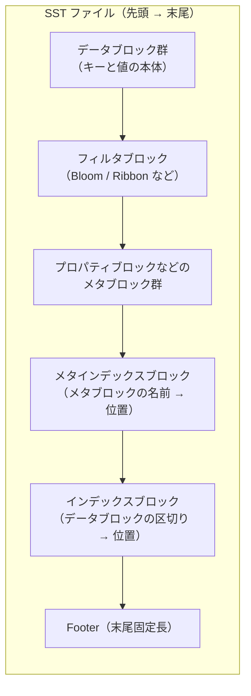
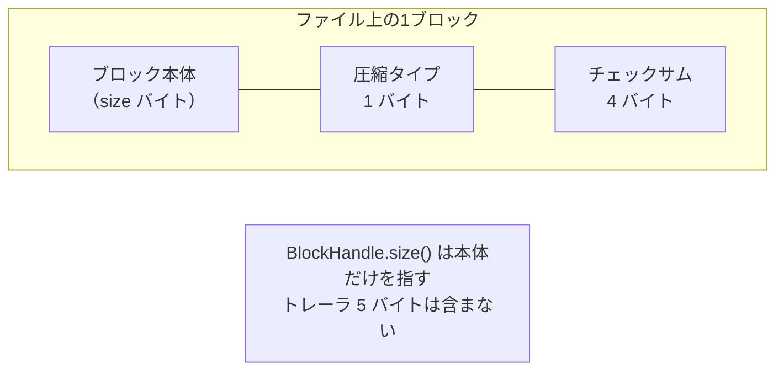
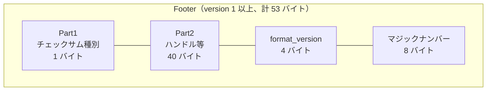

# 第14章 テーブルフォーマット概論

> **本章で読むソース**
>
> - [`table/format.h`](https://github.com/facebook/rocksdb/blob/v11.1.1/table/format.h)
> - [`table/format.cc`](https://github.com/facebook/rocksdb/blob/v11.1.1/table/format.cc)
> - [`table/block_based/block_based_table_reader.h`](https://github.com/facebook/rocksdb/blob/v11.1.1/table/block_based/block_based_table_reader.h)
> - [`table/block_based/block_based_table_builder.cc`](https://github.com/facebook/rocksdb/blob/v11.1.1/table/block_based/block_based_table_builder.cc)
> - [`include/rocksdb/table.h`](https://github.com/facebook/rocksdb/blob/v11.1.1/include/rocksdb/table.h)

## この章の狙い

SST は RocksDB がディスクに残す唯一の本体である。
本章では、その SST ファイルが先頭から末尾までどう並んでいるか、ファイルだけを見てどうやって中身を辿れるかを、`table/format.h` と `table/format.cc` のコードに沿って明らかにする。
ブロックを指すポインタである `BlockHandle`、各ブロックの末尾に付くトレーラ、そして末尾固定長の `Footer` という三つの部品を押さえれば、以降の章で扱うインデックスやフィルタやチェックサムが、このレイアウトのどこに収まるかを位置づけられるようになる。

## 前提

- [第13章 Flush](../part02-write-path/13-flush.md)

フラッシュは満杯になった MemTable を L0 の SST として書き出す処理だった。
そこで「SST を書き出す」と一言で済ませた部分の中身が、本章で扱うファイルフォーマットである。

## SST が解く問題

MemTable はメモリ上の探索木なので、ポインタをたどればどのキーにも到達できる。
ディスク上のファイルにはポインタがない。
あるのは「先頭からのバイトオフセット」と「長さ」だけである。
SST フォーマットが解くのは、ポインタを使わずに、キーの検索とブロックの取り出しをファイルのバイト範囲だけで成立させる問題である。

RocksDB はこれを二段階で解く。
第一に、ファイルをブロックという固定的な単位に区切り、ブロックの位置を `(offset, size)` の組で表す。
第二に、ファイルの末尾に固定長の領域を置き、そこから「どのブロックがどこにあるか」を記したインデックスへ辿れるようにする。
末尾を固定長にするのは、ファイルサイズさえ分かれば、ファイルの最後の数十バイトを読むだけで全体の地図を手に入れられるからである。

## SST ファイル全体のレイアウト

SST ファイルは、先頭から順に次のように並ぶ。



データブロック群がファイルの大半を占める。
そこにキーと値が、キー順にブロックへ詰められている。
その後ろにフィルタやプロパティといったメタブロックが続き、さらにそれらを名前で引くためのメタインデックスブロック、データブロックの区切りを引くためのインデックスブロックが置かれる。
最後に固定長の `Footer` が来る。

この並びは「本体が先、地図が後」という構造になっている。
ビルダはデータブロックを書き終えてからでないと、各ブロックの最終的な位置を確定できない。
位置が確定したものを後ろにまとめて書くので、インデックスやメタインデックスはファイルの末尾寄りに置かれる。
読み手はこの順序を逆向きにたどる。
まず末尾の `Footer` を読み、そこからメタインデックスとインデックスの位置を得て、必要なデータブロックだけをピンポイントで読む。

## ブロックを指すポインタ `BlockHandle`

ファイル内のあらゆるブロックは、`BlockHandle` という小さな構造体で指される。
中身はオフセットとサイズの二つの整数だけである。

[`table/format.h` L44-L90](https://github.com/facebook/rocksdb/blob/v11.1.1/table/format.h#L44-L90)

```cpp
// BlockHandle is a pointer to the extent of a file that stores a data
// block or a meta block.
class BlockHandle {
 public:
  // ... (中略) ...
  // The offset of the block in the file.
  uint64_t offset() const { return offset_; }
  void set_offset(uint64_t _offset) { offset_ = _offset; }

  // The size of the stored block, this size does not include the block trailer.
  uint64_t size() const { return size_; }
  // ... (中略) ...
 private:
  uint64_t offset_;
  uint64_t size_;

  static const BlockHandle kNullBlockHandle;
};
```

`offset()` はブロックがファイルの先頭から何バイト目に始まるか、`size()` はブロック本体が何バイトかを表す。
コメントにあるとおり、`size()` には後述するブロックトレーラの分は含まれない。
この `(offset, size)` がそのままファイル内ポインタの役割を果たす。
インデックスブロックがデータブロックを指すのも、`Footer` がメタインデックスを指すのも、すべてこの `BlockHandle` である。

`BlockHandle` をファイルに書くときは、固定長ではなく可変長整数（varint）で符号化する。

[`table/format.cc` L48-L62](https://github.com/facebook/rocksdb/blob/v11.1.1/table/format.cc#L48-L62)

```cpp
void BlockHandle::EncodeTo(std::string* dst) const {
  // Sanity check that all fields have been set
  assert(offset_ != ~uint64_t{0});
  assert(size_ != ~uint64_t{0});
  PutVarint64Varint64(dst, offset_, size_);
}

char* BlockHandle::EncodeTo(char* dst) const {
  // ... (中略) ...
  char* cur = EncodeVarint64(dst, offset_);
  cur = EncodeVarint64(cur, size_);
  return cur;
}
```

`PutVarint64Varint64` はオフセットとサイズを続けて varint64 で書き出す。
varint64 は値が小さいほど少ないバイト数で済む符号化なので、オフセットやサイズが小さいうちは 8 バイトの整数をそのまま書くより短くなる。
ただし最悪長は決まっており、ヘッダで `kMaxEncodedLength = 2 * kMaxVarint64Length` と定義されている（[`table/format.h` L75-L76](https://github.com/facebook/rocksdb/blob/v11.1.1/table/format.h#L75-L76)）。
`kMaxVarint64Length` は 10 なので、`BlockHandle` 一つの最大符号化長は 20 バイトである。
この上限値は、後で見る `Footer` の長さを固定するために使われる。

`offset == 0` かつ `size == 0` の `BlockHandle` は、どこも指さない null ハンドルとして扱われる（[`table/format.h` L69-L73](https://github.com/facebook/rocksdb/blob/v11.1.1/table/format.h#L69-L73)）。

## ブロックトレーラ

`BlockHandle` の `size()` がブロック本体の長さだけを指すのは、本体の後ろにトレーラが付くからである。
ブロックをファイルへ書くたびに、ビルダは本体の直後に固定の 5 バイトを追加する。
そのサイズはリーダ側で定数として定義されている。

[`table/block_based/block_based_table_reader.h` L77-L78](https://github.com/facebook/rocksdb/blob/v11.1.1/table/block_based/block_based_table_reader.h#L77-L78)

```cpp
  // 1-byte compression type + 32-bit checksum
  static constexpr size_t kBlockTrailerSize = 5;
```

トレーラの中身は、コメントが述べるとおり、1 バイトの圧縮タイプと 32 ビット（4 バイト）のチェックサムである。
ビルダがブロック本体を書いた直後にこのトレーラを組み立てる箇所を見ると、構成がはっきりする。

[`table/block_based/block_based_table_builder.cc` L2135-L2156](https://github.com/facebook/rocksdb/blob/v11.1.1/table/block_based/block_based_table_builder.cc#L2135-L2156)

```cpp
  r->compression_types_used.Add(comp_type);
  std::array<char, kBlockTrailerSize> trailer;
  trailer[0] = comp_type;
  uint32_t checksum = ComputeBuiltinChecksumWithLastByte(
      r->table_options.checksum, block_contents.data(), block_contents.size(),
      /*last_byte*/ comp_type);
  checksum += ChecksumModifierForContext(r->base_context_checksum, offset);
  // ... (中略) ...
  EncodeFixed32(trailer.data() + 1, checksum);
  // ... (中略) ...
    io_s = r->file->Append(io_options, Slice(trailer.data(), trailer.size()));
```

`trailer[0]` に圧縮タイプ（`comp_type`）を置き、続く 4 バイトにチェックサムを `EncodeFixed32` で書く。
チェックサムは、ブロック本体に圧縮タイプの 1 バイトを加えた範囲に対して計算される。
圧縮タイプまで含めて検査するので、トレーラの圧縮タイプ自体が壊れても検出できる。



ブロックごとに独立したチェックサムを持つ設計には、明確な狙いがある。
RocksDB はあるブロックを読むとき、`BlockHandle` で指された本体とその直後の 5 バイトだけを取り出し、その範囲だけでチェックサムを検証できる。
ファイル全体を読み直さずに、いま使うブロックの健全性をブロック単位で確かめられる。
これは Block Cache とも噛み合う。
キャッシュにはブロック単位で出し入れするので、検証もブロック単位で閉じているほうが扱いやすい。
チェックサムの種類と検証の詳細は[第21章](21-checksum.md)で扱う。

## Footer の構造

`Footer` は、すべての SST ファイルの末尾に置かれる固定情報である。
ヘッダのコメントは、その役割を「メタインデックスブロックの下に置けないものだけをここに入れる」と説明している。

[`table/format.h` L223-L232](https://github.com/facebook/rocksdb/blob/v11.1.1/table/format.h#L223-L232)

```cpp
// Footer encapsulates the fixed information stored at the tail end of every
// SST file. In general, it should only include things that cannot go
// elsewhere under the metaindex block. For example, checksum_type is
// required for verifying metaindex block checksum (when applicable), but
// index block handle can easily go in metaindex block. See also FooterBuilder
// below.
class Footer {
 public:
  // Create empty. Populate using DecodeFrom.
  Footer() {}
  // ... (中略) ...
```

`Footer` が保持する主なフィールドは、テーブルマジックナンバー、`format_version`、チェックサム種別、メタインデックスハンドル、インデックスハンドルである（[`table/format.h` L309-L315](https://github.com/facebook/rocksdb/blob/v11.1.1/table/format.h#L309-L315)）。

### マジックナンバー

ファイル末尾の最後の 8 バイトはマジックナンバーである。
長さは定数で 8 バイトと決まっている（[`table/format.h` L34-L35](https://github.com/facebook/rocksdb/blob/v11.1.1/table/format.h#L34-L35)）。
ブロックベーステーブルのマジックナンバーは、ビルダ側で次の値に定義されている。

[`table/block_based/block_based_table_builder.cc` L128-L136](https://github.com/facebook/rocksdb/blob/v11.1.1/table/block_based/block_based_table_builder.cc#L128-L136)

```cpp
// kBlockBasedTableMagicNumber was picked by running
//    echo rocksdb.table.block_based | sha1sum
// and taking the leading 64 bits.
// ... (中略) ...
const uint64_t kBlockBasedTableMagicNumber = 0x88e241b785f4cff7ull;
```

このマジックナンバーは、ファイルが RocksDB の SST であること、そしてどの種類のテーブルフォーマットかを示す。
リーダは末尾 8 バイトを読んでこの値と照合し、フォーマットを判別する。

### Footer の長さは version で決まる

`Footer` の符号化長は固定だが、format_version によって長さが二通りある。
ヘッダにその二つが定数で定義されている。

[`table/format.h` L287-L299](https://github.com/facebook/rocksdb/blob/v11.1.1/table/format.h#L287-L299)

```cpp
  // Footer version 0 (legacy) will always occupy exactly this many bytes.
  // It consists of two block handles, padding, and a magic number.
  static constexpr uint32_t kVersion0EncodedLength =
      2 * BlockHandle::kMaxEncodedLength + kMagicNumberLengthByte;
  static constexpr uint32_t kMinEncodedLength = kVersion0EncodedLength;

  // Footer of versions 1 and higher will always occupy exactly this many
  // bytes. It originally consisted of the checksum type, two block handles,
  // padding (to maximum handle encoding size), a format version number, and a
  // magic number.
  static constexpr uint32_t kNewVersionsEncodedLength =
      1 + 2 * BlockHandle::kMaxEncodedLength + 4 + kMagicNumberLengthByte;
  static constexpr uint32_t kMaxEncodedLength = kNewVersionsEncodedLength;
```

`kVersion0EncodedLength` はレガシー（format_version 0）の長さで、二つの `BlockHandle`（最大長 20 バイトずつで 40 バイト）とマジックナンバー 8 バイトを足した 48 バイトである。
`kNewVersionsEncodedLength` は version 1 以上の長さで、先頭に 1 バイトのチェックサム種別、その後ろに 40 バイト、format_version の 4 バイト、マジックナンバー 8 バイトを足した 53 バイトになる。
`BlockHandle` 自体は varint で可変長だが、`Footer` 内では常に最大長ぶんの領域を確保し、余りはゼロで埋める。
こうして version ごとに長さを固定するので、リーダはファイルサイズと version さえ分かれば `Footer` の先頭位置を計算できる。

`FooterBuilder::Build` は、この固定長領域を Part1（チェックサム種別）、Part2（ハンドル群やコンテキスト情報）、Part3（format_version とマジックナンバー）の三部に分けて書き込む（[`table/format.cc` L225-L328](https://github.com/facebook/rocksdb/blob/v11.1.1/table/format.cc#L225-L328)）。
ソース中のコメントには、この三部構成の各バイトの並びが version 別に詳しく記されている（[`table/format.cc` L188-L221](https://github.com/facebook/rocksdb/blob/v11.1.1/table/format.cc#L188-L221)）。



### version 6 以降のハンドルの置き場所

version 5 以前の `Footer` は、Part2 にメタインデックスハンドルとインデックスハンドルの二つを直接持つ。
version 6 以降は構造が変わる。
ヘッダの判定関数がその切り替えを示している。

[`table/format.h` L215-L217](https://github.com/facebook/rocksdb/blob/v11.1.1/table/format.h#L215-L217)

```cpp
inline bool FormatVersionUsesIndexHandleInFooter(uint32_t version) {
  return version < 6;
}
```

version 6 以降では、インデックスハンドルは `Footer` から外れ、メタインデックスブロックの中に移される。
そのぶん Part2 には、`Footer` 自身を検査するためのチェックサムや、メタインデックスブロックのサイズといった情報が入る。
`Footer::DecodeFrom` を見ると、version 6 以降ではメタインデックスサイズから逆算してハンドルを組み立て、インデックスハンドルは null のままにしている（[`table/format.cc` L435-L443](https://github.com/facebook/rocksdb/blob/v11.1.1/table/format.cc#L435-L443)）。
v11.1.1 の既定の format_version は 7 なので（[`include/rocksdb/table.h` L625](https://github.com/facebook/rocksdb/blob/v11.1.1/include/rocksdb/table.h#L625)）、新規に作られる SST はこの新しいレイアウトを使う。

## 末尾から辿る自己記述的レイアウト

`Footer` を末尾固定長に置く設計が、SST 全体を自己記述的にしている。
読み手はファイルサイズから `Footer` の位置を計算し、そこからファイル全体の地図を組み立てる。
`Footer::DecodeFrom` の最初の数行が、この出発点である。

[`table/format.cc` L335-L338](https://github.com/facebook/rocksdb/blob/v11.1.1/table/format.cc#L335-L338)

```cpp
  assert(input.size() >= kMinEncodedLength);

  const char* magic_ptr = input.data() + input.size() - kMagicNumberLengthByte;
  uint64_t magic = DecodeFixed64(magic_ptr);
```

末尾から 8 バイト戻った位置をマジックナンバーとして読む。
マジックナンバーが分かれば、それがブロックベーステーブルかどうか、すなわちブロックトレーラのサイズが 5 か 0 かが決まる（[`table/format.cc` L359-L360](https://github.com/facebook/rocksdb/blob/v11.1.1/table/format.cc#L359-L360)）。
マジックナンバーの手前 4 バイトが format_version で、これが分かれば `Footer` 全体の長さが確定する。
あとはその長さぶんを先頭側へ遡れば、チェックサム種別とメタインデックスハンドルが取り出せる。

ここから先は逆向きの連鎖になる。
メタインデックスハンドルからメタインデックスブロックを読み、その中からフィルタやプロパティ、そして version 6 以降ではインデックスのハンドルを引く。
インデックスブロックを読めば、各データブロックの `(offset, size)` が分かる。
こうして、ファイルの末尾 53 バイトを読むことから始めて、必要なデータブロックだけを一回の検索で取り出せる。
ファイルのどこにも外部のメタデータは要らない。
ファイルそのものが、自分の読み方を末尾に書き込んでいる。

この自己記述性には実務上の利点がある。
SST は一度書いたら変更しない不変ファイルなので、`Footer` を末尾に固定しても追記で困らない。
そして MANIFEST や Block Cache がファイルパスとサイズさえ保持していれば、リーダは `Footer` を読むだけで他の情報なしにオープンできる。

## まとめ

- SST はデータブロック群、メタブロック、メタインデックスブロック、インデックスブロック、`Footer` の順に並ぶ。
  本体が先、地図が後の構造で、読み手は末尾から逆向きに辿る。
- ファイル内のブロックは `BlockHandle` の `(offset, size)` で指す。
  varint64 で符号化し、一つあたり最大 20 バイトである（[`table/format.h` L75-L76](https://github.com/facebook/rocksdb/blob/v11.1.1/table/format.h#L75-L76)）。
- 各ブロックの末尾には 5 バイトのトレーラが付く。
  内訳は 1 バイトの圧縮タイプと 4 バイトのチェックサムである（[`table/block_based/block_based_table_reader.h` L77-L78](https://github.com/facebook/rocksdb/blob/v11.1.1/table/block_based/block_based_table_reader.h#L77-L78)）。
  チェックサムがブロック単位で独立しているので、使うブロックだけを単独で検証できる。
- `Footer` は末尾固定長で、format_version、チェックサム種別、メタインデックスハンドル、マジックナンバーを持つ。
  長さは version 0 で 48 バイト、version 1 以上で 53 バイトである（[`table/format.h` L287-L299](https://github.com/facebook/rocksdb/blob/v11.1.1/table/format.h#L287-L299)）。
- version 6 以降はインデックスハンドルがメタインデックスへ移り、`Footer` は自身のチェックサムとメタインデックスサイズを持つ（[`table/format.h` L215-L217](https://github.com/facebook/rocksdb/blob/v11.1.1/table/format.h#L215-L217)）。
- ブロックベーステーブルのマジックナンバーは `0x88e241b785f4cff7`、長さは 8 バイトである。
  リーダはこれを末尾から読んでフォーマットを判別する。

## 関連する章

- [第15章 BlockBasedTableBuilder](15-block-based-table-builder.md)：本章のレイアウトを実際に書き出す側。
  データブロックの中身もここで扱う。
- [第16章 BlockBasedTableReader](16-block-based-table-reader.md)：`Footer` を起点にファイルを読む側。
- [第17章 インデックスブロック](17-index-block.md)：インデックスブロックの内部構造。
- [第18章 Bloom フィルタ](18-bloom-filter.md)：フィルタブロックの中身。
- [第20章 圧縮](20-compression.md)：トレーラの圧縮タイプとブロック圧縮の仕組み。
- [第21章 チェックサム](21-checksum.md)：トレーラと `Footer` のチェックサム種別と検証。
