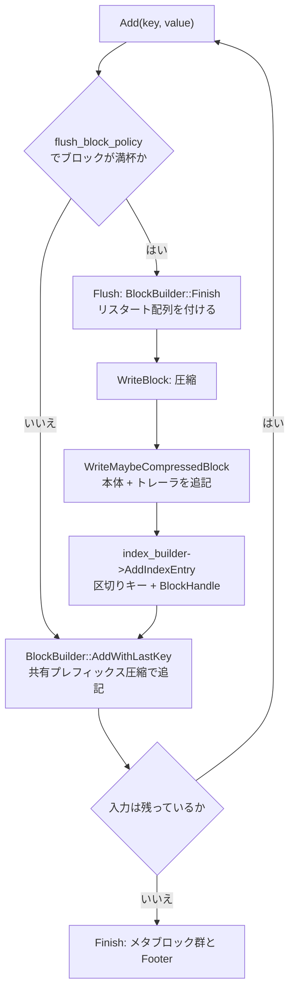

# 第15章 BlockBasedTable のビルド

> **本章で読むソース**
>
> - [`table/block_based/block_builder.h`](https://github.com/facebook/rocksdb/blob/v11.1.1/table/block_based/block_builder.h)
> - [`table/block_based/block_builder.cc`](https://github.com/facebook/rocksdb/blob/v11.1.1/table/block_based/block_builder.cc)
> - [`table/block_based/block_based_table_builder.h`](https://github.com/facebook/rocksdb/blob/v11.1.1/table/block_based/block_based_table_builder.h)
> - [`table/block_based/block_based_table_builder.cc`](https://github.com/facebook/rocksdb/blob/v11.1.1/table/block_based/block_based_table_builder.cc)
> - [`table/block_based/flush_block_policy.cc`](https://github.com/facebook/rocksdb/blob/v11.1.1/table/block_based/flush_block_policy.cc)
> - [`include/rocksdb/table.h`](https://github.com/facebook/rocksdb/blob/v11.1.1/include/rocksdb/table.h)

## この章の狙い

ソート済みの内部キーと値の列から、第14章で見た SST のバイト列を組み立てる過程を読む。
データブロックの中でキーをどう詰めるか、ブロックをいつ切り出してファイルへ書くか、最後にインデックスやプロパティをどの順で並べてファイルを閉じるかを、`BlockBuilder` と `BlockBasedTableBuilder` の実装で追う。
共有プレフィックス圧縮とリスタートポイントという、ブロック内の符号化を支える二つの機構を中心に置く。

## 前提

- [第14章 テーブルフォーマット](../part03-sst/14-table-format.md)：本章が組み立てる SST の全体レイアウト。
- [第13章 フラッシュ](../part02-write-path/13-flush.md)：MemTable を SST に書き出す経路。
  `TableBuilder` の呼び出し元の一つ。

## TableBuilder の役割

`TableBuilder` は、ソート済みの内部キーと値の列を受け取り、SST のバイト列を組み立てる抽象である。
呼び出し元は二つある。
MemTable を SST へ書き出すフラッシュ（第13章）と、複数の SST を一つにまとめるコンパクション（第31章）である。
どちらも、キーをソート順に一つずつ渡し、最後にファイルを閉じる。

`BlockBasedTableBuilder` はその実装で、入力を `block_size` ごとのデータブロックに切り分け、各ブロックを圧縮してファイルへ追記し、ブロックの位置をインデックスに記録する。
公開インターフェースは `Add`、`Finish`、`Abandon` の三つに集約される。

[`table/block_based/block_based_table_builder.h` L55-L71](https://github.com/facebook/rocksdb/blob/v11.1.1/table/block_based/block_based_table_builder.h#L55-L71)

```cpp
  // Add key,value to the table being constructed.
  // REQUIRES: Unless key has type kTypeRangeDeletion, key is after any
  //           previously added non-kTypeRangeDeletion key according to
  //           comparator.
  // REQUIRES: Finish(), Abandon() have not been called
  void Add(const Slice& key, const Slice& value) override;
  // ... (中略) ...
  // Finish building the table.  Stops using the file passed to the
  // constructor after this function returns.
  // REQUIRES: Finish(), Abandon() have not been called
  Status Finish() override;
```

`Add` に渡すキーが直前のキーより大きいことが前提になっている。
レンジ削除（`kTypeRangeDeletion`）だけは例外で、別のブロックに集められる。
入力がソート済みであることは呼び出し元の責任であり、この前提が共有プレフィックス圧縮を成り立たせる。
隣り合うキーが似た先頭部分を持つのは、ソートされているからである。

## データブロックの中身

データブロックは `BlockBuilder` が組み立てる。
このクラスの先頭に、ブロックの符号化方式がそのまま書かれている。

[`table/block_based/block_builder.cc` L10-L32](https://github.com/facebook/rocksdb/blob/v11.1.1/table/block_based/block_builder.cc#L10-L32)

```cpp
// BlockBuilder generates blocks where keys are prefix-compressed:
//
// When we store a key, we drop the prefix shared with the previous
// string.  This helps reduce the space requirement significantly.
// Furthermore, once every K keys, we do not apply the prefix
// compression and store the entire key.  We call this a "restart
// point".  The tail end of the block stores the offsets of all of the
// restart points, and can be used to do a binary search when looking
// for a particular key.  Values are stored as-is (without compression)
// immediately following the corresponding key.
//
// An entry for a particular key-value pair has the form:
//     shared_bytes: varint32
//     unshared_bytes: varint32
//     value_length: varint32 (NOTE1)
//     key_delta: char[unshared_bytes]
//     value: char[value_length]
// shared_bytes == 0 (explicitly stored) for restart points.
//
// The trailer of the block has the form:
//     restarts: uint32[num_restarts]
//     num_restarts: uint32
// restarts[i] contains the offset within the block of the ith restart point.
```

各エントリは、直前のキーと共有する先頭バイト数（`shared_bytes`）、共有しない残りのバイト数（`unshared_bytes`）、値の長さ（`value_length`）の三つの可変長整数で始まり、続いて共有しないキーの断片と値が並ぶ。
共有しているバイトはブロックに書かない。
これが**共有プレフィックス圧縮**である。

`K` キーごとに圧縮を打ち切り、キー全体を書き直す位置を**リスタートポイント**と呼ぶ。
リスタートポイントのエントリは `shared_bytes` が 0 になる。
ブロック末尾には、全リスタートポイントのオフセットを並べた配列と、その個数が付く。
この配列が、ブロック内をキーで二分探索するときの起点になる。

ブロック全体のレイアウトは次のようになる。

```text
+--------------------------------------------------------------+
| エントリ列 (本体)                                             |
|   restart[0] -> [ shared=0 | unshared | vlen | key | value ]  | ← リスタートポイント (キー全体)
|                 [ shared   | unshared | vlen | key | value ]  | ← 共有プレフィックス圧縮
|                 [ shared   | unshared | vlen | key | value ]  |
|                 ... (restart_interval 個ごとに区切る) ...     |
|   restart[1] -> [ shared=0 | unshared | vlen | key | value ]  | ← リスタートポイント
|                 [ shared   | unshared | vlen | key | value ]  |
|                 ...                                           |
+--------------------------------------------------------------+
| リスタート配列  restarts[0], restarts[1], ... (各 uint32)     | ← 各リスタートポイントのブロック内オフセット
+--------------------------------------------------------------+
| num_restarts (uint32)                                         | ← リスタートポイントの個数
+--------------------------------------------------------------+
```

## Add の中で起きること

`BlockBasedTableBuilder::Add` は、値の種別を判定し、通常の値であればデータブロックへ追記する。

[`table/block_based/block_based_table_builder.cc` L1543-L1571](https://github.com/facebook/rocksdb/blob/v11.1.1/table/block_based/block_based_table_builder.cc#L1543-L1571)

```cpp
    auto should_flush = r->flush_block_policy->Update(ikey, value);
    if (should_flush) {
      assert(!r->data_block.empty());
      Flush(/*first_key_in_next_block=*/&ikey);
    }
    // ... (中略) ...
    r->data_block.AddWithLastKey(ikey, value, r->last_ikey);
    r->last_ikey.assign(ikey.data(), ikey.size());
    assert(!r->last_ikey.empty());
    if (r->state == Rep::State::kBuffered) {
      // Buffered keys will be replayed from data_block_buffers during
      // `Finish()` once compression dictionary has been finalized.
    } else {
      r->index_builder->OnKeyAdded(ikey, value);
    }
```

まず `flush_block_policy->Update` で、いま追記すると `block_size` を超えるかどうかを尋ねる。
超えるなら、現在のブロックを `Flush` で確定させてから新しいキーを受け付ける。
このとき次ブロックの先頭キー `ikey` を渡しているのは、インデックスのキーを短く取るためである。
理由は「インデックスへの登録」の節で述べる。

ブロックへの追記は `AddWithLastKey` が担う。
直前のキー `r->last_ikey` を渡すことで、共有プレフィックスの計算に使う。
`Add` と `AddWithLastKey` は、直前のキーを `BlockBuilder` 内部に持たせるか呼び出し側から渡すかが違うだけで、符号化の本体は共通の `AddWithLastKeyImpl` に集約されている。

## 共有プレフィックス圧縮とリスタートポイントのエンコード

符号化の核心は `AddWithLastKeyImpl` にある。
まず、いまのキーが何バイト前のキーと共有するかを決める。

[`table/block_based/block_builder.cc` L279-L290](https://github.com/facebook/rocksdb/blob/v11.1.1/table/block_based/block_builder.cc#L279-L290)

```cpp
  size_t shared = 0;  // number of bytes shared with prev key
  if (counter_ >= block_restart_interval_) {
    // Restart compression
    restarts_.push_back(static_cast<uint32_t>(buffer_size));
    estimate_ += sizeof(uint32_t);
    counter_ = 0;
  } else if (use_delta_encoding_ && !skip_delta_encoding) {
    // See how much sharing to do with previous string
    shared = key_to_persist.difference_offset(last_key_persisted);
  }

  const size_t non_shared = key_to_persist.size() - shared;
```

`counter_` はリスタートポイントからのエントリ数である。
これが `block_restart_interval_` に達したら、圧縮を打ち切る。
いまのブロック内オフセット `buffer_size` を新しいリスタートポイントとして `restarts_` に積み、`counter_` を 0 に戻す。
このとき `shared` は 0 のままなので、キー全体が書かれる。

打ち切らない場合は、`difference_offset` で直前のキーとの共有バイト数を求める。
`difference_offset` は、二つの `Slice` を先頭から比較して最初に異なる位置を返す（[`include/rocksdb/slice.h` L296-L303](https://github.com/facebook/rocksdb/blob/v11.1.1/include/rocksdb/slice.h#L296-L303)）。
共有しない長さ `non_shared` は、キー全体から `shared` を引いた残りである。

求めた長さと値をブロックに書き込む。
ここでは可変長整数符号化を使う通常のデータブロックの経路を見る。

[`table/block_based/block_builder.cc` L310-L319](https://github.com/facebook/rocksdb/blob/v11.1.1/table/block_based/block_builder.cc#L310-L319)

```cpp
    } else {
      // Add "<shared><non_shared><value_size>" to buffer_
      PutVarint32(&buffer_, static_cast<uint32_t>(shared),
                  static_cast<uint32_t>(non_shared),
                  static_cast<uint32_t>(value.size()));
    }
  }

  // Add string delta to buffer_
  buffer_.append(key_to_persist.data() + shared, non_shared);
```

`shared`、`non_shared`、値の長さを可変長整数で並べたあと、キーのうち共有しない後半 `non_shared` バイトだけを追記する。
キーの先頭から `shared` バイトはここで省かれる。
これが空間を節約する。
値はこの直後に `values_buffer`（既定では `buffer_` 自身）へそのまま追記される。

`counter_` を一つ進めて、推定サイズを更新する。

[`table/block_based/block_builder.cc` L342-L344](https://github.com/facebook/rocksdb/blob/v11.1.1/table/block_based/block_builder.cc#L342-L344)

```cpp
  counter_++;
  estimate_ += buffer_.size() - buffer_size + values_buffer_.size() -
               previous_value_offset;
```

`estimate_` はブロックの推定サイズで、フラッシュ判定に使う。
バイト列を実際に書いてから差分で更新するので、可変長整数の実バイト数を反映した値になる。

### なぜ二つの機構を両立させるのか

共有プレフィックス圧縮だけを突き詰めると、ブロックの全エントリが直前のキーに依存して鎖のようにつながる。
あるキーを復元するには、ブロック先頭から順にすべてのキーを復元しなければならない。
これではブロック内をキーで探索するときに線形走査しか使えない。

リスタートポイントは、この鎖を `block_restart_interval` 個ごとに切る。
リスタートポイントではキー全体が書かれるので、その地点からは前のエントリを参照せずに復元を始められる。
末尾のリスタート配列は各リスタートポイントのオフセットを保持するので、読み手はまずリスタートポイントだけをキーで二分探索し、目的のキーを含む区間を特定してから、その区間の先頭から順に復元すればよい。
圧縮率（共有を増やしたい）と探索速度（独立に復元できる起点を増やしたい）のトレードオフを、`block_restart_interval` 一つで調整できる。
既定値は 16 である。

[`include/rocksdb/table.h` L347-L354](https://github.com/facebook/rocksdb/blob/v11.1.1/include/rocksdb/table.h#L347-L354)

```cpp
  // Number of keys between restart points for delta encoding of keys.
  // This parameter can be changed dynamically.  Most clients should
  // leave this parameter alone.  The minimum value allowed is 1.  Any smaller
  // value will be silently overwritten with 1.
  int block_restart_interval = 16;

  // Same as block_restart_interval but used for the index block.
  int index_block_restart_interval = 1;
```

`block_restart_interval` を小さくすると、リスタートポイントが増えて二分探索の粒度が細かくなる代わりに、キー全体を書き直す回数が増えて空間効率が落ちる。
インデックスブロックの既定値が 1 になっているのは、インデックスは件数が少なく、各エントリへ直接二分探索で到達できることを優先するためと考えられる。
共有プレフィックス圧縮そのものを切りたいときは `use_delta_encoding` を `false` にする（[`include/rocksdb/table.h` L514-L518](https://github.com/facebook/rocksdb/blob/v11.1.1/include/rocksdb/table.h#L514-L518)）。

### Finish でブロックを閉じる

ブロック本体を書き終えたら、`BlockBuilder::Finish` が末尾のリスタート配列と個数を付け足す。

[`table/block_based/block_builder.cc` L197-L217](https://github.com/facebook/rocksdb/blob/v11.1.1/table/block_based/block_builder.cc#L197-L217)

```cpp
  for (size_t i = 0; i < restarts_.size(); i++) {
    PutFixed32(&buffer_, restarts_[i]);
  }

  DataBlockFooter footer;
  footer.num_restarts = static_cast<uint32_t>(restarts_.size());
  footer.index_type = BlockBasedTableOptions::kDataBlockBinarySearch;
  footer.is_uniform = is_uniform;
  // ... (中略) ...
  footer.EncodeTo(&buffer_);
  finished_ = true;
  return Slice(buffer_);
```

リスタートオフセットは固定長 32 ビットで書く。
本体では可変長整数を使うのに末尾を固定長にするのは、読み手が末尾から個数を読んで配列の先頭を逆算し、添字 `i` のオフセットへ定数時間で飛べるようにするためである。
返ってくる `Slice` は、この時点でリスタート配列とフッタまで含んだブロック全体の中身を指す。

## ブロックの切り出し条件

ブロックをいつ切り出すかは `FlushBlockBySizePolicy::Update` が決める。

[`table/block_based/flush_block_policy.cc` L37-L51](https://github.com/facebook/rocksdb/blob/v11.1.1/table/block_based/flush_block_policy.cc#L37-L51)

```cpp
  bool Update(const Slice& key, const Slice& value) override {
    // it makes no sense to flush when the data block is empty
    if (data_block_builder_->empty()) {
      return false;
    }

    auto curr_size = data_block_builder_->CurrentSizeEstimate();

    // Do flush if one of the below two conditions is true:
    // 1) if the current estimated size already exceeds the block size,
    // 2) block_size_deviation is set and the estimated size after appending
    // the kv will exceed the block size and the current size is under the
    // the deviation.
    return curr_size >= block_size_ || BlockAlmostFull(key, value);
  }
```

判定は二段構えになっている。
現在の推定サイズが `block_size` に達していればフラッシュする。
そうでなくても、`block_size_deviation` が設定されていて、いまの kv を加えると `block_size` を超え、かつ現在サイズが許容下限を上回っていればフラッシュする。
後者は `BlockAlmostFull` の中で `EstimateSizeAfterKV` を呼び、追記後の見込みサイズを得て判断する（[`table/block_based/block_builder.cc` L150-L185](https://github.com/facebook/rocksdb/blob/v11.1.1/table/block_based/block_builder.cc#L150-L185)）。
ほぼ埋まったブロックに大きな値を一つ足して大幅に超過するより、手前で閉じたほうがブロックサイズが揃う。

`block_size` の既定は 4 KiB、`block_size_deviation` の既定は 10 パーセントである。

[`include/rocksdb/table.h` L334-L345](https://github.com/facebook/rocksdb/blob/v11.1.1/include/rocksdb/table.h#L334-L345)

```cpp
  // Approximate size of user data packed per block.  Note that the
  // block size specified here corresponds to uncompressed data.  The
  // actual size of the unit read from disk may be smaller if
  // compression is enabled.  This parameter can be changed dynamically.
  uint64_t block_size = 4 * 1024;

  // This is used to close a block before it reaches the configured
  // 'block_size'. If the percentage of free space in the current block is less
  // than this specified number and adding a new record to the block will
  // exceed the configured block size, then this block will be closed and the
  // new record will be written to the next block.
  int block_size_deviation = 10;
```

`block_size` は圧縮前のサイズに対する目安である。
このしきい値はあくまで近似で、一つの kv が `block_size` を超える場合はその kv だけでブロックになる。

## ブロックを書き出してインデックスへ登録する

フラッシュが決まると `BlockBasedTableBuilder::Flush` がブロックを確定させる。

[`table/block_based/block_based_table_builder.cc` L1698-L1718](https://github.com/facebook/rocksdb/blob/v11.1.1/table/block_based/block_based_table_builder.cc#L1698-L1718)

```cpp
  } else {
    // Increment num_data_blocks when a data block is finalized in the
    // emit thread to avoid data races with write worker threads
    ++r->props.num_data_blocks;
    // ... (中略) ...
    if (r->IsParallelCompressionActive()) {
      EmitBlockForParallel(r->data_block.MutableBuffer(), r->last_ikey,
                           first_key_in_next_block);
    } else {
      EmitBlock(r->data_block.MutableBuffer(), r->last_ikey,
                first_key_in_next_block);
    }
    r->data_block.Reset();
  }
```

並列圧縮を使わない通常の経路は `EmitBlock` である。
ここでブロックをファイルへ書き、続いてインデックスへエントリを追加する。

[`table/block_based/block_based_table_builder.cc` L1787-L1801](https://github.com/facebook/rocksdb/blob/v11.1.1/table/block_based/block_based_table_builder.cc#L1787-L1801)

```cpp
  bool skip_delta_encoding = false;
  WriteBlock(uncompressed, &r->pending_handle, BlockType::kData,
             &skip_delta_encoding);
  if (LIKELY(ok())) {
    // We do not emit the index entry for a block until we have seen the
    // first key for the next data block.  This allows us to use shorter
    // keys in the index block.  For example, consider a block boundary
    // between the keys "the quick brown fox" and "the who".  We can use
    // "the r" as the key for the index block entry since it is >= all
    // entries in the first block and < all entries in subsequent
    // blocks.
    r->index_builder->AddIndexEntry(
        last_key_in_current_block, first_key_in_next_block, r->pending_handle,
        &r->index_separator_scratch, skip_delta_encoding);
  }
```

`WriteBlock` がブロックの位置とサイズを `r->pending_handle` に書き込み、その `BlockHandle` をキー付きでインデックスに登録する。
インデックスのキーには、現在ブロックの最終キーと次ブロックの先頭キーを両方渡している。
コメントの例のとおり、`the quick brown fox` と `the who` の境界には `the r` のような短い区切りキーで足りる。
このキーは現在ブロックのすべてのキー以上で、次ブロックのすべてのキー未満であればよい。
だから `Add` の段階で次ブロックの先頭キーを渡し、インデックスのキーを最小限の長さに切り詰める。
インデックスの構造そのものは第17章で扱う。

`WriteBlock` は圧縮してから `WriteMaybeCompressedBlock` を呼ぶ。

[`table/block_based/block_based_table_builder.cc` L1816-L1831](https://github.com/facebook/rocksdb/blob/v11.1.1/table/block_based/block_based_table_builder.cc#L1816-L1831)

```cpp
  Status compress_status = CompressAndVerifyBlock(
      uncompressed_block_data, is_data_block,
      is_data_block ? r->data_block_working_area : r->index_block_working_area,
      &r->single_threaded_compressed_output, &type);
  r->SetStatus(compress_status);
  if (UNLIKELY(!ok())) {
    return;
  }
  // ... (中略) ...
  WriteMaybeCompressedBlock(
      type == kNoCompression ? uncompressed_block_data
                             : Slice(r->single_threaded_compressed_output),
      type, handle, block_type, &uncompressed_block_data, skip_delta_encoding);
```

圧縮の中身は第20章に譲る。
ここでは、圧縮後のバイト列（圧縮しない場合は元のまま）が `WriteMaybeCompressedBlock` に渡る点だけ押さえる。

`WriteMaybeCompressedBlock` の実体である `WriteMaybeCompressedBlockImpl` が、ブロック本体と 5 バイトのトレーラ（圧縮種別 1 バイトとチェックサム 4 バイト）をファイルへ追記する。

[`table/block_based/block_based_table_builder.cc` L2128-L2156](https://github.com/facebook/rocksdb/blob/v11.1.1/table/block_based/block_based_table_builder.cc#L2128-L2156)

```cpp
  {
    io_s = r->file->Append(io_options, block_contents);
    if (UNLIKELY(!io_s.ok())) {
      return io_s;
    }
  }

  r->compression_types_used.Add(comp_type);
  std::array<char, kBlockTrailerSize> trailer;
  trailer[0] = comp_type;
  uint32_t checksum = ComputeBuiltinChecksumWithLastByte(
      r->table_options.checksum, block_contents.data(), block_contents.size(),
      /*last_byte*/ comp_type);
  checksum += ChecksumModifierForContext(r->base_context_checksum, offset);
  // ... (中略) ...
  EncodeFixed32(trailer.data() + 1, checksum);
  // ... (中略) ...
  {
    io_s = r->file->Append(io_options, Slice(trailer.data(), trailer.size()));
```

本体を追記したあと、圧縮種別を先頭バイトに置き、チェックサムを 4 バイトで続けてトレーラを追記する。
`handle->set_offset` と `handle->set_size` でブロックの位置と本体サイズが記録され、これがインデックスエントリの値になる。
チェックサムの方式は第21章で扱う。

ここまでが、一つのデータブロックを組み立ててファイルへ書き、インデックスへ登録する一巡である。
`Add` を呼ぶたびにこの流れが回り、ブロックが `block_size` に達するごとに繰り返される。



## Finish でファイルを閉じる

入力を渡し終えたら `BlockBasedTableBuilder::Finish` を呼ぶ。
ここで最後のデータブロックを書き出し、データブロック以降のメタブロック群を決まった順に並べる。

[`table/block_based/block_based_table_builder.cc` L2809-L2847](https://github.com/facebook/rocksdb/blob/v11.1.1/table/block_based/block_based_table_builder.cc#L2809-L2847)

```cpp
  // To make sure properties block is able to keep the accurate size of index
  // block, we will finish writing all index entries first, in Flush().
  Flush(/*first_key_in_next_block=*/nullptr);
  // ... (中略) ...
  // Write meta blocks, metaindex block and footer in the following order.
  //    1. [meta block: filter]
  //    2. [meta block: index]
  //    3. [meta block: compression dictionary]
  //    4. [meta block: range deletion tombstone]
  //    5. [meta block: properties]
  //    6. [metaindex block]
  //    7. Footer
  BlockHandle metaindex_block_handle, index_block_handle;
  MetaIndexBuilder meta_index_builder;
  WriteFilterBlock(&meta_index_builder);
  WriteIndexBlock(&meta_index_builder, &index_block_handle);
  WriteCompressionDictBlock(&meta_index_builder);
  WriteRangeDelBlock(&meta_index_builder);
  WritePropertiesBlock(&meta_index_builder);
  if (LIKELY(ok())) {
    // flush the meta index block
    WriteMaybeCompressedBlock(meta_index_builder.Finish(), kNoCompression,
                              &metaindex_block_handle, BlockType::kMetaIndex);
  }
  if (LIKELY(ok())) {
    WriteFooter(metaindex_block_handle, index_block_handle);
  }
  r->state = Rep::State::kClosed;
```

最初の `Flush` に `nullptr` を渡しているのは、これ以上のキーがないことを示す。
このとき残ったデータブロックが書き出され、最後のインデックスエントリも確定する。

そのあと、フィルタ、インデックス、圧縮辞書、レンジ削除、プロパティの各メタブロックを順に書く。
書くごとに、そのブロックの名前と位置を `meta_index_builder` に登録していく。
フィルタブロックは第18章と第19章、レンジ削除のトゥームストーン（tombstone）は第14章で扱った形式に対応する。

最後に、メタインデックスブロック自身を書き、その位置とインデックスブロックの位置を `WriteFooter` で Footer に書き込む。
Footer はファイル末尾の固定長領域で、読み手はここからメタインデックスとインデックスをたどってファイル全体を解釈する（第14章）。
`WriteFooter` を終えると状態は `kClosed` になり、ビルダは再利用できなくなる。

メタブロックをデータブロックより後ろに置くのは、書き込みが追記専用で進むことと整合する。
データブロックを書き終えるまでインデックスの全エントリは確定しないので、インデックスは末尾にまとめて書くしかない。
読み手は Footer を起点に末尾から逆向きにたどるので、この配置で問題なく全体を解釈できる。

## まとめ

- `TableBuilder` はソート済みの内部キーと値の列を受け取り、SST のバイト列を組み立てる。
  フラッシュとコンパクションが呼び出し元になる。
- データブロックは `BlockBuilder` が組み立て、各エントリを `shared_bytes` と `unshared_bytes` と `value_length` の可変長整数で符号化し、直前のキーと共有する先頭バイトを省く（共有プレフィックス圧縮）。
- `block_restart_interval` 個ごとにリスタートポイントを置き、そこではキー全体を書き直す。
  ブロック末尾のリスタート配列がブロック内二分探索の起点になり、圧縮率と探索速度を一つのパラメータで調整できる。
- ブロックの推定サイズが `block_size` に達すると `Flush` が呼ばれ、ブロックを圧縮してトレーラ付きでファイルへ追記し、区切りキーと `BlockHandle` をインデックスへ登録する。
- `Finish` は残りのブロックを書いたあと、フィルタ、インデックス、圧縮辞書、レンジ削除、プロパティ、メタインデックス、Footer の順にファイル末尾を組み立てて閉じる。

## 関連する章

- [第14章 テーブルフォーマット](../part03-sst/14-table-format.md)：本章が生成したファイルのレイアウト。
- [第16章 BlockBasedTable の読み取り](../part03-sst/16-block-based-table-reader.md)：このブロックをどう読み解くか。
- [第17章 インデックスブロック](../part03-sst/17-index-block.md)：`index_builder` が組み立てるインデックスの構造。
- [第18章 ブルームフィルタ](../part03-sst/18-bloom-filter.md)：フィルタブロックの中身。
- [第20章 圧縮](../part03-sst/20-compression.md)：`WriteBlock` が呼ぶブロック圧縮。
- [第21章 チェックサム](../part03-sst/21-checksum.md)：トレーラのチェックサム計算。
