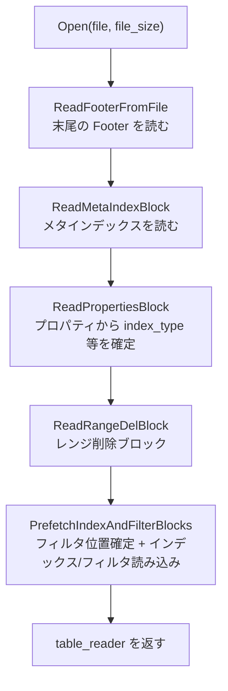
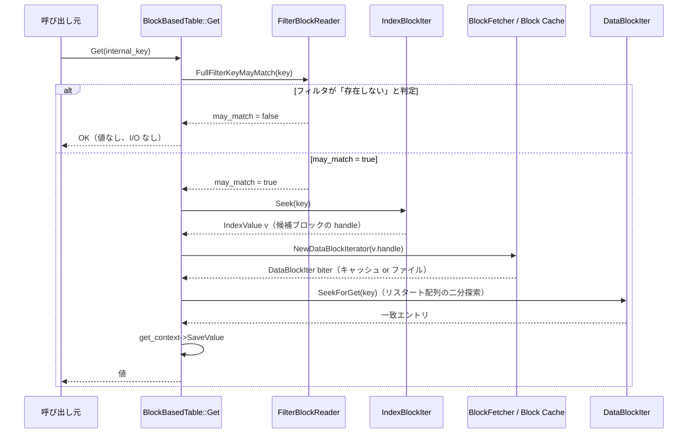

# 第16章 BlockBasedTable の読み出し

> **本章で読むソース**
> - [`table/block_based/block_based_table_reader.h`](https://github.com/facebook/rocksdb/blob/v11.1.1/table/block_based/block_based_table_reader.h)
> - [`table/block_based/block_based_table_reader.cc`](https://github.com/facebook/rocksdb/blob/v11.1.1/table/block_based/block_based_table_reader.cc)
> - [`table/block_based/block_based_table_reader_impl.h`](https://github.com/facebook/rocksdb/blob/v11.1.1/table/block_based/block_based_table_reader_impl.h)
> - [`table/block_fetcher.h`](https://github.com/facebook/rocksdb/blob/v11.1.1/table/block_fetcher.h)
> - [`table/block_fetcher.cc`](https://github.com/facebook/rocksdb/blob/v11.1.1/table/block_fetcher.cc)
> - [`table/block_based/block.h`](https://github.com/facebook/rocksdb/blob/v11.1.1/table/block_based/block.h)
> - [`table/block_based/block.cc`](https://github.com/facebook/rocksdb/blob/v11.1.1/table/block_based/block.cc)

## この章の狙い

前章まででは SST ファイルがどう書き出されるかを見た。
本章では、書き出された SST を `BlockBasedTable` がどう開き、点探索 `Get(key)` で値をどう取り出すかを実装に沿って読む。
ファイルを開くときの段階的な初期化、点探索における三段の絞り込み、ブロック取得時の Block Cache とチェックサム検証、そしてブロック内の二分探索までを、それぞれの関数を引用しながら追う。

## 前提

- [第14章 テーブルフォーマット](../part03-sst/14-table-format.md)（Footer、メタインデックス、ブロックの物理レイアウト）
- [第15章 BlockBasedTable の書き出し](../part03-sst/15-block-based-table-builder.md)（リスタート配列やブロックトレーラの生成側）

## SST を開く流れ

`BlockBasedTable::Open` は、ファイルのバイト列だけを受け取り、そこから値を引けるテーブルリーダを組み立てる。
SST は末尾に向かって自己記述的に並んでいる。
末尾の **Footer** がメタインデックスとインデックスの位置を指し、メタインデックスが各メタブロック（プロパティ、フィルタ、レンジ削除、圧縮辞書）の位置を指す。
そのため `Open` は前から順に読むのではなく、まず末尾を読み、そこを起点に必要なブロックへたどっていく。

読み込みの順序はコード中のコメントに明記されている。

[`table/block_based/block_based_table_reader.cc` L789-L804](https://github.com/facebook/rocksdb/blob/v11.1.1/table/block_based/block_based_table_reader.cc#L789-L804)

```cpp
  // Read in the following order:
  //    1. Footer
  //    2. [metaindex block]
  //    3. [meta block: properties]
  //    4. [meta block: range deletion tombstone]
  //    5. [meta block: compression dictionary]
  //    6. [meta block: index]
  //    7. [meta block: filter]
  IOOptions opts;
  IODebugContext dbg;
  s = file->PrepareIOOptions(ro, opts, &dbg);
  if (s.ok()) {
    s = ReadFooterFromFile(opts, file.get(), *ioptions.fs,
                           prefetch_buffer.get(), file_size, &footer,
                           kBlockBasedTableMagicNumber, ioptions.stats);
  }
```

`ReadFooterFromFile` はファイル末尾の固定長領域を読み、マジックナンバーで `BlockBasedTable` 形式であることを確かめる。
得られた `footer` は `Rep`（テーブルリーダの不変状態をまとめた構造体）に保存され、以後のメタブロック読み込みの起点になる。

メタインデックスは `ReadMetaIndexBlock` が読む。

[`table/block_based/block_based_table_reader.cc` L1473-L1498](https://github.com/facebook/rocksdb/blob/v11.1.1/table/block_based/block_based_table_reader.cc#L1473-L1498)

```cpp
Status BlockBasedTable::ReadMetaIndexBlock(
    const ReadOptions& ro, FilePrefetchBuffer* prefetch_buffer,
    std::unique_ptr<Block>* metaindex_block,
    std::unique_ptr<InternalIterator>* iter) {
  // ... (中略) ...
  std::unique_ptr<Block_kMetaIndex> metaindex;
  Status s = ReadAndParseBlockFromFile(
      rep_->file.get(), prefetch_buffer, rep_->footer, ro,
      rep_->footer.metaindex_handle(), &metaindex, rep_->ioptions,
      // ... (中略) ...
      false /* for_compaction */, false /* async_read */);
  // ... (中略) ...
  *metaindex_block = std::move(metaindex);
  // meta block uses bytewise comparator.
  iter->reset(metaindex_block->get()->NewMetaIterator());
  return Status::OK();
}
```

メタインデックスのブロックハンドルは `footer.metaindex_handle()` から得る。
メタインデックスはメタブロック名をキー、そのブロックハンドルを値とするブロックである。
返されるイテレータをたどることで、フィルタやプロパティといった各メタブロックの位置を名前引きできる。

`Open` はこのイテレータを使って残りのメタブロックを読む。
`ReadPropertiesBlock` がプロパティを読み込み、そこからインデックスタイプやリスタート間隔などのフィールドを `Rep` に埋める。
続いて `ReadRangeDelBlock` がレンジ削除ブロックを読み、最後に `PrefetchIndexAndFilterBlocks` がインデックスとフィルタを処理する。

[`table/block_based/block_based_table_reader.cc` L842-L964](https://github.com/facebook/rocksdb/blob/v11.1.1/table/block_based/block_based_table_reader.cc#L842-L964)

```cpp
  s = new_table->ReadMetaIndexBlock(ro, prefetch_buffer.get(), &metaindex,
                                    &metaindex_iter);
  // ... (中略) ...
  s = new_table->ReadPropertiesBlock(ro, prefetch_buffer.get(),
                                     metaindex_iter.get(), largest_seqno);
  // ... (中略) ...
  s = new_table->ReadRangeDelBlock(ro, prefetch_buffer.get(),
                                   metaindex_iter.get(), internal_comparator,
                                   &lookup_context);
  // ... (中略) ...
  s = new_table->PrefetchIndexAndFilterBlocks(
      ro, prefetch_buffer.get(), metaindex_iter.get(), new_table.get(),
      prefetch_all, table_options, level, file_size,
      max_file_size_for_l0_meta_pin, &lookup_context);
```

`PrefetchIndexAndFilterBlocks` は、まずフィルタブロックの位置と種別を確定させる。
フィルタポリシーが設定されていれば、互換名に既知の接頭辞を付けたキーをメタインデックスから検索し、見つかった接頭辞でフィルタの種別（フルフィルタかパーティションフィルタか）を決める。

[`table/block_based/block_based_table_reader.cc` L1220-L1241](https://github.com/facebook/rocksdb/blob/v11.1.1/table/block_based/block_based_table_reader.cc#L1220-L1241)

```cpp
  if (rep_->filter_policy) {
    auto name = rep_->filter_policy->CompatibilityName();
    for (const auto& [filter_type, prefix] :
         {std::make_pair(Rep::FilterType::kFullFilter, kFullFilterBlockPrefix),
          std::make_pair(Rep::FilterType::kPartitionedFilter,
                         kPartitionedFilterBlockPrefix),
          std::make_pair(Rep::FilterType::kNoFilter,
                         kObsoleteFilterBlockPrefix)}) {
      std::string filter_block_key = prefix + name;
      if (FindMetaBlock(meta_iter, filter_block_key, &rep_->filter_handle)
              .ok()) {
        rep_->filter_type = filter_type;
        // ... (中略) ...
        break;
      }
    }
  }
```

この後、インデックスリーダ（`CreateIndexReader`）とフィルタブロックリーダ（`CreateFilterBlockReader`）を作る。
インデックスとフィルタをブロックキャッシュに載せるか、リーダ内に固定（pin）するかは、`cache_index_and_filter_blocks` などのオプションと、ファイルが L0 にあるかどうかで決まる。
`Open` の最後で `*table_reader` に組み立てたリーダを移し替えて返す。



開く時点でインデックスとフィルタをまとめて読むのは、その後の点探索や走査で同じブロックを繰り返し参照するためである。
Footer からたどる段階的な読み込みによって、ファイルのどこに何があるかをあらかじめ調べることなく、末尾の固定情報だけを起点に必要なブロックへ到達できる。

## 点探索 `Get` の三段の絞り込み

`BlockBasedTable::Get` は、内部キー（user key にシーケンス番号と種別を付けたもの）を受け取り、そのキーに対応する値を `GetContext` に渡す。
探索は三段で絞り込む。
フィルタで存在しないキーを早期に棄却し、インデックスで該当するデータブロックを一つに絞り、最後にデータブロック内をリスタート配列の二分探索で当てる。

最初の関門がフィルタである。
`Get` はまずフィルタにキーを問い合わせ、否定が返ればそこで打ち切る。

[`table/block_based/block_based_table_reader.cc` L2507-L2512](https://github.com/facebook/rocksdb/blob/v11.1.1/table/block_based/block_based_table_reader.cc#L2507-L2512)

```cpp
  TEST_SYNC_POINT("BlockBasedTable::Get:BeforeFilterMatch");
  const bool may_match =
      FullFilterKeyMayMatch(filter, key, prefix_extractor, get_context,
                            &lookup_context, read_options);
  TEST_SYNC_POINT("BlockBasedTable::Get:AfterFilterMatch");
  if (may_match) {
```

`FullFilterKeyMayMatch` が `false` を返した場合、`if (may_match)` のブロック全体が実行されず、インデックス探索もデータブロック読みも一切行わない。
ブルームフィルタやリボンフィルタは存在しないキーに対して高い確率で「存在しない」と答えられるので、ヒットしないキーについてはこの一段でデータブロックの I/O を丸ごと省ける。
フィルタの内部は第18章で扱う。

`may_match` が真なら、次にインデックスを引いて候補データブロックの位置（`BlockHandle`）を得る。

[`table/block_based/block_based_table_reader.cc` L2520-L2543](https://github.com/facebook/rocksdb/blob/v11.1.1/table/block_based/block_based_table_reader.cc#L2520-L2543)

```cpp
    auto iiter =
        NewIndexIterator(read_options, need_upper_bound_check, &iiter_on_stack,
                         get_context, &lookup_context);
    // ... (中略) ...
    for (iiter->Seek(key); iiter->Valid() && !done; iiter->Next()) {
      IndexValue v = iiter->value();

      if (!v.first_internal_key.empty() && !skip_filters &&
          UserComparatorWrapper(rep_->internal_comparator.user_comparator())
                  .CompareWithoutTimestamp(
                      ExtractUserKey(key),
                      ExtractUserKey(v.first_internal_key)) < 0) {
        // The requested key falls between highest key in previous block and
        // lowest key in current block.
        break;
      }
```

インデックスイテレータを `Seek(key)` で目的キーの位置へ動かすと、その `value()` が候補ブロックのハンドルになる。
インデックスのエントリが `first_internal_key`（そのブロックの最小キー）を持つ場合、目的キーがそれより小さければ、目的キーは前のブロックと現在のブロックの隙間に落ちることになり、現在のブロックを読む必要はない。
このとき `break` でループを抜ける。
インデックスブロックの符号化と二段インデックスの詳細は第17章で扱う。

候補ブロックが定まると、`NewDataBlockIterator` でそのブロックのイテレータを作り、`SeekForGet` でブロック内を探索する。

[`table/block_based/block_based_table_reader.cc` L2550-L2573](https://github.com/facebook/rocksdb/blob/v11.1.1/table/block_based/block_based_table_reader.cc#L2550-L2573)

```cpp
      DataBlockIter biter;
      uint64_t referenced_data_size = 0;
      Status tmp_status;
      NewDataBlockIterator<DataBlockIter>(
          read_options, v.handle, &biter, BlockType::kData, get_context,
          &lookup_data_block_context, /*prefetch_buffer=*/nullptr,
          /*for_compaction=*/false, /*async_read=*/false, tmp_status,
          /*use_block_cache_for_lookup=*/true);
      // ... (中略) ...
      bool may_exist = biter.SeekForGet(key);
```

`SeekForGet` がブロック内にキー候補を見つけたら、続く内側ループで一致を確認し、見つかったエントリを `get_context->SaveValue` に渡す。
`SaveValue` が見つかったと判断すると `done` が立ち、外側のループも抜ける。



三段はそれぞれ別の機構で探索空間を削る。
フィルタはブロックの読み込み自体を省き、インデックスは数十から数百あるデータブロックを一つに絞り、ブロック内の二分探索はそのブロックの中の全エントリ走査を対数時間に落とす。

## ブロックの取得とキャッシュ

データブロックの取得は `RetrieveBlock` が担う。
ここがブロックキャッシュによる I/O 回避の中心である。
`use_cache` が真のときは、まず `MaybeReadBlockAndLoadToCache` を呼んでキャッシュを試し、値が得られればそのまま返す。

[`table/block_based/block_based_table_reader.cc` L2089-L2112](https://github.com/facebook/rocksdb/blob/v11.1.1/table/block_based/block_based_table_reader.cc#L2089-L2112)

```cpp
  Status s;
  if (use_cache) {
    s = MaybeReadBlockAndLoadToCache(
        prefetch_buffer, ro, handle, decomp, for_compaction, out_parsed_block,
        get_context, lookup_context,
        /*contents=*/nullptr, async_read, use_block_cache_for_lookup);

    if (!s.ok()) {
      return s;
    }

    if (out_parsed_block->GetValue() != nullptr ||
        out_parsed_block->GetCacheHandle() != nullptr) {
      assert(s.ok());
      return s;
    }
  }

  assert(out_parsed_block->IsEmpty());

  const bool no_io = ro.read_tier == kBlockCacheTier;
  if (no_io) {
    return Status::Incomplete("no blocking io");
  }
```

キャッシュに無く、しかも `read_tier == kBlockCacheTier`（I/O を禁じる設定）なら、ファイルを読まずに `Status::Incomplete` を返す。
これは `Get` 側で「キャッシュに無いので存在を保証できない」という扱いに変換される。
I/O が許されていれば、`RetrieveBlock` はこの後 `ReadAndParseBlockFromFile` でファイルから読む。

`MaybeReadBlockAndLoadToCache` の前半が、ブロックキャッシュの探索そのものである。
ブロックハンドルからキャッシュキーを作り、`GetDataBlockFromCache` で引く。

[`table/block_based/block_based_table_reader.cc` L1842-L1869](https://github.com/facebook/rocksdb/blob/v11.1.1/table/block_based/block_based_table_reader.cc#L1842-L1869)

```cpp
  if (block_cache) {
    // create key for block cache
    key_data = GetCacheKey(rep_->base_cache_key, handle);
    key = key_data.AsSlice();

    if (!contents) {
      if (use_block_cache_for_lookup) {
        s = GetDataBlockFromCache(key, block_cache, out_parsed_block,
                                  get_context, decomp);
        // Value could still be null at this point, so check the cache handle
        // and update the read pattern for prefetching
        if (out_parsed_block->GetValue() ||
            out_parsed_block->GetCacheHandle()) {
          // ... (中略) ...
          is_cache_hit = true;
          // ... (中略) ...
        }
      }
    }
```

キャッシュキーは `base_cache_key`（テーブルごとに安定なキー）とブロックハンドルの組み合わせから作る。
ヒットすれば解凍済みの `Block` がそのまま得られ、ファイル I/O も解凍もチェックサム検証も行わない。
ミスしたときだけ、I/O が許され `fill_cache` が立っていれば、`BlockFetcher` でファイルから読み、`PutDataBlockToCache` でキャッシュへ載せる。

[`table/block_based/block_based_table_reader.cc` L1873-L1916](https://github.com/facebook/rocksdb/blob/v11.1.1/table/block_based/block_based_table_reader.cc#L1873-L1916)

```cpp
    // Can't find the block from the cache. If I/O is allowed, read from the
    // file.
    if (out_parsed_block->GetValue() == nullptr &&
        out_parsed_block->GetCacheHandle() == nullptr && !no_io &&
        ro.fill_cache) {
      // ... (中略) ...
        BlockFetcher block_fetcher(
            rep_->file.get(), prefetch_buffer, rep_->footer, ro, handle,
            &tmp_contents, rep_->ioptions, do_uncompress, maybe_compressed,
            TBlocklike::kBlockType, decomp, rep_->persistent_cache_options,
            GetMemoryAllocator(rep_->table_options),
            /*allocator=*/nullptr);

        // If prefetch_buffer is not allocated, it will fallback to synchronous
        // reading of block contents.
        if (async_read && prefetch_buffer != nullptr) {
          s = block_fetcher.ReadAsyncBlockContents();
          // ... (中略) ...
        } else {
          s = block_fetcher.ReadBlockContents();
        }
```

Block Cache のヒットが I/O 回避として効くのは、SST のデータブロックが不変だからである。
一度コンパクションで書かれたブロックは内容が変わらないので、解凍済みの `Block` をキャッシュに置いておけば、同じブロックへの後続のアクセスはメモリ参照だけで済む。
ヒットすればストレージへのランダム読みと解凍コストの両方を丸ごと省ける。
キャッシュの実装は第38章以降で扱う。

### `BlockFetcher` の読み込み・検証・解凍

`BlockFetcher::ReadBlockContents` が、ファイルからの読み込み、チェックサム検証、解凍を一手に行う。
読み込み元には優先順位があり、永続キャッシュ、プリフェッチバッファ、最後にファイル本体の順で試す。

[`table/block_fetcher.cc` L390-L418](https://github.com/facebook/rocksdb/blob/v11.1.1/table/block_fetcher.cc#L390-L418)

```cpp
IOStatus BlockFetcher::ReadBlockContents() {
  if (TryGetUncompressBlockFromPersistentCache()) {
    // ... (中略) ...
    return IOStatus::OK();
  }
  if (TryGetFromPrefetchBuffer()) {
    // ... (中略) ...
  } else if (!TryGetSerializedBlockFromPersistentCache()) {
    ReadBlock(/*retry =*/false);
    // If the file system supports retry after corruption, then try to
    // re-read the block and see if it succeeds.
    if (io_status_.IsCorruption() && retry_corrupt_read_) {
      assert(!fs_buf_);
      ReadBlock(/*retry=*/true);
    }
    if (!io_status_.ok()) {
      assert(!fs_buf_);
      return io_status_;
    }
  }
```

読み込んだバイト列のトレーラを処理するのが `ProcessTrailerIfPresent` である。
各ブロックの末尾には 5 バイトのトレーラ（1 バイトの圧縮種別と 4 バイトのチェックサム）が付く。

[`table/block_fetcher.cc` L59-L77](https://github.com/facebook/rocksdb/blob/v11.1.1/table/block_fetcher.cc#L59-L77)

```cpp
inline void BlockFetcher::ProcessTrailerIfPresent() {
  if (footer_.GetBlockTrailerSize() > 0) {
    assert(footer_.GetBlockTrailerSize() == BlockBasedTable::kBlockTrailerSize);
    if (read_options_.verify_checksums) {
      io_status_ = status_to_io_status(VerifyBlockChecksum(
          footer_, slice_.data(), block_size_, file_->file_name(),
          handle_.offset(), block_type_));
      RecordTick(ioptions_.stats, BLOCK_CHECKSUM_COMPUTE_COUNT);
      if (!io_status_.ok()) {
        assert(io_status_.IsCorruption());
        RecordTick(ioptions_.stats, BLOCK_CHECKSUM_MISMATCH_COUNT);
      }
    }
    compression_type() =
        BlockBasedTable::GetBlockCompressionType(slice_.data(), block_size_);
  }
```

`verify_checksums` が真なら、ブロック本体に対してチェックサムを計算し、トレーラの値と照合する。
不一致なら `Status::Corruption` になり、破損したブロックを上位へ渡さない。
照合後、トレーラの圧縮種別バイトを読み取る。

最後に、圧縮されていれば解凍する。

[`table/block_fetcher.cc` L420-L433](https://github.com/facebook/rocksdb/blob/v11.1.1/table/block_fetcher.cc#L420-L433)

```cpp
  if (do_uncompress_ && compression_type() != kNoCompression) {
    PERF_TIMER_GUARD(block_decompress_time);
    // Process the compressed block without trailer
    slice_.size_ = block_size_;
    decomp_args_.compressed_data = slice_;
    io_status_ = status_to_io_status(DecompressSerializedBlock(
        decomp_args_, *decompressor_, contents_, ioptions_, memory_allocator_));
    // ... (中略) ...
  } else {
    GetBlockContents();
    slice_ = Slice();
  }
```

`do_uncompress_` が立ち、かつ圧縮されているときだけ `DecompressSerializedBlock` で解凍する。
解凍済みの内容が `contents_` に入り、これが `Block` として組み立てられてキャッシュに載る。
そのため、キャッシュには解凍後の状態が保存され、ヒット時には解凍を繰り返さない。
チェックサムの詳細は第21章、圧縮は第20章で扱う。

## ブロック内の二分探索

データブロックは、リスタート間隔ごとにキーを完全な形で記録し、その間のキーは直前のキーとの共通接頭辞を差分符号化する。
リスタート点の位置は、ブロック末尾のリスタート配列（`uint32_t` の並び）に格納される。
`Block` のコンストラクタはブロックのフッタを読んでリスタート配列の位置と要素数を確定させる。

[`table/block_based/block.cc` L1346-L1353](https://github.com/facebook/rocksdb/blob/v11.1.1/table/block_based/block.cc#L1346-L1353)

```cpp
    // After the switch, input should end with restarts[num_restarts_]
    if (size != 0) {
      if (input.size() < num_restarts_ * sizeof(uint32_t)) {
        size = 0;  // Block too small for the declared number of restarts
      } else {
        restart_offset_ = static_cast<uint32_t>(input.size()) -
                          num_restarts_ * sizeof(uint32_t);
      }
    }
```

`num_restarts_` 個のリスタート点があり、それぞれが固定長 `uint32_t` のオフセットで並ぶので、配列の `i` 番目はインデックス計算だけで取り出せる。
この配列をキーで二分探索するのが `BinarySeekRestartPointIndex` である。

[`table/block_based/block.cc` L805-L843](https://github.com/facebook/rocksdb/blob/v11.1.1/table/block_based/block.cc#L805-L843)

```cpp
  int64_t left = -1;
  int64_t right = num_restarts_ - 1;

  while (left != right) {
    // The `mid` is computed by rounding up so it lands in (`left`, `right`].
    int64_t mid = left + (right - left + 1) / 2;
    assert(left < mid && mid <= right);

    Slice mid_key;
    if (!GetRestartKey<DecodeKeyFunc>(static_cast<uint32_t>(mid), &mid_key)) {
      return false;
    }

    UpdateRawKeyAndMaybePadMinTimestamp(mid_key);

    int cmp = CompareCurrentKey(target);
    if (cmp < 0) {
      // Key at "mid" is smaller than "target". Therefore all
      // blocks before "mid" are uninteresting.
      left = mid;
    } else if (cmp > 0) {
      // Key at "mid" is >= "target". Therefore all blocks at or
      // after "mid" are uninteresting.
      right = mid - 1;
    } else {
      *skip_linear_scan = true;
      left = right = mid;
    }
  }
```

二分探索が比較するのは、各リスタート点に置かれた完全形のキーだけである。
差分符号化されたキーは復元しないと比較できないため、リスタート点だけを対象にすることで、ブロック全体の復元を避けながら対数回の比較で目的の区間を特定できる。
これがリスタート配列を使う狙いである。

二分探索で目的キーを含むリスタート区間が決まると、その区間の中だけを線形に走査して最初の `target` 以上のキーを見つける。
これを行うのが `FindKeyAfterBinarySeek` である。

[`table/block_based/block.cc` L727-L754](https://github.com/facebook/rocksdb/blob/v11.1.1/table/block_based/block.cc#L727-L754)

```cpp
  if (!skip_linear_scan) {
    // Linear search (within restart block) for first key >= target
    uint32_t max_offset;
    if (index + 1 < num_restarts_) {
      // We are in a non-last restart interval. Since `BinarySeek()` guarantees
      // the next restart key is strictly greater than `target`, we can
      // terminate upon reaching it without any additional key comparison.
      max_offset = GetRestartPoint(index + 1);
    } else {
      // ... (中略) ...
      max_offset = std::numeric_limits<uint32_t>::max();
    }
    while (true) {
      NextImpl();
      if (!Valid()) {
        break;
      }
      if (current_ == max_offset) {
        assert(CompareCurrentKey(target) > 0);
        break;
      } else if (CompareCurrentKey(target) >= 0) {
        break;
      }
    }
  }
```

線形走査の範囲は一つのリスタート区間に限られる。
リスタート間隔は既定で 16 なので、二分探索で区間を絞った後に走査するエントリ数は高々その程度に収まる。
点探索 `Get` の場合は、ハッシュインデックスが有効ならまず `SeekForGet` が `data_block_hash_index_` を引いて区間を直接特定し、そうでなければこの二分探索に落ちる。

[`table/block_based/block.cc` L181-L196](https://github.com/facebook/rocksdb/blob/v11.1.1/table/block_based/block.cc#L181-L196)

```cpp
void DataBlockIter::SeekImpl(const Slice& target) {
  Slice seek_key = target;
  PERF_TIMER_GUARD(block_seek_nanos);
  if (data_ == nullptr) {  // Not init yet
    return;
  }
  uint32_t index = 0;
  bool skip_linear_scan = false;
  bool ok = BinarySeekRestartPointIndex<DecodeKey>(seek_key, &index,
                                                   &skip_linear_scan);

  if (!ok) {
    return;
  }
  FindKeyAfterBinarySeek(seek_key, index, skip_linear_scan);
}
```

## イテレータの二段構造

`NewIterator` は走査用のイテレータを返す。
ここでもインデックスとデータの二段構造が現れる。
`NewIndexIterator` でインデックスのイテレータを作り、それを `BlockBasedTableIterator` に渡す。

[`table/block_based/block_based_table_reader.cc` L2264-L2277](https://github.com/facebook/rocksdb/blob/v11.1.1/table/block_based/block_based_table_reader.cc#L2264-L2277)

```cpp
  std::unique_ptr<InternalIteratorBase<IndexValue>> index_iter(NewIndexIterator(
      read_options,
      /*disable_prefix_seek=*/need_upper_bound_check &&
          rep_->index_type == BlockBasedTableOptions::kHashSearch,
      /*input_iter=*/nullptr, /*get_context=*/nullptr, &lookup_context));
  if (arena == nullptr) {
    return new BlockBasedTableIterator(
        this, read_options, rep_->internal_comparator, std::move(index_iter),
        // ... (中略) ...
        need_upper_bound_check, prefix_extractor, caller,
        compaction_readahead_size, allow_unprepared_value);
```

上段のインデックスイテレータが現在位置のデータブロックのハンドルを指し、下段の `DataBlockIter` がそのブロック内のエントリを順に返す。
あるデータブロックを読み終えると、インデックスイテレータを一つ進めて次のブロックのハンドルを得て、`NewDataBlockIterator` で新しいデータブロックのイテレータに切り替える。
この下段のイテレータを作る `NewDataBlockIterator` は、点探索のときと同じく `RetrieveBlock` を通ってブロックを取得する。

[`table/block_based/block_based_table_reader_impl.h` L87-L97](https://github.com/facebook/rocksdb/blob/v11.1.1/table/block_based/block_based_table_reader_impl.h#L87-L97)

```cpp
    if (block_type == BlockType::kRangeDeletion) {
      s = RetrieveBlock(prefetch_buffer, ro, handle, decomp,
                        &block.As<Block_kRangeDeletion>(), get_context,
                        lookup_context, for_compaction, /* use_cache */ true,
                        async_read, use_block_cache_for_lookup);
    } else {
      s = RetrieveBlock(
          prefetch_buffer, ro, handle, decomp, &block.As<IterBlocklike>(),
          get_context, lookup_context, for_compaction,
          /* use_cache */ true, async_read, use_block_cache_for_lookup);
    }
```

ブロックの取得経路（キャッシュ、検証、解凍）は点探索と走査で共通である。
取得後に `DataBlockIter` を初期化して返すところまでが `NewDataBlockIterator` の役目で、得られたイテレータが本章で見たリスタート配列の二分探索を内部に持つ。
`BlockBasedTableIterator` を含むイテレータ階層の全体は第26章で扱う。

なお複数キーをまとめて引く `MultiGet` では、同じバッチに属する複数ブロックを `RetrieveMultipleBlocks` が一度の `MultiRead` でまとめ読みし、隣接ブロックは結合読みにすることで I/O 回数を抑える。
本章で見た単一ブロックの取得経路を、バッチ向けに束ねたものである。
`MultiGet` は第27章で扱う。

## まとめ

- `Open` は SST 末尾の Footer を起点に、メタインデックス、プロパティ、レンジ削除、インデックスとフィルタの順で段階的に読み、テーブルリーダを組み立てる。
- 点探索 `Get` はフィルタ、インデックス、ブロック内二分探索の三段で探索空間を絞る。フィルタの否定はインデックス探索もブロック I/O も丸ごと省く。
- ブロック取得は `RetrieveBlock` がまず Block Cache を引き、ヒットすればファイル I/O も解凍もチェックサム検証も省ける。SST のブロックが不変であることがこの最適化を成り立たせる。
- ミス時は `BlockFetcher` がファイルから読み、トレーラのチェックサムを検証し、必要なら解凍してから、解凍済みの `Block` をキャッシュに載せる。
- ブロック内の探索はリスタート配列の二分探索で行う。完全形で記録されたリスタート点だけを比較し、絞り込んだ一区間だけを線形走査することで、ブロック全体の復元を避ける。
- 走査用イテレータはインデックスとデータの二段構造を取り、下段のブロック取得経路は点探索と共通である。

## 関連する章

- [第17章 インデックスブロック](../part03-sst/17-index-block.md)（インデックスの符号化と二段インデックス）
- [第18章 ブルームフィルタ](../part03-sst/18-bloom-filter.md)（フィルタによる早期棄却の内部）
- [第20章 圧縮](../part03-sst/20-compression.md) / [第21章 チェックサム](../part03-sst/21-checksum.md)（ブロック取得時の解凍と検証）
- [第26章 イテレータ](../part04-read-path/26-iterators.md)（`BlockBasedTableIterator` を含むイテレータ階層）
- [第27章 MultiGet](../part04-read-path/27-multiget.md)（複数キーのバッチ取得）
- [第38章 シャーディングされたキャッシュ](../part07-cache/38-cache-sharded.md)以降（Block Cache の実装）
