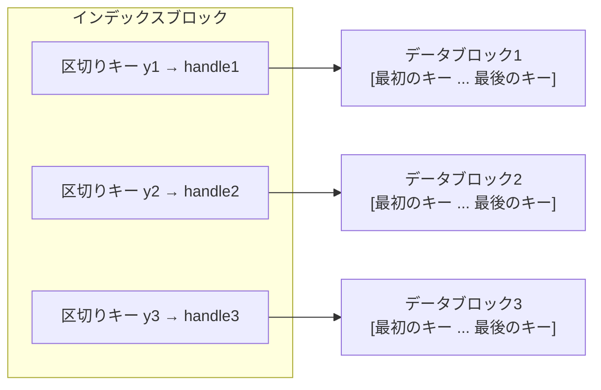
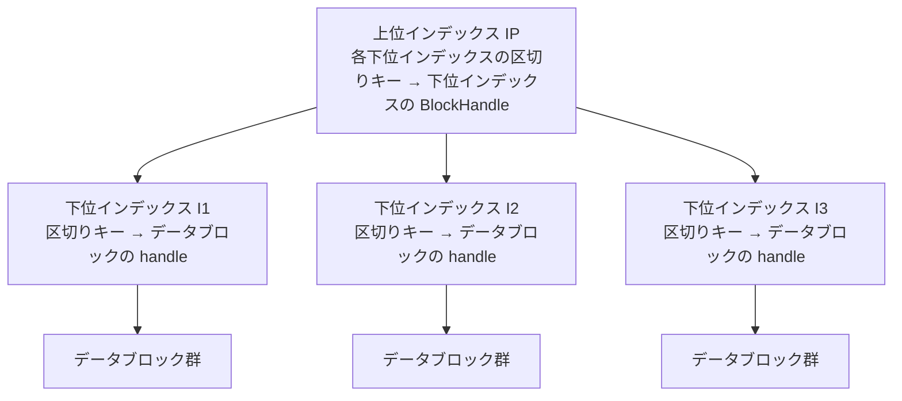

# 第17章 インデックスブロック

> **本章で読むソース**
>
> - [`include/rocksdb/table.h`](https://github.com/facebook/rocksdb/blob/v11.1.1/include/rocksdb/table.h)
> - [`table/format.h`](https://github.com/facebook/rocksdb/blob/v11.1.1/table/format.h)
> - [`table/block_based/index_builder.h`](https://github.com/facebook/rocksdb/blob/v11.1.1/table/block_based/index_builder.h)
> - [`table/block_based/index_builder.cc`](https://github.com/facebook/rocksdb/blob/v11.1.1/table/block_based/index_builder.cc)
> - [`table/block_based/index_reader_common.h`](https://github.com/facebook/rocksdb/blob/v11.1.1/table/block_based/index_reader_common.h)
> - [`table/block_based/binary_search_index_reader.h`](https://github.com/facebook/rocksdb/blob/v11.1.1/table/block_based/binary_search_index_reader.h) / [`.cc`](https://github.com/facebook/rocksdb/blob/v11.1.1/table/block_based/binary_search_index_reader.cc)
> - [`table/block_based/hash_index_reader.h`](https://github.com/facebook/rocksdb/blob/v11.1.1/table/block_based/hash_index_reader.h) / [`.cc`](https://github.com/facebook/rocksdb/blob/v11.1.1/table/block_based/hash_index_reader.cc)
> - [`table/block_based/partitioned_index_reader.h`](https://github.com/facebook/rocksdb/blob/v11.1.1/table/block_based/partitioned_index_reader.h) / [`.cc`](https://github.com/facebook/rocksdb/blob/v11.1.1/table/block_based/partitioned_index_reader.cc)
> - [`table/block_based/block_prefix_index.h`](https://github.com/facebook/rocksdb/blob/v11.1.1/table/block_based/block_prefix_index.h)
> - [`util/comparator.cc`](https://github.com/facebook/rocksdb/blob/v11.1.1/util/comparator.cc)

## この章の狙い

第16章では、SST のリーダーが目的キーをどのデータブロックから読むかをインデックスブロックに尋ねていた。
本章はそのインデックスブロックの中身を読む。
各データブロックの境界を表す短縮キーから `BlockHandle` への対応表がどう作られ、どう引かれるかを追う。
さらに、インデックスを小さく保つためのキー短縮と、巨大な SST でインデックスの全読みを避けるパーティション化という二つの最適化を、コードの機構として理解する。

## 前提

- [第14章 テーブルフォーマット](14-table-format.md)（SST のブロック構成と `BlockHandle`）
- [第15章 BlockBasedTableBuilder](15-block-based-table-builder.md)（ブロックを書き出す側）
- [第16章 BlockBasedTableReader](16-block-based-table-reader.md)（インデックスを引いてデータブロックを読む側）

## インデックスブロックが表す対応表

インデックスブロックは、各データブロックの「区切りキー」から、そのデータブロックの位置 `BlockHandle` への対応表である。
区切りキーは、あるデータブロックの最後のキーと次のデータブロックの最初のキーのあいだに置かれる。
この関係は `IndexValue` の定義コメントに簡潔にまとめられている。

[`table/format.h` L102-L129](https://github.com/facebook/rocksdb/blob/v11.1.1/table/format.h#L102-L129)

```cpp
// Value in block-based table file index.
//
// The index entry for block n is: y -> h, [x],
// where: y is some key between the last key of block n (inclusive) and the
// first key of block n+1 (exclusive); h is BlockHandle pointing to block n;
// x, if present, is the first key of block n (unshortened).
// This struct represents the "h, [x]" part.
struct IndexValue {
  BlockHandle handle;
  // Empty means unknown.
  Slice first_internal_key;
  // ... (中略) ...
};
```

インデックスエントリのキーが `y`、値が `IndexValue`（`BlockHandle handle` と、種類によっては先頭キー `first_internal_key`）である。
`y` はブロック n の最後のキー以上、ブロック n+1 の最初のキー未満の範囲にあればよい。
リーダーは目的キーをこの `y` の列に対して二分探索し、目的キー以上の最小の `y` を持つエントリの `handle` を得る。
これで第16章の Get が読むべきデータブロックが一つに定まる。



エントリの値が `BlockHandle` ただ一つで済むのは、データブロックがファイル内で連続して並ぶからである。
`IndexValue::EncodeTo` は直前の `BlockHandle` との差分だけを書くデルタ符号化を持ち、隣接ブロックの `offset` が前のブロックの末尾に一致するという前提を使って、値のサイズも削っている。

## インデックスキーの短縮（FindShortestSeparator）

インデックスのキー `y` は、データブロックの最後のキーをそのまま使う必要はない。
ブロック n の最後のキーとブロック n+1 の最初のキーを区切れる範囲のうち、最短のキーで足りる。
この短縮の意図は `index_shortening` オプションのコメントに書かれている。

[`include/rocksdb/table.h` L691-L700](https://github.com/facebook/rocksdb/blob/v11.1.1/include/rocksdb/table.h#L691-L700)

```cpp
// The index contains a key separating each pair of consecutive blocks.
// Let A be the highest key in one block, B the lowest key in the next block,
// and I the index entry separating these two blocks:
// [ ... A] I [B ...]
// I is allowed to be anywhere in [A, B).
// ... (中略) ...
// In kNoShortening mode, we use I=A. In other modes, we use the shortest
// key in [A, B), which usually significantly reduces index size.
```

短縮した区切りキー `I` は範囲 `[A, B)` のどこにあってもよい。
`I=A`、つまり前ブロックの最後のキーそのものを使うのが `kNoShortening` であり、それ以外のモードは `[A, B)` 内で最短のキーを選ぶ。
区切れさえすれば短いほどよいので、インデックスが縮む。

短縮を担う関数は `ShortenedIndexBuilder::FindShortestInternalKeySeparator` である。
ユーザーキー部分だけを取り出してコンパレータの `FindShortestSeparator` に渡し、最短の区切りを `scratch` に得る。

[`table/block_based/index_builder.cc` L78-L101](https://github.com/facebook/rocksdb/blob/v11.1.1/table/block_based/index_builder.cc#L78-L101)

```cpp
Slice ShortenedIndexBuilder::FindShortestInternalKeySeparator(
    const Comparator& comparator, const Slice& start, const Slice& limit,
    std::string* scratch) {
  // Attempt to shorten the user portion of the key
  Slice user_start = ExtractUserKey(start);
  Slice user_limit = ExtractUserKey(limit);
  scratch->assign(user_start.data(), user_start.size());
  comparator.FindShortestSeparator(scratch, user_limit);
  // ... (中略：assert) ...
  if (scratch->size() <= user_start.size() &&
      comparator.Compare(user_start, *scratch) < 0) {
    // User key has become shorter physically, but larger logically.
    // Tack on the earliest possible number to the shortened user key.
    PutFixed64(scratch,
               PackSequenceAndType(kMaxSequenceNumber, kValueTypeForSeek));
    // ... (中略：assert) ...
    return *scratch;
  } else {
    return start;
  }
}
```

短縮できたとき、短縮後のユーザーキーは元のキーより論理的には大きくなる。
そこで内部キーに戻すために、最小のシーケンス番号（`kMaxSequenceNumber` を詰めた形）を付け足して `[start, limit)` に収まる内部キーにする。
短縮できなければ元の `start` をそのまま返す。

バイト列コンパレータでの短縮は `BytewiseComparatorImpl::FindShortestSeparator` が行う。
最初に異なるバイトの位置を探し、そのバイトを一つ増やして以降を切り捨てる。

[`util/comparator.cc` L42-L91](https://github.com/facebook/rocksdb/blob/v11.1.1/util/comparator.cc#L42-L91)

```cpp
void FindShortestSeparator(std::string* start,
                           const Slice& limit) const override {
  // Find length of common prefix
  size_t min_length = std::min(start->size(), limit.size());
  size_t diff_index = 0;
  while ((diff_index < min_length) &&
         ((*start)[diff_index] == limit[diff_index])) {
    diff_index++;
  }
  // ... (中略) ...
    if (diff_index < limit.size() - 1 || start_byte + 1 < limit_byte) {
      (*start)[diff_index]++;
      start->resize(diff_index + 1);
    }
  // ... (中略) ...
}
```

たとえば `start` が `"the quick brown fox"`、`limit` が `"the who"` なら、最初に異なるバイトは `q` と `w` である。
`q` を一つ進めて `r` にし、以降を捨てて `"the r"` にすればよい。
区切りキーは元の十数バイトから数バイトに縮む。

ファイル内の最後のデータブロックには「次のブロックの最初のキー」がない。
この場合は区切りではなく後続キーを縮める `FindShortInternalKeySuccessor` を使い、最後のキーより大きい最短キーをコンパレータの `FindShortSuccessor` で作る。

[`table/block_based/index_builder.cc` L103-L120](https://github.com/facebook/rocksdb/blob/v11.1.1/table/block_based/index_builder.cc#L103-L120)

```cpp
Slice ShortenedIndexBuilder::FindShortInternalKeySuccessor(
    const Comparator& comparator, const Slice& key, std::string* scratch) {
  Slice user_key = ExtractUserKey(key);
  scratch->assign(user_key.data(), user_key.size());
  comparator.FindShortSuccessor(scratch);
  // ... (中略) ...
}
```

どのモードでどちらの短縮を使うかは `GetSeparatorWithSeq` が切り替える。
次ブロックの最初のキーがあるときは `kNoShortening` 以外で区切りを縮め、ないとき（ファイル末尾）は `kShortenSeparatorsAndSuccessor` のときだけ後続キーを縮める。

[`table/block_based/index_builder.h` L264-L293](https://github.com/facebook/rocksdb/blob/v11.1.1/table/block_based/index_builder.h#L264-L293)

```cpp
Slice GetSeparatorWithSeq(const Slice& last_key_in_current_block,
                          const Slice* first_key_in_next_block,
                          std::string* separator_scratch) {
  Slice separator_with_seq;
  if (first_key_in_next_block != nullptr) {
    if (shortening_mode_ !=
        BlockBasedTableOptions::IndexShorteningMode::kNoShortening) {
      separator_with_seq = FindShortestInternalKeySeparator(
          *comparator_->user_comparator(), last_key_in_current_block,
          *first_key_in_next_block, separator_scratch);
    } else {
      separator_with_seq = last_key_in_current_block;
    }
    // ... (中略) ...
  } else {
    if (shortening_mode_ == BlockBasedTableOptions::IndexShorteningMode::
                                kShortenSeparatorsAndSuccessor) {
      separator_with_seq = FindShortInternalKeySuccessor(
          *comparator_->user_comparator(), last_key_in_current_block,
          separator_scratch);
    } else {
      separator_with_seq = last_key_in_current_block;
    }
  }
  return separator_with_seq;
}
```

### なぜ短縮が効くのか

インデックスブロックは目的キーの探索ごとに二分探索の対象になり、Block Cache に常駐させたい。
キーを短くすると、エントリあたりのバイト数が減ってインデックスブロック全体が小さくなる。
これがキャッシュに載りやすくなってメモリ占有を減らし、二分探索でのキー比較も短いバイト列で済むので速くなる。
既定値は `kShortenSeparators` で、ブロック間の区切りは縮めるがファイル全体の上限となる最後のキーは縮めない。

[`include/rocksdb/table.h` L706-L717](https://github.com/facebook/rocksdb/blob/v11.1.1/include/rocksdb/table.h#L706-L717)

```cpp
enum class IndexShorteningMode : char {
  // Use full keys.
  kNoShortening,
  // Shorten index keys between blocks, but use full key for the last index
  // key, which is the upper bound of the whole file.
  kShortenSeparators,
  // Shorten both keys between blocks and key after last block.
  kShortenSeparatorsAndSuccessor,
};

IndexShorteningMode index_shortening =
    IndexShorteningMode::kShortenSeparators;
```

最後のキーを縮めると、その上限が過大評価され、シークのたびにファイル末尾のデータブロックを無駄に読みやすくなる。
だから既定では末尾だけ短縮しない。

### 既定で線形探索を避けるリスタート間隔

`ShortenedIndexBuilder` はもう一つの最適化を持つ。
インデックスブロックの `block_restart_interval` を既定で 1 にする。
ブロック内のキーは前のキーとの共通プレフィックスを省くデルタ符号化で格納され、リスタートポイントだけが完全なキーを持つ。
リスタート間隔が 1 なら全エントリがリスタートポイントになり、二分探索の着地点からキーを線形に復元する必要がなくなる。

[`table/block_based/index_builder.h` L214-L223](https://github.com/facebook/rocksdb/blob/v11.1.1/table/block_based/index_builder.h#L214-L223)

```cpp
// This index builder builds space-efficient index block.
//
// Optimizations:
//  1. Made block's `block_restart_interval` to be 1, which will avoid linear
//     search when doing index lookup (can be disabled by setting
//     index_block_restart_interval).
//  2. Shorten the key length for index block. Other than honestly using the
//     last key in the data block as the index key, we instead find a shortest
//     substitute key that serves the same function.
class ShortenedIndexBuilder : public IndexBuilder {
```

## インデックスの種類

インデックスの構築は `IndexBuilder` の派生で表され、`CreateIndexBuilder` がオプションの `IndexType` で実装を切り替える。

[`table/block_based/index_builder.cc` L26-L76](https://github.com/facebook/rocksdb/blob/v11.1.1/table/block_based/index_builder.cc#L26-L76)

```cpp
IndexBuilder* IndexBuilder::CreateIndexBuilder(
    BlockBasedTableOptions::IndexType index_type,
    // ... (中略) ...
    ) {
  IndexBuilder* result = nullptr;
  switch (index_type) {
    case BlockBasedTableOptions::kBinarySearch: {
      result = new ShortenedIndexBuilder(/* ... */);
      break;
    }
    case BlockBasedTableOptions::kHashSearch: {
      // Currently kHashSearch is incompatible with index_block_restart_interval
      // > 1
      assert(table_opt.index_block_restart_interval == 1);
      result = new HashIndexBuilder(/* ... */);
      break;
    }
    case BlockBasedTableOptions::kTwoLevelIndexSearch: {
      result = PartitionedIndexBuilder::CreateIndexBuilder(/* ... */);
      break;
    }
    case BlockBasedTableOptions::kBinarySearchWithFirstKey: {
      result = new ShortenedIndexBuilder(/* ... include_first_key=true ... */);
      break;
    }
    // ... (中略) ...
  }
  return result;
}
```

読む側の `IndexReader` も四つの実装に対応する。
四つに共通する処理は `IndexReaderCommon` がまとめており、インデックスブロックがリーダーに所有されているかキャッシュにあるか、キャッシュに固定されているかに関わらず、同じ手続きでブロックを取得できるようにしている。

[`table/block_based/index_reader_common.h` L15-L25](https://github.com/facebook/rocksdb/blob/v11.1.1/table/block_based/index_reader_common.h#L15-L25)

```cpp
// Encapsulates common functionality for the various index reader
// implementations. Provides access to the index block regardless of whether
// it is owned by the reader or stored in the cache, or whether it is pinned
// in the cache or not.
class BlockBasedTable::IndexReaderCommon : public BlockBasedTable::IndexReader {
 public:
  IndexReaderCommon(const BlockBasedTable* t,
                    CachableEntry<Block>&& index_block)
      : table_(t), index_block_(std::move(index_block)) {
    assert(table_ != nullptr);
  }
```

四種類の `IndexType` は次のとおりである。

[`include/rocksdb/table.h` L236-L264](https://github.com/facebook/rocksdb/blob/v11.1.1/include/rocksdb/table.h#L236-L264)

```cpp
enum IndexType : char {
  // A space efficient index block that is optimized for
  // binary-search-based index.
  kBinarySearch = 0x00,

  // The hash index, if enabled, will do the hash lookup when
  // `Options.prefix_extractor` is provided.
  kHashSearch = 0x01,

  // A two-level index implementation. Both levels are binary search indexes.
  // Second level index blocks ("partitions") use block cache even when
  // cache_index_and_filter_blocks=false.
  kTwoLevelIndexSearch = 0x02,

  // Like kBinarySearch, but index also contains first key of each block.
  // ... (中略) ...
  kBinarySearchWithFirstKey = 0x03,
};

IndexType index_type = kBinarySearch;
```

### kBinarySearch（既定）

既定の `kBinarySearch` は、前節の `ShortenedIndexBuilder` がそのまま作る単一のインデックスブロックである。
読む側の `BinarySearchIndexReader` はインデックスブロックの薄いラッパーにすぎない。
ヘッダのコメントどおり、`Block` クラスが備える二分探索をそのまま使う。

[`table/block_based/binary_search_index_reader.h` L13-L16](https://github.com/facebook/rocksdb/blob/v11.1.1/table/block_based/binary_search_index_reader.h#L13-L16)

```cpp
// Index that allows binary search lookup for the first key of each block.
// This class can be viewed as a thin wrapper for `Block` class which already
// supports binary search.
class BinarySearchIndexReader : public BlockBasedTable::IndexReaderCommon {
```

`NewIterator` はインデックスブロックを取得し、そのブロックに対するインデックスイテレータを返すだけである。

[`table/block_based/binary_search_index_reader.cc` L42-L73](https://github.com/facebook/rocksdb/blob/v11.1.1/table/block_based/binary_search_index_reader.cc#L42-L73)

```cpp
InternalIteratorBase<IndexValue>* BinarySearchIndexReader::NewIterator(
    const ReadOptions& read_options, bool /* disable_prefix_seek */,
    IndexBlockIter* iter, GetContext* get_context,
    BlockCacheLookupContext* lookup_context) {
  const BlockBasedTable::Rep* rep = table()->get_rep();
  CachableEntry<Block> index_block;
  const Status s = GetOrReadIndexBlock(get_context, lookup_context,
                                       &index_block, read_options);
  // ... (中略：エラー処理) ...
  auto it = index_block.GetValue()->NewIndexIterator(
      internal_comparator()->user_comparator(),
      rep->get_global_seqno(BlockType::kIndex), iter, kNullStats, true,
      index_has_first_key(), index_key_includes_seq(), index_value_is_full(),
      false /* block_contents_pinned */, user_defined_timestamps_persisted(),
      nullptr /* prefix_index */, rep->table_options.index_block_search_type);
  // ... (中略) ...
  return it;
}
```

### kHashSearch

`kHashSearch` は、二分探索可能なインデックスはそのまま持ちつつ、プレフィックスからブロックへのハッシュ表を追加する。
`prefix_extractor` で取り出したキーのプレフィックスを使い、点探索を二分探索より速い経路で解こうとする。
`HashIndexBuilder` は内部に `ShortenedIndexBuilder` を持ち、それに加えてプレフィックスの列とそのメタデータの二つのメタブロックを書き出す。

[`table/block_based/index_builder.h` L489-L516](https://github.com/facebook/rocksdb/blob/v11.1.1/table/block_based/index_builder.h#L489-L516)

```cpp
// HashIndexBuilder contains a binary-searchable primary index and the
// metadata for secondary hash index construction.
// The metadata for hash index consists two parts:
//  - a metablock that compactly contains a sequence of prefixes. All prefixes
//    are stored consectively without any metadata (like, prefix sizes) being
//    stored, which is kept in the other metablock.
//  - a metablock contains the metadata of the prefixes, including prefix size,
//    restart index and number of block it spans.
// ... (中略：メタブロックのレイアウト図) ...
class HashIndexBuilder : public IndexBuilder {
```

読む側の `HashIndexReader::Create` は、まず通常のインデックスブロックを読んだうえで、二つのメタブロックからプレフィックスインデックスを組み立てる。
プレフィックスインデックスの構築に失敗しても致命的ではなく、二分探索インデックスへ素直に退避できる点に注意が必要である。

[`table/block_based/hash_index_reader.cc` L43-L47](https://github.com/facebook/rocksdb/blob/v11.1.1/table/block_based/hash_index_reader.cc#L43-L47)

```cpp
  // Note, failure to create prefix hash index does not need to be a
  // hard error. We can still fall back to the original binary search index.
  // So, Create will succeed regardless, from this point on.

  index_reader->reset(new HashIndexReader(table, std::move(index_block)));
```

プレフィックスからブロックを引くのは `BlockPrefixIndex` である。
`GetBlocks` がキーを受け取り、そのプレフィックスから候補となるデータブロックの集合を返す。
返り値 0 はキーが存在しないことを表す。

[`table/block_based/block_prefix_index.h` L22-L33](https://github.com/facebook/rocksdb/blob/v11.1.1/table/block_based/block_prefix_index.h#L22-L33)

```cpp
class BlockPrefixIndex {
 public:
  // Maps a key to a list of data blocks that could potentially contain
  // the key, based on the prefix.
  // Returns the total number of relevant blocks, 0 means the key does
  // not exist.
  uint32_t GetBlocks(const Slice& key, uint32_t** blocks);
  // ... (中略) ...
```

`HashIndexReader::NewIterator` は `total_order_seek` でない限り、組み立てた `prefix_index_` をイテレータに渡す。
全順序シークやプレフィックスシークの無効化が指定されたときは、ハッシュ経路を使わず通常の二分探索に戻る。

[`table/block_based/hash_index_reader.cc` L129-L139](https://github.com/facebook/rocksdb/blob/v11.1.1/table/block_based/hash_index_reader.cc#L129-L139)

```cpp
  Statistics* kNullStats = nullptr;
  const bool total_order_seek =
      read_options.total_order_seek || disable_prefix_seek;
  // We don't return pinned data from index blocks, so no need
  // to set `block_contents_pinned`.
  auto it = index_block.GetValue()->NewIndexIterator(
      internal_comparator()->user_comparator(),
      rep->get_global_seqno(BlockType::kIndex), iter, kNullStats,
      total_order_seek, index_has_first_key(), index_key_includes_seq(),
      index_value_is_full(), false /* block_contents_pinned */,
      user_defined_timestamps_persisted(), prefix_index_.get());
```

### kBinarySearchWithFirstKey

`kBinarySearchWithFirstKey` は `kBinarySearch` と同じく `ShortenedIndexBuilder` で作るが、`include_first_key` を真にして各エントリに「そのブロックの先頭キー」も持たせる。
これでイテレータは、本当に必要になるまでデータブロックの読み込みを遅らせられる。

[`include/rocksdb/table.h` L250-L261](https://github.com/facebook/rocksdb/blob/v11.1.1/include/rocksdb/table.h#L250-L261)

```cpp
// Like kBinarySearch, but index also contains first key of each block.
// This allows iterators to defer reading the block until it's actually
// needed. May significantly reduce read amplification of short range scans.
// Without it, iterator seek usually reads one block from each level-0 file
// and from each level, which may be expensive.
// Works best in combination with:
//  - IndexShorteningMode::kNoShortening,
//  - custom FlushBlockPolicy to cut blocks at some meaningful boundaries,
//    e.g. when prefix changes.
// Makes the index significantly bigger (2x or more), especially when keys
// are long.
kBinarySearchWithFirstKey = 0x03,
```

先頭キーを持てば、シーク先のキーがそのブロックの先頭キーより小さいと分かった時点で、ブロックを読まずに次へ進める。
短いレンジスキャンでは、各レベルから一ブロックずつ読む read amplification を抑えられる。
代償としてインデックスは大きくなり、キーが長い場合は二倍以上に膨らむ。
先頭キーを未短縮で持つので、コメントは `kNoShortening` との併用を勧めている。
先頭キーの保持は `OnKeyAdded` がブロックごとの最初の内部キーを記録することで行う。

[`table/block_based/index_builder.h` L257-L262](https://github.com/facebook/rocksdb/blob/v11.1.1/table/block_based/index_builder.h#L257-L262)

```cpp
void OnKeyAdded(const Slice& key,
                const std::optional<Slice>& /*value*/) override {
  if (include_first_key_ && current_block_first_internal_key_.empty()) {
    current_block_first_internal_key_.assign(key.data(), key.size());
  }
}
```

## パーティションドインデックス（kTwoLevelIndexSearch）

巨大な SST では、インデックスブロック自体が大きくなり、一度の探索のために全体を読んでキャッシュに載せるのが重くなる。
`kTwoLevelIndexSearch` はインデックスをブロック分割し、上位インデックスから必要な部分だけを読む。
ディスク上の配置は、`ShortenedIndexBuilder` で作った下位インデックスのブロック列 `I I I ... I` の後ろに、それらを指す上位インデックス `IP` を置いた形である。

[`table/block_based/index_builder.h` L643-L653](https://github.com/facebook/rocksdb/blob/v11.1.1/table/block_based/index_builder.h#L643-L653)

```cpp
/**
 * IndexBuilder for two-level indexing. Internally it creates a new index for
 * each partition and Finish then in order when Finish is called on it
 * continiously until Status::OK() is returned.
 *
 * The format on the disk would be I I I I I I IP where I is block containing a
 * partition of indexes built using ShortenedIndexBuilder and IP is a block
 * containing a secondary index on the partitions, built using
 * ShortenedIndexBuilder.
 */
class PartitionedIndexBuilder : public IndexBuilder {
```



`PartitionedIndexBuilder` は、現在書き込み中の下位インデックスを `sub_index_builder_` として一つ保持し、フラッシュポリシーが境界を告げると新しい下位インデックスへ切り替える。
`MaybeFlush` がその切り替えを行い、`metadata_block_size` を超えたか外部から分割要求があったときに `MakeNewSubIndexBuilder` を呼ぶ。

[`table/block_based/index_builder.cc` L236-L252](https://github.com/facebook/rocksdb/blob/v11.1.1/table/block_based/index_builder.cc#L236-L252)

```cpp
void PartitionedIndexBuilder::MaybeFlush(const Slice& index_key,
                                         const BlockHandle& index_value) {
  bool do_flush = !sub_index_builder_->index_block_builder_.empty() &&
                  (partition_cut_requested_ ||
                   flush_policy_->Update(
                       index_key, EncodedBlockHandle(index_value).AsSlice()));
  if (do_flush) {
    assert(entries_.back().value.get() == sub_index_builder_);
    // ... (中略) ...
    cut_filter_block = true;
    MakeNewSubIndexBuilder();
  }
}
```

上位インデックスは `Finish` を何度も呼ぶ過程で組み上がる。
`Finish` は下位インデックスを一つずつ書き出すたびに `Status::Incomplete()` を返し、呼び出し側に続行を促す。
直前に書いた下位インデックスの `BlockHandle` を `last_partition_block_handle` で受け取り、その区切りキーとともに上位インデックスへ一エントリ追加する。
残りの下位インデックスがなくなったとき、上位インデックスを `Finish` して `Status::OK()` を返す。

[`table/block_based/index_builder.cc` L327-L368](https://github.com/facebook/rocksdb/blob/v11.1.1/table/block_based/index_builder.cc#L327-L368)

```cpp
  if (finishing_indexes_ == true) {
    Entry& last_entry = entries_.front();
    EncodedBlockHandle handle_encoding(last_partition_block_handle);
    // ... (中略：デルタ符号化) ...
    index_block_builder_.Add(last_entry.key, handle_encoding.AsSlice(),
                             &handle_delta_encoding_slice);
    // ... (中略) ...
    entries_.pop_front();
  }
  // If there is no sub_index left, then return the 2nd level index.
  if (UNLIKELY(entries_.empty())) {
    // ... (中略：上位インデックスの Finish) ...
    return Status::OK();
  } else {
    // Finish the next partition index in line and Incomplete() to indicate we
    // expect more calls to Finish
    Entry& entry = entries_.front();
    // ... (中略) ...
    auto s = entry.value->Finish(index_blocks);
    index_size_ += index_blocks->index_block_contents.size();
    finishing_indexes_ = true;
    return s.ok() ? Status::Incomplete() : s;
  }
```

読む側の `PartitionIndexReader` は、`NewIterator` で二段イテレータ（two-level iterator）を返す。
第一段が上位インデックス、第二段が必要になった下位インデックスを辿る。

[`table/block_based/partitioned_index_reader.h` L14-L31](https://github.com/facebook/rocksdb/blob/v11.1.1/table/block_based/partitioned_index_reader.h#L14-L31)

```cpp
// Index that allows binary search lookup in a two-level index structure.
class PartitionIndexReader : public BlockBasedTable::IndexReaderCommon {
 public:
  // ... (中略) ...
  // return a two-level iterator: first level is on the partition index
  InternalIteratorBase<IndexValue>* NewIterator(
      const ReadOptions& read_options, bool /* disable_prefix_seek */,
      IndexBlockIter* iter, GetContext* get_context,
      BlockCacheLookupContext* lookup_context) override;
```

下位インデックスがすべてキャッシュに固定されているなら、`NewTwoLevelIterator` で固定済みパーティションを直接辿る。
そうでなければ `PartitionedIndexIterator` を返し、必要な下位インデックスを Block Cache 越しに読む。

[`table/block_based/partitioned_index_reader.cc` L65-L99](https://github.com/facebook/rocksdb/blob/v11.1.1/table/block_based/partitioned_index_reader.cc#L65-L99)

```cpp
  Statistics* kNullStats = nullptr;
  // Filters are already checked before seeking the index
  if (!partition_map_.empty()) {
    it = NewTwoLevelIterator(
        new BlockBasedTable::PartitionedIndexIteratorState(table(),
                                                           &partition_map_),
        index_block.GetValue()->NewIndexIterator(/* ... 上位インデックス ... */));
  } else {
    // ... (中略) ...
    it = new PartitionedIndexIterator(
        table(), ro, *internal_comparator(), std::move(index_iter),
        // ... (中略) ...
        );
  }
```

### なぜパーティション化がメモリを節約するのか

二段構造の効きどころは、上位インデックスが十分小さく、目的キーを含む下位インデックスを一つに絞れる点にある。
目的キーの探索では、上位インデックスとその下位インデックス一つだけを読めばよく、巨大なインデックス全体を読んでキャッシュに載せる必要がない。
これでインデックスのために常駐させるメモリが下位インデックス単位に分割され、必要な部分だけがキャッシュを占める。

`enum` のコメントが述べるとおり、下位インデックス（パーティション）は `cache_index_and_filter_blocks=false` でも Block Cache を使う。
これは下位インデックスの寿命をキャッシュの追い出しに委ねることで、固定的なメモリ占有を避ける設計である。
二段イテレータそのものの動きは[第26章 イテレータ](../part04-read-path/26-iterators.md)で扱う。
Block Cache がどのようにブロックを保持し追い出すかは[第38章 Cache（シャーディング）](../part07-cache/38-cache-sharded.md)で扱う。

## まとめ

- インデックスブロックは、各データブロックの区切りキー（最後のキー以上、次ブロックの最初のキー未満）から `BlockHandle` への対応表である。リーダーはこの区切りキーを二分探索し、目的キーが入るデータブロックを一つに絞る。
- 区切りキーは `FindShortestSeparator` と `FindShortSuccessor` で最短に縮める。短くするとインデックスブロックが小さくなり、キャッシュに載りやすく比較も速い。既定の `kShortenSeparators` はファイル末尾の上限キーだけ縮めない。
- `ShortenedIndexBuilder` はインデックスの `block_restart_interval` を 1 にし、二分探索の着地点からの線形復元をなくす。
- `kBinarySearch` は単一の二分探索インデックス。`kHashSearch` はプレフィックスからブロックを引くハッシュ表を足し、失敗時は二分探索に退避する。`kBinarySearchWithFirstKey` は各エントリに先頭キーを持たせ、データブロック読みを遅延させる代わりにインデックスが膨らむ。
- `kTwoLevelIndexSearch`（パーティションドインデックス）はインデックスをブロック分割し、上位インデックスから必要な下位インデックスだけを読む。巨大 SST でインデックス全読みを避け、常駐メモリを下位インデックス単位に分割する。

## 関連する章

- [第16章 BlockBasedTableReader](16-block-based-table-reader.md)（インデックスを引く呼び出し側）
- [第18章 ブルームフィルタ](18-bloom-filter.md)（同じくブロックの読み飛ばしを助ける）
- [第26章 イテレータ](../part04-read-path/26-iterators.md)（two-level iterator の動き）
- [第38章 Cache（シャーディング）](../part07-cache/38-cache-sharded.md)（インデックスブロックの保持と追い出し）
