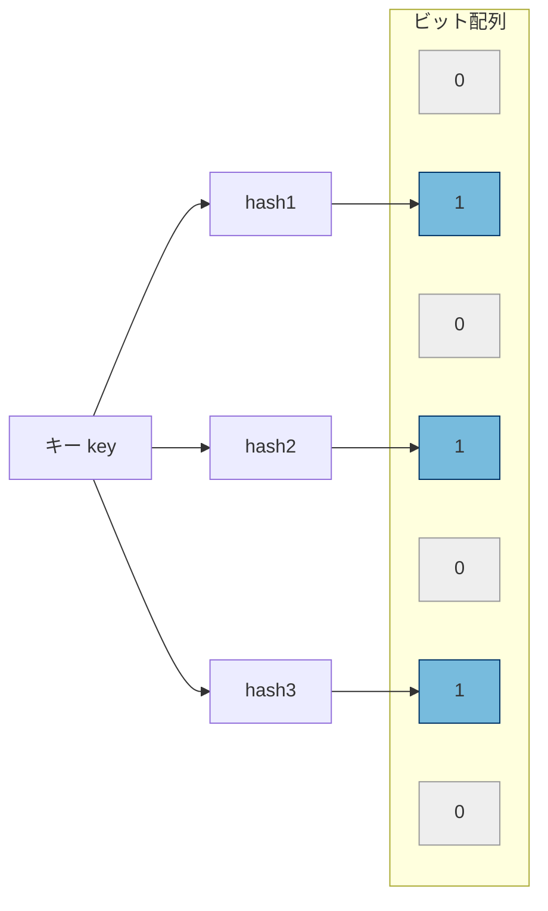
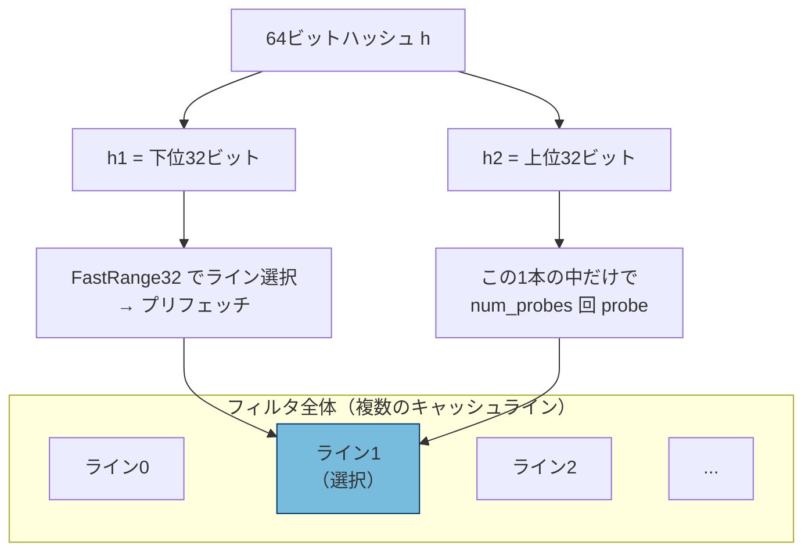

# 第18章 フィルタと Bloom フィルタ

> **本章で読むソース**
>
> - [`include/rocksdb/filter_policy.h`](https://github.com/facebook/rocksdb/blob/v11.1.1/include/rocksdb/filter_policy.h)
> - [`util/bloom_impl.h`](https://github.com/facebook/rocksdb/blob/v11.1.1/util/bloom_impl.h)
> - [`table/block_based/filter_policy.cc`](https://github.com/facebook/rocksdb/blob/v11.1.1/table/block_based/filter_policy.cc)
> - [`table/block_based/filter_block.h`](https://github.com/facebook/rocksdb/blob/v11.1.1/table/block_based/filter_block.h)
> - [`table/block_based/full_filter_block.h`](https://github.com/facebook/rocksdb/blob/v11.1.1/table/block_based/full_filter_block.h)
> - [`table/block_based/full_filter_block.cc`](https://github.com/facebook/rocksdb/blob/v11.1.1/table/block_based/full_filter_block.cc)
> - [`table/block_based/partitioned_filter_block.h`](https://github.com/facebook/rocksdb/blob/v11.1.1/table/block_based/partitioned_filter_block.h)
> - [`util/dynamic_bloom.h`](https://github.com/facebook/rocksdb/blob/v11.1.1/util/dynamic_bloom.h)

## この章の狙い

SST のフィルタは、あるキーがそのファイルに存在しないことを、データブロックを読む前に高速かつ省メモリで判定する仕組みである。
本章では Bloom フィルタの原理と偽陽性率の計算を実コードで確認し、RocksDB の標準実装である `FastLocalBloomImpl` がどのようにキャッシュミスを抑えているかを機構として説明する。
あわせて、SST 1ファイルを1つのフィルタにまとめるフルフィルタブロックと、それをブロック分割するパーティションドフィルタの構造を読む。

## 前提

- [第15章 BlockBasedTableBuilder](../part03-sst/15-block-based-table-builder.md)（フィルタブロックが SST のどこに書かれるか）
- [第16章 BlockBasedTableReader](../part03-sst/16-block-based-table-reader.md)（Get の読み取り経路でフィルタが参照される位置）
- [第17章 インデックスブロック](../part03-sst/17-index-block.md)（パーティション化の考え方）

## フィルタは何のためにあるか

LSM ツリーでは、1つのキーを `Get` するために複数の SST を新しいレベルから順に調べる。
目的のキーが古いレベルにしかなければ、その手前の SST はすべて空振りする。
空振りのたびにインデックスを引いてデータブロックを読めば、無駄なディスク I/O が積み上がる。

フィルタは、この空振りを読み取りの手前で棄却するためにある。
SST ごとに「このファイルに含まれるキーの集合」を小さなビット列に要約しておき、`Get` のたびにまず要約へ問い合わせる。
要約が「ない」と答えれば、そのファイルのデータブロックは読まずに次の SST へ進める。

`FilterPolicy` のヘッダコメントは、この効果を「`DB::Get()` 1回あたりのディスクシークを数回から1回に減らせる」と述べている。

[`include/rocksdb/filter_policy.h` L9-L18](https://github.com/facebook/rocksdb/blob/v11.1.1/include/rocksdb/filter_policy.h#L9-L18)

```cpp
// A database can be configured with a custom FilterPolicy object.
// This object is responsible for creating a small filter from a set
// of keys.  These filters are stored in rocksdb and are consulted
// automatically by rocksdb to decide whether or not to read some
// information from disk. In many cases, a filter can cut down the
// number of disk seeks form a handful to a single disk seek per
// DB::Get() call.
```

要約に求められる性質は二つある。
偽陰性を出さないこと、つまり実際に含まれるキーを「ない」と誤判定しないことである。
これが破れると読むべきデータを読み飛ばし、`Get` が誤った結果を返す。
もう一つは小さいこと、つまり要約自体がブロックキャッシュに載る程度の大きさに収まることである。
Bloom フィルタはこの二つを満たす。
偽陽性（含まれないキーを「あるかもしれない」と答える）は許すが、偽陰性は構造上起こらない。

`Get` 経路のどの位置でフィルタが引かれるかは[第16章](../part03-sst/16-block-based-table-reader.md)と[第23章 Get](../part04-read-path/23-get.md)で扱う。
本章はフィルタそのものの構造に集中する。

## Bloom フィルタの原理と偽陽性率

Bloom フィルタは、ビット配列と複数のハッシュ関数からなる。
キーを追加するときは、そのキーを複数のハッシュ関数に通し、得られた位置のビットをすべて1にする。
キーの有無を問い合わせるときは、同じ位置をすべて調べる。
1つでも0があれば、そのキーは追加されていない（偽陰性なし）。
すべて1なら「あるかもしれない」と答える。
このとき、別のキー群がたまたま同じ位置をすべて立てていれば偽陽性になる。

ハッシュ位置の数を probe 数と呼ぶ。
偽陽性率は、キー1個あたりに割り当てるビット数（bits per key）と probe 数で決まる。
標準的な Bloom フィルタの偽陽性率は次の式で見積もられる。

[`util/bloom_impl.h` L26-L36](https://github.com/facebook/rocksdb/blob/v11.1.1/util/bloom_impl.h#L26-L36)

```cpp
class BloomMath {
 public:
  // False positive rate of a standard Bloom filter, for given ratio of
  // filter memory bits to added keys, and number of probes per operation.
  // (The false positive rate is effectively independent of scale, assuming
  // the implementation scales OK.)
  static double StandardFpRate(double bits_per_key, int num_probes) {
    // Standard very-good-estimate formula. See
    // https://en.wikipedia.org/wiki/Bloom_filter#Probability_of_false_positives
    return std::pow(1.0 - std::exp(-num_probes / bits_per_key), num_probes);
  }
```

`StandardFpRate` の式は、ビット1個が立っていない確率 `exp(-num_probes / bits_per_key)` から、probe 数ぶんのビットがすべて立っている確率を求めている。
偽陽性率はビット数とキー数の比だけで決まり、フィルタの絶対的な大きさには依存しない。
コメントが「規模に対して実質的に独立」と書いているのはこの点である。

`bits_per_key` を与えたとき、偽陽性率を最小にする probe 数はおよそ `bits_per_key * ln(2)` になる。
レガシー実装の probe 数選択はこの理論値をそのまま使っている。

[`util/bloom_impl.h` L356-L362](https://github.com/facebook/rocksdb/blob/v11.1.1/util/bloom_impl.h#L356-L362)

```cpp
  static inline int ChooseNumProbes(int bits_per_key) {
    // We intentionally round down to reduce probing cost a little bit
    int num_probes = static_cast<int>(bits_per_key * 0.69);  // 0.69 =~ ln(2)
    if (num_probes < 1) num_probes = 1;
    if (num_probes > 30) num_probes = 30;
    return num_probes;
  }
```

`NewBloomFilterPolicy` の `bits_per_key` 引数が、この見積もりの入力になる。
ヘッダは 9.9 を「およそ1%の偽陽性率になる良い選択」として推奨し、極端な値を丸める方針を記している。

[`include/rocksdb/filter_policy.h` L136-L149](https://github.com/facebook/rocksdb/blob/v11.1.1/include/rocksdb/filter_policy.h#L136-L149)

```cpp
// Return a new filter policy that uses a bloom filter with approximately
// the specified number of bits per key. See
// https://github.com/facebook/rocksdb/wiki/RocksDB-Bloom-Filter
//
// bits_per_key: average bits allocated per key in bloom filter. A good
// choice is 9.9, which yields a filter with ~ 1% false positive rate.
// When format_version < 5, the value will be rounded to the nearest
// integer. Recommend using no more than three decimal digits after the
// decimal point, as in 6.667.
//
// To avoid configurations that are unlikely to produce good filtering
// value for the CPU overhead, bits_per_key < 0.5 is rounded down to 0.0
// which means "generate no filter", and 0.5 <= bits_per_key < 1.0 is
// rounded up to 1.0, for a 62% FP rate.
```

`BloomLikeFilterPolicy` のコンストラクタが、この丸めと小数の保持を行う。
0.5 未満は「フィルタなし」を意味する0へ、100以上は100へ丸め、内部では1000倍した整数 `millibits_per_key_` で保持する。
小数3桁が浮動小数点誤差で取りこぼされないよう、わずかに切り上げ側へ寄せている。

[`table/block_based/filter_policy.cc` L1424-L1440](https://github.com/facebook/rocksdb/blob/v11.1.1/table/block_based/filter_policy.cc#L1424-L1440)

```cpp
BloomLikeFilterPolicy::BloomLikeFilterPolicy(double bits_per_key)
    : warned_(false), aggregate_rounding_balance_(0) {
  // Sanitize bits_per_key
  if (bits_per_key < 0.5) {
    // Round down to no filter
    bits_per_key = 0;
  } else if (bits_per_key < 1.0) {
    // Minimum 1 bit per key (equiv) when creating filter
    bits_per_key = 1.0;
  } else if (!(bits_per_key < 100.0)) {  // including NaN
    bits_per_key = 100.0;
  }

  // Includes a nudge toward rounding up, to ensure on all platforms
  // that doubles specified with three decimal digits after the decimal
  // point are interpreted accurately.
  millibits_per_key_ = static_cast<int>(bits_per_key * 1000.0 + 0.500001);
```



図は probe 数3の例である。
追加時はハッシュが指す3ビットを立て、問い合わせ時は同じ3ビットを調べる。
立っていないビットが1つでもあれば確実に「ない」、すべて立っていれば「あるかもしれない」と答える。

## FastLocalBloom: probe をキャッシュラインに閉じ込める

ここからが本章の中心である。
教科書どおりの Bloom フィルタには、性能上の弱点が一つある。
probe ごとにハッシュ位置がビット配列全体へばらまかれるため、1キーの問い合わせで probe 数ぶんのメモリ位置を触ることになる。
フィルタがキャッシュに収まらない大きさなら、probe ごとにキャッシュミスが起きうる。
レガシー実装 `LegacyNoLocalityBloomImpl` はまさにこの形で、コメントが「probe に局所性がない（遅い）」と明記している。

[`util/bloom_impl.h` L347-L354](https://github.com/facebook/rocksdb/blob/v11.1.1/util/bloom_impl.h#L347-L354)

```cpp
// A legacy Bloom filter implementation with no locality of probes (slow).
// It uses double hashing to generate a sequence of hash values.
// Asymptotic analysis is in [Kirsch,Mitzenmacher 2006], but known to have
// subtle accuracy flaws for practical sizes [Dillinger,Manolios 2004].
//
// DO NOT REUSE
//
class LegacyNoLocalityBloomImpl {
```

RocksDB の標準実装 `FastLocalBloomImpl`（`format_version` 5以降の Bloom フィルタ）は、1キー分の全 probe を1つのキャッシュライン（64バイト、512ビット）の内側に収める。
こうすると、何回 probe しても触れるメモリは1キャッシュラインだけになり、probe ごとのキャッシュミスが1キーあたり1回に減る。
これが「キャッシュ局所化」であり、本実装の高速化の核である。

機構は2段階に分かれる。
まず上位ハッシュ `h1` で1本のキャッシュラインを選ぶ。
`len_bytes >> 6` でフィルタを64バイト単位のライン数に直し、`FastRange32` でそのうち1本に対応づけ、`<< 6` で先頭バイトオフセットへ戻す。
`FastRange32` は剰余 `%` の代わりにハッシュと範囲の乗算で写像する手法で、除算を1回の乗算に置き換える。

[`util/bloom_impl.h` L200-L214](https://github.com/facebook/rocksdb/blob/v11.1.1/util/bloom_impl.h#L200-L214)

```cpp
  static inline void AddHash(uint32_t h1, uint32_t h2, uint32_t len_bytes,
                             int num_probes, char* data) {
    uint32_t bytes_to_cache_line = FastRange32(h1, len_bytes >> 6) << 6;
    AddHashPrepared(h2, num_probes, data + bytes_to_cache_line);
  }

  static inline void AddHashPrepared(uint32_t h2, int num_probes,
                                     char* data_at_cache_line) {
    uint32_t h = h2;
    for (int i = 0; i < num_probes; ++i, h *= uint32_t{0x9e3779b9}) {
      // 9-bit address within 512 bit cache line
      int bitpos = h >> (32 - 9);
      data_at_cache_line[bitpos >> 3] |= (uint8_t{1} << (bitpos & 7));
    }
  }
```

次に、選んだ1本の中だけで probe する。
`AddHashPrepared` は下位ハッシュ `h2` を黄金比定数 `0x9e3779b9` で繰り返し掛けて再混合し、各 probe で上位9ビットを取り出す。
512ビットのライン内は9ビットで一意にアドレスできるので、`bitpos >> 3` でバイト、`bitpos & 7` でバイト内ビットを選ぶ。
ループはラインの外へ出ない。
問い合わせ側 `HashMayMatchPrepared` の非 SIMD 版も同じ計算で、1ビットでも0なら即 `false` を返す。

[`util/bloom_impl.h` L334-L344](https://github.com/facebook/rocksdb/blob/v11.1.1/util/bloom_impl.h#L334-L344)

```cpp
#else
    for (int i = 0; i < num_probes; ++i, h *= uint32_t{0x9e3779b9}) {
      // 9-bit address within 512 bit cache line
      int bitpos = h >> (32 - 9);
      if ((data_at_cache_line[bitpos >> 3] & (char(1) << (bitpos & 7))) == 0) {
        return false;
      }
    }
    return true;
#endif
```

ライン先頭が決まった時点で `PrepareHash` がそのラインをプリフェッチする。
512ビットは64バイト、つまりキャッシュライン1本ぶんなので、先頭と末尾の2点を触れば1本全体がキャッシュに乗る。
probe 計算が始まるころにはデータが届いている。

[`util/bloom_impl.h` L216-L223](https://github.com/facebook/rocksdb/blob/v11.1.1/util/bloom_impl.h#L216-L223)

```cpp
  static inline void PrepareHash(uint32_t h1, uint32_t len_bytes,
                                 const char* data,
                                 uint32_t /*out*/* byte_offset) {
    uint32_t bytes_to_cache_line = FastRange32(h1, len_bytes >> 6) << 6;
    PREFETCH(data + bytes_to_cache_line, 0 /* rw */, 1 /* locality */);
    PREFETCH(data + bytes_to_cache_line + 63, 0 /* rw */, 1 /* locality */);
    *byte_offset = bytes_to_cache_line;
  }
```



キャッシュ局所化には偽陽性率の代償がある。
キーがラインに偏って詰まると、混み合ったラインでは偽陽性率が上がるからである。
`CacheLocalFpRate` はこの偏りを取り込み、ライン占有数の平均から標準偏差ぶん上下した2つの偽陽性率の平均で見積もる。

[`util/bloom_impl.h` L42-L58](https://github.com/facebook/rocksdb/blob/v11.1.1/util/bloom_impl.h#L42-L58)

```cpp
  static double CacheLocalFpRate(double bits_per_key, int num_probes,
                                 int cache_line_bits) {
    if (bits_per_key <= 0.0) {
      // Fix a discontinuity
      return 1.0;
    }
    double keys_per_cache_line = cache_line_bits / bits_per_key;
    // A reasonable estimate is the average of the FP rates for one standard
    // deviation above and below the mean bucket occupancy. See
    // https://github.com/facebook/rocksdb/wiki/RocksDB-Bloom-Filter#the-math
    double keys_stddev = std::sqrt(keys_per_cache_line);
    double crowded_fp = StandardFpRate(
        cache_line_bits / (keys_per_cache_line + keys_stddev), num_probes);
    double uncrowded_fp = StandardFpRate(
        cache_line_bits / (keys_per_cache_line - keys_stddev), num_probes);
    return (crowded_fp + uncrowded_fp) / 2;
  }
```

クラスのヘッダコメントは、この代償が小さく抑えられていることを具体値で示している。
10 bits/key、probe 数6、512ビットラインのとき、キャッシュ局所 Bloom の理論最良は偽陽性率0.9535%で、本実装は約0.957%を達成する。
局所性を持たないレガシー実装の1.138%と比べれば、局所化しても精度はほとんど落ちていない。

[`util/bloom_impl.h` L105-L108](https://github.com/facebook/rocksdb/blob/v11.1.1/util/bloom_impl.h#L105-L108)

```cpp
// E.g. theoretical best for 10 bits/key, num_probes=6, and 512-bit bucket
// (Intel cache line size) is 0.9535% FP rate. This implementation yields
// about 0.957%. (Compare to LegacyLocalityBloomImpl<false> at 1.138%, or
// about 0.951% for 1024-bit buckets, cache line size for some ARM CPUs.)
```

`FastLocalBloomImpl` の probe 数選択は、レガシーの `bits_per_key * ln(2)` とは別の表になっている。
AVX2 を使えば最大8 probe を同じコストで処理できるため、実測に基づき最も精度の高い probe 数を選ぶ。
コメントは「キャッシュ局所 Bloom では標準 Bloom より probe 数を小さくできる場合がある（16 bits/key で11ではなく9）」と注記している。

[`util/bloom_impl.h` L156-L175](https://github.com/facebook/rocksdb/blob/v11.1.1/util/bloom_impl.h#L156-L175)

```cpp
  static inline int ChooseNumProbes(int millibits_per_key) {
    // Since this implementation can (with AVX2) make up to 8 probes
    // for the same cost, we pick the most accurate num_probes, based
    // on actual tests of the implementation. Note that for higher
    // bits/key, the best choice for cache-local Bloom can be notably
    // smaller than standard bloom, e.g. 9 instead of 11 @ 16 b/k.
    if (millibits_per_key <= 2080) {
      return 1;
    } else if (millibits_per_key <= 3580) {
      return 2;
    } else if (millibits_per_key <= 5100) {
      return 3;
    } else if (millibits_per_key <= 6640) {
      return 4;
    } else if (millibits_per_key <= 8300) {
      return 5;
    } else if (millibits_per_key <= 10070) {
      return 6;
    } else if (millibits_per_key <= 11720) {
      return 7;
```

なお、ここまでの probe ループは AVX2 が使えるとき1キャッシュライン分の8 probe を SIMD で並列に評価する経路を持つ。
ビルダ側は `HashMayMatchPrepared` の `#ifdef __AVX2__` 経路に入り、8本のハッシュを同時に掛け、ライン内の値を `permute`/`blend` で集めて一括判定する。
SIMD 経路の詳細は[`util/bloom_impl.h` L234-L333](https://github.com/facebook/rocksdb/blob/v11.1.1/util/bloom_impl.h#L234-L333)にあるが、本章で重要なのは、SIMD であってもなくても触れるメモリが1キャッシュラインに閉じている点である。
局所化があるからこそ、8本ぶんの値を1回のロードで集められる。

## ビルダとリーダ: メタデータで実装を切り替える

`FastLocalBloomBitsBuilder` は、追加されたキーのハッシュをいったん貯め、`Finish` でビット配列を確定する。
必要なバイト数 `CalculateSpace` は `millibits_per_key_` とキー数から求め、64バイト（ブロックサイズ）の倍数へ切り上げる。
末尾には5バイトのメタデータ `kMetadataLen` を付ける。

[`table/block_based/filter_policy.cc` L477-L492](https://github.com/facebook/rocksdb/blob/v11.1.1/table/block_based/filter_policy.cc#L477-L492)

```cpp
  size_t CalculateSpace(size_t num_entries) override {
    // If not for cache line blocks in the filter, what would the target
    // length in bytes be?
    size_t raw_target_len = static_cast<size_t>(
        (uint64_t{num_entries} * millibits_per_key_ + 7999) / 8000);

    if (raw_target_len >= size_t{0xffffffc0}) {
      // Max supported for this data structure implementation
      raw_target_len = size_t{0xffffffc0};
    }

    // Round up to nearest multiple of 64 (block size). This adjustment is
    // used for target FP rate only so that we don't receive complaints about
    // lower FP rate vs. historic Bloom filter behavior.
    return ((raw_target_len + 63) & ~size_t{63}) + kMetadataLen;
  }
```

ハッシュをすべて貯めてから一括で立てる作りには理由がある。
`AddAllEntries` は8件ぶんのリングバッファを使い、あるキーの probe を立てている間に次のキーのキャッシュラインをプリフェッチする。
メモリ待ちと計算を重ねることで、フィルタが大きくキャッシュに収まらない場合でもスループットを保つ。

[`table/block_based/filter_policy.cc` L561-L574](https://github.com/facebook/rocksdb/blob/v11.1.1/table/block_based/filter_policy.cc#L561-L574)

```cpp
    // Process and buffer
    for (; i < num_entries; ++i) {
      uint32_t& hash_ref = hashes[i & kBufferMask];
      uint32_t& byte_offset_ref = byte_offsets[i & kBufferMask];
      // Process (add)
      FastLocalBloomImpl::AddHashPrepared(hash_ref, num_probes,
                                          data + byte_offset_ref);
      // And buffer
      uint64_t h = *hash_entries_it;
      FastLocalBloomImpl::PrepareHash(Lower32of64(h), len, data,
                                      /*out*/ &byte_offset_ref);
      hash_ref = Upper32of64(h);
      ++hash_entries_it;
    }
```

`Finish` は末尾5バイトのうち先頭を `-1`（新しい Bloom 実装のマーカー）、次を `0`（サブ実装 = FastLocalBloom）、その次を probe 数として書き込む。
リーダはこのメタデータを読んで実装を選ぶ。

[`table/block_based/filter_policy.cc` L446-L453](https://github.com/facebook/rocksdb/blob/v11.1.1/table/block_based/filter_policy.cc#L446-L453)

```cpp
    // See BloomFilterPolicy::GetBloomBitsReader re: metadata
    // -1 = Marker for newer Bloom implementations
    mutable_buf[len] = static_cast<char>(-1);
    // 0 = Marker for this sub-implementation
    mutable_buf[len + 1] = static_cast<char>(0);
    // num_probes (and 0 in upper bits for 64-byte block size)
    mutable_buf[len + 2] = static_cast<char>(num_probes);
    // rest of metadata stays zero
```

読み取り時は `GetBuiltinFilterBitsReader` が末尾の `raw_num_probes` バイトを見る。
1以上ならレガシー Bloom、`-1` なら新しい Bloom、`-2` なら Ribbon と振り分ける。
この1バイトの符号で、過去のフォーマットと将来の実装を1つの読み取り口で扱える。

[`table/block_based/filter_policy.cc` L1676-L1693](https://github.com/facebook/rocksdb/blob/v11.1.1/table/block_based/filter_policy.cc#L1676-L1693)

```cpp
  if (raw_num_probes < 1) {
    // Note: < 0 (or unsigned > 127) indicate special new implementations
    // (or reserved for future use)
    switch (raw_num_probes) {
      case 0:
        // Treat as zero probes (always FP)
        return new AlwaysTrueFilter();
      case -1:
        // Marker for newer Bloom implementations
        return GetBloomBitsReader(contents);
      case -2:
        // Marker for Ribbon implementations
        return GetRibbonBitsReader(contents);
      default:
        // Reserved (treat as zero probes, always FP, for now)
        return new AlwaysTrueFilter();
    }
  }
```

`GetBloomBitsReader` はサブ実装バイトとブロックサイズを確認し、FastLocalBloom かつ64バイトブロックのときだけ `FastLocalBloomBitsReader` を返す。
想定外の値には `AlwaysTrueFilter`（常に「あるかもしれない」と答える安全側のフィルタ）を返し、未知フォーマットでも偽陰性を出さない。

[`table/block_based/filter_policy.cc` L1810-L1817](https://github.com/facebook/rocksdb/blob/v11.1.1/table/block_based/filter_policy.cc#L1810-L1817)

```cpp
  if (sub_impl_val == 0) {        // FastLocalBloom
    if (log2_block_bytes == 6) {  // Only block size supported for now
      return new FastLocalBloomBitsReader(contents.data(), num_probes, len);
    }
  }
  // otherwise
  // Reserved / future safe
  return new AlwaysTrueFilter();
```

`BloomFilterPolicy::GetBuilderWithContext` が、どのビルダを使うかを `format_version` で決める。
5未満ならレガシー、それ以外は FastLocalBloom である。
RocksDB v11.1.1 の既定フォーマットは FastLocalBloom 側に入る。

[`table/block_based/filter_policy.cc` L1481-L1491](https://github.com/facebook/rocksdb/blob/v11.1.1/table/block_based/filter_policy.cc#L1481-L1491)

```cpp
FilterBitsBuilder* BloomFilterPolicy::GetBuilderWithContext(
    const FilterBuildingContext& context) const {
  if (GetMillibitsPerKey() == 0) {
    // "No filter" special case
    return nullptr;
  } else if (context.table_options.format_version < 5) {
    return GetLegacyBloomBuilderWithContext(context);
  } else {
    return GetFastLocalBloomBuilderWithContext(context);
  }
}
```

## フルフィルタブロック: SST 1ファイルを1つのフィルタにまとめる

`FullFilterBlockBuilder` は、SST 1ファイルに含まれる全キーを1つのフィルタにまとめる。
ヘッダコメントが述べるとおり、生成物は単一の文字列で、SST 内の専用ブロックとして格納される。

[`table/block_based/full_filter_block.h` L29-L39](https://github.com/facebook/rocksdb/blob/v11.1.1/table/block_based/full_filter_block.h#L29-L39)

```cpp
// A FullFilterBlockBuilder is used to construct a full filter for a
// particular Table.  It generates a single string which is stored as
// a special block in the Table.
// The format of full filter block is:
// +----------------------------------------------------------------+
// |              full filter for all keys in sst file              |
// +----------------------------------------------------------------+
// The full filter can be very large. At the end of it, we put
// num_probes: how many hash functions are used in bloom filter
//
class FullFilterBlockBuilder : public FilterBlockBuilder {
```

`Add` は、キーを `filter_bits_builder_` へ渡す薄い層である。
`whole_key_filtering_` が真ならキー全体を追加する。
`prefix_extractor_` が設定され、キーがその定義域にあれば、キー全体に加えてプレフィックスも代替キーとして登録する。

[`table/block_based/full_filter_block.cc` L67-L78](https://github.com/facebook/rocksdb/blob/v11.1.1/table/block_based/full_filter_block.cc#L67-L78)

```cpp
void FullFilterBlockBuilder::Add(const Slice& key_without_ts) {
  if (prefix_extractor_ && prefix_extractor_->InDomain(key_without_ts)) {
    Slice prefix = prefix_extractor_->Transform(key_without_ts);
    if (whole_key_filtering_) {
      filter_bits_builder_->AddKeyAndAlt(key_without_ts, prefix);
    } else {
      filter_bits_builder_->AddKey(prefix);
    }
  } else if (whole_key_filtering_) {
    filter_bits_builder_->AddKey(key_without_ts);
  }
}
```

読み取りは `FullFilterBlockReader::KeyMayMatch` から入る。
`whole_key_filtering()` が偽なら、キー全体のフィルタは持たないので無条件に `true`（読み飛ばさない）を返す。
真なら `MayMatch` がフィルタブロックを取得し、`FilterBitsReader::MayMatch` を呼ぶ。

[`table/block_based/full_filter_block.cc` L94-L103](https://github.com/facebook/rocksdb/blob/v11.1.1/table/block_based/full_filter_block.cc#L94-L103)

```cpp
bool FullFilterBlockReader::KeyMayMatch(const Slice& key,
                                        const Slice* const /*const_ikey_ptr*/,
                                        GetContext* get_context,
                                        BlockCacheLookupContext* lookup_context,
                                        const ReadOptions& read_options) {
  if (!whole_key_filtering()) {
    return true;
  }
  return MayMatch(key, get_context, lookup_context, read_options);
}
```

`MayMatch` の本体が、フィルタの戻り値に応じて統計カウンタを更新する。
`MayMatch` が偽なら `bloom_sst_miss_count` を増やして `false` を返し、`Get` はこの SST のデータブロックを読まずに済む。
真なら `bloom_sst_hit_count` を増やして `true` を返す。

[`table/block_based/full_filter_block.cc` L154-L166](https://github.com/facebook/rocksdb/blob/v11.1.1/table/block_based/full_filter_block.cc#L154-L166)

```cpp
  FilterBitsReader* const filter_bits_reader =
      filter_block.GetValue()->filter_bits_reader();

  if (filter_bits_reader) {
    if (filter_bits_reader->MayMatch(entry)) {
      PERF_COUNTER_ADD(bloom_sst_hit_count, 1);
      return true;
    } else {
      PERF_COUNTER_ADD(bloom_sst_miss_count, 1);
      return false;
    }
  }
  return true;
```

フィルタが読めなかった場合（破損や読み込み失敗）は `MayMatch` の手前で `true` を返す（[`table/block_based/full_filter_block.cc` L147-L150](https://github.com/facebook/rocksdb/blob/v11.1.1/table/block_based/full_filter_block.cc#L147-L150)）。
フィルタが信用できないときは読み飛ばさないという、偽陰性を避ける一貫した方針である。

## パーティションドフィルタ: フィルタをブロック分割する

フルフィルタは1ファイル分を1ブロックにまとめるので、SST が巨大になるとフィルタブロックも巨大になる。
`Get` のたびに大きなフィルタブロック全体をブロックキャッシュへ載せると、メモリを圧迫し、キャッシュの入れ替わりも増える。

パーティションドフィルタは、フィルタをキー範囲で複数のブロックへ分割し、上位にインデックスを置く。
`PartitionedFilterBlockBuilder` は `FullFilterBlockBuilder` を継承し、適当なところでフィルタブロックを切る `DecideCutAFilterBlock` と `CutAFilterBlock` を持つ。

[`table/block_based/partitioned_filter_block.h` L28-L37](https://github.com/facebook/rocksdb/blob/v11.1.1/table/block_based/partitioned_filter_block.h#L28-L37)

```cpp
class PartitionedFilterBlockBuilder : public FullFilterBlockBuilder {
 public:
  explicit PartitionedFilterBlockBuilder(
      const SliceTransform* prefix_extractor, bool whole_key_filtering,
      FilterBitsBuilder* filter_bits_builder, int index_block_restart_interval,
      const bool use_value_delta_encoding,
      PartitionedIndexBuilder* const p_index_builder,
      const uint32_t partition_size, size_t ts_sz,
      const bool persist_user_defined_timestamps,
      bool decouple_from_index_partitions);
```

これにより `Get` は、問い合わせるキーが属するパーティションだけをブロックキャッシュへ載せればよくなる。
インデックスブロックのパーティション化（[第17章](../part03-sst/17-index-block.md)）と対になる仕組みで、巨大 SST でフィルタのキャッシュ常駐量を抑える。

## プレフィックスブルームと MemTable のフィルタ

`prefix_extractor` を設定すると、フルフィルタはキー全体に加えてキーのプレフィックスもフィルタへ登録する（前掲の `Add`）。
プレフィックスでの範囲探索（同じプレフィックスを持つキー群を `Seek` する）のとき、`PrefixMayMatch` がプレフィックスをフィルタに問い合わせ、そのプレフィックスを持つキーが SST にないと分かれば探索を棄却できる。
読み取り口は `KeyMayMatch` と同じ `MayMatch` を共有する。

[`table/block_based/full_filter_block.cc` L132-L137](https://github.com/facebook/rocksdb/blob/v11.1.1/table/block_based/full_filter_block.cc#L132-L137)

```cpp
bool FullFilterBlockReader::PrefixMayMatch(
    const Slice& prefix, const Slice* const /*const_ikey_ptr*/,
    GetContext* get_context, BlockCacheLookupContext* lookup_context,
    const ReadOptions& read_options) {
  return MayMatch(prefix, get_context, lookup_context, read_options);
}
```

ここまでは SST に書かれるフィルタの話である。
MemTable には別系統の `DynamicBloom` がある。
これは書き込み中に並行更新されうるため、メモリ上専用で、ディスクへは直列化しない。
2 probe を1回の64ビット読み書きにまとめるなど、速度を優先した独自の最適化を持つ。

[`util/dynamic_bloom.h` L22-L33](https://github.com/facebook/rocksdb/blob/v11.1.1/util/dynamic_bloom.h#L22-L33)

```cpp
// A Bloom filter intended only to be used in memory, never serialized in a way
// that could lead to schema incompatibility. Supports opt-in lock-free
// concurrent access.
//
// This implementation is also intended for applications generally preferring
// speed vs. maximum accuracy: roughly 0.9x BF op latency for 1.1x FP rate.
// For 1% FP rate, that means that the latency of a look-up triggered by an FP
// should be less than roughly 100x the cost of a Bloom filter op.
```

`DoubleProbe` が、その「1フェッチ2 probe」を実装する。
64ビット語を1回読み、その語の中から2つのビット位置を同時に検査する。
SST 用 Bloom がキャッシュライン単位で局所化するのに対し、こちらは語単位で局所化していると言える。

[`util/dynamic_bloom.h` L180-L195](https://github.com/facebook/rocksdb/blob/v11.1.1/util/dynamic_bloom.h#L180-L195)

```cpp
inline bool DynamicBloom::DoubleProbe(uint32_t h32, size_t byte_offset) const {
  // Expand/remix with 64-bit golden ratio
  uint64_t h = 0x9e3779b97f4a7c13ULL * h32;
  for (unsigned i = 0;; ++i) {
    // Two bit probes per uint64_t probe
    uint64_t mask =
        ((uint64_t)1 << (h & 63)) | ((uint64_t)1 << ((h >> 6) & 63));
    uint64_t val = data_[byte_offset ^ i].LoadRelaxed();
    if (i + 1 >= kNumDoubleProbes) {
      return (val & mask) == mask;
    } else if ((val & mask) != mask) {
      return false;
    }
    h = (h >> 12) | (h << 52);
  }
}
```

## まとめ

- フィルタは SST ごとにキー集合を小さなビット列へ要約し、`Get` の手前で「ない」キーを棄却して無駄なデータブロック読みを省く。偽陽性は許すが偽陰性は構造上起こさない。
- Bloom フィルタの偽陽性率は bits per key と probe 数で決まり、`StandardFpRate` の式（`pow(1 - exp(-num_probes / bits_per_key), num_probes)`）で見積もる。規模には依存しない。
- 標準実装 `FastLocalBloomImpl` は1キーの全 probe を1キャッシュライン（64バイト）に閉じ込め、probe ごとのキャッシュミスを1キーあたり1回へ減らす。代償の偽陽性率上昇は `CacheLocalFpRate` が見積もり、10 bits/key で約0.957%とレガシーの1.138%より小さい。
- リーダはフィルタ末尾5バイトのメタデータ（マーカーバイトの符号）で実装を振り分け、未知フォーマットには `AlwaysTrueFilter` を返して偽陰性を防ぐ。
- フルフィルタは SST 1ファイルを1ブロックにまとめ、パーティションドフィルタはそれをキー範囲で分割して必要部分だけをキャッシュへ載せる。
- `prefix_extractor` を設定するとプレフィックスもフィルタへ登録され、`PrefixMayMatch` で範囲探索を棄却できる。MemTable 用には直列化しない `DynamicBloom` が別途ある。

## 関連する章

- [第19章 Ribbon フィルタ](../part03-sst/19-ribbon-filter.md)（Bloom より約30%省メモリな代替フィルタ）
- [第16章 BlockBasedTableReader](../part03-sst/16-block-based-table-reader.md) / [第23章 Get](../part04-read-path/23-get.md)（Get 経路でフィルタが引かれる位置）
- [第17章 インデックスブロック](../part03-sst/17-index-block.md)（パーティション化の対になる仕組み）
