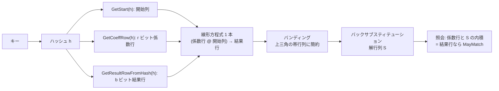
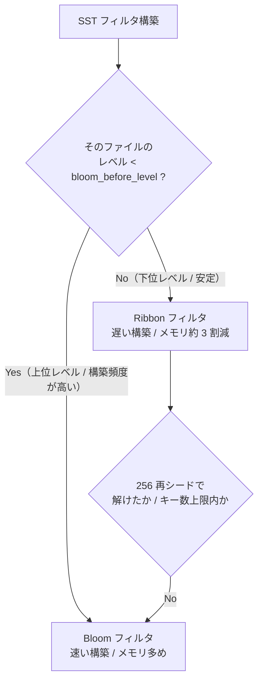

# 第19章 Ribbon フィルタ

> **本章で読むソース**
>
> - [`util/ribbon_alg.h`](https://github.com/facebook/rocksdb/blob/v11.1.1/util/ribbon_alg.h)
> - [`util/ribbon_impl.h`](https://github.com/facebook/rocksdb/blob/v11.1.1/util/ribbon_impl.h)
> - [`util/ribbon_config.h`](https://github.com/facebook/rocksdb/blob/v11.1.1/util/ribbon_config.h)
> - [`table/block_based/filter_policy.cc`](https://github.com/facebook/rocksdb/blob/v11.1.1/table/block_based/filter_policy.cc)
> - [`include/rocksdb/filter_policy.h`](https://github.com/facebook/rocksdb/blob/v11.1.1/include/rocksdb/filter_policy.h)

## この章の狙い

Ribbon フィルタは、Bloom フィルタと同じ「キーが集合に含まれないことの判定」を、同じ偽陽性率のままより少ないメモリで実現する代替フィルタである。
本章では、その省メモリがどういう仕組みで成り立つのか、つまり GF(2) 上の線形方程式系をリボン状の係数行列として解くという原理を、ソースの理論コメントに即して追う。
そのうえで、省メモリと引き換えに構築 CPU が増えるトレードオフと、Bloom と Ribbon を LSM レベルごとに使い分ける `bloom_before_level` の設計を読む。

## 前提

第18章「Bloom フィルタ」（[`../part03-sst/18-bloom-filter.md`](../part03-sst/18-bloom-filter.md)）を先に読み、Bloom フィルタの偽陽性率と bits/key の関係を把握しておくとよい。
フィルタが SST のどこに置かれ、`FilterBitsBuilder` と `FilterBitsReader` がどう呼ばれるかは第15章と第16章で扱った。

## Ribbon が Bloom の代わりになる理由

Ribbon は **PHSF**（Perfect Hash Static Function、完全ハッシュ静的関数）と呼ばれる構造を土台にしている。
PHSF は、ハッシュ可能なキーから固定ビット幅の値へのマップを表すが、構築後は要素を追加も削除もできない静的な構造であり、元の集合に無いキーに対しては任意の値（garbage）を返してよい。
この性質をフィルタに転用する仕組みを、ソースの冒頭コメントはこう説明する。

[`util/ribbon_alg.h` L56-L63](https://github.com/facebook/rocksdb/blob/v11.1.1/util/ribbon_alg.h#L56-L63)

```cpp
// With more hashing, a PHSF can over-approximate a set as a Bloom filter
// does, with no FN queries and predictable false positive (FP) query
// rate. Instead of the user providing a value to map each input key to,
// a hash function provides the value. Keys in the original set will
// return a positive membership query because the underlying PHSF returns
// the same value as hashing the key. When a key is not in the original set,
// the PHSF returns a "garbage" value, which is only equal to the key's
// hash with (false positive) probability 1 in 2^b.
```

ユーザーが各キーに対応づける値を与える代わりに、別のハッシュ関数がその値を生成する。
照会時には、PHSF が返した値とキーのハッシュ値を比べる。
元の集合のキーなら両者は必ず一致し、集合に無いキーなら PHSF の返す値はランダムなので、b ビットの照合が偶然一致する確率、すなわち偽陽性率は 1/2^b になる。
偽陰性は起きない。
ここまでは Bloom フィルタと同じ振る舞いである。

違いは空間効率に現れる。
同じ冒頭コメントが、同一の偽陽性率に必要な bits/key を構造ごとに対比している。

[`util/ribbon_alg.h` L65-L70](https://github.com/facebook/rocksdb/blob/v11.1.1/util/ribbon_alg.h#L65-L70)

```cpp
// For a matching false positive rate, standard Bloom filters require
// 1.44*b bits per entry. Cache-local Bloom filters (like bloom_impl.h)
// require a bit more, around 1.5*b bits per entry. Thus, a Bloom
// alternative could save up to or nearly 1/3rd of memory and storage
// that RocksDB uses for SST (static) Bloom filters. (Memtable Bloom filter
// is dynamic.)
```

コメントによれば、偽陽性率 1/2^b を得るのに標準的な Bloom は b あたり 1.44 倍、RocksDB が使うキャッシュ局所版 Bloom は約 1.5 倍の bits/key を要する。
PHSF は理論上 b ビット（解の列数ぶん）まで詰められるので、Bloom が払う 1.44 倍以上の係数を削れる。
公開 API のコメントは具体例として、`bloom_equivalent_bits_per_key` に 10 を渡すと Bloom と同じ 0.95% の偽陽性率を約 7 bits/key で得られると述べている。

[`include/rocksdb/filter_policy.h` L169-L173](https://github.com/facebook/rocksdb/blob/v11.1.1/include/rocksdb/filter_policy.h#L169-L173)

```cpp
// A new Bloom alternative that saves about 30% space compared to
// Bloom filters, with similar query times but roughly 3-4x CPU time
// and 3x temporary space usage during construction.  For example, if
// you pass in 10 for bloom_equivalent_bits_per_key, you'll get the same
// 0.95% FP rate as Bloom filter but only using about 7 bits per key.
```

10 に対して約 7 は、コメントの言う「およそ 3 割の削減」にあたる。
ただし同じコメントが続けて述べるとおり、照会時間は Bloom と同程度でも、構築には Bloom の 3〜4 倍の CPU 時間と約 3 倍の一時メモリを要する。
本章の後半で、この代償をどこで払い、どう使い分けるかを見る。

なぜ Bloom の 1.44 倍が削れるのかは、構造の作り方の違いに帰着する。
ソースは、ハッシュテーブルや Cuckoo フィルタを「OR 構成」、Bloom を「AND 構成」、PHSF を「XOR 構成」として対比している。

[`util/ribbon_alg.h` L100-L106](https://github.com/facebook/rocksdb/blob/v11.1.1/util/ribbon_alg.h#L100-L106)

```cpp
// PHSFs typically use a bitwise XOR construction: the data you want is
// not in a single slot, but in a linear combination of several slots.
// For static data, this gives the best of "AND" and "OR" constructions:
// avoids the +1.44 or more fixed overhead by not approximating a MPH and
// can do much better than Bloom's 1.44 factor on b with collision
// resolution, which here is done ahead of time and invisible at query
// time.
```

欲しい値は単一のスロットにあるのではなく、複数スロットの線形結合（XOR）として表される。
衝突解決を構築時に済ませてしまうので、照会時には衝突解決のための追加ビットが要らない。
これが、最小完全ハッシュが必然的に払う 1.44 ビット/キーの固定オーバーヘッドも、Bloom の 1.44 倍の係数も避けられる理由だとコメントは説明する。

## 原理：キーを GF(2) の線形方程式系にする

XOR 構成の中身は、GF(2)（要素が 0 と 1 だけで、加算も減算も XOR である体）上の線形方程式系を解くことである。
ソースは構築を三つの行列で定式化する。

[`util/ribbon_alg.h` L116-L130](https://github.com/facebook/rocksdb/blob/v11.1.1/util/ribbon_alg.h#L116-L130)

```cpp
//    C    *    S    =    R
// (n x m)   (m x b)   (n x b)
// where C = coefficients, S = solution, R = results
// and solving for S given C and R.
//
// Note that C and R each have n rows, one for each input entry for the
// PHSF. A row in C is given by a hash function on the PHSF input key,
// and the corresponding row in R is the b-bit value to associate with
// that input key. (In a filter, rows of R are given by another hash
// function on the input key.)
//
// On solving, the matrix S (solution) is the final PHSF data, as it
// maps any row from the original C to its corresponding desired result
// in R. We just have to hash our query inputs and compute a linear
// combination of rows in S.
```

入力キー n 個それぞれに、係数行列 C の 1 行（キーのハッシュから決まる m ビットのベクトル）と、結果行列 R の 1 行（フィルタではキーの別ハッシュから決まる b ビットの値）が対応する。
これを満たす解行列 S（m 行 b 列）を求めるのが構築である。
S がフィルタの本体になる。
照会では、キーのハッシュから C の行を再現し、それと S の内積を取れば、そのキーの結果行が復元できる。

ここで素朴に m = n（スロット数とキー数を等しく）として C の各行をランダムに置くと、解はほぼ存在するし空間も最小に近い。
しかし、構築のガウス消去が O(n^3) 時間、空間が O(n^2)、照会が O(n) になり、まったく実用にならない。
照会のたびに S 全体を走査しないことが鍵だとコメントは述べる。

[`util/ribbon_alg.h` L132-L139](https://github.com/facebook/rocksdb/blob/v11.1.1/util/ribbon_alg.h#L132-L139)

```cpp
// In theory, we could chose m = n and let a hash function associate
// each input key with random rows in C. A solution exists with high
// probability, and uses essentially minimum space, b bits per entry
// (because we set m = n) but this has terrible scaling, something
// like O(n^2) space and O(n^3) time during construction (Gaussian
// elimination) and O(n) query time. But computational efficiency is
// key, and the core of this is avoiding scanning all of S to answer
// each query.
```

### 係数行列を帯（リボン）にする

Ribbon の工夫は、C の各行を全幅ランダムにせず、固定幅 r（コード上の `kCoeffBits`）の連続した区間だけに 1 を許すことである。
キーのハッシュから、係数列の開始位置（`GetStart()`）と、そこから r ビットの係数列（`GetCoeffRow()`）を決める。
行を開始位置で並べ替えると、C は帯状の行列になる。

[`util/ribbon_alg.h` L159-L181](https://github.com/facebook/rocksdb/blob/v11.1.1/util/ribbon_alg.h#L159-L181)

```cpp
// Ribbon constructs coefficient rows essentially the same as in the
// Walzer/Dietzfelbinger paper cited above: for some chosen fixed width
// r (kCoeffBits in code), each key is hashed to a starting column in
// [0, m - r] (GetStart() in code) and an r-bit sequence of boolean
// coefficients (GetCoeffRow() in code). If you sort the rows by start,
// the C matrix would look something like this:
//
// [####00000000000000000000]
// [####00000000000000000000]
// [000####00000000000000000]
// [0000####0000000000000000]
// [0000000####0000000000000]
// ...
// [00000000000000000000####]
//
// where each # could be a 0 or 1, chosen uniformly by a hash function.
// (Except we typically set the start column value to 1.) This scheme
// uses hashing to approximate a band matrix, and it has a solution iff
// it reduces to an upper-triangular boolean r-band matrix, like this:
```

`#` は 0 か 1 のどちらか（先頭列は通常 1 に固定する）。
このハッシュによる帯行列は、上三角の帯行列に簡約できるとき、かつそのときに限り解を持つ。
帯にしたことで効くのが、簡約のしやすさである。

[`util/ribbon_alg.h` L201-L207](https://github.com/facebook/rocksdb/blob/v11.1.1/util/ribbon_alg.h#L201-L207)

```cpp
// The awesome thing about the Ribbon construction (from the DW paper) is
// how row reductions keep each row representable as a start column and
// r coefficients, because row reductions are only needed when two rows
// have the same number of leading zero columns. Thus, the combination
// of those rows, the bitwise XOR of the r-bit coefficient rows, cancels
// out the leading 1s, so starts (at least) one column later and only
// needs (at most) r - 1 coefficients.
```

行簡約が必要になるのは、二つの行の先頭ゼロ列数が同じときだけである。
そのとき r ビットの係数行どうしを XOR すれば先頭の 1 が打ち消され、結果の行は開始列が少なくとも 1 つ後ろにずれ、係数は高々 r-1 ビットで足りる。
つまり簡約しても行は「開始列 + r 係数」の形を保ち続ける。



### バンディング：その場で進む消去

帯行列を上三角に簡約する工程を、ソースは **バンディング**（banding）と呼ぶ。
元論文の SGauss アルゴリズムは入力を開始列で整列する必要があるが、Ribbon の構成はもっと単純で速い、ハッシュテーブルへの挿入に似たアルゴリズムを許す。

[`util/ribbon_alg.h` L255-L264](https://github.com/facebook/rocksdb/blob/v11.1.1/util/ribbon_alg.h#L255-L264)

```cpp
// The enhanced algorithm is based on these observations:
// - When processing a coefficient row with first 1 in column j,
//   - If it's the first at column j to be processed, it can be part of
//     the banding at row j. (And that decision never overwritten, with
//     no loss of generality!)
//   - Else, it can be combined with existing row j and re-processed,
//     which will look for a later "empty" row or reach "no solution".
//
// We call our banding algorithm "incremental" and "on-the-fly" because
// (like hash table insertion) we are "finished" after each input
// processed, with respect to all inputs processed so far.
```

先頭の 1 が列 j にある係数行を処理するとき、列 j がまだ空ならその行を行 j に置く（この決定は二度と上書きされない）。
すでに行 j が埋まっていれば、その行と XOR して合成し、合成後の行を先頭がさらに後ろの位置として再処理する。
このため整列が要らず、入力を 1 件ずつ「挿入」していけて、各入力を処理した時点で常に簡約が完了している。
これがアルゴリズム名 Ribbon の「Incremental」「ON-the-fly」が指す性質である。

この観察は `BandingAdd` にそのまま現れる。

[`util/ribbon_alg.h` L565-L588](https://github.com/facebook/rocksdb/blob/v11.1.1/util/ribbon_alg.h#L565-L588)

```cpp
  for (;;) {
    assert((cr & 1) == 1);
    CoeffRow cr_at_i;
    ResultRow rr_at_i;
    bs->LoadRow(i, &cr_at_i, &rr_at_i, /* for_back_subst */ false);
    if (cr_at_i == 0) {
      bs->StoreRow(i, cr, rr);
      bts->BacktrackPut(*backtrack_pos, i);
      ++*backtrack_pos;
      return true;
    }
    assert((cr_at_i & 1) == 1);
    // Gaussian row reduction
    cr ^= cr_at_i;
    rr ^= rr_at_i;
    if (cr == 0) {
      // Inconsistency or (less likely) redundancy
      break;
    }
    // Find relative offset of next non-zero coefficient.
    int tz = CountTrailingZeroBits(cr);
    i += static_cast<Index>(tz);
    cr >>= tz;
  }
```

行 i が空（`cr_at_i == 0`）ならそこへ格納して成功で返る。
埋まっていれば係数行 `cr` と結果行 `rr` を既存行と XOR で簡約し、残った係数の末尾ゼロ数 `tz` だけ位置 i を進めて次の非ゼロ列へ飛ぶ。
位置を進めるたびに `cr >>= tz` で先頭の 1 を最下位ビットへ揃え直すので、ループ内の不変条件は常に「`cr` の最下位ビットが 1」である（行頭の `assert((cr & 1) == 1)`）。
簡約の途中で `cr` が 0 になったら、その行は既存の行たちの線形結合で表せてしまっており、結果行が 0 でない限り矛盾なので解は存在しない。

帯であることが、この処理を係数行 1 個（`CoeffRow` 型の整数 1 個）の XOR とビットシフトだけに収める。
全幅の行を扱うガウス消去なら 1 回の行簡約に O(m) の演算が要るところを、Ribbon は固定幅 r 個ぶんの整数演算に縮める。
これが構築を速くする中核の仕掛けである。

### バックサブスティテューション：解の復元

上三角の帯行列ができたら、下の行から順に解を確定していく **バックサブスティテューション**（後退代入）で S を得る。

[`util/ribbon_alg.h` L288-L296](https://github.com/facebook/rocksdb/blob/v11.1.1/util/ribbon_alg.h#L288-L296)

```cpp
// Back-substitution from an upper-triangular boolean band matrix is
// especially fast and easy. All the memory accesses are sequential or at
// least local, no random. If the number of result bits (b) is a
// compile-time constant, the back-substitution state can even be tracked
// in CPU registers. Regardless of the solution representation, we prefer
// column-major representation for tracking back-substitution state, as
// r (the band width) will typically be much larger than b (result bits
// or columns), so better to handle r-bit values b times (per solution
// row) than b-bit values r times.
```

帯行列なので参照は逐次か局所に収まり、ランダムアクセスが無い。
直前までに確定した解を列ごとの状態 `state` に保持し、各行で b 列ぶんの解ビットを内積の整合条件から一つずつ決める。

[`util/ribbon_alg.h` L790-L807](https://github.com/facebook/rocksdb/blob/v11.1.1/util/ribbon_alg.h#L790-L807)

```cpp
    ResultRow sr = 0;
    for (Index j = 0; j < kResultBits; ++j) {
      // Compute next solution bit at row i, column j (see derivation below)
      CoeffRow tmp = state[j] << 1;
      bool bit = (BitParity(tmp & cr) ^ ((rr >> j) & 1)) != 0;
      tmp |= bit ? CoeffRow{1} : CoeffRow{0};
      // ...
      //   BitParity(tmp & cr) == ((rr >> j) & 1)
      // Update state.
      state[j] = tmp;
      // add to solution row
      sr |= (bit ? ResultRow{1} : ResultRow{0}) << j;
    }
```

列ごとに、係数行 `cr` と解列 `tmp` の内積（`BitParity(tmp & cr)`）が結果ビット `(rr >> j) & 1` に一致するよう、新しい解ビットを選ぶ。
帯幅 r は結果ビット数 b よりずっと大きいので、r ビット値を b 回まわすこの列優先の進め方が、b ビット値を r 回まわすより効率がよいとコメントは述べる。

### 照会：係数行と解の内積

照会は構築の逆で、キーのハッシュから開始列と係数行を再現し、解 S の該当区間との内積を取って結果行を復元する。
復元値がキーのハッシュ由来の期待結果行と一致すれば「含むかもしれない（MayMatch）」、違えば「含まない」と確定できる。
教科書的な行優先版 `SimpleQueryHelper` では、係数行のビットを下からマスクとして使い、r 個のスロットを XOR する。

[`util/ribbon_alg.h` L824-L830](https://github.com/facebook/rocksdb/blob/v11.1.1/util/ribbon_alg.h#L824-L830)

```cpp
  ResultRow result = 0;
  for (unsigned i = 0; i < kCoeffBits; ++i) {
    // Bit masking whole value is generally faster here than 'if'
    result ^= sss.Load(start_slot + i) &
              (ResultRow{0} - (static_cast<ResultRow>(cr >> i) & ResultRow{1}));
  }
  return result;
```

`cr` の i ビット目が 1 なら `0 - 1` で全ビット 1 のマスク、0 なら全 0 のマスクになり、対応スロットを条件分岐なしに足し込む。
分岐予測の外れを避けるための定石である。

## 解の格納レイアウト：インターリーブ

照会の速さは、解 S をメモリにどう並べるかに大きく左右される。
Ribbon は照会 1 回で連続する r 行ぶんに触れ、しかも触れる行数（平均 r/2、分岐を避けるなら r）は結果列数 b よりずっと多い。
行優先で並べると 1 照会で b ビットの値を最大 r 個処理することになり、b が 10 未満になりがちなフィルタ用途では CPU が無駄になる。
列優先なら各列の復元は速いが、b 個の列がそれぞれ別ページに散ってキャッシュ局所性が悪い。
そこで RocksDB は両者を折衷した **インターリーブ**（interleaved）格納を採る。

[`util/ribbon_alg.h` L326-L333](https://github.com/facebook/rocksdb/blob/v11.1.1/util/ribbon_alg.h#L326-L333)

```cpp
// The best compromise seems to be interleaving column-major on the small
// scale with row-major on the large scale. For example, let a solution
// "block" be r rows column-major encoded as b r-bit values in sequence.
// Each query accesses (up to) 2 adjacent blocks, which will typically
// span 1-3 cache lines in adjacent memory. We get very close to the same
// locality as row-major, but with much faster reconstruction of each
// result column, at least for filter applications where b is relatively
// small and negative queries can return early.
```

小さなスケール（ブロック内）では列優先、大きなスケール（ブロック間）では行優先にする。
ブロックは r 行ぶんを「列ごとに r ビットの値が b 個並んだもの」として持つ。
照会は隣接する高々 2 ブロックに触れ、それは普通 1〜3 キャッシュラインに収まる。
行優先に近い局所性を保ちつつ、列の復元は速くできる。

この格納方式は、b と b-1 の解列数を 1 つの線形系の中で混在させられる。
コメントによれば、構造の前半を b-1 列、後半を b 列にすることで、キー数に対して任意のサイズ（r の倍数）を使い切り、偽陽性率を細かく調整できる。

[`util/ribbon_alg.h` L345-L350](https://github.com/facebook/rocksdb/blob/v11.1.1/util/ribbon_alg.h#L345-L350)

```cpp
// At first glance, PHSFs only offer a whole number of bits per "slot"
// (m rather than number of keys n), but coefficient locality in the
// Ribbon construction makes fractional bits/key quite possible and
// attractive for filter applications. This works by a prefix of the
// structure using b-1 solution columns and the rest using b solution
// columns. See InterleavedSolutionStorage below for more detail.
```

Bloom は任意の bits/key を取れる柔軟さを持つが、Ribbon もこの分数ビット化によって近い柔軟さを得る。
RocksDB の Ribbon の照会側は `Standard128RibbonBitsReader` がこのインターリーブ解（`SerializableInterleavedSolution`）を読み、`MayMatch` で 1 件、`MayMatch(num_keys, ...)` で MultiGet のバッチを処理する。

[`table/block_based/filter_policy.cc` L1040-L1043](https://github.com/facebook/rocksdb/blob/v11.1.1/table/block_based/filter_policy.cc#L1040-L1043)

```cpp
  bool MayMatch(const Slice& key) override {
    uint64_t h = GetSliceHash64(key);
    return soln_.FilterQuery(h, hasher_);
  }
```

## Standard128 実装

RocksDB が実際に使う Ribbon は、係数行を 128 ビットにした **Standard128** である。
型と設定は `Standard128RibbonRehasherTypesAndSettings` にまとまっている。

[`table/block_based/filter_policy.cc` L637-L653](https://github.com/facebook/rocksdb/blob/v11.1.1/table/block_based/filter_policy.cc#L637-L653)

```cpp
struct Standard128RibbonRehasherTypesAndSettings {
  // These are schema-critical. Any change almost certainly changes
  // underlying data.
  static constexpr bool kIsFilter = true;
  static constexpr bool kHomogeneous = false;
  static constexpr bool kFirstCoeffAlwaysOne = true;
  static constexpr bool kUseSmash = false;
  using CoeffRow = ROCKSDB_NAMESPACE::Unsigned128;
  using Hash = uint64_t;
  using Seed = uint32_t;
  // Changing these doesn't necessarily change underlying data,
  // but might affect supported scalability of those dimensions.
  using Index = uint32_t;
  using ResultRow = uint32_t;
  // Save a conditional in Ribbon queries
  static constexpr bool kAllowZeroStarts = false;
};
```

`CoeffRow` が 128 ビット（`Unsigned128`）なので帯幅 r = 128 である。
冒頭コメントは r=128 を「現在のハードウェアでおおむね最良」と位置づけ、その理由を述べている。

[`util/ribbon_alg.h` L227-L233](https://github.com/facebook/rocksdb/blob/v11.1.1/util/ribbon_alg.h#L227-L233)

```cpp
// To make best use of current hardware, r=128 seems to be closest to
// a "generally good" choice for Ribbon, at least in RocksDB where SST
// Bloom filters typically hold around 10-100k keys, and almost always
// less than 10m keys. r=128 ribbon has a high chance of encoding success
// (with first hash seed) when storage overhead is around 5% (m/n ~ 1.05)
// for roughly 10k - 10m keys in a single linear system. r=64 only scales
// up to about 10k keys with the same storage overhead.
```

帯幅を固定して m/n 比を一定にすると、キー数 n が増えるほど解の存在確率は下がる。
r=128 なら、貯蔵オーバーヘッドが約 5%（m/n ≒ 1.05）でも 1 万〜1000 万キーまで最初のハッシュシードで高確率に解ける。
r=64 だと同じオーバーヘッドでは 1 万キーまでしか伸びない。
SST のフィルタが扱うキー数（1 万〜10 万、多くても 1000 万未満）に r=128 がよく合う。

構築の本体は `Standard128RibbonBitsBuilder::Finish` にある。
スロット数を決め、バンディングを解き、後退代入で解を書き出し、末尾にメタデータ（シードとブロック数）を付ける。
解けるシードを探すループは `ResetAndFindSeedToSolve` で、シードを変えて最大 256 回まで試す。

[`table/block_based/filter_policy.cc` L751-L763](https://github.com/facebook/rocksdb/blob/v11.1.1/table/block_based/filter_policy.cc#L751-L763)

```cpp
    bool success = banding.ResetAndFindSeedToSolve(
        num_slots, hash_entries_info_.entries.begin(),
        hash_entries_info_.entries.end(),
        /*starting seed*/ entropy & 255, /*seed mask*/ 255);
    if (!success) {
      ROCKS_LOG_WARN(
          info_log_, "Too many re-seeds (256) for Ribbon filter, %llu / %llu",
          static_cast<unsigned long long>(hash_entries_info_.entries.size()),
          static_cast<unsigned long long>(num_slots));
      SwapEntriesWith(&bloom_fallback_);
      assert(hash_entries_info_.entries.empty());
      return bloom_fallback_.Finish(buf, status);
    }
```

シードを変えるたびに係数行と結果行が振り直され、帯行列が組み直される。
256 回試しても解けなければ、構築は Bloom フィルタにフォールバックする。
スロット数とキー数の対応は、`ribbon_config.h` が提供する `BandingConfigHelper1` のルックアップ表から引く。
RocksDB のフィルタは構築失敗率の目標を `kOneIn20`（シードあたり 1/20 で失敗を許す）に設定している。

[`table/block_based/filter_policy.cc` L998-L1002](https://github.com/facebook/rocksdb/blob/v11.1.1/table/block_based/filter_policy.cc#L998-L1002)

```cpp
  using ConfigHelper = ribbon::BandingConfigHelper1TS<ribbon::kOneIn20, TS>;

  static uint32_t NumEntriesToNumSlots(uint32_t num_entries) {
    uint32_t num_slots1 = ConfigHelper::GetNumSlots(num_entries);
    return SolnType::RoundUpNumSlots(num_slots1);
  }
```

失敗率を高めに許すほど m/n を小さく取れて省メモリだが、再シードのやり直しで構築時間が延びる。
`ribbon_config.h` のコメントが、この値が貯蔵オーバーヘッドと構築時間のトレードオフを決めることを述べている。

[`util/ribbon_config.h` L39-L41](https://github.com/facebook/rocksdb/blob/v11.1.1/util/ribbon_config.h#L39-L41)

```cpp
// Represents a chosen chance of successful Ribbon construction for a single
// seed. Allowing higher chance of failed construction can reduce space
// overhead but takes extra time in construction.
```

ルックアップ表を使うのは、貯蔵オーバーヘッドとキー数の関係に閉じた式が無く、`ribbon_test` の `FindOccupancy` を実測したデータから引いているためである。

## Bloom と Ribbon の使い分け

Ribbon は省メモリだが、構築 CPU が Bloom の 3〜4 倍かかる。
この代償をどこで払うかが運用上の判断になる。
LSM ツリーでは、上位レベル（L0 やフラッシュ直後）は書き換えが頻繁でフィルタの再構築回数が多く、下位レベルは安定して長く生きる。
そこで、構築頻度の高い上位は速い Bloom、安定した下位は省メモリの Ribbon にするのが合理的である。
この使い分けを 1 つのポリシーで表すのが `NewRibbonFilterPolicy` の `bloom_before_level` である。

[`include/rocksdb/filter_policy.h` L175-L188](https://github.com/facebook/rocksdb/blob/v11.1.1/include/rocksdb/filter_policy.h#L175-L188)

```cpp
// The space savings of Ribbon filters makes sense for lower (higher
// numbered; larger; longer-lived) levels of LSM, whereas the speed of
// Bloom filters make sense for highest levels of LSM. Setting
// bloom_before_level allows for this design with Level and Universal
// compaction styles. For example, bloom_before_level=1 means that Bloom
// filters will be used in level 0, including flushes, and Ribbon
// filters elsewhere, including FIFO compaction and external SST files.
// For this option, memtable flushes are considered level -1 (so that
// flushes can be distinguished from intra-L0 compaction).
// bloom_before_level=0 (default) -> Generate Bloom filters only for
// flushes under Level and Universal compaction styles.
// bloom_before_level=-1 -> Always generate Ribbon filters (except in
// some extreme or exceptional cases).
// bloom_before_level=INT_MAX -> Always generate Bloom filters.
```

`bloom_before_level` 未満のレベルなら Bloom、それ以上なら Ribbon を作る。
フラッシュはレベル -1 として扱い、L0 内コンパクションと区別する。
既定値 0 は、フラッシュだけを Bloom にし、コンパクションで作られる SST は Ribbon にする設定にあたる。
判定は `RibbonFilterPolicy::GetBuilderWithContext` が行い、ビルダーをそのつど選び分ける。

[`table/block_based/filter_policy.cc` L1877-L1881](https://github.com/facebook/rocksdb/blob/v11.1.1/table/block_based/filter_policy.cc#L1877-L1881)

```cpp
  if (levelish < bloom_before_level) {
    return GetFastLocalBloomBuilderWithContext(context);
  } else {
    return GetStandard128RibbonBuilderWithContext(context);
  }
```

`bloom_before_level` は実行中に変更できる可変オプションである。
ワークロードに応じて、たとえば書き込みが落ち着いた後に下位レベルへ Ribbon を広げる、といった調整を再起動なしに行える。



異なる選択をしても照会側は混在を許す。
`Standard128` を含む組み込みフィルタは互いの形式を読めるので、同じ DB の中に Bloom の SST と Ribbon の SST が共存して問題ない。
末尾のメタデータにある種別マーカー（Standard128 Ribbon は -2）を見て、リーダーが適切な実装を選ぶ。

[`table/block_based/filter_policy.cc` L807-L811](https://github.com/facebook/rocksdb/blob/v11.1.1/table/block_based/filter_policy.cc#L807-L811)

```cpp
    // See BloomFilterPolicy::GetBloomBitsReader re: metadata
    // -2 = Marker for Standard128 Ribbon
    mutable_buf[len_with_metadata - 5] = static_cast<char>(-2);
    // Hash seed
    mutable_buf[len_with_metadata - 4] = static_cast<char>(seed);
```

構築の一時メモリも代償の一部である。
公開コメントによれば、1 億キーを 1 つのフィルタに入れる場合、一時メモリは Ribbon が約 3GB、Bloom が約 1GB を使う。
ただし、開いている SST 60 個ぶんほどのフィルタ空間の節約が、この一時メモリの増加を埋め合わせる。
キー数が `kMaxRibbonEntries`（約 9.5 億）を超える、あるいはスロット数が小さすぎて Bloom のほうが小さくなる場合は、Ribbon は構築時に自動で Bloom にフォールバックする。

## まとめ

- Ribbon は Bloom と同じ偽陽性率を、同じ b に対して 1.44〜1.5 倍ではなく約 b ビット/キーで実現する。`bloom_equivalent_bits_per_key=10` なら約 7 ビット/キーで、おおむね 3 割の省メモリになる。
- 原理は GF(2) 上の線形方程式系 C·S = R を解くこと。係数行列 C をハッシュで帯（リボン）状にすることで、行簡約が固定幅 r の整数の XOR とシフトに収まり、ガウス消去が実用的な速度になる。
- バンディングは整列不要の incremental / on-the-fly な消去で、入力を 1 件ずつ挿入する。後退代入で解 S を復元し、照会は係数行と S の内積を取る。
- 解はインターリーブ格納（小スケール列優先、大スケール行優先）で並べ、照会の局所性と CPU 効率を両立する。分数ビット化で任意サイズを使い切れる。
- RocksDB の実装は帯幅 r=128 の Standard128。シードを最大 256 回振って解き、解けなければ Bloom にフォールバックする。
- 代償は構築 CPU が Bloom の 3〜4 倍、一時メモリが約 3 倍。これを `bloom_before_level` で吸収し、構築頻度の高い上位レベルは Bloom、安定した下位レベルは Ribbon と使い分ける。可変オプションで運用中に調整できる。

## 関連する章

- [第18章 Bloom フィルタ](../part03-sst/18-bloom-filter.md)：本章が代替する Bloom フィルタの原理と偽陽性率。
- [第16章 BlockBasedTable Reader](../part03-sst/16-block-based-table-reader.md)：`FilterBitsReader` が読み出し経路でどう呼ばれるか。
- [第23章 Get](../part04-read-path/23-get.md)：フィルタ照会が `Get` のどこに位置するか。
