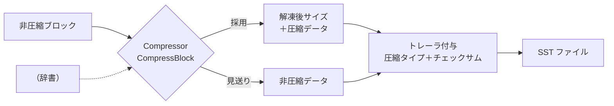
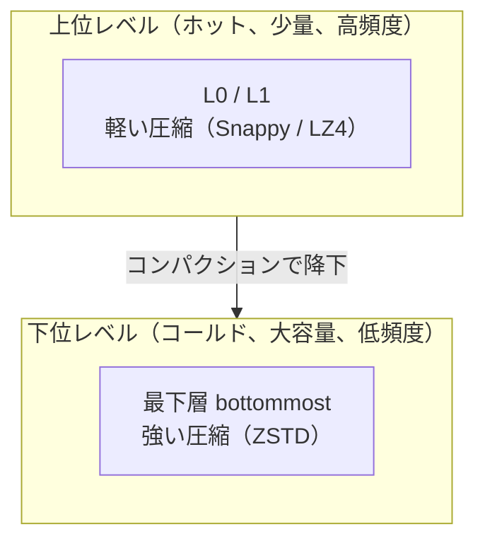

# 第20章 圧縮と辞書圧縮

> **本章で読むソース**
>
> - [`include/rocksdb/compression_type.h`](https://github.com/facebook/rocksdb/blob/v11.1.1/include/rocksdb/compression_type.h)
> - [`include/rocksdb/advanced_compression.h`](https://github.com/facebook/rocksdb/blob/v11.1.1/include/rocksdb/advanced_compression.h)
> - [`util/compression.h`](https://github.com/facebook/rocksdb/blob/v11.1.1/util/compression.h)
> - [`util/compression.cc`](https://github.com/facebook/rocksdb/blob/v11.1.1/util/compression.cc)
> - [`include/rocksdb/advanced_options.h`](https://github.com/facebook/rocksdb/blob/v11.1.1/include/rocksdb/advanced_options.h)
> - [`include/rocksdb/options.h`](https://github.com/facebook/rocksdb/blob/v11.1.1/include/rocksdb/options.h)

## この章の狙い

SST のデータブロックは、ファイルに書かれる直前にブロック単位で圧縮される。
本章では、RocksDB がどのアルゴリズムをどう振り分けるか、レベルごとに圧縮の強さを変える戦略はどう実装されているか、そして小さなブロックでも圧縮率を稼ぐための辞書圧縮がどう働くかを、コードに即して読む。

## 前提

- [第14章 テーブルフォーマット](14-table-format.md)：ブロックトレーラの 1 バイトの圧縮タイプと、ブロックごとに圧縮される構造。
- [第15章 ブロックベーステーブルビルダ](15-block-based-table-builder.md)：ブロックを圧縮してファイルへ書き出す流れ。

## 圧縮がどこで効くか

RocksDB のデータは、キーと値の組を並べたブロックの集まりとして SST に格納される。
各ブロックは、ファイルへ書かれる前に圧縮される場合がある。
どのアルゴリズムで圧縮したか（あるいは無圧縮か）は、ブロックの末尾に付く 1 バイトのトレーラに記録される。
この 1 バイトの意味は `CompressionType` という列挙で定義されている。

[`include/rocksdb/compression_type.h` L13-L29](https://github.com/facebook/rocksdb/blob/v11.1.1/include/rocksdb/compression_type.h#L13-L29)

```cpp
// DB contents are stored in a set of blocks, each of which holds a
// sequence of key,value pairs.  Each block may be compressed before
// being stored in a file.  The following enum describes which
// compression method (if any) is used to compress a block.

enum CompressionType : unsigned char {
  // NOTE: do not change the values of existing entries, as these are
  // part of the persistent format on disk.
  kNoCompression = 0x00,
  kSnappyCompression = 0x01,
  kZlibCompression = 0x02,
  kBZip2Compression = 0x03,
  kLZ4Compression = 0x04,
  kLZ4HCCompression = 0x05,
  kXpressCompression = 0x06,
  kZSTD = 0x07,
  kLastBuiltinCompression = kZSTD,
```

各値はディスク上の永続フォーマットの一部なので、既存の値を変えてはならないとコメントが明記している。
読み手が SST を開いたとき、トレーラの 1 バイトをこの列挙として解釈すれば、どのアルゴリズムで解凍すべきかが一意に決まる。
列挙が `unsigned char` を基底型に持ち、`kZSTD` までが組み込みの最後（`kLastBuiltinCompression`）である点も、トレーラの 1 バイトに収まることを保証している。

圧縮はディスク上のサイズを縮め、読み出し時の I/O を減らす。
そのかわり、書き出し時に圧縮の CPU を、読み出し時に解凍の CPU を払う。
この交換をどの程度に設定するかが、本章で見る各種オプションの主題である。

## アルゴリズムの振り分け

v11.1.1 では、圧縮処理は `Compressor` と `Decompressor`、そしてそれらを束ねる `CompressionManager` という抽象に整理されている。
`compression_manager` を設定しない既定の構成では、組み込みの `BuiltinCompressionManagerV2` が使われる（[`include/rocksdb/advanced_compression.h` L678-L683](https://github.com/facebook/rocksdb/blob/v11.1.1/include/rocksdb/advanced_compression.h#L678-L683)）。
このマネージャが、`CompressionType` を受け取って対応する `Compressor` を生成する。

[`util/compression.cc` L1729-L1759](https://github.com/facebook/rocksdb/blob/v11.1.1/util/compression.cc#L1729-L1759)

```cpp
  std::unique_ptr<Compressor> GetCompressor(const CompressionOptions& opts,
                                            CompressionType type) override {
    if (opts.max_compressed_bytes_per_kb <= 0) {
      // No acceptable compression ratio => no compression
      return nullptr;
    }
    if (!SupportsCompressionType(type)) {
      // Unrecognized or support not compiled in. Fall back on default
      type = ColumnFamilyOptions{}.compression;
    }
    switch (type) {
      case kNoCompression:
      default:
        assert(type == kNoCompression);  // Others should be excluded above
        return nullptr;
      case kSnappyCompression:
        return std::make_unique<BuiltinSnappyCompressorV2>(opts);
      case kZlibCompression:
        return std::make_unique<BuiltinZlibCompressorV2>(opts);
      case kBZip2Compression:
        return std::make_unique<BuiltinBZip2CompressorV2>(opts);
      case kLZ4Compression:
        return std::make_unique<BuiltinLZ4CompressorV2NoDict>(opts);
      case kLZ4HCCompression:
        return std::make_unique<BuiltinLZ4HCCompressorV2>(opts);
      case kXpressCompression:
        return std::make_unique<BuiltinXpressCompressorV2>(opts);
      case kZSTD:
        return std::make_unique<BuiltinZSTDCompressorV2>(opts);
    }
  }
```

`switch` が `CompressionType` を各アルゴリズム専用の `Compressor` 実装へ振り分ける。
ここで二つの早期脱出がある。
`max_compressed_bytes_per_kb` が 0 以下なら、許容できる圧縮率がないとみなして `nullptr` を返し、ファイル全体を無圧縮にする。
指定された型がこのビルドでサポートされていなければ、既定値（`ColumnFamilyOptions` の既定の `compression`）へフォールバックする。
サポート判定は `CompressionTypeSupported` が担い、ライブラリがビルドに組み込まれているかを型ごとに確かめる（[`util/compression.h` L462-L482](https://github.com/facebook/rocksdb/blob/v11.1.1/util/compression.h#L462-L482)）。

各アルゴリズムには得手不得手がある。
Snappy と LZ4 は圧縮率を欲張らないかわりに高速で、書き込みや上位レベルの読み出しに向く。
ZSTD は圧縮率が高く、`level` で速度と圧縮率の釣り合いを段階的に調整できる。
Zlib と BZip2 はさらに重く、冷たい大容量データに使われることがある。

### ブロックを圧縮する一手

具体的に圧縮を行うのは、各 `Compressor` の `CompressBlock` である。
Snappy の実装を見ると、圧縮処理の戻り値の約束がはっきりする。

[`util/compression.cc` L492-L544](https://github.com/facebook/rocksdb/blob/v11.1.1/util/compression.cc#L492-L544)

```cpp
  Status CompressBlock(Slice uncompressed_data, char* compressed_output,
                       size_t* compressed_output_size,
                       CompressionType* out_compression_type,
                       ManagedWorkingArea*) override {
#ifdef SNAPPY
    // ... (中略：snappy::Sink で compressed_output へ直接書く) ...
    size_t outlen = snappy::Compress(&source, &sink);
    if (outlen > 0 && sink.pos_ <= sink.output_size_) {
      // Compression kept/successful
      assert(outlen == sink.pos_);
      *compressed_output_size = outlen;
      *out_compression_type = kSnappyCompression;
      return Status::OK();
    }
    // Compression rejected
    *compressed_output_size = 1;
#else
    (void)uncompressed_data;
    (void)compressed_output;
    // Compression bypassed (not supported)
    *compressed_output_size = 0;
#endif
    *out_compression_type = kNoCompression;
    return Status::OK();
  }
```

呼び出し側との取り決めはインタフェースのコメントが定めている（[`include/rocksdb/advanced_compression.h` L222-L233](https://github.com/facebook/rocksdb/blob/v11.1.1/include/rocksdb/advanced_compression.h#L222-L233)）。
`Status` が OK で `*out_compression_type` が `kNoCompression` になったときは、圧縮を見送ったという意味であり、呼び出し側は元の非圧縮データをそのまま使う。
このとき `*compressed_output_size` が 0 なら圧縮を素早く回避したこと、0 より大きければ圧縮は試みたが結果を採用しなかったこと（圧縮率が足りないなど）を表す。
圧縮率の下限は `max_compressed_bytes_per_kb` で表現される。
これは入力 1 KB あたりに許す圧縮後バイト数の上限で、既定値は `1024 * 7 / 8` であり、12.5% 以上縮まないブロックは圧縮を諦めて無圧縮で書く（[`include/rocksdb/compression_type.h` L289-L299](https://github.com/facebook/rocksdb/blob/v11.1.1/include/rocksdb/compression_type.h#L289-L299)）。
わずかしか縮まないブロックのために解凍の CPU を払うのは割に合わない、という判断をビルダの側で下せるようにする仕組みである。

### 解凍は型で分岐する

読み出し側は、トレーラの 1 バイトを `CompressionType` として受け取り、`Decompressor::DecompressBlock` で分岐する。

[`util/compression.cc` L1503-L1525](https://github.com/facebook/rocksdb/blob/v11.1.1/util/compression.cc#L1503-L1525)

```cpp
  Status DecompressBlock(const Args& args, char* uncompressed_output) override {
    switch (args.compression_type) {
      case kSnappyCompression:
        return Snappy_DecompressBlock(args, uncompressed_output);
      case kZlibCompression:
        return Zlib_DecompressBlock(args, /*dict=*/Slice{},
                                    uncompressed_output);
      case kBZip2Compression:
        return BZip2_DecompressBlock(args, uncompressed_output);
      case kLZ4Compression:
      case kLZ4HCCompression:
        return LZ4_DecompressBlock(args, /*dict=*/Slice{}, uncompressed_output);
      case kXpressCompression:
        return XPRESS_DecompressBlock(args, uncompressed_output);
      case kZSTD:
        return ZSTD_DecompressBlock(args, /*dict=*/Slice{}, this,
                                    uncompressed_output);
      default:
        return Status::NotSupported(
            "Compression type not supported or not built-in: " +
            CompressionTypeToString(args.compression_type));
    }
  }
```

解凍に先立って、`ExtractUncompressedSize` が解凍後のサイズを取り出す（[`util/compression.cc` L1467-L1501](https://github.com/facebook/rocksdb/blob/v11.1.1/util/compression.cc#L1467-L1501)）。
読み出し側は解凍前にサイズを知りたい。
解凍先のバッファを一度で正しく確保できれば、確保のやり直しを避けられるからである。
そのため RocksDB は、圧縮後のデータの先頭に解凍後サイズを可変長整数で前置する形式（`compress_format_version=2`）を標準とする。
Snappy と XPRESS は例外で、ライブラリ自身が長さを持つため、それぞれのライブラリ関数から長さを取り出す（コードの「1st exception」「2nd exception」のコメント）。
この前置を書いているのが `StartCompressBlockV2` で、`EncodeVarint32` で解凍後サイズを書いてから、その後ろをアルゴリズム本体の出力先として返す（[`util/compression.cc` L549-L567](https://github.com/facebook/rocksdb/blob/v11.1.1/util/compression.cc#L549-L567)）。



トレーラの付与とチェックサムの計算は本章の範囲の外にある。
ブロックを書き出す流れは[第15章](15-block-based-table-builder.md)、トレーラのチェックサムは[第21章](21-checksum.md)で扱う。

## レベルごとに圧縮を変える

LSM ツリーでは、上位レベルほど新しく頻繁に読み書きされ、最下層ほど古く大容量で読み出し頻度が低い。
このホットとコールドの非対称に合わせて、レベルごとに圧縮の強さを変えられる。
基本となるのは `compression` で、フラッシュ出力と、レベル別指定がない場合のコンパクション出力に使われる（[`include/rocksdb/options.h` L218](https://github.com/facebook/rocksdb/blob/v11.1.1/include/rocksdb/options.h#L218)）。

レベルごとに変えたいときは `compression_per_level` を使う。

[`include/rocksdb/advanced_options.h` L505-L534](https://github.com/facebook/rocksdb/blob/v11.1.1/include/rocksdb/advanced_options.h#L505-L534)

```cpp
  // Different levels can have different compression policies. There
  // are cases where most lower levels would like to use quick compression
  // algorithms while the higher levels (which have more data) use
  // compression algorithms that have better compression but could
  // be slower. This array, if non-empty, should have an entry for
  // each level of the database; these override the value specified in
  // the previous field 'compression'.
  // ... (中略) ...
  std::vector<CompressionType> compression_per_level;
```

コメントが述べるとおり、配列が空でなければ各レベルの圧縮が `compression` より優先される。
これにより、上位レベルは Snappy や LZ4 のような軽い圧縮にして読み書きの遅延を抑え、データ量の多い下位レベルは重い圧縮で空間を節約する、という使い分けができる。

最下層だけを別扱いしたいときは `bottommost_compression` がある。

[`include/rocksdb/options.h` L220-L233](https://github.com/facebook/rocksdb/blob/v11.1.1/include/rocksdb/options.h#L220-L233)

```cpp
  // Compression algorithm that will be used for the bottommost level that
  // contain files. The behavior for num_levels = 1 is not well defined.
  // ... (中略) ...
  // Default: kDisableCompressionOption (Disabled)
  CompressionType bottommost_compression = kDisableCompressionOption;

  // different options for compression algorithms used by bottommost_compression
  // if it is enabled. ...
  CompressionType bottommost_compression_opts;
```

既定値は `kDisableCompressionOption` であり、この場合は最下層も `compression`（またはレベル別指定）に従う。
明示的に値を設定すると、最下層のコンパクション出力だけがその圧縮で書かれる。
最下層は全データの大部分を占めるので、ここに ZSTD のような強い圧縮を効かせると、空間の節約が最も大きく、しかも読み出し頻度が低いぶん解凍 CPU の代償も受けにくい。
最下層専用の圧縮オプションを `bottommost_compression_opts` で別に与えられるのも、同じ非対称を細かく調整するためである。



## 辞書圧縮による小ブロックの底上げ

ブロック単位の圧縮には弱点がある。
ブロックが小さいと、アルゴリズムが参照できる過去のデータが少なく、繰り返しパターンを十分に学習できないため、圧縮が効きにくい。
キーや値に共通の構造（同じプレフィックス、同じカラム名など）があっても、ブロックをまたいだ繰り返しは個々のブロックの中からは見えない。
辞書圧縮は、ファイル内の代表的なデータをあらかじめ学習して共通の辞書を作り、各ブロックの圧縮にその辞書を渡すことで、この見えない繰り返しを縮める。

辞書を使うかどうかと、どれだけのサンプルを集めるかは、`CompressionOptions` の二つのフィールドで決まる。

[`include/rocksdb/compression_type.h` L200-L227](https://github.com/facebook/rocksdb/blob/v11.1.1/include/rocksdb/compression_type.h#L200-L227)

```cpp
  // Maximum size of dictionaries used to prime the compression library.
  // Enabling dictionary can improve compression ratios when there are
  // repetitions across data blocks.
  // ... (中略) ...
  uint32_t max_dict_bytes = 0;

  // Maximum size of training data passed to zstd's dictionary trainer. Using
  // zstd's dictionary trainer can achieve even better compression ratio
  // improvements than using `max_dict_bytes` alone.
  //
  // The training data will be used to generate a dictionary of max_dict_bytes.
  uint32_t zstd_max_train_bytes = 0;
```

`max_dict_bytes` が辞書の最大サイズで、0 なら辞書圧縮は無効である。
`zstd_max_train_bytes` が 0 でなければ、集めたサンプルを ZSTD の辞書トレーナに通して、より質の高い辞書を生成する。
0 なら、サンプルをそのまま辞書として使う。

辞書が必要かどうかは、`Compressor` 自身が `GetDictGuidance` で助言する。
ZSTD の実装を見ると、`max_dict_bytes` と `zstd_max_train_bytes` がどう解釈されるかがわかる。

[`util/compression.cc` L1078-L1091](https://github.com/facebook/rocksdb/blob/v11.1.1/util/compression.cc#L1078-L1091)

```cpp
  DictConfig GetDictGuidance(CacheEntryRole /*block_type*/) const override {
    if (opts_.max_dict_bytes == 0) {
      // Dictionary compression disabled
      return DictDisabled{};
    } else {
      size_t max_sample_bytes = opts_.zstd_max_train_bytes > 0
                                    ? opts_.zstd_max_train_bytes
                                    : opts_.max_dict_bytes;
      return DictSampling{max_sample_bytes};
    }
  }
```

戻り値は `DictConfig` という variant で、辞書なし（`DictDisabled`）、サンプル収集（`DictSampling`）、既定辞書（`DictPreDefined`）の三択である（[`include/rocksdb/advanced_compression.h` L62-L84](https://github.com/facebook/rocksdb/blob/v11.1.1/include/rocksdb/advanced_compression.h#L62-L84)）。
`DictSampling` を返すときは、集めるサンプルの上限バイト数を伴う。
`zstd_max_train_bytes` が指定されていればそちらを、なければ `max_dict_bytes` をサンプル量の上限に使う。

### 辞書を作るにはバッファリングが要る

辞書圧縮を有効にすると、ブロックを書き出すタイミングが変わる。
辞書なしのときは、ブロックを一つ圧縮しては書き、次のブロックへ進める。
辞書ありのときは、辞書が確定するまでブロックを圧縮できないので、SST のデータをいったんメモリに溜めてサンプルを採る。
この事情はオプションのコメントが明記している。

[`include/rocksdb/compression_type.h` L210-L219](https://github.com/facebook/rocksdb/blob/v11.1.1/include/rocksdb/compression_type.h#L210-L219)

```cpp
  // When compression dictionary is disabled, we compress and write each block
  // before buffering data for the next one. When compression dictionary is
  // enabled, we buffer SST file data in-memory so we can sample it, as data
  // can only be compressed and written after the dictionary has been finalized.
  // ... (中略) ...
  uint32_t max_dict_bytes = 0;
```

ビルダは溜めたブロックからサンプルを集める。
集め方は素朴な先頭からの抜き取りではなく、素数を使った巡回でバッファ全体に散らした位置から採る。
ファイルの一部分に偏らず、全体を代表するサンプルにするためである。

[`table/block_based/block_based_table_builder.cc` L2670-L2691](https://github.com/facebook/rocksdb/blob/v11.1.1/table/block_based/block_based_table_builder.cc#L2670-L2691)

```cpp
  Compressor::DictSamples samples;
  size_t buffer_idx = kInitSampleIdx;
  // Get max_sample_bytes from the DictSampling guidance
  auto* sampling =
      std::get_if<Compressor::DictSampling>(&r->data_block_dict_guidance);
  assert(sampling != nullptr);
  size_t max_sample_bytes = sampling->max_sample_bytes;
  for (size_t i = 0;
       i < kNumBlocksBuffered && samples.sample_data.size() < max_sample_bytes;
       ++i) {
    size_t copy_len = std::min(max_sample_bytes - samples.sample_data.size(),
                               r->data_block_buffers[buffer_idx].size());
    samples.sample_data.append(r->data_block_buffers[buffer_idx], 0, copy_len);
    samples.sample_lens.emplace_back(copy_len);

    buffer_idx += kPrimeGeneratorRemainder;
    if (buffer_idx >= kNumBlocksBuffered) {
      buffer_idx -= kNumBlocksBuffered;
    }
  }
```

サンプルが揃うと、ビルダは `MaybeCloneSpecialized` を呼んで、辞書を持つ専用の `Compressor` を作る（[`table/block_based/block_based_table_builder.cc` L2695-L2699](https://github.com/facebook/rocksdb/blob/v11.1.1/table/block_based/block_based_table_builder.cc#L2695-L2699)）。
ここで初めて辞書が確定し、溜めておいたブロックをこの辞書付き `Compressor` で圧縮して書き出せる。

メモリに溜める量は無制限ではない。
`max_dict_buffer_bytes` がバッファ量の上限で、これは Block Cache に課金される（[`include/rocksdb/compression_type.h` L255-L272](https://github.com/facebook/rocksdb/blob/v11.1.1/include/rocksdb/compression_type.h#L255-L272)）。
バッファリングのメモリ代償と、サンプルがファイル全体を代表することの両立が、辞書の効きを左右する。

### 辞書を消化形式へ前処理する最適化

辞書圧縮の核は圧縮率の改善だが、辞書を毎回そのまま渡すと、圧縮のたびに辞書の前処理が走る。
ZSTD はこの前処理を一度だけ済ませて使い回せるように、辞書を「消化済み（digested）」の内部形式へ変換できる。
RocksDB はこれを `CompressionDict` で抱える。

[`util/compression.h` L225-L243](https://github.com/facebook/rocksdb/blob/v11.1.1/util/compression.h#L225-L243)

```cpp
  CompressionDict(std::string&& dict, CompressionType type, int level) {
    dict_ = std::move(dict);
#ifdef ZSTD
    zstd_cdict_ = nullptr;
    if (!dict_.empty() && type == kZSTD) {
      if (level == CompressionOptions::kDefaultCompressionLevel) {
        // NB: ZSTD_CLEVEL_DEFAULT is historically == 3
        level = ZSTD_CLEVEL_DEFAULT;
      }
      // Should be safe (but slower) if below call fails as we'll use the
      // raw dictionary to compress.
      zstd_cdict_ = ZSTD_createCDict(dict_.data(), dict_.size(), level);
      assert(zstd_cdict_ != nullptr);
    }
#endif  // ZSTD
  }
```

`ZSTD_createCDict` が辞書を指定レベル向けに消化し、`zstd_cdict_` に保持する。
圧縮のたびにこの消化済み辞書を参照すれば、生の辞書を毎回読み直すより速い。
圧縮本体の `CompressBlock` も、消化済み辞書があればそれを、なければ生の辞書を渡す形で分岐する（[`util/compression.cc` L1156-L1161](https://github.com/facebook/rocksdb/blob/v11.1.1/util/compression.cc#L1156-L1161)）。

```cpp
    if (dict_.GetDigestedZstdCDict() != nullptr) {
      ZSTD_CCtx_refCDict(ctx, dict_.GetDigestedZstdCDict());
    } else {
      ZSTD_CCtx_loadDictionary(ctx, dict_.GetRawDict().data(),
                               dict_.GetRawDict().size());
    }
```

なぜ速いかは一文で言える。
辞書の構文解析と内部テーブルの構築をブロックごとに繰り返さず、SST 一つにつき一度だけ済ませて、その結果を全ブロックの圧縮で共有するからである。
読み出し側でも、辞書を伴う解凍のために `Decompressor` を辞書付きに複製する `MaybeCloneForDict` が用意されている（[`include/rocksdb/advanced_compression.h` L350-L354](https://github.com/facebook/rocksdb/blob/v11.1.1/include/rocksdb/advanced_compression.h#L350-L354)）。
辞書そのものは SST 内の専用ブロック（`kCompressionDictionary`）として書かれ、解凍時に読み戻される。

ZSTD 以外でも、Zlib と LZ4/LZ4HC は辞書をサポートする（[`util/compression.h` L485-L508](https://github.com/facebook/rocksdb/blob/v11.1.1/util/compression.h#L485-L508)）。
Snappy や BZip2 は辞書を扱わない。
辞書圧縮を有効にしても無視するため、辞書ブロックが書かれても圧縮には反映されない（コードの「pretend to use dictionary」のコメント。[`util/compression.cc` L473-L475](https://github.com/facebook/rocksdb/blob/v11.1.1/util/compression.cc#L473-L475)）。

## format_version との互換性

圧縮済みデータの並びは、テーブルの `format_version` と結び付いている。
解凍後サイズを前置する `compress_format_version=2` の形式は、新しい RocksDB が書く標準である（[`include/rocksdb/advanced_compression.h` L388-L391](https://github.com/facebook/rocksdb/blob/v11.1.1/include/rocksdb/advanced_compression.h#L388-L391)）。
古い形式のファイルにはこの前置がなく、解凍後サイズを得るために実際に解凍が要る場合がある、と `ExtractUncompressedSize` のコメントが述べている。
`CompressionType` の値をディスク上の永続フォーマットの一部として固定しているのも、過去に書いた SST を将来も解凍できるようにするためである。
`format_version` と `Footer` の詳細は[第14章](14-table-format.md)で扱った。

## まとめ

- データブロックは書き出し前にブロック単位で圧縮され、どのアルゴリズムを使ったかはトレーラの 1 バイト `CompressionType` に記録される（[`include/rocksdb/compression_type.h` L18-L29](https://github.com/facebook/rocksdb/blob/v11.1.1/include/rocksdb/compression_type.h#L18-L29)）。
- `BuiltinCompressionManagerV2::GetCompressor` が `CompressionType` を各アルゴリズム専用の `Compressor` へ振り分ける。圧縮率が下限に届かないブロックは無圧縮で書かれる（[`util/compression.cc` L1729-L1759](https://github.com/facebook/rocksdb/blob/v11.1.1/util/compression.cc#L1729-L1759)）。
- `compression_per_level` と `bottommost_compression` により、ホットな上位レベルは軽い圧縮、コールドな最下層は強い圧縮という非対称戦略が組める（[`include/rocksdb/advanced_options.h` L505-L534](https://github.com/facebook/rocksdb/blob/v11.1.1/include/rocksdb/advanced_options.h#L505-L534)、[`include/rocksdb/options.h` L220-L233](https://github.com/facebook/rocksdb/blob/v11.1.1/include/rocksdb/options.h#L220-L233)）。
- 辞書圧縮は、ファイルの代表サンプルから共通辞書を学習し（`max_dict_bytes` / `zstd_max_train_bytes`）、各ブロックに適用して、小ブロックでは見えないブロック間の繰り返しを縮める。辞書確定までデータをメモリにバッファする（[`include/rocksdb/compression_type.h` L200-L219](https://github.com/facebook/rocksdb/blob/v11.1.1/include/rocksdb/compression_type.h#L200-L219)）。
- 最適化の核は、辞書を ZSTD の消化済み形式 `CompressionDict` へ前処理し、SST 一つにつき一度だけ作った辞書を全ブロックの圧縮で共有する点にある（[`util/compression.h` L225-L243](https://github.com/facebook/rocksdb/blob/v11.1.1/util/compression.h#L225-L243)）。

## 関連する章

- [第14章 テーブルフォーマット](14-table-format.md)：トレーラの圧縮タイプと、ブロック単位の構造。
- [第15章 ブロックベーステーブルビルダ](15-block-based-table-builder.md)：圧縮したブロックを SST へ書き出す流れ。
- [第21章 チェックサム](21-checksum.md)：トレーラのチェックサムと検証。
