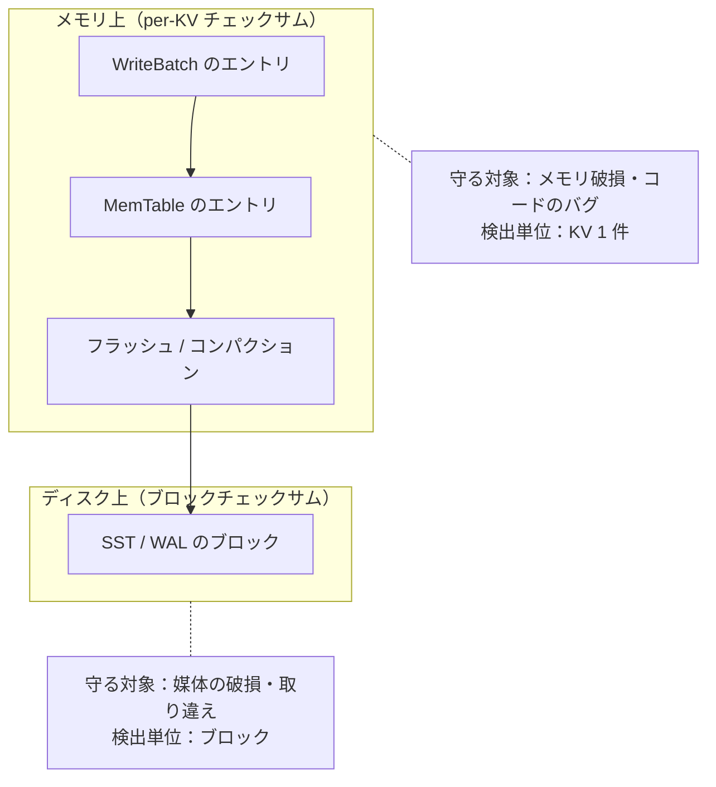

# 第21章 チェックサムと整合性

> **本章で読むソース**
>
> - [`util/crc32c.h`](https://github.com/facebook/rocksdb/blob/v11.1.1/util/crc32c.h)
> - [`util/crc32c.cc`](https://github.com/facebook/rocksdb/blob/v11.1.1/util/crc32c.cc)
> - [`util/hash.h`](https://github.com/facebook/rocksdb/blob/v11.1.1/util/hash.h)
> - [`util/xxhash.h`](https://github.com/facebook/rocksdb/blob/v11.1.1/util/xxhash.h)
> - [`db/kv_checksum.h`](https://github.com/facebook/rocksdb/blob/v11.1.1/db/kv_checksum.h)
> - [`table/format.h`](https://github.com/facebook/rocksdb/blob/v11.1.1/table/format.h)
> - [`include/rocksdb/file_checksum.h`](https://github.com/facebook/rocksdb/blob/v11.1.1/include/rocksdb/file_checksum.h)

## この章の狙い

RocksDB は二つの異なる脅威に対して、二層の整合性保護を持つ。
本章を読むと、永続データのブロックに付くチェックサムと、メモリ上を流れる KV データに帯同するチェックサムが、それぞれ何を守り、なぜ別の仕組みなのかを区別できるようになる。
あわせて、ブロックチェックサムが対応する種別の一つである CRC32c が、SSE4.2 や ARM のハードウェア命令と実行時の関数選択でどう高速化されているかを、機構のレベルで説明できるようになる。
ブロックチェックサムの既定値は XXH3 だが、本章ではハードウェア高速化がよく効く CRC32c を例に取る。

## 前提

- [第14章 テーブルフォーマット](14-table-format.md)：ブロックトレーラの 5 バイト構成（圧縮タイプ 1 バイトとチェックサム 4 バイト）と `Footer` のチェックサム種別フィールドを前提とする。
- [第8章 書き込みパイプライン](../part02-write-path/08-write-pipeline.md)：per-KV チェックサムが `WriteBatch` から MemTable へ流れる経路の前提になる。

## 二つの脅威と二層の保護

RocksDB が守ろうとする破損には、性質の異なる二種類がある。
一つはディスク上のデータ破損である。
SST ファイルや WAL のブロックが、ストレージ媒体の不良、ビット反転、書き込みの取りこぼし、別ファイルとの取り違えなどで壊れる脅威を指す。
もう一つはメモリ上のデータ破損である。
書き込み中の KV データが、ハードウェアのビット反転や RocksDB 自身のコードのバグで、ディスクに到達する前に書き換わる脅威を指す。

この二つは破損が起こる場所も時点も違うので、別々の仕組みで守る。
ディスク破損に対しては、永続化するブロックやレコードの末尾にチェックサムを付け、読み戻すたびに検証する。
メモリ破損に対しては、KV が `WriteBatch` から MemTable を経てフラッシュやコンパクションへ流れるあいだ、各 KV に小さなチェックサムを帯同させ、各段で検証する。
前者を**ブロックチェックサム**、後者を**per-KV チェックサム**と呼んで本章では区別する。



両者は守る範囲も重ならない。
ブロックチェックサムは、ブロックがディスクに書かれてから読み戻されるまでの区間しか守れない。
ディスクに書かれる前にメモリ上で値が壊れていれば、その壊れた値に対して正しいチェックサムを計算してしまうので、ブロックチェックサムは破損を検出できない。
per-KV チェックサムは、まさにこの区間を埋めるために導入されている。

## ブロックチェックサムの種別

ブロックトレーラに格納できるチェックサムの種別は、`ChecksumType` 列挙で定義される。

[`include/rocksdb/table.h` L55-L61](https://github.com/facebook/rocksdb/blob/v11.1.1/include/rocksdb/table.h#L55-L61)

```cpp
enum ChecksumType : char {
  kNoChecksum = 0x0,
  kCRC32c = 0x1,
  kxxHash = 0x2,
  kxxHash64 = 0x3,
  kXXH3 = 0x4,  // Supported since RocksDB 6.27
};
```

`kCRC32c` は対応する種別の一つで、第14章で見たブロックトレーラの 4 バイトチェックサムに広く使われてきた値である。
ただし `table.h` の `ChecksumType checksum = kXXH3;` が示すとおり、既定値は XXH3（`kXXH3`）である。
`kxxHash` と `kxxHash64` はそれぞれ XXH32 と XXH64 を使い、`kXXH3` は RocksDB 6.27 以降で使える XXH3 を使う。
いずれも 32 ビットの検査能力を持つ（64 ビットハッシュは下位 32 ビットだけをトレーラに格納する）。

種別ごとの実際の計算は `ComputeBuiltinChecksum` に集約されている。

[`table/format.cc` L617-L641](https://github.com/facebook/rocksdb/blob/v11.1.1/table/format.cc#L617-L641)

```cpp
uint32_t ComputeBuiltinChecksum(ChecksumType type, const char* data,
                                size_t data_size) {
  switch (type) {
    case kCRC32c:
      return crc32c::Mask(crc32c::Value(data, data_size));
    case kxxHash:
      return XXH32(data, data_size, /*seed*/ 0);
    case kxxHash64:
      return Lower32of64(XXH64(data, data_size, /*seed*/ 0));
    case kXXH3: {
      // ... (中略) ...
    }
    default:  // including kNoChecksum
      return 0;
  }
}
```

`kCRC32c` の経路だけが `crc32c::Mask` を通している点に、CRC 特有の事情が現れている。
`Mask` は値を 15 ビット回転して定数を足す変換で、その意図は `util/crc32c.h` のコメントが説明している。

[`util/crc32c.h` L39-L47](https://github.com/facebook/rocksdb/blob/v11.1.1/util/crc32c.h#L39-L47)

```cpp
// Return a masked representation of crc.
//
// Motivation: it is problematic to compute the CRC of a string that
// contains embedded CRCs.  Therefore we recommend that CRCs stored
// somewhere (e.g., in files) should be masked before being stored.
inline uint32_t Mask(uint32_t crc) {
  // Rotate right by 15 bits and add a constant.
  return ((crc >> 15) | (crc << 17)) + kMaskDelta;
}
```

CRC は線形性が強く、CRC 値そのものを含む文字列の CRC を取ると性質の悪い相関が生じる。
ファイルに格納する CRC をマスクしておくと、この相関を避けられる。
xxHash 系はこの問題を持たないので、マスクをかけずに格納する。

ブロックチェックサムには、もう一つ細かい工夫がある。
トレーラのチェックサムは、ブロック本体だけでなく、その直後に置かれる圧縮タイプの 1 バイトまで含めて計算される（第14章のトレーラ構成を参照）。
そのために、最後の 1 バイトだけを別引数で受け取る `ComputeBuiltinChecksumWithLastByte` が用意されている。

[`table/format.cc` L646-L651](https://github.com/facebook/rocksdb/blob/v11.1.1/table/format.cc#L646-L651)

```cpp
    case kCRC32c: {
      uint32_t crc = crc32c::Value(data, data_size);
      // Extend to cover last byte (compression type)
      crc = crc32c::Extend(crc, &last_byte, 1);
      return crc32c::Mask(crc);
    }
```

ここで使われる `crc32c::Extend` が CRC32c の中心 API である。
`Extend(init_crc, data, n)` は、すでに計算済みの CRC を初期値として受け取り、続きのデータを足し込む。
ブロック本体の CRC をいったん計算し、その値を初期値として圧縮タイプの 1 バイトを足し込めば、本体とトレーラの圧縮タイプをまたいだ CRC が、バッファを連結し直さずに求まる。

## CRC32c の高速化：ハードウェア命令と実行時ディスパッチ

ブロックチェックサムは書き込みのたびに全ブロックへ、読み込みのたびに対象ブロックへ計算される。
そのため CRC32c の速度は RocksDB 全体のスループットに直結し、ここが本章で最も最適化が効いている箇所になる。
CRC32c の高速化の核は二つある。
CPU が持つ専用の CRC 命令を使うことと、どの実装を使うかを実行時に決めて関数ポインタへ固定することである。

### CPU の CRC 命令

CRC32c の多項式は、Intel の SSE4.2 が持つ `crc32` 命令と、ARMv8 の CRC 拡張命令が直接サポートしている。
ソフトウェアのテーブル参照ではなく、これらの命令を 1 個発行すれば、8 バイトぶんの CRC を 1 ステップで進められる。
SSE4.2 が使える環境での最小単位は次の `DefaultCRC32` に現れている。

[`util/crc32c.cc` L251-L271](https://github.com/facebook/rocksdb/blob/v11.1.1/util/crc32c.cc#L251-L271)

```cpp
static inline void DefaultCRC32(uint64_t* l, uint8_t const** p) {
#ifndef __SSE4_2__
  uint32_t c = static_cast<uint32_t>(*l ^ LE_LOAD32(*p));
  *p += 4;
  *l = table3_[c & 0xff] ^ table2_[(c >> 8) & 0xff] ^
       table1_[(c >> 16) & 0xff] ^ table0_[c >> 24];
  // DO it twice.
  // ... (中略) ...
#elif defined(__LP64__) || defined(_WIN64)
  *l = _mm_crc32_u64(*l, DecodeFixed64(reinterpret_cast<const char*>(*p)));
  *p += 8;
#else
  // ... (中略) ...
#endif
}
```

`__SSE4_2__` が定義されていなければ、4 つのルックアップテーブルを引いて XOR するソフトウェア実装になる。
SSE4.2 が使える 64 ビット環境では、`_mm_crc32_u64` の 1 命令で 8 バイトを処理する。
テーブル参照では 1 バイトごとにメモリアクセスと XOR が要るのに対し、ハードウェア命令はそれを 1 個のレイテンシ数サイクルの命令へ畳み込む。
これが速さの第一の源である。

さらに SSE4.2 と PCLMULQDQ が揃う環境では、`crc32c_3way` という三系列並列の実装に切り替わる。
入力を三つのストリームに分け、それぞれ独立に `crc32` 命令を発行してから、キャリーレス乗算（`_mm_clmulqdq`）で三つの部分 CRC を合成する。

[`util/crc32c.cc` L544-L561](https://github.com/facebook/rocksdb/blob/v11.1.1/util/crc32c.cc#L544-L561)

```cpp
inline uint64_t CombineCRC(
    size_t block_size,
    uint64_t crc0,
    uint64_t crc1,
    uint64_t crc2,
    const uint64_t* next2) {
  const auto multiplier =
      *(reinterpret_cast<const __m128i*>(clmul_constants) + block_size - 1);
  const auto crc0_xmm = _mm_set_epi64x(0, crc0);
  const auto res0 = _mm_clmulepi64_si128(crc0_xmm, multiplier, 0x00);
  const auto crc1_xmm = _mm_set_epi64x(0, crc1);
  const auto res1 = _mm_clmulepi64_si128(crc1_xmm, multiplier, 0x10);
  const auto res = _mm_xor_si128(res0, res1);
  crc0 = _mm_cvtsi128_si64(res);
  crc0 = crc0 ^ *((uint64_t*)next2 - 1);
  crc2 = _mm_crc32_u64(crc2, crc0);
  return crc2;
}
```

`crc32` 命令は前の結果に依存するので、単純に並べると命令間の依存でパイプラインが詰まる。
入力を三系列に分けて別々の CRC を進めれば、依存の鎖が三本になり、CPU が三本を並行して走らせられる。
最後に合成する一手間を払ってでも、依存を断ち切ることでスループットを上げるのがこの実装の狙いである。
合成に使う `clmul_constants` は、各系列が処理した長さぶんゼロを後置したときの CRC を、ガロア体の乗算で一気に求めるための定数表である。

### どの実装を使うかを実行時に決める

問題は、どの実装が使えるかが実行環境に依存することである。
ビルドしたバイナリが、CRC 命令を持たない CPU で動くこともある。
そこで RocksDB は、起動時に一度だけ実装を選んで関数ポインタへ固定し、以後の呼び出しはそのポインタを通す。

[`util/crc32c.cc` L1106-L1134](https://github.com/facebook/rocksdb/blob/v11.1.1/util/crc32c.cc#L1106-L1134)

```cpp
static inline Function Choose_Extend() {
#ifdef HAVE_POWER8
  return isAltiVec() ? ExtendPPCImpl : ExtendImpl<DefaultCRC32>;
#elif defined(HAVE_ARM64_CRC)
  if(crc32c_runtime_check()) {
    pmull_runtime_flag = crc32c_pmull_runtime_check();
    return ExtendARMImpl;
  } else {
    return ExtendImpl<DefaultCRC32>;
  }
#elif defined(__SSE4_2__) && defined(__PCLMUL__) && !defined NO_THREEWAY_CRC32C
  // NOTE: runtime detection no longer supported on x86
  // ... (中略) ...
  return crc32c_3way;
#else
  return ExtendImpl<DefaultCRC32>;
#endif
}

static Function ChosenExtend = Choose_Extend();
uint32_t Extend(uint32_t crc, const char* buf, size_t size) {
  return ChosenExtend(crc, buf, size);
}
```

`Function` は `uint32_t (*)(uint32_t, const char*, size_t)` という関数ポインタ型である。
`Choose_Extend` が選んだ実装を、静的変数 `ChosenExtend` がプログラム起動時に一度だけ保持する。
公開 API の `Extend` は、毎回この `ChosenExtend` を呼ぶ薄いラッパーでしかない。

選び方はアーキテクチャごとに違う。
ARM では `crc32c_runtime_check()` が CPU の機能ビットを実行時に調べ、CRC 拡張があれば `ExtendARMImpl` を、なければソフトウェア実装の `ExtendImpl<DefaultCRC32>` を返す。
PowerPC でも `isAltiVec()` で同様の実行時判定を行う。
x86 では事情が異なり、コメントが述べるとおり実行時検出はもう行わず、`__SSE4_2__` などのビルド時マクロで `crc32c_3way` に決まる。

この仕組みが速さに効くのは、命令選択のコストを毎回の呼び出しから追い出すからである。
CPU 機能の判定や `#ifdef` の分岐は、起動時の `Choose_Extend` で一度だけ済む。
ホットパスに残るのは関数ポインタの間接呼び出し一回だけで、CRC を計算するたびに「どの実装を使うか」を考え直さずに済む。
どの実装が使えるかを `IsFastCrc32Supported` で人間向けに報告する API も用意されている（[`util/crc32c.cc` L362-L397](https://github.com/facebook/rocksdb/blob/v11.1.1/util/crc32c.cc#L362-L397)）。

### CRC の連結 `Crc32cCombine`

CRC32c には、二つの文字列それぞれの CRC から、連結した文字列の CRC を再計算なしで求める `Crc32cCombine` もある。

[`util/crc32c.h` L28-L32](https://github.com/facebook/rocksdb/blob/v11.1.1/util/crc32c.h#L28-L32)

```cpp
// Takes two unmasked crc32c values, and the length of the string from
// which `crc2` was computed, and computes a crc32c value for the
// concatenation of the original two input strings. Running time is
// ~ log(crc2len).
uint32_t Crc32cCombine(uint32_t crc1, uint32_t crc2, size_t crc2len);
```

実行時間が連結長に比例せず `log(crc2len)` で済むのは、後半の文字列ぶんのゼロを前半の CRC に「後置」する操作を、ガロア体上のべき乗の繰り返し二乗で計算するからである。
`Extend` がデータを順に足し込むのに対し、`Crc32cCombine` は二つの完成した CRC をデータに触れずに合成する。
連結した全体のデータを持っていなくても CRC を合成できるので、ブロックを継ぎ足す場面で全体を読み直さずに済む。

## per-KV チェックサム：`ProtectionInfo`

ここから、メモリ上を流れる KV を守るもう一層に移る。
ブロックチェックサムがディスクとの往復だけを守るのに対し、per-KV チェックサムは KV がメモリ上のデータ構造を渡り歩くあいだの破損を狙って検出する。
仕組みの中心は `db/kv_checksum.h` の `ProtectionInfo` 系のクラス群である。

### 守るフィールドを型で表す

`ProtectionInfo` は、KV エントリを構成するフィールドのうちどれを保護対象に含むかを、クラス名の接尾辞で表す。

[`db/kv_checksum.h` L11-L19](https://github.com/facebook/rocksdb/blob/v11.1.1/db/kv_checksum.h#L11-L19)

```text
// K = key
// V = value
// O = optype aka value type
// S = seqno
// C = CF ID
//
// Then, for example, a class that protects an entry consisting of key, value,
// optype, and CF ID (i.e., a `WriteBatch` entry) would be named
// `ProtectionInfoKVOC`.
```

接尾辞の各文字が、キー（K）、値（V）、操作種別（O）、シーケンス番号（S）、カラムファミリー ID（C）に対応する。
`ProtectionInfoKVOC` はこの五つのうち K と V と O と C を守るという意味で、`WriteBatch` のエントリに対応する。
実装は保護値を 64 ビット整数 1 個に畳み込んで持つ。
各クラスは `static_assert(sizeof(...) == sizeof(T))` でサイズが整数 1 個ぶんに収まることを保証しており、KV ごとに付ける情報を 8 バイトに抑えている。

保護値は、各フィールドのハッシュを XOR で重ねて作る。
`ProtectKVO` の実装にその様子が出ている。

[`db/kv_checksum.h` L295-L307](https://github.com/facebook/rocksdb/blob/v11.1.1/db/kv_checksum.h#L295-L307)

```cpp
template <typename T>
ProtectionInfoKVO<T> ProtectionInfo<T>::ProtectKVO(const Slice& key,
                                                   const Slice& value,
                                                   ValueType op_type) const {
  T val = GetVal();
  val = val ^ static_cast<T>(GetSliceNPHash64(key, ProtectionInfo<T>::kSeedK));
  val =
      val ^ static_cast<T>(GetSliceNPHash64(value, ProtectionInfo<T>::kSeedV));
  val = val ^
        static_cast<T>(NPHash64(reinterpret_cast<char*>(&op_type),
                                sizeof(op_type), ProtectionInfo<T>::kSeedO));
  return ProtectionInfoKVO<T>(val);
}
```

各フィールドは独立したシード（`kSeedK`、`kSeedV`、`kSeedO` など）でハッシュする。
シードを変える理由は、フィールド同士が入れ替わる破損を捕まえるためである。
キーと値が取り違えられても、シードが違えばハッシュが違うので、XOR の合計が変わって検出できる。
シードは連続値ではなく大きな奇数ずつずらした値で、その選び方の経緯はコメントに残っている（[`db/kv_checksum.h` L77-L88](https://github.com/facebook/rocksdb/blob/v11.1.1/db/kv_checksum.h#L77-L88)）。

### XOR で足し引きできる設計

XOR で重ねる設計は、フィールドの付け外しを安価にするためにある。
ある保護値からフィールドを 1 個取り除くには、そのフィールドのハッシュをもう一度 XOR すればよい。
`ProtectKVO` で値を足し込んだ `StripKVO` がちょうど対称な操作になっていて、同じハッシュを XOR して元に戻す。
同様に、`ProtectC` で守った CF ID を `StripC` で外し、`ProtectS` でシーケンス番号を足す、といった組み替えができる。

検証は、保護値が 0 に戻るかを見るだけで済む。

[`db/kv_checksum.h` L287-L293](https://github.com/facebook/rocksdb/blob/v11.1.1/db/kv_checksum.h#L287-L293)

```cpp
template <typename T>
Status ProtectionInfo<T>::GetStatus() const {
  if (val_ != 0) {
    return Status::Corruption("ProtectionInfo mismatch");
  }
  return Status::OK();
}
```

すべてのフィールドを足したぶんだけ正しく引けば、XOR の性質で保護値は 0 に戻る。
途中でどれかのフィールドが破損していれば、足したときと引くときのハッシュが食い違い、保護値が 0 にならずに `Corruption` になる。

### KV が各段を流れる間の帯同

`WriteBatch` から MemTable へ、`ProtectionInfo` は形を変えながら帯同する。
`WriteBatch` に値を積むと、`ProtectionInfoKVOC64` が作られてエントリに添えられる。

[`db/write_batch.cc` L881-L883](https://github.com/facebook/rocksdb/blob/v11.1.1/db/write_batch.cc#L881-L883)

```cpp
    b->prot_info_->entries_.emplace_back(ProtectionInfo64()
                                             .ProtectKVO(key, value, kTypeValue)
                                             .ProtectC(column_family_id));
```

この時点ではカラムファミリー ID（C）を守り、シーケンス番号はまだ確定していないので含まない。
バッチを MemTable へ流し込むとき、CF ID を外してシーケンス番号を足す組み替えが起こる。

[`db/write_batch.cc` L1957-L1965](https://github.com/facebook/rocksdb/blob/v11.1.1/db/write_batch.cc#L1957-L1965)

```cpp
    if (checksum_protected) {
      s = prot_info_->entries_[prot_info_idx++]
              .StripC(column_family)
              .StripKVO(key, value, static_cast<ValueType>(tag))
              .GetStatus();
      if (!s.ok()) {
        return s;
      }
    }
```

ここで `StripC` と `StripKVO` を順に呼んで保護値が 0 に戻るかを検査し、`WriteBatch` がメモリ上で壊れていないことを確認する。
そのうえで、MemTable に挿入するエントリには、CF ID の代わりにシーケンス番号を含めた `ProtectionInfoKVOS64` を添える。
MemTable は KV を格納するとき、値の直後に保護値そのものを書き込む。

[`db/memtable.cc` L930-L948](https://github.com/facebook/rocksdb/blob/v11.1.1/db/memtable.cc#L930-L948)

```cpp
void MemTable::UpdateEntryChecksum(const ProtectionInfoKVOS64* kv_prot_info,
                                   const Slice& key, const Slice& value,
                                   ValueType type, SequenceNumber s,
                                   char* checksum_ptr) {
  if (moptions_.protection_bytes_per_key == 0) {
    return;
  }

  if (kv_prot_info == nullptr) {
    ProtectionInfo64()
        .ProtectKVO(key, value, type)
        .ProtectS(s)
        .Encode(static_cast<uint8_t>(moptions_.protection_bytes_per_key),
                checksum_ptr);
  } else {
    kv_prot_info->Encode(
        static_cast<uint8_t>(moptions_.protection_bytes_per_key), checksum_ptr);
  }
}
```

MemTable のエントリを読み出すときは、キーと値と種別とシーケンス番号から保護値を再計算し、格納してある保護値と突き合わせる。

[`db/memtable.cc` L326-L343](https://github.com/facebook/rocksdb/blob/v11.1.1/db/memtable.cc#L326-L343)

```cpp
  const char* checksum_ptr = value_ptr + value_length;
  bool match =
      ProtectionInfo64()
          .ProtectKVO(user_key, value, type)
          .ProtectS(seq)
          .Verify(static_cast<uint8_t>(protection_bytes_per_key), checksum_ptr);
  if (!match) {
    std::string msg(
        "Corrupted memtable entry, per key-value checksum verification "
        "failed.");
    // ... (中略) ...
    return Status::Corruption(msg.c_str());
  }
```


帯同という設計が破損検出に効くのは、各段の境目で保護値を引き継ぐからである。
段をまたぐたびに、その段が受け取った KV から保護値を計算し直して突き合わせれば、前の段からこの段までのどこかで起きた書き換えが、突き合わせの不一致として現れる。
保護値そのものは XOR で組み替えられるので、CF ID からシーケンス番号へと付け替えながらも、同じ 8 バイトを最初から最後まで運び続けられる。

この保護を有効にするかどうかは `protection_bytes_per_key` で決まる。

[`include/rocksdb/options.h` L2390-L2395](https://github.com/facebook/rocksdb/blob/v11.1.1/include/rocksdb/options.h#L2390-L2395)

```cpp
  // `protection_bytes_per_key` is the number of bytes used to store
  // protection information for each key entry. Currently supported values are
  // zero (disabled) and eight.
  //
  // Default: zero (disabled).
  size_t protection_bytes_per_key = 0;
```

既定値は 0、つまり無効である。
KV 1 件ごとに保護値を計算して格納し、各段で検証するぶんの CPU とメモリのコストがかかるので、メモリ破損やソフトウェアバグの検出を重視する場面で 8 を選ぶ、という運用になる。

### 速いハッシュを選ぶ理由

per-KV チェックサムが使うのは CRC32c ではなく `NPHash64` 系のハッシュである。
`hash.h` のコメントが、用途による使い分けを明示している。

[`util/hash.h` L39-L42](https://github.com/facebook/rocksdb/blob/v11.1.1/util/hash.h#L39-L42)

```cpp
// Non-persistent hash. Must only used for in-memory data structures.
// The hash results are thus subject to change between releases,
// architectures, build configuration, etc. (Thus, it rarely makes sense
// to specify a seed for this function, except for a "rolling" hash.)
```

`NPHash64` は非永続ハッシュであり、リリースやアーキテクチャをまたぐと結果が変わってよい。
保護値はメモリ上でしか使われず、ディスクには永続化されないので、互換性を捨てて速度を取れる。
実体は高速な XXH3 系のハッシュ（`util/xxhash.h` の `XXH3_64bits`）に行き着く。
ブロックチェックサムが互換性のために CRC32c や XXH3 を慎重に選ぶのとは対照的に、ここでは「メモリ上だけ」という制約を逆手に取って、最速のハッシュを無条件に使える。

xxHash 系のヘッダ自体は、非暗号学的だが極めて高速なハッシュとして導入されている。
ヘッダ冒頭のスループット表によれば、XXH3 は SSE2 で 31.5 GB/s、AVX2 で 59.4 GB/s に達し、XXH64 の 19.4 GB/s や XXH32 の 9.7 GB/s を上回る（[`util/xxhash.h` L86-L102](https://github.com/facebook/rocksdb/blob/v11.1.1/util/xxhash.h#L86-L102)）。
ブロックチェックサムの種別に XXH3 が後から加わったのも、この速度のためである。

## ファイル全体チェックサム

ブロック単位の検証とは別に、SST ファイル 1 個をまるごと 1 個のチェックサムで守る仕組みもある。
中心となるのが `FileChecksumGenerator` で、ファイルを書きながらデータを流し込み、最後に確定する。

[`include/rocksdb/file_checksum.h` L55-L73](https://github.com/facebook/rocksdb/blob/v11.1.1/include/rocksdb/file_checksum.h#L55-L73)

```cpp
class FileChecksumGenerator {
 public:
  virtual ~FileChecksumGenerator() {}

  // Update the current result after process the data. For different checksum
  // functions, the temporal results may be stored and used in Update to
  // include the new data.
  virtual void Update(const char* data, size_t n) = 0;

  // Generate the final results if no further new data will be updated.
  virtual void Finalize() = 0;

  // Get the checksum. The result should not be the empty string and may
  // include arbitrary bytes, including non-printable characters.
  virtual std::string GetChecksum() const = 0;

  // Returns a name that identifies the current file checksum function.
  virtual const char* Name() const = 0;
};
```

このチェックサムはブロック単位の検証を置き換えるものではない。
役割が違う。
ブロックチェックサムが「DB が読むたびに、その場でブロックの健全性を確かめる」ためにあるのに対し、ファイル全体チェックサムは「ファイルをコピーした先で、元と一致するかを確かめる」ために使う。
標準実装は CRC32c ベースで、MANIFEST に記録された値と照合できる形になっている（[`include/rocksdb/file_checksum.h` L31-L34](https://github.com/facebook/rocksdb/blob/v11.1.1/include/rocksdb/file_checksum.h#L31-L34)）。

ファイル全体チェックサムが本領を発揮するのは、バックアップや転送の検証である。
その運用と、`FileChecksumList` を使った DB 全体の検証は[第51章 バックアップとチェックポイント](../part10-advanced/51-backup-checkpoint-secondary.md)で扱う。

## まとめ

- RocksDB は二層で整合性を守る。
  ブロックチェックサムはディスク破損を、per-KV チェックサムはメモリ破損とコードのバグを対象とし、守る区間が重ならない。
- ブロックトレーラのチェックサム種別は `kCRC32c` / `kxxHash` / `kxxHash64` / `kXXH3` の四つで、いずれも 32 ビットの検査能力を持つ。
  CRC だけは格納前に `Mask` をかける。
- CRC32c の高速化の核は、SSE4.2 や ARM のハードウェア CRC 命令と、起動時に実装を選んで関数ポインタ `ChosenExtend` へ固定する実行時ディスパッチである。
  ホットパスには間接呼び出し一回しか残らない。
- x86 では PCLMULQDQ を使う `crc32c_3way` が、入力を三系列に分けて命令間の依存を断ち、スループットを上げる。
- `ProtectionInfo` 系は、守るフィールドを接尾辞（KVOCS）で型に表し、各フィールドのハッシュを独立シードで XOR して 8 バイトに畳み込む。
  XOR の対称性で、フィールドを付け外ししながら KV に帯同させられる。
- per-KV チェックサムは非永続ハッシュ（XXH3 系の `NPHash64`）を使い、`protection_bytes_per_key`（既定 0、有効値 8）で有効化する。
- ファイル全体チェックサム（`FileChecksumGenerator`）は、ブロック検証とは役割が違い、バックアップや転送先での一致確認に使う。

## 関連する章

- [第14章 テーブルフォーマット](14-table-format.md)：ブロックトレーラと `Footer` のチェックサム種別フィールドの全体像。
- [第8章 書き込みパイプライン](../part02-write-path/08-write-pipeline.md)：per-KV チェックサムが帯同する `WriteBatch` から MemTable への経路。
- [第51章 バックアップとチェックポイント](../part10-advanced/51-backup-checkpoint-secondary.md)：ファイル全体チェックサムの運用と DB 全体の検証。
