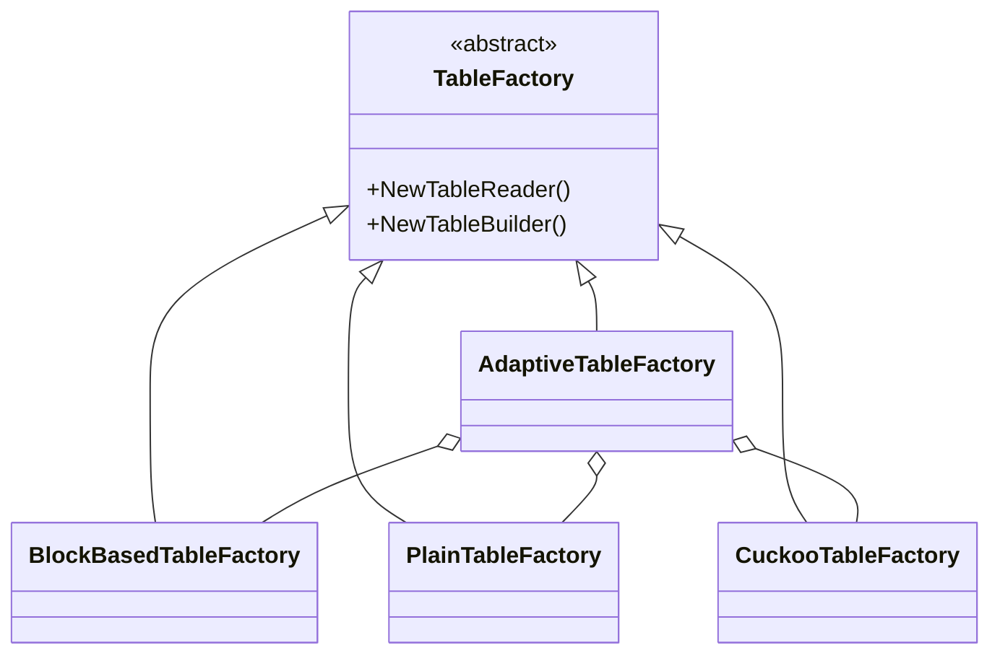
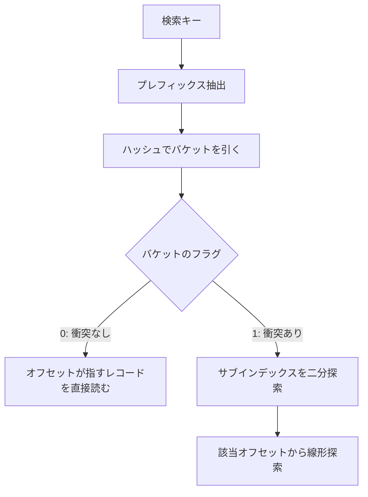

# 第22章 他のテーブル形式

> **本章で読むソース**
>
> - [`include/rocksdb/table.h`](https://github.com/facebook/rocksdb/blob/v11.1.1/include/rocksdb/table.h)
> - [`table/plain/plain_table_factory.h`](https://github.com/facebook/rocksdb/blob/v11.1.1/table/plain/plain_table_factory.h)
> - [`table/plain/plain_table_reader.h`](https://github.com/facebook/rocksdb/blob/v11.1.1/table/plain/plain_table_reader.h)
> - [`table/plain/plain_table_index.h`](https://github.com/facebook/rocksdb/blob/v11.1.1/table/plain/plain_table_index.h)
> - [`table/cuckoo/cuckoo_table_factory.h`](https://github.com/facebook/rocksdb/blob/v11.1.1/table/cuckoo/cuckoo_table_factory.h)
> - [`table/cuckoo/cuckoo_table_reader.h`](https://github.com/facebook/rocksdb/blob/v11.1.1/table/cuckoo/cuckoo_table_reader.h)
> - [`table/cuckoo/cuckoo_table_builder.h`](https://github.com/facebook/rocksdb/blob/v11.1.1/table/cuckoo/cuckoo_table_builder.h)
> - [`table/adaptive/adaptive_table_factory.h`](https://github.com/facebook/rocksdb/blob/v11.1.1/table/adaptive/adaptive_table_factory.h)

## この章の狙い

RocksDB の SST 形式は一つではない。
第14章から第16章で扱った BlockBasedTable が既定だが、それは `TableFactory` という抽象を実装した形式の一つにすぎない。
本章では、BlockBasedTable 以外の二つの形式である **PlainTable** と **CuckooTable**、そして複数形式を読み分ける `AdaptiveTableFactory` を概観し、どの形式がどの点探索コストとトレードオフを選んでいるかを機構のレベルで対応づける。

## 前提

- [第14章 テーブルフォーマット概論](14-table-format.md)
- [第16章 BlockBasedTable リーダ](16-block-based-table-reader.md)

第14章で、SST はファイル末尾の `Footer` を起点にインデックスへ辿る構造だと確認した。
本章の三形式はいずれもこの末尾起点の構造を共有しており、相違は「ファイルのどこを、どう索くか」にある。

## TableFactory という差し替え点

SST の形式は、`TableFactory` を実装したクラスを `Options.table_factory` に差し込むことで切り替わる。
ファクトリは書き出し器と読み取り器を生成する起点であり、形式ごとの実体はそこから作られるリーダとビルダに閉じている。

[`include/rocksdb/table.h` L994-L1075](https://github.com/facebook/rocksdb/blob/v11.1.1/include/rocksdb/table.h#L994-L1075)

```cpp
// A base class for table factories.
class TableFactory : public Customizable {
 public:
  ~TableFactory() override {}

  static const char* kBlockCacheOpts() { return "BlockCache"; }
  static const char* kBlockBasedTableName() { return "BlockBasedTable"; }
  static const char* kPlainTableName() { return "PlainTable"; }
  static const char* kCuckooTableName() { return "CuckooTable"; }
  // ... (中略) ...
  virtual Status NewTableReader(
      const ReadOptions& ro, const TableReaderOptions& table_reader_options,
      std::unique_ptr<RandomAccessFileReader>&& file, uint64_t file_size,
      std::unique_ptr<TableReader>* table_reader,
      bool prefetch_index_and_filter_in_cache) const = 0;
  // ... (中略) ...
  virtual TableBuilder* NewTableBuilder(
      const TableBuilderOptions& table_builder_options,
      WritableFileWriter* file) const = 0;
  // ... (中略) ...
};
```

抽象の要は `NewTableReader` と `NewTableBuilder` の二つの純粋仮想関数である。
RocksDB の上位の経路は、フラッシュやコンパクションでこの `NewTableBuilder` を呼んで SST を書き、`TableCache` 経由で `NewTableReader` を呼んで読む。
どちらも `TableReader` と `TableBuilder` というインタフェースだけを見ており、その背後が BlockBasedTable なのか PlainTable なのかを知らない。
形式の差し替えがこの一点で成立するのは、上位の経路が具体的な形式に依存していないからである。



既定の BlockBasedTable は汎用形式であり、ブロック圧縮、Block Cache、レンジスキャン、スナップショットなどをひととおり備える。
これに対して、これから見る二形式はいずれも特定の用途に絞り込み、その代わりに汎用機能の一部を捨てている。

## PlainTable: mmap 常駐前提の点探索形式

PlainTable は、ファイルをメモリにマップして常駐させる前提で設計された形式である。
名前のとおりデータをブロックにまとめず、レコードを平らに並べる。
何を捨てて何を得るのかは、ファクトリのクラスコメントに明記されている。

[`table/plain/plain_table_factory.h` L25-L38](https://github.com/facebook/rocksdb/blob/v11.1.1/table/plain/plain_table_factory.h#L25-L38)

```cpp
// PlainTableFactory is the entrance function to the PlainTable format of
// SST files. It returns instances PlainTableBuilder as the builder
// class and PlainTableReader as the reader class, where the format is
// actually implemented.
//
// The PlainTable is designed for memory-mapped file systems, e.g. tmpfs.
// Data is not organized in blocks, which allows fast access. Because of
// following downsides
// 1. Data compression is not supported.
// 2. Data is not checksumed.
// it is not recommended to use this format on other type of file systems.
//
// PlainTable requires fixed length key, configured as a constructor
// parameter of the factory class. Output file format:
```

コメントが述べる設計上の判断は三点ある。
第一に、`tmpfs` のようなメモリマップされたファイルシステムを対象とし、データをブロックに組まないことで高速アクセスを得る。
第二に、その代償としてデータ圧縮を持たない。
第三に、データのチェックサムを持たない。
圧縮もチェックサムも持たないため、この形式はメモリマップされない通常のファイルシステムでの利用を推奨されない。

データをブロックに組まない理由は、点探索の経路を短くするためである。
ブロックを使う BlockBasedTable では、目的のキーを得るまでにインデックスブロックを索き、データブロックを読み出し、ブロック内を二分探索する段階が要る。
PlainTable はファイルがそのままメモリ上にあると仮定するので、レコードのファイルオフセットさえ分かれば、そのアドレスを直接読めばよい。
ブロックという中間単位を挟まないことが、この直接アクセスを成り立たせている。

### ハッシュインデックスによる点探索

ファイルオフセットを引き当てるのが、PlainTable のハッシュインデックスである。
リーダは、ファイルを開くときにキーのプレフィックスからファイルオフセットへのハッシュテーブルを構築する。

[`table/plain/plain_table_reader.h` L58-L68](https://github.com/facebook/rocksdb/blob/v11.1.1/table/plain/plain_table_reader.h#L58-L68)

```cpp
// The reader class of PlainTable. For description of PlainTable format
// See comments of class PlainTableFactory, where instances of
// PlainTableReader are created.
class PlainTableReader : public TableReader {
 public:
  // Based on following output file format shown in plain_table_factory.h
  // When opening the output file, PlainTableReader creates a hash table
  // from key prefixes to offset of the output file. PlainTable will decide
  // whether it points to the data offset of the first key with the key prefix
  // or the offset of it. If there are too many keys share this prefix, it will
  // create a binary search-able index from the suffix to offset on disk.
```

索き方は、プレフィックスのハッシュ値でバケットを引く一段階だけではない。
インデックスのバケットは32ビット整数で、最上位ビットがその先の探索方法を示す。

[`table/plain/plain_table_index.h` L24-L38](https://github.com/facebook/rocksdb/blob/v11.1.1/table/plain/plain_table_index.h#L24-L38)

```cpp
// PlainTableIndex contains buckets size of index_size_, each is a
// 32-bit integer. The lower 31 bits contain an offset value (explained below)
// and the first bit of the integer indicates type of the offset.
//
// +--------------+------------------------------------------------------+
// | Flag (1 bit) | Offset to binary search buffer or file (31 bits)     +
// +--------------+------------------------------------------------------+
//
// Explanation for the "flag bit":
//
// 0 indicates that the bucket contains only one prefix (no conflict when
//   hashing this prefix), whose first row starts from this offset of the
// file.
// 1 indicates that the bucket contains more than one prefixes, or there
//   are too many rows for one prefix so we need a binary search for it. In
```

このフラグビットが、ハッシュ衝突の有無で経路を分ける。
フラグが0なら、そのプレフィックスはバケットを単独で占めており、下位31ビットのオフセットがそのまま最初のレコードを指す。
このときの点探索は、ハッシュ計算とオフセット読みだけで終わる。
フラグが1なら、複数のプレフィックスが同じバケットに衝突しているか、一つのプレフィックスにレコードが多すぎる場合であり、オフセットはサブインデックスを指す。
サブインデックスはファイルオフセットを昇順に並べた配列なので、その上で二分探索する。

したがって PlainTable の点探索コストは、衝突がなければハッシュ一回ぶん、衝突があればハッシュに二分探索を足したぶんに収まる。
インデックスがプレフィックスを単位にすることと、衝突時だけ二分探索へ落ちる二段構えが、平均的な点探索を短く保つ仕組みである。



衝突時の二分探索の細かさは `index_sparseness` で決まる。
この値は同じプレフィックス内でキー何個ごとに索引レコードを一つ作るかを表し、ハッシュと二分探索のあとに残る線形探索の最大ステップ数になる。

[`include/rocksdb/table.h` L881-L894](https://github.com/facebook/rocksdb/blob/v11.1.1/include/rocksdb/table.h#L881-L894)

```cpp
  // @index_sparseness: inside each prefix, need to build one index record for
  //                    how many keys for binary search inside each hash bucket.
  //                    For encoding type kPrefix, the value will be used when
  //                    writing to determine an interval to rewrite the full
  //                    key. It will also be used as a suggestion and satisfied
  //                    when possible.
  size_t index_sparseness = 16;

  // @huge_page_tlb_size: if <=0, allocate hash indexes and blooms from malloc.
  //                      Otherwise from huge page TLB. The user needs to
  //                      reserve huge pages for it to be allocated, like:
  //                          sysctl -w vm.nr_hugepages=20
  //                      See linux doc Documentation/vm/hugetlbpage.txt
  size_t huge_page_tlb_size = 0;
```

既定では16である。
索引を密にすると線形探索は短くなるがインデックスのメモリが増え、疎にするとその逆になる。

### 制約とオプション

PlainTable はキーを固定長で要求する形式である。
ファクトリのコンストラクタにキー長を渡し、可変長にしたいときだけ `kPlainTableVariableLength` を渡す。

[`include/rocksdb/table.h` L863-L873](https://github.com/facebook/rocksdb/blob/v11.1.1/include/rocksdb/table.h#L863-L873)

```cpp
struct PlainTableOptions {
  static const char* kName() { return "PlainTableOptions"; }
  // @user_key_len: plain table has optimization for fix-sized keys, which can
  //                be specified via user_key_len.  Alternatively, you can pass
  //                `kPlainTableVariableLength` if your keys have variable
  //                lengths.
  uint32_t user_key_len = kPlainTableVariableLength;

  // @bloom_bits_per_key: the number of bits used for bloom filer per prefix.
  //                      You may disable it by passing a zero.
  int bloom_bits_per_key = 10;
```

`NewPlainTableFactory` で作るファクトリは、プレフィックス指定の探索を前提にする。
そのためには `Options.prefix_extractor` を適切に設定する必要があり、索き方は前述のハッシュ、二分探索、線形探索の三段になる。

[`include/rocksdb/table.h` L916-L923](https://github.com/facebook/rocksdb/blob/v11.1.1/include/rocksdb/table.h#L916-L923)

```cpp
// -- Plain Table with prefix-only seek
// For this factory, you need to set Options.prefix_extractor properly to make
// it work. Look-up will starts with prefix hash lookup for key prefix. Inside
// the hash bucket found, a binary search is executed for hash conflicts.
// Finally, a linear search is used.

TableFactory* NewPlainTableFactory(
    const PlainTableOptions& options = PlainTableOptions());
```

レンジスキャンが弱いのは、このプレフィックス起点の索き方の裏返しである。
ハッシュインデックスはプレフィックスからオフセットへ飛ぶための構造であって、キー全体の順序をまたいで走査するためのものではない。
`prefix_extractor` を設定しない全順序モードでは二分探索に退化するので、用途はインメモリで低レイテンシの点探索に向く。

## CuckooTable: クックーハッシュ法による読み取り特化形式

CuckooTable は、読み取り、とくに点探索に特化した形式である。
クックーハッシュ法を使い、各キーを少数の候補位置のいずれかに収めることで、点探索を最小のプローブで済ませる。
何を前提にするかは、ファクトリのクラスコメントに列挙されている。

[`table/cuckoo/cuckoo_table_factory.h` L45-L53](https://github.com/facebook/rocksdb/blob/v11.1.1/table/cuckoo/cuckoo_table_factory.h#L45-L53)

```cpp
// Cuckoo Table is designed for applications that require fast point lookups
// but not fast range scans.
//
// Some assumptions:
// - Key length and Value length are fixed.
// - Does not support Snapshot.
// - Does not support Merge operations.
// - Does not support prefix bloom filters.
class CuckooTableFactory : public TableFactory {
```

コメントが宣言する前提は、高速な点探索を必要とするが高速なレンジスキャンは必要としない用途に向けて設計したという一点に集約される。
その代わりに、キー長とバリュー長を固定とし、スナップショットを持たず、マージ演算を持たず、プレフィックスのブルームフィルタを持たない。
これらの非対応は、後述する一キー一エントリの格納モデルから来る。

### クックーハッシュ法による格納

クックーハッシュ法は、複数のハッシュ関数を使って各キーの候補位置を限定する手法である。
ビルダは、キーを `max_num_hash_func` 個の候補位置のどれかに収め、衝突したら既存のキーを別の候補位置へ追い出していく。
追い出しの連鎖をどこまで辿るかが `max_search_depth` であり、深くするほど詰め込み効率は上がるが構築時間が伸びる。

[`include/rocksdb/table.h` L957-L974](https://github.com/facebook/rocksdb/blob/v11.1.1/include/rocksdb/table.h#L957-L974)

```cpp
struct CuckooTableOptions {
  static const char* kName() { return "CuckooTableOptions"; }

  // Determines the utilization of hash tables. Smaller values
  // result in larger hash tables with fewer collisions.
  double hash_table_ratio = 0.9;
  // A property used by builder to determine the depth to go to
  // to search for a path to displace elements in case of
  // collision. See Builder.MakeSpaceForKey method. Higher
  // values result in more efficient hash tables with fewer
  // lookups but take more time to build.
  uint32_t max_search_depth = 100;
  // In case of collision while inserting, the builder
  // attempts to insert in the next cuckoo_block_size
  // locations before skipping over to the next Cuckoo hash
  // function. This makes lookups more cache friendly in case
  // of collisions.
  uint32_t cuckoo_block_size = 5;
```

追い出しの実体は、ビルダの `MakeSpaceForKey` にある。

[`table/cuckoo/cuckoo_table_builder.h` L90-L93](https://github.com/facebook/rocksdb/blob/v11.1.1/table/cuckoo/cuckoo_table_builder.h#L90-L93)

```cpp
  bool MakeSpaceForKey(const autovector<uint64_t>& hash_vals,
                       const uint32_t call_id,
                       std::vector<CuckooBucket>* buckets, uint64_t* bucket_id);
  Status MakeHashTable(std::vector<CuckooBucket>* buckets);
```

このように、構築側でキーを少数の候補位置へ収めきっておくことが、読み取り側のプローブ回数を上限で抑えるための前提になっている。

### 点探索のプローブ経路

読み取り側の点探索は、候補位置を順に当たるだけである。
リーダの `Get` は、ハッシュ関数を `hash_cnt` で切り替えながらバケットを引き、ユーザーキーが一致したらそのバリューを返す。

[`table/cuckoo/cuckoo_table_reader.cc` L157-L171](https://github.com/facebook/rocksdb/blob/v11.1.1/table/cuckoo/cuckoo_table_reader.cc#L157-L171)

```cpp
  for (uint32_t hash_cnt = 0; hash_cnt < num_hash_func_; ++hash_cnt) {
    uint64_t offset =
        bucket_length_ * CuckooHash(user_key, hash_cnt, use_module_hash_,
                                    table_size_, identity_as_first_hash_,
                                    get_slice_hash_);
    const char* bucket = &file_data_.data()[offset];
    for (uint32_t block_idx = 0; block_idx < cuckoo_block_size_;
         ++block_idx, bucket += bucket_length_) {
      if (ucomp_->Equal(Slice(unused_key_.data(), user_key.size()),
                        Slice(bucket, user_key.size()))) {
        return Status::OK();
      }
      // Here, we compare only the user key part as we support only one entry
      // per user key and we don't support snapshot.
      if (ucomp_->Equal(user_key, Slice(bucket, user_key.size()))) {
```

外側のループはハッシュ関数の本数ぶん、内側のループは `cuckoo_block_size` ぶんしか回らない。
点探索のプローブ回数は、この二つの積を上限として有界である。
バケットは固定長で、`bucket_length_ * CuckooHash(...)` で計算したオフセットがそのままメモリ上のアドレスになるので、各プローブは一回のメモリアクセスで済む。
ここが、ブロックを索いてから中を二分探索する BlockBasedTable と最も違う。

内側ループの存在には、キャッシュ効率の意図がある。
衝突時に次のハッシュ関数へ飛ぶ前に、連続する `cuckoo_block_size` 個のバケットを先に当たる。
連続領域を読むことで、衝突時にも別の場所へ飛ぶ回数を減らし、キャッシュミスを抑える。

[`include/rocksdb/table.h` L932-L939](https://github.com/facebook/rocksdb/blob/v11.1.1/include/rocksdb/table.h#L932-L939)

```cpp
  // It denotes the number of buckets in a Cuckoo Block. Given a key and a
  // particular hash function, a Cuckoo Block is a set of consecutive buckets,
  // where starting bucket id is given by the hash function on the key. In case
  // of a collision during inserting the key, the builder tries to insert the
  // key in other locations of the cuckoo block before using the next hash
  // function. This reduces cache miss during read operation in case of
  // collision.
  static const std::string kCuckooBlockSize;
```

### 制約

リーダの宣言を見ると、レンジ系の操作が実装されていないことが分かる。

[`table/cuckoo/cuckoo_table_reader.h` L60-L74](https://github.com/facebook/rocksdb/blob/v11.1.1/table/cuckoo/cuckoo_table_reader.h#L60-L74)

```cpp
  // Following methods are not implemented for Cuckoo Table Reader
  uint64_t ApproximateOffsetOf(const ReadOptions& /*read_options*/,
                               const Slice& /*key*/,
                               TableReaderCaller /*caller*/) override {
    return 0;
  }

  uint64_t ApproximateSize(const ReadOptions& /* read_options */,
                           const Slice& /*start*/, const Slice& /*end*/,
                           TableReaderCaller /*caller*/) override {
    return 0;
  }

  void SetupForCompaction() override {}
  // End of methods not implemented.
```

`ApproximateOffsetOf` と `ApproximateSize` がともに0を返すのは、クックーハッシュ法による配置がキーの順序と無関係だからである。
キーはハッシュで決まる位置に散っており、あるキーがファイル全体のどのあたりにあるかという概念が成り立たない。
レンジスキャンを行うイテレータは、全バケットを走査してキー順にソートし直すことで成立させており、点探索とは別経路になっている。
読み取り特化という性格は、こうしたレンジ操作の弱さと表裏である。

## AdaptiveTableFactory: 形式を読み分けるファクトリ

ここまでの形式は、一つの DB を一つの形式で書き読みする前提だった。
`AdaptiveTableFactory` は、書きは一形式に固定したまま、読みは複数形式を受け付けるためのファクトリである。
構築時に、書き出しに使うファクトリと、読み取りに使う三つのファクトリ（BlockBasedTable、PlainTable、CuckooTable）を受け取る。

[`table/adaptive/adaptive_table_factory.h` L23-L33](https://github.com/facebook/rocksdb/blob/v11.1.1/table/adaptive/adaptive_table_factory.h#L23-L33)

```cpp
class AdaptiveTableFactory : public TableFactory {
 public:
  ~AdaptiveTableFactory() {}

  explicit AdaptiveTableFactory(
      std::shared_ptr<TableFactory> table_factory_to_write,
      std::shared_ptr<TableFactory> block_based_table_factory,
      std::shared_ptr<TableFactory> plain_table_factory,
      std::shared_ptr<TableFactory> cuckoo_table_factory);

  const char* Name() const override { return "AdaptiveTableFactory"; }
  // ... (中略) ...
```

読み分けの判断材料は、ファイル末尾の `Footer` に書かれたマジックナンバーである。
`NewTableReader` は、まずファイルから `Footer` を読み、そのマジックナンバーで分岐して適切なファクトリへ委譲する。

[`table/adaptive/adaptive_table_factory.cc` L42-L64](https://github.com/facebook/rocksdb/blob/v11.1.1/table/adaptive/adaptive_table_factory.cc#L42-L64)

```cpp
  Footer footer;
  IOOptions opts;
  auto s =
      ReadFooterFromFile(opts, file.get(), *table_reader_options.ioptions.fs,
                         nullptr /* prefetch_buffer */, file_size, &footer);
  if (!s.ok()) {
    return s;
  }
  if (footer.table_magic_number() == kPlainTableMagicNumber ||
      footer.table_magic_number() == kLegacyPlainTableMagicNumber) {
    return plain_table_factory_->NewTableReader(
        table_reader_options, std::move(file), file_size, table);
  } else if (footer.table_magic_number() == kBlockBasedTableMagicNumber) {
    return block_based_table_factory_->NewTableReader(
        ro, table_reader_options, std::move(file), file_size, table,
        prefetch_index_and_filter_in_cache);
  } else if (footer.table_magic_number() == kCuckooTableMagicNumber) {
    return cuckoo_table_factory_->NewTableReader(
        table_reader_options, std::move(file), file_size, table);
  } else {
    return Status::NotSupported("Unidentified table format");
  }
}
```

第14章で見たとおり、`Footer` はファイル末尾の固定長領域であり、ファイルサイズさえ分かれば末尾の数十バイトを読むだけで取得できる。
そこにマジックナンバーが入っているので、リーダは中身を読む前に形式を判別できる。
このため、形式が混在した DB でも、各ファイルを正しいリーダで開ける。

書きは一形式に固定される。

[`include/rocksdb/table.h` L1077-L1090](https://github.com/facebook/rocksdb/blob/v11.1.1/include/rocksdb/table.h#L1077-L1090)

```cpp
// Create a special table factory that can open either of the supported
// table formats, based on setting inside the SST files. It should be used to
// convert a DB from one table format to another.
// @table_factory_to_write: the table factory used when writing to new files.
// @block_based_table_factory:  block based table factory to use. If NULL, use
//                              a default one.
// @plain_table_factory: plain table factory to use. If NULL, use a default one.
// @cuckoo_table_factory: cuckoo table factory to use. If NULL, use a default
// one.
TableFactory* NewAdaptiveTableFactory(
    std::shared_ptr<TableFactory> table_factory_to_write = nullptr,
    std::shared_ptr<TableFactory> block_based_table_factory = nullptr,
    std::shared_ptr<TableFactory> plain_table_factory = nullptr,
    std::shared_ptr<TableFactory> cuckoo_table_factory = nullptr);
```

コメントが述べるとおり、この仕組みは DB をある形式から別の形式へ移行する用途を想定している。
書き出しを新形式に切り替えても、旧形式で書かれた既存ファイルはマジックナンバーで判別して旧リーダで読めるため、コンパクションが進むにつれて DB 全体がなだらかに新形式へ移っていく。

## 形式の使い分け

三形式の点探索の経路を並べると、トレードオフの位置が見える。

| 形式 | 点探索の経路 | 主な制約 | 向く用途 |
| --- | --- | --- | --- |
| BlockBasedTable | インデックス索引 → データブロック読み出し → ブロック内二分探索 | 既定。汎用機能をひととおり備える | 汎用。レンジスキャンや圧縮が要るとき |
| PlainTable | プレフィックスのハッシュ → 衝突時のみ二分探索と線形探索 | mmap 前提、圧縮なし、チェックサムなし、レンジスキャンが弱い | インメモリで低レイテンシの点探索 |
| CuckooTable | 少数の候補位置をプローブ（有界回数のメモリアクセス） | 固定長キーとバリュー、スナップショット非対応、マージ非対応 | 読み取り特化の点探索 |

選択の指針は次のようにまとめられる。
汎用の用途では、レンジスキャンも圧縮もスナップショットも備える BlockBasedTable を既定のまま使う。
データセットがメモリに載り、点探索のレイテンシを詰めたい場合は PlainTable を検討する。
読み取りに振り切ってよく、固定長キーで更新やスナップショットを使わない場合は CuckooTable を検討する。

## まとめ

- SST の形式は `TableFactory` を実装したクラスを `Options.table_factory` に差し込むことで切り替わる。
  上位の経路は `TableReader` と `TableBuilder` のインタフェースだけを見ており、形式に依存しない。
- PlainTable は mmap 常駐を前提に、ブロックを使わず点探索の経路を短くする。
  プレフィックスのハッシュを引き、衝突時だけ二分探索へ落ちる。
  圧縮とチェックサムを持たず、レンジスキャンは弱い。
- PlainTable の点探索コストは、衝突がなければハッシュ一回、衝突があればハッシュに二分探索と線形探索を足したぶんに収まる。
  線形探索の長さは `index_sparseness`（既定16）で決まる。
- CuckooTable はクックーハッシュ法で各キーを少数の候補位置に収め、点探索を `num_hash_func` と `cuckoo_block_size` の積を上限とする有界回数のメモリアクセスで済ませる。
  固定長キー前提で、スナップショットとマージを持たず、レンジ系は弱い。
- `AdaptiveTableFactory` は `Footer` のマジックナンバーで形式を判別し、読みは複数形式、書きは一形式という役割分担で形式移行を支える。

## 関連する章

- [第16章 BlockBasedTable リーダ](16-block-based-table-reader.md)
- [第18章 ブルームフィルタ](18-bloom-filter.md)
- [第23章 Get](../part04-read-path/23-get.md)
