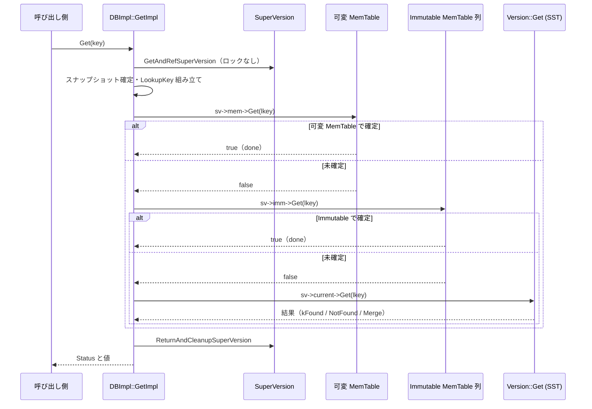
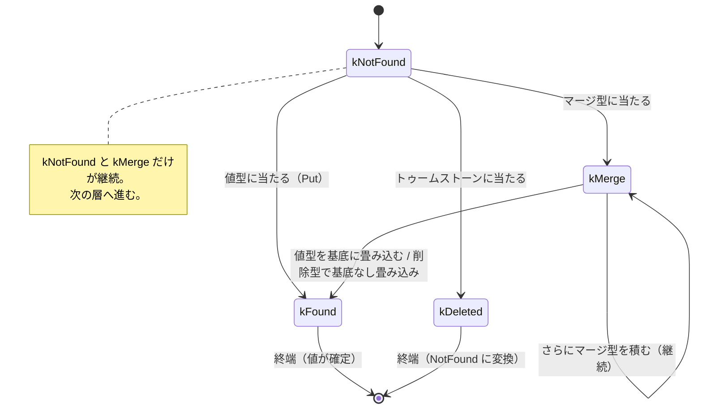

# 第23章 Get の全体像

> **本章で読むソース**
> - [`db/db_impl/db_impl.cc`](https://github.com/facebook/rocksdb/blob/v11.1.1/db/db_impl/db_impl.cc)
> - [`db/db_impl/db_impl.h`](https://github.com/facebook/rocksdb/blob/v11.1.1/db/db_impl/db_impl.h)
> - [`table/get_context.h`](https://github.com/facebook/rocksdb/blob/v11.1.1/table/get_context.h)
> - [`table/get_context.cc`](https://github.com/facebook/rocksdb/blob/v11.1.1/table/get_context.cc)
> - [`db/memtable.cc`](https://github.com/facebook/rocksdb/blob/v11.1.1/db/memtable.cc)
> - [`db/column_family.h`](https://github.com/facebook/rocksdb/blob/v11.1.1/db/column_family.h)
> - [`db/column_family.cc`](https://github.com/facebook/rocksdb/blob/v11.1.1/db/column_family.cc)

## この章の狙い

`DB::Get` を呼んだとき、RocksDB が一つのキーをどの順で探し、どこで打ち切るかを理解する。
読み出しパスの統括役である `DBImpl::GetImpl` と、各層の探索結果を受け取る状態機械 `GetContext` の二つを軸に、層をまたぐ探索の制御フローを追う。
SuperVersion をロックなしで一度だけ取得し、そこから全層を見る仕組みを機構として説明する。

## 前提

- [第5章 内部キー](../part01-data-model/05-internal-key.md)（LookupKey とシーケンス番号）
- [第11章 MemTable とスキップリスト](../part02-write-path/11-memtable-skiplist.md)
- [第18章 ブルームフィルタ](../part03-sst/18-bloom-filter.md)（MemTable・SST でのフィルタ早期棄却）

Version と SuperVersion の内部構造、レベル内のファイル選択は [第24章 Version と SuperVersion](24-version-superversion.md) で扱う。
本章では `Version::Get` を「呼ぶ」ことと、その役割までを述べる。

## 探索の順序という設計

RocksDB は LSM ツリーを採る。
同じユーザーキーに対する書き込みは上書きされず、新しい順に複数の層へ積み重なる。
最新の書き込みは可変 MemTable にあり、フラッシュ待ちの Immutable MemTable がそれに続き、さらに古いデータはディスク上の SST に L0 から Ln まで分かれて並ぶ。

このため点取得は、もっとも新しい層から順に探し、最初に確定した時点で打ち切ればよい。
ある層でそのキーの最新版が見つかれば、それより古い層の同じキーは必ず上書きされており、見る必要がない。
`DBImpl::GetImpl` はこの順序を体現する。
可変 MemTable、Immutable MemTable 列、そして `Version::Get` によるディスク探索を、この順に呼び分ける。

確定を判定するのが `GetContext` である。
各層は探索結果（値が見つかった、削除されていた、マージ途中である）を `GetContext` に書き込み、`GetImpl` はその状態を見て次の層へ進むか打ち切るかを決める。
この章は、層を呼び分ける `GetImpl` と、確定を判定する `GetContext` の二つを順に読む。

## API から GetImpl への入り口

`DB::Get` の実体は `DBImpl::Get` である。
ここでは引数の検証と `ReadOptions` の整形だけを行い、本体の処理は `GetImpl` に委ねる。

[`db/db_impl/db_impl.cc` L2323-L2343](https://github.com/facebook/rocksdb/blob/v11.1.1/db/db_impl/db_impl.cc#L2323-L2343)

```cpp
Status DBImpl::Get(const ReadOptions& _read_options,
                   ColumnFamilyHandle* column_family, const Slice& key,
                   PinnableSlice* value, std::string* timestamp) {
  assert(value != nullptr);
  value->Reset();
  // ... (io_activity の検証と既定値の設定) ...
  Status s = GetImpl(read_options, column_family, key, value, timestamp);
  return s;
}
```

`GetImpl` には三つのオーバーロードがある。
利用側に向けた二つは引数を `GetImplOptions` という構造体に詰め替えてから、本体の `GetImpl(read_options, key, get_impl_options)` を呼ぶだけである。

[`db/db_impl/db_impl.cc` L2345-L2355](https://github.com/facebook/rocksdb/blob/v11.1.1/db/db_impl/db_impl.cc#L2345-L2355)

```cpp
Status DBImpl::GetImpl(const ReadOptions& read_options,
                       ColumnFamilyHandle* column_family, const Slice& key,
                       PinnableSlice* value, std::string* timestamp) {
  GetImplOptions get_impl_options;
  get_impl_options.column_family = column_family;
  get_impl_options.value = value;
  get_impl_options.timestamp = timestamp;

  Status s = GetImpl(read_options, key, get_impl_options);
  return s;
}
```

`GetImplOptions` は、点取得の入出力をまとめた構造体である。

[`db/db_impl/db_impl.h` L683-L700](https://github.com/facebook/rocksdb/blob/v11.1.1/db/db_impl/db_impl.h#L683-L700)

```cpp
struct GetImplOptions {
  ColumnFamilyHandle* column_family = nullptr;
  PinnableSlice* value = nullptr;
  PinnableWideColumns* columns = nullptr;
  std::string* timestamp = nullptr;
  bool* value_found = nullptr;
  ReadCallback* callback = nullptr;
  bool* is_blob_index = nullptr;
  // If true return value associated with key via value pointer else return
  // all merge operands for key via merge_operands pointer
  bool get_value = true;
  // ... (マージオペランド取得用のフィールド) ...
};
```

このひとまとめの構造体を使い回すことで、通常の値取得（`get_value = true`）、`GetEntity` によるワイドカラム取得（`columns`）、`GetMergeOperands` によるマージオペランド列の取得（`get_value = false`）を、同じ本体関数で処理できる。
本章は通常の値取得の経路を追う。

## SuperVersion をロックなしで一度だけ取得する

本体の `GetImpl` は、まず探索対象となる層の集合を固定する。
その集合が **SuperVersion** である。

SuperVersion は、ある瞬間のカラムファミリーの読み出し対象を一つにまとめたスナップショットである。
可変 MemTable、Immutable MemTable 列、そしてディスク上の SST 群を表す Version を、まとめて指す。

[`db/column_family.h` L206-L216](https://github.com/facebook/rocksdb/blob/v11.1.1/db/column_family.h#L206-L216)

```cpp
struct SuperVersion {
  // Accessing members of this class is not thread-safe and requires external
  // synchronization (ie db mutex held or on write thread).
  ColumnFamilyData* cfd;
  ReadOnlyMemTable* mem;
  MemTableListVersion* imm;
  Version* current;
  // ...
  // Version number of the current SuperVersion
  uint64_t version_number;
  // ...
};
```

`mem` が可変 MemTable、`imm` が Immutable MemTable 列、`current` がディスク上の SST を表す Version である。
点取得が見る三つの層は、すべてこの一つの SuperVersion から取り出せる。

本体の `GetImpl` は、探索に先立ってこの SuperVersion を一度だけ参照取得する。

[`db/db_impl/db_impl.cc` L2537-L2538](https://github.com/facebook/rocksdb/blob/v11.1.1/db/db_impl/db_impl.cc#L2537-L2538)

```cpp
  // Acquire SuperVersion
  SuperVersion* sv = GetAndRefSuperVersion(cfd);
```

`GetAndRefSuperVersion` は `cfd->GetThreadLocalSuperVersion(this)` を呼ぶ。
ここが点取得の高速化の核である。
通常の読み出しは DB のミューテックスをまったく取らない。

[`db/column_family.cc` L1366-L1394](https://github.com/facebook/rocksdb/blob/v11.1.1/db/column_family.cc#L1366-L1394)

```cpp
SuperVersion* ColumnFamilyData::GetThreadLocalSuperVersion(DBImpl* db) {
  // The SuperVersion is cached in thread local storage to avoid acquiring
  // mutex when SuperVersion does not change since the last use. When a new
  // SuperVersion is installed, the compaction or flush thread cleans up
  // cached SuperVersion in all existing thread local storage. To avoid
  // acquiring mutex for this operation, we use atomic Swap() on the thread
  // local pointer to guarantee exclusive access. ...
  void* ptr = local_sv_->Swap(SuperVersion::kSVInUse);
  // ...
  SuperVersion* sv = static_cast<SuperVersion*>(ptr);
  if (sv == SuperVersion::kSVObsolete) {
    RecordTick(ioptions_.stats, NUMBER_SUPERVERSION_ACQUIRES);
    db->mutex()->Lock();
    sv = super_version_->Ref();
    db->mutex()->Unlock();
  }
  assert(sv != nullptr);
  return sv;
}
```

仕組みはこうである。
各スレッドは自分のスレッドローカル記憶域に、直近に使った SuperVersion へのポインタを持つ。
取得時には、そのポインタを目印 `kSVInUse` とアトミックに交換する。
取り出したポインタが有効な SuperVersion であれば、それをそのまま使う。
フラッシュやコンパクションが新しい SuperVersion を据えたときは、背景スレッドが各スレッドのスレッドローカル記憶域を `kSVObsolete` に書き換える。
取り出したポインタがこの `kSVObsolete` だったときに限り、ミューテックスを取って最新の SuperVersion を参照取得し直す。

つまり、SuperVersion が前回の取得から変わっていない限り、点取得はアトミックな交換操作だけで探索対象を固定でき、ミューテックスの競合を避けられる。
読み出しが多いワークロードでは、これがロックを巡る待ちを取り除く。

返却時も同様に、アトミックな比較交換でスレッドローカルへ戻す。

[`db/column_family.cc` L1396-L1412](https://github.com/facebook/rocksdb/blob/v11.1.1/db/column_family.cc#L1396-L1412)

```cpp
bool ColumnFamilyData::ReturnThreadLocalSuperVersion(SuperVersion* sv) {
  assert(sv != nullptr);
  // Put the SuperVersion back
  void* expected = SuperVersion::kSVInUse;
  if (local_sv_->CompareAndSwap(static_cast<void*>(sv), expected)) {
    // When we see kSVInUse in the ThreadLocal, we are sure ThreadLocal
    // storage has not been altered and no Scrape has happened. The
    // SuperVersion is still current.
    return true;
  } else {
    // ThreadLocal scrape happened in the process of this GetImpl call ...
    assert(expected == SuperVersion::kSVObsolete);
  }
  return false;
}
```

目印 `kSVInUse` がスレッドローカルに残っていれば、探索中に新しい SuperVersion へ差し替えられなかったことが保証される。
その場合はそのまま戻すだけでよい。
探索中に `kSVObsolete` へ書き換えられていれば、この SuperVersion は古くなっているので、呼び出し側が参照を解放する。

## スナップショットの確定とキーの組み立て

SuperVersion を取得したら、次に読み出すシーケンス番号（スナップショット）を決める。
`read_options.snapshot` が指定されていればその番号を、なければ直近に公開されたシーケンス番号を使う。

[`db/db_impl/db_impl.cc` L2552-L2567](https://github.com/facebook/rocksdb/blob/v11.1.1/db/db_impl/db_impl.cc#L2552-L2567)

```cpp
  SequenceNumber snapshot;
  if (read_options.snapshot != nullptr) {
    // ...
    snapshot =
        static_cast<const SnapshotImpl*>(read_options.snapshot)->number_;
    // ...
  } else {
    // Note that the snapshot is assigned AFTER referencing the super
    // version because otherwise a flush happening in between may compact away
    // data for the snapshot, so the reader would see neither data that was be
    // visible to the snapshot before compaction nor the newer data inserted
    // afterwards.
    snapshot = GetLastPublishedSequence();
    // ...
  }
```

スナップショットを SuperVersion の参照取得より後に決めるのは、コメントが述べるとおり安全のためである。
先にスナップショットを決めてしまうと、その間にフラッシュとコンパクションが起きて、スナップショット時点のデータがすでに消されているのに新しいデータはまだ見えない、という宙ぶらりんの状態が生じうる。
SuperVersion を固定してから番号を取れば、その SuperVersion が見せる層の中で番号が一貫する。

確定したシーケンス番号は、ユーザーキーと組み合わせて `LookupKey` に詰める。

[`db/db_impl/db_impl.cc` L2612](https://github.com/facebook/rocksdb/blob/v11.1.1/db/db_impl/db_impl.cc#L2612)

```cpp
  LookupKey lkey(key, snapshot, read_options.timestamp);
```

`LookupKey` は、MemTable 探索用のキー（`memtable_key()`）と SST 探索用の内部キー（`internal_key()`）の両方を一つのバッファから取り出せる形に組み立てる（[第5章](../part01-data-model/05-internal-key.md)）。
各層へはこの一つの `lkey` を渡し、層ごとにキーを作り直さない。

## 新しい層から探索し、最初の確定で打ち切る

ここからが層の呼び分けである。
`GetImpl` は可変 MemTable、Immutable MemTable 列、ディスクの順に探索し、確定したら以降を呼ばない。

まず可変 MemTable と Immutable MemTable 列を見る。

[`db/db_impl/db_impl.cc` L2620-L2654](https://github.com/facebook/rocksdb/blob/v11.1.1/db/db_impl/db_impl.cc#L2620-L2654)

```cpp
  if (!skip_memtable) {
    // Get value associated with key
    if (get_impl_options.get_value) {
      if (sv->mem->Get(
              lkey,
              get_impl_options.value ? get_impl_options.value->GetSelf()
                                     : nullptr,
              get_impl_options.columns, timestamp, &s, &merge_context,
              &max_covering_tombstone_seq, read_options,
              false /* immutable_memtable */, get_impl_options.callback,
              get_impl_options.is_blob_index)) {
        done = true;
        // ...
        RecordTick(stats_, MEMTABLE_HIT);
      } else if ((s.ok() || s.IsMergeInProgress()) &&
                 sv->imm->Get(lkey, /* ... */)) {
        done = true;
        // ...
        RecordTick(stats_, MEMTABLE_HIT);
      }
    }
    // ...
  }
```

`sv->mem->Get` が `true` を返したら、可変 MemTable で確定したので `done = true` とし、Immutable MemTable も `Version::Get` も呼ばない。
可変 MemTable で確定しなかったときに限り、`else if` の右辺で Immutable MemTable 列 `sv->imm->Get` を見る。
この `else if` の前段にある `(s.ok() || s.IsMergeInProgress())` という条件が、層をまたぐ探索を続けてよいかの判定である。
状態がエラーでなく（`s.ok()`）、あるいはマージの途中（`s.IsMergeInProgress()`）であれば、次の層へ進む。

各層の `Get` が返す `bool` は、探索を打ち切ってよいか（最終的な値が確定したか）を表す。
たとえば可変 MemTable の `MemTable::Get` は、最終値が見つかれば `found_final_value` を返す。

[`db/memtable.cc` L1472-L1483](https://github.com/facebook/rocksdb/blob/v11.1.1/db/memtable.cc#L1472-L1483)

```cpp
  // No change to value, since we have not yet found a Put/Delete
  // Propagate corruption error
  if (!found_final_value && merge_in_progress) {
    if (s->ok()) {
      *s = Status::MergeInProgress();
    } else {
      assert(s->IsMergeInProgress());
    }
  }
  PERF_COUNTER_ADD(get_from_memtable_count, 1);
  return found_final_value;
}
```

最終値が確定せず、マージの途中であれば、`MemTable::Get` は `Status::MergeInProgress()` を立てて `false` を返す。
`GetImpl` 側はこの `false` を受けて次の層へ進み、`Status` が `MergeInProgress` であることを次の層へ引き継ぐ。

MemTable で確定しなければ、最後にディスク上の SST を探す。

[`db/db_impl/db_impl.cc` L2681-L2694](https://github.com/facebook/rocksdb/blob/v11.1.1/db/db_impl/db_impl.cc#L2681-L2694)

```cpp
  PinnedIteratorsManager pinned_iters_mgr;
  if (!done) {
    PERF_TIMER_GUARD(get_from_output_files_time);
    sv->current->Get(
        read_options, lkey, get_impl_options.value, get_impl_options.columns,
        timestamp, &s, &merge_context, &max_covering_tombstone_seq,
        &pinned_iters_mgr,
        get_impl_options.get_value ? get_impl_options.value_found : nullptr,
        nullptr, nullptr,
        get_impl_options.get_value ? get_impl_options.callback : nullptr,
        get_impl_options.get_value ? get_impl_options.is_blob_index : nullptr,
        get_impl_options.get_value);
    RecordTick(stats_, MEMTABLE_MISS);
  }
```

`done` が `false`、すなわち両 MemTable で確定しなかったときだけ `sv->current->Get`（`Version::Get`）を呼ぶ。
`Version::Get` は L0 から Ln までの SST を新しい順に探索する。
そのレベル内ファイル選択や FileIndexer の詳細は [第24章](24-version-superversion.md) に譲る。
ここでは、ディスク探索もまた同じ SuperVersion の `current` 上で行われ、MemTable と同じ `lkey`、同じ `merge_context`、同じ可視性判定を引き継ぐ点だけを押さえる。

シーケンス図で全体の制御フローをまとめる。



## GetContext という状態機械

各層がキーを見つけたときに結果を書き込む先が `GetContext` である。
これは点取得の途中状態を保持するオブジェクトであり、層から呼ばれるコールバック `SaveValue` を通じて状態を更新する。

状態は `GetState` 列挙で表される。

[`table/get_context.h` L69-L79](https://github.com/facebook/rocksdb/blob/v11.1.1/table/get_context.h#L69-L79)

```cpp
  // Current state of the point lookup. All except kNotFound and kMerge are
  // terminal states
  enum GetState {
    kNotFound,
    kFound,
    kDeleted,
    kCorrupt,
    kMerge,  // saver contains the current merge result (the operands)
    kUnexpectedBlobIndex,
    kMergeOperatorFailed,
  };
```

コメントが述べるとおり、`kNotFound` と `kMerge` 以外はすべて終端状態である。
`kNotFound` は「この層では見つからなかった、次の層を見るべき」、`kMerge` は「マージオペランドを集めている途中、まだ基底値に到達していない」を表す。
この二つだけが探索の継続を意味し、それ以外（`kFound`、`kDeleted`、`kCorrupt` など）に達したら探索は打ち切られる。

`SaveValue` は、見つかった内部キーの型（`ParsedInternalKey::type`）と現在の状態に応じて遷移する。
入り口で、まずユーザーキーが一致するかと、シーケンス番号がスナップショットに対して可視かを確かめる。

[`table/get_context.cc` L222-L243](https://github.com/facebook/rocksdb/blob/v11.1.1/table/get_context.cc#L222-L243)

```cpp
bool GetContext::SaveValue(const ParsedInternalKey& parsed_key,
                           const Slice& value, bool* matched,
                           Status* read_status, Cleanable* value_pinner) {
  assert(matched);
  // ...
  if (ucmp_->EqualWithoutTimestamp(parsed_key.user_key, user_key_)) {
    *matched = true;
    // If the value is not in the snapshot, skip it
    if (!CheckCallback(parsed_key.sequence)) {
      return true;  // to continue to the next seq
    }
    // ...
  }
```

`CheckCallback` が可視性の判定である。
そのキーのシーケンス番号がスナップショットより新しければ、その版は読み出しから見えないので、`true`（次のシーケンスへ進む）を返して読み飛ばす。
内部キーは同じユーザーキーでもシーケンス番号の降順に並ぶので、スナップショットより新しい版を飛ばしていけば、可視な範囲での最新版に最初に行き当たる。

可視な版に当たったら、型ごとに状態を遷移させる。
値の型（`kTypeValue` など）に当たった場合の核となる遷移はこうである。

[`table/get_context.cc` L313-L315](https://github.com/facebook/rocksdb/blob/v11.1.1/table/get_context.cc#L313-L315)

```cpp
        if (kNotFound == state_) {
          state_ = kFound;
          if (do_merge_) {
```

`kNotFound` の状態で値型に当たれば `kFound` へ遷移し、値を `PinnableSlice` に固定して `false`（探索終了）を返す。
これが点取得のもっとも単純な確定経路である。

削除型（`kTypeDeletion`、`kTypeSingleDeletion`、`kTypeRangeDeletion`）に当たった場合はこうである。

[`table/get_context.cc` L437-L454](https://github.com/facebook/rocksdb/blob/v11.1.1/table/get_context.cc#L437-L454)

```cpp
      case kTypeDeletion:
      case kTypeDeletionWithTimestamp:
      case kTypeSingleDeletion:
      case kTypeRangeDeletion:
        // ...
        assert(state_ == kNotFound || state_ == kMerge);
        if (kNotFound == state_) {
          state_ = kDeleted;
        } else if (kMerge == state_) {
          state_ = kFound;
          if (do_merge_) {
            MergeWithNoBaseValue();
          }
          // ...
        }
        return false;
```

`kNotFound` の状態でトゥームストーン（tombstone）に当たれば `kDeleted` へ遷移して `false` を返す。
これも終端である。
上位（`Version::Get`）はこの `kDeleted` を `Status::NotFound()` に変換する。
キーが見つからない確定と、削除されている確定は、どちらもそれより古い層を見る必要がない点で同じ扱いになる。

## マージオペランドの畳み込み

`kMerge` だけが層をまたいで継続する状態である。
RocksDB の Merge は、書き込み時には基底値とオペランドを畳み込まず、別々のエントリとして積む。
読み出し時に、新しい順にオペランドを集めながら、基底値（Put か削除か履歴の先頭）に達したところで一括して畳み込む。

マージ型 `kTypeMerge` に当たったときの遷移はこうである。

[`table/get_context.cc` L456-L477](https://github.com/facebook/rocksdb/blob/v11.1.1/table/get_context.cc#L456-L477)

```cpp
      case kTypeMerge:
        assert(state_ == kNotFound || state_ == kMerge);
        state_ = kMerge;
        // value_pinner is not set from plain_table_reader.cc for example.
        push_operand(value, value_pinner);
        PERF_COUNTER_ADD(internal_merge_point_lookup_count, 1);

        if (do_merge_ && merge_operator_ != nullptr &&
            merge_operator_->ShouldMerge(
                merge_context_->GetOperandsDirectionBackward())) {
          state_ = kFound;
          MergeWithNoBaseValue();
          return false;
        }
        // ...
        return true;
```

マージ型に当たると状態は `kMerge` になり、オペランドを `merge_context_` に積んで `true`（探索継続）を返す。
継続するので、上位は次の古いエントリ、ひいては次の古い層へと探索を進める。

継続中に値型に当たると、その値を基底として畳み込んで終端する。

[`table/get_context.cc` L421-L433](https://github.com/facebook/rocksdb/blob/v11.1.1/table/get_context.cc#L421-L433)

```cpp
          } else {
            assert(type == kTypeValue || type == kTypeValuePreferredSeqno);

            state_ = kFound;
            if (do_merge_) {
              MergeWithPlainBaseValue(unpacked_value);
            } else {
              // ...
              push_operand(unpacked_value, value_pinner);
            }
          }
```

`MergeWithPlainBaseValue` は、集めたオペランド列を基底値に対して順に適用する。

[`table/get_context.cc` L519-L532](https://github.com/facebook/rocksdb/blob/v11.1.1/table/get_context.cc#L519-L532)

```cpp
void GetContext::MergeWithPlainBaseValue(const Slice& value) {
  // ...
  const Status s = MergeHelper::TimedFullMerge(
      merge_operator_, user_key_, MergeHelper::kPlainBaseValue, value,
      merge_context_->GetOperands(), logger_, statistics_, clock_,
      /* update_num_ops_stats */ true, /* op_failure_scope */ nullptr,
      pinnable_val_ ? pinnable_val_->GetSelf() : nullptr, columns_);
  PostprocessMerge(s);
}
```

基底値に達する前に削除型に当たった場合や、どの層にも基底値が見つからずキーの履歴の先頭に達した場合は、基底値なしで畳み込む（`MergeWithNoBaseValue`）。
このとき、層をまたいで `kMerge` 状態を運ぶのが SuperVersion 取得時に作った一つの `merge_context` である。
MemTable で積んだオペランドと SST で積んだオペランドは、同じ `merge_context` に連なって最後にまとめて畳み込まれる。

状態遷移を図にまとめる。



`kNotFound`（その層に該当キーがない）と `kMerge`（畳み込み途中）だけが探索を継続させ、それ以外は終端する。
`GetImpl` 側の `(s.ok() || s.IsMergeInProgress())` 条件は、この継続状態を `Status` に写したものである。

## 層が GetContext を共有する仕組み

`GetContext` 自体は各層で新たに作られる。
たとえば `Version::Get` は自前で `GetContext` を構築するが、初期状態を呼び出し時の `Status` から決める。

[`db/version_set.cc` L2742-L2749](https://github.com/facebook/rocksdb/blob/v11.1.1/db/version_set.cc#L2742-L2749)

```cpp
  GetContext get_context(
      user_comparator(), merge_operator_, info_log_, db_statistics_,
      status->ok() ? GetContext::kNotFound : GetContext::kMerge, user_key,
      do_merge ? value : nullptr, do_merge ? columns : nullptr,
      do_merge ? timestamp : nullptr, value_found, merge_context, do_merge,
      max_covering_tombstone_seq, clock_, seq,
      merge_operator_ ? pinned_iters_mgr : nullptr, callback, is_blob_to_use,
      tracing_get_id, &blob_fetcher);
```

初期状態は `status->ok() ? kNotFound : kMerge` で決まる。
MemTable 探索がマージ途中で抜けてきたなら `Status` は `MergeInProgress` であり、ディスク探索の `GetContext` は `kMerge` から始まる。
こうして層ごとに `GetContext` を作り直しても、`Status` と `merge_context` を引き継ぐことで、点取得は一つの状態機械として連続する。

そして `Version::Get` は、各 SST を見終わるたびに `GetContext` の状態を判定して打ち切りを決める。

[`db/version_set.cc` L2801-L2807](https://github.com/facebook/rocksdb/blob/v11.1.1/db/version_set.cc#L2801-L2807)

```cpp
    switch (get_context.State()) {
      case GetContext::kNotFound:
        // Keep searching in other files
        // ...
        break;
      case GetContext::kMerge:
        // ...
        break;
```

`kNotFound` と `kMerge` のときだけ次のファイルへ進み、`kFound` や `kDeleted` で `return` する。
これは `GetImpl` が層の間で行う打ち切り判定と同じ規則を、`Version::Get` がレベル内のファイルの間で適用したものである。
打ち切りの規則は層の粒度でもファイルの粒度でも一貫している。

## 後始末

探索が終わると、`GetImpl` は取得した SuperVersion を返却する。

[`db/db_impl/db_impl.cc` L2785-L2789](https://github.com/facebook/rocksdb/blob/v11.1.1/db/db_impl/db_impl.cc#L2785-L2789)

```cpp
    ReturnAndCleanupSuperVersion(cfd, sv);

    RecordInHistogram(stats_, BYTES_PER_READ, size);
  }
  return s;
}
```

`ReturnAndCleanupSuperVersion` は、まずスレッドローカルへ戻そうとする。

[`db/db_impl/db_impl.cc` L4874-L4879](https://github.com/facebook/rocksdb/blob/v11.1.1/db/db_impl/db_impl.cc#L4874-L4879)

```cpp
void DBImpl::ReturnAndCleanupSuperVersion(ColumnFamilyData* cfd,
                                          SuperVersion* sv) {
  if (!cfd->ReturnThreadLocalSuperVersion(sv)) {
    CleanupSuperVersion(sv);
  }
}
```

`ReturnThreadLocalSuperVersion` が `true` を返せば、探索中に SuperVersion が差し替えられなかったということなので、スレッドローカルに戻して終わる。
これが多数派の経路であり、参照カウントの増減もミューテックスの取得も発生しない。
`false`（探索中に古くなった）のときだけ `CleanupSuperVersion` が参照を解放し、参照がゼロになれば後始末する。

ここまでが点取得の一往復である。
SuperVersion を一度取得し、新しい層から探索し、最初の確定で打ち切り、SuperVersion を戻す。
途中でロックを取るのは、探索中に SuperVersion が差し替えられた稀な場合に限られる。

## まとめ

- `DB::Get` の本体は `DBImpl::GetImpl` であり、可変 MemTable、Immutable MemTable 列、`Version::Get`（ディスクの L0..Ln）の順に新しい層から探索し、最初の確定で打ち切る。
- 探索に先立って **SuperVersion** を一度だけ取得し、その `mem` / `imm` / `current` から全層を見る。スレッドローカルとアトミック操作により、通常の読み出しは DB のミューテックスを取らない。
- スナップショット（シーケンス番号）は SuperVersion 取得の後に確定させ、固定した層の中で番号を一貫させる。
- `GetContext` は各層の探索結果を受け取る状態機械で、`kNotFound` と `kMerge` だけが探索を継続させ、`kFound` や `kDeleted` は終端する。`GetImpl` 側の `(s.ok() || s.IsMergeInProgress())` 条件がこの継続状態を写す。
- Merge は読み出し時に新しい順でオペランドを集め、基底値に達した時点で一つの `merge_context` 上に畳み込む。層をまたいでも `Status` と `merge_context` を引き継ぐことで、点取得は一つの状態機械として連続する。
- 打ち切りの規則は、層の粒度（`GetImpl`）でもレベル内ファイルの粒度（`Version::Get`）でも同一である。

## 関連する章

- [第24章 Version と SuperVersion](24-version-superversion.md)：`Version::Get` の内部、レベル内ファイル選択、FileIndexer。
- [第25章 Table Cache](25-table-cache.md)：SST を開いて読むときのキャッシュ。
- [第26章 イテレータ](26-iterators.md)：範囲走査の読み出しパス。
- [第27章 MultiGet](27-multiget.md)：複数キーをまとめて取得する経路。
