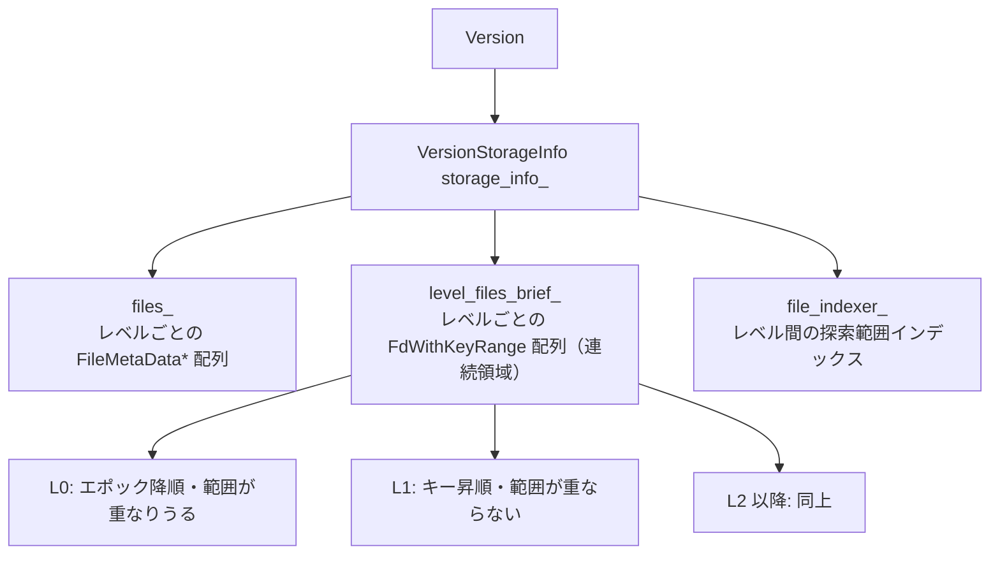
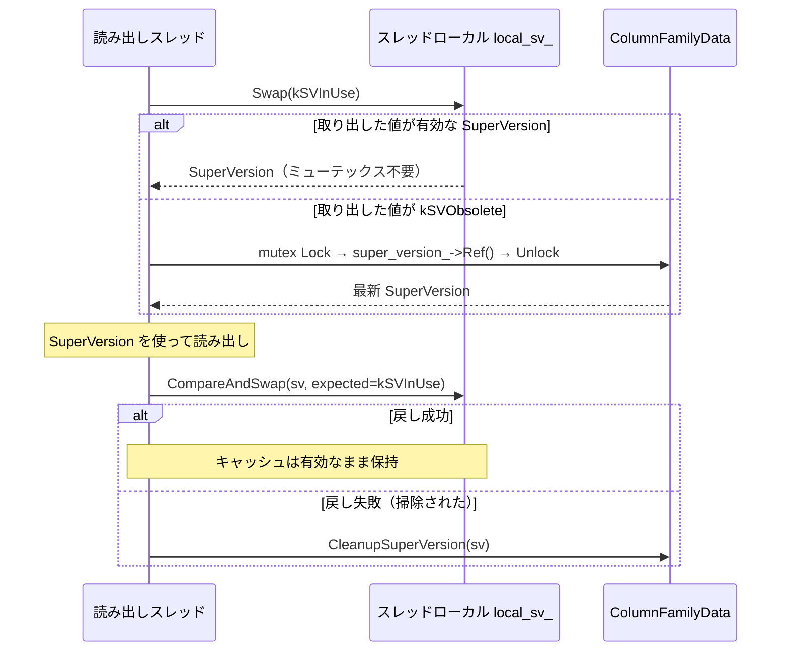

# 第24章 Version と SuperVersion

> **本章で読むソース**
> - [`db/version_set.h`](https://github.com/facebook/rocksdb/blob/v11.1.1/db/version_set.h)
> - [`db/version_set.cc`](https://github.com/facebook/rocksdb/blob/v11.1.1/db/version_set.cc)
> - [`db/file_indexer.h`](https://github.com/facebook/rocksdb/blob/v11.1.1/db/file_indexer.h)
> - [`db/file_indexer.cc`](https://github.com/facebook/rocksdb/blob/v11.1.1/db/file_indexer.cc)
> - [`db/version_edit.h`](https://github.com/facebook/rocksdb/blob/v11.1.1/db/version_edit.h)
> - [`db/column_family.h`](https://github.com/facebook/rocksdb/blob/v11.1.1/db/column_family.h)
> - [`db/column_family.cc`](https://github.com/facebook/rocksdb/blob/v11.1.1/db/column_family.cc)
> - [`db/db_impl/db_impl.cc`](https://github.com/facebook/rocksdb/blob/v11.1.1/db/db_impl/db_impl.cc)

## この章の狙い

第23章で追った `Get` の制御フローは、あるカラムファミリーがその時点で持つ SST 集合を `Version` から受け取り、`FilePicker` でファイルを選んで読んでいた。
本章はその土台にあるデータ構造に集中する。
`Version` と `VersionStorageInfo` がレベルごとの SST 集合をどう保持するか、`FilePicker` がレベルを下りながらどの探索を1ファイルに絞るか、`FileIndexer` がレベル間でその探索範囲をどう伝播させるか、そして `SuperVersion` がスレッドローカルキャッシュでロックなしに最新像への参照を配るかを読む。

## 前提

- [第23章 Get](23-get.md)：本章のデータ構造を `Get` がどう駆動するかを先に押さえておくとよい。

## Version と VersionStorageInfo が持つレベル構造

`Version` はカラムファミリーがある一時点で見る SST の全体像である。
その像のうちレベルごとのファイル集合は、`Version` が内部に持つ `VersionStorageInfo storage_info_` に格納される。

[`db/version_set.h` L1151](https://github.com/facebook/rocksdb/blob/v11.1.1/db/version_set.h#L1151)

```cpp
  VersionStorageInfo storage_info_;
```

`VersionStorageInfo` が SST 集合を持つ実体は、レベルを添字とするベクタの配列 `files_` である。
各要素はそのレベルに属する `FileMetaData*` の配列で、コメントが不変条件を明記している。

[`db/version_set.h` L686-L690](https://github.com/facebook/rocksdb/blob/v11.1.1/db/version_set.h#L686-L690)

```cpp
  // List of files per level, files in each level are arranged
  // in increasing order of keys
  // In L0, files are ordered in decreasing epoch number, meaning
  // more recent updates are ordered first.
  std::vector<FileMetaData*>* files_;
```

ここに二つの不変条件がある。
L1 以降では各レベル内のファイルがキーの昇順に並び、かつ互いにキー範囲が重ならない。
L0 はそうではなく、ファイルが重複しうるため、キー順ではなくエポック番号の降順（新しいものが先頭）に並ぶ。
この差が探索方法を分ける。
L1 以降は範囲が重ならないので二分探索で候補を1ファイルに絞れるが、L0 は重なりうるので候補を1ファイルに絞れない。

各ファイルの所在を表す `FileMetaData` は、ファイル記述子と、そのファイルが収める最小内部キー・最大内部キーを持つ。
この二つのキーが、レベル内二分探索とレベル間の範囲伝播の両方で比較対象になる。

[`db/version_edit.h` L244-L247](https://github.com/facebook/rocksdb/blob/v11.1.1/db/version_edit.h#L244-L247)

```cpp
struct FileMetaData {
  FileDescriptor fd;
  InternalKey smallest;  // Smallest internal key served by table
  InternalKey largest;   // Largest internal key served by table
```

読み出しのたびに `files_` の `FileMetaData` を1個ずつ辿るとポインタ参照とキャッシュミスがかさむ。
そこで `VersionStorageInfo` は、探索に必要な最小限の情報だけを連続領域にまとめた `level_files_brief_` を別に持つ。

[`db/version_set.h` L679-L682](https://github.com/facebook/rocksdb/blob/v11.1.1/db/version_set.h#L679-L682)

```cpp
  // A short brief metadata of files per level
  autovector<ROCKSDB_NAMESPACE::LevelFilesBrief> level_files_brief_;
  FileIndexer file_indexer_;
  Arena arena_;  // Used to allocate space for file_levels_
```

`LevelFilesBrief` は1レベル分の `FdWithKeyRange` 配列であり、`FdWithKeyRange` はファイル記述子と最小キー・最大キーの `Slice`、そして元の `FileMetaData` へのポインタだけを持つ。

[`db/version_edit.h` L492-L518](https://github.com/facebook/rocksdb/blob/v11.1.1/db/version_edit.h#L492-L518)

```cpp
struct FdWithKeyRange {
  FileDescriptor fd;
  FileMetaData* file_metadata;  // Point to all metadata
  Slice smallest_key;           // slice that contain smallest key
  Slice largest_key;            // slice that contain largest key
  // ... (中略) ...
};

// Data structure to store an array of FdWithKeyRange in one level
// Actual data is guaranteed to be stored closely
struct LevelFilesBrief {
  size_t num_files;
  FdWithKeyRange* files;
  // ... (中略) ...
};
```

`LevelFilesBrief` のコメントは「Actual data is guaranteed to be stored closely」と述べる。
配列の実体は `arena_` から連続確保される。
キー範囲の比較で次々にファイルを当たる探索では、隣のファイルのキーがすでに同じキャッシュラインに載っている可能性が高くなり、メモリレイアウトの面でキャッシュミスを減らす狙いがある。



L0 の非重複性は事前に判定して記録される。
`GenerateLevel0NonOverlapping` は L0 ファイルを最小キーでソートし直し、隣接ファイルの範囲が一つでも重なれば `level0_non_overlapping_` を偽にする。

[`db/version_set.cc` L4491-L4515](https://github.com/facebook/rocksdb/blob/v11.1.1/db/version_set.cc#L4491-L4515)

```cpp
void VersionStorageInfo::GenerateLevel0NonOverlapping() {
  assert(!finalized_);
  level0_non_overlapping_ = true;
  // ... (中略) ...
  for (size_t i = 1; i < level0_sorted_file.size(); ++i) {
    FdWithKeyRange& f = level0_sorted_file[i];
    FdWithKeyRange& prev = level0_sorted_file[i - 1];
    if (internal_comparator_->Compare(prev.largest_key, f.smallest_key) >= 0) {
      level0_non_overlapping_ = false;
      break;
    }
  }
}
```

この `Version` がどう作られ、どの SST が属するかを決めるのは MANIFEST と `VersionEdit` の仕組みである。
その生成過程は[第34章 MANIFEST と VersionEdit](../part06-version/34-manifest-versionedit.md)で扱う。

## レベル探索：L0 は全件、L1 以降は二分探索

`Version::Get` はファイル選択を `FilePicker` に委ねる。
`FilePicker` は `level_files_brief_` と `file_indexer_` を受け取り、レベルを上から下へ辿りながら候補ファイルを順に返す。

[`db/version_set.cc` L2756-L2760](https://github.com/facebook/rocksdb/blob/v11.1.1/db/version_set.cc#L2756-L2760)

```cpp
  FilePicker fp(user_key, ikey, &storage_info_.level_files_brief_,
                storage_info_.num_non_empty_levels_,
                &storage_info_.file_indexer_, user_comparator(),
                internal_comparator());
  FdWithKeyRange* f = fp.GetNextFile();
```

レベルごとの探索開始位置を決めるのが `PrepareNextLevel` である。
L0 と L1 以降の不変条件の差は、ここで `start_index` の決め方として現れる。

[`db/version_set.cc` L300-L344](https://github.com/facebook/rocksdb/blob/v11.1.1/db/version_set.cc#L300-L344)

```cpp
      int32_t start_index;
      if (curr_level_ == 0) {
        // On Level-0, we read through all files to check for overlap.
        start_index = 0;
      } else {
        // On Level-n (n>=1), files are sorted. Binary search to find the
        // earliest file whose largest key >= ikey. Search left bound and
        // right bound are used to narrow the range.
        if (search_left_bound_ <= search_right_bound_) {
          if (search_right_bound_ == FileIndexer::kLevelMaxIndex) {
            search_right_bound_ =
                static_cast<int32_t>(curr_file_level_->num_files) - 1;
          }
          // ... (中略) ...
          start_index =
              FindFileInRange(*internal_comparator_, *curr_file_level_, ikey_,
                              static_cast<uint32_t>(search_left_bound_),
                              static_cast<uint32_t>(search_right_bound_) + 1);
```

L0 では `start_index = 0` とし、先頭から全ファイルを当たる。
L0 は範囲が重なりうるので、対象キーを含む候補が複数あり、しかもエポック降順に並んでいるため、先頭から順に読めば新しいものから古いものへと当たることになる。

L1 以降では `FindFileInRange` による二分探索で候補を1ファイルに絞る。
`FindFileInRange` は `std::lower_bound` で「最大キーが対象キー以上になる最初のファイル」を返す。
比較関数はファイルの最大キー `largest_key` と探索キーを内部キーで比べる。

[`db/version_set.cc` L103-L111](https://github.com/facebook/rocksdb/blob/v11.1.1/db/version_set.cc#L103-L111)

```cpp
int FindFileInRange(const InternalKeyComparator& icmp,
                    const LevelFilesBrief& file_level, const Slice& key,
                    uint32_t left, uint32_t right) {
  auto cmp = [&](const FdWithKeyRange& f, const Slice& k) -> bool {
    return icmp.InternalKeyComparator::Compare(f.largest_key, k) < 0;
  };
  const auto& b = file_level.files;
  return static_cast<int>(std::lower_bound(b + left, b + right, key, cmp) - b);
}
```

注目すべきは `FindFileInRange` の引数 `left` と `right` である。
二分探索はレベル全体ではなく、`search_left_bound_` から `search_right_bound_` までの区間に対して行われる。
この区間を、上のレベルでの比較結果から事前に狭めて渡すのが `FileIndexer` の役割である。

## FileIndexer：レベル間で探索範囲を伝播する

L1 以降を毎回レベル全体で二分探索すると、各レベルでファイル数に応じた比較が独立に走る。
`FileIndexer` はこの無駄を、上のレベルで済ませた比較結果を下のレベルの探索範囲に持ち越すことで省く。
ヘッダのコメントがその効果を見積もっている。
1ファイルは下のレベルの高々 N ファイルとしか重ならない（N は `max_bytes_for_level_multiplier`）ため、レベル L では N^L ではなく N 個程度のファイルだけを見ればよくなる。

[`db/file_indexer.h` L30-L42](https://github.com/facebook/rocksdb/blob/v11.1.1/db/file_indexer.h#L30-L42)

```cpp
// With some pre-calculated knowledge, each key comparison that has been done
// can serve as a hint to narrow down further searches: if a key compared to
// be smaller than a file's smallest or largest, that comparison can be used
// to find out the right bound of next binary search. Similarly, if a key
// compared to be larger than a file's smallest or largest, it can be utilized
// to find out the left bound of next binary search.
// With these hints: it can greatly reduce the range of binary search,
// especially for bottom levels, given that one file most likely overlaps with
// only N files from level below (where N is max_bytes_for_level_multiplier).
// So on level L, we will only look at ~N files instead of N^L files on the
// naive approach.
```

### 探索結果をヒントに変える3分岐

仕組みの起点は、あるレベルのファイル `f` に対して探索キーがどの位置にあるかという3通りの場合分けである。
`FilePicker::GetNextFile` は、探索キーをファイルの最小キーと比べ、最小キー以上なら最大キーとも比べる。

[`db/version_set.cc` L210-L223](https://github.com/facebook/rocksdb/blob/v11.1.1/db/version_set.cc#L210-L223)

```cpp
          int cmp_smallest = user_comparator_->CompareWithoutTimestamp(
              user_key_, ExtractUserKey(f->smallest_key));
          if (cmp_smallest >= 0) {
            cmp_largest = user_comparator_->CompareWithoutTimestamp(
                user_key_, ExtractUserKey(f->largest_key));
          }

          // Setup file search bound for the next level based on the
          // comparison results
          if (curr_level_ > 0) {
            file_indexer_->GetNextLevelIndex(
                curr_level_, curr_index_in_curr_level_, cmp_smallest,
                cmp_largest, &search_left_bound_, &search_right_bound_);
          }
```

この `cmp_smallest` と `cmp_largest` を `GetNextLevelIndex` に渡すと、次レベルの探索区間 `search_left_bound_` と `search_right_bound_` が返る。
`IndexUnit` のコメントが3通りの場合分けと、それぞれが下のレベルのどちら側の境界を与えるかを説明している。

[`db/file_indexer.h` L72-L100](https://github.com/facebook/rocksdb/blob/v11.1.1/db/file_indexer.h#L72-L100)

```cpp
    // During file search, a key is compared against smallest and largest
    // from a FileMetaData. It can have 3 possible outcomes:
    // (1) key is smaller than smallest, implying it is also smaller than
    //     larger. Precalculated index based on "smallest < smallest" can
    //     be used to provide right bound.
    // (2) key is in between smallest and largest.
    //     Precalculated index based on "smallest > greatest" can be used to
    //     provide left bound.
    //     Precalculated index based on "largest < smallest" can be used to
    //     provide right bound.
    // (3) key is larger than largest, implying it is also larger than smallest.
    //     Precalculated index based on "largest > largest" can be used to
    //     provide left bound.
```

キーがファイルの最小キーより小さければ、そのファイルより大きいキーは下のレベルでも存在しえないため右境界が決まる。
キーが最小と最大の間にあれば、左右両方の境界が決まる。
キーが最大キーより大きければ、左境界が決まる。
このように、上のレベルで1回行った比較が、下のレベルの探索を打ち切る境界として再利用される。

`GetNextLevelIndex` 本体は、`cmp_smallest` と `cmp_largest` の符号で分岐し、事前計算した4つの境界（`smallest_lb`、`largest_lb`、`smallest_rb`、`largest_rb`）から左右の境界を選んで返す。

[`db/file_indexer.cc` L51-L68](https://github.com/facebook/rocksdb/blob/v11.1.1/db/file_indexer.cc#L51-L68)

```cpp
  if (cmp_smallest < 0) {
    *left_bound = (level > 0 && file_index > 0)
                      ? index_units[file_index - 1].largest_lb
                      : 0;
    *right_bound = index.smallest_rb;
  } else if (cmp_smallest == 0) {
    *left_bound = index.smallest_lb;
    *right_bound = index.smallest_rb;
  } else if (cmp_largest < 0) {
    *left_bound = index.smallest_lb;
    *right_bound = index.largest_rb;
  } else if (cmp_largest == 0) {
    *left_bound = index.largest_lb;
    *right_bound = index.largest_rb;
  } else {
    *left_bound = index.largest_lb;
    *right_bound = level_rb_[level + 1];
  }
```

### 境界はいつ計算されるか

これらの境界は読み出し時ではなく、`Version` を組み立てる時点で一度だけ計算される。
`VersionStorageInfo` は `GenerateFileIndexer` から `FileIndexer::UpdateIndex` を呼ぶ。

[`db/version_set.h` L662-L664](https://github.com/facebook/rocksdb/blob/v11.1.1/db/version_set.h#L662-L664)

```cpp
  void GenerateFileIndexer() {
    file_indexer_.UpdateIndex(&arena_, num_non_empty_levels_, files_);
  }
```

`UpdateIndex` はレベル L1 から下へ各レベルについて、上のレベルの各ファイルと下のレベルのファイル列を突き合わせ、4種類の境界を `CalculateLB` と `CalculateRB` で埋める。

[`db/file_indexer.cc` L96-L137](https://github.com/facebook/rocksdb/blob/v11.1.1/db/file_indexer.cc#L96-L137)

```cpp
  // L1 - Ln-1
  for (size_t level = 1; level < num_levels_ - 1; ++level) {
    const auto& upper_files = files[level];
    const int32_t upper_size = static_cast<int32_t>(upper_files.size());
    const auto& lower_files = files[level + 1];
    // ... (中略) ...
    CalculateLB(
        upper_files, lower_files, &index_level,
        [this](const FileMetaData* a, const FileMetaData* b) -> int {
          return ucmp_->CompareWithoutTimestamp(a->smallest.user_key(),
                                                b->largest.user_key());
        },
        [](IndexUnit* index, int32_t f_idx) { index->smallest_lb = f_idx; });
    // ... (中略：largest_lb, smallest_rb, largest_rb も同様に計算) ...
  }
```

`CalculateLB` は上のレベルと下のレベルのファイル列を、それぞれ添字を進めながら一度だけ走査する。
両方ソート済みであることを使い、二重ループではなくマージ走査で全ファイルの境界を埋める。

[`db/file_indexer.cc` L154-L177](https://github.com/facebook/rocksdb/blob/v11.1.1/db/file_indexer.cc#L154-L177)

```cpp
  while (upper_idx < upper_size && lower_idx < lower_size) {
    int cmp = cmp_op(upper_files[upper_idx], lower_files[lower_idx]);

    if (cmp == 0) {
      set_index(&index[upper_idx], lower_idx);
      ++upper_idx;
    } else if (cmp > 0) {
      // Lower level's file (largest) is smaller, a key won't hit in that
      // file. Move to next lower file
      ++lower_idx;
    } else {
      // Lower level's file becomes larger, update the index, and
      // move to the next upper file
      set_index(&index[upper_idx], lower_idx);
      ++upper_idx;
    }
  }
```

`FileIndexer` が効くのは2つ以上のレベルがあるときである。
`FilePicker::GetNextFile` は、ファイルが全部 L0 にあり、かつ L0 ファイルが3つ以下のときはキー範囲の絞り込み自体を省く。

[`db/version_set.cc` L201](https://github.com/facebook/rocksdb/blob/v11.1.1/db/version_set.cc#L201)

```cpp
        if (num_levels_ > 1 || curr_file_level_->num_files > 3) {
```

ファイルがごく少数のときは、範囲比較のコストよりファイルを直接当たるほうが安いと判断している。

## SuperVersion：読み出しが参照する一貫した像

`Version` はレベルごとの SST 集合を表すが、読み出しが必要とする像はそれだけではない。
書き込み中の MemTable、フラッシュ待ちの Immutable MemTable、そして SST 集合（`Version`）の三つを、同一時点で整合した一組として参照する必要がある。
これを束ねるのが `SuperVersion` である。

[`db/column_family.h` L206-L217](https://github.com/facebook/rocksdb/blob/v11.1.1/db/column_family.h#L206-L217)

```cpp
struct SuperVersion {
  // Accessing members of this class is not thread-safe and requires external
  // synchronization (ie db mutex held or on write thread).
  ColumnFamilyData* cfd;
  ReadOnlyMemTable* mem;
  MemTableListVersion* imm;
  Version* current;
  // TODO: do we really need this in addition to what's in current Version?
  MutableCFOptions mutable_cf_options;
  // Version number of the current SuperVersion
  uint64_t version_number;
```

`SuperVersion` は参照カウント `refs` を持ち、`Ref` で増やし `Unref` で減らす。
`Unref` は減算前の値を返し、それが1だったとき（最後の参照を手放したとき）に真を返す。

[`db/column_family.cc` L511-L521](https://github.com/facebook/rocksdb/blob/v11.1.1/db/column_family.cc#L511-L521)

```cpp
SuperVersion* SuperVersion::Ref() {
  refs.fetch_add(1, std::memory_order_relaxed);
  return this;
}

bool SuperVersion::Unref() {
  // fetch_sub returns the previous value of ref
  uint32_t previous_refs = refs.fetch_sub(1);
  assert(previous_refs > 0);
  return previous_refs == 1;
}
```

### スレッドローカルキャッシュでミューテックスを避ける

読み出しは現在の `SuperVersion` への参照を取る必要がある。
カラムファミリーの最新 `SuperVersion` は `super_version_` メンバが指すが、これを直接参照するには DB ミューテックスが要る。
読み出しのたびにミューテックスを取ると、並行読み出しがそこで直列化してしまう。

そこで `GetThreadLocalSuperVersion` は、スレッドローカルストレージにキャッシュした `SuperVersion` を使う。
冒頭のコメントが機構を要約している。
`SuperVersion` が前回の使用から変わっていなければミューテックスを取らずに済ませ、新しい `SuperVersion` が入ったときだけ背景スレッドがキャッシュを掃除する。

[`db/column_family.cc` L1366-L1394](https://github.com/facebook/rocksdb/blob/v11.1.1/db/column_family.cc#L1366-L1394)

```cpp
SuperVersion* ColumnFamilyData::GetThreadLocalSuperVersion(DBImpl* db) {
  // The SuperVersion is cached in thread local storage to avoid acquiring
  // mutex when SuperVersion does not change since the last use. When a new
  // SuperVersion is installed, the compaction or flush thread cleans up
  // cached SuperVersion in all existing thread local storage. To avoid
  // acquiring mutex for this operation, we use atomic Swap() on the thread
  // local pointer to guarantee exclusive access.
  // ... (中略) ...
  void* ptr = local_sv_->Swap(SuperVersion::kSVInUse);
  // ... (中略) ...
  SuperVersion* sv = static_cast<SuperVersion*>(ptr);
  if (sv == SuperVersion::kSVObsolete) {
    RecordTick(ioptions_.stats, NUMBER_SUPERVERSION_ACQUIRES);
    db->mutex()->Lock();
    sv = super_version_->Ref();
    db->mutex()->Unlock();
  }
  assert(sv != nullptr);
  return sv;
}
```

要は、スレッドローカルポインタへのアトミックな `Swap` で `kSVInUse` という番兵を置き、もとの値を取り出す。
取り出した値が有効な `SuperVersion` なら、その所有権をこのスレッドが一時的に握ったことになり、ミューテックスは一切不要である。
取り出した値が `kSVObsolete`（背景スレッドが掃除済みの印）だったときに限り、ミューテックスを取って `super_version_` から新しい参照を得る。
`kSVInUse` を番兵に使う理由は、その値が `SuperVersion` のアドレスと衝突しないからである。

[`db/column_family.h` L260-L267](https://github.com/facebook/rocksdb/blob/v11.1.1/db/column_family.h#L260-L267)

```cpp
  // The value of dummy is not actually used. kSVInUse takes its address as a
  // mark in the thread local storage to indicate the SuperVersion is in use
  // by thread. This way, the value of kSVInUse is guaranteed to have no
  // conflict with SuperVersion object address and portable on different
  // platform.
  static int dummy;
  static void* const kSVInUse;
  static void* const kSVObsolete;
```

使い終わった `SuperVersion` はスレッドローカルへ戻す。
`ReturnThreadLocalSuperVersion` は、置いた番兵 `kSVInUse` がまだそこにあることを `CompareAndSwap` で確認しながら戻す。
戻せれば、その間に掃除（`Scrape`）が走っておらず、キャッシュはまだ有効だったとわかる。

[`db/column_family.cc` L1396-L1412](https://github.com/facebook/rocksdb/blob/v11.1.1/db/column_family.cc#L1396-L1412)

```cpp
bool ColumnFamilyData::ReturnThreadLocalSuperVersion(SuperVersion* sv) {
  assert(sv != nullptr);
  // Put the SuperVersion back
  void* expected = SuperVersion::kSVInUse;
  if (local_sv_->CompareAndSwap(static_cast<void*>(sv), expected)) {
    // When we see kSVInUse in the ThreadLocal, we are sure ThreadLocal
    // storage has not been altered and no Scrape has happened. The
    // SuperVersion is still current.
    return true;
  } else {
    // ThreadLocal scrape happened in the process of this GetImpl call (after
    // thread local Swap() at the beginning and before CompareAndSwap()).
    // This means the SuperVersion it holds is obsolete.
    assert(expected == SuperVersion::kSVObsolete);
  }
  return false;
}
```

呼び出し側が参照を確実に握りたい場面では、`GetReferencedSuperVersion` を使う。
これはスレッドローカルから取った `SuperVersion` に `Ref` を1つ足してから戻し、戻しに失敗した（掃除されていた）ときだけ、スレッドローカル取得時の参照を相殺する `Unref` を行う。
結果として、呼び出し側には参照を1つ握った `SuperVersion` が安全に渡る。

[`db/column_family.cc` L1353-L1364](https://github.com/facebook/rocksdb/blob/v11.1.1/db/column_family.cc#L1353-L1364)

```cpp
SuperVersion* ColumnFamilyData::GetReferencedSuperVersion(DBImpl* db) {
  SuperVersion* sv = GetThreadLocalSuperVersion(db);
  sv->Ref();
  if (!ReturnThreadLocalSuperVersion(sv)) {
    // This Unref() corresponds to the Ref() in GetThreadLocalSuperVersion()
    // when the thread-local pointer was populated. So, the Ref() earlier in
    // this function still prevents the returned SuperVersion* from being
    // deleted out from under the caller.
    sv->Unref();
  }
  return sv;
}
```



### 差し替えと掃除

新しい像が必要になると（フラッシュやコンパクションの完了時など）、`InstallSuperVersion` が新しい `SuperVersion` を作って `super_version_` を差し替える。
この関数は DB ミューテックスを保持して呼ばれる。
古い `SuperVersion` を `Unref` する前に `ResetThreadLocalSuperVersions` を呼び、全スレッドのスレッドローカルキャッシュを掃除する点が重要である。

[`db/column_family.cc` L1442-L1466](https://github.com/facebook/rocksdb/blob/v11.1.1/db/column_family.cc#L1442-L1466)

```cpp
  if (old_superversion != nullptr) {
    // Reset SuperVersions cached in thread local storage.
    // This should be done before old_superversion->Unref(). That's to ensure
    // that local_sv_ never holds the last reference to SuperVersion, since
    // it has no means to safely do SuperVersion cleanup.
    ResetThreadLocalSuperVersions();
    // ... (中略) ...
    if (old_superversion->Unref()) {
      old_superversion->Cleanup();
      sv_context->superversions_to_free.push_back(old_superversion);
    }
  }
  ++super_version_number_;
  super_version_->version_number = super_version_number_;
```

`ResetThreadLocalSuperVersions` は `local_sv_->Scrape` で全スレッドのキャッシュ値を回収し、各スロットに `kSVObsolete` を置く。
これが、読み出し側が次に `Swap` したとき `kSVObsolete` を見て新しい参照を取り直す合図になる。
回収した `SuperVersion` はここで `Unref` するが、コメントが述べるとおり、スレッドローカルが最後の参照を持つことは決してない。
掃除を `old_superversion->Unref()` より前に行うことで、`super_version_` 側の参照が残っているうちに掃除を終えるからである。

[`db/column_family.cc` L1469-L1483](https://github.com/facebook/rocksdb/blob/v11.1.1/db/column_family.cc#L1469-L1483)

```cpp
void ColumnFamilyData::ResetThreadLocalSuperVersions() {
  autovector<void*> sv_ptrs;
  local_sv_->Scrape(&sv_ptrs, SuperVersion::kSVObsolete);
  for (auto ptr : sv_ptrs) {
    assert(ptr);
    if (ptr == SuperVersion::kSVInUse) {
      continue;
    }
    auto sv = static_cast<SuperVersion*>(ptr);
    bool was_last_ref __attribute__((__unused__));
    was_last_ref = sv->Unref();
    // sv couldn't have been the last reference because
    // ResetThreadLocalSuperVersions() is called before
    // unref'ing super_version_.
    assert(!was_last_ref);
  }
```

読み出しが参照を手放すときは `ReturnAndCleanupSuperVersion` を通る。
スレッドローカルへ戻せれば（まだ最新なら）何もせず、戻せなければ `CleanupSuperVersion` で参照を減らす。

[`db/db_impl/db_impl.cc` L4874-L4879](https://github.com/facebook/rocksdb/blob/v11.1.1/db/db_impl/db_impl.cc#L4874-L4879)

```cpp
void DBImpl::ReturnAndCleanupSuperVersion(ColumnFamilyData* cfd,
                                          SuperVersion* sv) {
  if (!cfd->ReturnThreadLocalSuperVersion(sv)) {
    CleanupSuperVersion(sv);
  }
}
```

`CleanupSuperVersion` は `Unref` の戻り値で最後の参照かどうかを判定し、最後なら DB ミューテックスを取って `Cleanup` を呼ぶ。
`Cleanup` は `SuperVersion` が握っていた MemTable、Immutable MemTable、`Version` の参照を順に手放す。

[`db/db_impl/db_impl.cc` L4854-L4872](https://github.com/facebook/rocksdb/blob/v11.1.1/db/db_impl/db_impl.cc#L4854-L4872)

```cpp
void DBImpl::CleanupSuperVersion(SuperVersion* sv) {
  // Release SuperVersion
  if (sv->Unref()) {
    bool defer_purge = immutable_db_options().avoid_unnecessary_blocking_io;
    {
      InstrumentedMutexLock l(&mutex_);
      sv->Cleanup();
      // ... (中略) ...
    }
    if (!defer_purge) {
      delete sv;
    }
    RecordTick(stats_, NUMBER_SUPERVERSION_CLEANUPS);
  }
  RecordTick(stats_, NUMBER_SUPERVERSION_RELEASES);
}
```

この設計の速さは、参照取得の通常経路がアトミックな `Swap` と `CompareAndSwap` だけで完結し、DB ミューテックスを経由しない点にある。
読み出しが大半を占める典型的なワークロードでは、`SuperVersion` の差し替えは稀にしか起きない。
そのため大多数の読み出しはロック競合なしに最新像への参照を得られ、差し替えが起きたときだけ掃除（`Scrape`）と参照取り直しのコストを払う。

## まとめ

- `Version` は `VersionStorageInfo` を通じてレベルごとの SST 集合を持つ。L1 以降は各レベル内でキー範囲が重ならずソート済みという不変条件があり、L0 だけは範囲が重なりうるためエポック降順に並ぶ。
- `Version::Get` は `FilePicker` にファイル選択を委ね、L0 は全件を新しい順に当たり、L1 以降は `FindFileInRange` の二分探索で候補を1ファイルに絞る。
- 二分探索の実体は `level_files_brief_` という連続領域上で行われ、キャッシュミスを減らす狙いがある。
- `FileIndexer` は `Version` 構築時に各レベルの境界を事前計算し、上のレベルの比較結果を下のレベルの探索区間に持ち越す。これによりレベルごとにゼロから二分探索し直す無駄を省き、レベル L で見るファイル数を N^L から N 程度に抑える。
- `SuperVersion` は MemTable、Immutable MemTable、`Version` を同一時点の一組として束ね、参照カウントで寿命を管理する。
- 読み出しはスレッドローカルにキャッシュした `SuperVersion` をアトミック操作だけで取得し、`SuperVersion` が変わらない限り DB ミューテックスを避ける。差し替え時は `Scrape` でキャッシュに `kSVObsolete` を置き、次の取得で参照を取り直させる。

## 関連する章

- [第23章 Get](23-get.md)：本章のデータ構造を駆動する制御フロー。
- [第25章 Table Cache](25-table-cache.md)：選んだ SST を実際に開いて読む層。
- [第34章 MANIFEST と VersionEdit](../part06-version/34-manifest-versionedit.md)：`Version` がどう生成され差し替わるか。
- [第35章 Column Family](../part06-version/35-column-family.md)：`ColumnFamilyData` と `SuperVersion` の所有関係。
