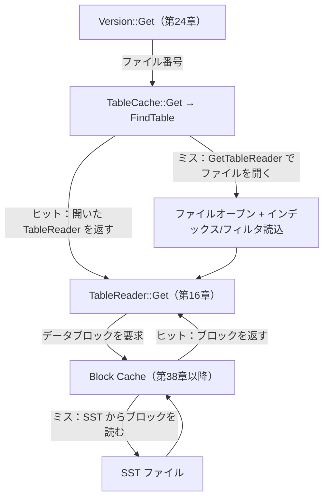

# 第25章 TableCache

> **本章で読むソース**
>
> - [`db/table_cache.h`](https://github.com/facebook/rocksdb/blob/v11.1.1/db/table_cache.h)
> - [`db/table_cache.cc`](https://github.com/facebook/rocksdb/blob/v11.1.1/db/table_cache.cc)
> - [`include/rocksdb/options.h`](https://github.com/facebook/rocksdb/blob/v11.1.1/include/rocksdb/options.h)
> - [`db/version_set.cc`](https://github.com/facebook/rocksdb/blob/v11.1.1/db/version_set.cc)

## この章の狙い

SST ファイルから値を読むには、まずファイルを開き、そのインデックスとフィルタをメモリに載せた `TableReader` を構築しなければならない。
探索のたびにこれをやり直すと、I/O とメモリ確保の繰り返しが読み取りの支配的なコストになる。
本章では、開いた `TableReader` をファイル番号で引けるようにキャッシュする `TableCache` を読み、再オープンを避ける機構と、`max_open_files` による上限管理を理解する。

## 前提

- [第24章 Version と SuperVersion](24-version-superversion.md)：`Version::Get` が探索対象の SST を選び、`TableCache::Get` を呼ぶ。
- [第16章 BlockBasedTable の Reader](../part03-sst/16-block-based-table-reader.md)：`TableCache` が橋渡しする先の `TableReader::Get` の中身。

## TableCache が解く問題

`TableCache` の役割は、ヘッダの先頭コメントに簡潔に書かれている。

[`db/table_cache.h` L38-L45](https://github.com/facebook/rocksdb/blob/v11.1.1/db/table_cache.h#L38-L45)

```cpp
// Manages caching for TableReader objects for a column family. The actual
// cache is allocated separately and passed to the constructor. TableCache
// wraps around the underlying SST file readers by providing Get(),
// MultiGet() and NewIterator() methods that hide the instantiation,
// caching and access to the TableReader. The main purpose of this is
// performance - by caching the TableReader, it avoids unnecessary file opens
// and object allocation and instantiation. One exception is compaction, where
// a new TableReader may be instantiated - see NewIterator() comments
```

キャッシュの主目的は性能であり、`TableReader` をキャッシュすることで不要なファイルオープンとオブジェクト確保を避ける、と述べている。
ここで `TableReader` はファイルを開いた状態のオブジェクトであり、SST のインデックスブロックやフィルタブロックを保持している。
これを開き直す処理は、ファイルのオープンに加えてインデックスとフィルタの読み込みを伴うため、安くない。
同じ SST は探索のたびに繰り返し参照されるので、開いた状態を使い回せれば、二度目以降の探索はファイルを開く I/O を省ける。

キャッシュのキーは SST のファイル番号である。
ファイル番号は `uint64_t` であり、その生バイト列をそのままキャッシュキーの `Slice` にしている。

[`db/table_cache.cc` L52-L55](https://github.com/facebook/rocksdb/blob/v11.1.1/db/table_cache.cc#L52-L55)

```cpp
static Slice GetSliceForFileNumber(const uint64_t* file_number) {
  return Slice(reinterpret_cast<const char*>(file_number),
               sizeof(*file_number));
}
```

実体の保管庫は `TableCache` 自身ではなく、コンストラクタに渡される `Cache`（既定では LRU）である。
`TableCache` はその `Cache` を `TableReader` 専用に型付けしたインターフェースとして保持する。

[`db/table_cache.h` L60-L68](https://github.com/facebook/rocksdb/blob/v11.1.1/db/table_cache.h#L60-L68)

```cpp
  // Cache interface for table cache
  using CacheInterface =
      BasicTypedCacheInterface<TableReader, CacheEntryRole::kMisc>;
  using TypedHandle = CacheInterface::TypedHandle;

  // Cache interface for row cache
  using RowCacheInterface =
      BasicTypedCacheInterface<std::string, CacheEntryRole::kMisc>;
  using RowHandle = RowCacheInterface::TypedHandle;
```

キャッシュエントリ一つが値を一つ持ち、その値が `TableReader*` である。
`TypedHandle*` は、そのエントリを指す `Cache::Handle` を型付けしたものである。
ハンドルを保持しているあいだ、対応するエントリは退避されない。
このハンドルの取得と解放が、本章で繰り返し現れる参照管理の単位になる。

## FindTable：キャッシュにあれば使い、なければ開いて挿入する

`TableReader` を引く入口は `FindTable` である。
シグネチャはヘッダにあり、返し方の契約もここに書かれている。

[`db/table_cache.h` L190-L200](https://github.com/facebook/rocksdb/blob/v11.1.1/db/table_cache.h#L190-L200)

```cpp
  Status FindTable(const ReadOptions& ro, const FileOptions& toptions,
                   const InternalKeyComparator& internal_comparator,
                   const FileMetaData& file_meta, TypedHandle**,
                   const MutableCFOptions& mutable_cf_options,
                   TableReader** table_reader, const bool no_io = false,
                   HistogramImpl* file_read_hist = nullptr,
                   bool skip_filters = false, int level = -1,
                   bool prefetch_index_and_filter_in_cache = true,
                   size_t max_file_size_for_l0_meta_pin = 0,
                   Temperature file_temperature = Temperature::kUnknown,
                   bool pin_table_handle = false);
```

成功すると `*table_reader` がキャッシュ所有の `TableReader` を指し、`*handle` がそのキャッシュハンドルを指す。
呼び出し側はハンドルを `cache_.Release()` で解放する責任を負う（後述のピン留めの場合を除く）。
実装の本体を、キャッシュを引く前半と、ミス時に開いて挿入する後半に分けて読む。

前半はキャッシュ参照である。
ファイル番号からキーを作り、`cache_.Lookup(key)` を呼ぶ。

[`db/table_cache.cc` L198-L210](https://github.com/facebook/rocksdb/blob/v11.1.1/db/table_cache.cc#L198-L210)

```cpp
  uint64_t number = file_meta.fd.GetNumber();
  // NOTE: sharing same Cache with BlobFileCache
  Slice key = GetSliceForFileNumber(&number);
  *handle = cache_.Lookup(key);
  TEST_SYNC_POINT_CALLBACK("TableCache::FindTable:0",
                           const_cast<bool*>(&no_io));

  Status s = Status::OK();
  if (*handle == nullptr) {
    if (no_io) {
      s = Status::Incomplete("Table not found in table_cache, no_io is set");
      return s;
    }
```

ヒットすればハンドルが返り、後半をすべて飛ばして末尾に進む。
ミスのとき、`no_io` が指定されていれば I/O を起こさず `Status::Incomplete` を返して終える。
これは `ReadOptions::read_tier` が `kBlockCacheTier` のとき、つまりディスクへ行かずキャッシュ内だけで答えたいときの経路である。

ミスかつ I/O が許されるときは、ファイルを開いて挿入する。
ここでロックを取り、ロックの下でもう一度 `Lookup` する。

[`db/table_cache.cc` L211-L243](https://github.com/facebook/rocksdb/blob/v11.1.1/db/table_cache.cc#L211-L243)

```cpp
    MutexLock load_lock(&loader_mutex_.Get(key));

    // Check if another thread has already pinned the table reader
    pinned_reader = file_meta.fd.pinned_reader.Get();
    if (pinned_reader != nullptr) {
      *handle = nullptr;
      *out_table_reader = pinned_reader;
      return s;
    }

    // We check the cache again under loading mutex
    *handle = cache_.Lookup(key);
    if (*handle == nullptr) {
      std::unique_ptr<TableReader> table_reader;
      s = GetTableReader(ro, file_options, internal_comparator, file_meta,
                         false /* sequential mode */, file_read_hist,
                         &table_reader, mutable_cf_options, skip_filters, level,
                         prefetch_index_and_filter_in_cache,
                         max_file_size_for_l0_meta_pin, file_temperature);
      if (!s.ok()) {
        assert(table_reader == nullptr);
        RecordTick(ioptions_.stats, NO_FILE_ERRORS);
        // We do not cache error results so that if the error is transient,
        // or somebody repairs the file, we recover automatically.
        IGNORE_STATUS_IF_ERROR(s);
      } else {
        s = cache_.Insert(key, table_reader.get(), 1, handle);
        if (s.ok()) {
          // Release ownership of table reader.
          (void)table_reader.release();
        }
      }
    }
```

ロックを取った直後の再 `Lookup` は、ロック待ちのあいだに別スレッドが同じファイルを開いて挿入し終えている場合に、二重オープンを避けるためのものである。
ロックは `loader_mutex_` というファイルキーで分割されたミューテックス群（`Striped`）から、キーに対応する一本を選んで取る。
全ファイルで一本の共有ロックを取るのではなく、キーごとに別々のロックを取るため、別々の SST を同時に開く処理は互いにブロックしない。
このロックがキーを限るので、同じ SST を同時に開こうとした複数スレッドのうち、ファイルを実際に開くのは一つだけになる。

開いた `TableReader` は `cache_.Insert(key, ..., 1, handle)` でキャッシュに登録し、所有権をキャッシュへ移す（`table_reader.release()`）。
第4引数の `1` は、このエントリがキャッシュ容量に対して占める重み（charge）である。
`TableCache` はエントリ一つを `1` と数える。
容量を「同時に開けるファイル数」として扱う設計であり、後述の `max_open_files` がこの容量に直接対応する。
オープンに失敗した場合はキャッシュに入れない。
一時的なエラーやファイル修復のあとに自動回復できるよう、エラー結果をキャッシュしない方針がコメントに明記されている。

後半を抜けると、`*out_table_reader` にキャッシュ内の値をセットする。

[`db/table_cache.cc` L245-L251](https://github.com/facebook/rocksdb/blob/v11.1.1/db/table_cache.cc#L245-L251)

```cpp
    if (s.ok()) {
      *out_table_reader = cache_.Value(*handle);
      if (pin_table_handle) {
        file_meta.fd.pinned_reader.Pin(*handle, *out_table_reader);
        *handle = nullptr;
      }
    }
```

`pin_table_handle` が立っているときは、ハンドルを `FileMetaData` 側にピン留めし、`*handle` を `nullptr` にして呼び出し側に解放させない。
ピン留めされた `TableReader` は、`FindTable` の冒頭でキャッシュ参照すら省いて直接返される。

[`db/table_cache.cc` L189-L196](https://github.com/facebook/rocksdb/blob/v11.1.1/db/table_cache.cc#L189-L196)

```cpp
  // Fast path: if table reader is already pinned, return it directly without a
  // cache lookup.
  auto pinned_reader = file_meta.fd.pinned_reader.Get();
  if (pinned_reader != nullptr) {
    *handle = nullptr;
    *out_table_reader = pinned_reader;
    return Status::OK();
  }
```

このピン留めは、キャッシュ容量が無限相当のとき（`max_open_files == -1`）に有効になる最適化である。
容量が無限なら `TableReader` がキャッシュから退避されることはないので、ハッシュ参照と参照カウント操作そのものを省いてよい。
有効になる条件は後段「max_open_files との対応」で扱う。

## GetTableReader：実際にファイルを開く

キャッシュミス時に呼ばれる `GetTableReader` が、ファイルを開いて `TableReader` を組み立てる本体である。
ファイル名を作り、ランダムアクセス用にファイルを開く。

[`db/table_cache.cc` L99-L113](https://github.com/facebook/rocksdb/blob/v11.1.1/db/table_cache.cc#L99-L113)

```cpp
  std::string fname = TableFileName(
      ioptions_.cf_paths, file_meta.fd.GetNumber(), file_meta.fd.GetPathId());
  std::unique_ptr<FSRandomAccessFile> file;
  FileOptions fopts = file_options;
  fopts.temperature = file_temperature;
  fopts.file_checksum = file_meta.file_checksum;
  fopts.file_checksum_func_name = file_meta.file_checksum_func_name;
  Status s = PrepareIOFromReadOptions(ro, ioptions_.clock, fopts.io_options);
  TEST_SYNC_POINT_CALLBACK("TableCache::GetTableReader:BeforeOpenFile",
                           const_cast<Status*>(&s));
  if (s.ok()) {
    s = ioptions_.fs->NewRandomAccessFile(fname, fopts, &file, nullptr);
  }
  if (s.ok()) {
    RecordTick(ioptions_.stats, NO_FILE_OPENS);
```

ファイルが開けたら、`NO_FILE_OPENS` 統計を加算する。
この統計は「実際にファイルを開いた回数」であり、キャッシュミスの実コストを観測する手がかりになる。

開けたファイルから `RandomAccessFileReader` を作り、`TableFactory::NewTableReader` に渡して `TableReader` を構築する。

[`db/table_cache.cc` L137-L163](https://github.com/facebook/rocksdb/blob/v11.1.1/db/table_cache.cc#L137-L163)

```cpp
    StopWatch sw(ioptions_.clock, ioptions_.stats, TABLE_OPEN_IO_MICROS);
    std::unique_ptr<RandomAccessFileReader> file_reader(
        new RandomAccessFileReader(std::move(file), fname, ioptions_.clock,
                                   io_tracer_, ioptions_.stats, SST_READ_MICROS,
                                   file_read_hist, ioptions_.rate_limiter.get(),
                                   ioptions_.listeners, file_temperature,
                                   level == ioptions_.num_levels - 1));
    UniqueId64x2 expected_unique_id;
    if (ioptions_.verify_sst_unique_id_in_manifest) {
      expected_unique_id = file_meta.unique_id;
    } else {
      expected_unique_id = kNullUniqueId64x2;  // null ID == no verification
    }
    s = mutable_cf_options.table_factory->NewTableReader(
        ro,
        TableReaderOptions(
            ioptions_, mutable_cf_options.prefix_extractor,
            mutable_cf_options.compression_manager.get(), file_options,
            internal_comparator,
            mutable_cf_options.block_protection_bytes_per_key, skip_filters,
            immortal_tables_, false /* force_direct_prefetch */, level,
            block_cache_tracer_, max_file_size_for_l0_meta_pin, db_session_id_,
            file_meta.fd.GetNumber(), expected_unique_id,
            file_meta.fd.largest_seqno, file_meta.tail_size,
            file_meta.user_defined_timestamps_persisted),
        std::move(file_reader), file_meta.fd.GetFileSize(), table_reader,
        prefetch_index_and_filter_in_cache);
```

`prefetch_index_and_filter_in_cache` が `true` のとき、`NewTableReader` の中でインデックスとフィルタを読み込んで Block Cache に載せる。
`Version::Get` 経由の探索は、この引数を `true` で渡す（次節で確認する）。
`TableReader` の構築でどのブロックを先読みし、何をオブジェクトに保持するかの詳細は第16章で扱う。
`TableCache` の関心は、この高価な構築を一度だけ行い、結果をファイル番号で引けるようにすることにある。

## TableCache::Get：Version::Get から TableReader::Get への橋渡し

点検索の経路では、`TableCache::Get` が探索対象の SST ごとに呼ばれる。
呼び出し元は第24章の `Version::Get` で、探索すべきファイルを順に選びながら `table_cache_->Get` を呼ぶ。

[`db/version_set.cc` L2776-L2782](https://github.com/facebook/rocksdb/blob/v11.1.1/db/version_set.cc#L2776-L2782)

```cpp
    *status = table_cache_->Get(
        read_options, *internal_comparator(), *f->file_metadata, ikey,
        &get_context, mutable_cf_options_,
        cfd_->internal_stats()->GetFileReadHist(fp.GetHitFileLevel()),
        IsFilterSkipped(static_cast<int>(fp.GetHitFileLevel()),
                        fp.IsHitFileLastInLevel()),
        fp.GetHitFileLevel(), max_file_size_for_l0_meta_pin_);
```

`TableCache::Get` の本体は、まず `FindTable` で `TableReader` を確保し、見つかったらその `TableReader::Get` に探索を委ねる。

[`db/table_cache.cc` L503-L539](https://github.com/facebook/rocksdb/blob/v11.1.1/db/table_cache.cc#L503-L539)

```cpp
  if (s.ok() && !done) {
    s = FindTable(options, file_options_, internal_comparator, file_meta,
                  &handle, mutable_cf_options, &t,
                  options.read_tier == kBlockCacheTier /* no_io */,
                  file_read_hist, skip_filters, level,
                  true /* prefetch_index_and_filter_in_cache */,
                  max_file_size_for_l0_meta_pin, file_meta.temperature,
                  should_pin_table_handles_);
    // ... (中略：range tombstone の処理) ...
    if (s.ok()) {
      get_context->SetReplayLog(row_cache_entry);  // nullptr if no cache.
      s = t->Get(options, k, get_context,
                 mutable_cf_options.prefix_extractor.get(), skip_filters);
      get_context->SetReplayLog(nullptr);
    } else if (options.read_tier == kBlockCacheTier && s.IsIncomplete()) {
      // Couldn't find table in cache and couldn't open it because of no_io.
      get_context->MarkKeyMayExist();
      done = true;
    }
  }
```

`FindTable` は `no_io = (read_tier == kBlockCacheTier)` で呼ばれる。
キャッシュ階層だけを読む指定のときは、SST がキャッシュに無ければ開かずに `Incomplete` を返し、`get_context->MarkKeyMayExist()` で「あるかもしれない」を記録して終える。
通常の探索では `FindTable` が `TableReader` を返し、結果の取り出しは `t->Get(...)`、つまり `TableReader::Get`（第16章）に委ねられる。

委ねた値の取り出しが終わったら、確保していたキャッシュハンドルを解放する。

[`db/table_cache.cc` L554-L558](https://github.com/facebook/rocksdb/blob/v11.1.1/db/table_cache.cc#L554-L558)

```cpp
  if (handle != nullptr) {
    cache_.Release(handle);
  }
  return s;
}
```

`handle` が非 `nullptr` のときだけ解放する点に注意したい。
ピン留め経路では `FindTable` が `*handle = nullptr` を返すため、ここでは解放しない。
ピン留めされたエントリの参照は `FileMetaData` 側が保持し、ファイルが不要になったときにまとめて解放される。
`Get` が確保するのはキャッシュへの一時的な参照（ハンドル）であり、`TableReader` 本体の寿命はキャッシュが管理する。

なお `NewIterator` も同じく `FindTable` でハンドルを確保するが、解放のタイミングが異なる。
イテレータは関数を抜けたあとも生き続けるため、ハンドルを即座に解放できない。
そこで `RegisterReleaseAsCleanup` でハンドルの解放をイテレータの後始末に登録し、イテレータが破棄されるときに解放させる。

[`db/table_cache.cc` L313-L316](https://github.com/facebook/rocksdb/blob/v11.1.1/db/table_cache.cc#L313-L316)

```cpp
    if (handle != nullptr) {
      cache_.RegisterReleaseAsCleanup(handle, *result);
      handle = nullptr;  // prevent from releasing below
    }
```

確保したハンドルは、その参照が必要なあいだだけ保持する。
点検索なら関数末尾で `Release`、イテレータなら寿命の終わりで `Release` と、参照が要らなくなる地点に合わせて解放する。

## max_open_files との対応：容量による上限管理

`TableCache` がエントリ一つを charge `1` と数えることは前述した。
その容量を決めるのが DB オプションの `max_open_files` である。

[`include/rocksdb/options.h` L766-L779](https://github.com/facebook/rocksdb/blob/v11.1.1/include/rocksdb/options.h#L766-L779)

```cpp
  // Number of open files that can be used by the DB.  You may need to
  // increase this if your database has a large working set. Value -1 means
  // files opened are always kept open. You can estimate number of files based
  // on target_file_size_base and target_file_size_multiplier for level-based
  // compaction. For universal-style compaction, you can usually set it to -1.
  //
  // A high value or -1 for this option can cause high memory usage.
  // See BlockBasedTableOptions::cache_usage_options to constrain
  // memory usage in case of block based table format.
  //
  // Default: -1
  //
  // Dynamically changeable through SetDBOptions() API.
  int max_open_files = -1;
```

`max_open_files` は DB が同時に開けるファイル数であり、値が大きいほど、または `-1` のときほどメモリ使用量が増える、と述べている。
このオプションが `TableCache` の容量へ変換される地点は `DBImpl` の初期化にある。

[`db/db_impl/db_impl.cc` L231-L243](https://github.com/facebook/rocksdb/blob/v11.1.1/db/db_impl/db_impl.cc#L231-L243)

```cpp
  // Reserve ten files or so for other uses and give the rest to TableCache.
  // Give a large number for setting of "infinite" open files.
  const int table_cache_size = (mutable_db_options_.max_open_files == -1)
                                   ? TableCache::kInfiniteCapacity
                                   : mutable_db_options_.max_open_files - 10;
  LRUCacheOptions co;
  co.capacity = table_cache_size;
  co.num_shard_bits = immutable_db_options_.table_cache_numshardbits;
  co.metadata_charge_policy = kDontChargeCacheMetadata;
  // ... (中略) ...
  table_cache_ = NewLRUCache(co);
```

`max_open_files` が `-1` でなければ、容量は `max_open_files - 10` になる（残り十枚ほどは WAL など他用途に予約する）。
エントリ一つが charge `1` なので、この容量はそのまま「キャッシュに保持できる `TableReader` の数の上限」になる。
LRU 方式の `Cache` は容量を超えると最も長く参照されていないエントリから退避する。
退避された SST は、次に探索されたときに `FindTable` のミス経路で開き直される。
つまり `max_open_files` は、開いたファイル数の上限を、キャッシュ容量という一つの数で機構的に制御している。

`max_open_files == -1` のときは容量を `kInfiniteCapacity` にする。

[`db/table_cache.h` L249-L267](https://github.com/facebook/rocksdb/blob/v11.1.1/db/table_cache.h#L249-L267)

```cpp
  // Capacity of the backing Cache that indicates infinite TableCache capacity.
  // For example when max_open_files is -1 we set the backing Cache to this.
  static const int kInfiniteCapacity = 0x400000;

  // The tables opened with this TableCache will be immortal, i.e., their
  // lifetime is as long as that of the DB.
  void SetTablesAreImmortal() {
    if (cache_.get()->GetCapacity() >= kInfiniteCapacity) {
      immortal_tables_ = true;
    }
  }

  // Re-evaluates should_pin_table_handles_ from the current cache capacity.
  // Must be called after the underlying cache capacity changes (e.g. via
  // SetDBOptions changing max_open_files).
  void UpdateShouldPinTableHandles() {
    should_pin_table_handles_ =
        cache_.get()->GetCapacity() >= kInfiniteCapacity;
  }
```

容量が `kInfiniteCapacity`（約 4M エントリ）以上なら、実質的に退避が起きない。
このとき `should_pin_table_handles_` が立ち、前述のピン留めが有効になる。
退避されないことが保証されるなら、ハンドルの参照カウント操作を省いて `TableReader` を直接持たせてよい、という判断である。
`max_open_files` を `SetDBOptions` で動的に変えると容量が変わるため、`UpdateShouldPinTableHandles` でこの判定を取り直す。

## TableCache と Block Cache の役割分担

`TableCache` と Block Cache は、どちらもキャッシュだが、対象とする粒度が異なる。
`TableCache` がキャッシュするのは「開いた SST ファイルと、そのメタ（`TableReader` が保持するインデックスとフィルタ）」である。
Block Cache がキャッシュするのは「SST から読み出したデータブロックの中身」である。
探索は両者を順に通る。



`TableCache` のヒットは「ファイルを開く I/O とインデックス/フィルタの読み込み」を省く。
Block Cache のヒットは「データブロックを読む I/O と展開」を省く。
`TableCache` がミスして `TableReader` を新しく構築するとき、その内部でインデックスとフィルタを Block Cache に載せる（`prefetch_index_and_filter_in_cache`）。
両者は別々の `Cache` インスタンスであり、容量も独立に設定する。
`TableCache` の容量は `max_open_files` で、Block Cache の容量は `BlockBasedTableOptions::block_cache` で決まる。
Block Cache の実装は第38章以降で扱う。

## まとめ

- `TableCache` は SST のファイル番号をキーに、開いた `TableReader`（インデックスとフィルタを保持）をキャッシュし、探索のたびの再オープンを避ける。
- `FindTable` はキャッシュにあればそれを返し、無ければ `GetTableReader` でファイルを開いて `Cache::Insert` で登録する。
  ロードはファイルキーで分割された `loader_mutex_` で直列化し、二重オープンを防ぐ。
- エントリ一つの charge は `1` であり、`Cache` の容量は `max_open_files - 10`（`-1` のときは `kInfiniteCapacity`）になる。
  容量超過時に LRU で退避することで、同時に開くファイル数の上限を機構的に管理する。
- `TableCache::Get` は `Version::Get` から呼ばれ、`FindTable` で `TableReader` を確保したうえで `TableReader::Get` に探索を委ねる橋渡しである。
- 確保したキャッシュハンドルは、点検索なら関数末尾で、イテレータなら寿命の終わりで解放する。
  `max_open_files == -1` のときはピン留めで参照管理そのものを省く。
- `TableCache` は「開いたファイルとそのメタ」を、Block Cache は「データブロックの中身」をキャッシュする。
  両者は粒度が異なり、容量も独立に設定する。

## 関連する章

- [第24章 Version と SuperVersion](24-version-superversion.md)：`TableCache::Get` の呼び出し元。
- [第16章 BlockBasedTable の Reader](../part03-sst/16-block-based-table-reader.md)：`TableCache` が橋渡しする `TableReader::Get` とインデックス/フィルタの中身。
- [第26章 イテレータ](26-iterators.md)：`TableCache::NewIterator` が返すイテレータと、ハンドルの後始末。
- [第39章 LRUCache](../part07-cache/39-lru-cache.md)：`TableCache` の保管庫となる `Cache` の実装。
