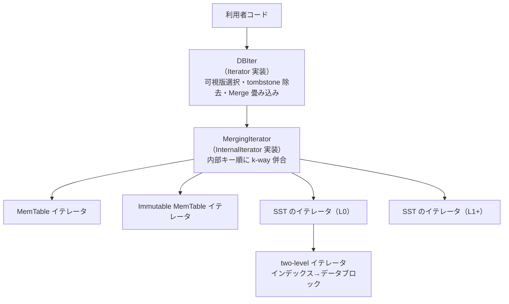

# 第26章 イテレータ階層

> **本章で読むソース**
>
> - [`include/rocksdb/iterator.h`](https://github.com/facebook/rocksdb/blob/v11.1.1/include/rocksdb/iterator.h)
> - [`include/rocksdb/iterator_base.h`](https://github.com/facebook/rocksdb/blob/v11.1.1/include/rocksdb/iterator_base.h)
> - [`table/internal_iterator.h`](https://github.com/facebook/rocksdb/blob/v11.1.1/table/internal_iterator.h)
> - [`db/db_iter.h`](https://github.com/facebook/rocksdb/blob/v11.1.1/db/db_iter.h)
> - [`db/db_iter.cc`](https://github.com/facebook/rocksdb/blob/v11.1.1/db/db_iter.cc)
> - [`table/merging_iterator.h`](https://github.com/facebook/rocksdb/blob/v11.1.1/table/merging_iterator.h)
> - [`table/merging_iterator.cc`](https://github.com/facebook/rocksdb/blob/v11.1.1/table/merging_iterator.cc)
> - [`table/two_level_iterator.h`](https://github.com/facebook/rocksdb/blob/v11.1.1/table/two_level_iterator.h)
> - [`db/arena_wrapped_db_iter.h`](https://github.com/facebook/rocksdb/blob/v11.1.1/db/arena_wrapped_db_iter.h)

## この章の狙い

RocksDB の範囲スキャンは、複数の MemTable と多数の SST を一本のソート列に見せかけて返す。
その見せかけを担うのが、互いに役割の異なる三層のイテレータである。
本章では、利用者が触る `Iterator` から、全ソースを内部キー順に併合する `MergingIterator`、各ソースを走査する `InternalIterator` までを順にたどり、可視版の選択とトゥームストーン（tombstone）の除去がどの層で行われるかを切り分ける。
最小ヒープによる k-way 併合と Arena 一括確保という二つの機構が、なぜ速さに効くのかも示す。

## 前提

- [第5章 内部キー](../part01-data-model/05-internal-key.md)：ユーザーキーとシーケンス番号と値型の三つ組、およびその比較順序。
- [第17章 インデックスブロック](../part03-sst/17-index-block.md)：SST 内のインデックスとデータブロックの構造。two-level イテレータの土台となる。
- [第24章 Version と SuperVersion](24-version-superversion.md)：スキャン対象となる MemTable 群と SST 群の集合。

## 三つのイテレータ層

RocksDB のイテレータは抽象度の異なる三層に分かれる。
利用者が受け取るのは公開インターフェース `Iterator` であり、その内部には二段の下位イテレータが隠れている。

最上層の `Iterator` は、利用者キーと利用者値だけを返す。
インターフェースは `IteratorBase` に定義され、`Seek`、`SeekToFirst`、`Next`、`Prev`、`Valid`、`key` がここにある。

[`include/rocksdb/iterator_base.h` L26-L59](https://github.com/facebook/rocksdb/blob/v11.1.1/include/rocksdb/iterator_base.h#L26-L59)

```cpp
  // An iterator is either positioned at a key/value pair, or
  // not valid.  This method returns true iff the iterator is valid.
  virtual bool Valid() const = 0;
  // Position at the first key in the source. ...
  virtual void SeekToFirst() = 0;
  // ...
  // Position at the first key in the source that at or past target.
  virtual void Seek(const Slice& target) = 0;
  // ...
  // Moves to the next entry in the source. ...
  virtual void Next() = 0;
```

中間層と最下層は `InternalIterator` という別系統のインターフェースで表される。
こちらが返すのは内部キーである。
`internal_iterator.h` の `InternalIteratorBase` は、`Iterator` と似た `Seek`、`Next`、`key`、`value` を持つが、`user_key()` を分離して持ち、`IsKeyPinned` や `PrepareValue` などスキャンの下回りに必要な操作を加えている。

[`table/internal_iterator.h` L101-L124](https://github.com/facebook/rocksdb/blob/v11.1.1/table/internal_iterator.h#L101-L124)

```cpp
  // Return the key for the current entry. ...
  // REQUIRES: Valid()
  virtual Slice key() const = 0;
  // ...
  // Return user key for the current entry.
  // REQUIRES: Valid()
  virtual Slice user_key() const { return ExtractUserKey(key()); }
  // Return the value for the current entry. ...
  virtual TValue value() const = 0;
```

`InternalIterator` は `InternalIteratorBase<Slice>` の別名である（[`table/internal_iterator.h` L217](https://github.com/facebook/rocksdb/blob/v11.1.1/table/internal_iterator.h#L217)）。

三層の役割は次のように分担される。

- **`DBIter`**（最上層、`Iterator` の実装）：内部キー列を利用者キーの視点へ変換する。可視版の選択、古い版とトゥームストーンの除去、Merge の畳み込み、前後方向の切り替えを担う。
- **`MergingIterator`**（中間層、`InternalIterator` の実装）：複数の子イテレータを内部キー順に併合し、単一のソート列に見せる。
- **各ソースの `InternalIterator`**（最下層）：MemTable のイテレータと、各 SST の two-level イテレータ。それぞれが一つのソートされた走査列を供給する。



下から上へ流れる過程で、内部キーは段階的に利用者キーへ姿を変える。
最下層は素の内部キー列を出し、中間層はそれを全ソースで併合し、最上層が可視性とトゥームストーンを解決して利用者キーだけを残す。

## MergingIterator：最小ヒープによる k-way 併合

範囲スキャンの対象は、複数の MemTable と多数の SST に分かれている。
各ソースは内部それぞれソート済みだが、ソースをまたぐと順序は揃わない。
`MergingIterator` は、これらの子イテレータをヒープに載せて、内部キー順に最小要素を一つずつ取り出す。

子イテレータは `children_` に保持され、前進時の併合には最小ヒープ `minHeap_`、後退時には最大ヒープ `maxHeap_` を使う。

[`table/merging_iterator.cc` L652-L663](https://github.com/facebook/rocksdb/blob/v11.1.1/table/merging_iterator.cc#L652-L663)

```cpp
  IteratorWrapper* current_;
  // If any of the children have non-ok status, this is one of them.
  Status status_;
  // Invariant: min heap property is maintained (parent is always <= child).
  MergerMinIterHeap minHeap_;

  // Max heap is used for reverse iteration, which is way less common than
  // forward. Lazily initialize it to save memory.
  std::unique_ptr<MergerMaxIterHeap> maxHeap_;
```

最大ヒープがコメントの通り遅延確保（lazy initialize）なのは、後退スキャンが前進より大幅に少ないためである。
`maxHeap_` は `unique_ptr` で、最初の後退まで実体を持たない（[`table/merging_iterator.cc` L1453-L1458](https://github.com/facebook/rocksdb/blob/v11.1.1/table/merging_iterator.cc#L1453-L1458)）。

### ヒープの順序付け

ヒープの大小は内部キーの比較で決まる。
最小ヒープ用の比較子 `MinHeapItemComparator` は、二つのヒープ要素がともに点キーのとき、`InternalKeyComparator` で内部キーを比較する。

[`table/merging_iterator.cc` L527-L541](https://github.com/facebook/rocksdb/blob/v11.1.1/table/merging_iterator.cc#L527-L541)

```cpp
    bool operator()(HeapItem* a, HeapItem* b) const {
      if (LIKELY(a->type == HeapItem::Type::ITERATOR)) {
        if (LIKELY(b->type == HeapItem::Type::ITERATOR)) {
          return comparator_->Compare(a->iter.key(), b->iter.key()) > 0;
        } else {
          return comparator_->Compare(a->iter.key(), b->tombstone_pik) > 0;
        }
      } else {
        // ... (中略：レンジトゥームストーンとの比較) ...
      }
    }
```

比較が `> 0` で真を返すのは、`BinaryHeap` が「比較子が真を返すほうを下げる」最大ヒープ実装だからである。
大小を反転させることで、`minHeap_` の頂点には常に内部キー最小の要素が来る。
最大ヒープ用の `MaxHeapItemComparator` は同じ比較を `< 0` で書き、頂点に最大の要素を置く（[`table/merging_iterator.cc` L552-L566](https://github.com/facebook/rocksdb/blob/v11.1.1/table/merging_iterator.cc#L552-L566)）。

`HeapItem::Type` には点キーを表す `ITERATOR` のほかにレンジトゥームストーンの始端と終端があり、比較子はその場合分けを含む。
本章では点キーの併合に焦点を当て、レンジトゥームストーンの扱いは[第36章 スナップショットと MVCC](../part06-version/36-snapshot-mvcc.md)に譲る。

### Seek と Next の流れ

`SeekToFirst` は、すべての子を先頭へ動かし、有効な子だけを最小ヒープへ積む。

[`table/merging_iterator.cc` L256-L276](https://github.com/facebook/rocksdb/blob/v11.1.1/table/merging_iterator.cc#L256-L276)

```cpp
  void SeekToFirst() override {
    ClearHeaps();
    status_ = Status::OK();
    for (auto& child : children_) {
      child.iter.SeekToFirst();
      AddToMinHeapOrCheckStatus(&child);
    }
    // ... (中略：レンジトゥームストーンの登録) ...
    FindNextVisibleKey();
    direction_ = kForward;
    current_ = CurrentForward();
  }
```

`AddToMinHeapOrCheckStatus` は、子が有効ならヒープへ積み、無効ならエラー状態だけを拾う（[`table/merging_iterator.cc` L1294-L1302](https://github.com/facebook/rocksdb/blob/v11.1.1/table/merging_iterator.cc#L1294-L1302)）。
最後の `current_ = CurrentForward()` で、`current_` はヒープ頂点の子（最小要素）を指す。

`Next` は、頂点の子を一つ進めてからヒープ性を回復する。

[`table/merging_iterator.cc` L348-L384](https://github.com/facebook/rocksdb/blob/v11.1.1/table/merging_iterator.cc#L348-L384)

```cpp
  void Next() override {
    assert(Valid());
    if (direction_ != kForward) {
      SwitchToForward();
    }
    assert(current_ == CurrentForward());
    current_->Next();
    if (current_->Valid()) {
      // current is still valid after the Next() call above.  Call
      // replace_top() to restore the heap property.  When the same child
      // iterator yields a sequence of keys, this is cheap.
      minHeap_.replace_top(minHeap_.top());
    } else {
      // current stopped being valid, remove it from the heap.
      considerStatus(current_->status());
      minHeap_.pop();
    }
    FindNextVisibleKey();
    current_ = CurrentForward();
  }
```

進めた子がまだ有効なら、ヒープから抜き差しせずに `replace_top` で頂点だけを再配置する。
コメントが述べる通り、同じ子が連続して最小キーを供給する間は、この再配置が安い。
子が尽きたときだけ `pop` でヒープから外す。

### k-way 併合がなぜ速いか

n 個のソースから内部キー順に全件取り出す素朴な方法は、毎回 n 個の先頭を線形に比べることだろう。
これは一件あたり O(n) の比較になる。

`MergingIterator` は最小ヒープを使い、一件あたりの比較を O(log n) に下げる。
頂点を取り出した子を一つ進め、`replace_top` でヒープ性を回復するだけで次の最小要素が頂点へ上がるからである。
ソース数が増えても比較回数が対数でしか伸びないため、L0 に多数の SST が積もった状況や、MemTable と多段の SST をまたぐ広い範囲スキャンで効く。
これが本章で掘り下げる最適化の核である。

### 方向の切り替え

前進中は最小ヒープ、後退中は最大ヒープを使うため、`Next` と `Prev` のあいだで方向が変わると、すべての子の位置とヒープを作り直す必要がある。
`Next` の冒頭で `direction_ != kForward` を検出すると `SwitchToForward` を呼ぶ。

[`table/merging_iterator.cc` L1320-L1339](https://github.com/facebook/rocksdb/blob/v11.1.1/table/merging_iterator.cc#L1320-L1339)

```cpp
void MergingIterator::SwitchToForward() {
  ClearHeaps();
  Slice target = key();
  for (auto& child : children_) {
    if (&child.iter != current_) {
      child.iter.Seek(target);
      // ... (中略：TryAgain の扱い) ...
      if (child.iter.Valid() && comparator_->Equal(target, child.iter.key())) {
        assert(child.iter.status().ok());
        child.iter.Next();
      }
    }
    AddToMinHeapOrCheckStatus(&child);
  }
  // ...
  direction_ = kForward;
  assert(current_ == CurrentForward());
}
```

後退から前進へ切り替えるときは、現在キーをターゲットにして `current_` 以外の子を `Seek` し直す。
切り替えのたびに全子の `Seek` が走るため、前進と後退を交互に繰り返すスキャンは高くつく。
後退側の `SwitchToBackward` も対称の処理を行う（[`table/merging_iterator.cc` L1388](https://github.com/facebook/rocksdb/blob/v11.1.1/table/merging_iterator.cc#L1388)）。

## DBIter：内部キー列を利用者キーへ変換する

`MergingIterator` が出すのは内部キーの単調列であり、同じユーザーキーに複数の版が並ぶ。
たとえばユーザーキー `AAA` に対し、シーケンス番号 100、97、95 の Put が新しい順に並ぶ。
`db_iter.h` 冒頭のコメントが、この変換の意味を例示している。

[`db/db_iter.h` L35-L49](https://github.com/facebook/rocksdb/blob/v11.1.1/db/db_iter.h#L35-L49)

```cpp
// For example, DBIter may wrap following InternalIterator:
//    user key: AAA  value: v3   seqno: 100    type: Put
//    user key: AAA  value: v2   seqno: 97     type: Put
//    user key: AAA  value: v1   seqno: 95     type: Put
//    user key: BBB  value: v1   seqno: 90     type: Put
//    user key: BBC  value: N/A  seqno: 98     type: Delete
//    user key: BBC  value: v1   seqno: 95     type: Put
// If the snapshot passed in is 102, then the DBIter is expected to
// expose the following iterator:
//    key: AAA  value: v3
//    key: BBB  value: v1
```

スナップショットが 102 のとき、`AAA` は最新の `v3` だけを見せ、`BBC` は Delete に隠れて消える。
`DBIter` の仕事は、内部キー列からこの「利用者から見えるべき一行」を選び出すことである。

### 可視版の判定

ある版が見えるかどうかは `IsVisible` が決める。
判定の中心は、その版のシーケンス番号がスキャンのシーケンス番号（スナップショット）以下かである。

[`db/db_iter.cc` L1501-L1519](https://github.com/facebook/rocksdb/blob/v11.1.1/db/db_iter.cc#L1501-L1519)

```cpp
bool DBIter::IsVisible(SequenceNumber sequence, const Slice& ts,
                       bool* more_recent) {
  bool visible_by_seq = (read_callback_ == nullptr)
                            ? sequence <= sequence_
                            : read_callback_->IsVisible(sequence);

  bool visible_by_ts =
      (timestamp_ub_ == nullptr ||
       user_comparator_.CompareTimestamp(ts, *timestamp_ub_) <= 0) &&
      (timestamp_lb_ == nullptr ||
       user_comparator_.CompareTimestamp(ts, *timestamp_lb_) >= 0);

  if (more_recent) {
    *more_recent = !visible_by_seq;
  }
  return visible_by_seq && visible_by_ts;
}
```

`sequence <= sequence_` が、スナップショットより後に書かれた版を除外する。
`read_callback_` が設定されていればコミット状態も加味するが、これは未コミットを扱うトランザクション経路のためである。
シーケンス番号と可視性の定式化は[第5章](../part01-data-model/05-internal-key.md)と[第36章](../part06-version/36-snapshot-mvcc.md)で扱う。

### FindNextUserEntry：可視版を選び、古い版とトゥームストーンを飛ばす

前進スキャンの中核は `FindNextUserEntry` であり、本体は `FindNextUserEntryInternal` にある。
このメソッドは、内部キー列を走査して「次に利用者へ返すべき一行」を見つけるまでループする。

内部キー列は同一ユーザーキーをシーケンス番号の降順に並べるため、各ユーザーキーで最初に出会う可視版が、そのキーの可視版になる。
可視版を一つ採用したら、同じユーザーキー以下の残りは飛ばす。

[`db/db_iter.cc` L441-L477](https://github.com/facebook/rocksdb/blob/v11.1.1/db/db_iter.cc#L441-L477)

```cpp
    if (IsVisible(ikey_.sequence, ts, &more_recent)) {
      if ((!is_prev_key_seqnum_zero || timestamp_size_ > 0) &&
          skipping_saved_key &&
          CompareKeyForSkip(ikey_.user_key, saved_key_.GetUserKey()) <= 0) {
        num_skipped++;  // skip this entry
        PERF_COUNTER_ADD(internal_key_skipped_count, 1);
        MarkMemtableForFlushForPerOpTrigger(mem_hidden_op_scanned);
      } else {
        // ...
        switch (ikey_.type) {
          case kTypeDeletion:
          case kTypeDeletionWithTimestamp:
          case kTypeSingleDeletion:
            // Arrange to skip all upcoming entries for this key since
            // they are hidden by this deletion.
            if (timestamp_lb_) {
              // ...
            } else {
              saved_key_.SetUserKey(
                  ikey_.user_key, !pin_thru_lifetime_ ||
                                      !iter_.iter()->IsKeyPinned() /* copy */);
              skipping_saved_key = true;
              PERF_COUNTER_ADD(internal_delete_skipped_count, 1);
              MarkMemtableForFlushForPerOpTrigger(mem_hidden_op_scanned);
            }
            break;
```

可視な版に出会うと、まず `skipping_saved_key` の判定で、すでに採用済みのユーザーキーに属する古い版かを見る。
古い版なら `num_skipped` を増やして飛ばす。
新しいユーザーキーなら値型で分岐する。
トゥームストーン（`kTypeDeletion` など）なら、`skipping_saved_key = true` を立て、そのユーザーキーの以後の版をまとめて飛ばす設定にしてループを続ける。
削除されたキーは何も返さず、列の上で消える。

通常の値（`kTypeValue` など）なら、その版を採用して `valid_ = true` で返る。

[`db/db_iter.cc` L479-L514](https://github.com/facebook/rocksdb/blob/v11.1.1/db/db_iter.cc#L479-L514)

```cpp
          case kTypeValue:
          case kTypeValuePreferredSeqno:
          case kTypeBlobIndex:
          case kTypeWideColumnEntity:
            if (!PrepareValueInternal()) {
              return false;
            }
            // ... (中略：saved_key_ の保存と値の取り出し) ...
            valid_ = true;
            return true;
          case kTypeMerge:
            if (!PrepareValueInternal()) {
              return false;
            }
            saved_key_.SetUserKey(
                ikey_.user_key,
                !pin_thru_lifetime_ || !iter_.iter()->IsKeyPinned() /* copy */);
            current_entry_is_merged_ = true;
            valid_ = true;
            return MergeValuesNewToOld();  // Go to a different state machine
```

可視でない版に出会ったときは、スナップショットより後の版か、すでに採用済みキーの古い版である。
いずれもループ本体の末尾で子イテレータを進めて読み飛ばす。
同一キーを飛ばし続けた回数が `max_skip_` を超えると、`iter_.Seek` でそのキーの末尾へ跳んで線形走査を打ち切る最適化が入る（[`db/db_iter.cc` L565-L606](https://github.com/facebook/rocksdb/blob/v11.1.1/db/db_iter.cc#L565-L606)）。

### Merge の畳み込み

値型が `kTypeMerge` のときは、上のコードが `MergeValuesNewToOld` へ遷移する。
Merge は、同じユーザーキーに積まれた複数のオペランドを、土台となる値（Put）またはトゥームストーンに出会うまで集め、Merge 演算子で一つに畳み込む。

[`db/db_iter.cc` L639-L667](https://github.com/facebook/rocksdb/blob/v11.1.1/db/db_iter.cc#L639-L667)

```cpp
  // Temporarily pin the blocks that hold merge operands
  TempPinData();
  merge_context_.Clear();
  // Start the merge process by pushing the first operand
  merge_context_.PushOperand(
      iter_.value(), iter_.iter()->IsValuePinned() /* operand_pinned */);
  PERF_COUNTER_ADD(internal_merge_count, 1);

  // ...
  ParsedInternalKey ikey;
  for (iter_.Next(); iter_.Valid(); iter_.Next()) {
    // ...
    if (!user_comparator_.EqualWithoutTimestamp(ikey.user_key,
                                                saved_key_.GetUserKey())) {
      // hit the next user key, stop right here
      break;
    }
    if (kTypeDeletion == ikey.type || kTypeSingleDeletion == ikey.type ||
        kTypeDeletionWithTimestamp == ikey.type) {
      // hit a delete with the same user key, stop right here
      // iter_ is positioned after delete
      iter_.Next();
      break;
    }
```

オペランドは新しい順に集めるため、メソッド名が `NewToOld` になっている。
土台の Put に出会えば `MergeWithPlainBaseValue` で畳み込み、結果を確定して返る。
別のユーザーキーかトゥームストーンに出会えば土台なしと見なし、`MergeWithNoBaseValue` でオペランドだけを畳み込む（[`db/db_iter.cc` L736-L744](https://github.com/facebook/rocksdb/blob/v11.1.1/db/db_iter.cc#L736-L744)）。
Merge 演算子そのものの設計は[第33章](../part05-compaction/33-merge-operator.md)で扱う。

冒頭の `TempPinData` は、オペランドが載るブロックをスキャン中だけブロックキャッシュにピン留めする。
畳み込みの最中にブロックが追い出されてオペランドのスライスが無効化されるのを防ぐ機構である。

### 方向の切り替え

`DBIter` も前後方向を切り替える。
前進中は子イテレータが現在の出力エントリそのものを指すが、後退中は現在キーより前へ移っているため、方向が変わるたびに位置を合わせ直す。
`Next` の冒頭で `direction_ == kReverse` を検出すると `ReverseToForward` を呼ぶ。

[`db/db_iter.cc` L184-L198](https://github.com/facebook/rocksdb/blob/v11.1.1/db/db_iter.cc#L184-L198)

```cpp
  if (direction_ == kReverse) {
    is_key_seqnum_zero_ = false;
    if (!ReverseToForward()) {
      ok = false;
    }
  } else if (!current_entry_is_merged_) {
    // If the current value is not a merge, the iter position is the
    // current key, which is already returned. We can safely issue a
    // Next() without checking the current key.
    assert(iter_.Valid());
    iter_.Next();
    PERF_COUNTER_ADD(internal_key_skipped_count, 1);
  }
```

`ReverseToForward` は、子イテレータを現在のユーザーキーまで `Seek` し直してから前進へ戻す（[`db/db_iter.cc` L783-L827](https://github.com/facebook/rocksdb/blob/v11.1.1/db/db_iter.cc#L783-L827)）。
逆方向の `Prev` は対称に `ReverseToBackward` を経て、ユーザーキー単位で前の可視版を探す（[`db/db_iter.cc` L747-L761](https://github.com/facebook/rocksdb/blob/v11.1.1/db/db_iter.cc#L747-L761)）。
方向切り替えは `MergingIterator` と `DBIter` の両層で起きるため、前後を頻繁に往復するスキャンは両層で再シークの代償を払う。

## two-level イテレータ：インデックスとデータブロックの二段

`MergingIterator` の子のうち、SST を走査するものは二段構造になっている。
上段がインデックスイテレータ、下段がデータブロックのイテレータである。

[`table/two_level_iterator.h` L29-L41](https://github.com/facebook/rocksdb/blob/v11.1.1/table/two_level_iterator.h#L29-L41)

```cpp
// Return a new two level iterator.  A two-level iterator contains an
// index iterator whose values point to a sequence of blocks where
// each block is itself a sequence of key,value pairs.  The returned
// two-level iterator yields the concatenation of all key/value pairs
// in the sequence of blocks. ...
InternalIteratorBase<IndexValue>* NewTwoLevelIterator(
    TwoLevelIteratorState* state,
    InternalIteratorBase<IndexValue>* first_level_iter);
```

上段のインデックスイテレータは各データブロックの先頭キーとブロックハンドルを返す。
`Seek` でターゲットを含むブロックを上段で特定し、`TwoLevelIteratorState::NewSecondaryIterator` でそのブロックの下段イテレータを開き、ブロック内をさらに `Seek` する。
返るのは全データブロックのキー値を連結したソート列であり、`MergingIterator` から見れば一本のソースとして振る舞う。

上段がさらに二段に分かれるパーティションドインデックスも、この二段イテレータの枠組みに乗る。
インデックスとデータブロックの構造そのものは[第17章](../part03-sst/17-index-block.md)で扱う。

## Arena 一括確保

利用者が受け取る `Iterator` の実体は `ArenaWrappedDBIter` であり、`DBIter` と Arena を一つに束ねる。
冒頭のコメントが、その意図を述べている。

[`db/arena_wrapped_db_iter.h` L28-L35](https://github.com/facebook/rocksdb/blob/v11.1.1/db/arena_wrapped_db_iter.h#L28-L35)

```cpp
// A wrapper iterator which wraps DB Iterator and the arena, with which the DB
// iterator is supposed to be allocated. This class is used as an entry point of
// a iterator hierarchy whose memory can be allocated inline. In that way,
// accessing the iterator tree can be more cache friendly. It is also faster
// to allocate.
class ArenaWrappedDBIter : public Iterator {
```

スキャンを開くと、`DBIter` と `MergingIterator`、そして各子イテレータが、いずれもこの一つの Arena 上に確保される。
`DBIter::NewIter` は Arena が渡されれば `arena->AllocateAligned` で自身を置く。

[`db/db_iter.h` L77-L85](https://github.com/facebook/rocksdb/blob/v11.1.1/db/db_iter.h#L77-L85)

```cpp
                         Arena* arena = nullptr) {
    void* mem = arena ? arena->AllocateAligned(sizeof(DBIter))
                      : operator new(sizeof(DBIter));
    DBIter* db_iter = new (mem)
        DBIter(env, read_options, ioptions, mutable_cf_options,
               user_key_comparator, internal_iter, version, sequence, arena,
               read_callback, cfh, expose_blob_index, active_mem);
    return db_iter;
  }
```

`MergingIterator` も同様で、`NewMergingIterator` は Arena が渡されると配置 new でその上に構築する。

[`table/merging_iterator.cc` L1663-L1668](https://github.com/facebook/rocksdb/blob/v11.1.1/table/merging_iterator.cc#L1663-L1668)

```cpp
    if (arena == nullptr) {
      return new MergingIterator(cmp, list, n, false, prefix_seek_mode);
    } else {
      auto mem = arena->AllocateAligned(sizeof(MergingIterator));
      return new (mem) MergingIterator(cmp, list, n, true, prefix_seek_mode);
    }
```

一括確保の効果は二つある。
第一に、確保の速さである。
イテレータ階層は十数個のオブジェクトに及ぶが、個別に `new` する代わりに Arena の線形割り当てで済むため、確保ごとのアロケータ呼び出しが消える。
第二に、破棄の一括化である。
`ArenaWrappedDBIter` を壊すと `DBIter` のデストラクタが走り、Arena ごとまとめて解放されるため、子イテレータを一つずつ解放して回る必要がない（[`db/arena_wrapped_db_iter.h` L37-L43](https://github.com/facebook/rocksdb/blob/v11.1.1/db/arena_wrapped_db_iter.h#L37-L43)）。
コメントが述べる通り、階層が一つの連続したメモリ領域に固まることでキャッシュ局所性も上がる。
Arena の内部構造は[第42章](../part07-cache/42-memory-arena.md)で扱う。

## まとめ

- 利用者向け `Iterator`（実体は `ArenaWrappedDBIter` が包む `DBIter`）、内部キーを併合する `MergingIterator`、各ソースの `InternalIterator` の三層で範囲スキャンが成り立つ。
- `MergingIterator` は子イテレータを最小ヒープ（後退時は最大ヒープ）で k-way 併合し、一件あたりの比較を O(log n) に抑える。これが本章の最適化の核である。
- `DBIter` は内部キー列を利用者キーへ変換する。`IsVisible` でスナップショット以下の版だけを採用し、`FindNextUserEntry` で古い版とトゥームストーンを飛ばし、`MergeValuesNewToOld` で Merge を畳み込む。
- 前後方向の切り替えは `MergingIterator`（`SwitchToForward`）と `DBIter`（`ReverseToForward`）の両層で再シークを伴う。
- SST のソースは two-level イテレータで、上段インデックスから下段データブロックへ二段でたどる。
- イテレータ階層は一つの Arena に一括確保され、確保と破棄が速く、メモリ局所性が高い。

## 関連する章

- [第17章 インデックスブロック](../part03-sst/17-index-block.md)：two-level イテレータの上段が読むインデックスの構造。
- [第27章 MultiGet](27-multiget.md)：複数キーの点取得における読み取り経路。
- [第33章 Merge 演算子](../part05-compaction/33-merge-operator.md)：`MergeValuesNewToOld` が呼ぶ畳み込みの実装。
- [第36章 スナップショットと MVCC](../part06-version/36-snapshot-mvcc.md)：シーケンス番号による可視性とレンジトゥームストーン。
- [第42章 メモリ Arena](../part07-cache/42-memory-arena.md)：イテレータ群の一括確保を支える Arena。
</content>

</invoke>
