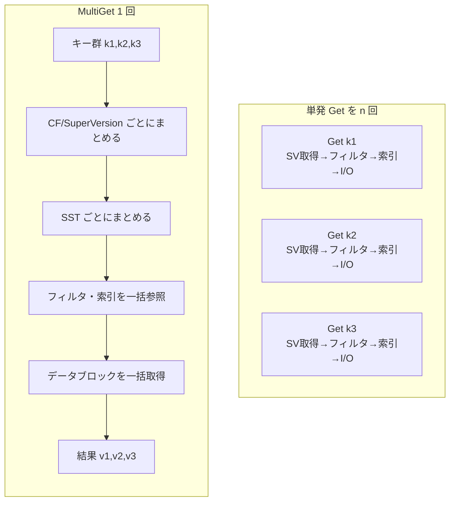

# 第27章 MultiGet

> **本章で読むソース**
>
> - [`db/db_impl/db_impl.cc`](https://github.com/facebook/rocksdb/blob/v11.1.1/db/db_impl/db_impl.cc)
> - [`table/multiget_context.h`](https://github.com/facebook/rocksdb/blob/v11.1.1/table/multiget_context.h)
> - [`db/version_set.cc`](https://github.com/facebook/rocksdb/blob/v11.1.1/db/version_set.cc)
> - [`table/block_based/block_based_table_reader_sync_and_async.h`](https://github.com/facebook/rocksdb/blob/v11.1.1/table/block_based/block_based_table_reader_sync_and_async.h)
> - [`table/block_based/full_filter_block.cc`](https://github.com/facebook/rocksdb/blob/v11.1.1/table/block_based/full_filter_block.cc)
> - [`include/rocksdb/options.h`](https://github.com/facebook/rocksdb/blob/v11.1.1/include/rocksdb/options.h)

## この章の狙い

`MultiGet` は複数のキーをまとめて読み出す API である。
本章では、`MultiGet` が単発の `Get` を繰り返す方式と比べてどこで総コストを下げているかを、実装の機構から読み解く。
具体的には、キーをカラムファミリーと `SuperVersion`、さらに同じ SST へとまとめる過程、フィルタとインデックスを一度の参照で済ませる仕掛け、複数のデータブロックを一度の I/O 発行にまとめる `RetrieveMultipleBlocks`、そして非同期 I/O による読みの重ね合わせを順に追う。

## 前提

- [第23章 Get](23-get.md)：単一キーの探索経路（MemTable、Immutable MemTable、`Version` の順）。
  本章はこれをバッチ化したものとして読むと差分が見える。
- [第24章 Version と SuperVersion](24-version-superversion.md)：一貫したスナップショットを与える `SuperVersion` の取得。
- [第16章 BlockBasedTable Reader](../part03-sst/16-block-based-table-reader.md)：SST 内のブロック取得とブロックキャッシュ照会。
- [第18章 Bloom フィルタ](../part03-sst/18-bloom-filter.md)：フィルタによるキーの存在判定。

## バッチ化で償却する固定費

単発の `Get` を $n$ 回呼ぶと、1キーごとに同じ固定費を払う。
スナップショットを固定するための `SuperVersion` 参照、各 SST でのフィルタとインデックスの参照、そしてブロック取得のための I/O 発行である。
これらはキーの個数に比例して積み上がるが、本来はキーの集まり全体で一度払えば足りる処理が多い。

`MultiGet` の発想は、この固定費をバッチ全体で一度だけ払い、$n$ キーに分散して償却することにある。
同じカラムファミリーのキーなら `SuperVersion` の取得は一度でよい。
同じ SST に当たるキーなら、フィルタブロックとインデックスブロックの参照を共有できる。
同じデータブロックに当たるキーなら、ブロックの読み出しを一度で済ませられる。
以降の節は、この「まとめてから一度だけ払う」という構造が各層でどう実装されているかを追う。



## バッチの単位と Mask による集合操作

バッチの器が `MultiGetContext` である。
1バッチのキー数には上限があり、`MAX_BATCH_SIZE` として 32 に固定されている。

[`table/multiget_context.h` L97-L108](https://github.com/facebook/rocksdb/blob/v11.1.1/table/multiget_context.h#L97-L108)

```cpp
class MultiGetContext {
 public:
  // Limit the number of keys in a batch to this number. Benchmarks show that
  // there is negligible benefit for batches exceeding this. Keeping this < 32
  // simplifies iteration, as well as reduces the amount of stack allocations
  // that need to be performed
  static const int MAX_BATCH_SIZE = 32;

  // A bitmask of at least MAX_BATCH_SIZE - 1 bits, so that
  // Mask{1} << MAX_BATCH_SIZE is well defined
  using Mask = uint64_t;
  static_assert(MAX_BATCH_SIZE < sizeof(Mask) * 8);
```

上限を 32 に抑えるのは、バッチをこれより大きくしても利得がほぼ増えないという計測結果に加えて、固定長にすることで実装が単純になるからである。
キーの集合を `uint64_t` 一語のビットマスク（`Mask`）で表現でき、スタック上の固定長配列で器を確保できる。

探索が進むにつれて、処理対象のキーは段階的に絞り込まれていく。
あるキーが SST の範囲外だったり、フィルタで存在しないと判定されたり、値が確定したりするたびに、そのキーをバッチから外す。
この絞り込みを、`MultiGetContext::Range` が持つ複数のビットマスクで表す。

[`table/multiget_context.h` L179-L194](https://github.com/facebook/rocksdb/blob/v11.1.1/table/multiget_context.h#L179-L194)

```cpp
  // MultiGetContext::Range - Specifies a range of keys, by start and end index,
  // from the parent MultiGetContext. Each range contains a bit vector that
  // indicates whether the corresponding keys need to be processed or skipped.
  // A Range object can be copy constructed, and the new object inherits the
  // original Range's bit vector. This is useful for progressively skipping
  // keys as the lookup goes through various stages. For example, when looking
  // up keys in the same SST file, a Range is created excluding keys not
  // belonging to that file. A new Range is then copy constructed and individual
  // keys are skipped based on bloom filter lookup.
  class Range {
   public:
    // MultiGetContext::Range::Iterator - A forward iterator that iterates over
    // non-skippable keys in a Range, as well as keys whose final value has been
    // found. The latter is tracked by MultiGetContext::value_mask_
    class Iterator {
     public:
```

`Range` のイテレータは、`value_mask_`（値が確定したキー）、`skip_mask_`（このステージで飛ばすキー）、`invalid_mask_`（範囲外のキー）の論理和を見て、立っているビットのキーを読み飛ばす。
つまり「処理すべきキーだけを巡回する」操作が、ビットマスクの参照だけで実現される。
キーを外す操作も、対応するビットを立てるだけで済む。

[`table/multiget_context.h` L285-L301](https://github.com/facebook/rocksdb/blob/v11.1.1/table/multiget_context.h#L285-L301)

```cpp
    void SkipIndex(size_t index) { skip_mask_ |= Mask{1} << index; }

    void SkipKey(const Iterator& iter) { SkipIndex(iter.index_); }

    bool IsKeySkipped(const Iterator& iter) const {
      return skip_mask_ & (Mask{1} << iter.index_);
    }

    // Update the value_mask_ in MultiGetContext so its
    // immediately reflected in all the Range Iterators
    void MarkKeyDone(Iterator& iter) {
      ctx_->value_mask_ |= (Mask{1} << iter.index_);
    }

    bool CheckKeyDone(Iterator& iter) const {
      return ctx_->value_mask_ & (Mask{1} << iter.index_);
    }
```

ここに最適化が一つある。
`value_mask_` は `MultiGetContext` 本体が持ち、`Range` はその参照を共有する。
あるステージでキーの値が確定すると `MarkKeyDone` が `value_mask_` を更新し、その変更は同じ `MultiGetContext` を指す全ての `Range` のイテレータに即座に反映される。
キーの集合を SST 単位やフィルタ判定後の部分集合へと派生させても、確定済みのキーは器を作り直さずに全ての部分集合から消える。
キー集合の差分管理が、配列の再構築ではなくビット演算だけで進む。

## キーをカラムファミリーと SuperVersion でまとめる

`MultiGet` の入口は `MultiGetCommon` である。
ここでまずキーをソートし、カラムファミリーごとの連続区間に切り分ける。

ソートは `PrepareMultiGetKeys` が行う。
比較は、カラムファミリー ID を第一キー、ユーザーキーの内容を第二キーとする。

[`db/db_impl/db_impl.cc` L3173-L3186](https://github.com/facebook/rocksdb/blob/v11.1.1/db/db_impl/db_impl.cc#L3173-L3186)

```cpp
void DBImpl::PrepareMultiGetKeys(
    size_t num_keys, bool sorted_input,
    autovector<KeyContext*, MultiGetContext::MAX_BATCH_SIZE>* sorted_keys) {
  if (sorted_input) {
#ifndef NDEBUG
    assert(std::is_sorted(sorted_keys->begin(), sorted_keys->end(),
                          CompareKeyContext()));
#endif
    return;
  }

  std::sort(sorted_keys->begin(), sorted_keys->begin() + num_keys,
            CompareKeyContext());
}
```

ソートには二つの意味がある。
カラムファミリー ID 順に並ぶことで、同じカラムファミリーのキーが配列上で連続し、後段で区間に切り出せる。
ユーザーキー順に並ぶことで、SST 内で隣り合うキーが隣り合うブロックや同じブロックに当たりやすくなり、ブロック取得の共有が効く。
呼び出し側がすでにソート済みだと宣言した（`sorted_input`）場合は並べ替えを省く。

ソートの後、連続するカラムファミリーごとに区間（`MultiGetKeyRangePerCf`）と、その区間が属するカラムファミリーと `SuperVersion` の対（`ColumnFamilySuperVersionPair`）を作る。

[`db/db_impl/db_impl.cc` L3062-L3088](https://github.com/facebook/rocksdb/blob/v11.1.1/db/db_impl/db_impl.cc#L3062-L3088)

```cpp
  size_t cf_start = 0;
  ColumnFamilyHandle* cf = sorted_keys[0]->column_family;

  for (size_t i = 0; i < num_keys; ++i) {
    KeyContext* key_ctx = sorted_keys[i];
    if (key_ctx->column_family != cf) {
      key_range_per_cf.emplace_back(cf_start, i - cf_start);
      cf_sv_pairs.emplace_back(cf, nullptr);
      cf_start = i;
      cf = key_ctx->column_family;
    }
  }

  key_range_per_cf.emplace_back(cf_start, num_keys - cf_start);
  cf_sv_pairs.emplace_back(cf, nullptr);

  SequenceNumber consistent_seqnum = kMaxSequenceNumber;
  bool sv_from_thread_local = false;
  Status s = MultiCFSnapshot<autovector<ColumnFamilySuperVersionPair,
                                        MultiGetContext::MAX_BATCH_SIZE>>(
      read_options, nullptr,
      [](autovector<ColumnFamilySuperVersionPair,
                    MultiGetContext::MAX_BATCH_SIZE>::iterator& cf_iter) {
        return &(*cf_iter);
      },
      &cf_sv_pairs,
      /* extra_sv_ref */ false, &consistent_seqnum, &sv_from_thread_local);
```

`MultiCFSnapshot` は、バッチに登場する全カラムファミリーの `SuperVersion` を、一つの一貫したシーケンス番号（`consistent_seqnum`）のもとで取得する。
単発 `Get` ならキーごとに `SuperVersion` を参照するところを、ここではカラムファミリーごとに一度だけ参照する。
バッチ内のキーが一つのカラムファミリーに集中していれば、`SuperVersion` 参照は一回で済む。

区間ごとに `SuperVersion` が揃ったら、区間と `SuperVersion` の対を順に `MultiGetImpl` へ渡す。

[`db/db_impl/db_impl.cc` L3107-L3120](https://github.com/facebook/rocksdb/blob/v11.1.1/db/db_impl/db_impl.cc#L3107-L3120)

```cpp
  auto key_range_per_cf_iter = key_range_per_cf.begin();
  auto cf_sv_pair_iter = cf_sv_pairs.begin();
  while (key_range_per_cf_iter != key_range_per_cf.end() &&
         cf_sv_pair_iter != cf_sv_pairs.end()) {
    s = MultiGetImpl(read_options, key_range_per_cf_iter->start,
                     key_range_per_cf_iter->num_keys, &sorted_keys,
                     cf_sv_pair_iter->super_version, consistent_seqnum,
                     read_callback);
    if (!s.ok()) {
      break;
    }
    ++key_range_per_cf_iter;
    ++cf_sv_pair_iter;
  }
```

## バッチ単位の探索ループ

`MultiGetImpl` はバッチの実体を処理する。
一つのカラムファミリーに属するキー区間を、`MAX_BATCH_SIZE` ごとに切り出して `MultiGetContext` を組み立て、その器に対して MemTable、Immutable MemTable、`Version`（SST 群）の順で探索する。

[`db/db_impl/db_impl.cc` L3371-L3407](https://github.com/facebook/rocksdb/blob/v11.1.1/db/db_impl/db_impl.cc#L3371-L3407)

```cpp
    size_t batch_size = (keys_left > MultiGetContext::MAX_BATCH_SIZE)
                            ? MultiGetContext::MAX_BATCH_SIZE
                            : keys_left;
    MultiGetContext ctx(sorted_keys, start_key + num_keys - keys_left,
                        batch_size, snapshot, read_options, GetFileSystem(),
                        stats_);
    MultiGetRange range = ctx.GetMultiGetRange();
    range.AddValueSize(curr_value_size);
    bool lookup_current = true;

    keys_left -= batch_size;
    for (auto mget_iter = range.begin(); mget_iter != range.end();
         ++mget_iter) {
      mget_iter->merge_context.Clear();
      *mget_iter->s = Status::OK();
    }

    bool skip_memtable =
        (read_options.read_tier == kPersistedTier &&
         has_unpersisted_data_.load(std::memory_order_relaxed));
    if (!skip_memtable) {
      super_version->mem->MultiGet(read_options, &range, callback,
                                   false /* immutable_memtable */);
      if (!range.empty()) {
        super_version->imm->MultiGet(read_options, &range, callback);
      }
      if (!range.empty()) {
        uint64_t left = range.KeysLeft();
        RecordTick(stats_, MEMTABLE_MISS, left);
      } else {
        lookup_current = false;
      }
    }
    if (lookup_current) {
      PERF_TIMER_GUARD(get_from_output_files_time);
      super_version->current->MultiGet(read_options, &range, callback);
    }
```

探索の各段は `Range` を受け取り、確定したキーを `value_mask_` で消す。
MemTable と Immutable MemTable で全キーが見つかれば `range.empty()` となり、SST 群（`super_version->current`）の探索を丸ごと省く。
この章ではこの先、`Version::MultiGet` から SST 内の処理までを追う。

## SST のまとめとフィルタとインデックスの一括参照

`Version::MultiGet` は、バッチのキーがどの SST に当たるかを判定し、同じ SST に当たるキーをまとめて一回の探索にかける。
SST 内の処理が `BlockBasedTable::MultiGet` である。

`BlockBasedTable::MultiGet` は、まずその SST のフィルタにバッチ全体を一度だけかける。

[`table/block_based/block_based_table_reader_sync_and_async.h` L288-L315](https://github.com/facebook/rocksdb/blob/v11.1.1/table/block_based/block_based_table_reader_sync_and_async.h#L288-L315)

```cpp
using MultiGetRange = MultiGetContext::Range;
DEFINE_SYNC_AND_ASYNC(void, BlockBasedTable::MultiGet)
(const ReadOptions& read_options, const MultiGetRange* mget_range,
 const SliceTransform* prefix_extractor, bool skip_filters) {
  if (mget_range->empty()) {
    // Caller should ensure non-empty (performance bug)
    assert(false);
    CO_RETURN;  // Nothing to do
  }

  FilterBlockReader* const filter =
      !skip_filters ? rep_->filter.get() : nullptr;
  MultiGetRange sst_file_range(*mget_range, mget_range->begin(),
                               mget_range->end());

  // First check the full filter
  // If full filter not useful, Then go into each block
  uint64_t tracing_mget_id = BlockCacheTraceHelper::kReservedGetId;
  if (sst_file_range.begin()->get_context) {
    tracing_mget_id = sst_file_range.begin()->get_context->get_tracing_get_id();
  }
  // TODO: need more than one lookup_context here to track individual filter
  // and index partition hits and misses.
  BlockCacheLookupContext metadata_lookup_context{
      TableReaderCaller::kUserMultiGet, tracing_mget_id,
      /*_get_from_user_specified_snapshot=*/read_options.snapshot != nullptr};
  FullFilterKeysMayMatch(filter, &sst_file_range, prefix_extractor,
                         &metadata_lookup_context, read_options);
```

`FullFilterKeysMayMatch` を抜けると、フィルタが「存在しない」と判定したキーは `sst_file_range` から消えている。
フィルタの本体である `FullFilterBlockReader::MayMatch` は、バッチのキーを配列にまとめ、フィルタビットの判定を一度の呼び出しで行う。

[`table/block_based/full_filter_block.cc` L212-L228](https://github.com/facebook/rocksdb/blob/v11.1.1/table/block_based/full_filter_block.cc#L212-L228)

```cpp
  std::array<Slice*, MultiGetContext::MAX_BATCH_SIZE> keys;
  std::array<bool, MultiGetContext::MAX_BATCH_SIZE> may_match = {{true}};
  autovector<Slice, MultiGetContext::MAX_BATCH_SIZE> prefixes;
  int num_keys = 0;
  MultiGetRange filter_range(*range, range->begin(), range->end());
  for (auto iter = filter_range.begin(); iter != filter_range.end(); ++iter) {
    if (!prefix_extractor) {
      keys[num_keys++] = &iter->ukey_without_ts;
    } else if (prefix_extractor->InDomain(iter->ukey_without_ts)) {
      prefixes.emplace_back(prefix_extractor->Transform(iter->ukey_without_ts));
      keys[num_keys++] = &prefixes.back();
    } else {
      filter_range.SkipKey(iter);
    }
  }

  filter_bits_reader->MayMatch(num_keys, keys.data(), may_match.data());
```

フィルタブロックの取得（`GetOrReadFilterBlock`）はバッチで一度だけ呼ばれ、ビット判定 `MayMatch` も `num_keys` 個まとめて行われる。
存在しないキーをここで落とせば、後続のインデックス参照とブロック取得が丸ごと不要になる。

フィルタを通過したキーが残れば、インデックスイテレータを一つだけ作り、各キーで `Seek` してデータブロックの位置（`BlockHandle`）を求める。

[`table/block_based/block_based_table_reader_sync_and_async.h` L317-L331](https://github.com/facebook/rocksdb/blob/v11.1.1/table/block_based/block_based_table_reader_sync_and_async.h#L317-L331)

```cpp
  if (!sst_file_range.empty()) {
    IndexBlockIter iiter_on_stack;
    // if prefix_extractor found in block differs from options, disable
    // BlockPrefixIndex. Only do this check when index_type is kHashSearch.
    bool need_upper_bound_check = false;
    if (rep_->index_type == BlockBasedTableOptions::kHashSearch) {
      need_upper_bound_check = PrefixExtractorChanged(prefix_extractor);
    }
    auto iiter = NewIndexIterator(
        read_options, need_upper_bound_check, &iiter_on_stack,
        sst_file_range.begin()->get_context, &metadata_lookup_context);
    std::unique_ptr<InternalIteratorBase<IndexValue>> iiter_unique_ptr;
    if (iiter != &iiter_on_stack) {
      iiter_unique_ptr.reset(iiter);
    }
```

インデックスブロックも SST ごとに一度だけ取得され、その同じイテレータでバッチ内の全キーの `BlockHandle` を引く。
フィルタブロックとインデックスブロックの取得コストが、その SST に当たるキーの数で割られる。

## 同じブロックに当たるキーの共有と一括ブロック取得

`BlockHandle` を引く過程で、`MultiGet` は隣り合うキーが同じデータブロックに当たることを検出する。
ソート済みのキーを順に処理し、直前のキーと同じブロックオフセットなら、そのキーには「前のブロックを再利用する」印を付ける。

[`table/block_based/block_based_table_reader_sync_and_async.h` L420-L431](https://github.com/facebook/rocksdb/blob/v11.1.1/table/block_based/block_based_table_reader_sync_and_async.h#L420-L431)

```cpp
          if (v.handle.offset() == prev_offset) {
            // This key can reuse the previous block (later on).
            // Mark previous as "reused"
            reused_mask |= MultiGetContext::Mask{1}
                           << (block_handles.size() - 1);
            // Use null handle to indicate this one reuses same block as
            // previous.
            block_handles.emplace_back(BlockHandle::NullBlockHandle());
            continue;
          }
          prev_offset = v.handle.offset();
          block_handles.emplace_back(v.handle);
```

ブロックオフセットが直前と同じなら、そのキーの `BlockHandle` を空（`NullBlockHandle`）にして取得対象から外し、直前のブロックに `reused_mask` で印を付ける。
こうして、1ブロックに $m$ 個のキーが当たるなら、ブロックの読み出しは $m$ 回ではなく 1 回になる。
ここでソート（前節）が効いてくる。
ユーザーキー順に並んでいるからこそ、同じブロックに当たるキーが隣り合い、`prev_offset` の単純な比較だけで共有を検出できる。

ブロックキャッシュにある分を除いた、実際に読む必要のあるブロック群が `block_handles` に集まったら、`RetrieveMultipleBlocks` に渡す。

[`table/block_based/block_based_table_reader_sync_and_async.h` L518-L532](https://github.com/facebook/rocksdb/blob/v11.1.1/table/block_based/block_based_table_reader_sync_and_async.h#L518-L532)

```cpp
        if (!use_fs_scratch && !rep_->file->use_direct_io() &&
            rep_->decompressor) {
          if (total_len <= kMultiGetReadStackBufSize) {
            scratch = stack_buf;
          } else {
            scratch = new char[total_len];
            block_buf.reset(scratch);
          }
        }
        CO_AWAIT(RetrieveMultipleBlocks)
        (read_options, &data_block_range, &block_handles, &statuses[0],
         &results[0], scratch,
         dict.GetValue() ? dict.GetValue()->decompressor_.get()
                         : rep_->decompressor.get(),
         use_fs_scratch);
```

`RetrieveMultipleBlocks` は、複数のブロックを一つの読み出しスケジュールにまとめる。
ファイルシステムへの発行は `MultiRead`（複数の読み要求を一括で渡すインターフェース）で行う。
さらに、ファイル上で隣接する二つのブロックは一つの読み要求に結合する。

[`table/block_based/block_based_table_reader_sync_and_async.h` L81-L93](https://github.com/facebook/rocksdb/blob/v11.1.1/table/block_based/block_based_table_reader_sync_and_async.h#L81-L93)

```cpp
    size_t prev_end = static_cast<size_t>(prev_offset) + prev_len;

    // If current block is adjacent to the previous one, at the same time,
    // compression is enabled and there is no compressed cache, we combine
    // the two block read as one.
    // We don't combine block reads here in direct IO mode, because when doing
    // direct IO read, the block requests will be realigned and merged when
    // necessary.
    if ((use_shared_buffer || use_fs_scratch) && !file->use_direct_io() &&
        prev_end == handle.offset()) {
      req_offset_for_block.emplace_back(prev_len);
      prev_len += BlockSizeWithTrailer(handle);
    } else {
```

ファイル上で連続するブロック（前のブロックの末尾オフセットが次のブロックの先頭オフセットと一致する）を一つの `FSReadRequest` に束ねる。
読み要求の本数が減り、システムコールの回数とシーク回数が抑えられる。
ここで、`kMultiGetReadStackBufSize`（8192 バイト）以下に収まる読み出しはスタック上の固定バッファを使い、ヒープ確保を避ける。

## 非同期 I/O による読みの重ね合わせ

SST が複数の階層（レベル）にまたがると、各 SST のブロック取得は本来並行に発行できる。
`MultiGet` は、`ReadOptions::async_io` と `optimize_multiget_for_io` が有効でコルーチンが使えるとき、複数 SST の読みを重ね合わせてレイテンシを隠す経路へ入る。

[`include/rocksdb/options.h` L2085-L2097](https://github.com/facebook/rocksdb/blob/v11.1.1/include/rocksdb/options.h#L2085-L2097)

```cpp
  // If async_io is enabled, RocksDB will prefetch some of data asynchronously.
  // RocksDB apply it if reads are sequential and its internal automatic
  // prefetching.
  bool async_io = false;

  // Experimental
  //
  // If async_io is set, then this flag controls whether we read SST files
  // in multiple levels asynchronously. Enabling this flag can help reduce
  // MultiGet latency by maximizing the number of SST files read in
  // parallel if the keys in the MultiGet batch are in different levels. It
  // comes at the expense of slightly higher CPU overhead.
  bool optimize_multiget_for_io = true;
```

`async_io` は既定で無効、`optimize_multiget_for_io` は `async_io` が有効なときの SST 並行読みを制御する（既定で有効）。
分岐は `Version::MultiGet` にある。

[`db/version_set.cc` L2962-L2967](https://github.com/facebook/rocksdb/blob/v11.1.1/db/version_set.cc#L2962-L2967)

```cpp
#if USE_COROUTINES
  if (read_options.async_io && read_options.optimize_multiget_for_io &&
      using_coroutines() && use_async_io_) {
    s = MultiGetAsync(read_options, range, &blob_ctxs);
  } else
#endif  // USE_COROUTINES
```

条件が揃わなければ、SST を一つずつ同期で処理する `MultiGetFromSST` を呼ぶ。
条件が揃うと、各 SST の探索をコルーチンタスク（`MultiGetFromSSTCoroutine`）として並べ、まとめて待ち合わせる。

[`db/version_set.cc` L3037-L3055](https://github.com/facebook/rocksdb/blob/v11.1.1/db/version_set.cc#L3037-L3055)

```cpp
          if (!file_range.empty()) {
            mget_tasks.emplace_back(MultiGetFromSSTCoroutine(
                read_options, file_range, fp.GetHitFileLevel(), skip_filters,
                skip_range_deletions, f, blob_ctxs, table_handle,
                num_filter_read, num_index_read, num_sst_read));
          }
          if (fp.KeyMaySpanNextFile()) {
            break;
          }
          f = fp.GetNextFileInLevel();
        }
        if (mget_tasks.size() > 0) {
          RecordTick(db_statistics_, MULTIGET_COROUTINE_COUNT,
                     mget_tasks.size());
          // Collect all results so far
          std::vector<Status> statuses =
              folly::coro::blockingWait(co_withExecutor(
                  &range->context()->executor(),
                  folly::coro::collectAllRange(std::move(mget_tasks))));
```

同期版とコルーチン版は同じ本体から生成される。
`block_based_table_reader_sync_and_async.h` の `DEFINE_SYNC_AND_ASYNC` と `CO_AWAIT` マクロが、同じソースを二度インクルードして、`BlockBasedTable::MultiGet` と `BlockBasedTable::MultiGetCoroutine` の両方を作り分ける。
コルーチン版では、`RetrieveMultipleBlocks` 内の読み発行が `MultiRead`（同期）ではなく `MultiReadAsync`（非同期）になる。

[`table/block_based/block_based_table_reader_sync_and_async.h` L143-L153](https://github.com/facebook/rocksdb/blob/v11.1.1/table/block_based/block_based_table_reader_sync_and_async.h#L143-L153)

```cpp
#if defined(WITH_COROUTINES)
      if (file->use_direct_io()) {
#endif  // WITH_COROUTINES
        s = file->MultiRead(opts, &read_reqs[0], read_reqs.size(),
                            &direct_io_buf, &dbg);
#if defined(WITH_COROUTINES)
      } else {
        co_await batch->context()->reader().MultiReadAsync(
            file, opts, &read_reqs[0], read_reqs.size(), &direct_io_buf, &dbg);
      }
#endif  // WITH_COROUTINES
```

ある SST の読みが I/O 完了を待つあいだ、コルーチンは中断して別の SST のコルーチンへ実行を譲る。
複数 SST の I/O が時間軸上で重なり、待ち時間が直列に積み上がらない。
このコルーチンは folly の `folly::coro::Task` で実装されており、`collectAllRange` でまとめて待ち合わせる。
ただし、L0 のファイルや並行できる相手がいない場合は、同期版のほうが速いため、`Version::MultiGet` 側で同期経路に落とす。

[`db/version_set.cc` L2987-L2998](https://github.com/facebook/rocksdb/blob/v11.1.1/db/version_set.cc#L2987-L2998)

```cpp
      // Avoid using the coroutine version if we're looking in a L0 file, since
      // L0 files won't be parallelized anyway. The regular synchronous version
      // is faster.
      if (!read_options.async_io || !using_coroutines() || !use_async_io_ ||
          fp.GetHitFileLevel() == 0 || !fp.RemainingOverlapInLevel()) {
        if (f) {
          bool skip_filters =
              IsFilterSkipped(static_cast<int>(fp.GetHitFileLevel()),
                              fp.IsHitFileLastInLevel());
          // Call MultiGetFromSST for looking up a single file
          s = MultiGetFromSST(read_options, fp.CurrentFileRange(),
                              fp.GetHitFileLevel(), skip_filters,
```

## まとめ

- `MultiGet` は、単発 `Get` がキーごとに払う固定費（`SuperVersion` 取得、フィルタとインデックスの参照、I/O 発行）を、キーの集合全体で一度だけ払うことで償却する。
- バッチは `MultiGetContext` を器とし、上限 32 キーの固定長で扱う。
  処理対象のキー集合は `uint64_t` のビットマスク（`value_mask_`、`skip_mask_`、`invalid_mask_`）で表し、絞り込みをビット演算だけで進める。
- キーはカラムファミリー ID とユーザーキーでソートされ、カラムファミリーごとに `SuperVersion` を一度だけ取得する。
  ソートは、同じ SST と同じブロックに当たるキーを隣接させてまとめやすくする役割も持つ。
- SST 内では、フィルタブロックとインデックスブロックをバッチで一度だけ参照する。
  フィルタで存在しないと判定されたキーは後続から外れ、無駄なブロック取得を消す。
- 同じデータブロックに当たるキーはブロック取得を共有し、`RetrieveMultipleBlocks` が複数ブロックを `MultiRead` で一括取得し、ファイル上で隣接するブロックを一つの読み要求に結合する。
- `async_io` と `optimize_multiget_for_io` が有効なら、複数 SST のブロック読みを folly コルーチンで重ね合わせ、I/O 待ち時間を隠す。
  同期版とコルーチン版は同一ソースからマクロで生成される。

## 関連する章

- [第28章 MultiScan](28-multiscan.md)：範囲読みのバッチ化。
  本章の点読みのバッチ化と対になる。
- [第23章 Get](23-get.md)：本章がバッチ化した単発の探索経路。
- [第16章 BlockBasedTable Reader](../part03-sst/16-block-based-table-reader.md)：ブロック取得とブロックキャッシュ照会の詳細。
- [第18章 Bloom フィルタ](../part03-sst/18-bloom-filter.md)：`MayMatch` の判定の中身。
- [第47章 ファイル I/O とプリフェッチ](../part09-env/47-file-io-prefetch.md)：`MultiRead` と非同期 I/O の下層。
