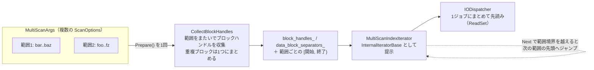
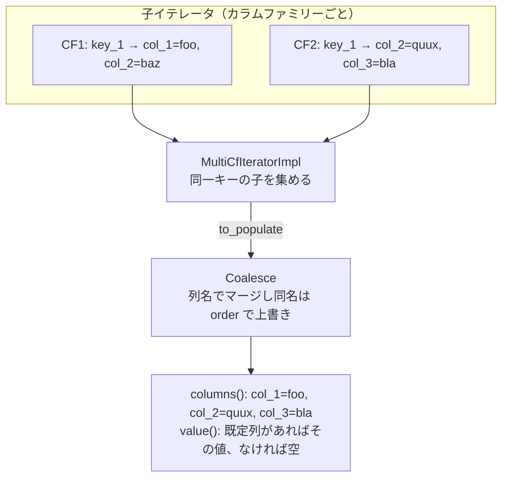

# 第28章 MultiScan と coalescing iterator

> **本章で読むソース**
>
> - [`include/rocksdb/multi_scan.h`](https://github.com/facebook/rocksdb/blob/v11.1.1/include/rocksdb/multi_scan.h)
> - [`table/block_based/multi_scan_index_iterator.h`](https://github.com/facebook/rocksdb/blob/v11.1.1/table/block_based/multi_scan_index_iterator.h)
> - [`table/block_based/multi_scan_index_iterator.cc`](https://github.com/facebook/rocksdb/blob/v11.1.1/table/block_based/multi_scan_index_iterator.cc)
> - [`db/multi_cf_iterator_impl.h`](https://github.com/facebook/rocksdb/blob/v11.1.1/db/multi_cf_iterator_impl.h)
> - [`db/coalescing_iterator.h`](https://github.com/facebook/rocksdb/blob/v11.1.1/db/coalescing_iterator.h)
> - [`db/coalescing_iterator.cc`](https://github.com/facebook/rocksdb/blob/v11.1.1/db/coalescing_iterator.cc)
> - [`db/attribute_group_iterator_impl.h`](https://github.com/facebook/rocksdb/blob/v11.1.1/db/attribute_group_iterator_impl.h)
> - [`include/rocksdb/attribute_groups.h`](https://github.com/facebook/rocksdb/blob/v11.1.1/include/rocksdb/attribute_groups.h)

## この章の狙い

第27章までで、単一の `Iterator` を使った範囲スキャンと `MultiGet` による点読みのバッチ化を見た。
本章では、これらの中間に位置する新しい読み出し API を二系統たどる。
一つは複数のキー範囲を1回のスキャン要求にまとめる `MultiScan`、もう一つは複数のカラムファミリーを1本の論理的なイテレータに束ねる `CoalescingIterator` と `AttributeGroupIterator` である。
どちらも、範囲やカラムファミリーをまたいだ参照をまとめることで、個別にイテレータを立てるよりも少ない I/O とインデックス参照で同じ結果を得ることを狙っている。

## 前提

- [第16章 BlockBasedTable リーダー](../part03-sst/16-block-based-table-reader.md)
- [第17章 インデックスブロック](../part03-sst/17-index-block.md)
- [第26章 イテレータ](./26-iterators.md)（`MergingIterator` とヒープによる併合）
- [第27章 MultiGet](./27-multiget.md)

## MultiScan が解く問題

アプリケーションが複数のキー範囲を順に読みたい場面は珍しくない。
範囲ごとに `Iterator` を作って `Seek` を繰り返す素朴な方法では、各範囲が独立に動く。
範囲をまたいでインデックスブロックを読み直し、データブロックも範囲ごとに別々の I/O で取りに行く。
範囲どうしが同じ SST ファイルや近接するブロックに着地していても、その近さを活用できない。

`MultiScan` は、複数の範囲を一つの要求としてまとめて受け取る。
ヘッダ冒頭のコメントは、この API が返す入れ子のイテレータ構造を次のように図示している。

[`include/rocksdb/multi_scan.h` L14-L54](https://github.com/facebook/rocksdb/blob/v11.1.1/include/rocksdb/multi_scan.h#L14-L54)

```cpp
// EXPERIMENTAL
//
// An iterator that returns results from multiple scan ranges. The ranges are
// expected to be in increasing sorted order.
// The results are returned in nested container objects that can be iterated
// using an std::input_iterator.
//
// MultiScan
//     |
//     ---
//       |
//  MultiScanIterator  <-- std::input_iterator (returns a Scan object for each
//         |                                    scan range)
//         ---
//           |
//          Scan
//            |
//            ---
//              |
//          ScanIterator <-- std::input_iterator (returns the KVs of a single
//                                                scan range)
```

外側のループが範囲を一つずつ取り出し（`Scan`）、内側のループがその範囲の KV を順に返す（`ScanIterator`）。
範囲は開始キーの昇順に並んでいることが期待される、とコメントは述べる。
`MultiScan` は実験的（EXPERIMENTAL）な API であり、ヘッダにもその旨が明記されている。

範囲は `MultiScanArgs` に詰める。
個々の範囲は `ScanOptions` で表され、その中身は開始キーと省略可能な上限を持つ `RangeOpt` である。

[`include/rocksdb/options.h` L1847-L1867](https://github.com/facebook/rocksdb/blob/v11.1.1/include/rocksdb/options.h#L1847-L1867)

```cpp
// EXPERIMENTAL
//
// Options for a RocksDB scan request. Only forward scans for now.
// We may add other options such as prefix scan in the future.
struct ScanOptions {
  // The scan range. Mandatory for start to be set, limit is optional
  RangeOpt range;
  // ... (中略) ...
  // An unbounded scan with a start key
  explicit ScanOptions(const Slice& _start) : range(_start, OptSlice()) {}

  // A bounded scan with a start key and upper bound
  ScanOptions(const Slice& _start, const Slice& _upper_bound)
      : range(_start, _upper_bound) {}
};
```

開始キーは必須で、上限は任意である。
コメントによれば、現状は前方スキャンのみを対象とし、プレフィックススキャンなどは将来の拡張として残されている。

## MultiScanArgs と一括処理の起点

`MultiScanArgs` は範囲の集合に加えて、まとめ読みの挙動を制御する設定値を持つ。
範囲は `insert` で追加し、内部の `std::vector<ScanOptions>` に積む。

[`include/rocksdb/options.h` L1869-L1875](https://github.com/facebook/rocksdb/blob/v11.1.1/include/rocksdb/options.h#L1869-L1875)

```cpp
// Container for multiple scan ranges that can be used with MultiScan.
// This replaces std::vector<ScanOptions> with a more efficient implementation
// that can merge overlapping ranges.
class MultiScanArgs {
 public:
  // Constructor that takes a comparator
  explicit MultiScanArgs(const Comparator* comparator) : comp_(comparator) {}
```

設定値のうち本章で要になるのは、先読みの量と I/O のまとめ方を決める三つである。

[`include/rocksdb/options.h` L1962-L1979](https://github.com/facebook/rocksdb/blob/v11.1.1/include/rocksdb/options.h#L1962-L1979)

```cpp
  uint64_t io_coalesce_threshold = 16 << 10;  // 16KB by default

  // Maximum size (in bytes) for the data blocks loaded by a MultiScan.
  // This limits the amount of I/O and memory usage by pinned data blocks.
  //
  // When set to 0 (the default), there is no limit. When the limit is reached,
  // the iterator will start returning Status::PrefetchLimitReached().
  //
  // Note that prefetching happens only once in Prepare(), which is different
  // from ReadOptions::readahead_size, which applies any time the iterator does
  // I/O.
  // Note that this limit is per file and applies to compressed block size.
  uint64_t max_prefetch_size = 0;

  // Enable async I/O for multi-scan operations
  // When true, BlockBasedTableIterator will use ReadAsync() for reading blocks
  // When false, it will use synchronous MultiRead().
  bool use_async_io = false;
```

`io_coalesce_threshold` は、隣り合わないブロックでも、間の隙間がこの閾値以下なら一つの I/O にまとめてよいという許容量である。
ヘッダのコメントによれば、`max_prefetch_size` は1回の `MultiScan` がピン留めするデータブロックの総量に上限を課し、先読みは後述の `Prepare()` の中で一度だけ起きる。
これは、イテレータが I/O のたびに効く `ReadOptions::readahead_size` とは性質が異なる。

エントリ点の `DBImpl::NewMultiScan` は `MultiScan` を構築して返すだけで、まとめ読みの仕掛けはコンストラクタにある。

[`db/multi_scan.cc` L12-L40](https://github.com/facebook/rocksdb/blob/v11.1.1/db/multi_scan.cc#L12-L40)

```cpp
MultiScan::MultiScan(const ReadOptions& read_options,
                     const MultiScanArgs& scan_opts, DB* db,
                     ColumnFamilyHandle* cfh)
    : read_options_(read_options), scan_opts_(scan_opts), db_(db), cfh_(cfh) {
  bool slow_path = false;
  // Setup read_options with iterate_uuper_bound based on the first scan.
  // Subsequent scans will update and allocate a new DB iterator as necessary
  if (scan_opts.GetScanRanges()[0].range.limit) {
    upper_bound_ = *scan_opts.GetScanRanges()[0].range.limit;
    read_options_.iterate_upper_bound = &upper_bound_;
  } else {
    read_options_.iterate_upper_bound = nullptr;
  }
  for (const auto& opts : scan_opts.GetScanRanges()) {
    // ... (中略) ...
    if (opts.range.limit.has_value() !=
        scan_opts.GetScanRanges()[0].range.limit.has_value()) {
      slow_path = true;
      break;
    }
  }
  db_iter_.reset(db->NewIterator(read_options_, cfh));
  if (!slow_path) {
    db_iter_->Prepare(scan_opts);
  }
}
```

ここで一つの `DB` イテレータだけを生成し、全範囲に対して `Prepare(scan_opts)` を一度呼ぶ。
これがまとめ読みの本体であり、後述するインデックス参照と先読みの共有はこの呼び出しの中で起きる。

ただし `Prepare` を呼べるのは、全範囲が上限を持つか、全範囲が上限を持たないかのどちらかに揃っているときに限る。
混在していると `slow_path` になり、`Prepare` を呼ばず、範囲を切り替えるたびにイテレータを作り直す。
コメントによれば、上限の有無が変わると `read_options` を更新したイテレータを再確保する必要があり、それが `Prepare` を複雑にするためだとされる。
このため `DB::NewMultiScan` の宣言コメントは、最適な性能のために全範囲で上限の有無を揃えるよう促している。

[`include/rocksdb/db.h` L1026-L1036](https://github.com/facebook/rocksdb/blob/v11.1.1/include/rocksdb/db.h#L1026-L1036)

```cpp
  // Get an iterator that scans multiple key ranges. The scan ranges should
  // be in increasing order of start key. See multi_scan_iterator.h for more
  // details. For optimal performance, ensure that either all entries in
  // scan_opts specify the range limit, or none of them do.
  //
  // NOTE: NOT YET SUPPORTED in DBs using user timestamp (see
  // Comparator::timestamp_size())
  //
  // NOTE: iterate_upper_bound in ReadOptions will
  // be ignored. Instead, the range.limit in ScanOptions is consulted to
  // determine the upper bound key, if specified.
```

範囲を一つ読み終えて次へ進むのが `MultiScanIterator::operator++` である。
ここでは、上限の有無が前の範囲と変わったときだけイテレータを作り直し、そうでなければ上限値を差し替えて同じイテレータを `Seek` し直す。

[`db/multi_scan.cc` L42-L74](https://github.com/facebook/rocksdb/blob/v11.1.1/db/multi_scan.cc#L42-L74)

```cpp
MultiScanIterator& MultiScanIterator::operator++() {
  // ... (中略) ...
  idx_++;
  if (idx_ < scan_opts_.size()) {
    // Check if we need to update read_options_
    if (scan_opts_[idx_].range.limit.has_value() !=
        (read_options_.iterate_upper_bound != nullptr)) {
      // ... (中略) ...
      db_iter_.reset(db_->NewIterator(read_options_, cfh_));
      scan_.Reset(db_iter_.get());
    } else if (scan_opts_[idx_].range.limit) {
      *upper_bound_ = *scan_opts_[idx_].range.limit;
    }
    db_iter_->Seek(*scan_opts_[idx_].range.start);
    // ... (中略) ...
  }
  return *this;
}
```

エラーは戻り値ではなく例外で伝わる。
`Next` や `Seek` が非 OK の `Status` を返すと `MultiScanException` が投げられ、呼び出し側は `ex.status()` で中身を確認する。
この設計は、範囲の二重ループを `try` ブロックで囲む使い方を前提にしている。

## インデックスを共有する MultiScanIndexIterator

`Prepare()` が呼ばれると、`BlockBasedTableIterator` は通常のインデックスイテレータを `MultiScanIndexIterator` に差し替える。
このイテレータの役割は、全範囲ぶんのブロックハンドルを事前に集めた配列を、通常のインデックスイテレータと同じ `InternalIteratorBase<IndexValue>` の見た目で提示することにある。

[`table/block_based/multi_scan_index_iterator.h` L23-L33](https://github.com/facebook/rocksdb/blob/v11.1.1/table/block_based/multi_scan_index_iterator.h#L23-L33)

```cpp
// MultiScanIndexIterator wraps the block handle list produced by
// Prepare()/CollectBlockHandles() and presents it as an
// InternalIteratorBase<IndexValue>. This allows BlockBasedTableIterator
// to use the same SeekImpl()/FindBlockForward() code path for both
// regular iteration and MultiScan.
//
// The iterator supports forward-only Seek() and Next(). Seek targets must
// be non-decreasing (enforced via prev_seek_key_). When a scan range is
// exhausted, Next() jumps to the start of the next scan range. When all
// ranges are exhausted, the iterator becomes invalid.
```

差し替えによって、`BlockBasedTableIterator` 側の `SeekImpl()` と `FindBlockForward()` は通常のスキャンと同じコードのまま動く。
インデックスの読み方だけを差し替えて、上位のスキャン経路には手を入れない設計である。

ブロックハンドルを集めるのは `Prepare()` の中の `CollectBlockHandles()` である。
各範囲についてインデックスをたどり、開始キーから上限までの間にあるデータブロックのハンドルと区切りキー（separator）を順に積んでいく。
ここで範囲の重なりを吸収する処理が入る。

[`table/block_based/block_based_table_iterator.cc` L1138-L1157](https://github.com/facebook/rocksdb/blob/v11.1.1/table/block_based/block_based_table_iterator.cc#L1138-L1157)

```cpp
    while (index_iter_->status().ok() && index_iter_->Valid() &&
           (!scan_opt.range.limit.has_value() ||
            user_comparator_.CompareWithoutTimestamp(index_iter_->user_key(),
                                                     /*a_has_ts*/ true,
                                                     *scan_opt.range.limit,
                                                     /*b_has_ts=*/false) < 0)) {
      // Only add the block if the index separator is smaller than limit. When
      // they are equal or larger, it will be handled later below.
      if (check_overlap &&
          scan_block_handles->back() == index_iter_->value().handle) {
        // Skip the current block since it's already in the list
      } else {
        scan_block_handles->push_back(index_iter_->value().handle);
        // clone the Slice to avoid the lifetime issue
        data_block_separators->push_back(index_iter_->user_key().ToString());
      }
      ++num_blocks;
      index_iter_->Next();
      check_overlap = false;
    }
```

`check_overlap` の分岐は、隣り合う範囲が同じデータブロックに着地したときに、そのブロックハンドルを二重に積まないためのものである。
範囲をまたいで同じブロックを読む無駄を、ハンドルを集める段階で取り除いている。

集めたハンドルは、範囲ごとの `[開始添字, 終了添字)` を表す `block_index_ranges_per_scan_` とともに `MultiScanIndexIterator` に渡る。
`MultiScanIndexIterator` の `Next()` は、現在のブロックを解放して添字を一つ進め、範囲の終端に達したら次の範囲の先頭へ飛ぶ。

[`table/block_based/multi_scan_index_iterator.cc` L241-L270](https://github.com/facebook/rocksdb/blob/v11.1.1/table/block_based/multi_scan_index_iterator.cc#L241-L270)

```cpp
void MultiScanIndexIterator::Next() {
  assert(valid_);

  // Release current block
  read_set_->ReleaseBlock(cur_idx_);
  ++cur_idx_;

  // Check if we've crossed a scan range boundary
  if (next_scan_idx_ > 0) {
    auto cur_scan_end_idx =
        std::get<1>(block_index_ranges_per_scan_[next_scan_idx_ - 1]);
    if (cur_idx_ >= cur_scan_end_idx) {
      // Current scan range is exhausted
      SetExhausted();
      return;
    }
  }

  // Check prefetch limit
  if (cur_idx_ >= prefetch_max_idx_) {
    valid_ = false;
    if (scan_opts_->max_prefetch_size > 0) {
      status_ = Status::PrefetchLimitReached();
    }
    return;
  }

  // Still within current range, valid
  valid_ = true;
}
```

範囲の終端に達すると `SetExhausted()` が呼ばれる。
このとき次の範囲が残っていれば、イテレータは「有効なまま」で次の範囲の先頭に位置を移す。

[`table/block_based/multi_scan_index_iterator.cc` L220-L239](https://github.com/facebook/rocksdb/blob/v11.1.1/table/block_based/multi_scan_index_iterator.cc#L220-L239)

```cpp
void MultiScanIndexIterator::SetExhausted() {
  scan_range_exhausted_ = true;
  if (next_scan_idx_ < block_index_ranges_per_scan_.size()) {
    // More ranges remain — signal out-of-bound for current range.
    valid_ = true;
    // Position at the start of the next range so that the next Seek()
    // can find it. We need to be "valid" so that FindBlockForward sets
    // is_out_of_bound_ = true.
    auto [start, end] = block_index_ranges_per_scan_[next_scan_idx_];
    if (start < end) {
      cur_idx_ = start;
      return;
    }
    valid_ = false;
  } else {
    // Last range — natural EOF. Don't set out-of-bound so LevelIterator
    // advances to the next file.
    valid_ = false;
  }
}
```

コメントによれば、ここで「有効なまま out-of-bound を立てる」のは、上位の `LevelIterator` に「この範囲はここで終わり」と伝えて次のファイルへ進ませないためである。
最後の範囲だけは out-of-bound を立てず、自然な EOF として扱い、`LevelIterator` を次のファイルへ進ませる。
範囲の境界を、ファイル単位のイテレータの停止条件に翻訳しているわけである。



### 先読みと I/O のまとめ（最適化）

ここまでで集めたブロックハンドルは、範囲をまたいで一つの配列に並んでいる。
`Prepare()` はこれを `IODispatcher` の1ジョブとして投入し、まとめて先読みする。

[`table/block_based/block_based_table_iterator.cc` L1064-L1081](https://github.com/facebook/rocksdb/blob/v11.1.1/table/block_based/block_based_table_iterator.cc#L1064-L1081)

```cpp
  // Submit to IODispatcher
  auto job = std::make_shared<IOJob>();
  job->table = const_cast<BlockBasedTable*>(table_);
  job->block_handles = std::move(blocks_to_prefetch);
  job->job_options.io_coalesce_threshold =
      multiscan_opts->io_coalesce_threshold;
  job->job_options.read_options = read_options_;
  job->job_options.read_options.async_io = multiscan_opts->use_async_io;

  std::shared_ptr<ReadSet> read_set;
  // IODispatcher should be provided by DBIter::Prepare() to enable sharing
  // across all BlockBasedTableIterators in the scan. Create one if not
  // provided (for direct calls to Prepare, e.g., in unit tests).
  std::shared_ptr<IODispatcher> dispatcher = multiscan_opts->io_dispatcher;
  if (!dispatcher) {
    dispatcher.reset(NewIODispatcher());
  }
  multi_scan_status_ = dispatcher->SubmitJob(job, &read_set);
```

まとめ読みが速いのは、二段階で I/O を減らすからである。
第一に、`io_coalesce_threshold` がディスク上で隣り合わないブロックでも、間の隙間が閾値（既定16KB）以下なら一つの読み取りに束ねる。
連続しないブロックを別々のシステムコールで読むより、間の不要なバイトごと1回で読むほうが、シーク回数とリクエスト数が減る。
第二に、`IODispatcher` をスキャン全体で一つに共有する。
コメントが述べるように、`DBIter::Prepare()` が同じ `IODispatcher` を全 `BlockBasedTableIterator` に渡すことで、複数の SST ファイルにまたがる先読みを一つのスケジューラの下にまとめられる。

統計のティッカーは、このまとめが効いた度合いを別々に数えている。

[`include/rocksdb/statistics.h` L570-L576](https://github.com/facebook/rocksdb/blob/v11.1.1/include/rocksdb/statistics.h#L570-L576)

```cpp
  // # of actual I/O requests issued during MultiScan
  MULTISCAN_IO_REQUESTS,
  // # of non-adjacent blocks coalesced into single I/O (within
  // io_coalesce_threshold)
  MULTISCAN_IO_COALESCED_NONADJACENT,
  // # of seeks that failed validation (out of order, etc.)
  MULTISCAN_SEEK_ERRORS,
```

先読みには無駄もありうる。
`Prepare()` の時点では、範囲の上限の手前にあるブロックをハンドルとして集めるが、実際の `Seek` がトゥームストーン（tombstone）の集中などで途中のブロックを飛ばすと、先読み済みのブロックが使われないまま解放される。
`MultiScanIndexIterator` は、先読み範囲（`prefetch_max_idx_`）の内側で解放したブロックを「無駄になった先読み」として数える。

[`table/block_based/multi_scan_index_iterator.cc` L43-L50](https://github.com/facebook/rocksdb/blob/v11.1.1/table/block_based/multi_scan_index_iterator.cc#L43-L50)

```cpp
void MultiScanIndexIterator::ReleaseBlocks(size_t from_idx, size_t to_idx) {
  for (size_t i = from_idx; i < to_idx; ++i) {
    if (i < prefetch_max_idx_) {
      wasted_blocks_count_++;
    }
    read_set_->ReleaseBlock(i);
  }
}
```

この数はデストラクタで `MULTISCAN_PREFETCH_BLOCKS_WASTED` として記録される。
先読みのまとめは、読まれるはずだったブロックが実際には読まれなかった場合に、まとめた分だけ無駄も増やす。
このティッカーは、まとめ読みの利得とこの無駄を運用時に突き合わせるための材料になる。

## 複数カラムファミリーを併合する基盤

ここからは話題を変えて、複数のカラムファミリーを1本のイテレータに束ねる仕組みを見る。
範囲のまとめと違い、こちらは複数の子イテレータをキー順に併合する点で、第26章の `MergingIterator` と同じ発想を使う。

基盤となるのが `MultiCfIteratorImpl` である。
カラムファミリーごとに子イテレータを持ち、それらをヒープで併合する。

[`db/multi_cf_iterator_impl.h` L18-L38](https://github.com/facebook/rocksdb/blob/v11.1.1/db/multi_cf_iterator_impl.h#L18-L38)

```cpp
struct MultiCfIteratorInfo {
  ColumnFamilyHandle* cfh;
  Iterator* iterator;
  int order;
};

template <typename ResetFunc, typename PopulateFunc>
class MultiCfIteratorImpl {
 public:
  MultiCfIteratorImpl(
      const ReadOptions& read_options, const Comparator* comparator,
      std::vector<std::pair<ColumnFamilyHandle*, std::unique_ptr<Iterator>>>&&
          cfh_iter_pairs,
      ResetFunc reset_func, PopulateFunc populate_func)
      : allow_unprepared_value_(read_options.allow_unprepared_value),
        comparator_(comparator),
        cfh_iter_pairs_(std::move(cfh_iter_pairs)),
        reset_func_(std::move(reset_func)),
        populate_func_(std::move(populate_func)),
        heap_(MultiCfMinHeap(
            MultiCfHeapItemComparator<std::greater<int>>(comparator_))) {}
```

前進と後退で別々のヒープを使う。
前進系（`Seek`、`Next`）は最小ヒープ、後退系（`SeekForPrev`、`Prev`）は最大ヒープで、`std::variant` に保持して必要なときに作り替える。
比較器は、キーが等しいときだけ `order`（カラムファミリーの並び順）で順序を決める。

[`db/multi_cf_iterator_impl.h` L126-L135](https://github.com/facebook/rocksdb/blob/v11.1.1/db/multi_cf_iterator_impl.h#L126-L135)

```cpp
    bool operator()(const MultiCfIteratorInfo& a,
                    const MultiCfIteratorInfo& b) const {
      // ... (中略) ...
      int c = comparator_->Compare(a.iterator->key(), b.iterator->key());
      assert(c != 0 || a.order != b.order);
      return c == 0 ? a.order - b.order > 0 : CompareOp()(c, 0);
    }
```

同じユーザーキーを複数のカラムファミリーが持つときの「束ね方」は、`MultiCfIteratorImpl` 自身は決めない。
代わりに、ヒープの先頭と同じキーを持つ子イテレータをすべて集め、その集合を `populate_func_` に渡す。

[`db/multi_cf_iterator_impl.h` L277-L351](https://github.com/facebook/rocksdb/blob/v11.1.1/db/multi_cf_iterator_impl.h#L277-L351)

```cpp
  template <typename BinaryHeap>
  bool PopulateIterator(BinaryHeap& heap) {
    // 1. Keep the top iterator (by popping it from the heap) and add it to list
    //    to populate
    // 2. For all non-top iterators having the same key as top iter popped
    //    from the previous step, add them to the same list and pop it
    //    temporarily from the heap
    // 3. Once no other iters have the same key as the top iter from step 1,
    //    populate the value/columns and attribute_groups from the list
    //    collected in step 1 and 2 and add all the iters back to the heap
    // ... (中略) ...
    autovector<MultiCfIteratorInfo> to_populate;

    to_populate.push_back(top);
    heap.pop();

    while (!heap.empty()) {
      auto current = heap.top();
      // ... (中略) ...
      if (comparator_->Compare(current.iterator->key(), top.iterator->key()) !=
          0) {
        break;
      }
      // ... (中略) ...
      to_populate.push_back(current);
      heap.pop();
    }

    // Add the items back to the heap
    for (auto& item : to_populate) {
      heap.push(item);
    }

    populate_func_(to_populate);

    return true;
  }
```

`reset_func_` と `populate_func_` をテンプレート引数で受け取る設計により、`MultiCfIteratorImpl` は併合のヒープ操作だけを担い、同一キーの値をどう組み立てるかは差し替え可能になる。
この差し替え先が `CoalescingIterator` と `AttributeGroupIterator` の二つである。

## CoalescingIterator が同一キーの列を合成する

`CoalescingIterator` は、複数のカラムファミリーに同じユーザーキーが存在するとき、それらを1エントリに統合して返す。
統合の結果は、各カラムファミリーの列を集めたワイドカラム（第49章）として `columns()` に現れる。

公開 API の `DB::NewCoalescingIterator` のコメントが、統合の意味論を具体例で説明している。

[`include/rocksdb/db.h` L1003-L1018](https://github.com/facebook/rocksdb/blob/v11.1.1/include/rocksdb/db.h#L1003-L1018)

```cpp
  // Return a cross-column-family iterator from a consistent database state.
  //
  // If a key exists in more than one column family, value() will be determined
  // by the wide column value of kDefaultColumnName after coalesced as described
  // below.
  //
  // Each wide column will be independently shadowed by the CFs.
  // For example, if CF1 has "key_1" ==> {"col_1": "foo",
  // "col_2", "baz"} and CF2 has "key_1" ==> {"col_2": "quux", "col_3", "bla"},
  // and when the iterator is at key_1, columns() will return
  // {"col_1": "foo", "col_2", "quux", "col_3", "bla"}
  // In this example, value() will be empty, because none of them have values
  // for kDefaultColumnName
```

同じ列名が複数のカラムファミリーに現れたら、`order` が後ろのカラムファミリーが前のものを上書きする（shadow する）。
`CoalescingIterator` 自体は薄く、ヒープ操作を `MultiCfIteratorImpl` に委ね、`Coalesce` を `PopulateFunc` として登録するだけである。

[`db/coalescing_iterator.h` L36-L48](https://github.com/facebook/rocksdb/blob/v11.1.1/db/coalescing_iterator.h#L36-L48)

```cpp
  Slice value() const override {
    assert(Valid());
    return value_;
  }
  const WideColumns& columns() const override {
    assert(Valid());
    return wide_columns_;
  }

  void Reset() {
    value_.clear();
    wide_columns_.clear();
  }
```

合成の本体 `Coalesce` は、集まった子イテレータそれぞれの列を、列名で並べる最小ヒープに積む。
ヒープから取り出しながら、同じ列名が後から来たら捨て、`order` の小さいほう（先のカラムファミリー）を残す。

[`db/coalescing_iterator.cc` L12-L45](https://github.com/facebook/rocksdb/blob/v11.1.1/db/coalescing_iterator.cc#L12-L45)

```cpp
void CoalescingIterator::Coalesce(
    const autovector<MultiCfIteratorInfo>& items) {
  assert(wide_columns_.empty());
  MinHeap heap;
  for (const auto& item : items) {
    assert(item.iterator);
    for (auto& column : item.iterator->columns()) {
      heap.push(WideColumnWithOrder{&column, item.order});
    }
  }
  // ... (中略) ...
  auto current = heap.top();
  heap.pop();
  while (!heap.empty()) {
    int comparison = current.column->name().compare(heap.top().column->name());
    if (comparison < 0) {
      wide_columns_.push_back(*current.column);
    } else if (comparison > 0) {
      // Shouldn't reach here.
      // ... (中略) ...
      assert(false);
    }
    current = heap.top();
    heap.pop();
  }
  wide_columns_.push_back(*current.column);

  if (WideColumnsHelper::HasDefaultColumn(wide_columns_)) {
    value_ = WideColumnsHelper::GetDefaultColumn(wide_columns_);
  }
}
```

ヒープの比較器は、列名が等しいときに `order` の小さいほうを先に取り出すよう順序を定めている。
このため、同名の列が並ぶと最初に取り出した一つだけを残し、後続の同名列を読み飛ばせる。
最後に、合成した列の中に既定列（`kDefaultColumnName`）があれば、その値を `value()` として露出する。
既定列を持つカラムファミリーが一つもなければ、`value()` は空になる。
これは、ワイドカラムを持たない素の値も既定列として扱うワイドカラムの規約（第49章）の上に乗っている。



## AttributeGroupIterator が属性グループ単位で見せる

`AttributeGroupIterator` は、同じ基盤の上に立つもう一つのビューである。
`CoalescingIterator` が列を一つに溶かし込むのに対し、こちらはカラムファミリーごとの列の集まりを、属性グループという単位のまま並べて返す。

属性グループは、ワイドカラムの集まりをカラムファミリーで論理的にまとめたものである。

[`include/rocksdb/attribute_groups.h` L16-L31](https://github.com/facebook/rocksdb/blob/v11.1.1/include/rocksdb/attribute_groups.h#L16-L31)

```cpp
// Class representing attribute group. Attribute group is a logical grouping of
// wide-column entities by leveraging Column Families.
// Used in Write Path
class AttributeGroup {
 public:
  explicit AttributeGroup(ColumnFamilyHandle* column_family,
                          const WideColumns& columns)
      : column_family_(column_family), columns_(columns) {}
  // ... (中略) ...
 private:
  ColumnFamilyHandle* column_family_;
  WideColumns columns_;
};
```

イテレーション経路では、列の集まりを複製せずポインタで指す `IteratorAttributeGroup` を使う。
ヘッダのコメントによれば、これはイテレーション中にすべてのワイドカラムをコピーする手間を避けるためである。

[`include/rocksdb/attribute_groups.h` L84-L102](https://github.com/facebook/rocksdb/blob/v11.1.1/include/rocksdb/attribute_groups.h#L84-L102)

```cpp
// Used in Iterator Path. Uses pointers to the columns to avoid having to copy
// all WideColumns objs during iteration.
class IteratorAttributeGroup {
 public:
  explicit IteratorAttributeGroup(ColumnFamilyHandle* column_family,
                                  const WideColumns* columns)
      : column_family_(column_family), columns_(columns) {}
  // ... (中略) ...
 private:
  ColumnFamilyHandle* column_family_;
  const WideColumns* columns_;
};
```

`AttributeGroupIteratorImpl` の `PopulateFunc` は、集まった子イテレータをそのまま属性グループの配列に積むだけである。
列を溶かし込まないので、`Coalesce` のようなマージは要らない。

[`db/attribute_group_iterator_impl.cc` L13-L18](https://github.com/facebook/rocksdb/blob/v11.1.1/db/attribute_group_iterator_impl.cc#L13-L18)

```cpp
void AttributeGroupIteratorImpl::AddToAttributeGroups(
    const autovector<MultiCfIteratorInfo>& items) {
  for (const auto& item : items) {
    attribute_groups_.emplace_back(item.cfh, &item.iterator->columns());
  }
}
```

`CoalescingIterator` と `AttributeGroupIterator` は、同じ `MultiCfIteratorImpl` を `PopulateFunc` の違いだけで使い分けている。
同一キーを溶かして1組の列にするか、カラムファミリーごとの区切りを保ったまま並べるか、という出力形の違いだけが両者を分ける。
どちらを使うかは、列の出所（どのカラムファミリーか）を読み手が区別したいかどうかで決まる。

## まとめ

- `MultiScan` は複数のキー範囲を1回の要求にまとめる実験的 API で、`MultiScanArgs` に範囲を詰め、`MultiScan` のコンストラクタが1本の `DB` イテレータに対して `Prepare()` を一度だけ呼ぶ。
- `Prepare()` は `CollectBlockHandles()` で全範囲ぶんのブロックハンドルを集め、`MultiScanIndexIterator` に差し替える。これにより上位のスキャン経路を変えずにインデックス参照をまとめ、範囲をまたぐ重複ブロックを取り除く。
- 先読みは `IODispatcher` の1ジョブにまとめ、`io_coalesce_threshold`（既定16KB）で隣り合わないブロックも1回の I/O に束ねる。`IODispatcher` をスキャン全体で共有することで、複数 SST ファイルにまたがる先読みも一つに集約する。
- 先読みのまとめは、`Seek` がブロックを飛ばすと無駄も生む。`MULTISCAN_PREFETCH_BLOCKS_WASTED` がその量を記録する。
- `MultiCfIteratorImpl` は複数カラムファミリーの子イテレータをヒープで併合する基盤で、同一キーの値の組み立て方を `PopulateFunc` に委ねる。
- `CoalescingIterator` は同一キーの列を1組のワイドカラムに合成し（同名列は `order` で上書き）、`AttributeGroupIterator` はカラムファミリーごとの区切りを保って属性グループとして並べる。両者は `PopulateFunc` の違いだけで分かれる。

## 関連する章

- [第26章 イテレータ](./26-iterators.md)（`MergingIterator` とヒープ併合の基礎）
- [第27章 MultiGet](./27-multiget.md)（点読みのバッチ化との対比）
- [第35章 カラムファミリー](../part06-version/35-column-family.md)
- [第49章 ワイドカラム](../part10-advanced/49-wide-columns.md)（`columns()` と既定列の規約）
