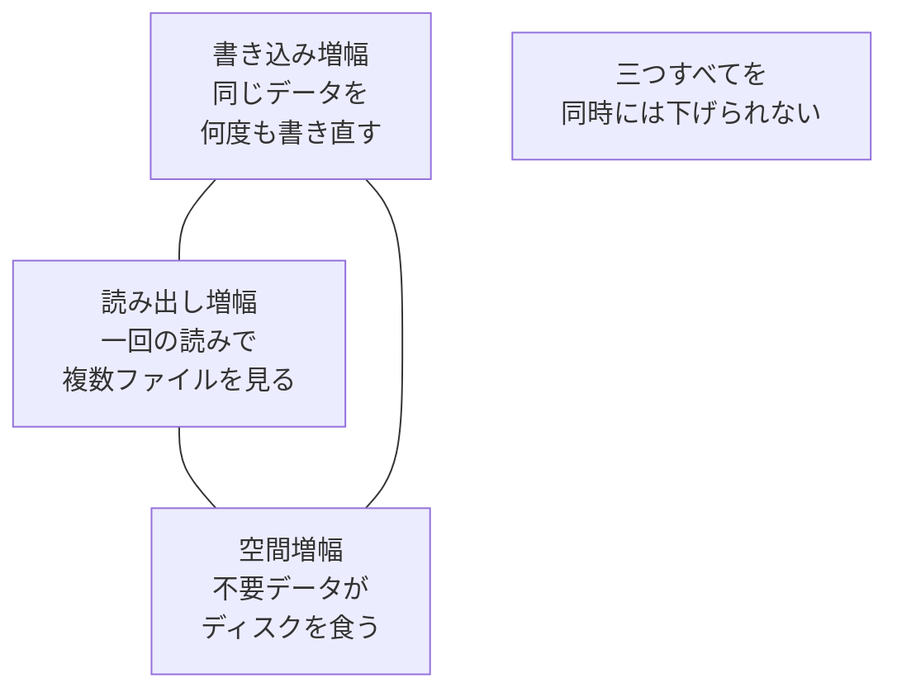
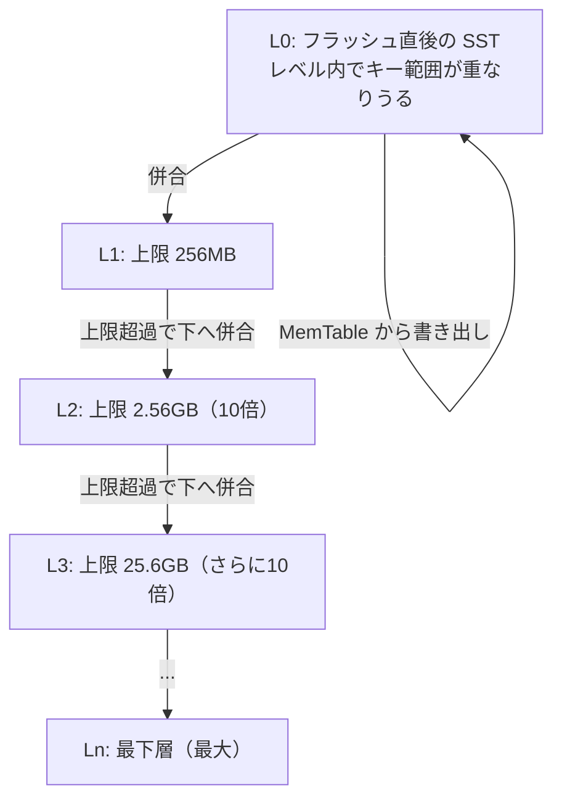

# 第29章 コンパクションの理論

> **本章で読むソース**
>
> - [`db/compaction/compaction.h`](https://github.com/facebook/rocksdb/blob/v11.1.1/db/compaction/compaction.h)
> - [`include/rocksdb/advanced_options.h`](https://github.com/facebook/rocksdb/blob/v11.1.1/include/rocksdb/advanced_options.h)
> - [`include/rocksdb/options.h`](https://github.com/facebook/rocksdb/blob/v11.1.1/include/rocksdb/options.h)
> - [`include/rocksdb/universal_compaction.h`](https://github.com/facebook/rocksdb/blob/v11.1.1/include/rocksdb/universal_compaction.h)
> - [`db/version_set.cc`](https://github.com/facebook/rocksdb/blob/v11.1.1/db/version_set.cc)

## この章の狙い

RocksDB がなぜコンパクションを必要とし、どの設計上のトレードオフのもとで戦略を選ぶのかを理解する。
読み終えたとき、Leveled、Universal、FIFO の三戦略がそれぞれ何を犠牲にして何を優先するのか、そしてレベルのサイズがなぜ等比に並ぶのかを説明できるようになる。
個々の実装ではなく、設計の前提と評価軸を扱う。

## 前提

- [第13章 フラッシュ](../part02-write-path/13-flush.md)（MemTable が L0 の SST として書き出される流れ）
- [第14章 テーブルフォーマット](../part03-sst/14-table-format.md)（SST の構造）
- [第24章 Version と SuperVersion](../part04-read-path/24-version-superversion.md)（どのファイル集合が現在の DB かを管理する仕組み）

## なぜコンパクションが要るのか

LSM ツリーは書き込みを追記として処理する。
更新も削除も、既存の場所を書き換えるのではなく、新しいシーケンス番号を持つレコードを上から積む。
削除は値を消すのではなく、削除を表すマーカーであるトゥームストーン（tombstone）を一件積む。
この方式はランダム書き込みをシーケンシャル書き込みに変えるため書き込みが速いが、代償として同一ユーザーキーの古い版、トゥームストーン、重複が SST のあちこちに残り続ける。

放置すると二つの問題が育つ。
第一に、一つのキーを読むために複数の SST を新しい順にたどる必要が生じ、読み出しが遅くなる。
第二に、上書きされたり削除されたりして論理的にはもう要らないデータがディスクを占有し続ける。
コンパクションは、複数の入力ファイルを読み、同じキーについては最新の有効な版だけを残し、無効になった古い版とトゥームストーンを落として、より少ないファイルへ書き直す操作である。

RocksDB の実装では、この一回の操作の単位が `Compaction` クラスとして表現される。
クラスの役割はヘッダーのコメントに簡潔に書かれている。

[`db/compaction/compaction.h` L82-L83](https://github.com/facebook/rocksdb/blob/v11.1.1/db/compaction/compaction.h#L82-L83)

```cpp
// A Compaction encapsulates metadata about a compaction.
class Compaction {
```

コメントによれば、`Compaction` はコンパクション一回分のメタデータをまとめた入れ物である。
どのレベルのどのファイルを入力にし、どのレベルへ出力するか、出力ファイルの目標サイズはいくつか、といった情報を保持する。
コンストラクタの引数を見ると、入力ファイル群（`std::vector<CompactionInputFiles> inputs`）、出力レベル（`output_level`）、目標ファイルサイズ（`target_file_size`）などがそろっている。

[`db/compaction/compaction.h` L85-L103](https://github.com/facebook/rocksdb/blob/v11.1.1/db/compaction/compaction.h#L85-L103)

```cpp
  Compaction(VersionStorageInfo* input_version,
             const ImmutableOptions& immutable_options,
             const MutableCFOptions& mutable_cf_options,
             const MutableDBOptions& mutable_db_options,
             std::vector<CompactionInputFiles> inputs, int output_level,
             uint64_t target_file_size, uint64_t max_compaction_bytes,
             // ... (中略) ...
             double blob_garbage_collection_age_cutoff = -1);
```

「どのファイルをどう併合するか」という計画は別のコンポーネントが立て、その結果がこの `Compaction` に詰められて実行へ渡る。
計画を立てる Picker は[第30章](30-compaction-picker.md)、実行する Job は[第31章](31-compaction-job.md)で扱う。
本章はその手前にある、戦略を選ぶための評価軸を見る。

## 三つの増幅というトレードオフ

コンパクションをどれだけ、どのように行うかは、三つの増幅のバランスを決める問題に帰着する。
増幅とは、ユーザーが論理的に要求する量に対して、システムが実際に費やす量の比である。

- **書き込み増幅**（write amplification）：ユーザーが一度書いたデータが、コンパクションによって何度も読み直され書き直される度合い。下のレベルへ併合するたびに同じデータが再び書かれるため増える。
- **読み出し増幅**（read amplification）：一回の読み出しで実際に調べるファイルやレベルの数。古い版が複数の場所に散らばっているほど増える。
- **空間増幅**（space amplification）：論理的に有効なデータ量に対して、無効なデータを含めてディスク上に実在する総量の比。回収していない古い版やトゥームストーンが多いほど増える。

この三つは同時に最小化できない。
たとえば書き込み増幅を下げようとすれば併合の頻度を減らすことになり、古い版が残って空間増幅が上がるか、ファイルが散らばって読み出し増幅が上がる。
逆に空間増幅を抑えようと頻繁に併合すれば、同じデータを何度も書き直すぶん書き込み増幅が上がる。
ストレージエンジンの設計では、読み（Read）、更新（Update）、メモリ（Memory）の三つを同時には最適化できないというトレードオフがRUM予想[^rum]として知られており、コンパクション戦略の選択はその一つの現れと見ることができる。



各戦略は、この三角形のどの頂点を犠牲にしてよいかについて立場が違う。
立場の違いは設定で切り替えられる。
切り替えるオプションが `CompactionStyle` である。

[`include/rocksdb/advanced_options.h` L26-L36](https://github.com/facebook/rocksdb/blob/v11.1.1/include/rocksdb/advanced_options.h#L26-L36)

```cpp
enum CompactionStyle : char {
  // level based compaction style
  kCompactionStyleLevel = 0x0,
  // Universal compaction style
  kCompactionStyleUniversal = 0x1,
  // FIFO compaction style
  kCompactionStyleFIFO = 0x2,
  // Disable background compaction. Compaction jobs are submitted
  // via CompactFiles().
  kCompactionStyleNone = 0x3,
};
```

コメントによれば、`kCompactionStyleLevel` が Leveled、`kCompactionStyleUniversal` が Universal、`kCompactionStyleFIFO` が FIFO に対応する。
`kCompactionStyleNone` は自動の背景コンパクションを止め、`CompactFiles()` を通じて手動でジョブを投入する形を指す。
以下では三つの自動戦略を順に見る。

## Leveled コンパクション

Leveled は RocksDB の既定戦略であり、読み出し増幅と空間増幅を小さく保つことを優先し、書き込み増幅は中程度を受け入れる。
SST を L0 から Ln までのレベルに分けて並べ、各レベルにサイズ上限を与える。
L0 を除く各レベルの内部ではキー範囲が重ならないように保たれるため、あるキーは各レベルでたかだか一つの SST にしか存在しない。
これが読み出し増幅を抑える根拠になる。

レベルのサイズ上限は等比数列で増える。
基準になるのが `max_bytes_for_level_base` で、L1 の総サイズの上限を定める。

[`include/rocksdb/options.h` L294-L306](https://github.com/facebook/rocksdb/blob/v11.1.1/include/rocksdb/options.h#L294-L306)

```cpp
  // Control maximum total data size for a level.
  // max_bytes_for_level_base is the max total for level-1.
  // Maximum number of bytes for level L can be calculated as
  // (max_bytes_for_level_base) * (max_bytes_for_level_multiplier ^ (L-1))
  // For example, if max_bytes_for_level_base is 200MB, and if
  // max_bytes_for_level_multiplier is 10, total data size for level-1
  // will be 200MB, total file size for level-2 will be 2GB,
  // and total file size for level-3 will be 20GB.
  //
  // Default: 256MB.
  //
  // Dynamically changeable through SetOptions() API
  uint64_t max_bytes_for_level_base = 256 * 1048576;
```

コメントの式によれば、レベル L の上限は `max_bytes_for_level_base * (max_bytes_for_level_multiplier ^ (L-1))` で求まる。
公比にあたる `max_bytes_for_level_multiplier` の既定値は 10 である。

[`include/rocksdb/advanced_options.h` L667-L670](https://github.com/facebook/rocksdb/blob/v11.1.1/include/rocksdb/advanced_options.h#L667-L670)

```cpp
  // Default: 10.
  //
  // Dynamically changeable through SetOptions() API
  double max_bytes_for_level_multiplier = 10;
```

`max_bytes_for_level_base` の既定が 256MB、公比が 10 なので、L1 が 256MB、L2 が 2.56GB、L3 が 25.6GB と、下のレベルほど 10 倍ずつ大きくなる。



各レベルの実サイズが上限を超えると、そのレベルから次のレベルへ少量ずつ併合が起こる。
あるレベルからファイルを選び、次のレベルでキー範囲が重なるファイルだけを読み込み、併合して書き直す。
等比配分には書き込み増幅を抑える効果がある。
隣り合うレベルのサイズ比が公比に等しいので、上のレベルの一部を下のレベルへ併合するときに読み込む下レベルのデータ量は、上のレベルのデータ量のおおむね公比倍にとどまる。
レベル数は層を一段下げるごとにデータが公比倍に増える対数のオーダーで済むため、データ全体が何度書き直されるかの総量も抑えられる。

どのレベルから先に併合するか、そしてそのレベルの中でどのファイルを選ぶかは別の問題である。
レベル間の優先順位は、各レベルの実サイズを上限で割ったスコアで決める。
このスコアの考え方は [`VersionStorageInfo::ComputeCompactionScore`](https://github.com/facebook/rocksdb/blob/v11.1.1/db/version_set.cc#L3766) のコメントに書かれている。

[`db/version_set.cc` L3771-L3778](https://github.com/facebook/rocksdb/blob/v11.1.1/db/version_set.cc#L3771-L3778)

```cpp
  // Historically, score is defined as actual bytes in a level divided by
  // the level's target size, and 1.0 is the threshold for triggering
  // compaction. Higher score means higher prioritization.
  // Now we keep the compaction triggering condition, but consider more
  // factors for prioritization, while still keeping the 1.0 threshold.
  // In order to provide flexibility for reducing score while still
  // maintaining it to be over 1.0, we scale the original score by 10x
  // if it is larger than 1.0.
```

コメントによれば、スコアは元来「レベルの実バイト数 ÷ そのレベルの目標サイズ」で定義され、1.0 がコンパクション起動のしきい値である。
スコアが高いレベルほど優先される。
現在は起動条件としての 1.0 を保ちつつ、優先順位づけにはより多くの要因を考慮し、1.0 を超えるスコアは 10 倍に拡大して扱う。
L0 だけは扱いが違い、バイト数ではなくファイル数で評価する。
コメントによれば、L0 のファイルは読みのたびに併合されるため、ファイル数が増えすぎないようにしたいからである。

[`db/version_set.cc` L3786-L3796](https://github.com/facebook/rocksdb/blob/v11.1.1/db/version_set.cc#L3786-L3796)

```cpp
      // We treat level-0 specially by bounding the number of files
      // instead of number of bytes for two reasons:
      //
      // (1) With larger write-buffer sizes, it is nice not to do too
      // many level-0 compactions.
      //
      // (2) The files in level-0 are merged on every read and
      // therefore we wish to avoid too many files when the individual
      // file size is small (perhaps because of a small write-buffer
      // setting, or very high compression ratios, or lots of
      // overwrites/deletions).
```

レベルが決まったあと、そのレベル内でどのファイルを選ぶかを決めるのが `CompactionPri` である。

[`include/rocksdb/advanced_options.h` L38-L62](https://github.com/facebook/rocksdb/blob/v11.1.1/include/rocksdb/advanced_options.h#L38-L62)

```cpp
// In Level-based compaction, it Determines which file from a level to be
// picked to merge to the next level. We suggest people try
// kMinOverlappingRatio first when you tune your database.
enum CompactionPri : char {
  // Slightly prioritize larger files by size compensated by #deletes
  kByCompensatedSize = 0x0,
  // ... (中略) ...
  // First compact files whose ratio between overlapping size in next level
  // and its size is the smallest. It in many cases can optimize write
  // amplification.
  // Files marked for compaction will be prioritized over files that are not
  // marked.
  kMinOverlappingRatio = 0x3,
  // ... (中略) ...
};
```

コメントは `kMinOverlappingRatio` をまず試すよう勧めている。
これは、次のレベルでの重なりサイズと自分のサイズの比が最小のファイルを選ぶ方針である。
次のレベルで読み込む量が少ないファイルから併合すれば、同じデータを書き直す量が減る。
コメントが「多くの場合に書き込み増幅を最適化できる」と述べる根拠はここにある。

### 出力ファイルのサイズ

併合した結果を書き出すときの一ファイルあたりの目標サイズは `target_file_size_base` で決まる。

[`include/rocksdb/advanced_options.h` L555-L567](https://github.com/facebook/rocksdb/blob/v11.1.1/include/rocksdb/advanced_options.h#L555-L567)

```cpp
  // Target file size for compaction.
  // target_file_size_base is per-file size for level-1.
  // Target file size for level L can be calculated by
  // target_file_size_base * (target_file_size_multiplier ^ (L-1))
  // For example, if target_file_size_base is 2MB and
  // target_file_size_multiplier is 10, then each file on level-1 will
  // be 2MB, and each file on level 2 will be 20MB,
  // and each file on level-3 will be 200MB.
  //
  // Default: 64MB.
  //
  // Dynamically changeable through SetOptions() API
  uint64_t target_file_size_base = 64 * 1048576;
```

コメントによれば、`target_file_size_base` は L1 の一ファイルあたりのサイズで、既定は 64MB である。
これはレベルの総サイズ上限である `max_bytes_for_level_base` とは別物で、前者が一つの SST の大きさ、後者がレベル全体の容量を指す。
一ファイルを適度な大きさに保つと、併合のたびに動かすファイル単位が細かくなり、一回のコンパクションで触る範囲を局所化できる。

## 動的レベルサイズ

ここまでは各レベルの目標サイズを上から固定で計算する前提で述べた。
これに対し `level_compaction_dynamic_level_bytes` は、目標サイズを実データに合わせて下から決める。
このオプションは v11.1.1 では既定で有効である。

[`include/rocksdb/advanced_options.h` L586-L605](https://github.com/facebook/rocksdb/blob/v11.1.1/include/rocksdb/advanced_options.h#L586-L605)

```cpp
  // If true, RocksDB will pick target size of each level dynamically.
  // We will pick a base level b >= 1. L0 will be directly merged into level b,
  // instead of always into level 1. Level 1 to b-1 need to be empty.
  // We try to pick b and its target size so that
  // 1. target size is in the range of
  //   (max_bytes_for_level_base / max_bytes_for_level_multiplier,
  //    max_bytes_for_level_base]
  // 2. target size of the last level (level num_levels-1) equals to the max
  //    size of a level in the LSM (typically the last level).
  // At the same time max_bytes_for_level_multiplier is still satisfied.
  // Note that max_bytes_for_level_multiplier_additional is ignored with this
  // flag on.
  //
  // With this option on, from an empty DB, we make last level the base level,
  // which means merging L0 data into the last level, until it exceeds
  // max_bytes_for_level_base. And then we make the second last level to be
  // base level, to start to merge L0 data to second last level, with its
  // target size to be 1/max_bytes_for_level_multiplier of the last level's
  // extra size. After the data accumulates more so that we need to move the
  // base level to the third last one, and so on.
```

コメントによれば、L0 を併合する先のレベルである base level を L1 に固定せず、b >= 1 の範囲で選ぶ。
空の DB からは最下層を base level にして L0 を直接そこへ併合し、`max_bytes_for_level_base` を超えたら base level を一段上へ移す。
こうして各レベルの目標サイズは最下層の実データ量を起点に決まり、公比 `max_bytes_for_level_multiplier` で割りながら上へ積み上がる。

ねらいは空間増幅の上限を抑えることである。
コメントは、この方式によって `max_bytes_for_level_base` よりも `max_bytes_for_level_multiplier` を優先し、LSM ツリーの形を予測しやすくすると述べる。

[`include/rocksdb/advanced_options.h` L632-L634](https://github.com/facebook/rocksdb/blob/v11.1.1/include/rocksdb/advanced_options.h#L632-L634)

```cpp
  // By doing it, we give max_bytes_for_level_multiplier a priority against
  // max_bytes_for_level_base, for a more predictable LSM tree shape. It is
  // useful to limit worse case space amplification.
```

固定方式では上の各レベルが必ず上限まで埋まると仮定するため、データ量が中途半端なときに上のレベルが実データに対して大きすぎることがある。
下から決める方式なら、最下層が DB の大半を占めるという LSM ツリーの実際の形に目標サイズが追従するため、無駄に膨らんだ中間レベルを残しにくい。
コメントは、不要になったレベルは下へ併合して自動的に排出され、レベル数が減るぶん読み出し増幅も下げられるとしている。

[`include/rocksdb/advanced_options.h` L647-L654](https://github.com/facebook/rocksdb/blob/v11.1.1/include/rocksdb/advanced_options.h#L647-L654)

```cpp
  // With this option on, unneeded levels will be drained automatically:
  // Note that there may be excessive levels (where target level size is 0 when
  // computed based on this feature) in the LSM. This can happen after a user
  // migrates to turn this feature on or deletes a lot of data. This is
  // especially likely when a user migrates from leveled compaction with a
  // smaller multiplier or from universal compaction. RocksDB will gradually
  // drain these unnecessary levels by compacting files down the LSM. Smaller
  // number of levels should help to reduce read amplification.
```

## Universal コンパクション

Universal は書き込み増幅を抑えることを優先し、その代わりに空間増幅が大きくなりうる戦略である。
Leveled のように各レベルを細かく併合するのではなく、時系列に並んだソート済みラン（sorted run）をまとめて少ない回数で併合する。
そのため同じデータを書き直す回数が減り、書き込み増幅は下がる。

代償は空間増幅にある。
併合される前の古いランがしばらく共存するため、無効なデータがディスクに残りやすい。
RocksDB は空間増幅に上限を設け、それを `max_size_amplification_percent` で制御する。

[`include/rocksdb/universal_compaction.h` L38-L48](https://github.com/facebook/rocksdb/blob/v11.1.1/include/rocksdb/universal_compaction.h#L38-L48)

```cpp
  // The size amplification is defined as the amount (in percentage) of
  // additional storage needed to store a single byte of data in the database.
  // For example, a size amplification of 2% means that a database that
  // contains 100 bytes of user-data may occupy up to 102 bytes of
  // physical storage. By this definition, a fully compacted database has
  // a size amplification of 0%. Rocksdb uses the following heuristic
  // to calculate size amplification: it assumes that all files excluding
  // the earliest file contribute to the size amplification.
  // Default: 200, which means that a 100 byte database could require up to
  // 300 bytes of storage.
  unsigned int max_size_amplification_percent;
```

コメントによれば、ここでいうサイズ増幅は、データ 1 バイトを格納するのに余分に必要となる物理ストレージの割合である。
既定値は 200 で、100 バイトのユーザーデータが最大 300 バイトの物理ストレージを占めうることを意味する。
Leveled の既定構成と比べて空間を多く許す設定であり、書き込み増幅と空間増幅のトレードオフで後者を譲っていることがこの数値に表れている。

## FIFO コンパクション

FIFO は併合という意味でのコンパクションをほとんど行わず、古い SST を捨てるだけの戦略である。
保持する総サイズに上限を設け、超えたら最も古いファイルから削除する。
時系列データのように、新しいデータだけが要り、古いデータは期限が来たら捨ててよい用途に向く。

[`include/rocksdb/advanced_options.h` L70-L83](https://github.com/facebook/rocksdb/blob/v11.1.1/include/rocksdb/advanced_options.h#L70-L83)

```cpp
struct CompactionOptionsFIFO {
  // once the total sum of table files reaches this, we will delete the oldest
  // table file
  // Default: 1GB
  uint64_t max_table_files_size;

  // If true, try to do compaction to compact smaller files into larger ones.
  // Minimum files to compact follows options.level0_file_num_compaction_trigger
  // and compaction won't trigger if average compact bytes per del file is
  // larger than options.write_buffer_size. This is to protect large files
  // from being compacted again.
  // Default: false;
  bool allow_compaction = false;
```

コメントによれば、テーブルファイルの総量が `max_table_files_size`（既定 1GB）に達すると、最も古いテーブルファイルを削除する。
基本的に併合を行わないため書き込み増幅は最小に近いが、有効データだけを残す保証はなく、上限を超えた古いデータは内容にかかわらず捨てられる。
データを失ってよい前提が成り立つ場面で初めて選べる戦略である。
`allow_compaction` を有効にすると、小さいファイルを大きいファイルへまとめる限定的なコンパクションを行う。

## 三戦略の位置づけ

三つの戦略は、三つの増幅のうちどれを優先するかで住み分けている。

| 戦略 | 主に優先するもの | 主に譲るもの | 向く用途 |
| --- | --- | --- | --- |
| Leveled（既定） | 読み出し増幅と空間増幅 | 書き込み増幅は中程度 | 汎用 |
| Universal | 書き込み増幅 | 空間増幅 | 書き込みが多い負荷 |
| FIFO | 書き込み増幅（ほぼ併合しない） | 有効データの保持 | 時系列データ |

どれを選ぶかは、ワークロードがこの三角形のどの辺に余裕を持てるかで決まる。
本章で見たのは戦略を選ぶ評価軸と、それを表すオプションまでである。
選んだ戦略のもとで実際にどのファイルを入力に選ぶかという計画は[第30章 コンパクションの選定](30-compaction-picker.md)、計画された併合を読み書きする実行は[第31章 コンパクションの実行](31-compaction-job.md)、一つのコンパクションを複数スレッドへ分割する並列化は[第32章 サブコンパクション](32-subcompaction.md)で扱う。

## まとめ

- LSM は追記中心のため同一キーの古い版、トゥームストーン（tombstone）、重複が溜まる。コンパクションはこれらを併合し、読みで見るファイル数を減らし、無効になった領域を回収する。
- 書き込み増幅、読み出し増幅、空間増幅の三つは同時に最小化できない。各戦略はどれを譲るかで性格が分かれる。
- Leveled（既定）は読み出し増幅と空間増幅を抑え、書き込み増幅は中程度に置く。レベルの上限は `max_bytes_for_level_base`（既定 256MB）と公比 `max_bytes_for_level_multiplier`（既定 10）で等比に並ぶ。
- Universal は書き込み増幅を抑える代わりに空間増幅を許す。`max_size_amplification_percent` の既定 200 がその許容度を表す。
- FIFO は併合せず古い SST を捨てるだけで、時系列データに向く。`max_table_files_size`（既定 1GB）を超えると最古のファイルを削除する。
- `level_compaction_dynamic_level_bytes`（既定で有効）は各レベルの目標サイズを最下層の実データから下向きに決め、空間増幅の最悪値と読み出し増幅を抑える。

## 関連する章

- [第30章 コンパクションの選定](30-compaction-picker.md)
- [第31章 コンパクションの実行](31-compaction-job.md)
- [第32章 サブコンパクション](32-subcompaction.md)
- [第33章 マージオペレータ](33-merge-operator.md)

[^rum]: RUM 予想（RUM conjecture）。Read、Update、Memory のオーバーヘッドのうち二つを抑えると残る一つが悪化する、というストレージアクセス手法の経験則を指す。
