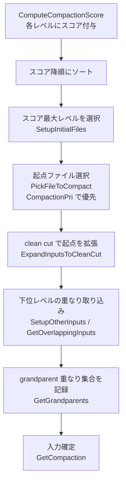
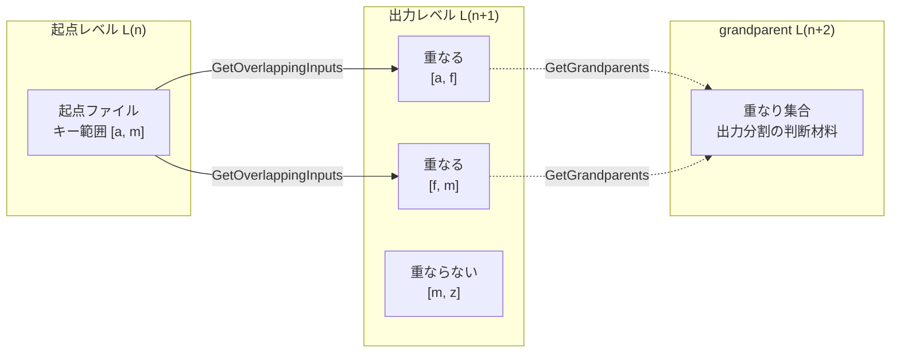

# 第30章 CompactionPicker

> **本章で読むソース**
>
> - [`db/compaction/compaction_picker.h`](https://github.com/facebook/rocksdb/blob/v11.1.1/db/compaction/compaction_picker.h)
> - [`db/compaction/compaction_picker.cc`](https://github.com/facebook/rocksdb/blob/v11.1.1/db/compaction/compaction_picker.cc)
> - [`db/compaction/compaction_picker_level.h`](https://github.com/facebook/rocksdb/blob/v11.1.1/db/compaction/compaction_picker_level.h)
> - [`db/compaction/compaction_picker_level.cc`](https://github.com/facebook/rocksdb/blob/v11.1.1/db/compaction/compaction_picker_level.cc)
> - [`db/compaction/compaction_picker_universal.h`](https://github.com/facebook/rocksdb/blob/v11.1.1/db/compaction/compaction_picker_universal.h)
> - [`db/compaction/compaction_picker_universal.cc`](https://github.com/facebook/rocksdb/blob/v11.1.1/db/compaction/compaction_picker_universal.cc)
> - [`db/compaction/compaction_picker_fifo.h`](https://github.com/facebook/rocksdb/blob/v11.1.1/db/compaction/compaction_picker_fifo.h)
> - [`db/compaction/compaction_picker_fifo.cc`](https://github.com/facebook/rocksdb/blob/v11.1.1/db/compaction/compaction_picker_fifo.cc)
> - [`db/version_set.cc`](https://github.com/facebook/rocksdb/blob/v11.1.1/db/version_set.cc)

## この章の狙い

コンパクションを「いつ、どのファイルを対象に」起動するかを決めるのが `CompactionPicker` である。
本章では、各レベルにスコアを与える `ComputeCompactionScore` から、Leveled の起点ファイル選定と重なり取り込み、Universal と FIFO の選定方針までを追う。
読み終えると、書き込み増幅を抑えるために選定がどんな機構を使っているかを、コードの位置とともに説明できるようになる。

## 前提

- コンパクションの目的と各方式の理論的背景は [第29章 コンパクション理論](./29-compaction-theory.md) で扱う。
- 選定されたコンパクションを実行する側は [第31章 CompactionJob](./31-compaction-job.md) で扱う。
- レベルとファイルの状態を保持する `VersionStorageInfo` は [第24章 Version と SuperVersion](../part04-read-path/24-version-superversion.md) を前提とする。

## CompactionPicker という層の位置づけ

`CompactionPicker` は、既存の LSM ツリーから「次に併合すべき入力ファイルの集合と出力先レベル」を選ぶ抽象クラスである。
方式ごとにサブクラスが派生し、`PickCompaction` を実装する。

[`db/compaction/compaction_picker.h` L48-L69](https://github.com/facebook/rocksdb/blob/v11.1.1/db/compaction/compaction_picker.h#L48-L69)

```cpp
class CompactionPicker {
 public:
  // ...
  // Pick level and inputs for a new compaction.
  //
  // Returns nullptr if there is no compaction to be done.
  // Otherwise returns a pointer to a heap-allocated object that
  // describes the compaction.  Caller should delete the result.
  // ...
  virtual Compaction* PickCompaction(
      const std::string& cf_name, const MutableCFOptions& mutable_cf_options,
      const MutableDBOptions& mutable_db_options,
      const std::vector<SequenceNumber>& existing_snapshots,
      const SnapshotChecker* snapshot_checker, VersionStorageInfo* vstorage,
      LogBuffer* log_buffer, const std::string& full_history_ts_low,
      bool require_max_output_level = false) = 0;
```

呼び出し側はまず `NeedsCompaction` で対象があるかを判定し、真なら `PickCompaction` を呼んで入力集合を確定する。
`PickCompaction` は対象がなければ `nullptr` を返す。
方式ごとの実装クラスは次の三つである。
`LevelCompactionPicker`（Leveled）、`UniversalCompactionPicker`（Universal）、`FIFOCompactionPicker`（FIFO）。
このほか、自動コンパクションを起こさないダミーの `NullCompactionPicker` がある。

ユーザーが明示的に範囲を指定する手動コンパクション（`DB::CompactRange`）は、自動コンパクションとは別の入口を通る。
基底クラスの非仮想メンバ `PickCompactionForCompactRange` がそれで、方式ごとの差は小さい。

[`db/compaction/compaction_picker.h` L44-L47](https://github.com/facebook/rocksdb/blob/v11.1.1/db/compaction/compaction_picker.h#L44-L47)

```cpp
// Non-virtual functions CompactRange() and CompactFiles() are used to
// pick files to compact based on users' DB::CompactRange() and
// DB::CompactFiles() requests, respectively. There is little
// compaction style specific logic for them.
```

本章は自動コンパクションの選定に焦点を当てる。
手動コンパクションの全体像は本章の末尾で簡潔に触れる。

## スコア計算

Leveled の選定は、各レベルに付けたスコアの大きい順にレベルを処理することから始まる。
スコアは `VersionStorageInfo::ComputeCompactionScore` が計算する。
基本の定義は「あるレベルの実バイト数を、そのレベルの目標サイズで割った値」であり、1.0 がコンパクション起動の閾値になる。

[`db/version_set.cc` L3771-L3779](https://github.com/facebook/rocksdb/blob/v11.1.1/db/version_set.cc#L3771-L3779)

```cpp
  // Historically, score is defined as actual bytes in a level divided by
  // the level's target size, and 1.0 is the threshold for triggering
  // compaction. Higher score means higher prioritization.
  // Now we keep the compaction triggering condition, but consider more
  // factors for prioritization, while still keeping the 1.0 threshold.
  // In order to provide flexibility for reducing score while still
  // maintaining it to be over 1.0, we scale the original score by 10x
  // if it is larger than 1.0.
  const double kScoreScale = 10.0;
```

L0 だけはバイト数ではなくファイル数で評価する。
個々の L0 ファイルが小さいことが多く、しかも L0 のファイルは読み取りのたびに重ね合わされるため、バイト量よりファイル数を抑えるほうが読み取り効率に直結するからである。
L0 のスコアは「ソート済みラン数を `level0_file_num_compaction_trigger` で割った値」を基本とする。

[`db/version_set.cc` L3855-L3861](https://github.com/facebook/rocksdb/blob/v11.1.1/db/version_set.cc#L3855-L3861)

```cpp
      } else {
        // For universal compaction, if a user configures `max_read_amp`, then
        // the score may be a false positive signal.
        // `level0_file_num_compaction_trigger` is used as a trigger to check
        // if there is any compaction work to do.
        score = static_cast<double>(num_sorted_runs) /
                mutable_cf_options.level0_file_num_compaction_trigger;
```

L1 以降は、コンパクション中でないファイルの補正サイズ合計を、そのレベルの上限サイズで割る。

[`db/version_set.cc` L3908-L3920](https://github.com/facebook/rocksdb/blob/v11.1.1/db/version_set.cc#L3908-L3920)

```cpp
    } else {  // level > 0
      // Compute the ratio of current size to size limit.
      uint64_t level_bytes_no_compacting = 0;
      uint64_t level_total_bytes = 0;
      for (auto f : files_[level]) {
        level_total_bytes += f->fd.GetFileSize();
        if (!f->being_compacted) {
          level_bytes_no_compacting += f->compensated_file_size;
        }
      }
      if (!immutable_options.level_compaction_dynamic_level_bytes) {
        score = static_cast<double>(level_bytes_no_compacting) /
                MaxBytesForLevel(level);
```

ここで補正サイズ（`compensated_file_size`）を使うのが効いている。
削除マーカー（トゥームストーン（tombstone））を多く含むファイルは、実バイト数より大きく見積もられ、スコアが上がる。
削除を早くコンパクションへ送り込むことで、無効になったエントリの回収を促す狙いがある。

スコアを全レベル分そろえたら、降順に並べ替える。
レベル数が少ないのでバブルソートで足りる。

[`db/version_set.cc` L3956-L3969](https://github.com/facebook/rocksdb/blob/v11.1.1/db/version_set.cc#L3956-L3969)

```cpp
  // sort all the levels based on their score. Higher scores get listed
  // first. Use bubble sort because the number of entries are small.
  for (int i = 0; i < num_levels() - 2; i++) {
    for (int j = i + 1; j < num_levels() - 1; j++) {
      if (compaction_score_[i] < compaction_score_[j]) {
        double score = compaction_score_[i];
        int level = compaction_level_[i];
        compaction_score_[i] = compaction_score_[j];
        compaction_level_[i] = compaction_level_[j];
        compaction_score_[j] = score;
        compaction_level_[j] = level;
      }
    }
  }
```

並べ替え後、`compaction_score_[i]` と `compaction_level_[i]` は「i 番目に優先したいレベルとそのスコア」を表す。
選定側はこの配列を先頭から走査し、スコアが 1.0 を超える最初のレベルを起点にする。

## Leveled の選定

Leveled の `PickCompaction` は `LevelCompactionBuilder` に委譲し、ビルダが段階的に入力集合を組み立てる。

[`db/compaction/compaction_picker_level.cc` L986-L997](https://github.com/facebook/rocksdb/blob/v11.1.1/db/compaction/compaction_picker_level.cc#L986-L997)

```cpp
Compaction* LevelCompactionPicker::PickCompaction(
    const std::string& cf_name, const MutableCFOptions& mutable_cf_options,
    const MutableDBOptions& mutable_db_options,
    const std::vector<SequenceNumber>& /*existing_snapshots */,
    const SnapshotChecker* /*snapshot_checker*/, VersionStorageInfo* vstorage,
    LogBuffer* log_buffer, const std::string& full_history_ts_low,
    bool /* require_max_output_level*/) {
  LevelCompactionBuilder builder(cf_name, vstorage, this, log_buffer,
                                 mutable_cf_options, ioptions_,
                                 mutable_db_options, full_history_ts_low);
  return builder.PickCompaction();
}
```

ビルダの `PickCompaction` は四つの段階を順に呼ぶ。
起点ファイルの選定（`SetupInitialFiles`）、L0 起点なら他の L0 ファイルの取り込み（`SetupOtherL0FilesIfNeeded`）、出力レベルの重なりファイル取り込みと起点側の拡張（`SetupOtherInputsIfNeeded`）、そして `Compaction` オブジェクトの組み立て（`GetCompaction`）である。

[`db/compaction/compaction_picker_level.cc` L520-L547](https://github.com/facebook/rocksdb/blob/v11.1.1/db/compaction/compaction_picker_level.cc#L520-L547)

```cpp
Compaction* LevelCompactionBuilder::PickCompaction() {
  // Pick up the first file to start compaction. It may have been extended
  // to a clean cut.
  SetupInitialFiles();
  if (start_level_inputs_.empty()) {
    return nullptr;
  }
  assert(start_level_ >= 0 && output_level_ >= 0);

  // If it is a L0 -> base level compaction, we need to set up other L0
  // files if needed.
  if (!SetupOtherL0FilesIfNeeded()) {
    return nullptr;
  }

  // Pick files in the output level and expand more files in the start level
  // if needed.
  if (!SetupOtherInputsIfNeeded()) {
    return nullptr;
  }

  // Form a compaction object containing the files we picked.
  Compaction* c = GetCompaction();
  // ...
}
```

### スコア最大レベルでの起点選び

`SetupInitialFiles` は、スコア降順に並んだレベルを先頭から走査する。
スコアが 1.0 以上のレベルで `PickFileToCompact` を呼び、起点ファイルが取れたらそこで打ち切る。
スコアが 1.0 未満になった時点で、それ以降のレベルは閾値を下回ると分かっているので走査をやめる。

[`db/compaction/compaction_picker_level.cc` L204-L257](https://github.com/facebook/rocksdb/blob/v11.1.1/db/compaction/compaction_picker_level.cc#L204-L257)

```cpp
void LevelCompactionBuilder::SetupInitialFiles() {
  // Find the compactions by size on all levels.
  bool skipped_l0_to_base = false;
  for (int i = 0; i < compaction_picker_->NumberLevels() - 1; i++) {
    start_level_score_ = vstorage_->CompactionScore(i);
    start_level_ = vstorage_->CompactionScoreLevel(i);
    assert(i == 0 || start_level_score_ <= vstorage_->CompactionScore(i - 1));
    if (start_level_score_ >= 1) {
      // ...
      output_level_ =
          (start_level_ == 0) ? vstorage_->base_level() : start_level_ + 1;
      bool picked_file_to_compact = PickFileToCompact();
      // ...
      if (picked_file_to_compact) {
        // found the compaction!
        // ...
        break;
      } else {
        // ...
      }
    } else {
      // Compaction scores are sorted in descending order, no further scores
      // will be >= 1.
      break;
    }
  }
```

サイズ起因の対象が見つからなければ、`SetupInitialFiles` の後半でマーク済みファイル、最下層の削除回収、TTL、定期コンパクション、ブロブ GC の順に当たる。
これらの順序は、緊急度の高いものから当てる優先順位になっている。

### 起点ファイルの優先度

`PickFileToCompact` は、起点レベルの中でどのファイルから併合するかを決める。
ここで使うのが `FilesByCompactionPri` の並びで、`CompactionPri` の設定に応じて事前に並べ替えてある。

[`db/compaction/compaction_picker_level.cc` L826-L856](https://github.com/facebook/rocksdb/blob/v11.1.1/db/compaction/compaction_picker_level.cc#L826-L856)

```cpp
  const std::vector<FileMetaData*>& level_files =
      vstorage_->LevelFiles(start_level_);

  // Pick the file with the highest score in this level that is not already
  // being compacted.
  const std::vector<int>& file_scores =
      vstorage_->FilesByCompactionPri(start_level_);

  unsigned int cmp_idx;
  for (cmp_idx = vstorage_->NextCompactionIndex(start_level_);
       cmp_idx < file_scores.size(); cmp_idx++) {
    int index = file_scores[cmp_idx];
    auto* f = level_files[index];

    // do not pick a file to compact if it is being compacted
    // from n-1 level.
    if (f->being_compacted) {
      if (ioptions_.compaction_pri == kRoundRobin) {
        // TODO(zichen): this file may be involved in one compaction from
        // an upper level, cannot advance the cursor for round-robin policy.
        // Currently, we do not pick any file to compact in this case. We
        // should fix this later to ensure a compaction is picked but the
        // cursor shall not be advanced.
        return false;
      }
      continue;
    }

    start_level_inputs_.files.push_back(f);
    if (!compaction_picker_->ExpandInputsToCleanCut(cf_name_, vstorage_,
                                                    &start_level_inputs_) ||
```

並びを作るのは `VersionStorageInfo::UpdateFilesByCompactionPri` である。
`CompactionPri` の値ごとに比較関数を切り替える。

[`db/version_set.cc` L4449-L4479](https://github.com/facebook/rocksdb/blob/v11.1.1/db/version_set.cc#L4449-L4479)

```cpp
    switch (ioptions.compaction_pri) {
      case kByCompensatedSize:
        std::partial_sort(temp.begin(), temp.begin() + num, temp.end(),
                          CompareCompensatedSizeDescending);
        break;
      case kOldestLargestSeqFirst:
        // ...
      case kOldestSmallestSeqFirst:
        // ...
      case kMinOverlappingRatio:
        SortFileByOverlappingRatio(*internal_comparator_, files_[level],
                                   files_[level + 1], ioptions.clock, level,
                                   num_non_empty_levels_, options.ttl, &temp);
        break;
      case kRoundRobin:
        SortFileByRoundRobin(*internal_comparator_, &compact_cursor_,
                             level0_non_overlapping_, level, &temp);
        break;
      default:
        assert(false);
    }
```

既定値は `kMinOverlappingRatio` で、`compaction_pri` のコメントでも最初に試すよう勧めている。

[`include/rocksdb/advanced_options.h` L51-L56](https://github.com/facebook/rocksdb/blob/v11.1.1/include/rocksdb/advanced_options.h#L51-L56)

```cpp
  // First compact files whose ratio between overlapping size in next level
  // and its size is the smallest. It in many cases can optimize write
  // amplification.
  // Files marked for compaction will be prioritized over files that are not
  // marked.
  kMinOverlappingRatio = 0x3,
```

このオプションは、起点ファイル自身のサイズに対して、下位レベルで重なるファイルの合計サイズが小さいものを先に選ぶ。
重なりが小さいファイルを併合するほど、下位レベルから巻き込んで書き直すバイト数が減る。
つまり同じ起点サイズでも、出力として書き戻す総量が小さくて済む組み合わせを優先することで、書き込み増幅を直接下げにいく。

### 下位レベルの重なりファイル取り込み

起点ファイルが決まると、その鍵範囲と重なる下位レベルのファイルを取り込む。
取り込みは `SetupOtherInputs` が担い、内部で `GetOverlappingInputs` を使って出力レベルの重なりファイルを集める。

[`db/compaction/compaction_picker.cc` L545-L562](https://github.com/facebook/rocksdb/blob/v11.1.1/db/compaction/compaction_picker.cc#L545-L562)

```cpp
  InternalKey smallest, largest;

  // Get the range one last time.
  GetRange(*inputs, &smallest, &largest);

  // Populate the set of next-level files (inputs_GetOutputLevelInputs()) to
  // include in compaction
  vstorage->GetOverlappingInputs(output_level, &smallest, &largest,
                                 &output_level_inputs->files, *parent_index,
                                 parent_index);
  if (AreFilesInCompaction(output_level_inputs->files)) {
    return false;
  }
  if (!output_level_inputs->empty()) {
    if (!ExpandInputsToCleanCut(cf_name, vstorage, output_level_inputs)) {
      return false;
    }
  }
```

### clean cut でキー境界をそろえる

`ExpandInputsToCleanCut` は、入力集合の鍵範囲が周囲のファイルと「きれいに切れる」境界になるまで入力を拡張する。
同じユーザーキーが複数のファイルにまたがるとき、片方だけを併合してしまうと、新しい版を下位へ送りつつ古い版を上位に残してしまう。
読み取りはレベルの浅い順に探すので、これでは古い値を返しかねない。
これを防ぐのが clean cut である。

[`db/compaction/compaction_picker.cc` L289-L303](https://github.com/facebook/rocksdb/blob/v11.1.1/db/compaction/compaction_picker.cc#L289-L303)

```cpp
  InternalKey smallest, largest;

  // Keep expanding inputs until we are sure that there is a "clean cut"
  // boundary between the files in input and the surrounding files.
  // This will ensure that no parts of a key are lost during compaction.
  int hint_index = -1;
  size_t old_size;
  do {
    old_size = inputs->size();
    GetRange(*inputs, &smallest, &largest);
    inputs->clear();
    vstorage->GetOverlappingInputs(level, &smallest, &largest, &inputs->files,
                                   hint_index, &hint_index, true, nullptr,
                                   next_smallest);
  } while (inputs->size() > old_size);
```

`GetOverlappingInputs` を呼ぶと重なるファイルが集まり、その分だけ鍵範囲が広がる。
広がった範囲で再び重なりを集めると、さらにファイルが増えることがある。
増えなくなる（`inputs->size()` が前回と同じになる）まで繰り返すことで、境界の両側で同じユーザーキーが分断されない状態に収束させる。
拡張後の入力に既に別のコンパクション中のファイルが混じっていたら、競合するのでこのコンパクションは取りやめる。

L0 は例外で、ファイル同士が鍵範囲で重なりうるため拡張処理を行わない。
`GetOverlappingInputs` が L0 向けに範囲を広げながら重なりを集める動作をするので、`ExpandInputsToCleanCut` は L0 では何もせず真を返す。

[`db/compaction/compaction_picker.cc` L282-L287](https://github.com/facebook/rocksdb/blob/v11.1.1/db/compaction/compaction_picker.cc#L282-L287)

```cpp
  const int level = inputs->level;
  // GetOverlappingInputs will always do the right thing for level-0.
  // So we don't need to do any expansion if level == 0.
  if (level == 0) {
    return true;
  }
```

### grandparent の重なり制限で出力肥大を抑える

出力レベルのさらに下のレベル（grandparent）と大きく重なる出力を作ると、そのファイルは次のコンパクションで膨大な書き戻しを引き起こす。
これを抑えるため、選定の最後に grandparent の重なりファイルを集めておく。

[`db/compaction/compaction_picker_level.cc` L510-L513](https://github.com/facebook/rocksdb/blob/v11.1.1/db/compaction/compaction_picker_level.cc#L510-L513)

```cpp
    if (!is_l0_trivial_move_) {
      compaction_picker_->GetGrandparents(vstorage_, start_level_inputs_,
                                          output_level_inputs_, &grandparents_);
    }
```

`GetGrandparents` は、出力レベルの一つ下から順に、入力の鍵範囲と重なるファイルが現れる最初のレベルを探し、その重なり集合を grandparent として記録する。

[`db/compaction/compaction_picker.cc` L650-L666](https://github.com/facebook/rocksdb/blob/v11.1.1/db/compaction/compaction_picker.cc#L650-L666)

```cpp
void CompactionPicker::GetGrandparents(
    VersionStorageInfo* vstorage, const CompactionInputFiles& inputs,
    const CompactionInputFiles& output_level_inputs,
    std::vector<FileMetaData*>* grandparents) {
  InternalKey start, limit;
  GetRange(inputs, output_level_inputs, &start, &limit);
  // Compute the set of grandparent files that overlap this compaction
  // (parent == level+1; grandparent == level+2 or the first
  // level after that has overlapping files)
  for (int level = output_level_inputs.level + 1; level < NumberLevels();
       level++) {
    vstorage->GetOverlappingInputs(level, &start, &limit, grandparents);
    if (!grandparents->empty()) {
      break;
    }
  }
}
```

記録した grandparent は `Compaction` オブジェクトに渡され、出力ファイルを切る位置の判断に使われる。
実行時に grandparent との重なりが `max_compaction_bytes` を超えそうになると出力ファイルを区切る、という形で効く。
この出力分割の判断は次章の実行側で扱う。
選定側の役割は、その判断材料となる grandparent 集合を組み立てて `Compaction` に持たせることである。

Trivial move（鍵範囲が下位と重ならず、コピーせず移動できるケース）の判定にも grandparent サイズが使われる。
移動先の一つ下のレベルとの重なりが `max_compaction_bytes` を超えるなら、後の書き戻しが大きくなるので trivial move を見送る。

[`db/compaction/compaction.cc` L604-L615](https://github.com/facebook/rocksdb/blob/v11.1.1/db/compaction/compaction.cc#L604-L615)

```cpp
  if (output_level_ + 1 < number_levels_) {
    std::unique_ptr<SstPartitioner> partitioner = CreateSstPartitioner();
    for (const auto& file : inputs_.front().files) {
      std::vector<FileMetaData*> file_grand_parents;
      input_vstorage_->GetOverlappingInputs(output_level_ + 1, &file->smallest,
                                            &file->largest,
                                            &file_grand_parents);
      const auto compaction_size =
          file->fd.GetFileSize() + TotalFileSize(file_grand_parents);
      if (compaction_size > max_compaction_bytes_) {
        return false;
      }
```

### 選定の全体像

ここまでの流れを図にまとめる。



起点ファイルと下位レベルの取り込みの関係は次のとおりである。



## Universal の選定

Universal は、各レベルとそれぞれの L0 ファイルを「ソート済みラン」として一列に並べ、隣り合うランをサイズ比で束ねる。
`PickCompaction` は、サイズ増幅の抑制、ファイル比、ソート済みラン数の削減、削除起因の順に方針を試す。

[`db/compaction/compaction_picker_universal.cc` L776-L784](https://github.com/facebook/rocksdb/blob/v11.1.1/db/compaction/compaction_picker_universal.cc#L776-L784)

```cpp
  Compaction* c = nullptr;

  c = MaybePickPeriodicCompaction(c);
  c = MaybePickSizeAmpCompaction(c, file_num_compaction_trigger);
  c = MaybePickCompactionToReduceSortedRunsBasedFileRatio(
      c, file_num_compaction_trigger, ratio);
  c = MaybePickCompactionToReduceSortedRuns(c, file_num_compaction_trigger,
                                            ratio);
  c = MaybePickDeleteTriggeredCompaction(c);
```

ソート済みラン群を作るのが `CalculateSortedRuns` で、L0 はファイルごとに一つのラン、L1 以降はレベル全体で一つのランとして扱う。
中核となるサイズ比の束ね方は `PickCompactionToReduceSortedRuns` にある。
先頭の候補ランから順に、これまでに積んだサイズを `size_ratio` の分だけ増やした値が次のランより大きい限り、隣のランを足していく。

[`db/compaction/compaction_picker_universal.cc` L955-L981](https://github.com/facebook/rocksdb/blob/v11.1.1/db/compaction/compaction_picker_universal.cc#L955-L981)

```cpp
      // Pick files if the total/last candidate file size (increased by the
      // specified ratio) is still larger than the next candidate file.
      // candidate_size is the total size of files picked so far with the
      // default kCompactionStopStyleTotalSize; with
      // kCompactionStopStyleSimilarSize, it's simply the size of the last
      // picked file.
      double sz = candidate_size * (100.0 + ratio) / 100.0;
      if (sz < static_cast<double>(succeeding_sr->size)) {
        break;
      }
      // ...
      } else {  // default kCompactionStopStyleTotalSize
        candidate_size += succeeding_sr->compensated_file_size;
      }
      candidate_count++;
```

サイズ比でそろったランだけを束ねるので、大きさの近いランが連続する区間が一度のコンパクション対象になる。
束ねた本数が `min_merge_width` に満たなければ、その区間は採用せず次の候補へ進む。
本章ではサイズ比による束ねの骨格までを扱う。
ソート済みランの考え方と各方針の理論的な狙いは第29章で扱う。

## FIFO の選定

FIFO は併合ではなく、合計サイズや TTL の超過を契機に古い SST を落とす方式である。
`PickCompaction` は TTL、サイズ、L0 内併合、温度変更の順に試す。

[`db/compaction/compaction_picker_fifo.cc` L737-L753](https://github.com/facebook/rocksdb/blob/v11.1.1/db/compaction/compaction_picker_fifo.cc#L737-L753)

```cpp
  Compaction* c = nullptr;
  if (mutable_cf_options.ttl > 0) {
    c = PickTTLCompaction(cf_name, mutable_cf_options, mutable_db_options,
                          vstorage, log_buffer);
  }
  if (c == nullptr) {
    c = PickSizeCompaction(cf_name, mutable_cf_options, mutable_db_options,
                           vstorage, log_buffer);
  }
  // Intra-L0 compaction merges small files to reduce file count.
  // It runs after size-based dropping: if PickSizeCompaction dropped files,
  // it returned non-null and we skip this. Otherwise, we try to reduce
  // L0 file count by merging small files together.
  if (c == nullptr) {
    c = PickIntraL0Compaction(cf_name, mutable_cf_options, mutable_db_options,
                              vstorage, log_buffer);
  }
```

サイズ起因の `PickSizeCompaction` は、全レベルの SST 合計サイズが上限を超えていなければ何もしない。

[`db/compaction/compaction_picker_fifo.cc` L233-L235](https://github.com/facebook/rocksdb/blob/v11.1.1/db/compaction/compaction_picker_fifo.cc#L233-L235)

```cpp
  if (last_level == 0 && effective_size <= effective_max) {
    return nullptr;
  }
```

超過しているときは、最も古いファイル（L0 では右端）から順に削除対象へ積み、残りサイズが上限以下に収まったところで止める。

[`db/compaction/compaction_picker_fifo.cc` L265-L284](https://github.com/facebook/rocksdb/blob/v11.1.1/db/compaction/compaction_picker_fifo.cc#L265-L284)

```cpp
    // In L0, right-most files are the oldest files.
    for (auto ritr = last_level_files.rbegin(); ritr != last_level_files.rend();
         ++ritr) {
      auto f = *ritr;
      if (fifo_opts.max_data_files_size > 0) {
        remaining_size -= std::min(remaining_size, data_per_file);
      } else {
        remaining_size -= std::min(remaining_size, f->fd.file_size);
      }
      inputs[0].files.push_back(f);
      // ...
      if (remaining_size <= effective_max) {
        break;
      }
    }
```

TTL 起因の `PickTTLCompaction` は、ファイルの推定最終更新時刻が `current_time - ttl` より古いものを落とす。
最も古い側から走査し、TTL 以内のファイルに当たった時点で打ち切る。

[`db/compaction/compaction_picker_fifo.cc` L101-L115](https://github.com/facebook/rocksdb/blob/v11.1.1/db/compaction/compaction_picker_fifo.cc#L101-L115)

```cpp
  if (current_time > mutable_cf_options.ttl) {
    for (auto ritr = level_files.rbegin(); ritr != level_files.rend(); ++ritr) {
      FileMetaData* f = *ritr;
      assert(f);
      TableReader* reader = f->fd.pinned_reader.Get();
      if (reader != nullptr && reader->GetTableProperties() != nullptr) {
        uint64_t newest_key_time = f->TryGetNewestKeyTime();
        uint64_t creation_time = reader->GetTableProperties()->creation_time;
        uint64_t est_newest_key_time = newest_key_time == kUnknownNewestKeyTime
                                           ? creation_time
                                           : newest_key_time;
        if (est_newest_key_time == kUnknownNewestKeyTime ||
            est_newest_key_time >= (current_time - mutable_cf_options.ttl)) {
          break;
        }
```

## 手動コンパクションの入口

ユーザーが `DB::CompactRange` で範囲を指定したときは、基底クラスの `PickCompactionForCompactRange` が入口になる。
自動コンパクションがスコアで起点レベルを選ぶのに対し、手動では入力レベルと出力レベルが呼び出し側から与えられる。
FIFO だけは独自実装を持ち、それ以外の方式は基底の共通実装を使う。

[`db/compaction/compaction_picker.cc` L676-L677](https://github.com/facebook/rocksdb/blob/v11.1.1/db/compaction/compaction_picker.cc#L676-L677)

```cpp
  // CompactionPickerFIFO has its own implementation of compact range
  assert(ioptions_.compaction_style != kCompactionStyleFIFO);
```

範囲が指定されても、出力ファイルの境界をそろえる必要は自動コンパクションと同じである。
そのため `PickCompactionForCompactRange` も内部で `ExpandInputsToCleanCut` や `GetGrandparents` を呼ぶ。

## まとめ

- `CompactionPicker` は「いつ、どのファイルを併合するか」を決める層で、方式ごとに `LevelCompactionPicker` / `UniversalCompactionPicker` / `FIFOCompactionPicker` が派生する。
- `ComputeCompactionScore` が各レベルにスコアを与える。
  L0 はファイル数、L1 以降は補正サイズと上限サイズの比で、1.0 が起動閾値である。
  スコアは降順に並べ替えられ、Leveled はスコア最大レベルを起点にする。
- 起点ファイルは `CompactionPri`（既定は `kMinOverlappingRatio`）で優先順位を付け、下位レベルとの重なりが小さいものを選んで書き込み増幅を下げる。
- `ExpandInputsToCleanCut` は同じユーザーキーが分断されない clean cut まで入力を拡張し、古い版を上位に残す事故を防ぐ。
- `GetGrandparents` が記録する grandparent 重なり集合は、出力ファイルを区切る判断材料となり、出力の肥大と後続の書き戻し増加を抑える。
- Universal はソート済みランをサイズ比で束ね、FIFO は合計サイズや TTL の超過で古い SST を落とす。
  手動コンパクションは入力と出力のレベルが外から与えられる別の入口を通る。

## 関連する章

- [第29章 コンパクション理論](./29-compaction-theory.md)：スコアや方式の理論的背景。
- [第31章 CompactionJob](./31-compaction-job.md)：選定した入力を実際に併合する実行側。
- [第32章 サブコンパクション](./32-subcompaction.md)：選定した範囲の並列分割。
