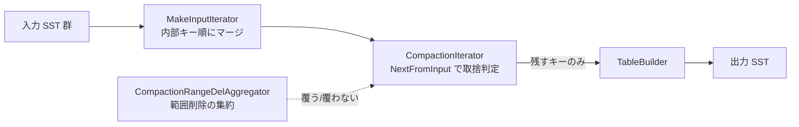
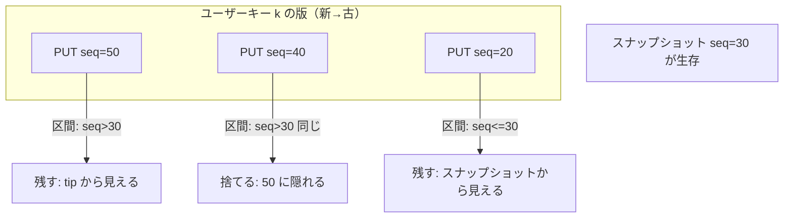

# 第31章 CompactionJob と CompactionIterator

> **本章で読むソース**
> - [`db/compaction/compaction_job.h`](https://github.com/facebook/rocksdb/blob/v11.1.1/db/compaction/compaction_job.h)
> - [`db/compaction/compaction_job.cc`](https://github.com/facebook/rocksdb/blob/v11.1.1/db/compaction/compaction_job.cc)
> - [`db/compaction/compaction_iterator.h`](https://github.com/facebook/rocksdb/blob/v11.1.1/db/compaction/compaction_iterator.h)
> - [`db/compaction/compaction_iterator.cc`](https://github.com/facebook/rocksdb/blob/v11.1.1/db/compaction/compaction_iterator.cc)
> - [`db/compaction/compaction_outputs.h`](https://github.com/facebook/rocksdb/blob/v11.1.1/db/compaction/compaction_outputs.h)
> - [`db/range_del_aggregator.h`](https://github.com/facebook/rocksdb/blob/v11.1.1/db/range_del_aggregator.h)

## この章の狙い

第30章までで、どのファイルをコンパクションの入力に選ぶかが決まった。
本章は、選ばれた入力 SST 群を実際に読み、不要になったキーを捨て、残すべきキーだけを新しい SST へ書き出す実行エンジンを読む。
中心は二つのクラスである。
`CompactionJob` がコンパクション全体の段取りと出力ファイルの差し替えを担い、`CompactionIterator` が一件ごとに「捨てるか残すか」を判定する。
読了後には、古い版とトゥームストーン（tombstone）をなぜ捨ててよいのか、そしてスナップショットがその判断をどう縛るのかを、機構として説明できるようになる。

## 前提

- [第15章 BlockBasedTableBuilder](../part03-sst/15-block-based-table-builder.md)：出力 SST を書く `TableBuilder`。
- [第26章 イテレータ](../part04-read-path/26-iterators.md)：入力をマージする内部イテレータ。
- [第30章 CompactionPicker](./30-compaction-picker.md)：入力ファイルの選択。

## CompactionJob の三段階

`CompactionJob` は、手動か自動かを問わず一回のコンパクションに対応するオブジェクトである。
クラス先頭のコメントは、その生涯を `Prepare()` から `Run()` を経て `Install()` へ進む三段階として説明している。

[`db/compaction/compaction_job.h` L63-L67](https://github.com/facebook/rocksdb/blob/v11.1.1/db/compaction/compaction_job.h#L63-L67)

```cpp
// CompactionJob is responsible for executing the compaction. Each (manual or
// automated) compaction corresponds to a CompactionJob object, and usually
// goes through the stages of `Prepare()`->`Run()`->`Install()`. CompactionJob
// will divide the compaction into subcompactions and execute them in parallel
// if needed.
```

三段階は、ロックの保持と並列度の点で性格が分かれている。
`Prepare` は DB の `mutex_` を保持したまま走り、入力を複数のサブコンパクションへ分割する境界を決める。
`Run` は `mutex_` を手放して走り、各サブコンパクションを別スレッドで並行に進めて出力 SST を書く。
`Install` は再び `mutex_` を保持して、入力ファイルの削除と出力ファイルの追加を一つの `VersionEdit` にまとめ、MANIFEST へ適用する。
重い I/O を担う `Run` だけがロック外に置かれていて、コンパクション中も他スレッドの書き込みと読み出しが進める。

### Prepare：サブコンパクションへの分割と保持境界の計算

`Prepare` の入口は、`mutex_` を保持していることを表明したうえで、サブコンパクションを形成すべきなら境界を計算する。

[`db/compaction/compaction_job.cc` L262-L302](https://github.com/facebook/rocksdb/blob/v11.1.1/db/compaction/compaction_job.cc#L262-L302)

```cpp
void CompactionJob::Prepare(
    std::optional<std::pair<std::optional<Slice>, std::optional<Slice>>>
        known_single_subcompact,
    const CompactionProgress& compaction_progress,
    log::Writer* compaction_progress_writer) {
  db_mutex_->AssertHeld();
  // ... (中略) ...
  if (!known_single_subcompact.has_value() && c->ShouldFormSubcompactions()) {
    StopWatch sw(db_options_.clock, stats_, SUBCOMPACTION_SETUP_TIME);
    GenSubcompactionBoundaries();
  }
  if (boundaries_.size() >= 1) {
    assert(!known_single_subcompact.has_value());
    for (size_t i = 0; i <= boundaries_.size(); i++) {
      compact_->sub_compact_states.emplace_back(
          c, (i != 0) ? std::optional<Slice>(boundaries_[i - 1]) : std::nullopt,
          (i != boundaries_.size()) ? std::optional<Slice>(boundaries_[i])
                                    : std::nullopt,
          static_cast<uint32_t>(i));
```

`GenSubcompactionBoundaries` が境界 `boundaries_` を埋め、その隣り合う境界の組から `SubcompactionState` が一つずつ作られる。
境界の決め方と並列実行そのものは第32章の主題なので、ここでは「`Prepare` が入力を区間に切り、区間ごとの状態を用意する段階だ」とだけ押さえる。

`Prepare` の後半は、最下層へ書き出すときにシーケンス番号をゼロに潰してよい上限を計算する。
これは出力の取捨そのものではなく、出力キーの正規化に効く前処理である。

[`db/compaction/compaction_job.cc` L387-L391](https://github.com/facebook/rocksdb/blob/v11.1.1/db/compaction/compaction_job.cc#L387-L391)

```cpp
  // Preserve sequence numbers for preserved write times and snapshots, though
  // the specific sequence number of the earliest snapshot can be zeroed.
  preserve_seqno_after_ =
      std::max(preserve_time_min_seqno, SequenceNumber{1}) - 1;
  preserve_seqno_after_ = std::min(preserve_seqno_after_, earliest_snapshot_);
```

`preserve_seqno_after_` は、このシーケンス番号以下なら最下層でゼロに潰せる、という閾値である。
後段の `CompactionIterator::PrepareOutput` がこの値を使う。
シーケンス番号を 0 に揃えると同一区間で値が連続し、SST の圧縮が効きやすくなる。

### Run：サブコンパクションを走らせて出力を書く

`Run` は段取りを呼び出すだけの薄い関数である。

[`db/compaction/compaction_job.cc` L1089-L1096](https://github.com/facebook/rocksdb/blob/v11.1.1/db/compaction/compaction_job.cc#L1089-L1096)

```cpp
Status CompactionJob::Run() {
  InitializeCompactionRun();

  const uint64_t start_micros = db_options_.clock->NowMicros();

  RunSubcompactions();

  UpdateTimingStats(start_micros);
```

実体は `RunSubcompactions` にある。
2 番目以降のサブコンパクションをスレッドプールへ投げ、先頭の一つだけは呼び出し元スレッド自身で処理する。

[`db/compaction/compaction_job.cc` L722-L737](https://github.com/facebook/rocksdb/blob/v11.1.1/db/compaction/compaction_job.cc#L722-L737)

```cpp
  // Launch a thread for each of subcompactions 1...num_threads-1
  std::vector<port::Thread> thread_pool;
  thread_pool.reserve(num_threads - 1);
  for (size_t i = 1; i < compact_->sub_compact_states.size(); i++) {
    thread_pool.emplace_back(&CompactionJob::ProcessKeyValueCompaction, this,
                             &compact_->sub_compact_states[i]);
  }

  // Always schedule the first subcompaction (whether or not there are also
  // others) in the current thread to be efficient with resources
  ProcessKeyValueCompaction(compact_->sub_compact_states.data());
```

各サブコンパクションは `ProcessKeyValueCompaction` を入口とする。
これが入力をマージしながらキーを読み、取捨を判定し、残すキーを SST へ書く中核ループである。
次節で詳しく読む。

### Install：VersionEdit による入出力の差し替え

`Run` が終わると、出力 SST はディスク上に存在するが、まだ LSM ツリーの一部ではない。
`Install` が `mutex_` を保持して呼ばれ、入力ファイルの削除と出力ファイルの追加を一つの `VersionEdit` にまとめる。

[`db/compaction/compaction_job.cc` L2299-L2312](https://github.com/facebook/rocksdb/blob/v11.1.1/db/compaction/compaction_job.cc#L2299-L2312)

```cpp
  VersionEdit* const edit = compaction->edit();
  assert(edit);

  // Add compaction inputs
  compaction->AddInputDeletions(edit);

  std::unordered_map<uint64_t, BlobGarbageMeter::BlobStats> blob_total_garbage;

  for (const auto& sub_compact : compact_->sub_compact_states) {
    sub_compact.AddOutputsEdit(edit);
```

`AddInputDeletions` が入力ファイルを削除エントリとして、各サブコンパクションの `AddOutputsEdit` が出力ファイルを追加エントリとして、同じ `edit` に積む。
最後に `LogAndApply` でこの `edit` を MANIFEST へ書き、適用が確定した時点で `manifest_wcb` が入力ファイルを解放する。

[`db/compaction/compaction_job.cc` L2351-L2360](https://github.com/facebook/rocksdb/blob/v11.1.1/db/compaction/compaction_job.cc#L2351-L2360)

```cpp
  auto manifest_wcb = [&compaction, &compaction_released](const Status& s) {
    compaction->ReleaseCompactionFiles(s);
    *compaction_released = true;
  };

  return versions_->LogAndApply(compaction->column_family_data(), read_options,
                                write_options, edit, db_mutex_, db_directory_,
                                /*new_descriptor_log=*/false,
                                /*column_family_options=*/nullptr,
                                manifest_wcb);
```

入出力の差し替えが一つの `VersionEdit` に閉じている点が重要である。
削除と追加が同じ MANIFEST レコードとして原子的に適用されるので、読み手は「古い入力と新しい出力が一瞬だけ二重に見える」状態を経由しない。
`VersionEdit` と `LogAndApply` の詳細は第34章で扱う。

## ProcessKeyValueCompaction：マージ入力から出力まで

`ProcessKeyValueCompaction` は、入力イテレータ、判定器、出力ファイルハンドラを組み立て、ループ本体へ橋渡しする。
まず入力イテレータを作る。

[`db/compaction/compaction_job.cc` L1877-L1904](https://github.com/facebook/rocksdb/blob/v11.1.1/db/compaction/compaction_job.cc#L1877-L1904)

```cpp
  InternalIterator* input_iter = CreateInputIterator(
      sub_compact, cfd, iterators, boundaries, read_options);

  assert(input_iter);
  // ... (中略) ...
  MergeHelper merge(
      env_, cfd->user_comparator(), cfd->ioptions().merge_operator.get(),
      compaction_filter, db_options_.info_log.get(),
      false /* internal key corruption is expected */,
      job_context_->GetLatestSnapshotSequence(), job_context_->snapshot_checker,
      compact_->compaction->level(), db_options_.stats);
  std::unique_ptr<BlobFileBuilder> blob_file_builder;

  auto c_iter =
      CreateCompactionIterator(sub_compact, cfd, input_iter, compaction_filter,
                               merge, blob_file_builder, write_options);
  assert(c_iter);
  c_iter->SeekToFirst();
```

`CreateInputIterator` が返すのは、入力 SST 群を内部キー順にマージした一本のイテレータである。
そのなかで `versions_->MakeInputIterator` が複数の SST を束ねる。

[`db/compaction/compaction_job.cc` L1494-L1498](https://github.com/facebook/rocksdb/blob/v11.1.1/db/compaction/compaction_job.cc#L1494-L1498)

```cpp
  iterators.raw_input =
      std::unique_ptr<InternalIterator>(versions_->MakeInputIterator(
          read_options, sub_compact->compaction, sub_compact->RangeDelAgg(),
          file_options_for_read_, boundaries.start, boundaries.end));
  InternalIterator* input = iterators.raw_input.get();
```

このマージイテレータが吐く内部キーは、同じユーザーキーについて新しい版から古い版の順に並ぶ。
`CreateCompactionIterator` はこの入力を `CompactionIterator` で包み、取捨の判定を委ねる。
判定に必要なスナップショット情報がここで渡される点に注目したい。

[`db/compaction/compaction_job.cc` L1560-L1571](https://github.com/facebook/rocksdb/blob/v11.1.1/db/compaction/compaction_job.cc#L1560-L1571)

```cpp
  return std::make_unique<CompactionIterator>(
      input, cfd->user_comparator(), &merge, versions_->LastSequence(),
      &(job_context_->snapshot_seqs), earliest_snapshot_,
      job_context_->earliest_write_conflict_snapshot,
      job_context_->GetJobSnapshotSequence(), job_context_->snapshot_checker,
      env_, ShouldReportDetailedTime(env_, stats_), sub_compact->RangeDelAgg(),
      blob_file_builder.get(), db_options_.allow_data_in_errors,
      db_options_.enforce_single_del_contracts, manual_compaction_canceled_,
      sub_compact->compaction
          ->DoesInputReferenceBlobFiles() /* must_count_input_entries */,
      sub_compact->compaction, compaction_filter, shutting_down_,
      db_options_.info_log, full_history_ts_low, preserve_seqno_after_);
```

`snapshot_seqs`（生きているスナップショットのシーケンス番号一覧）と `earliest_snapshot_`（最古のスナップショット）が、後で取捨を縛る。

データフローを図にすると次のようになる。



組み立てが済むと、本体ループ `ProcessKeyValue` が回る。

[`db/compaction/compaction_job.cc` L1623-L1691](https://github.com/facebook/rocksdb/blob/v11.1.1/db/compaction/compaction_job.cc#L1623-L1691)

```cpp
  while (status.ok() && !cfd->IsDropped() && c_iter->Valid() &&
         c_iter->status().ok()) {
    // ... (中略) ...
    // Add current compaction_iterator key to target compaction output, if the
    // output file needs to be close or open, it will call the `open_file_func`
    // and `close_file_func`.
    status = sub_compact->AddToOutput(*c_iter, use_proximal_output,
                                      open_file_func, close_file_func,
                                      prev_iter_output_internal_key);
    if (!status.ok()) {
      break;
    }
    // ... (中略) ...
    c_iter->Next();
```

ループは単純である。
`CompactionIterator` が「残す」と判定した有効なキーだけを `AddToOutput` で出力に渡し、`Next` で次へ進む。
取捨の判断は `CompactionIterator` に完全に閉じていて、`CompactionJob` 側は「有効なキーを出力に積む」役だけを持つ。
この分離のおかげで、コンパクションの段取りと取捨の規則を独立に読める。

`AddToOutput` の内側では、現在のファイルが十分大きくなった、または孫レベルとの重なりが膨らんだといった条件で出力ファイルを切り出す。
切り出しの判定は `ShouldStopBefore` が持つ。

[`db/compaction/compaction_outputs.h` L243-L245](https://github.com/facebook/rocksdb/blob/v11.1.1/db/compaction/compaction_outputs.h#L243-L245)

```cpp
  // Returns true iff we should stop building the current output
  // before processing the current key in compaction iterator.
  bool ShouldStopBefore(const CompactionIterator& c_iter);
```

孫レベル（出力レベルの一つ下）との重なりが一定量を超えると早めにファイルを切る。
これは、いま作る SST が将来コンパクションされるときに、巻き込む孫ファイルの量を抑えて書き増幅を下げるための工夫である。
ファイル切り出しの詳細は本章の主題から外れるので、ここでは「残すキーは `CompactionIterator` が決め、ファイルの区切りは `CompactionOutputs` が決める」という役割分担だけを押さえる。

## CompactionIterator：何を捨て、何を残すか

ここからが本章の核心である。
`CompactionIterator` は入力イテレータをひとつ受け取り、`SeekToFirst` と `Next` で出力すべき内部キーを順に提示する。
内部では `NextFromInput` が、有効なキーを一つ見つけるまで入力を読み進める。

[`db/compaction/compaction_iterator.cc` L450-L460](https://github.com/facebook/rocksdb/blob/v11.1.1/db/compaction/compaction_iterator.cc#L450-L460)

```cpp
void CompactionIterator::NextFromInput() {
  at_next_ = false;
  validity_info_.Invalidate();

  while (!Valid() && input_.Valid() && !IsPausingManualCompaction() &&
         !IsShuttingDown()) {
    key_ = input_.key();
    value_ = input_.value();
    blob_value_.Reset();
    iter_stats_.num_input_records++;
    is_range_del_ = input_.IsDeleteRangeSentinelKey();
```

ループは「有効なキーを見つけたら抜ける」形で、それまで入力を捨てながら進む。
判定の前提として、いま見ているキーがどのスナップショットから見えるかを計算する。

[`db/compaction/compaction_iterator.cc` L592-L599](https://github.com/facebook/rocksdb/blob/v11.1.1/db/compaction/compaction_iterator.cc#L592-L599)

```cpp
    SequenceNumber last_sequence = current_user_key_sequence_;
    current_user_key_sequence_ = ikey_.sequence;
    SequenceNumber last_snapshot = current_user_key_snapshot_;
    SequenceNumber prev_snapshot = 0;  // 0 means no previous snapshot
    current_user_key_snapshot_ =
        visible_at_tip_
            ? earliest_snapshot_
            : findEarliestVisibleSnapshot(ikey_.sequence, &prev_snapshot);
```

`findEarliestVisibleSnapshot` は、与えたシーケンス番号がどの最古のスナップショットに見えるかを返す。
生きているスナップショットは昇順に並んでいるので、二分探索で位置を求める。

[`db/compaction/compaction_iterator.cc` L1348-L1349](https://github.com/facebook/rocksdb/blob/v11.1.1/db/compaction/compaction_iterator.cc#L1348-L1349)

```cpp
  auto snapshots_iter =
      std::lower_bound(snapshots_->begin(), snapshots_->end(), in);
```

同じスナップショットに割り当たる連続したキー群を、本章では「スナップショットの区間」と呼ぶ。
取捨の規則はすべて、この区間という単位で説明できる。

### 規則 A：新しい版に隠された古い版を捨てる

最も基本の規則は、同一ユーザーキーで、より新しい版と同じスナップショット区間に入る古い版を捨てることである。

[`db/compaction/compaction_iterator.cc` L866-L897](https://github.com/facebook/rocksdb/blob/v11.1.1/db/compaction/compaction_iterator.cc#L866-L897)

```cpp
    } else if (last_sequence != kMaxSequenceNumber &&
               (last_snapshot == current_user_key_snapshot_ ||
                last_snapshot < current_user_key_snapshot_)) {
      // rule (A):
      // If the earliest snapshot is which this key is visible in
      // is the same as the visibility of a previous instance of the
      // same key, then this kv is not visible in any snapshot.
      // Hidden by an newer entry for same user key
      // ... (中略) ...
      ++iter_stats_.num_record_drop_hidden;
      AdvanceInputIter();
```

マージ入力は同一ユーザーキーを新しい版から先に出すので、ある版を出力したあとに同じユーザーキーの古い版が来たとき、その古い版が新しい版と同じスナップショット区間にあれば、どのスナップショットからも古い版は見えない。
見えないものは捨てられる。
ここがコンパクションによる空間回収の中心である。
`last_snapshot == current_user_key_snapshot_` という条件が「同じ区間にいる」ことを表す。
逆に区間が変わるなら、古い版はその古いスナップショットからまだ見えるので残す。



図の例では、`seq=40` の版は `seq=50` と同じ区間（スナップショット 30 より新しい側）に入るため隠れて消える。
`seq=20` の版は区間が変わる（スナップショット 30 以下）ので、そのスナップショットから読まれる可能性が残り、捨てられない。
スナップショットが取捨を縛るとは、この「区間の境目をまたぐ版は残す」という制約のことである。

### 規則 B：覆い隠す対象を失ったトゥームストーンを捨てる

削除マーカー、すなわちトゥームストーン（tombstone）は、それ自体は値を持たず、より古い版を覆い隠すために存在する。
覆い隠す相手がいなくなり、どのスナップショットからも参照されないなら、トゥームストーンも捨てられる。
通常の削除（`kTypeDeletion`）に対する判定は次の条件で行う。

[`db/compaction/compaction_iterator.cc` L898-L905](https://github.com/facebook/rocksdb/blob/v11.1.1/db/compaction/compaction_iterator.cc#L898-L905)

```cpp
    } else if (compaction_ != nullptr &&
               (ikey_.type == kTypeDeletion ||
                (ikey_.type == kTypeDeletionWithTimestamp &&
                 cmp_with_history_ts_low_ < 0)) &&
               !compaction_->allow_ingest_behind() &&
               DefinitelyInSnapshot(ikey_.sequence, earliest_snapshot_) &&
               compaction_->KeyNotExistsBeyondOutputLevel(ikey_.user_key,
                                                          &level_ptrs_)) {
```

三つの条件がそろうと、この削除マーカーは捨てられる。
コード直後のコメントがその根拠を述べている。

[`db/compaction/compaction_iterator.cc` L910-L916](https://github.com/facebook/rocksdb/blob/v11.1.1/db/compaction/compaction_iterator.cc#L910-L916)

```cpp
      // For this user key:
      // (1) there is no data in higher levels
      // (2) data in lower levels will have larger sequence numbers
      // (3) data in layers that are being compacted here and have
      //     smaller sequence numbers will be dropped in the next
      //     few iterations of this loop (by rule (A) above).
      // Therefore this deletion marker is obsolete and can be dropped.
```

第一に `DefinitelyInSnapshot(ikey_.sequence, earliest_snapshot_)` が、この削除マーカーが最古のスナップショットより前に確定していること、つまりどの生きたスナップショットからも削除が見えていることを保証する。
削除が見えているなら、それより古い同一キーの版もどのスナップショットからも見えない。
第二に `KeyNotExistsBeyondOutputLevel` が、このユーザーキーが出力レベルより下の層に存在しないことを保証する。
下に古い版が残っていれば、削除マーカーを捨てるとその古い版が復活してしまうので、この確認は欠かせない。
覆い隠すべき古い版が同じコンパクション内にあるなら、それらは規則 A で順次消える。
こうして「覆う相手がいない、かつ誰からも見えない」削除マーカーは安全に消せる。

最下層に達した削除マーカーには、より単純な専用経路がある。

[`db/compaction/compaction_iterator.cc` L934-L946](https://github.com/facebook/rocksdb/blob/v11.1.1/db/compaction/compaction_iterator.cc#L934-L946)

```cpp
    } else if ((ikey_.type == kTypeDeletion ||
                (ikey_.type == kTypeDeletionWithTimestamp &&
                 cmp_with_history_ts_low_ < 0)) &&
               bottommost_level_) {
      assert(compaction_);
      assert(!compaction_->allow_ingest_behind());  // bottommost_level_ is true
      // Handle the case where we have a delete key at the bottom most level
      // We can skip outputting the key iff there are no subsequent puts for
      // this key
      assert(compaction_->KeyNotExistsBeyondOutputLevel(ikey_.user_key,
                                                        &level_ptrs_));
      ParsedInternalKey next_ikey;
      AdvanceInputIter();
```

最下層では、出力レベルより下にもう層がない。
だから「同じユーザーキーの後続の版が残らないなら、削除マーカーも出力しない」という形に簡約できる。
削除マーカーが最下層まで来たら捨てられる、というのはこの経路を指す。
逆に同じスナップショット区間の外に同一キーの版が続くなら、その版を覆うために削除マーカーを残す（後述の `kKeepDel`）。

### 規則 C：SingleDelete の特別扱い

通常の削除は「以後すべての古い版を覆う」マーカーだが、`SingleDelete` は「直前に書いた一つの PUT を打ち消す」ことを約束する別種のマーカーである。
この約束ゆえに、対応する PUT と出会えば削除マーカーと PUT の両方を消せる。
ただし、トランザクションの書き込み衝突検査のために、古いスナップショットがあるときは「ここで書き込みが起きた」痕跡として `SingleDelete` を残す必要がある。
判定はこの二点を軸にする。

[`db/compaction/compaction_iterator.cc` L632-L639](https://github.com/facebook/rocksdb/blob/v11.1.1/db/compaction/compaction_iterator.cc#L632-L639)

```cpp
    } else if (ikey_.type == kTypeSingleDeletion) {
      // We can compact out a SingleDelete if:
      // 1) We encounter the corresponding PUT -OR- we know that this key
      //    doesn't appear past this output level and  we are not in
      //    ingest_behind mode.
      // =AND=
      // 2) We've already returned a record in this snapshot -OR-
      //    there are no earlier earliest_write_conflict_snapshot.
```

`SingleDelete` は次のキーを覗き見て判定する。
規則 1（対応する PUT に出会う）と規則 2（このスナップショットで既に何か出力した、または古い書き込み衝突スナップショットがない）の両方を満たせば、削除と PUT をまとめて捨てる。

[`db/compaction/compaction_iterator.cc` L776-L802](https://github.com/facebook/rocksdb/blob/v11.1.1/db/compaction/compaction_iterator.cc#L776-L802)

```cpp
          } else if (has_outputted_key_ ||
                     DefinitelyInSnapshot(ikey_.sequence,
                                          earliest_write_conflict_snapshot_) ||
                     (earliest_snapshot_ < earliest_write_conflict_snapshot_ &&
                      DefinitelyInSnapshot(ikey_.sequence,
                                           earliest_snapshot_))) {
            // Found a matching value, we can drop the single delete and the
            // value.  It is safe to drop both records since we've already
            // outputted a key in this snapshot, or there is no earlier
            // snapshot (Rule 2 above).
            // ... (中略) ...
            ++iter_stats_.num_record_drop_hidden;
            ++iter_stats_.num_record_drop_obsolete;
            // Already called input_.Next() once.  Call it a second time to
            // skip past the second key.
            AdvanceInputIter();
```

規則 2 が満たせないとき、`SingleDelete` 自体は衝突検査の痕跡として残しつつ、続く PUT は値を空にして出力する。
コメントが「Optimization 3」と呼ぶ工夫である。

[`db/compaction/compaction_iterator.cc` L803-L815](https://github.com/facebook/rocksdb/blob/v11.1.1/db/compaction/compaction_iterator.cc#L803-L815)

```cpp
          } else {
            // Found a matching value, but we cannot drop both keys since
            // there is an earlier snapshot and we need to leave behind a record
            // to know that a write happened in this snapshot (Rule 2 above).
            // Clear the value and output the SingleDelete. (The value will be
            // outputted on the next iteration.)

            // Setting valid_ to true will output the current SingleDelete
            validity_info_.SetValid(ValidContext::kKeepSDForConflictCheck);

            // Set up the Put to be outputted in the next iteration.
            // (Optimization 3).
            clear_and_output_next_key_ = true;
```

いま全部は消せなくても、PUT の値を捨てて骨格だけ残しておけば、将来そのスナップショットが解放されたときに `SingleDelete` と PUT をまとめて消せる。
削除と PUT の混在が誤りでない（`SingleDelete` の契約に反する `Delete` との混在ではない）ことの検査も、ここで `enforce_single_del_contracts_` を見て行う。

### Merge オペランドの畳み込みと範囲削除

入力キーが `kTypeMerge` のときは、`MergeHelper` に処理を委ねて同一キーのオペランドを畳み込む。

[`db/compaction/compaction_iterator.cc` L1041-L1058](https://github.com/facebook/rocksdb/blob/v11.1.1/db/compaction/compaction_iterator.cc#L1041-L1058)

```cpp
    } else if (ikey_.type == kTypeMerge) {
      if (!merge_helper_->HasOperator()) {
        status_ = Status::InvalidArgument(
            "merge_operator is not properly initialized.");
        return;
      }

      pinned_iters_mgr_.StartPinning();
      // ... (中略) ...
      merge_until_status_ = merge_helper_->MergeUntil(
          &input_, range_del_agg_, prev_snapshot, bottommost_level_,
          allow_data_in_errors_, blob_fetcher_.get(), full_history_ts_low_,
          prefetch_buffers_.get(), &iter_stats_);
      merge_out_iter_.SeekToFirst();
```

`MergeUntil` は、同一ユーザーキーの連続するオペランドを集め、必要なら基底の値に適用して結果を畳み込む。
スナップショット境界（`prev_snapshot`）を渡しているのは、区間をまたいでオペランドを混ぜないためである。
Merge の規則そのものは第33章で扱う。

新しいユーザーキーやスナップショット区間の切り替わりに当たる通常の経路では、範囲削除（range tombstone）に覆われているかを確認する。

[`db/compaction/compaction_iterator.cc` L1104-L1115](https://github.com/facebook/rocksdb/blob/v11.1.1/db/compaction/compaction_iterator.cc#L1104-L1115)

```cpp
      bool should_delete = false;
      if (!timestamp_size_ || cmp_with_history_ts_low_ < 0) {
        should_delete = range_del_agg_->ShouldDelete(
            key_, RangeDelPositioningMode::kForwardTraversal);
      }
      if (should_delete) {
        ++iter_stats_.num_record_drop_hidden;
        ++iter_stats_.num_record_drop_range_del;
        AdvanceInputIter();
      } else {
        validity_info_.SetValid(ValidContext::kNewUserKey);
      }
```

`CompactionRangeDelAggregator` は、入力 SST 群が持つ範囲削除を集約し、あるキーがいずれかの範囲削除に覆われているかを `ShouldDelete` で答える。
覆われていれば、その点キーは捨てる。
範囲削除を一件ずつの削除へ展開せず、覆っているかどうかを問い合わせる形にしてあるので、広い範囲の削除でも判定が安価である。
集約器の実体は、各 SST の範囲削除を共通の開始終了境界に整列した断片へ分割した `FragmentedRangeTombstoneList` の上に立つ。

[`db/range_tombstone_fragmenter.h` L22-L24](https://github.com/facebook/rocksdb/blob/v11.1.1/db/range_tombstone_fragmenter.h#L22-L24)

```cpp
  // A compact representation of a "stack" of range tombstone fragments, which
  // start and end at the same user keys but have different sequence numbers.
```

断片化された表現により、重なり合う範囲削除を境界ごとの「スタック」として持てる。
範囲削除の集約と断片化の詳しい仕組みは本章の範囲を超えるため、ここでは点キーの取捨に関わる役割だけを述べた。

## PrepareOutput：最下層でのシーケンス番号ゼロ化

`NextFromInput` が残すと決めたキーは、`PrepareOutput` で最終調整を受ける。
最下層で、最古のスナップショットより前に確定し、`preserve_seqno_after_` 以下のシーケンス番号を持つキーは、シーケンス番号を 0 に潰せる。

[`db/compaction/compaction_iterator.cc` L1290-L1293](https://github.com/facebook/rocksdb/blob/v11.1.1/db/compaction/compaction_iterator.cc#L1290-L1293)

```cpp
    if (Valid() && bottommost_level_ &&
        DefinitelyInSnapshot(ikey_.sequence, earliest_snapshot_) &&
        ikey_.type != kTypeMerge && current_key_committed_ &&
        ikey_.sequence <= preserve_seqno_after_ && !is_range_del_) {
```

最下層では、このキーより下に層がなく、最古のスナップショットからも見える唯一の版である。
そうしたキーはシーケンス番号で版を区別する必要がもうないので、0 に揃えてよい。
コメントが述べるとおり、シーケンス番号をゼロ化すると同じ値が連続して並び、圧縮が効きやすくなる。

[`db/compaction/compaction_iterator.cc` L1279-L1283](https://github.com/facebook/rocksdb/blob/v11.1.1/db/compaction/compaction_iterator.cc#L1279-L1283)

```cpp
    // Zeroing out the sequence number leads to better compression.
    // If this is the bottommost level (no files in lower levels)
    // and the earliest snapshot is larger than this seqno
    // and the userkey differs from the last userkey in compaction
    // then we can squash the seqno to zero.
```

`Prepare` で計算した `preserve_seqno_after_` がここで効く。
スナップショットや保持したい書き込み時刻に関わるシーケンス番号は潰さず、それ以外だけを 0 にすることで、正しさを保ったまま圧縮率を上げる。

## 設計の核：空間回収と正しさの両立

本章で読んだ判定は、二つの目的を機構レベルで両立させる。
一つは、不要になった古い版とトゥームストーンを捨てて空間を回収すること。
もう一つは、生きているスナップショットから見える版は決して消さないこと。
両立の鍵は、シーケンス番号でキーを区切る「スナップショットの区間」という単位である。

同一ユーザーキーの版は、属する区間が同じなら新しい版だけが生き残り、区間が変わるごとに最新の一版が残る。
削除マーカーは、覆うべき古い版を区間内で失い、かつ最古のスナップショットより前に確定していれば消せる。
区間という単位を一貫して使うことで、「捨ててよいか」の判断が局所的な比較（直前の版との区間の一致、最古スナップショットとの前後）だけで下せる。
マージ入力が版を新しい順に並べるおかげで、判定は入力を一度なめるだけの一方向走査で完結する。
これがコンパクションが空間を回収しながら MVCC の正しさを崩さない理由である。
スナップショットと MVCC の全体像は第36章で扱う。

## まとめ

- `CompactionJob` は `Prepare`（区間分割と保持境界の計算）、`Run`（サブコンパクションを並行に走らせ出力 SST を書く）、`Install`（入出力を一つの `VersionEdit` で原子的に差し替え）の三段階で動く。
- `ProcessKeyValueCompaction` は、入力 SST 群をマージした内部キー順のイテレータを `CompactionIterator` で包み、残すと判定されたキーだけを `TableBuilder` へ渡す一方向走査である。
- 規則 A は、同一ユーザーキーで新しい版と同じスナップショット区間に入る古い版を捨てる。これが空間回収の中心である。
- 規則 B は、覆う相手を失い、最古のスナップショットより前に確定し、出力レベルより下に同一キーが存在しない削除マーカーを捨てる。最下層では「後続の版がなければ捨てる」へ簡約される。
- `SingleDelete` は対応する PUT との対消滅を狙うが、古いスナップショットがあるときは衝突検査の痕跡として残し、PUT は値を空にして将来の回収に備える。
- スナップショットの区間という単位が、空間回収と MVCC の正しさを同時に満たす。判定は局所的な比較だけで下せ、入力の一方向走査で完結する。

## 関連する章

- [第32章 サブコンパクション](./32-subcompaction.md)：`GenSubcompactionBoundaries` による境界決定と並列実行。
- [第33章 Merge オペレータ](./33-merge-operator.md)：`MergeHelper::MergeUntil` によるオペランドの畳み込み。
- [第34章 MANIFEST と VersionEdit](../part06-version/34-manifest-versionedit.md)：`Install` が使う `LogAndApply`。
- [第36章 スナップショットと MVCC](../part06-version/36-snapshot-mvcc.md)：取捨を縛るスナップショット境界の全体像。
