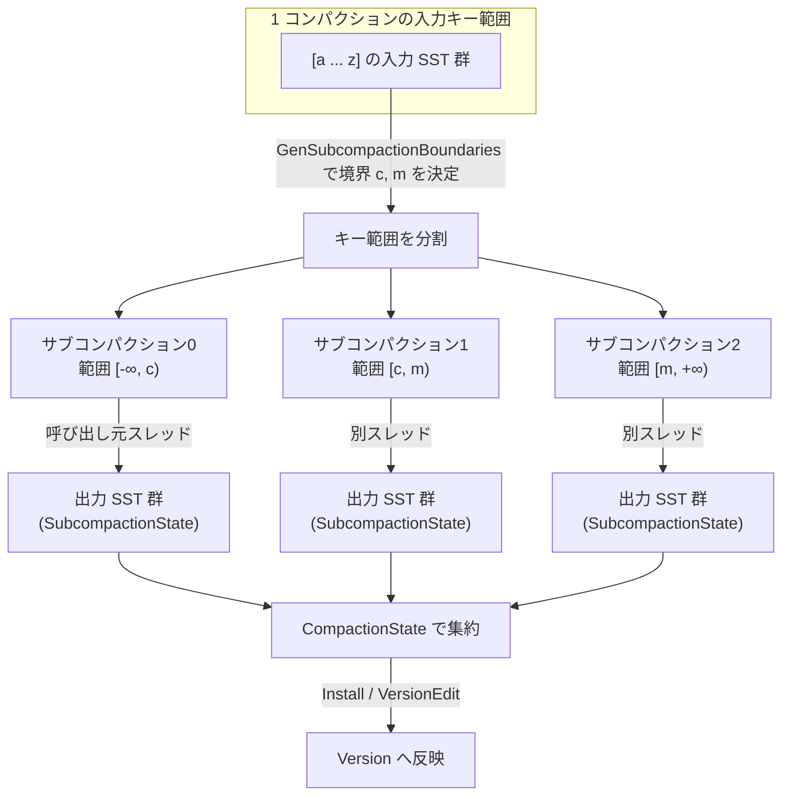

# 第32章 サブコンパクションと並列化

> **本章で読むソース**
>
> - [`db/compaction/compaction_job.cc`](https://github.com/facebook/rocksdb/blob/v11.1.1/db/compaction/compaction_job.cc)
> - [`db/compaction/subcompaction_state.h`](https://github.com/facebook/rocksdb/blob/v11.1.1/db/compaction/subcompaction_state.h)
> - [`db/compaction/compaction_state.h`](https://github.com/facebook/rocksdb/blob/v11.1.1/db/compaction/compaction_state.h)
> - [`db/output_validator.h`](https://github.com/facebook/rocksdb/blob/v11.1.1/db/output_validator.h)
> - [`db/output_validator.cc`](https://github.com/facebook/rocksdb/blob/v11.1.1/db/output_validator.cc)
> - [`include/rocksdb/options.h`](https://github.com/facebook/rocksdb/blob/v11.1.1/include/rocksdb/options.h)

## この章の狙い

一つのコンパクションは、入力 SST 群を読み、マージし、新しい SST 群を書き出す重い処理である。
これを一スレッドで直列に走らせると、入力データ量に比例して経過時間が伸びる。
本章では、RocksDB がこの一回のコンパクションを互いに素なキー範囲の複数の「サブコンパクション」に分け、別スレッドで並列に走らせて経過時間を縮める仕組みを読む。
あわせて、並列に書き出した出力 SST が壊れていないことを `OutputValidator` でどう検証するかを見る。

## 前提

- [第31章 コンパクションジョブ](31-compaction-job.md)：本章が分割の対象とする `CompactionJob` の全体像。
  どの SST を入力に選ぶかの取捨判定はこの章で扱う。
- [第30章 コンパクションピッカー](30-compaction-picker.md)：コンパクション対象の選定と `max_subcompactions` の役割。
- [第29章 コンパクションの理論](29-compaction-theory.md)：LSM ツリーにおけるコンパクションの位置づけ。

本章は、入力の選定が終わって `Compaction` オブジェクトが手元にある状態から始める。
そのコンパクションをキー範囲で割って並列実行し、結果を一つにまとめて反映するまでの経路に集中する。

## 並列化が成り立つ前提

コンパクションは入力キーの全体を一度なめて、出力キーを内部キー順の昇順で書き出す。
この出力キー範囲が互いに重ならないなら、範囲ごとに別々のスレッドが書いても、できあがる SST 群は直列実行と同じになる。
サブコンパクションはこの性質に乗っている。

各サブコンパクションが担当するのは、半開区間で表したキー範囲である。
`SubcompactionState` は自分の担当範囲を `start`（含む）と `end`（含まない）で持ち、ここに不変条件が明記されている。

[`db/compaction/subcompaction_state.h` L54-L57](https://github.com/facebook/rocksdb/blob/v11.1.1/db/compaction/subcompaction_state.h#L54-L57)

```cpp
  // The boundaries of the key-range this compaction is interested in. No two
  // sub-compactions may have overlapping key-ranges.
  // 'start' is inclusive, 'end' is exclusive, and nullptr means unbounded
  const std::optional<Slice> start, end;
```

二つのサブコンパクションのキー範囲は決して重ならない。
`start` が `nullptr`（`std::nullopt`）なら下端が無制限、`end` が `nullptr` なら上端が無制限であり、これらは範囲列の両端を表す。
範囲が重ならないため、各サブコンパクションは他のスレッドの進行を待たずに、自分の範囲の入力を読んで自分の出力 SST を書ける。

範囲は昇順で並ぶことも前提になっている。
全サブコンパクションを束ねる `CompactionState` は、状態をキー範囲の昇順で保持することを要求する。

[`db/compaction/compaction_state.h` L22-L40](https://github.com/facebook/rocksdb/blob/v11.1.1/db/compaction/compaction_state.h#L22-L40)

```cpp
// Maintains state for the entire compaction
class CompactionState {
 public:
  Compaction* const compaction;

  // REQUIRED: subcompaction states are stored in order of increasing key-range
  std::vector<SubcompactionState> sub_compact_states;
  Status status;

  void AggregateCompactionStats(
      InternalStats::CompactionStatsFull& internal_stats,
      CompactionJobStats& job_stats);

  explicit CompactionState(Compaction* c) : compaction(c) {}

  Slice SmallestUserKey();

  Slice LargestUserKey();
};
```

`sub_compact_states` がサブコンパクションの並びで、要素を範囲の昇順で並べる。
出力 SST を最後にまとめて `Version` へ反映するとき、この昇順がそのままレベル内のファイル順に対応する。

## 境界の決め方（`GenSubcompactionBoundaries`）

並列化の効果は、各サブコンパクションの仕事量がそろっているほど大きい。
一つだけ極端に重い範囲があると、他のスレッドが先に終わってもその一つを待つことになり、経過時間は最も重い範囲に律速される。
`GenSubcompactionBoundaries` は、入力データ量を見て、各範囲がほぼ均等な大きさになる分割点（境界キー）を選ぶ。

均等分割の出発点は、入力データの総量を分割数で割った目標サイズである。
関数冒頭のコメントが、その方針を具体例つきで説明している。

[`db/compaction/compaction_job.cc` L533-L540](https://github.com/facebook/rocksdb/blob/v11.1.1/db/compaction/compaction_job.cc#L533-L540)

```cpp
void CompactionJob::GenSubcompactionBoundaries() {
  // The goal is to find some boundary keys so that we can evenly partition
  // the compaction input data into max_subcompactions ranges.
  // For every input file, we ask TableReader to estimate 128 anchor points
  // that evenly partition the input file into 128 ranges and the range
  // sizes. This can be calculated by scanning index blocks of the file.
  // Once we have the anchor points for all the input files, we merge them
  // together and try to find keys dividing ranges evenly.
  // ... (中略：a1/a2/b1... を使った分割例) ...
```

データ量の見積もりには「アンカー点」を使う。
各入力ファイルに対して `TableReader` が 128 個のアンカー点を返し、ファイルを 128 個の小範囲に分けて、それぞれの範囲サイズを示す。
アンカー点はインデックスブロックを走査して得るため、データブロックを読まずにキー分布と各区間のおおよそのバイト数がわかる。

アンカー点の収集は、入力レベルの各ファイルを順にたどって行う。

[`db/compaction/compaction_job.cc` L595-L610](https://github.com/facebook/rocksdb/blob/v11.1.1/db/compaction/compaction_job.cc#L595-L610)

```cpp
      for (size_t i = 0; i < num_files; i++) {
        FileMetaData* f = flevel->files[i].file_metadata;
        std::vector<TableReader::Anchor> my_anchors;
        Status s = cfd->table_cache()->ApproximateKeyAnchors(
            read_options, icomp, *f, c->mutable_cf_options(), my_anchors);
        if (!s.ok() || my_anchors.empty()) {
          my_anchors.emplace_back(f->largest.user_key(), f->fd.GetFileSize());
        }
        for (auto& ac : my_anchors) {
          // Can be optimize to avoid this loop.
          total_size += ac.range_size;
        }

        all_anchors.insert(all_anchors.end(), my_anchors.begin(),
                           my_anchors.end());
      }
```

`ApproximateKeyAnchors` が各ファイルのアンカー点を `my_anchors` に詰める。
失敗した場合や空の場合は、ファイル全体を一つのアンカー点として扱う。
各アンカー点の `range_size` を足し込んで入力全体の `total_size` を求めながら、全アンカー点を `all_anchors` に集める。

集めたアンカー点は、全ファイル横断でユーザーキー順に総ソートする。
これで複数の入力ファイルにまたがるキー分布が一本の昇順列になり、分割点を選べる状態になる。

[`db/compaction/compaction_job.cc` L618-L633](https://github.com/facebook/rocksdb/blob/v11.1.1/db/compaction/compaction_job.cc#L618-L633)

```cpp
  std::sort(
      all_anchors.begin(), all_anchors.end(),
      [cfd_comparator](TableReader::Anchor& a, TableReader::Anchor& b) -> bool {
        return cfd_comparator->CompareWithoutTimestamp(a.user_key, b.user_key) <
               0;
      });

  // Remove duplicated entries from boundaries.
  all_anchors.erase(
      std::unique(all_anchors.begin(), all_anchors.end(),
                  [cfd_comparator](TableReader::Anchor& a,
                                   TableReader::Anchor& b) -> bool {
                    return cfd_comparator->CompareWithoutTimestamp(
                               a.user_key, b.user_key) == 0;
                  }),
      all_anchors.end());
```

ソートのあと `std::unique` で同一ユーザーキーの重複を除く。
境界は異なるユーザーキーでなければならないからである。

ここでアンカー点が「実際には重なり合う」という見積もりの誤差をコメントが認めている。
L0 のように複数ファイルのキー範囲が重なる入力では、あるアンカー点までの累積サイズは過小評価になりうる。
それでも各ファイルから 128 個という多めのアンカー点を取るため、N 個のファイルが重なってもサイズ誤差は相対的に小さく収まると説明されている（[`db/compaction/compaction_job.cc` L552-L558](https://github.com/facebook/rocksdb/blob/v11.1.1/db/compaction/compaction_job.cc#L552-L558)）。
このため均等分割は厳密ではなく、ほぼ均等を狙う近似である。

分割数の目標が決まると、目標範囲サイズを計算する。

[`db/compaction/compaction_job.cc` L674-L684](https://github.com/facebook/rocksdb/blob/v11.1.1/db/compaction/compaction_job.cc#L674-L684)

```cpp
  // Group the ranges into subcompactions
  uint64_t target_range_size = std::max(
      total_size / num_planned_subcompactions,
      MaxFileSizeForLevel(
          c->mutable_cf_options(), out_lvl,
          c->immutable_options().compaction_style, base_level,
          c->immutable_options().level_compaction_dynamic_level_bytes));

  if (target_range_size >= total_size) {
    return;
  }
```

目標範囲サイズは、総量を分割数で割った値と、出力レベルの最大ファイルサイズの大きいほうにする。
一つのサブコンパクションが受け持つ範囲が出力ファイル一個分より小さくなるのは無意味だからである。
目標が総量以上になるなら分割しても意味がないので、境界を作らずに戻る。

最後に、ソート済みのアンカー点を順になめ、累積サイズが目標を超えるたびに境界を一つ刻む。

[`db/compaction/compaction_job.cc` L686-L699](https://github.com/facebook/rocksdb/blob/v11.1.1/db/compaction/compaction_job.cc#L686-L699)

```cpp
  uint64_t next_threshold = target_range_size;
  uint64_t cumulative_size = 0;
  uint64_t num_actual_subcompactions = 1U;
  for (TableReader::Anchor& anchor : all_anchors) {
    cumulative_size += anchor.range_size;
    if (cumulative_size > next_threshold) {
      next_threshold += target_range_size;
      num_actual_subcompactions++;
      boundaries_.push_back(anchor.user_key);
    }
    if (num_actual_subcompactions == num_planned_subcompactions) {
      break;
    }
  }
```

累積サイズが `next_threshold` を超えた地点のユーザーキーを `boundaries_` に積み、しきい値を一段上げる。
これを繰り返すと、隣り合う境界に挟まれた各範囲がおよそ `target_range_size` ずつになる。
計画した分割数に達したら打ち切る。
得られた境界列 `boundaries_` が、サブコンパクションのキー範囲を区切る分割点になる。

## `max_subcompactions` が並列度の上限

分割数の上限は、ユーザーが設定するオプション `max_subcompactions` で決まる。
ヘッダのコメントが意味と既定値を述べている。

[`include/rocksdb/options.h` L918-L924](https://github.com/facebook/rocksdb/blob/v11.1.1/include/rocksdb/options.h#L918-L924)

```cpp
  // This value represents the maximum number of threads that will
  // concurrently perform a compaction job by breaking it into multiple,
  // smaller ones that are run simultaneously.
  // Default: 1 (i.e. no subcompactions)
  //
  // Dynamically changeable through SetDBOptions() API.
  uint32_t max_subcompactions = 1;
```

既定値は 1 で、このとき分割しない。
一回のコンパクションを最大いくつのスレッドで同時に処理してよいかの上限がこの値である。

`GenSubcompactionBoundaries` の最初で、この上限が 1 以下なら（ラウンドロビン優先の場合を除いて）何もせず戻る。

[`db/compaction/compaction_job.cc` L567-L571](https://github.com/facebook/rocksdb/blob/v11.1.1/db/compaction/compaction_job.cc#L567-L571)

```cpp
  if (c->max_subcompactions() <= 1 &&
      !(c->immutable_options().compaction_pri == kRoundRobin &&
        c->immutable_options().compaction_style == kCompactionStyleLevel)) {
    return;
  }
```

計画する分割数 `num_planned_subcompactions` は、`GetSubcompactionsLimit` が返す上限から決める。

[`db/compaction/compaction_job.cc` L436-L441](https://github.com/facebook/rocksdb/blob/v11.1.1/db/compaction/compaction_job.cc#L436-L441)

```cpp
uint64_t CompactionJob::GetSubcompactionsLimit() {
  return extra_num_subcompaction_threads_reserved_ +
         std::max(
             std::uint64_t(1),
             static_cast<uint64_t>(compact_->compaction->max_subcompactions()));
}
```

上限は `max_subcompactions`（最低 1）に、ラウンドロビン用に予約した追加スレッド数を足した値である。
ラウンドロビン優先以外の通常のコンパクションでは、計画する分割数はこの上限そのものになる（[`db/compaction/compaction_job.cc` L664-L666](https://github.com/facebook/rocksdb/blob/v11.1.1/db/compaction/compaction_job.cc#L664-L666)）。
実際に作られる範囲数は、入力データ量が足りなければこの上限より少なくなる。

## サブコンパクションの並列起動（`RunSubcompactions`）

境界が決まると、`CompactionJob::Run` の準備段で `sub_compact_states` を組み立てる。
境界が一つ以上あれば、境界の個数より一つ多い数のサブコンパクションを作る。

[`db/compaction/compaction_job.cc` L287-L300](https://github.com/facebook/rocksdb/blob/v11.1.1/db/compaction/compaction_job.cc#L287-L300)

```cpp
  if (boundaries_.size() >= 1) {
    assert(!known_single_subcompact.has_value());
    for (size_t i = 0; i <= boundaries_.size(); i++) {
      compact_->sub_compact_states.emplace_back(
          c, (i != 0) ? std::optional<Slice>(boundaries_[i - 1]) : std::nullopt,
          (i != boundaries_.size()) ? std::optional<Slice>(boundaries_[i])
                                    : std::nullopt,
          static_cast<uint32_t>(i));
      // assert to validate that boundaries don't have same user keys (without
      // timestamp part).
      assert(i == 0 || i == boundaries_.size() ||
             cfd->user_comparator()->CompareWithoutTimestamp(
                 boundaries_[i - 1], boundaries_[i]) < 0);
    }
```

`i` 番目のサブコンパクションの範囲は `[boundaries_[i-1], boundaries_[i])` である。
先頭（`i == 0`）の下端と末尾の上端は `std::nullopt` で、それぞれ無制限を表す。
これで境界列の両端を含むキー空間全体が、重ならない半開区間に隙間なく分割される。
`assert` が隣接境界のユーザーキーが等しくないことを確かめ、範囲が必ず正の幅を持つことを保証する。

並列起動は `RunSubcompactions` が担う。
サブコンパクション数だけスレッドを使うが、先頭の一つは新しいスレッドを立てず現在のスレッドで処理する。

[`db/compaction/compaction_job.cc` L716-L742](https://github.com/facebook/rocksdb/blob/v11.1.1/db/compaction/compaction_job.cc#L716-L742)

```cpp
void CompactionJob::RunSubcompactions() {
  TEST_SYNC_POINT("CompactionJob::RunSubcompactions:BeforeStart");
  const size_t num_threads = compact_->sub_compact_states.size();
  assert(num_threads > 0);
  compact_->compaction->GetOrInitInputTableProperties();

  // Launch a thread for each of subcompactions 1...num_threads-1
  std::vector<port::Thread> thread_pool;
  thread_pool.reserve(num_threads - 1);
  for (size_t i = 1; i < compact_->sub_compact_states.size(); i++) {
    thread_pool.emplace_back(&CompactionJob::ProcessKeyValueCompaction, this,
                             &compact_->sub_compact_states[i]);
  }

  // Always schedule the first subcompaction (whether or not there are also
  // others) in the current thread to be efficient with resources
  ProcessKeyValueCompaction(compact_->sub_compact_states.data());

  // Wait for all other threads (if there are any) to finish execution
  for (auto& thread : thread_pool) {
    thread.join();
  }
  RemoveEmptyOutputs();

  ReleaseSubcompactionResources();
  TEST_SYNC_POINT("CompactionJob::ReleaseSubcompactionResources");
}
```

`1` から `num_threads-1` 番目のサブコンパクションには、それぞれ `ProcessKeyValueCompaction` を走らせるスレッドを `thread_pool` に立てる。
`0` 番目だけは呼び出し元スレッドで直接処理する。
スレッドを一つ節約し、分割しない場合（サブコンパクションが一つだけの場合）に余計なスレッド生成を避けるためである。
全スレッドを `join` で待ち合わせてから、空の出力を除いてリソースを解放する。

各スレッドが受け取る `ProcessKeyValueCompaction` の引数は、自分の `SubcompactionState` へのポインタ一つである。
サブコンパクションが自分の担当範囲だけを読み書きし、他のスレッドと共有する書き込み先を持たないため、この並列処理にスレッド間ロックは要らない。
各スレッドは独立に入力を読み、独立に出力 SST を作る。
ここが経過時間を縮める核心である。
入力全体を一スレッドでなめる直列処理に対し、互いに素な範囲を `N` スレッドで同時になめれば、理想的には経過時間が `1/N` に近づく。



## 各サブコンパクションの出力と集約

各サブコンパクションは、生成した出力 SST を自分の `SubcompactionState` に貯める。
完了後、これらの出力を一つの `VersionEdit` にまとめる役割も `SubcompactionState` が持つ。

[`db/compaction/subcompaction_state.h` L163-L171](https://github.com/facebook/rocksdb/blob/v11.1.1/db/compaction/subcompaction_state.h#L163-L171)

```cpp
  // Add all the new files from this compaction to version_edit
  void AddOutputsEdit(VersionEdit* out_edit) const {
    for (const auto& file : proximal_level_outputs_.outputs_) {
      out_edit->AddFile(compaction->GetProximalLevel(), file.meta);
    }
    for (const auto& file : compaction_outputs_.outputs_) {
      out_edit->AddFile(compaction->output_level(), file.meta);
    }
  }
```

`AddOutputsEdit` は、このサブコンパクションが作った出力ファイルを出力レベルへ追加する操作を `VersionEdit` に積む。

統計は `CompactionState::AggregateCompactionStats` が全サブコンパクションをなめて合算する。

[`db/compaction/compaction_state.cc` L38-L45](https://github.com/facebook/rocksdb/blob/v11.1.1/db/compaction/compaction_state.cc#L38-L45)

```cpp
void CompactionState::AggregateCompactionStats(
    InternalStats::CompactionStatsFull& internal_stats,
    CompactionJobStats& job_stats) {
  for (const auto& sc : sub_compact_states) {
    sc.AggregateCompactionOutputStats(internal_stats);
    job_stats.Add(sc.compaction_job_stats);
  }
}
```

各サブコンパクションが個別に持っていた出力統計とジョブ統計を、コンパクション全体の一つの統計へ足し込む。
並列に分けて測った仕事量を、最後に一本化する操作である。

反映は `InstallCompactionResults` の中で、全サブコンパクションの出力を一つの `VersionEdit` に積み上げて行う。

[`db/compaction/compaction_job.cc` L2299-L2308](https://github.com/facebook/rocksdb/blob/v11.1.1/db/compaction/compaction_job.cc#L2299-L2308)

```cpp
  VersionEdit* const edit = compaction->edit();
  assert(edit);

  // Add compaction inputs
  compaction->AddInputDeletions(edit);

  std::unordered_map<uint64_t, BlobGarbageMeter::BlobStats> blob_total_garbage;

  for (const auto& sub_compact : compact_->sub_compact_states) {
    sub_compact.AddOutputsEdit(edit);
    // ... (中略：BLOB ファイルとガベージ統計の集約) ...
```

入力ファイルの削除と、全サブコンパクションの出力ファイルの追加を一つの `VersionEdit` にまとめる。
これを `Install` が `VersionSet` に適用することで、並列に作った複数の出力 SST 群が一度の編集で `Version` に反映される。
分割して並列に処理しても、ツリーへの反映は分割前の一回のコンパクションと同じく、まとめて一回で起きる。

## 出力の検証（`OutputValidator`）

並列実行は経過時間を縮めるが、別スレッドで独立に書いた SST が壊れていないことは別途確かめなければならない。
コンパクションは内部キー順の昇順で出力すると決まっているので、出力 SST のキーがその順序を保っていれば、コンパクションのロジックが破綻していないことの一つの証拠になる。
この検証を担うのが `OutputValidator` である。

[`db/output_validator.h` L12-L26](https://github.com/facebook/rocksdb/blob/v11.1.1/db/output_validator.h#L12-L26)

```cpp
// A class that validates key/value that is inserted to an SST file.
// Pass every key/value of the file using OutputValidator::Add()
// and the class validates key order and optionally calculate a hash
// of all the key and value.
class OutputValidator {
 public:
  explicit OutputValidator(const InternalKeyComparator& icmp, bool enable_hash,
                           uint64_t precalculated_hash = 0)
      : icmp_(icmp),
        paranoid_hash_(precalculated_hash),
        enable_hash_(enable_hash) {}

  // Add a key to the KV sequence, and return whether the key follows
  // criteria, e.g. key is ordered.
  Status Add(const Slice& key, const Slice& value);
```

`Add` に出力するキーと値を一つずつ渡すと、キーの順序を検査し、必要ならキーと値からハッシュを転がして計算する。
検査の中身が `Add` の実装にある。

[`db/output_validator.cc` L12-L28](https://github.com/facebook/rocksdb/blob/v11.1.1/db/output_validator.cc#L12-L28)

```cpp
Status OutputValidator::Add(const Slice& key, const Slice& value) {
  if (enable_hash_) {
    // Generate a rolling 64-bit hash of the key and values
    paranoid_hash_ = NPHash64(key.data(), key.size(), paranoid_hash_);
    paranoid_hash_ = NPHash64(value.data(), value.size(), paranoid_hash_);
  }
  if (key.size() < kNumInternalBytes) {
    return Status::Corruption(
        "Compaction tries to write a key without internal bytes.");
  }
  // prev_key_ starts with empty.
  if (!prev_key_.empty() && icmp_.Compare(key, prev_key_) < 0) {
    return Status::Corruption("Compaction sees out-of-order keys.");
  }
  prev_key_.assign(key.data(), key.size());
  return Status::OK();
}
```

`Add` は二つを検査する。
一つ目は、キーが内部キーの形（シーケンス番号と型を含む末尾バイト）を持つことである。
末尾バイトを欠くキーは `Corruption` として弾く。
二つ目は、直前のキー `prev_key_` と内部キー比較器で比べ、現在のキーがそれより小さければ順序違反として `Corruption` を返すことである。
昇順が破れていればこの時点で捕まる。

`enable_hash_` が有効なら、`NPHash64` でキーと値を順に畳み込んだ 64 ビットの転がしハッシュを更新する。
このハッシュは、書き出すときに作った検証器と、書いた SST を読み直して作った検証器を比べるために使う。

ハッシュの突き合わせは `CompareValidator` が行う。

[`db/output_validator.h` L28-L33](https://github.com/facebook/rocksdb/blob/v11.1.1/db/output_validator.h#L28-L33)

```cpp
  // Compare result of two key orders are the same. It can be used
  // to compare the keys inserted into a file, and what is read back.
  // Return true if the validation passes.
  bool CompareValidator(const OutputValidator& other_validator) {
    return GetHash() == other_validator.GetHash();
  }
```

二つの検証器のハッシュが一致するかを返す。
キーと値の並びが書き込み時と読み戻し時で同じなら、転がしハッシュは一致する。

この突き合わせが効くのは、書き込み時に作る検証器が出力ファイルごとに `SubcompactionState` の `Output` に保持されるからである。

[`db/compaction/compaction_outputs.h` L31-L45](https://github.com/facebook/rocksdb/blob/v11.1.1/db/compaction/compaction_outputs.h#L31-L45)

```cpp
  // compaction output file
  struct Output {
    Output(FileMetaData&& _meta, const InternalKeyComparator& _icmp,
           bool _enable_hash, bool _finished, uint64_t precalculated_hash,
           bool _is_proximal_level)
        : meta(std::move(_meta)),
          validator(_icmp, _enable_hash, precalculated_hash),
          finished(_finished),
          is_proximal_level(_is_proximal_level) {}
    FileMetaData meta;
    OutputValidator validator;
    bool finished;
    bool is_proximal_level;
    std::shared_ptr<const TableProperties> table_properties;
  };
```

各出力ファイルは、書き込み時に転がしたハッシュを持つ `validator` を抱えている。
`Run` の後段で各出力 SST を読み戻し、新しい検証器に全キーを通して、書き込み時の `validator` と突き合わせる。

[`db/compaction/compaction_job.cc` L958-L972](https://github.com/facebook/rocksdb/blob/v11.1.1/db/compaction/compaction_job.cc#L958-L972)

```cpp
          if (s.ok() && should_verify_iteration) {
            OutputValidator validator(cfd->internal_comparator(),
                                      /*_enable_hash=*/true);
            for (iter->SeekToFirst(); iter->Valid(); iter->Next()) {
              s = validator.Add(iter->key(), iter->value());
              if (!s.ok()) {
                break;
              }
            }
            if (s.ok()) {
              s = iter->status();
            }
            if (s.ok() && !validator.CompareValidator(output_file.validator)) {
              s = Status::Corruption(
                  "Key-value checksum of compaction output doesn't match what "
```

読み戻したキーと値で計算したハッシュが、書き込み時のハッシュと食い違えば `Corruption` になる。
書き込みからディスク格納、読み戻しまでのどこかでキーや値が化けていれば、内容ハッシュの不一致として捕まる。
このイテレーション検証自体も、サブコンパクションごとにスレッドを立てて並列に走る（[`db/compaction/compaction_job.cc` L1005-L1012](https://github.com/facebook/rocksdb/blob/v11.1.1/db/compaction/compaction_job.cc#L1005-L1012)）。

順序検査が捕まえるのはコンパクションのロジックの破綻であり、ハッシュ突き合わせが捕まえるのは書き込みから読み戻しまでの間の化けである。
両者は別の壊れ方を見ており、片方が他方を兼ねるわけではない。
同じ仕組みは、フラッシュやコンパクションで SST を書く共通経路でも `paranoid_file_checks` が有効なときに使われる（[`db/builder.cc` L472-L482](https://github.com/facebook/rocksdb/blob/v11.1.1/db/builder.cc#L472-L482)）。

## まとめ

- 一回のコンパクションを、互いに素なキー範囲の複数のサブコンパクションに分け、別スレッドで並列に走らせて経過時間を縮める。
  出力範囲が重ならないため、各スレッドはロックなしで自分の範囲だけを読み書きできる。
- `GenSubcompactionBoundaries` は、各入力ファイルから 128 個のアンカー点でデータ量を見積もり、総量を分割数で割った目標サイズになるよう境界キーを刻む。
  アンカー点はインデックスブロックから得るので、データブロックを読まずに分布がわかる。
- 分割の上限は `max_subcompactions`（既定 1、1 なら分割しない）。
  計画分割数はこの上限から決まり、入力量が足りなければ実際の分割はそれより少なくなる。
- `RunSubcompactions` は `1` 番目以降にスレッドを立て、`0` 番目は呼び出し元スレッドで処理してスレッドを一つ節約する。
  各 `SubcompactionState` が自分の出力 SST を貯め、`CompactionState` が統計を合算し、`Install` が一つの `VersionEdit` でまとめて `Version` に反映する。
- `OutputValidator` は出力キーが内部キー順で昇順であることを検査し、`enable_hash` 有効時はキーと値の転がしハッシュを書き込み時と読み戻し時で突き合わせる。
  順序破綻と内容の化けという別々の壊れ方を早期に捕まえる。

## 関連する章

- [第31章 コンパクションジョブ](31-compaction-job.md)：本章が分割した `CompactionJob` の全体像と入力選定。
- [第33章 マージオペレータ](33-merge-operator.md)：各サブコンパクションが範囲内のキーをマージする際の値の畳み込み規則。
- [第34章 MANIFEST と VersionEdit](../part06-version/34-manifest-versionedit.md)：集約した出力を `VersionEdit` として記録し `Version` に反映する仕組み。
