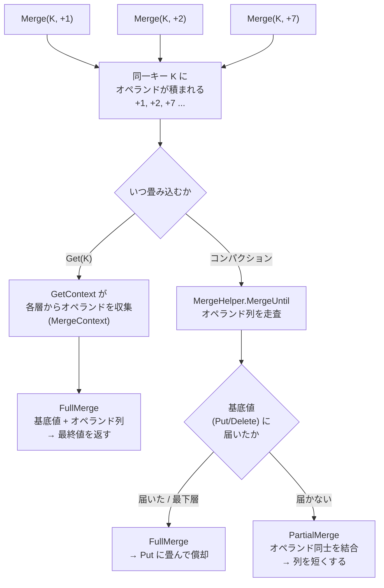

# 第33章 マージ演算子

> **本章で読むソース**
> - [`include/rocksdb/merge_operator.h`](https://github.com/facebook/rocksdb/blob/v11.1.1/include/rocksdb/merge_operator.h)
> - [`db/merge_operator.cc`](https://github.com/facebook/rocksdb/blob/v11.1.1/db/merge_operator.cc)
> - [`db/merge_context.h`](https://github.com/facebook/rocksdb/blob/v11.1.1/db/merge_context.h)
> - [`db/merge_helper.h`](https://github.com/facebook/rocksdb/blob/v11.1.1/db/merge_helper.h)
> - [`db/merge_helper.cc`](https://github.com/facebook/rocksdb/blob/v11.1.1/db/merge_helper.cc)
> - [`utilities/merge_operators/uint64add.cc`](https://github.com/facebook/rocksdb/blob/v11.1.1/utilities/merge_operators/uint64add.cc)
> - [`utilities/merge_operators/string_append/stringappend.cc`](https://github.com/facebook/rocksdb/blob/v11.1.1/utilities/merge_operators/string_append/stringappend.cc)

## この章の狙い

カウンタの加算やリストへの追記のような、既存値に対する増分更新をどう表すかを扱う。
素朴に書けば、値を読み、変更し、書き戻す手順になる。
本章で読む**マージ演算子**（merge operator）は、この読み取りを書き込みパスから取り除き、増分だけを記録して読み取り時とコンパクション時に畳み込む仕組みである。
インターフェースの分担、畳み込みを担う `MergeHelper`、加算と文字列追記の実装例を順に読む。

## 前提

- [第23章 Get](../part04-read-path/23-get.md)：点読み出しがオペランドを集める経路を扱う。
- [第31章 コンパクションジョブ](../part05-compaction/31-compaction-job.md)：コンパクションがキーの履歴をどう走査するかを扱う。

これらを未読でも本章は読めるが、`MergeHelper` がどこから呼ばれるかは節末で両章へ結ぶ。

## マージが解く問題

read-modify-write（読んで、変更して、書く）は増分更新の素朴な実装である。
クライアントは現在値を `Get` で取り出し、アプリケーション側で加算や追記を施し、`Put` で書き戻す。
この手順には読み取りが一回含まれる。
書き込みのたびに点読み出しが発生し、その点読み出しは MemTable から SST まで複数の層を走査しうる。

マージは、この読み取りを更新の表現そのものから取り除く。
クライアントは増分（オペランド）だけを `Merge(key, operand)` で記録する。
既存値を読まないので、書き込みは MemTable への追記で完結する。
ヘッダの冒頭は、マージ演算子がマージの意味論をクライアント側に置き、ライブラリはそれを適切なタイミングで適用する役割だと述べる。

[`include/rocksdb/merge_operator.h` L24-L30](https://github.com/facebook/rocksdb/blob/v11.1.1/include/rocksdb/merge_operator.h#L24-L30)

```cpp
// The Merge Operator
//
// Essentially, a MergeOperator specifies the SEMANTICS of a merge, which only
// client knows. It could be numeric addition, list append, string
// concatenation, edit data structure, ... , anything.
// The library, on the other hand, is concerned with the exercise of this
// interface, at the right time (during get, iteration, compaction...)
```

意味論はクライアントが決め、適用のタイミングはライブラリが決める。
この分離が、本章で見る最適化の出発点である。

オペランドは書き込み時点では適用されない。
同じキーに `Merge` を重ねると、オペランドが時系列順に積み上がっていく。
最終値が必要になるのは読み取りのときであり、そこで初めて積まれたオペランドを基底値に畳み込む。
コンパクションのときにも畳み込みが起きるが、こちらは最終値を返すためではなく、積もったオペランドの列を短くして以後の読み取りを軽くするために行う。

## 二つの畳み込み：FullMerge と PartialMerge

マージ演算子は二種類の畳み込みを区別する。
一つは基底値とオペランド列から最終値を求める畳み込みであり、もう一つは基底値を持たないままオペランド同士を結合する畳み込みである。

`FullMerge`（V2 が現役のインターフェース）は、既存値の上にオペランドの列を時系列順に適用して一つの値を作る。
入力は `MergeOperationInput` にまとめられる。
基底値が存在しないときは `existing_value` が `nullptr` になる。

[`include/rocksdb/merge_operator.h` L98-L107](https://github.com/facebook/rocksdb/blob/v11.1.1/include/rocksdb/merge_operator.h#L98-L107)

```cpp
    // The key associated with the merge operation.
    const Slice& key;
    // The existing value of the current key, nullptr means that the
    // value doesn't exist.
    const Slice* existing_value;
    // A list of operands to apply.
    const std::vector<Slice>& operand_list;
    // Logger could be used by client to log any errors that happen during
    // the merge operation.
    Logger* logger;
```

`FullMergeV2` のコメントは、この関数が二つの場面で呼ばれること、そしてオペランド列の一部だけに対して呼ばれうることを示す。
`Get` のときは可視なスナップショットまでの基底値とその先のオペランドに、コンパクションのときは履歴の先頭から畳み込める範囲に適用する。

[`include/rocksdb/merge_operator.h` L144-L160](https://github.com/facebook/rocksdb/blob/v11.1.1/include/rocksdb/merge_operator.h#L144-L160)

```cpp
  // This function applies a stack of merge operands in chronological order
  // on top of an existing value. There are two ways in which this method is
  // being used:
  // a) During Get() operation, it used to calculate the final value of a key
  // b) During compaction, in order to collapse some operands with the based
  //    value.
  //
  // Note: The name of the method is somewhat misleading, as both in the cases
  // of Get() or compaction it may be called on a subset of operands:
  // K:    0    +1    +2    +7    +4     +5      2     +1     +2
  //                              ^
  //                              |
  //                          snapshot
  // In the example above, Get(K) operation will call FullMerge with a base
  // value of 2 and operands [+1, +2]. Compaction process might decide to
  // collapse the beginning of the history up to the snapshot by performing
  // full Merge with base value of 0 and operands [+1, +2, +7, +4].
```

`PartialMerge` は基底値を持たない。
左右二つのオペランドを受け取り、`DB::Merge(key, left)` に続けて `DB::Merge(key, right)` を呼んだのと同じ結果になる単一のオペランドを作る。

[`include/rocksdb/merge_operator.h` L212-L221](https://github.com/facebook/rocksdb/blob/v11.1.1/include/rocksdb/merge_operator.h#L212-L221)

```cpp
  // This function performs merge(left_op, right_op)
  // when both the operands are themselves merge operation types
  // that you would have passed to a DB::Merge() call in the same order
  // (i.e.: DB::Merge(key,left_op), followed by DB::Merge(key,right_op)).
  //
  // PartialMerge should combine them into a single merge operation that is
  // saved into *new_value, and then it should return true.
  // *new_value should be constructed such that a call to
  // DB::Merge(key, *new_value) would yield the same result as a call
  // to DB::Merge(key, left_op) followed by DB::Merge(key, right_op).
```

`PartialMerge` は失敗を返してよい。
結合が不可能または非効率なら `new_value` を変えずに `false` を返す。
このときライブラリはオペランドをそのまま保持し、基底値（Put、Delete、データベースの末尾）に出会った時点で正しい順序で適用する。

[`include/rocksdb/merge_operator.h` L232-L242](https://github.com/facebook/rocksdb/blob/v11.1.1/include/rocksdb/merge_operator.h#L232-L242)

```cpp
  // If it is impossible or infeasible to combine the two operations,
  // leave new_value unchanged and return false. The library will
  // internally keep track of the operations, and apply them in the
  // correct order once a base-value (a Put/Delete/End-of-Database) is seen.
  //
  // TODO: Presently there is no way to differentiate between error/corruption
  // and simply "return false". For now, the client should simply return
  // false in any case it cannot perform partial-merge, regardless of reason.
  // If there is corruption in the data, handle it in the FullMergeV3() function
  // and return false there.  The default implementation of PartialMerge will
  // always return false.
```

役割分担はこうなる。
`FullMerge` は基底値を伴うので最終値を決める。
`PartialMerge` は基底値を伴わないのでオペランド列を短くするだけで、最終値は決めない。
コンパクションがまだキーの履歴の先頭（基底値）に届いていないとき、`PartialMerge` だけが使える。
複数オペランドをまとめて結合する `PartialMergeMulti` も用意され、二つずつ結合するより効率がよいため、こちらの実装が推奨される。

[`include/rocksdb/merge_operator.h` L264-L270](https://github.com/facebook/rocksdb/blob/v11.1.1/include/rocksdb/merge_operator.h#L264-L270)

```cpp
  // The PartialMergeMulti function will be called when there are at least two
  // operands.
  //
  // In the default implementation, PartialMergeMulti will invoke PartialMerge
  // multiple times, where each time it only merges two operands.  Developers
  // should either implement PartialMergeMulti, or implement PartialMerge which
  // is served as the helper function of the default PartialMergeMulti.
```

## AssociativeMergeOperator という簡易形

多くの増分更新は、二値を一値に畳み込む単純な操作で書ける。
加算は二つの数を足せばよく、文字列追記は二つの文字列を連結すればよい。
このような結合的な操作のために、`AssociativeMergeOperator` が `MergeOperator` の上に薄い派生を用意する。
クライアントは `Merge`（既存値と一つの値を畳み込む）だけを実装すればよい。

[`include/rocksdb/merge_operator.h` L323-L334](https://github.com/facebook/rocksdb/blob/v11.1.1/include/rocksdb/merge_operator.h#L323-L334)

```cpp
  virtual bool Merge(const Slice& key, const Slice* existing_value,
                     const Slice& value, std::string* new_value,
                     Logger* logger) const = 0;

 private:
  // Default implementations of the MergeOperator functions
  bool FullMergeV2(const MergeOperationInput& merge_in,
                   MergeOperationOutput* merge_out) const override;

  bool PartialMerge(const Slice& key, const Slice& left_operand,
                    const Slice& right_operand, std::string* new_value,
                    Logger* logger) const override;
```

`AssociativeMergeOperator::FullMergeV2` は、クライアントの `Merge` をオペランド列に一つずつ折り重ねる。
直前の結果を次の `Merge` の既存値として渡し、列の末尾まで畳み込む。

[`db/merge_operator.cc` L136-L155](https://github.com/facebook/rocksdb/blob/v11.1.1/db/merge_operator.cc#L136-L155)

```cpp
bool AssociativeMergeOperator::FullMergeV2(
    const MergeOperationInput& merge_in,
    MergeOperationOutput* merge_out) const {
  // Simply loop through the operands
  Slice temp_existing;
  const Slice* existing_value = merge_in.existing_value;
  for (const auto& operand : merge_in.operand_list) {
    std::string temp_value;
    if (!Merge(merge_in.key, existing_value, operand, &temp_value,
               merge_in.logger)) {
      return false;
    }
    swap(temp_value, merge_out->new_value);
    temp_existing = Slice(merge_out->new_value);
    existing_value = &temp_existing;
  }

  // The result will be in *new_value. All merges succeeded.
  return true;
}
```

`PartialMerge` のほうは、左オペランドを既存値とみなして右オペランドを `Merge` するだけで成り立つ。

[`db/merge_operator.cc` L159-L165](https://github.com/facebook/rocksdb/blob/v11.1.1/db/merge_operator.cc#L159-L165)

```cpp
bool AssociativeMergeOperator::PartialMerge(const Slice& key,
                                            const Slice& left_operand,
                                            const Slice& right_operand,
                                            std::string* new_value,
                                            Logger* logger) const {
  return Merge(key, &left_operand, right_operand, new_value, logger);
}
```

結合的な操作では、基底値の有無で挙動が変わらない。
だから `Merge` 一つから `FullMerge` と `PartialMerge` の両方を導ける。
結合的でない操作（基底値の構造に依存する変換など）には `MergeOperator` を直接実装する必要があり、`AssociativeMergeOperator` は使えない。

## オペランドを蓄える MergeContext

畳み込みの入力になるオペランド列は `MergeContext` が保持する。
点読み出しがオペランドを集めるときと、`MergeHelper` がコンパクション中にオペランドを積むときの双方で使われる。
重要なのは、オペランドが二つの順序で扱われる点である。

[`db/merge_context.h` L143-L148](https://github.com/facebook/rocksdb/blob/v11.1.1/db/merge_context.h#L143-L148)

```cpp
  // List of operands, the order of operands depends on operands_reversed_.
  mutable std::unique_ptr<std::vector<Slice>> operand_list_;
  // Copy of operands that are not pinned.
  std::unique_ptr<std::vector<std::unique_ptr<std::string>>> copied_operands_;
  // Reversed means the newest update is ordered first.
  mutable bool operands_reversed_ = true;
```

`FullMerge` には古いものから新しいものへの順（forward）でオペランドを渡す必要がある。
一方で読み取りは新しい層から古い層へ走査するので、集める途中は新しいものが先頭にある逆順（backward）が自然である。
`MergeContext` はこの差を、列を逆転するか否かのフラグ一つで吸収する。
方向を要求されたときだけ `std::reverse` する遅延反転で、向きの変換を一度に済ませる。

[`db/merge_context.h` L129-L141](https://github.com/facebook/rocksdb/blob/v11.1.1/db/merge_context.h#L129-L141)

```cpp
  void SetDirectionForward() const {
    if (operands_reversed_ == true) {
      std::reverse(operand_list_->begin(), operand_list_->end());
      operands_reversed_ = false;
    }
  }

  void SetDirectionBackward() const {
    if (operands_reversed_ == false) {
      std::reverse(operand_list_->begin(), operand_list_->end());
      operands_reversed_ = true;
    }
  }
```

`PushOperand` は値が固定（pinned）されていれば `Slice` をそのまま保持し、そうでなければ自前のコピーを作る。
固定されているとは、基になるバッファが `MergeContext` より長く生き、内容が動かないことを指す。
固定済みなら追加のコピーを避けられる。

[`db/merge_context.h` L36-L48](https://github.com/facebook/rocksdb/blob/v11.1.1/db/merge_context.h#L36-L48)

```cpp
  // Push a merge operand
  void PushOperand(const Slice& operand_slice, bool operand_pinned = false) {
    Initialize();
    SetDirectionBackward();

    if (operand_pinned) {
      operand_list_->push_back(operand_slice);
    } else {
      // We need to have our own copy of the operand since it's not pinned
      copied_operands_->emplace_back(
          new std::string(operand_slice.data(), operand_slice.size()));
      operand_list_->push_back(*copied_operands_->back());
    }
  }
```

## MergeHelper：オペランド列を畳み込む

オペランドを実際に畳み込むのは `MergeHelper` である。
コンパクションとフラッシュの出力経路から呼ばれる `MergeUntil` が中心で、内部イテレータ上のマージ型エントリの並びを走査して畳み込む。
ヘッダのコメントは、走査を止める条件を列挙する。

[`db/merge_helper.h` L132-L143](https://github.com/facebook/rocksdb/blob/v11.1.1/db/merge_helper.h#L132-L143)

```cpp
  // During compaction, merge entries until we hit
  //     - a corrupted key
  //     - a Put/Delete,
  //     - a different user key,
  //     - a specific sequence number (snapshot boundary),
  //     - REMOVE_AND_SKIP_UNTIL returned from compaction filter,
  //  or - the end of iteration
  //
  // The result(s) of the merge can be accessed in `MergeHelper::keys()` and
  // `MergeHelper::values()`, which are invalidated the next time `MergeUntil()`
  // is called. `MergeOutputIterator` is specially designed to iterate the
  // results of a `MergeHelper`'s most recent `MergeUntil()`.
```

`MergeUntil` は同一ユーザキーのマージ型エントリを走査する。
マージ型に出会うたびにオペランドを `merge_context_` の先頭に積み、Put や Delete などの基底値（あるいはキーの変わり目）に出会うと走査を止める。
次の引用は、マージ型エントリを見たときに走査を続けてオペランドを積む分岐である。

[`db/merge_helper.cc` L480-L489](https://github.com/facebook/rocksdb/blob/v11.1.1/db/merge_helper.cc#L480-L489)

```cpp
    } else {
      // hit a merge
      //   => if there is a compaction filter, apply it.
      //   => check for range tombstones covering the operand
      //   => merge the operand into the front of the operands_ list
      //      if not filtered
      //   => then continue because we haven't yet seen a Put/Delete.
      //
      // Keep queuing keys and operands until we either meet a put / delete
      // request or later did a partial merge.
```

基底値（ここでは Put）に出会うと、積んだオペランド列をその基底値に畳み込んで終わる。
`kTypeValue` の枝は基底値あり（`kPlainBaseValue`）で `TimedFullMerge` を呼ぶ。

[`db/merge_helper.cc` L388-L393](https://github.com/facebook/rocksdb/blob/v11.1.1/db/merge_helper.cc#L388-L393)

```cpp
      } else if (ikey.type == kTypeValue) {
        s = TimedFullMerge(user_merge_operator_, ikey.user_key, kPlainBaseValue,
                           iter->value(), merge_context_.GetOperands(), logger_,
                           stats_, clock_, /* update_num_ops_stats */ false,
                           &op_failure_scope, &merge_result,
                           /* result_operand */ nullptr, &merge_result_type);
```

畳み込んだ結果は、列を一つの値に置き換える。
キーの型はマージ型から `FullMerge` の結果の型（多くは `kTypeValue`）に書き換わり、列はその一値だけになる。

[`db/merge_helper.cc` L456-L468](https://github.com/facebook/rocksdb/blob/v11.1.1/db/merge_helper.cc#L456-L468)

```cpp
      if (s.ok()) {
        // The original key encountered
        original_key = std::move(keys_.back());

        assert(merge_result_type == kTypeValue ||
               merge_result_type == kTypeWideColumnEntity);
        orig_ikey.type = merge_result_type;
        UpdateInternalKey(&original_key, orig_ikey.sequence, orig_ikey.type);

        keys_.clear();
        merge_context_.Clear();
        keys_.emplace_front(std::move(original_key));
        merge_context_.PushOperand(merge_result);
```

基底値に届かないまま走査が終わる場合がある。
コンパクションの入力がキーの履歴の先頭を含むとは限らないからである。
このとき、最下層まで含むことが確実なら（`at_bottom`）、基底値なしの `FullMerge` で履歴全体を畳み込み、結果を Put に変える。

[`db/merge_helper.cc` L580-L596](https://github.com/facebook/rocksdb/blob/v11.1.1/db/merge_helper.cc#L580-L596)

```cpp
  bool surely_seen_the_beginning =
      (hit_the_next_user_key || !iter->Valid()) && at_bottom &&
      (ts_sz == 0 || cmp_with_full_history_ts_low < 0);
  if (surely_seen_the_beginning) {
    // do a final merge with nullptr as the existing value and say
    // bye to the merge type (it's now converted to a Put)
    assert(kTypeMerge == orig_ikey.type);
    assert(merge_context_.GetNumOperands() >= 1);
    assert(merge_context_.GetNumOperands() == keys_.size());
    std::string merge_result;
    ValueType merge_result_type;
    MergeOperator::OpFailureScope op_failure_scope;
    s = TimedFullMerge(user_merge_operator_, orig_ikey.user_key, kNoBaseValue,
                       merge_context_.GetOperands(), logger_, stats_, clock_,
                       /* update_num_ops_stats */ false, &op_failure_scope,
                       &merge_result,
                       /* result_operand */ nullptr, &merge_result_type);
```

先頭を見たと確信できないときは、`FullMerge` を使えない。
基底値が下の層に残っているかもしれず、ここで最終値を確定すると古い基底値を取りこぼすからである。
代わりに `PartialMergeMulti` でオペランド同士を結合し、列を短くする。
結合できたぶんだけ、以後の読み取りとコンパクションが処理するオペランドが減る。

[`db/merge_helper.cc` L617-L643](https://github.com/facebook/rocksdb/blob/v11.1.1/db/merge_helper.cc#L617-L643)

```cpp
  } else {
    // We haven't seen the beginning of the key nor a Put/Delete.
    // Attempt to use the user's associative merge function to
    // merge the stacked merge operands into a single operand.
    s = Status::MergeInProgress();
    if (merge_context_.GetNumOperands() >= 2 ||
        (allow_single_operand_ && merge_context_.GetNumOperands() == 1)) {
      bool merge_success = false;
      std::string merge_result;
      {
        StopWatchNano timer(clock_, stats_ != nullptr);
        PERF_TIMER_GUARD(merge_operator_time_nanos);
        merge_success = user_merge_operator_->PartialMergeMulti(
            orig_ikey.user_key,
            std::deque<Slice>(merge_context_.GetOperands().begin(),
                              merge_context_.GetOperands().end()),
            &merge_result, logger_);
        RecordTick(stats_, MERGE_OPERATION_TOTAL_TIME,
                   stats_ ? timer.ElapsedNanosSafe() : 0);
      }
      if (merge_success) {
        // Merging of operands (associative merge) was successful.
        // Replace operands with the merge result
        merge_context_.Clear();
        merge_context_.PushOperand(merge_result);
        keys_.erase(keys_.begin(), keys_.end() - 1);
      }
    }
  }
```

ここに、コンパクション時の畳み込みによる償却が現れる。
書き込み時には一切畳み込まない代わりに、コンパクションがキーを通過するたびに `FullMerge` か `PartialMerge` で列が縮む。
コンパクションはどのみち全データを読み書きするので、その通過にマージの畳み込みを相乗りさせれば、読み取り専用の余計な I/O を増やさずにオペランド列を短く保てる。
列が短いほど、後続の点読み出しが集めて畳み込むオペランドが少なくて済む。

## 畳み込みの流れ

ここまでの流れを図にまとめる。
`Merge` はオペランドを積むだけで、畳み込みは読み取りとコンパクションで起きる。



## どこから呼ばれるか

点読み出しでは、層を走査する `GetContext` がマージ型エントリに出会うたびにオペランドを `MergeContext` へ積む。
`kTypeMerge` の枝が `state_` を `kMerge` にして `push_operand` を呼ぶ。

[`table/get_context.cc` L456-L461](https://github.com/facebook/rocksdb/blob/v11.1.1/table/get_context.cc#L456-L461)

```cpp
      case kTypeMerge:
        assert(state_ == kNotFound || state_ == kMerge);
        state_ = kMerge;
        // value_pinner is not set from plain_table_reader.cc for example.
        push_operand(value, value_pinner);
        PERF_COUNTER_ADD(internal_merge_point_lookup_count, 1);
```

基底値に出会うか走査を終えると、集めたオペランドを `MergeHelper::TimedFullMerge` で畳み込んで最終値を返す。
点読み出し側の経路は[第23章 Get](../part04-read-path/23-get.md)で扱う。

コンパクションでは、`CompactionIterator` がマージ型エントリの先頭で `MergeHelper::MergeUntil` を呼ぶ。

[`db/compaction/compaction_iterator.cc` L1054-L1058](https://github.com/facebook/rocksdb/blob/v11.1.1/db/compaction/compaction_iterator.cc#L1054-L1058)

```cpp
      merge_until_status_ = merge_helper_->MergeUntil(
          &input_, range_del_agg_, prev_snapshot, bottommost_level_,
          allow_data_in_errors_, blob_fetcher_.get(), full_history_ts_low_,
          prefetch_buffers_.get(), &iter_stats_);
      merge_out_iter_.SeekToFirst();
```

畳み込んだ結果は `MergeOutputIterator` 経由でコンパクションの出力に書き出される。
コンパクション側の経路は[第31章 コンパクションジョブ](../part05-compaction/31-compaction-job.md)で扱う。

## 具体例：uint64 加算

`UInt64AddOperator` は `AssociativeMergeOperator` を継承し、`Merge` だけを実装する。
既存値とオペランドをそれぞれ 64 ビット整数にデコードして足し、結果を固定長 64 ビットでエンコードする。
既存値がなければ 0 から始める。

[`utilities/merge_operators/uint64add.cc` L19-L33](https://github.com/facebook/rocksdb/blob/v11.1.1/utilities/merge_operators/uint64add.cc#L19-L33)

```cpp
bool UInt64AddOperator::Merge(const Slice& /*key*/, const Slice* existing_value,
                              const Slice& value, std::string* new_value,
                              Logger* logger) const {
  uint64_t orig_value = 0;
  if (existing_value) {
    orig_value = DecodeInteger(*existing_value, logger);
  }
  uint64_t operand = DecodeInteger(value, logger);

  assert(new_value);
  new_value->clear();
  PutFixed64(new_value, orig_value + operand);

  return true;  // Return true always since corruption will be treated as 0
}
```

`Merge` 一つで加算の意味論が決まる。
基底値に届いた畳み込みでは既存値が `+1, +2, +7` と順に足され、届かない畳み込みでは `+1, +2, +7` がオペランド同士で足されて一つの増分にまとまる。
どちらの順序で畳み込んでも結果が変わらないのは、加算が結合的だからである。

## 具体例：文字列追記

`StringAppendOperator` も `AssociativeMergeOperator` を継承する。
既存値がなければオペランドをそのまま、あれば区切り文字を挟んで連結する。
`reserve` で必要なサイズを先に確保し、再確保を避ける。

[`utilities/merge_operators/string_append/stringappend.cc` L39-L60](https://github.com/facebook/rocksdb/blob/v11.1.1/utilities/merge_operators/string_append/stringappend.cc#L39-L60)

```cpp
bool StringAppendOperator::Merge(const Slice& /*key*/,
                                 const Slice* existing_value,
                                 const Slice& value, std::string* new_value,
                                 Logger* /*logger*/) const {
  // Clear the *new_value for writing.
  assert(new_value);
  new_value->clear();

  if (!existing_value) {
    // No existing_value. Set *new_value = value
    new_value->assign(value.data(), value.size());
  } else {
    // Generic append (existing_value != null).
    // Reserve *new_value to correct size, and apply concatenation.
    new_value->reserve(existing_value->size() + delim_.size() + value.size());
    new_value->assign(existing_value->data(), existing_value->size());
    new_value->append(delim_);
    new_value->append(value.data(), value.size());
  }

  return true;
}
```

同じ追記でも、`MergeOperator` を直接実装すると全オペランドをまとめて連結できる。
`StringAppendTESTOperator::FullMergeV2` は `AssociativeMergeOperator` のように二値ずつ畳まず、列全体の長さを先に数えて一度だけ `reserve` し、全オペランドを順に連結する。

[`utilities/merge_operators/string_append/stringappend2.cc` L51-L72](https://github.com/facebook/rocksdb/blob/v11.1.1/utilities/merge_operators/string_append/stringappend2.cc#L51-L72)

```cpp
  // Compute the space needed for the final result.
  size_t numBytes = 0;

  for (auto it = merge_in.operand_list.begin();
       it != merge_in.operand_list.end(); ++it) {
    numBytes += it->size() + delim_.size();
  }

  // Only print the delimiter after the first entry has been printed
  bool printDelim = false;

  // Prepend the *existing_value if one exists.
  if (merge_in.existing_value) {
    merge_out->new_value.reserve(numBytes + merge_in.existing_value->size());
    merge_out->new_value.append(merge_in.existing_value->data(),
                                merge_in.existing_value->size());
    printDelim = true;
  } else if (numBytes) {
    // Without the existing (initial) value, the delimiter before the first of
    // subsequent operands becomes redundant.
    merge_out->new_value.reserve(numBytes - delim_.size());
  }
```

`AssociativeMergeOperator` は二値ずつ畳むので、N 個のオペランドを連結すると途中結果を N 回作り直す。
`FullMergeV2` を直接書けば、最終長を一度確保して一回で連結できる。
インターフェースの選択がメモリ確保の回数に効く例である。

## まとめ

- マージ演算子は read-modify-write の読み取りを更新表現から取り除く。クライアントは増分（オペランド）を `Merge(key, operand)` で記録し、書き込みは MemTable への追記で完結する。
- オペランドは書き込み時には適用されず、`MergeContext` に時系列順で積まれる。畳み込みは読み取りとコンパクションのときに起きる。
- `FullMerge` は基底値とオペランド列から最終値を作る。`PartialMerge` は基底値を持たず、オペランド同士を結合して列を短くする。`AssociativeMergeOperator` は結合的な操作向けの簡易形で、`Merge` 一つから両方を導く。
- `MergeHelper::MergeUntil` がオペランド列を走査し、基底値に届けば `FullMerge` で Put に畳み、届かなければ `PartialMerge` で列を短くする。
- コンパクションはどのみち全データを通過するので、その通過に畳み込みを相乗りさせることで、読み取り専用の I/O を増やさずにオペランド列を短く保つ。これがマージの償却の核である。
- `MergeContext` の遅延反転（要求時のみ `std::reverse`）と固定済みオペランドの非コピー保持、`FullMergeV2` の一括 `reserve` が、畳み込み経路の細かな最適化である。

## 関連する章

- [第23章 Get](../part04-read-path/23-get.md)：`GetContext` が層をまたいでオペランドを収集し、`TimedFullMerge` で最終値を返す経路。
- [第31章 コンパクションジョブ](../part05-compaction/31-compaction-job.md)：`CompactionIterator` が `MergeUntil` を呼び、結果を出力に書き出す経路。
- [第29章 コンパクションの理論](../part05-compaction/29-compaction-theory.md)：なぜコンパクションが全データを通過するのか、その通過に畳み込みを相乗りできる前提。
