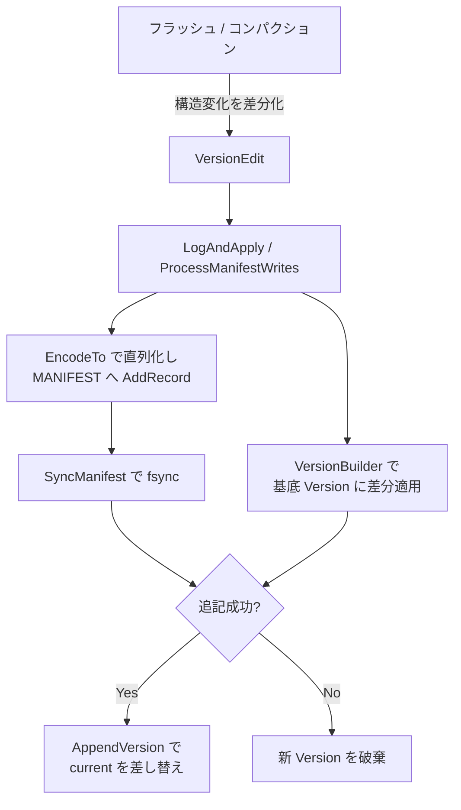
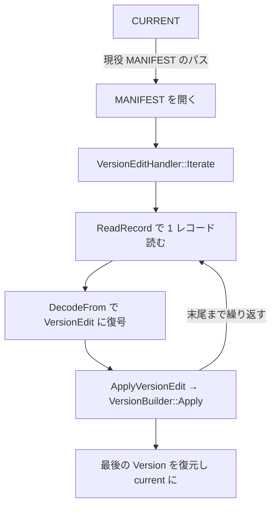

# 第34章 MANIFEST と VersionEdit

> **本章で読むソース**
>
> - [`db/version_edit.h`](https://github.com/facebook/rocksdb/blob/v11.1.1/db/version_edit.h)
> - [`db/version_edit.cc`](https://github.com/facebook/rocksdb/blob/v11.1.1/db/version_edit.cc)
> - [`db/version_set.cc`](https://github.com/facebook/rocksdb/blob/v11.1.1/db/version_set.cc)
> - [`db/version_edit_handler.h`](https://github.com/facebook/rocksdb/blob/v11.1.1/db/version_edit_handler.h)
> - [`db/version_edit_handler.cc`](https://github.com/facebook/rocksdb/blob/v11.1.1/db/version_edit_handler.cc)
> - [`db/version_builder.h`](https://github.com/facebook/rocksdb/blob/v11.1.1/db/version_builder.h)
> - [`db/version_builder.cc`](https://github.com/facebook/rocksdb/blob/v11.1.1/db/version_builder.cc)

## この章の狙い

フラッシュやコンパクションは、どの SST がどのレベルに存在するかという LSM-tree の構造を絶えず書き換える。
この構造を再起動後も復元できなければ、ディスク上の SST はただのファイルの山になってしまう。
本章は、構造の変化を差分として追記ログに記録する **MANIFEST** と、その差分の単位である **VersionEdit** を読む。
読了後には、なぜ全状態ではなく差分の追記で永続化が軽く済むのか、そして再起動時に差分を再生するだけで最後の状態が完全に復元できるのかを、機構として説明できるようになる。

## 前提

- [第13章 フラッシュ](../part02-write-path/13-flush.md)：MemTable を SST へ書き出し、その結果を MANIFEST に記録する。
- [第24章 Version と SuperVersion](../part04-read-path/24-version-superversion.md)：本章が組み立てる Version データ構造そのもの。
- [第31章 CompactionJob](../part05-compaction/31-compaction-job.md)：入力 SST の削除と出力 SST の追加を VersionEdit にまとめ、MANIFEST へ適用する。

## MANIFEST が記録するもの

RocksDB のある瞬間の状態を表すのが **Version** である。
Version は、各レベルにどの SST が属し、シーケンス番号やログ番号がいくつかといった、LSM-tree の構造のスナップショットを保持する。
フラッシュとコンパクションはこの構造を絶えず書き換えるので、Version は不変オブジェクトとして次々に作り直され、最新のものが current として参照される。
問題は、この current をどうやってディスクに永続化するかである。

素朴な方法は、構造が変わるたびに Version の全体をディスクへ書き直すことである。
だが LSM-tree が数千の SST を抱えると、一回のフラッシュで SST が一つ増えるだけでも全ファイル一覧を書き直すことになり、書き込み量が膨れ上がる。
RocksDB はかわりに、変化の **差分** だけを追記ログへ書く。
この追記ログが MANIFEST であり、差分の単位が VersionEdit である。
`VersionEdit` クラスの先頭コメントは、この関係を簡潔に述べている。

[`db/version_edit.h` L689-L693](https://github.com/facebook/rocksdb/blob/v11.1.1/db/version_edit.h#L689-L693)

```cpp
// The state of a DB at any given time is referred to as a Version.
// Any modification to the Version is considered a Version Edit. A Version is
// constructed by joining a sequence of Version Edits. Version Edits are written
// to the MANIFEST file.
```

ここから二つの事実が読み取れる。
Version への変更はすべて VersionEdit として表され、それが MANIFEST に書かれる。
そして Version は、VersionEdit の列をつなぎ合わせる（joining）ことで構成される。
追記された差分の列が、再生によって最後の Version へ畳み込まれるという往復の構造が、本章を貫く骨格である。

## VersionEdit：一回の構造変化を表す差分

`VersionEdit` は、一回の構造変化で「何が増え、何が減り、どの値がどう変わったか」だけを持つ。
ファイルの追加と削除を担うのが `AddFile` と `DeleteFile` である。

[`db/version_edit.h` L777-L784](https://github.com/facebook/rocksdb/blob/v11.1.1/db/version_edit.h#L777-L784)

```cpp
  // Delete the specified table file from the specified level.
  void DeleteFile(int level, uint64_t file) {
    deleted_files_.emplace(level, file);
  }

  // Retrieve the table files deleted as well as their associated levels.
  using DeletedFiles = std::set<std::pair<int, uint64_t>>;
  const DeletedFiles& GetDeletedFiles() const { return deleted_files_; }
```

`DeleteFile` が記録するのは「レベル」と「ファイル番号」の組だけである。
削除されるファイルの中身は MANIFEST に書かれない。
どのファイルかを一意に指す最小限の情報だけが差分として残る。
追加側の `AddFile` は新しい SST のメタデータ（境界キー、ファイルサイズ、シーケンス番号の範囲など）を `new_files_` に積む。

差分の対象はファイルの増減にとどまらない。
`VersionEdit` は、リカバリで再現すべき DB 全体のカウンタも差分として持つ。

[`db/version_edit.h` L735-L775](https://github.com/facebook/rocksdb/blob/v11.1.1/db/version_edit.h#L735-L775)

```cpp
  void SetLogNumber(uint64_t num) {
    has_log_number_ = true;
    log_number_ = num;
  }
  // ... (中略) ...
  void SetNextFile(uint64_t num) {
    has_next_file_number_ = true;
    next_file_number_ = num;
  }
  // ... (中略) ...
  void SetLastSequence(SequenceNumber seq) {
    has_last_sequence_ = true;
    last_sequence_ = seq;
  }
```

`log_number_` は、これより小さい番号の WAL は無視してよいことを示す。
`next_file_number_` は次に割り当てるファイル番号で、再起動後に既存ファイルと番号が衝突しないようにする。
`last_sequence_` は DB が割り当てた最新のシーケンス番号である。
それぞれに `has_log_number_` のような真偽フラグが対になっていて、この差分でその値を更新するのかどうかを表す。
フラグが立っていないフィールドは MANIFEST に書かれず、再生時にも触られない。
差分の「触っていない部分」を明示的に持たないのが、軽量さの第一の源である。

### Tag つき可変長エンコード

差分をディスクへ落とす形式を決めるのが `EncodeTo` である。
各フィールドは、種別を表す **Tag** を先頭に置き、続けて値を可変長整数（varint）で並べる。

[`db/version_edit.cc` L110-L138](https://github.com/facebook/rocksdb/blob/v11.1.1/db/version_edit.cc#L110-L138)

```cpp
  if (has_log_number_) {
    PutVarint32Varint64(dst, kLogNumber, log_number_);
  }
  if (has_prev_log_number_) {
    PutVarint32Varint64(dst, kPrevLogNumber, prev_log_number_);
  }
  if (has_next_file_number_) {
    PutVarint32Varint64(dst, kNextFileNumber, next_file_number_);
  }
  // ... (中略) ...
  if (has_last_sequence_) {
    PutVarint32Varint64(dst, kLastSequence, last_sequence_);
  }
  // ... (中略) ...
  for (const auto& deleted : deleted_files_) {
    PutVarint32Varint32Varint64(dst, kDeletedFile, deleted.first /* level */,
                                deleted.second /* file number */);
  }
```

`if (has_log_number_)` という形が示すとおり、フラグが立ったフィールドだけが書かれる。
たとえばログ番号は `kLogNumber` という Tag に続けて値を一つ並べるだけで、固定長のレコードヘッダもパディングもない。
削除ファイルは `kDeletedFile` Tag のあとにレベルとファイル番号を並べる。
小さい整数は varint で 1 バイトに収まるので、一回のフラッシュが生む差分は数十バイト程度に収まる。

Tag の番号は MANIFEST に直接書かれるため、互換性のために固定されている。
`enum Tag` の定義に、その意図がコメントとして残されている。

[`db/version_edit.h` L33-L47](https://github.com/facebook/rocksdb/blob/v11.1.1/db/version_edit.h#L33-L47)

```cpp
// Tag numbers for serialized VersionEdit.  These numbers are written to
// disk and should not be changed. The number should be forward compatible so
// users can down-grade RocksDB safely. A future Tag is ignored by doing '&'
// between Tag and kTagSafeIgnoreMask field.
enum Tag : uint32_t {
  kComparator = 1,
  kLogNumber = 2,
  kNextFileNumber = 3,
  kLastSequence = 4,
  kCompactCursor = 5,
  kDeletedFile = 6,
  kNewFile = 7,
  // 8 was used for large value refs
  kPrevLogNumber = 9,
  kMinLogNumberToKeep = 10,
```

Tag を固定し、新フィールドは新しい Tag として足すという規約のおかげで、古いバージョンの RocksDB は知らない Tag を読み飛ばせる。
コメントにある `kTagSafeIgnoreMask` は、将来追加された無視してよい Tag を判別するためのビットである。
これにより、新しいバージョンが書いた MANIFEST を古いバージョンが開いても、安全に無視できる差分は読み飛ばして起動できる。

新規 SST の差分は `kNewFile4` Tag で書かれ、可変長フィールドの集まりとして表現される。

[`db/version_edit.cc` L221-L231](https://github.com/facebook/rocksdb/blob/v11.1.1/db/version_edit.cc#L221-L231)

```cpp
void VersionEdit::EncodeToNewFile4(const FileMetaData& f, int level,
                                   size_t ts_sz,
                                   bool has_min_log_number_to_keep,
                                   uint64_t min_log_number_to_keep,
                                   bool& min_log_num_written,
                                   std::string* dst) {
  PutVarint32(dst, kNewFile4);
  PutVarint32Varint64(dst, level, f.fd.GetNumber());
  PutVarint64(dst, f.fd.GetFileSize());
  EncodeFileBoundaries(dst, f, ts_sz);
  PutVarint64Varint64(dst, f.fd.smallest_seqno, f.fd.largest_seqno);
```

固定の前半（レベル、ファイル番号、サイズ、境界キー、シーケンス番号の範囲）に続けて、チェックサムや作成時刻などのフィールドが「Tag、サイズ、中身」の三つ組として並ぶ。
ここでも、値を持つフィールドだけが書かれて終端 Tag で閉じられる。
省略されたフィールドは出力に現れず、読み出し側は既定値を補う。

### 復号と前方互換

書いた差分を読み戻すのが `DecodeFrom` である。
Tag を一つ読み、その種別に応じて値を取り出す `while` ループになっている。

[`db/version_edit.cc` L543-L573](https://github.com/facebook/rocksdb/blob/v11.1.1/db/version_edit.cc#L543-L573)

```cpp
  while (msg == nullptr && GetVarint32(&input, &tag)) {
    // ... (中略) ...
    switch (tag) {
      // ... (中略) ...
      case kLogNumber:
        if (GetVarint64(&input, &log_number_)) {
          has_log_number_ = true;
        } else {
          msg = "log number";
        }
        break;
```

`kLogNumber` を読むと値を取り出し、対応する `has_log_number_` を立てる。
書いたときと逆向きに、Tag が現れたフィールドだけが復元され、それ以外は既定値のまま残る。
削除ファイルや新規ファイルも同じループの別の `case` で処理され、`deleted_files_` や `new_files_` に積まれていく。
エンコードと同じく差分だけを往復させるので、書いた差分と読んだ差分は同じ内容になる。

## LogAndApply：差分の追記と新 Version の構築

差分を作っただけでは Version は更新されない。
差分を MANIFEST へ追記し、同時にメモリ上の Version を新しく作る経路が `VersionSet::LogAndApply` である。
この関数は、複数のカラムファミリーにまたがる複数の VersionEdit を一括で受け取る。

[`db/version_set.cc` L6469-L6484](https://github.com/facebook/rocksdb/blob/v11.1.1/db/version_set.cc#L6469-L6484)

```cpp
Status VersionSet::LogAndApply(
    const autovector<ColumnFamilyData*>& column_family_datas,
    const ReadOptions& read_options, const WriteOptions& write_options,
    const autovector<autovector<VersionEdit*>>& edit_lists,
    InstrumentedMutex* mu, FSDirectory* dir_contains_current_file,
    bool new_descriptor_log, const ColumnFamilyOptions* new_cf_options,
    const std::vector<std::function<void(const Status&)>>& manifest_wcbs,
    const std::function<Status()>& pre_cb) {
  mu->AssertHeld();
  int num_edits = 0;
  for (const auto& elist : edit_lists) {
    num_edits += static_cast<int>(elist.size());
  }
  if (num_edits == 0) {
    return Status::OK();
  }
```

`LogAndApply` は DB の `mutex_` を保持した状態で入る（`mu->AssertHeld()`）。
ただし MANIFEST への書き込みそのものは単一の書き手しか行えないので、各呼び出しは `ManifestWriter` としてキューに並び、先頭の書き手だけが実書き込みを担う。
先頭になった書き手は `ProcessManifestWrites` へ進み、ここで実際の追記と Version 構築が起きる。

### 複数差分のグループ化

`ProcessManifestWrites` は、キューに並んだ後続の書き手の差分をできるだけ一回の MANIFEST 書き込みにまとめる。
カラムファミリーの追加や削除でなければ、後続の書き手の `edit_list` を `batch_edits` に積み上げていく。

[`db/version_set.cc` L5942-L5964](https://github.com/facebook/rocksdb/blob/v11.1.1/db/version_set.cc#L5942-L5964)

```cpp
        for (const auto& e : last_writer->edit_list) {
          // ... (中略) ...
          Status s = LogAndApplyHelper(last_writer->cfd, builder, e,
                                       &max_last_sequence, mu);
          if (!s.ok()) {
            // free up the allocated memory
            for (auto v : versions) {
              delete v;
            }
            // FIXME? manifest_writers_ still has requested updates
            return s;
          }
          batch_edits.push_back(e);
          batch_edits_ts_sz.push_back(edit_ts_sz);
        }
```

差分一つごとに `LogAndApplyHelper` が呼ばれ、その中で差分が `VersionBuilder` に適用される。
複数の書き手の差分を一回の `fsync` で永続化できるので、同時に走るフラッシュやコンパクションが多いほど、MANIFEST への同期コストが書き手の数で割り勘になる。
これはWALのグループコミット（[第8章 書き込みパイプライン](../part02-write-path/08-write-pipeline.md)）と同じ発想で、永続化の固定費をまとめて償却している。

`LogAndApplyHelper` は、差分に DB 共通のカウンタを埋めてから `VersionBuilder` へ渡す。

[`db/version_set.cc` L6597-L6611](https://github.com/facebook/rocksdb/blob/v11.1.1/db/version_set.cc#L6597-L6611)

```cpp
  if (!edit->HasPrevLogNumber()) {
    edit->SetPrevLogNumber(prev_log_number_);
  }
  edit->SetNextFile(next_file_number_.load());
  if (edit->HasLastSequence() && edit->GetLastSequence() > *max_last_sequence) {
    *max_last_sequence = edit->GetLastSequence();
  } else {
    edit->SetLastSequence(*max_last_sequence);
  }

  // The builder can be nullptr only if edit is WAL manipulation,
  // because WAL edits do not need to be applied to versions,
  // we return Status::OK() in this case.
  assert(builder || edit->IsWalManipulation());
  return builder ? builder->Apply(edit) : Status::OK();
```

次のファイル番号と最新シーケンス番号を差分に書き込んでから `builder->Apply(edit)` を呼ぶ。
これらのカウンタは Version の構造そのものではないが、リカバリ時に再現する必要があるため、構造の差分と同じ MANIFEST レコードに同居させている。

### VersionBuilder：基底 Version への差分適用

`VersionBuilder` は、ある基底 Version に差分の列を適用して次の Version を組み立てる補助クラスである。
ヘッダのコメントは、その存在理由を「中間 Version を作らずに済ませる」ことだと説明している。

[`db/version_builder.h` L33-L36](https://github.com/facebook/rocksdb/blob/v11.1.1/db/version_builder.h#L33-L36)

```cpp
// A helper class so we can efficiently apply a whole sequence
// of edits to a particular state without creating intermediate
// Versions that contain full copies of the intermediate state.
class VersionBuilder {
```

要点は、差分の列を適用する途中で全状態のコピーを何度も作らないことにある。
`Apply` は、一つの差分に含まれる削除と追加を順に処理する。

[`db/version_builder.cc` L1079-L1101](https://github.com/facebook/rocksdb/blob/v11.1.1/db/version_builder.cc#L1079-L1101)

```cpp
    // Delete table files
    for (const auto& deleted_file : edit->GetDeletedFiles()) {
      const int level = deleted_file.first;
      const uint64_t file_number = deleted_file.second;

      const Status s = ApplyFileDeletion(level, file_number);
      if (!s.ok()) {
        return s;
      }
      version_updated = true;
    }

    // Add new table files
    for (const auto& new_file : edit->GetNewFiles()) {
      const int level = new_file.first;
      const FileMetaData& meta = new_file.second;

      const Status s = ApplyFileAddition(level, meta);
      if (!s.ok()) {
        return s;
      }
      version_updated = true;
    }
```

削除と追加は、基底 Version をその場で書き換えるのではなく、レベルごとの「追加された集合」と「削除された集合」に記録される。
`SaveTo` の段階で、基底 Version のファイル一覧にこの追加と削除を重ね合わせて最終的なファイル一覧を作る。
基底 Version 自体は不変のまま共有され、差分の分だけを別に持つので、Version を一つ作り直すコストは差分の大きさに比例する。
変わらなかった大多数の SST のメタデータは基底 Version から引き継がれ、コピーされない。

差分を `VersionBuilder` に渡しても、まだメモリ上の current は古いままである。
`ProcessManifestWrites` は、まず差分を MANIFEST へ書いて `fsync` し、それが成功してから新しい Version を current として差し込む。
この順序が、永続化の前に current を進めてしまう事故を防ぐ。

[`db/version_set.cc` L6169-L6203](https://github.com/facebook/rocksdb/blob/v11.1.1/db/version_set.cc#L6169-L6203)

```cpp
      for (size_t bidx = 0; bidx < batch_edits.size(); bidx++) {
        auto& e = batch_edits[bidx];
        // ... (中略) ...
        std::string record;
        if (!e->EncodeTo(&record, batch_edits_ts_sz[bidx])) {
          s = Status::Corruption("Unable to encode VersionEdit:" +
                                 e->DebugString(true));
          break;
        }
        // ... (中略) ...
        io_s = raw_desc_log_ptr->AddRecord(write_options, record);
        if (!io_s.ok()) {
          s = io_s;
          manifest_io_status = io_s;
          break;
        }
      }

      if (s.ok()) {
        io_s =
            SyncManifest(db_options_, write_options, raw_desc_log_ptr->file());
```

各差分が `EncodeTo` で 1 レコードに直列化され、`AddRecord` で MANIFEST へ追記される。
すべての追記が終わってから `SyncManifest` で `fsync` する。
書き込みと同期が成功した後で、`ProcessManifestWrites` の後段が新 Version を current にする。

[`db/version_set.cc` L6341-L6344](https://github.com/facebook/rocksdb/blob/v11.1.1/db/version_set.cc#L6341-L6344)

```cpp
      for (int i = 0; i < static_cast<int>(versions.size()); ++i) {
        ColumnFamilyData* cfd = versions[i]->cfd_;
        AppendVersion(cfd, versions[i]);
      }
```

`AppendVersion` が、組み上がった Version をカラムファミリーの current として差し込む。
ここまでで、ディスク上の MANIFEST とメモリ上の current が同じ差分を反映した状態に揃う。



## リカバリ：差分の再生による Version の復元

再起動時には、MANIFEST に追記された差分の列を順に再生して、最後の Version を組み直す。
出発点は `CURRENT` ファイルである。

### CURRENT が指す現役 MANIFEST

DB ディレクトリには複数の MANIFEST ファイルが残りうるが、現役の一つを指すのが `CURRENT` である。
`VersionSet::Recover` はまず `CURRENT` を読み、そこに書かれたパスの MANIFEST を開く。

[`db/version_set.cc` L6619-L6644](https://github.com/facebook/rocksdb/blob/v11.1.1/db/version_set.cc#L6619-L6644)

```cpp
  // Read "CURRENT" file, which contains a pointer to the current manifest
  // file
  std::string manifest_path;
  Status s = GetCurrentManifestPath(dbname_, fs_.get(), is_retry,
                                    &manifest_path, &manifest_file_number_);
  if (!s.ok()) {
    return s;
  }
  // ... (中略) ...
  std::unique_ptr<SequentialFileReader> manifest_file_reader;
  {
    std::unique_ptr<FSSequentialFile> manifest_file;
    s = fs_->NewSequentialFile(manifest_path,
                               fs_->OptimizeForManifestRead(file_options_),
                               &manifest_file, nullptr);
```

`CURRENT` は MANIFEST ファイル名を一行書いただけの小さなテキストファイルである。
この一行を読めば現役の MANIFEST が一意に決まる。
`CURRENT` を新しい MANIFEST に向け直す操作は、後述するとおりアトミックに行われるので、リカバリが中途半端な MANIFEST を掴むことはない。

### 差分列の再生

MANIFEST を開いたら、`VersionEditHandler` がその差分列を読んで Version を組み直す。
ヘッダのクラスコメントが、この役割を端的に述べている。

[`db/version_edit_handler.h` L123-L127](https://github.com/facebook/rocksdb/blob/v11.1.1/db/version_edit_handler.h#L123-L127)

```cpp
// A class used for scanning MANIFEST file.
// VersionEditHandler reads a MANIFEST file, parses the version edits, and
// builds the version set's in-memory state, e.g. the version storage info for
// the versions of column families. It replays all the version edits in one
// MANIFEST file to build the end version.
```

差分を一つずつ読んで適用するループが `Iterate` である。

[`db/version_edit_handler.cc` L33-L63](https://github.com/facebook/rocksdb/blob/v11.1.1/db/version_edit_handler.cc#L33-L63)

```cpp
  while (reader.LastRecordEnd() < max_manifest_read_size_ && s.ok() &&
         reader.ReadRecord(&record, &scratch) && log_read_status->ok()) {
    VersionEdit edit;
    s = edit.DecodeFrom(record);
    // ... (中略) ...
    if (s.ok()) {
      ColumnFamilyData* cfd = nullptr;
      if (edit.IsInAtomicGroup()) {
        // ... (中略) ...
      } else {
        s = ApplyVersionEdit(edit, &cfd);
        if (s.ok()) {
          recovered_edits++;
        }
      }
    }
  }
```

MANIFEST から 1 レコードを読み、`DecodeFrom` で `VersionEdit` に復号し、`ApplyVersionEdit` で適用する。
これを末尾まで繰り返すのがリカバリの本体である。
書き込み時に差分を順に追記したのと同じ順序で読み直すので、最後の差分まで適用し終えた状態が、停止直前の current と一致する。

`ApplyVersionEdit` は差分の種別で処理を振り分け、SST の増減を伴う通常の差分は `OnNonCfOperation` へ送る。

[`db/version_edit_handler.cc` L220-L233](https://github.com/facebook/rocksdb/blob/v11.1.1/db/version_edit_handler.cc#L220-L233)

```cpp
Status VersionEditHandler::ApplyVersionEdit(VersionEdit& edit,
                                            ColumnFamilyData** cfd) {
  Status s;
  if (edit.IsColumnFamilyAdd()) {
    s = OnColumnFamilyAdd(edit, cfd);
  } else if (edit.IsColumnFamilyDrop()) {
    s = OnColumnFamilyDrop(edit, cfd);
  } else if (edit.IsWalAddition()) {
    s = OnWalAddition(edit);
  } else if (edit.IsWalDeletion()) {
    s = OnWalDeletion(edit);
  } else {
    s = OnNonCfOperation(edit, cfd);
  }
```

`OnNonCfOperation` は、最終的に `MaybeCreateVersionBeforeApplyEdit` を通じて、書き込み時と同じ `VersionBuilder` に差分を適用する。

[`db/version_edit_handler.cc` L520-L544](https://github.com/facebook/rocksdb/blob/v11.1.1/db/version_edit_handler.cc#L520-L544)

```cpp
Status VersionEditHandler::MaybeCreateVersionBeforeApplyEdit(
    const VersionEdit& edit, ColumnFamilyData* cfd, bool force_create_version) {
  assert(cfd->initialized());
  Status s;
  auto builder_iter = builders_.find(cfd->GetID());
  assert(builder_iter != builders_.end());
  auto* builder = builder_iter->second->version_builder();
  // ... (中略) ...
  s = builder->Apply(&edit);
  return s;
}
```

カラムファミリーごとに `VersionBuilder` を一つ持ち、その builder に差分を順に `Apply` していく。
書き込みパスと読み取りパスが同じ `VersionBuilder::Apply` を使う点が要である。
差分を生成して適用するコードと、差分を再生して適用するコードが同一なので、両者がずれて状態が食い違う余地がない。
全 MANIFEST を読み終えると、各カラムファミリーの builder が最後の Version を持ち、それが current として据えられる。



## MANIFEST のローテーション

差分を追記し続けると MANIFEST は際限なく伸びる。
肥大化を抑えるため、MANIFEST が一定サイズを超えると新しいファイルへ切り替える。
判定は `ProcessManifestWrites` の中で行われる。

[`db/version_set.cc` L6039-L6048](https://github.com/facebook/rocksdb/blob/v11.1.1/db/version_set.cc#L6039-L6048)

```cpp
  uint64_t prev_manifest_file_size = manifest_file_size_;
  assert(pending_manifest_file_number_ == 0);
  if (!skip_manifest_write &&
      (!descriptor_log_ ||
       prev_manifest_file_size >= tuned_max_manifest_file_size_)) {
    TEST_SYNC_POINT("VersionSet::ProcessManifestWrites:BeforeNewManifest");
    new_descriptor_log = true;
  } else {
    pending_manifest_file_number_ = manifest_file_number_;
  }
```

現在の MANIFEST サイズが `tuned_max_manifest_file_size_` 以上になると、`new_descriptor_log` を立てて新しい MANIFEST を作る。
この閾値の下限は `max_manifest_file_size` オプションで、既定値は 1 GiB である。

[`include/rocksdb/options.h` L995](https://github.com/facebook/rocksdb/blob/v11.1.1/include/rocksdb/options.h#L995)

```cpp
  uint64_t max_manifest_file_size = 1024 * 1024 * 1024;
```

新しい MANIFEST を差分の続きから書き始めると、それ以前の差分が古いファイルに取り残されてしまう。
そこで新規 MANIFEST の先頭には、差分ではなく現在の全状態を一度だけ書き出す。
これを担うのが `WriteCurrentStateToManifest` である。

[`db/version_set.cc` L7249-L7276](https://github.com/facebook/rocksdb/blob/v11.1.1/db/version_set.cc#L7249-L7276)

```cpp
    {
      // Save files
      VersionEdit edit;
      edit.SetColumnFamily(cfd->GetID());

      const auto* current = cfd->current();
      assert(current);

      const auto* vstorage = current->storage_info();
      assert(vstorage);

      for (int level = 0; level < cfd->NumberLevels(); level++) {
        const auto& level_files = vstorage->LevelFiles(level);

        for (const auto& f : level_files) {
          assert(f);
          edit.AddFile(level, f->fd.GetNumber(), f->fd.GetPathId(),
                       f->fd.GetFileSize(), f->smallest, f->largest,
                       // ... (中略) ...
                       f->max_timestamp);
        }
      }
```

現在の current が持つ全レベルの全 SST を `AddFile` で一つの `VersionEdit` に詰め込み、新 MANIFEST の冒頭レコードとして書く。
全状態を一回の差分として表したものが、新しい MANIFEST の出発点になる。
これ以降は、いつもどおり差分だけが追記される。
リカバリは新 MANIFEST だけを読めばよく、冒頭の全状態レコードを基底にして以降の差分を再生すれば、最後の Version が復元できる。

全状態を書き出した新 MANIFEST が用意できたら、最後に `CURRENT` を新ファイルへ向け直す。
向け直しは `SetCurrentFile` が担い、一時ファイルへ書いてからリネームするという二段構えになっている。

[`file/filename.cc` L443-L453](https://github.com/facebook/rocksdb/blob/v11.1.1/file/filename.cc#L443-L453)

```cpp
  if (s.ok()) {
    s = WriteStringToFile(fs, contents.ToString() + "\n", tmp, true, opts,
                          file_opts);
  }
  TEST_SYNC_POINT_CALLBACK("SetCurrentFile:BeforeRename", &s);
  if (s.ok()) {
    TEST_KILL_RANDOM_WITH_WEIGHT("SetCurrentFile:0", REDUCE_ODDS2);
    s = fs->RenameFile(tmp, CurrentFileName(dbname), opts, nullptr);
    TEST_KILL_RANDOM_WITH_WEIGHT("SetCurrentFile:1", REDUCE_ODDS2);
    TEST_SYNC_POINT_CALLBACK("SetCurrentFile:AfterRename", &s);
  }
```

新しい MANIFEST 名を一時ファイル `tmp` に書き、それを `CURRENT` へリネームする。
多くのファイルシステムでリネームはアトミックなので、`CURRENT` は古い MANIFEST 名か新しい MANIFEST 名のどちらかを必ず指す。
リネームの途中でクラッシュしても、`CURRENT` が壊れた中身を指すことはない。
古い MANIFEST を指していれば古い全状態と差分から復元でき、新しい MANIFEST を指していれば冒頭の全状態から復元できる。
どちらに転んでも一貫した Version が再生されるため、ローテーションがリカバリの正しさを損なわない。

古くなった MANIFEST は、不要ファイルとして削除の対象に回る。
その回収手順は[第37章 ファイル管理](./37-file-management.md)で扱う。

## まとめ

- MANIFEST は LSM-tree の構造変化を記録する追記ログで、`CURRENT` ファイルが現役の MANIFEST を一意に指す。
- `VersionEdit` は一回の構造変化を全状態でなく差分として表す。`AddFile` / `DeleteFile` とログ番号やシーケンス番号などのカウンタを、Tag つき可変長エンコードで直列化し、値を持つフィールドだけを書く。
- `LogAndApply`（実体は `ProcessManifestWrites`）は、差分を MANIFEST へ追記して `fsync` し、それが成功してから `VersionBuilder` で組んだ新 Version を current に差し込む。複数の書き手の差分は一回の同期にグループ化され、永続化の固定費を償却する。
- リカバリは `CURRENT` が指す MANIFEST を開き、`VersionEditHandler` が差分列を `DecodeFrom` して書き込み時と同じ `VersionBuilder::Apply` で再生する。差分の生成と再生が同じコードを通るので、復元された状態が食い違わない。
- MANIFEST が `max_manifest_file_size`（既定 1 GiB）由来の閾値を超えると新ファイルへローテーションし、`WriteCurrentStateToManifest` が冒頭に現在の全状態を一度だけ書く。`CURRENT` の差し替えは一時ファイルのリネームでアトミックに行われ、クラッシュしても一貫した Version が復元できる。

## 関連する章

- [第24章 Version と SuperVersion](../part04-read-path/24-version-superversion.md)：本章が組み立てる Version データ構造の内部と、読み出しからの参照。
- [第35章 カラムファミリー](./35-column-family.md)：MANIFEST が複数のカラムファミリーの状態をどう束ねるか。
- [第37章 ファイル管理](./37-file-management.md)：古い MANIFEST や不要になった SST の削除。
