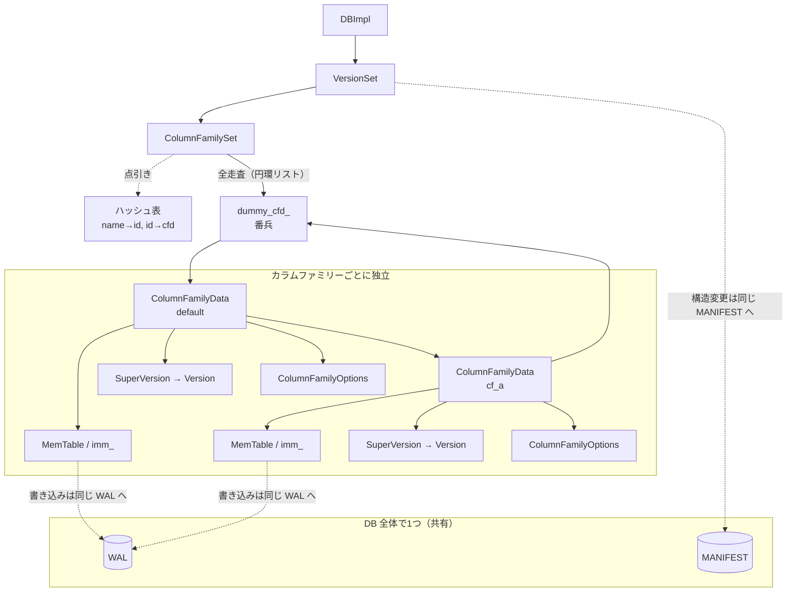

# 第35章 カラムファミリー

> **本章で読むソース**
> - [`db/column_family.h`](https://github.com/facebook/rocksdb/blob/v11.1.1/db/column_family.h)
> - [`db/column_family.cc`](https://github.com/facebook/rocksdb/blob/v11.1.1/db/column_family.cc)
> - [`db/version_set.h`](https://github.com/facebook/rocksdb/blob/v11.1.1/db/version_set.h)
> - [`include/rocksdb/options.h`](https://github.com/facebook/rocksdb/blob/v11.1.1/include/rocksdb/options.h)
> - [`include/rocksdb/db.h`](https://github.com/facebook/rocksdb/blob/v11.1.1/include/rocksdb/db.h)
> - [`db/db_impl/db_impl.cc`](https://github.com/facebook/rocksdb/blob/v11.1.1/db/db_impl/db_impl.cc)

## この章の狙い

1つの DB の中に独立した名前空間を複数持たせる仕組みがカラムファミリーである。
本章では、各カラムファミリーが固有の MemTable・SST 群・`ColumnFamilyOptions` を持つ一方で、WAL と MANIFEST は DB 全体で1つに共有される、という独立と共有の境界を実コードで確認する。
その境界から、複数カラムファミリーへの書き込みを1回の同期で原子的に永続化できる理由と、カラムファミリーごとにコンパクションを独立してチューニングできる理由を、機構として読み取る。

## 前提

- [第24章 Version と SuperVersion](../part04-read-path/24-version-superversion.md)：各カラムファミリーが持つ `SuperVersion` の中身を先に押さえておくとよい。

## カラムファミリーが持つもの、DB が持つもの

カラムファミリーは、1つの DB の中で互いに独立したキー空間を提供する単位である。
利用者から見れば、同じ DB ファイル群を共有しながら、別々の LSM ツリーに読み書きする窓口になる。
この単位ごとの状態をまとめて保持するクラスが `ColumnFamilyData` である。
ヘッダのクラスコメントが役割を一文で述べている。

[`db/column_family.h` L296-L298](https://github.com/facebook/rocksdb/blob/v11.1.1/db/column_family.h#L296-L298)

```cpp
// This class keeps all the data that a column family needs.
// Most methods require DB mutex held, unless otherwise noted
class ColumnFamilyData {
```

何が「カラムファミリーごと」なのかは、`ColumnFamilyData` のメンバを見ると分かる。
現在書き込み中の MemTable、フラッシュ待ちの Immutable MemTable のリスト、そして最新像を指す `SuperVersion` を、各カラムファミリーが自分のメンバとして持つ。

[`db/column_family.h` L656-L658](https://github.com/facebook/rocksdb/blob/v11.1.1/db/column_family.h#L656-L658)

```cpp
  MemTable* mem_;
  MemTableList imm_;
  SuperVersion* super_version_;
```

オプションも同様にカラムファミリーごとである。
`ColumnFamilyData` は構築時に渡された `ColumnFamilyOptions` を `initial_cf_options_` として保持し、そこから不変部分の `ioptions_` と可変部分の `mutable_cf_options_` を導く。

[`db/column_family.h` L642-L644](https://github.com/facebook/rocksdb/blob/v11.1.1/db/column_family.h#L642-L644)

```cpp
  const ColumnFamilyOptions initial_cf_options_;
  const ImmutableOptions ioptions_;
  MutableCFOptions mutable_cf_options_;
```

ここで効いてくるのが、第6章で見た `ColumnFamilyOptions` と `DBOptions` の境界である。
`include/rocksdb/options.h` では、DB 全体の設定を表す `DBOptions` とカラムファミリー単位の設定を表す `ColumnFamilyOptions` が別の構造体として定義され、両者を継承で1つにまとめたものが `Options` である。

[`include/rocksdb/options.h` L1765-L1766](https://github.com/facebook/rocksdb/blob/v11.1.1/include/rocksdb/options.h#L1765-L1766)

```cpp
// Options to control the behavior of a database (passed to DB::Open)
struct Options : public DBOptions, public ColumnFamilyOptions {
```

この型の分割がそのまま `ColumnFamilyData` の構成に写し取られている。
コンパクションの設定や書き込みバッファのサイズはカラムファミリーごとの `ColumnFamilyOptions` から来るので、`ColumnFamilyData` が `initial_cf_options_` として自前で保持する。
一方、背景スレッド数や DB レベルのキャッシュは `DBOptions` に属し、DB 全体で1つの値を共有する。

つまり、MemTable・Version・オプションはカラムファミリーで独立し、それらを使ってどう読み書きするかも独立する。
独立しないのは、変更を永続化する経路、すなわち WAL と MANIFEST である。

## ColumnFamilySet が全カラムファミリーを束ねる

DB の中に存在する全カラムファミリーを管理するのが `ColumnFamilySet` である。
`VersionSet` が DB ごとに1つだけ `ColumnFamilySet` を持ち、そこから全カラムファミリーへ到達する。
`version_set.h` のクラスコメントがこの関係を述べている。

[`db/version_set.h` L1201-L1203](https://github.com/facebook/rocksdb/blob/v11.1.1/db/version_set.h#L1201-L1203)

```cpp
// VersionSet is the collection of versions of all the column families of the
// database. Each database owns one VersionSet. A VersionSet has access to all
// column families via ColumnFamilySet, i.e. set of the column families.
```

`VersionSet` は `ColumnFamilySet` を `unique_ptr` で1つ保持し、`GetColumnFamilySet()` でそれを返す。

[`db/version_set.h` L1586](https://github.com/facebook/rocksdb/blob/v11.1.1/db/version_set.h#L1586)

```cpp
  ColumnFamilySet* GetColumnFamilySet() { return column_family_set_.get(); }
```

`ColumnFamilySet` は全カラムファミリーを2通りの方法で引けるようにしている。
1つは ID または名前からの直接引きで、`column_family_data_`（ID から `ColumnFamilyData*` へ）と `column_families_`（名前から ID へ）の2つのハッシュ表が担う。

[`db/column_family.h` L814-L815](https://github.com/facebook/rocksdb/blob/v11.1.1/db/column_family.h#L814-L815)

```cpp
  UnorderedMap<std::string, uint32_t> column_families_;
  UnorderedMap<uint32_t, ColumnFamilyData*> column_family_data_;
```

もう1つは全カラムファミリーの走査で、こちらは円環二重リンクリストが担う。
`ColumnFamilyData` は次と前を指すポインタを持ち、リストの要素として連なる。

[`db/column_family.h` L669-L673](https://github.com/facebook/rocksdb/blob/v11.1.1/db/column_family.h#L669-L673)

```cpp
  // pointers for a circular linked list. we use it to support iterations over
  // all column families that are alive (note: dropped column families can also
  // be alive as long as client holds a reference)
  ColumnFamilyData* next_;
  ColumnFamilyData* prev_;
```

このリストの番兵が `dummy_cfd_` である。
`ColumnFamilySet` の構築時に、ダミー用の予約 ID を持つ `ColumnFamilyData` を作り、自分自身を `prev_`・`next_` に指させて空の円環を初期化する。

[`db/column_family.cc` L1789-L1791](https://github.com/facebook/rocksdb/blob/v11.1.1/db/column_family.cc#L1789-L1791)

```cpp
  // initialize linked list
  dummy_cfd_->prev_ = dummy_cfd_;
  dummy_cfd_->next_ = dummy_cfd_;
```

走査はこの番兵を端点として行う。
`begin()` は番兵の次から始まり、`end()` は番兵自身を指すので、`for (auto cfd : *cfs)` が全カラムファミリーをちょうど1周する。

[`db/column_family.h` L792-L793](https://github.com/facebook/rocksdb/blob/v11.1.1/db/column_family.h#L792-L793)

```cpp
  iterator begin() { return iterator(dummy_cfd_->next_); }
  iterator end() { return iterator(dummy_cfd_); }
```

ハッシュ表が点引きを、リンクリストが全走査を受け持つ役割分担になっている。
点引きは `Seek` で特定のカラムファミリーへ飛ぶ書き込み経路が使い、全走査はフラッシュやコンパクションの候補をカラムファミリー横断で探す背景処理が使う。



## デフォルトカラムファミリー

カラムファミリーを明示せずに開いた DB も、内部では必ず1つのカラムファミリーを持つ。
それが `"default"` という名前を持つデフォルトカラムファミリーである。

[`db/db_impl/db_impl.cc` L121](https://github.com/facebook/rocksdb/blob/v11.1.1/db/db_impl/db_impl.cc#L121)

```cpp
const std::string kDefaultColumnFamilyName("default");
```

デフォルトカラムファミリーの ID は 0 で固定される。
`CreateColumnFamily` はリンクリストへ追加した後、ID が 0 なら `default_cfd_cache_` にそのカラムファミリーを覚える。

[`db/column_family.cc` L1872-L1874](https://github.com/facebook/rocksdb/blob/v11.1.1/db/column_family.cc#L1872-L1874)

```cpp
  if (id == 0) {
    default_cfd_cache_ = new_cfd;
  }
```

この `default_cfd_cache_` は名前のとおりキャッシュであり、`GetDefault()` がハッシュ表を引かずに即座に返すための近道である。
コメントはデフォルトカラムファミリーが常に存在するためここでは参照カウントを持たないこと、そしてこれが共通操作を速くするためのキャッシュであることを述べている。

[`db/column_family.h` L830-L834](https://github.com/facebook/rocksdb/blob/v11.1.1/db/column_family.h#L830-L834)

```cpp
  // We don't hold the refcount here, since default column family always exists
  // We are also not responsible for cleaning up default_cfd_cache_. This is
  // just a cache that makes common case (accessing default column family)
  // faster
  ColumnFamilyData* default_cfd_cache_;
```

書き込み経路はこのキャッシュを使う。
`ColumnFamilyMemTablesImpl::Seek` は、カラムファミリー ID が 0 のとき `GetColumnFamily` のハッシュ引きを避けて `GetDefault()` を直接呼ぶ。

[`db/column_family.cc` L1890-L1896](https://github.com/facebook/rocksdb/blob/v11.1.1/db/column_family.cc#L1890-L1896)

```cpp
bool ColumnFamilyMemTablesImpl::Seek(uint32_t column_family_id) {
  if (column_family_id == 0) {
    // optimization for common case
    current_ = column_family_set_->GetDefault();
  } else {
    current_ = column_family_set_->GetColumnFamily(column_family_id);
  }
```

カラムファミリーを使い分けない利用者がもっとも多いという前提のもとで、ID 0 の経路をハッシュ引きから1つの分岐とポインタ参照に縮めている。
デフォルトカラムファミリーは削除できない。
`SetDropped` の冒頭と `DropColumnFamilyImpl` の双方が ID 0 を弾く（後述）。

## ハンドルと参照カウントによる寿命管理

利用者がカラムファミリーを操作するために受け取るのが `ColumnFamilyHandleImpl` である。
ハンドルは対応する `ColumnFamilyData` へのポインタを保持する。

[`db/column_family.h` L162-L172](https://github.com/facebook/rocksdb/blob/v11.1.1/db/column_family.h#L162-L172)

```cpp
// ColumnFamilyHandleImpl is the class that clients use to access different
// column families. It has non-trivial destructor, which gets called when client
// is done using the column family
class ColumnFamilyHandleImpl : public ColumnFamilyHandle {
 public:
  // create while holding the mutex
  ColumnFamilyHandleImpl(ColumnFamilyData* cfd, DBImpl* db,
                         InstrumentedMutex* mutex);
  // destroy without mutex
  virtual ~ColumnFamilyHandleImpl();
  virtual ColumnFamilyData* cfd() const { return cfd_; }
```

`ColumnFamilyData` の寿命は参照カウント `refs_` で管理する。
`Ref()` はアトミックにカウントを増やす。

[`db/column_family.h` L307-L310](https://github.com/facebook/rocksdb/blob/v11.1.1/db/column_family.h#L307-L310)

```cpp
  // Ref() can only be called from a context where the caller can guarantee
  // that ColumnFamilyData is alive (while holding a non-zero ref already,
  // holding a DB mutex, or as the leader in a write batch group).
  void Ref() { refs_.fetch_add(1); }
```

ハンドルを作るとき、`ColumnFamilyHandleImpl` のコンストラクタが `cfd_->Ref()` を呼んで参照を1つ取る。

[`db/column_family.cc` L46-L52](https://github.com/facebook/rocksdb/blob/v11.1.1/db/column_family.cc#L46-L52)

```cpp
ColumnFamilyHandleImpl::ColumnFamilyHandleImpl(
    ColumnFamilyData* column_family_data, DBImpl* db, InstrumentedMutex* mutex)
    : cfd_(column_family_data), db_(db), mutex_(mutex) {
  if (cfd_ != nullptr) {
    cfd_->Ref();
  }
}
```

解放は `UnrefAndTryDelete()` が担う。
カウントをアトミックに1つ減らし、減らす前の値が 1 だったとき、すなわち自分が最後の参照だったときにだけ自身を `delete` する。

[`db/column_family.cc` L785-L793](https://github.com/facebook/rocksdb/blob/v11.1.1/db/column_family.cc#L785-L793)

```cpp
bool ColumnFamilyData::UnrefAndTryDelete() {
  int old_refs = refs_.fetch_sub(1);
  assert(old_refs > 0);

  if (old_refs == 1) {
    assert(super_version_ == nullptr);
    delete this;
    return true;
  }
```

減らす前の値が 2 で、しかも残りの参照が `super_version_` だけのときは、特別な経路で `SuperVersion` ごと畳む。
ここで `SuperVersion` が `MemTable` や `Version` を握っているため、まずそれを解放しないと `ColumnFamilyData` を消せない。

[`db/column_family.cc` L795-L811](https://github.com/facebook/rocksdb/blob/v11.1.1/db/column_family.cc#L795-L811)

```cpp
  if (old_refs == 2 && super_version_ != nullptr) {
    // Only the super_version_ holds me
    SuperVersion* sv = super_version_;
    super_version_ = nullptr;

    // Release SuperVersion references kept in ThreadLocalPtr.
    local_sv_.reset();

    if (sv->Unref()) {
      // Note: sv will delete this ColumnFamilyData during Cleanup()
      assert(sv->cfd == this);
      sv->Cleanup();
      delete sv;
      return true;
    }
  }
```

参照を持つのはハンドルだけではない。
進行中の `Get` やイテレータ、コンパクションも `SuperVersion` を通じて間接的に `ColumnFamilyData` を生かし続ける。
この間接参照が、第24章で見たように「操作中の MemTable と SST が消えないこと」を保証する。

## 作成と削除

カラムファミリーの作成は `ColumnFamilySet::CreateColumnFamily` が行う。
新しい `ColumnFamilyData` を割り当て、2つのハッシュ表へ登録し、円環リストの番兵の直前へ挿入する。

[`db/column_family.cc` L1852-L1871](https://github.com/facebook/rocksdb/blob/v11.1.1/db/column_family.cc#L1852-L1871)

```cpp
  ColumnFamilyData* new_cfd = new ColumnFamilyData(
      id, name, dummy_versions, table_cache_, write_buffer_manager_, options,
      *db_options_, &file_options_, this, block_cache_tracer_, io_tracer_,
      db_id_, db_session_id_, read_only);
  column_families_.insert({name, id});
  column_family_data_.insert({id, new_cfd});
  // ... (中略) ...
  max_column_family_ = std::max(max_column_family_, id);
  // add to linked list
  new_cfd->next_ = dummy_cfd_;
  auto prev = dummy_cfd_->prev_;
  new_cfd->prev_ = prev;
  prev->next_ = new_cfd;
  dummy_cfd_->prev_ = new_cfd;
```

削除はファイルの即時消去ではない。
`ColumnFamilyData::SetDropped` がすることは、`dropped_` フラグを立て、`ColumnFamilySet` のハッシュ表とリンクリストから自身を外すことだけである。

[`db/column_family.cc` L814-L822](https://github.com/facebook/rocksdb/blob/v11.1.1/db/column_family.cc#L814-L822)

```cpp
void ColumnFamilyData::SetDropped() {
  // can't drop default CF
  assert(id_ != 0);
  dropped_ = true;
  write_controller_token_.reset();

  // remove from column_family_set
  column_family_set_->RemoveColumnFamily(this);
}
```

ファイルとメモリが回収されるのは、参照が尽きてからである。
ヘッダの `SetDropped` のコメントが、削除後も利用者がハンドルを手放すまでファイルとメモリを残し、その間も読み取りを続けられること、そして参照されなくなった時点で初めてリンクリストから外し、メモリとファイルを消すことを明記している。

[`db/column_family.h` L321-L333](https://github.com/facebook/rocksdb/blob/v11.1.1/db/column_family.h#L321-L333)

```cpp
  // After dropping column family no other operation on that column family
  // will be executed. All the files and memory will be, however, kept around
  // until client drops the column family handle. That way, client can still
  // access data from dropped column family.
  // Column family can be dropped and still alive. In that state:
  // *) Compaction and flush is not executed on the dropped column family.
  // *) Client can continue reading from column family. Writes will fail unless
  // WriteOptions::ignore_missing_column_families is true
  // When the dropped column family is unreferenced, then we:
  // *) Remove column family from the linked list maintained by ColumnFamilySet
  // *) delete all memory associated with that column family
  // *) delete all the files associated with that column family
  void SetDropped();
```

このフラグ立てとファイル回収の分離が、ハンドルの寿命と物理削除を切り離す。
利用者がドロップ済みのカラムファミリーを読んでいる最中でも、ハンドルが参照を保つ限りファイルは生き続け、最後の参照が消えたときに `UnrefAndTryDelete` が回収を起動する。
実際の起動点はハンドルのデストラクタである。
`UnrefAndTryDelete` が真を返し、かつそのカラムファミリーがドロップ済みなら、不要ファイルの探索を呼ぶ。

[`db/column_family.cc` L65-L72](https://github.com/facebook/rocksdb/blob/v11.1.1/db/column_family.cc#L65-L72)

```cpp
    mutex_->Lock();
    bool dropped = cfd_->IsDropped();
    if (cfd_->UnrefAndTryDelete()) {
      if (dropped) {
        db_->FindObsoleteFiles(&job_context, false, true);
      }
    }
    mutex_->Unlock();
```

論理削除を MANIFEST に記録するのは `DropColumnFamilyImpl` である。
ここでドロップを表す `VersionEdit` を作り、単一の書き込みスレッドから `versions_->LogAndApply` に渡す。
削除という構造変更も、他のカラムファミリーの変更と同じ MANIFEST へ、同じ `LogAndApply` 経由で記録される（MANIFEST は第34章）。

[`db/db_impl/db_impl.cc` L3897-L3916](https://github.com/facebook/rocksdb/blob/v11.1.1/db/db_impl/db_impl.cc#L3897-L3916)

```cpp
  VersionEdit edit;
  edit.DropColumnFamily();
  edit.SetColumnFamily(cfd->GetID());
  // ... (中略) ...
    if (s.ok()) {
      // we drop column family from a single write thread
      WriteThread::Writer w;
      write_thread_.EnterUnbatched(&w, &mutex_);
      s = versions_->LogAndApply(cfd, read_options, write_options, &edit,
                                 &mutex_, directories_.GetDbDir());
      write_thread_.ExitUnbatched(&w);
    }
```

## WAL と MANIFEST の共有がもたらす跨ぎ原子性

ここまでで、MemTable・Version・オプションがカラムファミリーごとに独立し、`ColumnFamilySet` がそれらを束ねることを見た。
独立しないのは永続化の経路である。
`VersionSet` は DB ごとに1つで、すべてのカラムファミリーの構造変更を1つの MANIFEST に記録する。
データの変更を記録する WAL も DB 全体で1つである。

WAL が1つであることは書き込み経路に現れる。
`WriteBatch` は各レコードにカラムファミリー ID を持ち（第7章）、書き込み時に `ColumnFamilyMemTablesImpl::Seek` がその ID から宛先 `ColumnFamilyData` を選んで MemTable へ振り分ける。
振り分けの前段で、レコードはカラムファミリーの別を問わず同じ WAL へ追記される。
そのため、複数のカラムファミリーへの更新を1つの `WriteBatch` にまとめると、それらは1回の WAL 追記とその同期で一括して永続化される。
ある時点までの WAL が永続化されたなら、その中の全カラムファミリーの更新が永続化されたか、1つも永続化されていないかのどちらかになる。
カラムファミリーを跨ぐ書き込みの原子性は、この単一の WAL と単一の同期に由来する。

リカバリ時にどの WAL から再生するかは、カラムファミリーごとに記録された最小ログ番号で決まる。
`ColumnFamilyData` は自身のデータを含む最古のログファイル番号 `log_number_` を持ち、それより前のログは無視してよい。

[`db/column_family.h` L675-L678](https://github.com/facebook/rocksdb/blob/v11.1.1/db/column_family.h#L675-L678)

```cpp
  // This is the earliest log file number that contains data from this
  // Column Family. All earlier log files must be ignored and not
  // recovered from
  uint64_t log_number_;
```

カラムファミリーごとにフラッシュの進み方が違うため、再生が必要な WAL の範囲もカラムファミリーごとに違う。
共有された1つの WAL を、各カラムファミリーが自分の `log_number_` を起点に読み直す構図になる。

## カラムファミリーごとに独立したコンパクション

オプションがカラムファミリーごとである利点は、コンパクションの独立にもっとも色濃く現れる。
`ColumnFamilyData` はコンパクション戦略を選ぶ `CompactionPicker` を自前で持つ。

[`db/column_family.h` L680-L682](https://github.com/facebook/rocksdb/blob/v11.1.1/db/column_family.h#L680-L682)

```cpp
  // An object that keeps all the compaction stats
  // and picks the next compaction
  std::unique_ptr<CompactionPicker> compaction_picker_;
```

`NeedsCompaction` や `PickCompaction` も `ColumnFamilyData` のメソッドであり、判断材料となるレベル構造は自分の `Version` から来る。

[`db/column_family.h` L419-L428](https://github.com/facebook/rocksdb/blob/v11.1.1/db/column_family.h#L419-L428)

```cpp
  // See documentation in compaction_picker.h
  // REQUIRES: DB mutex held
  bool NeedsCompaction() const;
  // REQUIRES: DB mutex held
  Compaction* PickCompaction(
      const MutableCFOptions& mutable_options,
      const MutableDBOptions& mutable_db_options,
      const std::vector<SequenceNumber>& existing_snapshots,
      const SnapshotChecker* snapshot_checker, LogBuffer* log_buffer,
      bool require_max_output_level = false);
```

`ColumnFamilyOptions` から来るコンパクション設定が `ColumnFamilyData` ごとに保持され、コンパクションを選ぶ `CompactionPicker` も対象となる `Version` もカラムファミリーごとに分かれている。
このため、あるカラムファミリーをレベルコンパクションで、別のカラムファミリーをユニバーサルコンパクションで運用するといった使い分けが、同じ DB の中で成立する。
時系列データを収めるカラムファミリーと小さなメタデータを収めるカラムファミリーを、それぞれに合ったコンパクションでチューニングできる。
独立するのは個々の LSM ツリーの育て方であって、その結果生じる構造変更の記録先は単一の MANIFEST に集約される。
書き込みデータの記録先も単一の WAL に集約される。
この「処理は独立、記録は一元化」の配置が、カラムファミリーの設計の核である。

## まとめ

- カラムファミリーは1つの DB 内の独立した名前空間で、各 `ColumnFamilyData` が固有の MemTable（`mem_` / `imm_`）・`SuperVersion`・`ColumnFamilyOptions` を持つ。
- `ColumnFamilySet` が全カラムファミリーを束ねる。点引きは ID と名前の2つのハッシュ表が、全走査は番兵 `dummy_cfd_` を端点とする円環二重リンクリストが担う。
- デフォルトカラムファミリー（名前 `"default"`、ID 0）は削除できず、`default_cfd_cache_` により ID 0 の書き込みがハッシュ引きを避けて即座に宛先へ届く。
- `ColumnFamilyData` の寿命は `refs_` の参照カウントで管理し、`UnrefAndTryDelete` が最後の参照のときだけ回収する。利用者へは `ColumnFamilyHandleImpl` が渡り、生成時に `Ref()`、破棄時に解放する。
- 削除（`SetDropped`）はフラグ立てとリンクリストからの除去にとどまり、ファイルとメモリの回収は参照が尽きてから起こる。論理削除自体は `VersionEdit` として共有 MANIFEST に記録される。
- WAL と MANIFEST は DB 全体で1つに共有される。複数カラムファミリーへの更新が同じ WAL に乗るため、1回の同期で跨ぎ原子的に永続化できる。一方でコンパクションはカラムファミリーごとに独立してチューニングできる。

## 関連する章

- [第34章 MANIFEST と VersionEdit](34-manifest-versionedit.md)：カラムファミリーの作成・削除や構造変更が記録される先。
- [第36章 スナップショットと MVCC](36-snapshot-mvcc.md)：カラムファミリーごとの `SuperVersion` の上で読み取りの一貫性を保つ仕組み。
