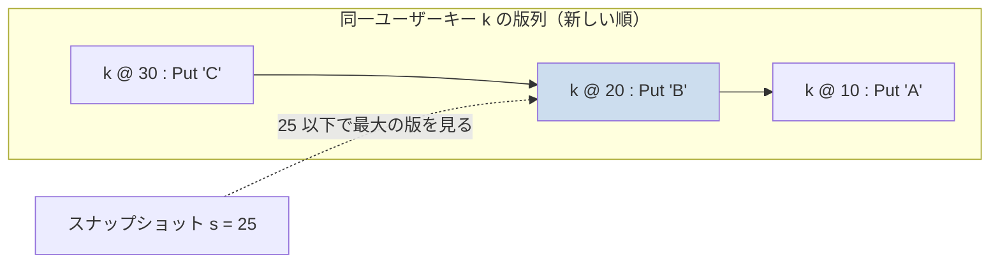
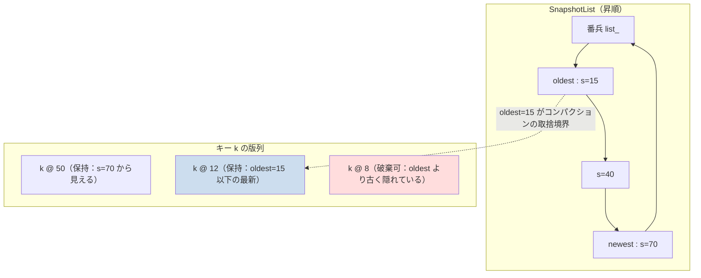

# 第36章 シーケンス番号と Snapshot/MVCC

> **本章で読むソース**
>
> - [`include/rocksdb/snapshot.h`](https://github.com/facebook/rocksdb/blob/v11.1.1/include/rocksdb/snapshot.h)
> - [`db/snapshot_impl.h`](https://github.com/facebook/rocksdb/blob/v11.1.1/db/snapshot_impl.h)
> - [`db/db_impl/db_impl.cc`](https://github.com/facebook/rocksdb/blob/v11.1.1/db/db_impl/db_impl.cc)
> - [`db/seqno_to_time_mapping.h`](https://github.com/facebook/rocksdb/blob/v11.1.1/db/seqno_to_time_mapping.h)
> - [`db/seqno_to_time_mapping.cc`](https://github.com/facebook/rocksdb/blob/v11.1.1/db/seqno_to_time_mapping.cc)

## この章の狙い

RocksDB は同じユーザーキーに対する複数回の更新を、上書きせずに別々の版として保持する。
どの版を見るかを決めるのが、書き込みごとに割り当てられる単調増加の番号と、その番号を一点だけ記録するスナップショットである。
本章を読むと、スナップショットが「あるシーケンス番号」そのものを保持するだけの軽い仕組みであること、そして生きているスナップショットのうち最も古いものがコンパクションのガベージコレクションの安全境界を決める仕組みを、機構として説明できるようになる。

## 前提

- [第5章 内部キー](../part01-data-model/05-internal-key.md)：シーケンス番号が内部キーのトレーラに入る。
- [第8章 書き込みパイプライン](../part02-write-path/08-write-pipeline.md)：シーケンス番号が書き込みに割り当てられる。
- [第23章 Get](../part04-read-path/23-get.md)：読み出し時の版の可視性判定。
- [第31章 CompactionJob と CompactionIterator](../part05-compaction/31-compaction-job.md)：コンパクションでの古い版の取捨。

## シーケンス番号が版を表す

RocksDB の MVCC（多版同時実行制御）は、特別なバージョン管理の表を持たない。
版の識別子は、DB 全体で単調増加する一個の整数、すなわち**シーケンス番号**である。
書き込みパイプライン（第8章）が各書き込みにこの番号を一つずつ割り当て、内部キー（第5章）のトレーラへ書き込む。
同じユーザーキー `k` に対する `Put` を三回行えば、ユーザーから見えるキーは一つでも、内部的には `(k, 30)`、`(k, 20)`、`(k, 10)` のように異なるシーケンス番号を持つ三件のエントリが並ぶ。
シーケンス番号の降順で並べておけば、新しい版が先に来る。

この並びの上で「ある時点のスナップショット」を表現するのは難しくない。
シーケンス番号 `s` を一つ固定すれば、`s` 以下で最大のシーケンス番号を持つ版が、その時点で見えるべき版になる。
たとえば `s = 25` のとき、`(k, 30)` は見えず、`(k, 20)` が見える版になる。
版そのものに「いつ消えるか」を持たせる必要はなく、読み手が基準にするシーケンス番号さえ決めれば可視性が決まる。



`s = 25` のスナップショットからは、`(k, 30)` は未来の書き込みとして隠れ、`(k, 20)` が見える。
この「s 以下で最大の版を見る」という判定は、読み出し経路の `GetContext` が一件ずつ実行する（第23章）。

## スナップショットは番号を記録するだけの軽い操作

公開インターフェースの `Snapshot` は、抽象的なハンドルにすぎない。
取得できる情報の中心は、シーケンス番号一つである。

[`include/rocksdb/snapshot.h` L20-L32](https://github.com/facebook/rocksdb/blob/v11.1.1/include/rocksdb/snapshot.h#L20-L32)

```cpp
class Snapshot {
 public:
  virtual SequenceNumber GetSequenceNumber() const = 0;

  // Returns unix time i.e. the number of seconds since the Epoch, 1970-01-01
  // 00:00:00 (UTC).
  virtual int64_t GetUnixTime() const = 0;

  virtual uint64_t GetTimestamp() const = 0;

 protected:
  virtual ~Snapshot();
};
```

クラス冒頭のコメントは、`Snapshot` を不変オブジェクトとし、外部同期なしに複数スレッドから安全に読めると述べている。
不変でいられるのは、保持するのが取得時のシーケンス番号という一個の値だからである。

実装の `SnapshotImpl` は、この番号を `number_` メンバに持つ。
コメントが明言するとおり、各 `SnapshotImpl` は特定のシーケンス番号一つに対応する。

[`db/snapshot_impl.h` L21-L35](https://github.com/facebook/rocksdb/blob/v11.1.1/db/snapshot_impl.h#L21-L35)

```cpp
// Snapshots are kept in a doubly-linked list in the DB.
// Each SnapshotImpl corresponds to a particular sequence number.
class SnapshotImpl : public Snapshot {
 public:
  SequenceNumber number_;  // const after creation
  // It indicates the smallest uncommitted data at the time the snapshot was
  // taken. This is currently used by WritePrepared transactions to limit the
  // scope of queries to IsInSnapshot.
  SequenceNumber min_uncommitted_ = kMinUnCommittedSeq;

  SequenceNumber GetSequenceNumber() const override { return number_; }

  int64_t GetUnixTime() const override { return unix_time_; }

  uint64_t GetTimestamp() const override { return timestamp_; }
```

スナップショットを取る `GetSnapshotImpl` は、現在時刻を読み、`SnapshotImpl` を一つ確保し、DB のロックを取った内側でそのときの公開済みシーケンス番号を記録する。

[`db/db_impl/db_impl.cc` L4324-L4351](https://github.com/facebook/rocksdb/blob/v11.1.1/db/db_impl/db_impl.cc#L4324-L4351)

```cpp
SnapshotImpl* DBImpl::GetSnapshotImpl(bool is_write_conflict_boundary,
                                      bool lock) {
  int64_t unix_time = 0;
  immutable_db_options_.clock->GetCurrentTime(&unix_time)
      .PermitUncheckedError();  // Ignore error
  SnapshotImpl* s = new SnapshotImpl;

  if (lock) {
    mutex_.Lock();
  } else {
    mutex_.AssertHeld();
  }
  // returns null if the underlying memtable does not support snapshot.
  if (!is_snapshot_supported_) {
    if (lock) {
      mutex_.Unlock();
    }
    delete s;
    return nullptr;
  }
  auto snapshot_seq = GetLastPublishedSequence();
  SnapshotImpl* snapshot =
      snapshots_.New(s, snapshot_seq, unix_time, is_write_conflict_boundary);
  if (lock) {
    mutex_.Unlock();
  }
  return snapshot;
}
```

ロック内で行う実質的な仕事は、`GetLastPublishedSequence()` で最新の公開済みシーケンス番号を読み、それを `snapshots_.New` でリストへつなぐことだけである。
データのコピーもインデックスの構築も発生しない。
スナップショットの取得が軽いのは、版の集合を凍結するのではなく、可視性の基準になる番号を一つ控えるだけだからである。

この番号がそのまま読み出しの基準になる。
読み出し経路の `GetImpl` は、`ReadOptions` にスナップショットが渡されていればその `number_` を、なければ最新の公開済みシーケンス番号を、可視性判定の基準 `snapshot` に採る。

[`db/db_impl/db_impl.cc` L2552-L2567](https://github.com/facebook/rocksdb/blob/v11.1.1/db/db_impl/db_impl.cc#L2552-L2567)

```cpp
  SequenceNumber snapshot;
  if (read_options.snapshot != nullptr) {
    if (get_impl_options.callback) {
      // Already calculated based on read_options.snapshot
      snapshot = get_impl_options.callback->max_visible_seq();
    } else {
      snapshot =
          static_cast<const SnapshotImpl*>(read_options.snapshot)->number_;
    }
  } else {
    // Note that the snapshot is assigned AFTER referencing the super
    // version because otherwise a flush happening in between may compact away
    // data for the snapshot, so the reader would see neither data that was be
    // visible to the snapshot before compaction nor the newer data inserted
    // afterwards.
    snapshot = GetLastPublishedSequence();
```

ここで決めた `snapshot` を基準に、第23章の `GetContext` が各版の可視性を判定する。

## SnapshotList が生きているスナップショットを束ねる

生きているスナップショットは、DB ごとに一本の双方向リンクリスト `SnapshotList` で管理される。
リストはダミーの番兵ノード `list_` を頭に置く環状リストで、空のときは番兵が自分自身を指す。

[`db/snapshot_impl.h` L54-L82](https://github.com/facebook/rocksdb/blob/v11.1.1/db/snapshot_impl.h#L54-L82)

```cpp
class SnapshotList {
 public:
  SnapshotList() {
    list_.prev_ = &list_;
    list_.next_ = &list_;
    list_.number_ = 0xFFFFFFFFL;  // placeholder marker, for debugging
    // ... (中略) ...
    count_ = 0;
  }

  // No copy-construct.
  SnapshotList(const SnapshotList&) = delete;

  bool empty() const {
    assert(list_.next_ != &list_ || 0 == count_);
    return list_.next_ == &list_;
  }
  SnapshotImpl* oldest() const {
    assert(!empty());
    return list_.next_;
  }
  SnapshotImpl* newest() const {
    assert(!empty());
    return list_.prev_;
  }
```

新しいスナップショットは `New` でリストの末尾、すなわち番兵の直前へ挿入される。
取得は時系列に進むので、番兵の `next_`（リストの先頭）が常に最古、`prev_`（リストの末尾）が常に最新になる。
`oldest()` と `newest()` はそれぞれこの両端を返すだけで、走査もソートも要らない。

[`db/snapshot_impl.h` L84-L106](https://github.com/facebook/rocksdb/blob/v11.1.1/db/snapshot_impl.h#L84-L106)

```cpp
  SnapshotImpl* New(SnapshotImpl* s, SequenceNumber seq, uint64_t unix_time,
                    bool is_write_conflict_boundary,
                    uint64_t ts = std::numeric_limits<uint64_t>::max()) {
    s->number_ = seq;
    s->unix_time_ = unix_time;
    s->timestamp_ = ts;
    s->is_write_conflict_boundary_ = is_write_conflict_boundary;
    s->list_ = this;
    s->next_ = &list_;
    s->prev_ = list_.prev_;
    s->prev_->next_ = s;
    s->next_->prev_ = s;
    count_++;
    return s;
  }

  // Do not responsible to free the object.
  void Delete(const SnapshotImpl* s) {
    assert(s->list_ == this);
    s->prev_->next_ = s->next_;
    s->next_->prev_ = s->prev_;
    count_--;
  }
```

`New` も `Delete` もポインタの付け替えだけで終わる。
最古のスナップショットを定数時間で参照できるのは、挿入が末尾固定で、リストがシーケンス番号の昇順に並ぶことが構造的に保証されているからである。
コンパクションは取捨判定のたびに最古のシーケンス番号を必要とするので、この定数時間参照が効いてくる。

## 最古のスナップショットがコンパクション GC の境界になる

同じユーザーキーに新旧の版が並ぶとき、古い版を捨ててよいのはどんな場合か。
ある古い版より新しい版が同じキーに存在し、かつその古い版がどのスナップショットからも見えないなら、その版は今後だれにも読まれないので捨てられる。
ここで「どのスナップショットからも見えない」を判定する境界が、生きているスナップショットのうち最古のシーケンス番号である。

最古より新しいスナップショットは、それぞれ自分以下で最大の版を見る。
だから最古のシーケンス番号以下にある版のうち、各キーで最新の一件だけがどれかのスナップショットに見える可能性を持ち、それより古い同一キーの版は誰からも見えない。
コンパクション（第31章）は、この最古のシーケンス番号を安全境界として、境界より下で隠された古い版とトゥームストーン（tombstone）を物理的に捨てる。



最古のスナップショット `oldest=15` を境界に、`k @ 8` のように境界以下でさらに新しい同一キーの版（`k @ 12`）に隠れた版は破棄できる。
`k @ 12` 自体は境界以下で最新なので、最古スナップショットに見える可能性があり保持される。

この境界は、スナップショットを解放した瞬間に更新される。
`ReleaseSnapshot` は対象を `SnapshotList` から外し、リストが空になったかどうかで新しい最古シーケンス番号を決める。

[`db/db_impl/db_impl.cc` L4474-L4490](https://github.com/facebook/rocksdb/blob/v11.1.1/db/db_impl/db_impl.cc#L4474-L4490)

```cpp
void DBImpl::ReleaseSnapshot(const Snapshot* s) {
  if (s == nullptr) {
    // DBImpl::GetSnapshot() can return nullptr when snapshot
    // not supported by specifying the condition:
    // inplace_update_support enabled.
    return;
  }
  const SnapshotImpl* casted_s = static_cast<const SnapshotImpl*>(s);
  {
    InstrumentedMutexLock l(&mutex_);
    snapshots_.Delete(casted_s);
    uint64_t oldest_snapshot;
    if (snapshots_.empty()) {
      oldest_snapshot = GetLastPublishedSequence();
    } else {
      oldest_snapshot = snapshots_.oldest()->number_;
    }
```

リストが空になれば、最古境界は最新の公開済みシーケンス番号まで一気に進む。
すべての過去の版がどのスナップショットからも見えなくなるからである。
解放後に最古境界が前進すると、`ReleaseSnapshot` は各カラムファミリーの `UpdateOldestSnapshot` を呼び、底辺ファイルにコンパクション対象の印が付くなら新たなコンパクションを起動する。
解放がそのまま回収の前進につながる。

この関係から、運用上の含意が一つ出てくる。
スナップショットを取ったまま解放を怠ると、最古境界がその古いシーケンス番号に固定され続ける。
境界より新しい版は、上書きされても削除されてもコンパクションで捨てられず、古い版が SST に溜まり続ける。
長時間のスキャンやバックアップでスナップショットを長く握ると、コンパクションのガベージコレクションが進まず、空間が膨らむ。
スナップショットは番号を一つ控えるだけで軽い反面、その番号がコンパクションの回収を縛るというのが、この設計の核である。

## SeqnoToTimeMapping が番号を実時刻へ橋渡しする

シーケンス番号は版の順序を表すが、それ自体は実時刻を持たない。
時間ベースの TTL や階層化（古いデータを下位の層へ寄せる仕組み）には、「ある時刻より前に書かれたデータはどのシーケンス番号以下か」という対応づけが要る。
これを担うのが `SeqnoToTimeMapping` である。
クラスコメントは、サンプリングした「シーケンス番号から unix 時刻への対応」を保持し、主目的は指定時刻までに書かれたデータのシーケンス番号の下界を最良に求めることだと述べている。

[`db/seqno_to_time_mapping.h` L42-L68](https://github.com/facebook/rocksdb/blob/v11.1.1/db/seqno_to_time_mapping.h#L42-L68)

```cpp
// SeqnoToTimeMapping stores a sampled mapping from sequence numbers to
// unix times (seconds since epoch). This information provides rough bounds
// between sequence numbers and their write times, but is primarily designed
// for getting a best lower bound on the sequence number of data written no
// later than a specified time.
//
// For ease of sampling, it is assumed that the recorded time in each pair
// comes at or after the sequence number and before the next sequence number,
// ... (中略) ...
// NOT thread safe - requires external synchronization, except a const
// object allows concurrent reads.
class SeqnoToTimeMapping {
```

対応は全シーケンス番号について持つのではなく、`(seqno, time)` の組をサンプリングして並べる。
組数には上限があり、`kMaxSeqnoTimePairsPerCF`（カラムファミリーあたり 100）を基準にサンプリング間隔を決める。
このため一つの SST に埋め込むデータは 0.3K 未満に収まる、とヘッダのコメントが述べている。
全シーケンス番号を記録せず代表点だけを残すのは、メモリと SST 容量を抑えつつ、おおまかな時刻の境界を求めれば足りるからである。

主役の問い合わせは `GetProximalSeqnoBeforeTime` である。
ある時刻を渡すと、書き込み時刻がその時刻以下で最大のシーケンス番号を返す。
実装はソート済みの組を二分探索し、指定時刻より大きい最初の組の一つ手前を読むだけである。

[`db/seqno_to_time_mapping.cc` L57-L70](https://github.com/facebook/rocksdb/blob/v11.1.1/db/seqno_to_time_mapping.cc#L57-L70)

```cpp
SequenceNumber SeqnoToTimeMapping::GetProximalSeqnoBeforeTime(
    uint64_t time) const {
  assert(enforced_);

  // Find the last entry with a time <= the given time.
  // First, find the first entry > the given time (or end).
  auto it = FindGreaterTime(time);
  if (it == pairs_.cbegin()) {
    return kUnknownSeqnoBeforeAll;
  }
  // Then return data from previous.
  --it;
  return it->seqno;
}
```

階層化のしきい値は、この問い合わせの上に組み立てられる。
`GetCurrentTieringCutoffSeqnos` は、現在時刻から `preserve_internal_time_seconds` と `preclude_last_level_data_seconds` の大きいほうだけ遡った時刻を求め、その時刻に対応するシーケンス番号に 1 を足してしきい値とする。

[`db/seqno_to_time_mapping.cc` L72-L91](https://github.com/facebook/rocksdb/blob/v11.1.1/db/seqno_to_time_mapping.cc#L72-L91)

```cpp
void SeqnoToTimeMapping::GetCurrentTieringCutoffSeqnos(
    uint64_t current_time, uint64_t preserve_internal_time_seconds,
    uint64_t preclude_last_level_data_seconds,
    SequenceNumber* preserve_time_min_seqno,
    SequenceNumber* preclude_last_level_min_seqno) const {
  uint64_t preserve_time_duration = std::max(preserve_internal_time_seconds,
                                             preclude_last_level_data_seconds);
  if (preserve_time_duration <= 0) {
    return;
  }
  uint64_t preserve_time = current_time > preserve_time_duration
                               ? current_time - preserve_time_duration
                               : 0;
  // GetProximalSeqnoBeforeTime tells us the last seqno known to have been
  // written at or before the given time. + 1 to get the minimum we should
  // preserve without excluding anything that might have been written on or
  // after the given time.
  if (preserve_time_min_seqno) {
    *preserve_time_min_seqno = GetProximalSeqnoBeforeTime(preserve_time) + 1;
  }
```

`+ 1` は、その時刻以降に書かれた可能性のあるものを取りこぼさないための下界の調整である。
時間という連続量を、版の順序を表す離散的なシーケンス番号のしきい値へ落とし込むことで、コンパクションは時刻を直接扱わずに済む。
新しい対応はおおむね単調増加するシーケンス番号とともに `Append` で末尾へ追加され、ソート済みの不変条件が保たれる。

## まとめ

- シーケンス番号は DB 全体で単調増加する整数で、書き込みごとに割り当てられて内部キーのトレーラに入り、MVCC の版を表す。
- スナップショットは取得時のシーケンス番号一つを `SnapshotImpl::number_` に控えるだけの不変オブジェクトで、取得はその番号をリストへつなぐ軽い操作である。
  読み出しはその番号以下で最大の版を見る。
- `SnapshotList` は番兵付きの双方向環状リストで、昇順を保つので最古と最新を定数時間で返す。
  挿入と削除はポインタの付け替えだけで済む。
- 生きているスナップショットの最古のシーケンス番号が、コンパクションのガベージコレクションの安全境界になる。
  境界より下で隠された古い版とトゥームストーンが捨てられる。
- スナップショットを解放せずに握り続けると最古境界が前進せず、古い版が SST に溜まる。
  `ReleaseSnapshot` は解放のたびに境界を更新し、必要ならコンパクションを起動する。
- `SeqnoToTimeMapping` はサンプリングしたシーケンス番号と実時刻の対応を持ち、`GetProximalSeqnoBeforeTime` で時刻をシーケンス番号のしきい値へ変換して、時間ベースの TTL や階層化を支える。

## 関連する章

- [第5章 内部キー](../part01-data-model/05-internal-key.md)：シーケンス番号が内部キーのトレーラに収まる形式。
- [第23章 Get](../part04-read-path/23-get.md)：基準シーケンス番号を使った版の可視性判定。
- [第31章 CompactionJob と CompactionIterator](../part05-compaction/31-compaction-job.md)：最古スナップショットを境界にした古い版の取捨。
