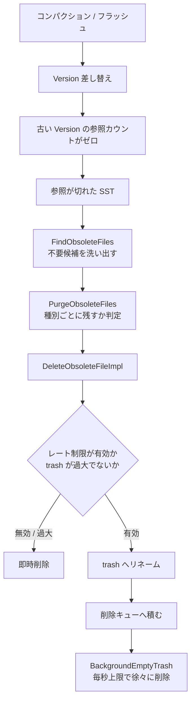

# 第37章 ファイル管理と削除スケジューラ

> **本章で読むソース**
>
> - [`file/filename.h`](https://github.com/facebook/rocksdb/blob/v11.1.1/file/filename.h)
> - [`file/filename.cc`](https://github.com/facebook/rocksdb/blob/v11.1.1/file/filename.cc)
> - [`db/db_impl/db_impl_files.cc`](https://github.com/facebook/rocksdb/blob/v11.1.1/db/db_impl/db_impl_files.cc)
> - [`file/delete_scheduler.h`](https://github.com/facebook/rocksdb/blob/v11.1.1/file/delete_scheduler.h)
> - [`file/delete_scheduler.cc`](https://github.com/facebook/rocksdb/blob/v11.1.1/file/delete_scheduler.cc)
> - [`file/sst_file_manager_impl.h`](https://github.com/facebook/rocksdb/blob/v11.1.1/file/sst_file_manager_impl.h)
> - [`file/sst_file_manager_impl.cc`](https://github.com/facebook/rocksdb/blob/v11.1.1/file/sst_file_manager_impl.cc)

## この章の狙い

RocksDB のデータベースディレクトリには、SST、MANIFEST、WAL など複数の種類のファイルが世代番号つきで並ぶ。
本章では、ファイル名からファイルの種別と世代を読み取る規約、どの SST がもう誰からも参照されていないかを判定する仕組み、そして不要になったファイルを安全かつ I/O を跳ねさせずに削除する経路を読む。
削除スケジューラがファイルを一括で消さず、レート制限をかけながらバックグラウンドで徐々に消す理由を、機構として理解できるようになる。

## 前提

- [第24章 Version と SuperVersion](../part04-read-path/24-version-superversion.md)：どの SST が「生きている」かは Version が決める。本章の不要ファイル検出はこの参照関係を前提とする。
- [第34章 MANIFEST と VersionEdit](34-manifest-versionedit.md)：コンパクションやフラッシュによる Version の差し替えがどう記録されるか。

## ファイル名はそのまま種別と世代を表す

RocksDB はファイルの種別や世代を別のメタデータに記録せず、ファイル名そのものに埋め込む。
ファイル番号は単調増加する一個のカウンタから払い出され、SST もログも MANIFEST も同じ番号空間を共有する。
そのため、ディレクトリを `ls` した結果を一つずつ名前で解釈するだけで、各ファイルが何でどの世代かが分かる。

名前の生成は一つのヘルパーに集約されている。
番号を6桁ゼロ詰めで整形し、ピリオドと拡張子を付ける。

[`file/filename.cc` L66-L76](https://github.com/facebook/rocksdb/blob/v11.1.1/file/filename.cc#L66-L76)

```cpp
static std::string MakeFileName(uint64_t number, const char* suffix) {
  char buf[100];
  snprintf(buf, sizeof(buf), "%06llu.%s",
           static_cast<unsigned long long>(number), suffix);
  return buf;
}

static std::string MakeFileName(const std::string& name, uint64_t number,
                                const char* suffix) {
  return name + "/" + MakeFileName(number, suffix);
}
```

SST は拡張子 `sst`、WAL は `log` を使う。
これらは同じヘルパーに拡張子の文字列を渡すだけで作られる。

[`file/filename.cc` L78-L86, L113-L119](https://github.com/facebook/rocksdb/blob/v11.1.1/file/filename.cc#L78-L119)

```cpp
std::string LogFileName(const std::string& name, uint64_t number) {
  assert(number > 0);
  return MakeFileName(name, number, "log");
}
// ... (中略) ...
std::string MakeTableFileName(const std::string& path, uint64_t number) {
  return MakeFileName(path, number, kRocksDbTFileExt.c_str());
}
```

`kRocksDbTFileExt` は `"sst"` である（[`file/filename.cc` L31](https://github.com/facebook/rocksdb/blob/v11.1.1/file/filename.cc#L31)）。
番号6桁の例でいえば、SST は `000123.sst`、WAL は `000045.log` という名前になる。

MANIFEST は番号付きだが拡張子を持たず、`MANIFEST-` という接頭辞を付ける形をとる。
RocksDB のコード内では MANIFEST を「ディスクリプタファイル」とも呼ぶ。

[`file/filename.cc` L166-L176](https://github.com/facebook/rocksdb/blob/v11.1.1/file/filename.cc#L166-L176)

```cpp
std::string DescriptorFileName(uint64_t number) {
  assert(number > 0);
  char buf[100];
  snprintf(buf, sizeof(buf), "MANIFEST-%06llu",
           static_cast<unsigned long long>(number));
  return buf;
}
```

番号を持たないファイルもある。
**CURRENT** は現在有効な MANIFEST の名前を一行だけ書いたファイルで、固定名 `CURRENT` を持つ（[`file/filename.h` L91](https://github.com/facebook/rocksdb/blob/v11.1.1/file/filename.h#L91)、[`file/filename.cc` L178-L180](https://github.com/facebook/rocksdb/blob/v11.1.1/file/filename.cc#L178-L180)）。
情報ログは固定名 `LOG`、ロックファイルは `LOCK`、データベース識別子は `IDENTITY` である。
起動時にどの MANIFEST を読むかは CURRENT を一行読めば決まる。
この間接参照によって、新しい MANIFEST への切り替えは CURRENT の差し替え一回で原子的に行える（[第34章](34-manifest-versionedit.md)）。

### `ParseFileName` で名前を種別に戻す

名前の生成と対になるのが `ParseFileName` である。
これはディレクトリ内の各エントリを受け取り、種別 `FileType` と番号 `number` を取り出す。
解釈できなければ `false` を返し、呼び出し側はそのファイルを無視する。

固定名のファイルは文字列の完全一致で判定する。

[`file/filename.cc` L295-L310](https://github.com/facebook/rocksdb/blob/v11.1.1/file/filename.cc#L295-L310)

```cpp
bool ParseFileName(const std::string& fname, uint64_t* number,
                   const Slice& info_log_name_prefix, FileType* type,
                   WalFileType* log_type) {
  Slice rest(fname);
  if (fname.length() > 1 && fname[0] == '/') {
    rest.remove_prefix(1);
  }
  if (rest == "IDENTITY") {
    *number = 0;
    *type = kIdentityFile;
  } else if (rest == "CURRENT") {
    *number = 0;
    *type = kCurrentFile;
  } else if (rest == "LOCK") {
    *number = 0;
    *type = kDBLockFile;
```

接頭辞を持つファイル（`MANIFEST-`、`OPTIONS-` など）は接頭辞を剥がしてから残りを10進数として読む。
番号付きの SST と WAL は、まず数字列を読み、続くピリオドの後の拡張子で種別を振り分ける。

[`file/filename.cc` L397-L424](https://github.com/facebook/rocksdb/blob/v11.1.1/file/filename.cc#L397-L424)

```cpp
    uint64_t num;
    if (!ConsumeDecimalNumber(&rest, &num)) {
      return false;
    }
    if (rest.size() <= 1 || rest[0] != '.') {
      return false;
    }
    rest.remove_prefix(1);

    Slice suffix = rest;
    if (suffix == Slice("log")) {
      *type = kWalFile;
      if (log_type && !archive_dir_found) {
        *log_type = kAliveLogFile;
      }
    } else if (archive_dir_found) {
      return false;  // Archive dir can contain only log files
    } else if (suffix == Slice(kRocksDbTFileExt) ||
               suffix == Slice(kLevelDbTFileExt)) {
      *type = kTableFile;
    } else if (suffix == Slice(kRocksDBBlobFileExt)) {
      *type = kBlobFile;
    } else if (suffix == Slice(kTempFileNameSuffix)) {
      *type = kTempFile;
    } else {
      return false;
    }
    *number = num;
```

拡張子 `sst` と `ldb` のどちらも `kTableFile` として受け付ける。
`ldb` は LevelDB 由来の SST 拡張子で、過去のデータベースを読めるように残されている。
この対応によって、後で見る不要ファイル検出は、ディレクトリ走査で得た名前を `ParseFileName` に通すだけで、種別ごとの処理に振り分けられる。

## 不要なファイルを洗い出す

コンパクションやフラッシュが完了すると、新しい SST を含む Version へ差し替わり、入力に使われた古い SST はどの生きた Version からも参照されなくなる（[第34章](34-manifest-versionedit.md)）。
参照が切れたファイルはディスク上に残り続けるので、誰かが回収しなければならない。
その洗い出しを担うのが `DBImpl::FindObsoleteFiles` である。

この関数は二通りの動き方をする。
通常は VersionSet が保持している不要ファイルのリストを取り出すだけで済ませ、定期的にだけディレクトリ全体を走査する全スキャンを行う。
全スキャンを行うかどうかは、`force` 指定か、前回からの経過時間が `delete_obsolete_files_period_micros` を超えたかで決まる。

[`db/db_impl/db_impl_files.cc` L133-L149](https://github.com/facebook/rocksdb/blob/v11.1.1/db/db_impl/db_impl_files.cc#L133-L149)

```cpp
  bool doing_the_full_scan = false;

  // logic for figuring out if we're doing the full scan
  if (no_full_scan) {
    doing_the_full_scan = false;
  } else if (force ||
             mutable_db_options_.delete_obsolete_files_period_micros == 0) {
    doing_the_full_scan = true;
  } else {
    const uint64_t now_micros = immutable_db_options_.clock->NowMicros();
    if ((delete_obsolete_files_last_run_ +
         mutable_db_options_.delete_obsolete_files_period_micros) <
        now_micros) {
      doing_the_full_scan = true;
      delete_obsolete_files_last_run_ = now_micros;
    }
  }
```

まだ書き込み中のファイルを誤って消さないよう、関数の冒頭で `min_pending_output` を記録する。
これはコンパクションやフラッシュがこれから書き出す予定の最小ファイル番号であり、この番号以上の SST は出力途中とみなして保護する。

[`db/db_impl/db_impl_files.cc` L156-L166](https://github.com/facebook/rocksdb/blob/v11.1.1/db/db_impl/db_impl_files.cc#L156-L166)

```cpp
  job_context->min_pending_output = MinObsoleteSstNumberToKeep();
  job_context->files_to_quarantine = error_handler_.GetFilesToQuarantine();
  job_context->min_options_file_number = MinOptionsFileNumberToKeep();

  // Get obsolete files.  This function will also update the list of
  // pending files in VersionSet().
  assert(versions_);
  versions_->GetObsoleteFiles(
      &job_context->sst_delete_files, &job_context->blob_delete_files,
      &job_context->manifest_delete_files, job_context->min_pending_output);
```

全スキャンをしない場合は、VersionSet が抱える不要候補リストから、いずれかの Version にまだ載っているファイルを除外する。
全ファイルの集合を作るより、候補だけを各 Version に照合するほうが安い。
候補ファイルは全ファイルのうちのわずかだからだ。

[`db/db_impl/db_impl_files.cc` L247-L255](https://github.com/facebook/rocksdb/blob/v11.1.1/db/db_impl/db_impl_files.cc#L247-L255)

```cpp
  } else {
    // Instead of filling ob_context->sst_live and job_context->blob_live,
    // directly remove files that show up in any Version. This is because
    // candidate files tend to be a small percentage of all files, so it is
    // usually cheaper to check them against every version, compared to
    // building a map for all files.
    versions_->RemoveLiveFiles(job_context->sst_delete_files,
                               job_context->blob_delete_files);
  }
```

このように、不要かどうかの判定は「どの Version からも参照されていないこと」に帰着する。
Version が SST を参照している間は、その Version への参照カウントが SST を生かし続ける。
コンパクションが古い Version を手放して参照カウントがゼロになって初めて、その Version だけが参照していた SST が不要候補に落ちる（[第24章](../part04-read-path/24-version-superversion.md)）。

## 削除してよいファイルを最終判定する

`FindObsoleteFiles` が集めた候補は、`DBImpl::PurgeObsoleteFiles` で種別ごとに精査され、本当に消してよいものだけが削除に回される。
判定の中心は、候補の各ファイル名を `ParseFileName` で種別へ戻し、種別ごとに「残すか」を決める分岐である。

SST の判定は、生きているファイルの集合に入っているか、または出力途中の番号かを見る。
どちらでもなければ消してよい。

[`db/db_impl/db_impl_files.cc` L573-L589](https://github.com/facebook/rocksdb/blob/v11.1.1/db/db_impl/db_impl_files.cc#L573-L589)

```cpp
      case kTableFile:
        // If the second condition is not there, this makes
        // DontDeletePendingOutputs fail
        // FIXME: but should NOT keep if it came from sst_delete_files?
        keep = (sst_live_set.find(number) != sst_live_set.end()) ||
               number >= state.min_pending_output;
        if (!keep) {
          // NOTE: sometimes redundant (if came from sst_delete_files)
          // We don't know which column family is applicable here so we don't
          // know what uncache_aggressiveness would be used with
          // ReleaseObsolete(). Anyway, obsolete files ideally go into
          // sst_delete_files for better/quicker handling, and this is just a
          // backstop.
          TableCache::Evict(table_cache_.get(), number);
          files_to_del.insert(number);
        }
        break;
```

WAL は、保持すべき最小ログ番号以上か、直前のログ番号かで残す。
MANIFEST は自分の番号以上のものを残す（ロール中に新旧二つの MANIFEST が並ぶことがあるため）。
CURRENT、LOCK、IDENTITY のような単一ファイルは常に残す。

削除すると決まったファイルは、種別に応じてフルパスと同期対象ディレクトリを組み立て、実際の削除へ渡す。

[`db/db_impl/db_impl_files.cc` L639-L672](https://github.com/facebook/rocksdb/blob/v11.1.1/db/db_impl/db_impl_files.cc#L639-L672)

```cpp
    if (type == kTableFile) {
      fname = MakeTableFileName(candidate_file.file_path, number);
      dir_to_sync = candidate_file.file_path;
    } else if (type == kBlobFile) {
      fname = BlobFileName(candidate_file.file_path, number);
      dir_to_sync = candidate_file.file_path;
    } else {
      dir_to_sync = (type == kWalFile) ? wal_dir : dbname_;
// ... (中略) ...
    }
// ... (中略) ...
    if (schedule_only) {
      InstrumentedMutexLock guard_lock(&mutex_);
      SchedulePendingPurge(fname, dir_to_sync, type, number, state.job_id);
    } else {
      DeleteObsoleteFileImpl(state.job_id, fname, dir_to_sync, type, number);
    }
```

ここで読んでいるイテレータとの競合を防ぐ仕組みは、Version の参照カウントが受け持つ。
イテレータは SuperVersion を通じて Version を参照し続ける（[第24章](../part04-read-path/24-version-superversion.md)）。
その Version が参照する SST は `sst_live_set` に入るので、上の判定で `keep` が真になり削除対象から外れる。
イテレータが残っている限り、それが見ている SST は不要候補に落ちない。

`DeleteObsoleteFileImpl` は、SST、Blob、WAL についてはレート制限を効かせる削除経路 `DeleteDBFile` を呼び、それ以外は即時削除する。

[`db/db_impl/db_impl_files.cc` L377-L385](https://github.com/facebook/rocksdb/blob/v11.1.1/db/db_impl/db_impl_files.cc#L377-L385)

```cpp
  Status file_deletion_status;
  if (type == kTableFile || type == kBlobFile || type == kWalFile) {
    // Rate limit WAL deletion only if its in the DB dir
    file_deletion_status = DeleteDBFile(
        &immutable_db_options_, fname, path_to_sync,
        /*force_bg=*/false,
        /*force_fg=*/(type == kWalFile) ? !wal_in_db_path_ : false);
  } else {
    file_deletion_status = env_->DeleteFile(fname);
  }
```

## レート制限つきの削除

大規模なコンパクションが完了すると、数十から数百の SST が同時に不要になることがある。
これらを一度に `unlink` すると、ファイルシステムがブロックを解放する I/O が一気に走り、前景の読み書きのレイテンシが跳ねる。
`DeleteScheduler` は、削除を毎秒の上限つきでならすことでこのスパイクを避ける。

仕組みは二段になっている。
削除を要求されたファイルをまず trash ディレクトリへリネームし、実体の削除はバックグラウンドスレッドが少しずつ進める。
リネームは同一ファイルシステム内ではメタデータ操作だけで済むので速い。
呼び出し側から見ると削除要求はすぐ返り、重い `unlink` は背後で時間をかけて消化される。

`DeleteFile` の入口は、レート制限が無効か、trash がたまりすぎている場合に即時削除へ切り替える。

[`file/delete_scheduler.cc` L60-L83](https://github.com/facebook/rocksdb/blob/v11.1.1/file/delete_scheduler.cc#L60-L83)

```cpp
Status DeleteScheduler::DeleteFile(const std::string& file_path,
                                   const std::string& dir_to_sync,
                                   const bool force_bg) {
  uint64_t total_size = sst_file_manager_->GetTotalSize();
  if (rate_bytes_per_sec_.load() <= 0 ||
      (!force_bg &&
       total_trash_size_.load() > total_size * max_trash_db_ratio_.load())) {
    // Rate limiting is disabled or trash size makes up more than
    // max_trash_db_ratio_ (default 25%) of the total DB size
    Status s = DeleteFileImmediately(file_path, /*accounted=*/true);
// ... (中略) ...
    return s;
  }
  return AddFileToDeletionQueue(file_path, dir_to_sync, /*bucket=*/std::nullopt,
                                /*accounted=*/true);
}
```

`rate_bytes_per_sec_` が0以下ならレート制限自体が無効なので、その場で消す。
trash の総量が DB 総サイズの `max_trash_db_ratio_`（既定0.25）を超えた場合も即時削除に倒す。
これは、削除が生成に追いつかず trash が際限なく膨らむのを防ぐ安全弁である。

レート制限が効く場合は、ファイルを削除キューへ積む前に trash 化する。
trash 名は元の名前に `.trash` を付けたものだ。
名前が衝突するときは連番を足して一意にする。

[`file/delete_scheduler.cc` L244-L264](https://github.com/facebook/rocksdb/blob/v11.1.1/file/delete_scheduler.cc#L244-L264)

```cpp
  *trash_file = file_path + kTrashExtension;
  // TODO(tec) : Implement Env::RenameFileIfNotExist and remove
  //             file_move_mu mutex.
  int cnt = 0;
  Status s;
  InstrumentedMutexLock l(&file_move_mu_);
  while (true) {
    s = fs_->FileExists(*trash_file, IOOptions(), nullptr);
    if (s.IsNotFound()) {
      // We found a path for our file in trash
      s = fs_->RenameFile(file_path, *trash_file, IOOptions(), nullptr);
      break;
    } else if (s.ok()) {
      // Name conflict, generate new random suffix
      *trash_file = file_path + std::to_string(cnt) + kTrashExtension;
    } else {
      // Error during FileExists call, we cannot continue
      break;
    }
    cnt++;
  }
```

### バックグラウンドでのならし削除

trash 化したファイルはキューに積まれ、`BackgroundEmptyTrash` を回すバックグラウンドスレッドが順に消す。
レート制限の核はこのループにある。
削除したバイト数を積算し、設定レートで割って「ここまで消すのにかかるべき時間」を求め、その時刻まで待つ。

[`file/delete_scheduler.cc` L325-L343](https://github.com/facebook/rocksdb/blob/v11.1.1/file/delete_scheduler.cc#L325-L343)

```cpp
      // Apply penalty if necessary
      uint64_t total_penalty;
      if (current_delete_rate > 0) {
        // rate limiting is enabled
        total_penalty =
            ((total_deleted_bytes * kMicrosInSecond) / current_delete_rate);
        ROCKS_LOG_INFO(info_log_,
                       "Rate limiting is enabled with penalty %" PRIu64
                       " after deleting file %s",
                       total_penalty, path_in_trash.c_str());
        while (!closing_ && !cv_.TimedWait(start_time + total_penalty)) {
        }
      } else {
        // rate limiting is disabled
        total_penalty = 0;
```

待ち時間は、開始からの累積バイト数を `rate_bytes_per_sec` で割って算出する点が肝心だ。
レートが1秒あたり1MBで、累積4MBを消したなら、開始から4秒の時点まで待つ。
個々の削除に固定の休止を挟むのではなく、累積で目標レートに合わせるので、サイズの偏ったファイル列でも全体のスループットが設定値に収束する。

大きなファイルは、一度の `unlink` で全ブロックを解放させず、`ftruncate` で少しずつ縮める。
ファイルサイズが `bytes_max_delete_chunk_`（既定64MB）を超えるとき、末尾からチャンク分だけ切り詰めて未完了として残し、次の周回で続きを処理する。

[`file/delete_scheduler.cc` L378-L408](https://github.com/facebook/rocksdb/blob/v11.1.1/file/delete_scheduler.cc#L378-L408)

```cpp
    bool need_full_delete = true;
    if (bytes_max_delete_chunk_ != 0 && file_size > bytes_max_delete_chunk_) {
      uint64_t num_hard_links = 2;
// ... (中略) ...
      if (my_status.ok()) {
        if (num_hard_links == 1) {
          std::unique_ptr<FSWritableFile> wf;
          my_status = fs_->ReopenWritableFile(path_in_trash, FileOptions(), &wf,
                                              nullptr);
          if (my_status.ok()) {
            my_status = wf->Truncate(file_size - bytes_max_delete_chunk_,
                                     IOOptions(), nullptr);
// ... (中略) ...
            *deleted_bytes = bytes_max_delete_chunk_;
            need_full_delete = false;
            *is_complete = false;
```

巨大な単一ファイルでも、削除がチャンク単位に分割されるので、一回のブロック解放で I/O が飽和することがない。
ハードリンクが2本以上ある場合は `ftruncate` による分割を行わず丸ごと消す。
他のリンク先が中途半端なファイルを参照してしまうのを避けるためだ。



## `SstFileManager` がデータベース全体を見張る

`DeleteScheduler` は単体のレート制御器だが、これを所有してデータベース全体の SST と Blob の総サイズを追うのが `SstFileManager` である。
DB は新しい SST や Blob を作るたびに `OnAddFile`、消すたびに `OnDeleteFile` を呼ぶ。
内部はファイルパスからサイズへのマップを持ち、総和を `total_files_size_` に保つ。

[`file/sst_file_manager_impl.cc` L457-L479](https://github.com/facebook/rocksdb/blob/v11.1.1/file/sst_file_manager_impl.cc#L457-L479)

```cpp
void SstFileManagerImpl::OnAddFileImpl(const std::string& file_path,
                                       uint64_t file_size) {
  auto tracked_file = tracked_files_.find(file_path);
  if (tracked_file != tracked_files_.end()) {
    // File was added before, we will just update the size
    total_files_size_ -= tracked_file->second;
    total_files_size_ += file_size;
  } else {
    total_files_size_ += file_size;
  }
  tracked_files_[file_path] = file_size;
}

void SstFileManagerImpl::OnDeleteFileImpl(const std::string& file_path) {
  auto tracked_file = tracked_files_.find(file_path);
  if (tracked_file == tracked_files_.end()) {
    // File is not tracked
    return;
  }

  total_files_size_ -= tracked_file->second;
  tracked_files_.erase(tracked_file);
}
```

この総サイズには二つの用途がある。
一つは前節で見た `DeleteScheduler::DeleteFile` の trash 比率判定で、trash が DB 総サイズの一定割合を超えたかをこの値で測る。
もう一つは、ディスク使用量の上限を超えた書き込みを止める仕組みである。

`SetMaxAllowedSpaceUsage` で上限を設定すると、総サイズがそれに達したかを `IsMaxAllowedSpaceReached` が答える。
上限が0なら無効で、この機能は使われない。

[`file/sst_file_manager_impl.cc` L142-L157](https://github.com/facebook/rocksdb/blob/v11.1.1/file/sst_file_manager_impl.cc#L142-L157)

```cpp
bool SstFileManagerImpl::IsMaxAllowedSpaceReached() {
  MutexLock l(&mu_);
  if (max_allowed_space_ <= 0) {
    return false;
  }
  return total_files_size_ >= max_allowed_space_;
}

bool SstFileManagerImpl::IsMaxAllowedSpaceReachedIncludingCompactions() {
  MutexLock l(&mu_);
  if (max_allowed_space_ <= 0) {
    return false;
  }
  return total_files_size_ + cur_compactions_reserved_size_ >=
         max_allowed_space_;
}
```

コンパクションの可否は `EnoughRoomForCompaction` が判断する。
コンパクションは入力 SST を読みつつ出力 SST を書くので、一時的に両方が並存する。
そのぶんの容量を `cur_compactions_reserved_size_` として予約し、上限を超えるならコンパクションを始めさせない。

[`file/sst_file_manager_impl.cc` L173-L179](https://github.com/facebook/rocksdb/blob/v11.1.1/file/sst_file_manager_impl.cc#L173-L179)

```cpp
  // Update cur_compactions_reserved_size_ so concurrent compaction
  // don't max out space
  size_t needed_headroom = cur_compactions_reserved_size_ +
                           size_added_by_compaction + compaction_buffer_size_;
  if (max_allowed_space_ != 0 &&
      (needed_headroom + total_files_size_ > max_allowed_space_)) {
    return false;
  }
```

実際にディスクが満杯になった場合は、`StartErrorRecovery` がエラーハンドラを登録し、空き容量が回復するまでバックグラウンドで監視を回す。
書き込みをエラーにし、空きが戻れば自動で復帰させる流れは[第52章 エラーハンドリングとトレース](../part10-advanced/52-error-handling-trace-bindings.md)で扱う。

## まとめ

- ファイル番号は単一カウンタから払い出され、SST（`番号.sst`）、WAL（`番号.log`）、MANIFEST（`MANIFEST-番号`）が同じ番号空間を共有する。CURRENT、LOCK、IDENTITY、LOG は固定名を持つ。
- `ParseFileName` はディレクトリ内の名前を種別と番号へ戻す唯一の解釈点であり、不要ファイル検出と削除はこの解釈に乗って種別ごとに振り分けられる。
- `FindObsoleteFiles` は「どの Version からも参照されていない」ことを不要の条件とする。Version の参照カウントが切れて初めて、その Version だけが参照していた SST が不要候補に落ちる。
- 読んでいるイテレータがある SST は、その Version が `sst_live_set` に載るため `PurgeObsoleteFiles` で保護され、消えない。
- `DeleteScheduler` は削除をいったん trash へのリネームに置き換え、`BackgroundEmptyTrash` が累積バイト数を `rate_bytes_per_sec` に合わせてならしながら消す。大量削除や巨大ファイル削除による I/O スパイクを避けるのが最適化の核である。
- `SstFileManager` は SST と Blob の総サイズを追い、trash 比率の判定とディスク上限の超過検出に使う。

## 関連する章

- [第24章 Version と SuperVersion](../part04-read-path/24-version-superversion.md)：本章の参照カウントによる安全な回収の前提。
- [第34章 MANIFEST と VersionEdit](34-manifest-versionedit.md)：コンパクションによる Version 差し替えと CURRENT の切り替え。
- [第52章 エラーハンドリングとトレース](../part10-advanced/52-error-handling-trace-bindings.md)：ディスク逼迫時の書き込みエラーと自動復帰。
