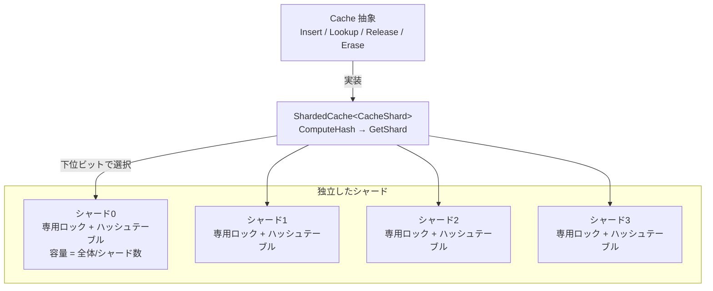

# 第38章 Cache 抽象と Sharded Cache

> **本章で読むソース**
>
> - [`include/rocksdb/cache.h`](https://github.com/facebook/rocksdb/blob/v11.1.1/include/rocksdb/cache.h)
> - [`include/rocksdb/advanced_cache.h`](https://github.com/facebook/rocksdb/blob/v11.1.1/include/rocksdb/advanced_cache.h)
> - [`cache/sharded_cache.h`](https://github.com/facebook/rocksdb/blob/v11.1.1/cache/sharded_cache.h)
> - [`cache/sharded_cache.cc`](https://github.com/facebook/rocksdb/blob/v11.1.1/cache/sharded_cache.cc)
> - [`cache/cache_key.h`](https://github.com/facebook/rocksdb/blob/v11.1.1/cache/cache_key.h)

## この章の狙い

RocksDB のキャッシュは、第16章で読んだ Block Cache や第25章の Table Cache を支える共通の土台である。
本章では、その土台にあたる `Cache` 抽象が値の所有とライフサイクルをどう扱うか、参照カウント付きの `Insert` / `Lookup` / `Release` / `Erase` がどう噛み合うかを読む。
そのうえで、`ShardedCache` がキャッシュを複数のシャードに分割し、各シャードに独立したロックを持たせることで、並行アクセス時のロック競合を機構として緩和する仕組みを追う。
具体的な退避方式は次章以降に譲り、本章は抽象と分割の骨格に集中する。

## 前提

- [第16章 Block-based Table Reader](../part03-sst/16-block-based-table-reader.md)（Block Cache の利用側）
- [第25章 Table Cache](../part04-read-path/25-table-cache.md)（キャッシュを通じた SST 読み出し）

## `Cache` が引き受ける責務

`Cache` は、キーからメモリ上のオブジェクトへの対応を保持し、各エントリの参照カウントを追跡し、参照されていないエントリを任意のタイミングで除去できる仕組みである。
その契約はヘッダ冒頭のコメントに明記されている。

[`include/rocksdb/advanced_cache.h` L28-L34](https://github.com/facebook/rocksdb/blob/v11.1.1/include/rocksdb/advanced_cache.h#L28-L34)

```cpp
// A Cache maps keys to objects resident in memory, tracks reference counts
// on those key-object entries, and is able to remove unreferenced entries
// whenever it wants. All operations are fully thread safe except as noted.
// Inserted entries have a specified "charge" which is some quantity in
// unspecified units, typically bytes of memory used. A Cache will typically
// have a finite capacity in units of charge, and evict entries as needed
// to stay at or below that capacity.
```

ここで `charge` は、エントリがキャッシュ容量に対して占める量である。
単位は規定されておらず、ブロックキャッシュとして使う場合は実質的にバイト数になる。
キャッシュは容量を `charge` の合計で管理し、合計が容量を超えそうになると退避を行う。

`Cache` は `Customizable` を継承した抽象クラスで、主要な操作はすべて純粋仮想関数である。

[`include/rocksdb/advanced_cache.h` L44-L52](https://github.com/facebook/rocksdb/blob/v11.1.1/include/rocksdb/advanced_cache.h#L44-L52)

```cpp
class Cache : public Customizable {
 public:  // types hidden from API client
  // Opaque handle to an entry stored in the cache.
  struct Handle {};

 public:  // types hidden from Cache implementation
  // Pointer to cached object of unspecified type. (This type alias is
  // provided for clarity, not really for type checking.)
  using ObjectPtr = void*;
```

`Handle` は中身を持たない不透明な構造体である。
利用側はこのポインタを受け取り、後で `Release` に渡すためだけに保持する。
キャッシュに入る値は `ObjectPtr`（`void*`）として扱われ、型情報は `Cache` 自身では追跡しない。
型ごとの扱いは、後述する `CacheItemHelper` に切り出されている。

## 参照カウント付きの基本操作

値の出し入れは `Insert` と `Lookup`、`Release`、`Erase` の四つで構成される。
まず `Insert` の宣言を見る。

[`include/rocksdb/advanced_cache.h` L262-L266](https://github.com/facebook/rocksdb/blob/v11.1.1/include/rocksdb/advanced_cache.h#L262-L266)

```cpp
  virtual Status Insert(
      const Slice& key, ObjectPtr obj, const CacheItemHelper* helper,
      size_t charge, Handle** handle = nullptr,
      Priority priority = Priority::LOW, const Slice& compressed = Slice(),
      CompressionType type = CompressionType::kNoCompression) = 0;
```

`Insert` はキー、オブジェクト、解放処理を束ねた `helper`、そしてそのエントリの `charge` を受け取る。
成功すると `obj` の所有権はキャッシュに移り、最終的に `helper->del_cb` で破棄される。
`handle` を非 `nullptr` で渡すと、挿入したエントリへの `Handle*` が返り、利用側はそれを使い終えたら `Release` する義務を負う。
この所有権の移動と返却義務は、コメントが明示している。

[`include/rocksdb/advanced_cache.h` L231-L245](https://github.com/facebook/rocksdb/blob/v11.1.1/include/rocksdb/advanced_cache.h#L231-L245)

```cpp
  // On success, returns OK and takes ownership of `obj`, eventually deleting
  // it with helper->del_cb. On non-OK return, the caller maintains ownership
  // of `obj` so will often need to delete it in such cases.
  //
  // The helper argument is saved by the cache and will be used when the
  // inserted object is evicted or considered for promotion to the secondary
  // cache. Promotion to secondary cache is only enabled if helper->size_cb
  // != nullptr. The helper must outlive the cache. Callers may use
  // &kNoopCacheItemHelper as a trivial helper (no deleter for the object,
  // no secondary cache). `helper` must not be nullptr (efficiency).
  //
  // If `handle` is not nullptr and return status is OK, `handle` is set
  // to a Handle* for the entry. The caller must call this->Release(handle)
  // when the returned entry is no longer needed. If `handle` is nullptr, it is
  // as if Release is called immediately after Insert.
```

`Lookup` はキーを引き、見つからなければ `nullptr` を返す。

[`include/rocksdb/advanced_cache.h` L291-L295](https://github.com/facebook/rocksdb/blob/v11.1.1/include/rocksdb/advanced_cache.h#L291-L295)

```cpp
  virtual Handle* Lookup(const Slice& key,
                         const CacheItemHelper* helper = nullptr,
                         CreateContext* create_context = nullptr,
                         Priority priority = Priority::LOW,
                         Statistics* stats = nullptr) = 0;
```

見つかった場合は `Handle*` を返す。
この `Handle` は、後で必ず `Release` に渡さなければならない。
返された `Handle` から実際の値を取り出すのは `Value` である。

[`include/rocksdb/advanced_cache.h` L321-L326](https://github.com/facebook/rocksdb/blob/v11.1.1/include/rocksdb/advanced_cache.h#L321-L326)

```cpp
  // Return the object associated with a handle returned by a successful
  // Lookup(). For historical reasons, this is also known at the "value"
  // associated with the key.
  // REQUIRES: handle must not have been released yet.
  // REQUIRES: handle must have been returned by a method on *this.
  virtual ObjectPtr Value(Handle* handle) = 0;
```

`Release` は `Lookup` が返した対応を解放する。

[`include/rocksdb/advanced_cache.h` L308-L319](https://github.com/facebook/rocksdb/blob/v11.1.1/include/rocksdb/advanced_cache.h#L308-L319)

```cpp
  /**
   * Release a mapping returned by a previous Lookup(). A released entry might
   * still remain in cache in case it is later looked up by others. If
   * erase_if_last_ref is set then it also erases it from the cache if there is
   * no other reference to  it. Erasing it should call the deleter function that
   * was provided when the entry was inserted.
   *
   * Returns true if the entry was also erased.
   */
  // REQUIRES: handle must not have been released yet.
  // REQUIRES: handle must have been returned by a method on *this.
  virtual bool Release(Handle* handle, bool erase_if_last_ref = false) = 0;
```

ここに値のライフサイクルの核心がある。
`Release` してもエントリは即座には消えない。
他から引かれる可能性があるためキャッシュに残り得る。
逆に言えば、`Lookup` で得た `Handle` を `Release` するまでは、そのエントリは退避の対象から外れて存在し続ける。
利用側は値を読んでいるあいだ `Handle` を握り続けることで、その値が足元で破棄されないことを保証できる。

`Erase` はキーに対応するエントリを論理的に取り除く。

[`include/rocksdb/advanced_cache.h` L328-L331](https://github.com/facebook/rocksdb/blob/v11.1.1/include/rocksdb/advanced_cache.h#L328-L331)

```cpp
  // If the cache contains the entry for the key, erase it.  Note that the
  // underlying entry will be kept around until all existing handles
  // to it have been released.
  virtual void Erase(const Slice& key) = 0;
```

`Erase` でもなお、未解放の `Handle` が残っている限り実体は保持される。
四つの操作のいずれを通っても、実際の破棄は参照がゼロになった時点まで遅延する。
これが「参照カウント付き」という言葉の意味である。

### 退避方式と章の道案内

エントリがゼロ参照になったあと、どれを残しどれを捨てるかは `Cache` 抽象は定めない。
最近最も使われていないものから捨てる LRU 方式は[第39章 LRU Cache](39-lru-cache.md)、CLOCK ベースのロックフリーな方式は[第40章 HyperClockCache](40-hyperclock-cache.md)で読む。
退避されたエントリを非揮発な記憶や圧縮といった別表現で保持する二次キャッシュは[第41章 二次キャッシュと階層キャッシュ](41-secondary-tiered-cache.md)で扱う。

## 型ごとの解放処理を切り出す `CacheItemHelper`

`Cache` は値を `void*` として扱うため、エントリの破棄方法を値そのものから知ることはできない。
そこで、型ごとの解放処理やサイズ計算を一つの構造体にまとめて `Insert` に渡す。
それが `CacheItemHelper` である。

[`include/rocksdb/advanced_cache.h` L132-L149](https://github.com/facebook/rocksdb/blob/v11.1.1/include/rocksdb/advanced_cache.h#L132-L149)

```cpp
  struct CacheItemHelper {
    // Function for deleting an object on its removal from the Cache.
    // nullptr is only for entries that require no destruction, such as
    // "placeholder" cache entries with nullptr object.
    DeleterFn del_cb;  // (<- Most performance critical)
    // Next three are used for persisting values as described above.
    // If any is nullptr, then all three should be nullptr and persisting the
    // entry to/from secondary cache is not supported.
    SizeCallback size_cb;
    SaveToCallback saveto_cb;
    CreateCallback create_cb;
    // Classification of the entry for monitoring purposes in block cache.
    CacheEntryRole role;
    // Another CacheItemHelper (or this one) without secondary cache support.
    // This is provided so that items promoted from secondary cache into
    // primary cache without removal from the secondary cache can be prevented
    // from attempting re-insertion into secondary cache (for efficiency).
    const CacheItemHelper* without_secondary_compat;
  };
```

中心は `del_cb` で、エントリがキャッシュから外れるときに呼ばれる解放関数である。
コールバックはすべて C スタイルの関数ポインタとして定義されている。
その理由はコメントに書かれている。
ステートレスにして、キャッシュのメタデータサイズを増やさないためである。

[`include/rocksdb/advanced_cache.h` L78-L88](https://github.com/facebook/rocksdb/blob/v11.1.1/include/rocksdb/advanced_cache.h#L78-L88)

```cpp
  // The CacheItemHelper is passed to Insert() and Lookup(). It has pointers
  // to callback functions for size, saving and deletion of the
  // object. The callbacks are defined in C-style in order to make them
  // stateless and not add to the cache metadata size.
  // Saving multiple std::function objects will take up 32 bytes per
  // function, even if its not bound to an object and does no capture.
  //
  // All the callbacks are C-style function pointers in order to simplify
  // lifecycle management. Objects in the cache can outlive the parent DB,
  // so anything required for these operations should be contained in the
  // object itself.
```

`std::function` を一つ保持するだけで32バイトを消費するのに対し、関数ポインタは8バイトで済む。
キャッシュには大量のエントリが入るため、エントリごとに参照するヘルパを小さく保つことが効く。
`helper` は `Insert` のたびに渡すのではなく、ヘッダの言うとおりキャッシュより長く生存する静的なインスタンスを共有する。
実際、`role` ごとに一つの `CacheItemHelper` を静的に用意し、同じ型のエントリはその一つを指す設計になっている。
`del_cb` だけが `nullptr` を許されるのは、容量計上のためのプレースホルダのように破棄を要しないエントリのためである。

## エントリの優先度

`Insert` と `Lookup` は `Priority` を受け取る。

[`include/rocksdb/advanced_cache.h` L59-L68](https://github.com/facebook/rocksdb/blob/v11.1.1/include/rocksdb/advanced_cache.h#L59-L68)

```cpp
  // Depending on implementation, cache entries with higher priority levels
  // could be less likely to get evicted than entries with lower priority
  // levels. The "high" priority level applies to certain SST metablocks (e.g.
  // index and filter blocks) if the option
  // cache_index_and_filter_blocks_with_high_priority is set. The "low" priority
  // level is used for other kinds of SST blocks (most importantly, data
  // blocks), as well as the above metablocks in case
  // cache_index_and_filter_blocks_with_high_priority is
  // not set. The "bottom" priority level is for BlobDB's blob values.
  enum class Priority { HIGH, LOW, BOTTOM };
```

優先度は三段階である。
`HIGH` はインデックスブロックやフィルタブロックといった SST のメタブロックに、`cache_index_and_filter_blocks_with_high_priority` を設定したときに付く。
`LOW` はデータブロックなど大半のブロックに使われる。
`BOTTOM` は BlobDB の blob 値に使われる。
コメントが言うように、優先度が高いエントリは退避されにくくなり得る。
ただし、それをどこまで守るかは実装に委ねられており、`Cache` 抽象は強制しない。
優先度をどの退避リストに対応づけるかは第39章で具体的に読む。

## キャッシュをシャードに分ける

ここからが本章の核心である。
一つの大きなキャッシュを単一のロックで守ると、すべての `Lookup` と `Insert` がそのロックを奪い合う。
退避リストの更新を伴うため、読み出しであっても排他が要る場合がある。
`ShardedCache` は、キャッシュを `2^num_shard_bits` 個の独立した小さなキャッシュ（シャード）に分割し、この奪い合いを緩和する。
設計の方針はヘッダのコメントにまとまっている。

[`cache/sharded_cache.h` L127-L132](https://github.com/facebook/rocksdb/blob/v11.1.1/cache/sharded_cache.h#L127-L132)

```cpp
// Generic cache interface that shards cache by hash of keys. 2^num_shard_bits
// shards will be created, with capacity split evenly to each of the shards.
// Keys are typically sharded by the lowest num_shard_bits bits of hash value
// so that the upper bits of the hash value can keep a stable ordering of
// table entries even as the table grows (using more upper hash bits).
// See CacheShardBase above for what is expected of the CacheShard parameter.
```

容量はシャード数で均等に割られ、各シャードが自分の取り分の容量を独立に管理する。
振り分けにはキーのハッシュ値の下位 `num_shard_bits` ビットを使う。
下位ビットをシャード選択に使うのは、上位ビットを各シャード内のハッシュテーブルが成長してもエントリの順序を安定させるために残しておくためである。



クラス構成は二層に分かれる。
テンプレート引数に依存しない部分が `ShardedCacheBase` に、シャード配列を持つ部分がテンプレートの `ShardedCache<CacheShard>` にある。
ベース側は、シャード選択に使うマスクとハッシュシードを保持する。

[`cache/sharded_cache.h` L116-L125](https://github.com/facebook/rocksdb/blob/v11.1.1/cache/sharded_cache.h#L116-L125)

```cpp
 protected:                        // data
  std::atomic<uint64_t> last_id_;  // For NewId
  const uint32_t shard_mask_;
  const uint32_t hash_seed_;

  // Dynamic configuration parameters, guarded by config_mutex_
  bool strict_capacity_limit_;
  size_t capacity_;
  mutable port::Mutex config_mutex_;
```

`shard_mask_` は `num_shard_bits` ビットがすべて1のマスクで、コンストラクタで作られる。

[`cache/sharded_cache.cc` L60-L66](https://github.com/facebook/rocksdb/blob/v11.1.1/cache/sharded_cache.cc#L60-L66)

```cpp
ShardedCacheBase::ShardedCacheBase(const ShardedCacheOptions& opts)
    : Cache(opts.memory_allocator),
      last_id_(1),
      shard_mask_((uint32_t{1} << opts.num_shard_bits) - 1),
      hash_seed_(DetermineSeed(opts.hash_seed)),
      strict_capacity_limit_(opts.strict_capacity_limit),
      capacity_(opts.capacity) {}
```

シャード数はマスクから求まる。

[`cache/sharded_cache.cc` L145](https://github.com/facebook/rocksdb/blob/v11.1.1/cache/sharded_cache.cc#L145)

```cpp
uint32_t ShardedCacheBase::GetNumShards() const { return shard_mask_ + 1; }
```

容量の均等分割は次の計算で行う。

[`cache/sharded_cache.cc` L68-L71](https://github.com/facebook/rocksdb/blob/v11.1.1/cache/sharded_cache.cc#L68-L71)

```cpp
size_t ShardedCacheBase::ComputePerShardCapacity(size_t capacity) const {
  uint32_t num_shards = GetNumShards();
  return (capacity + (num_shards - 1)) / num_shards;
}
```

切り上げ除算なので、各シャードの容量の合計は全体容量を下回らない。

### ハッシュからシャードを選ぶ

シャード選択の本体は `GetShard` である。

[`cache/sharded_cache.h` L153-L159](https://github.com/facebook/rocksdb/blob/v11.1.1/cache/sharded_cache.h#L153-L159)

```cpp
  CacheShard& GetShard(HashCref hash) {
    return shards_[CacheShard::HashPieceForSharding(hash) & shard_mask_];
  }

  const CacheShard& GetShard(HashCref hash) const {
    return shards_[CacheShard::HashPieceForSharding(hash) & shard_mask_];
  }
```

`HashPieceForSharding` と `ComputeHash` は `CacheShardBase` が既定実装を持つ。

[`cache/sharded_cache.h` L35-L42](https://github.com/facebook/rocksdb/blob/v11.1.1/cache/sharded_cache.h#L35-L42)

```cpp
  using HashVal = uint64_t;
  using HashCref = uint64_t;
  static inline HashVal ComputeHash(const Slice& key, uint32_t seed) {
    return GetSliceNPHash64(key, seed);
  }
  static inline uint32_t HashPieceForSharding(HashCref hash) {
    return Lower32of64(hash);
  }
```

`ComputeHash` はキーを64ビットハッシュに落とし、`HashPieceForSharding` はその下位32ビットを取り出す。
`Lower32of64` は単に下位32ビットへのキャストである（[`util/hash.h` L129](https://github.com/facebook/rocksdb/blob/v11.1.1/util/hash.h#L129)）。
`GetShard` はこの32ビットを `shard_mask_` でマスクし、下位 `num_shard_bits` ビットを残してシャード配列の添字にする。
こうして同じキーは常に同じシャードに入る。

`Lookup` はこの流れをそのまま使う。

[`cache/sharded_cache.h` L198-L206](https://github.com/facebook/rocksdb/blob/v11.1.1/cache/sharded_cache.h#L198-L206)

```cpp
  Handle* Lookup(const Slice& key, const CacheItemHelper* helper = nullptr,
                 CreateContext* create_context = nullptr,
                 Priority priority = Priority::LOW,
                 Statistics* stats = nullptr) override {
    HashVal hash = CacheShard::ComputeHash(key, hash_seed_);
    HandleImpl* result = GetShard(hash).Lookup(key, hash, helper,
                                               create_context, priority, stats);
    return static_cast<Handle*>(result);
  }
```

`ShardedCache` の役割は、ハッシュを計算して該当シャードを選び、同名の操作をそのシャードに委譲することに尽きる。
`Insert` も `Erase` も同じ形をとる。
ロックを取り、退避リストやハッシュテーブルを実際に操作するのは、各シャード（`CacheShard`）の中である。

`Release` と `Ref` は `Lookup` と少し違う。
これらはキーではなく `Handle` を受け取るため、再ハッシュをせず、`Handle` が覚えているハッシュ値からシャードを引く。

[`cache/sharded_cache.h` L213-L221](https://github.com/facebook/rocksdb/blob/v11.1.1/cache/sharded_cache.h#L213-L221)

```cpp
  bool Release(Handle* handle, bool useful,
               bool erase_if_last_ref = false) override {
    auto h = static_cast<HandleImpl*>(handle);
    return GetShard(h->GetHash()).Release(h, useful, erase_if_last_ref);
  }
  bool Ref(Handle* handle) override {
    auto h = static_cast<HandleImpl*>(handle);
    return GetShard(h->GetHash()).Ref(h);
  }
```

### なぜ速いか：ロック競合の分散

シャーディングの効きどころは、ロックの粒度を細かくする点にある。
単一ロックなら、ある `Lookup` がロックを保持しているあいだ、無関係なキーへの操作まで待たされる。
キャッシュを N 個のシャードに割ると、各シャードが独自のロックを持つので、異なるシャードに当たる操作は同時に進める。
キーがシャード間に分散していれば、ある瞬間に同じロックを奪い合う確率はおよそ N 分の1に下がる。
この点を `LRUCacheOptions` のコメントが具体的に述べている。

[`include/rocksdb/cache.h` L207-L218](https://github.com/facebook/rocksdb/blob/v11.1.1/include/rocksdb/cache.h#L207-L218)

```cpp
// LRUCache - A cache using LRU eviction to stay at or below a set capacity.
// The cache is sharded to 2^num_shard_bits shards, by hash of the key.
// The total capacity is divided and evenly assigned to each shard, and each
// shard has its own LRU list for evictions. Each shard also has a mutex for
// exclusive access during operations; even read operations need exclusive
// access in order to update the LRU list. Mutex contention is usually low
// with enough shards. However,
// * For a single hot block, there will be mutex contention even for reads
// regardless of the number of shards.
// * LRUCaches in the size of MBs instead of GBs can have shards small enough
// that there is a random probability of some modest number of large blocks
// (especially non-partitioned filters) thrashing a single cache shard.
```

ここには分散がきかない場面も正直に書かれている。
単一のホットなブロックは一つのシャードに固定されるため、シャードをいくら増やしてもそのブロックへの読み出しはロックを奪い合う。
また、容量が GB ではなく MB 規模だと、シャードが小さくなりすぎ、いくつかの大きなブロック（特に非分割のフィルタ）が一つのシャードを圧迫してスラッシングを起こす確率が生じる。
シャード数は多いほど競合は下がるが、シャードが小さくなりすぎる弊害との釣り合いで決まる。

既定のシャード数は容量から決める。
`num_shard_bits` が負のときに使われる既定値の計算がこれである。

[`cache/sharded_cache.cc` L129-L139](https://github.com/facebook/rocksdb/blob/v11.1.1/cache/sharded_cache.cc#L129-L139)

```cpp
int GetDefaultCacheShardBits(size_t capacity, size_t min_shard_size) {
  int num_shard_bits = 0;
  size_t num_shards = capacity / min_shard_size;
  while (num_shards >>= 1) {
    if (++num_shard_bits >= 6) {
      // No more than 6.
      return num_shard_bits;
    }
  }
  return num_shard_bits;
}
```

最小シャードサイズは既定で512KBである（[`cache/sharded_cache.h` L318-L320](https://github.com/facebook/rocksdb/blob/v11.1.1/cache/sharded_cache.h#L318-L320)）。
容量をこの最小サイズで割れる範囲でシャードビットを増やし、上限は6ビット、つまり64シャードに抑える。
小さなキャッシュをシャードに割りすぎると各シャードが小さくなりすぎるため、この上限がスラッシングへの歯止めになる。

シャード配列の確保にも工夫がある。

[`cache/sharded_cache.h` L140-L144](https://github.com/facebook/rocksdb/blob/v11.1.1/cache/sharded_cache.h#L140-L144)

```cpp
  explicit ShardedCache(const ShardedCacheOptions& opts)
      : ShardedCacheBase(opts),
        shards_(static_cast<CacheShard*>(port::cacheline_aligned_alloc(
            sizeof(CacheShard) * GetNumShards()))),
        destroy_shards_in_dtor_(false) {}
```

各シャードはキャッシュライン境界に整列して確保される。
これは、隣り合うシャードのロックやカウンタが同じキャッシュラインに同居して、別々のシャードを触る複数スレッドが互いのキャッシュラインを無効化し合う偽共有を避けるためと考えられる。
ロックを分けても、その下のキャッシュラインを共有していては競合が物理層で残ってしまう。

### シャードをまたぐ操作の扱い

容量変更や全エントリ走査のように、シャードをまたぐ操作もある。
`SetCapacity` は設定用ロックを取り、一度だけシャードごとの容量を計算してから全シャードに配る。

[`cache/sharded_cache.h` L161-L166](https://github.com/facebook/rocksdb/blob/v11.1.1/cache/sharded_cache.h#L161-L166)

```cpp
  void SetCapacity(size_t capacity) override {
    MutexLock l(&config_mutex_);
    capacity_ = capacity;
    auto per_shard = ComputePerShardCapacity(capacity);
    ForEachShard([=](CacheShard* cs) { cs->SetCapacity(per_shard); });
  }
```

統計量の集計は、全シャードの値を単純に足し合わせる。

[`cache/sharded_cache.h` L225-L231](https://github.com/facebook/rocksdb/blob/v11.1.1/cache/sharded_cache.h#L225-L231)

```cpp
  using ShardedCacheBase::GetUsage;
  size_t GetUsage() const override {
    return SumOverShards2(&CacheShard::GetUsage);
  }
  size_t GetPinnedUsage() const override {
    return SumOverShards2(&CacheShard::GetPinnedUsage);
  }
```

全エントリへのコールバック適用では、レイテンシへの配慮が見える。
全シャードを順に一気に処理せず、各シャードを少しずつ処理しながらシャード間を巡回する。

[`cache/sharded_cache.h` L242-L259](https://github.com/facebook/rocksdb/blob/v11.1.1/cache/sharded_cache.h#L242-L259)

```cpp
    uint32_t num_shards = GetNumShards();
    // Iterate over part of each shard, rotating between shards, to
    // minimize impact on latency of concurrent operations.
    std::unique_ptr<size_t[]> states(new size_t[num_shards]{});

    size_t aepl = opts.average_entries_per_lock;
    aepl = std::min(aepl, size_t{1});

    bool remaining_work;
    do {
      remaining_work = false;
      for (uint32_t i = 0; i < num_shards; i++) {
        if (states[i] != SIZE_MAX) {
          shards_[i].ApplyToSomeEntries(callback, aepl, &states[i]);
          remaining_work |= states[i] != SIZE_MAX;
        }
      }
    } while (remaining_work);
  }
```

一つのシャードを長時間ロックし続けないことで、走査中も他スレッドの並行操作が大きく止まらないようにしている。

## SST から安定したキーを作る `CacheKey`

ブロックキャッシュのキーは、どの SST ファイルのどのオフセットのブロックかを一意に表す必要がある。
このキーを担うのが `CacheKey` である。
固定長16バイトのキーで、二つの64ビット整数からなる。

[`cache/cache_key.h` L33-L48](https://github.com/facebook/rocksdb/blob/v11.1.1/cache/cache_key.h#L33-L48)

```cpp
class CacheKey {
 public:
  // For convenience, constructs an "empty" cache key that is never returned
  // by other means.
  inline CacheKey() : file_num_etc64_(), offset_etc64_() {}

  inline bool IsEmpty() const {
    return (file_num_etc64_ == 0) & (offset_etc64_ == 0);
  }

  // Use this cache key as a Slice (byte order is endianness-dependent)
  inline Slice AsSlice() const {
    static_assert(sizeof(*this) == 16, "Standardized on 16-byte cache key");
    assert(!IsEmpty());
    return Slice(reinterpret_cast<const char*>(this), sizeof(*this));
  }
```

`AsSlice` で16バイトの `Slice` として取り出し、`Cache::Insert` や `Cache::Lookup` のキーに渡す。
ファイル単位の基底キーを作り、そこからオフセットごとのキーを算術で導くのが `OffsetableCacheKey` である。

[`cache/cache_key.h` L71-L80](https://github.com/facebook/rocksdb/blob/v11.1.1/cache/cache_key.h#L71-L80)

```cpp
// A file-specific generator of cache keys, sometimes referred to as the
// "base" cache key for a file because all the cache keys for various offsets
// within the file are computed using simple arithmetic. The basis for the
// general approach is dicussed here: https://github.com/pdillinger/unique_id
// Heavily related to GetUniqueIdFromTableProperties.
//
// If the db_id, db_session_id, and file_number come from the file's table
// properties, then the keys will be stable across DB::Open/Close, backup/
// restore, import/export, etc.
```

基底キーを `db_id`、`db_session_id`、`file_number` から作る点が要である。
これらは SST のテーブルプロパティ由来なので、得られるキーは `DB::Open` と `Close` をまたいでも、バックアップやリストア、インポートやエクスポートをまたいでも安定する。
ファイル内のオフセット付きキーは、基底キーから単純な排他的論理和で導く。

[`cache/cache_key.h` L120-L128](https://github.com/facebook/rocksdb/blob/v11.1.1/cache/cache_key.h#L120-L128)

```cpp
  // Construct a CacheKey for an offset within a file. An offset is not
  // necessarily a byte offset if a smaller unique identifier of keyable
  // offsets is used.
  //
  // This class was designed to make this hot code extremely fast.
  inline CacheKey WithOffset(uint64_t offset) const {
    assert(!IsEmpty());
    return CacheKey(file_num_etc64_, offset_etc64_ ^ offset);
  }
```

`WithOffset` は基底キーの下位64ビットにオフセットを排他的論理和するだけである。
ブロックを引くたびに呼ばれるホットパスなので、ハッシュ計算ではなく一回の XOR に抑えている。
同じファイルの異なるオフセットは下位64ビットだけが変わり、上位64ビット（`file_num_etc64_`）はファイル内で共通の接頭辞になる。
この安定で衝突しにくいキー設計が、プロセスやホストをまたいでブロックを取り違えない前提を支える。
ホスト間でハッシュシードを揃えることの危うさは、`ShardedCacheOptions::hash_seed` のコメントが論じている（[`include/rocksdb/cache.h` L167-L190](https://github.com/facebook/rocksdb/blob/v11.1.1/include/rocksdb/cache.h#L167-L190)）。

## まとめ

- `Cache` はキーからメモリ上のオブジェクトへの対応を、参照カウント付きで保持する抽象である。`Insert` で値と `charge` と解放処理を預け、`Lookup` で `Handle` を得て、使い終えたら `Release` する。
- `Lookup` が返した `Handle` を `Release` するまで、そのエントリは退避されない。`Erase` してもなお、未解放の `Handle` がある限り実体は保持される。実際の破棄は参照ゼロまで遅延する。
- 値は `void*` として扱われ、型ごとの解放処理は `CacheItemHelper` に切り出される。コールバックを C スタイル関数ポインタにし、`role` ごとに静的共有することで、エントリあたりのメタデータを小さく保つ。
- `ShardedCache` はキャッシュを `2^num_shard_bits` 個のシャードに分け、容量を均等分割し、各シャードに独立したロックを持たせる。キーのハッシュ下位ビットでシャードを選ぶため、分散したキーへの操作は別ロックで同時に進み、ロック競合がおよそシャード数分の1に下がる。
- 単一ホットブロックや小容量では分散が効きにくいため、既定シャード数は容量に応じて決め、上限を64に抑える。シャード配列はキャッシュライン整列で確保し、偽共有を避ける。
- `CacheKey` は SST のテーブルプロパティ由来の情報から16バイトの安定キーを作り、オフセット付きキーは XOR 一回で導く。Open/Close やバックアップをまたいでも安定し、衝突しにくい。

## 関連する章

- [第16章 Block-based Table Reader](../part03-sst/16-block-based-table-reader.md)：Block Cache を実際に引く側
- [第25章 Table Cache](../part04-read-path/25-table-cache.md)：SST 読み出しでのキャッシュ利用
- [第39章 LRU Cache](39-lru-cache.md)：LRU 退避方式とシャードの内部
- [第40章 HyperClockCache](40-hyperclock-cache.md)：ロックフリーな CLOCK ベースの退避
- [第41章 二次キャッシュと階層キャッシュ](41-secondary-tiered-cache.md)：退避エントリを非揮発な記憶や圧縮表現で保持する
