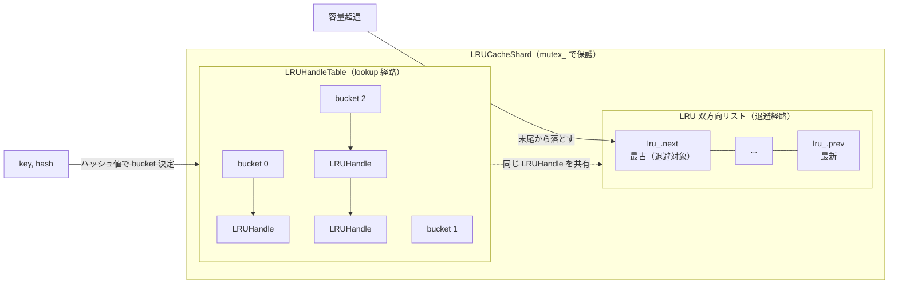
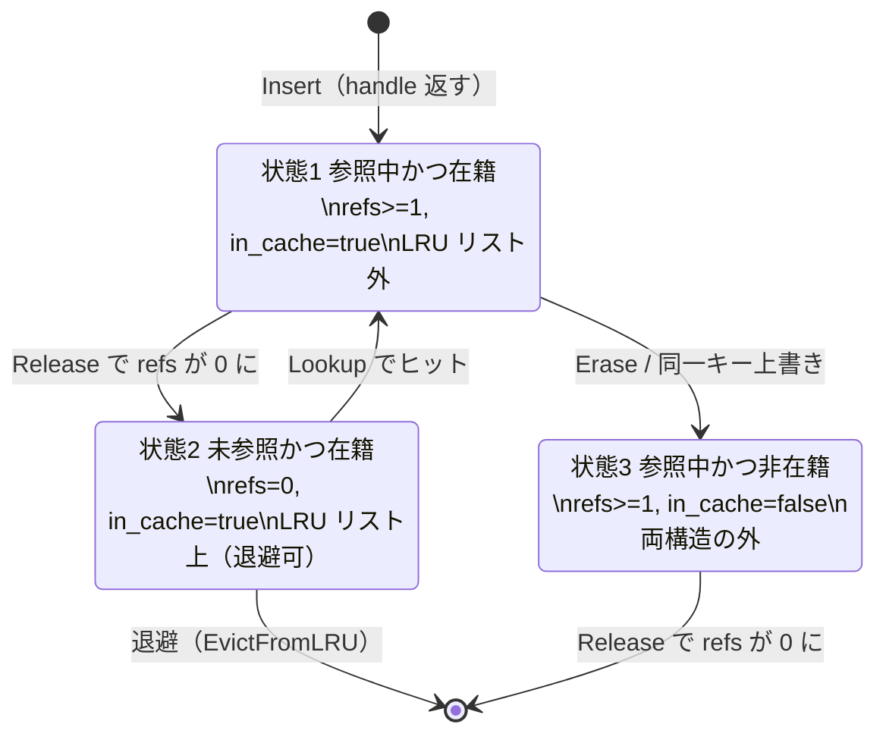
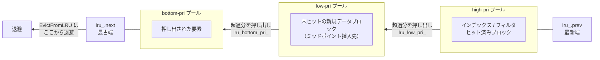

# 第39章 LRUCache

> **本章で読むソース**
> - [`cache/lru_cache.h`](https://github.com/facebook/rocksdb/blob/v11.1.1/cache/lru_cache.h)
> - [`cache/lru_cache.cc`](https://github.com/facebook/rocksdb/blob/v11.1.1/cache/lru_cache.cc)
> - [`include/rocksdb/cache.h`](https://github.com/facebook/rocksdb/blob/v11.1.1/include/rocksdb/cache.h)

## この章の狙い

第38章で見たシャード分割の内側、すなわち1つのシャードが内部でどのデータ構造をどう組み合わせて LRU 退避を実現しているかを読む。
キーから値を引く経路と、容量超過時にどれを捨てるかを決める経路が、ハッシュ表と双方向連結リストという別々の構造で実装されている点を理解する。
さらに、LRUCache の最適化の核である優先度プールが、インデックスやフィルタといった再利用価値の高いブロックをデータブロックの圧力から守る仕組みを、ミッドポイント挿入の実装から読み解く。

## 前提

- [第38章 シャード化された Cache 抽象](../part07-cache/38-cache-sharded.md)
- [第16章 BlockBasedTableReader](../part03-sst/16-block-based-table-reader.md)（Block Cache の利用者として）

## シャード1つの内部構造

`LRUCacheShard` は1つのシャードを表すクラスで、第38章で見たシャード分割の単位に対応する。
このクラスは内部に2つのデータ構造を持つ。
キーから要素を引くためのハッシュ表 `LRUHandleTable` と、退避順序を管理する LRU 双方向連結リストである。

[`cache/lru_cache.h` L404-L441](https://github.com/facebook/rocksdb/blob/v11.1.1/cache/lru_cache.h#L404-L441)

```cpp
  // Dummy head of LRU list.
  // lru.prev is newest entry, lru.next is oldest entry.
  // LRU contains items which can be evicted, ie reference only by cache
  LRUHandle lru_;

  // Pointer to head of low-pri pool in LRU list.
  LRUHandle* lru_low_pri_;

  // Pointer to head of bottom-pri pool in LRU list.
  LRUHandle* lru_bottom_pri_;
  // ... (中略) ...
  LRUHandleTable table_;
  // ... (中略) ...
  // mutex_ protects the following state.
  mutable DMutex mutex_;
```

`lru_` はダミーの番兵ノードで、これを頭とする円環状の双方向リストが LRU リストの実体である。
コメントが述べるとおり `lru_.prev` が最も新しい要素、`lru_.next` が最も古い要素を指す。
退避はこのリストの末尾、つまり `lru_.next` 側から行う。
`table_` がハッシュ表であり、`Lookup` はこちらを引く。

同じ要素が両方の構造に同時に載りうる。
ハッシュ表は「キャッシュに入っているか」を表し、LRU リストは「いま捨ててよいか」を表す。
この役割分担を理解すると、後述する参照カウントの3状態が読みやすくなる。

`mutex_` はこのシャードの全状態を保護する。
第38章で述べたとおり、LRUCache では読み取り操作も LRU リストを更新するため排他ロックを取る。
1つのシャードに対する `Lookup` や `Insert` はすべてこの `mutex_` の下で直列化される。



`Lookup` はハッシュ表をたどってキーに一致する要素を返す。
退避は LRU リストの最古端から落とす。
両者は別々の経路だが、対象となる `LRUHandle` の実体は1つで、両構造から同時に指される。

## LRUHandle の参照カウントと3状態

キャッシュの1要素は `LRUHandle` 構造体で表す。
可変長で、末尾の `key_data` にキー本体をそのまま埋め込む形でヒープに確保される。

[`cache/lru_cache.h` L50-L61](https://github.com/facebook/rocksdb/blob/v11.1.1/cache/lru_cache.h#L50-L61)

```cpp
struct LRUHandle : public Cache::Handle {
  Cache::ObjectPtr value;
  const Cache::CacheItemHelper* helper;
  LRUHandle* next_hash;
  LRUHandle* next;
  LRUHandle* prev;
  size_t total_charge;  // TODO(opt): Only allow uint32_t?
  size_t key_length;
  // The hash of key(). Used for fast sharding and comparisons.
  uint32_t hash;
  // The number of external refs to this entry. The cache itself is not counted.
  uint32_t refs;
```

ポインタが3本あることに注目したい。
`next_hash` はハッシュ表のバケット内チェインをつなぐ。
`next` と `prev` は LRU 双方向リストをつなぐ。
1つの構造体が2つの連結リストに同時に属するため、リスト用のポインタを別々に持つ。

`refs` は外部参照カウントである。
コメントが明記するとおり、キャッシュ自身による参照はこの数に含めない。
ある要素を `Lookup` で取得して利用している間は `refs` が1以上になり、利用者が `Release` を呼ぶと減る。

「キャッシュに入っているか」は別のフラグで表す。
`m_flags` の `M_IN_CACHE` ビットがそれである。

[`cache/lru_cache.h` L66-L76](https://github.com/facebook/rocksdb/blob/v11.1.1/cache/lru_cache.h#L66-L76)

```cpp
  uint8_t m_flags;
  enum MFlags : uint8_t {
    // Whether this entry is referenced by the hash table.
    M_IN_CACHE = (1 << 0),
    // Whether this entry has had any lookups (hits).
    M_HAS_HIT = (1 << 1),
    // Whether this entry is in high-pri pool.
    M_IN_HIGH_PRI_POOL = (1 << 2),
    // Whether this entry is in low-pri pool.
    M_IN_LOW_PRI_POOL = (1 << 3),
  };
```

外部参照カウント `refs` とキャッシュ在籍フラグ `M_IN_CACHE` を組み合わせると、要素は3つの状態を取る。
ヘッダ冒頭のコメントがこの状態を定義している。

[`cache/lru_cache.h` L32-L47](https://github.com/facebook/rocksdb/blob/v11.1.1/cache/lru_cache.h#L32-L47)

```cpp
// LRUHandle can be in these states:
// 1. Referenced externally AND in hash table.
//    In that case the entry is *not* in the LRU list
//    (refs >= 1 && in_cache == true)
// 2. Not referenced externally AND in hash table.
//    In that case the entry is in the LRU list and can be freed.
//    (refs == 0 && in_cache == true)
// 3. Referenced externally AND not in hash table.
//    In that case the entry is not in the LRU list and not in hash table.
//    The entry must be freed if refs becomes 0 in this state.
//    (refs >= 1 && in_cache == false)
```

状態1は、利用者が参照中でハッシュ表にも載っている要素である。
このとき要素は LRU リストには載らない。
利用中のものを退避候補に置かないためである。

状態2は、誰も参照しておらずハッシュ表に載っている要素である。
このときだけ LRU リスト上に存在し、退避してよい。
LRU リストに載っている要素は必ず `refs == 0` だという不変条件が、ここから読み取れる。

状態3は、利用者が参照中だがハッシュ表からは外れた要素である。
`Erase` や同じキーでの上書き挿入で起きる。
ハッシュ表からも LRU リストからも外れているため、最後の参照が消えた時点で解放される。



この状態遷移はそのまま `Lookup` の実装に表れる。

[`cache/lru_cache.cc` L430-L448](https://github.com/facebook/rocksdb/blob/v11.1.1/cache/lru_cache.cc#L430-L448)

```cpp
LRUHandle* LRUCacheShard::Lookup(const Slice& key, uint32_t hash,
                                 const Cache::CacheItemHelper* /*helper*/,
                                 Cache::CreateContext* /*create_context*/,
                                 Cache::Priority /*priority*/,
                                 Statistics* /*stats*/) {
  DMutexLock l(mutex_);
  LRUHandle* e = table_.Lookup(key, hash);
  if (e != nullptr) {
    assert(e->InCache());
    if (!e->HasRefs()) {
      // The entry is in LRU since it's in hash and has no external
      // references.
      LRU_Remove(e);
    }
    e->Ref();
    e->SetHit();
  }
  return e;
}
```

`Lookup` はまずハッシュ表を引く。
見つかった要素がまだ誰にも参照されていなければ状態2にあり、LRU リスト上に載っている。
これから利用者に渡すので、`LRU_Remove` で LRU リストから外して状態1へ移す。
そのうえで `Ref` で参照カウントを上げ、`SetHit` でヒット済みフラグ `M_HAS_HIT` を立てる。
このヒットフラグが後の優先度プール判定で効いてくる。

利用者が使い終えると `Release` を呼ぶ。
ここで参照カウントが0に戻ると、状態1から状態2へ戻る。

[`cache/lru_cache.cc` L480-L502](https://github.com/facebook/rocksdb/blob/v11.1.1/cache/lru_cache.cc#L480-L502)

```cpp
    DMutexLock l(mutex_);
    must_free = e->Unref();
    was_in_cache = e->InCache();
    if (must_free && was_in_cache) {
      // The item is still in cache, and nobody else holds a reference to it.
      if (usage_ > capacity_ || erase_if_last_ref) {
        // The LRU list must be empty since the cache is full.
        assert(lru_.next == &lru_ || erase_if_last_ref);
        // Take this opportunity and remove the item.
        table_.Remove(e->key(), e->hash);
        e->SetInCache(false);
      } else {
        // Put the item back on the LRU list, and don't free it.
        LRU_Insert(e);
        must_free = false;
      }
    }
```

`Unref` で参照が最後の1つだったとき、要素はまだキャッシュ在籍中であれば LRU リストへ戻す（`LRU_Insert`）。
ただし、すでに容量を超過している場合は、戻さずにこの場でハッシュ表からも外して解放する。
解放処理自体は性能のため `mutex_` を解いた後で行う。

## 退避 EvictFromLRU

容量を超えたとき、どの要素を捨てるかを決めるのが `EvictFromLRU` である。

[`cache/lru_cache.cc` L323-L336](https://github.com/facebook/rocksdb/blob/v11.1.1/cache/lru_cache.cc#L323-L336)

```cpp
void LRUCacheShard::EvictFromLRU(size_t charge,
                                 autovector<LRUHandle*>* deleted) {
  while ((usage_ + charge) > capacity_ && lru_.next != &lru_) {
    LRUHandle* old = lru_.next;
    // LRU list contains only elements which can be evicted.
    assert(old->InCache() && !old->HasRefs());
    LRU_Remove(old);
    table_.Remove(old->key(), old->hash);
    old->SetInCache(false);
    assert(usage_ >= old->total_charge);
    usage_ -= old->total_charge;
    deleted->push_back(old);
  }
}
```

ループは `lru_.next`、すなわち最古の要素から処理する。
`assert` が示すとおり、LRU リスト上の要素は必ず在籍中かつ未参照（状態2）である。
だから退避が利用中の要素を巻き込むことはない。

退避は2段階に分かれる。
まず `mutex_` を保持した状態で、LRU リストとハッシュ表の両方から要素を外し、`deleted` ベクタに集める。
実際の解放は呼び出し側が `mutex_` を解いた後にまとめて行う。
退避対象を1個ずつ集めてから一括解放するのは、利用者が確保した値の解放（後述の `Free`）をロックの外に出し、ロック保持時間を短く保つためである。

挿入経路を見ると、この退避が挿入の直前に走ることがわかる。

[`cache/lru_cache.cc` L376-L400](https://github.com/facebook/rocksdb/blob/v11.1.1/cache/lru_cache.cc#L376-L400)

```cpp
  {
    DMutexLock l(mutex_);

    // Free the space following strict LRU policy until enough space
    // is freed or the lru list is empty.
    EvictFromLRU(e->total_charge, &last_reference_list);

    if ((usage_ + e->total_charge) > capacity_ &&
        (strict_capacity_limit_ || handle == nullptr)) {
      e->SetInCache(false);
      // ... (中略) ...
    } else {
      // Insert into the cache. Note that the cache might get larger than its
      // capacity if not enough space was freed up.
      LRUHandle* old = table_.Insert(e);
      usage_ += e->total_charge;
```

新しい要素を入れる前に、その容量分だけ古い要素を落とそうと試みる。
落としきれない場合の扱いが、次節の `strict_capacity_limit` の分岐である。

退避された要素の値は、最終的に `Free` で解放される。
解放は `CacheItemHelper` の deleter を通して行う。

[`cache/lru_cache.h` L166-L174](https://github.com/facebook/rocksdb/blob/v11.1.1/cache/lru_cache.h#L166-L174)

```cpp
  void Free(MemoryAllocator* allocator) {
    assert(refs == 0);
    assert(helper);
    if (helper->del_cb) {
      helper->del_cb(value, allocator);
    }

    free(this);
  }
```

`LRUHandle` は値の型を知らない。
値の解放方法は、挿入時に渡された `CacheItemHelper` の `del_cb`（deleter コールバック）が握る。
`Free` はこの deleter を呼んで値を解放し、最後にハンドル自身を `free` する。
キャッシュが値の型に依存せずに任意のオブジェクトを保持できるのは、この型消去のおかげである。
`CacheItemHelper` と Cache 抽象そのものの設計は第38章で扱った。

## 優先度プールとミッドポイント挿入

ここまでは素朴な LRU だった。
LRUCache の最適化の核は、LRU リストを優先度で3つの区間に分ける優先度プールにある。

問題は、Block Cache がインデックスブロックやフィルタブロックと、通常のデータブロックを同じキャッシュに同居させる点にある。
データブロックは点在するキーアクセスでひっきりなしに出入りする。
素朴な LRU では、最近触れたデータブロックが常にリスト先頭に積まれ、参照頻度は高いが間隔の空くインデックスやフィルタを末尾へ押し出してしまう。
インデックスやフィルタは1つの SST 全体の読みに関わるため、これらが退避されると影響が広い。

優先度プールは、LRU リストを高優先（high-pri）、低優先（low-pri）、最低優先（bottom-pri）の3区間に区切り、再利用価値の高いブロックを先頭側の区間に置くことで、この押し出しを抑える。
区間の境界は `lru_low_pri_` と `lru_bottom_pri_` という2つのポインタで表す。
`lru_.prev`（最新端）から `lru_low_pri_` までが high-pri プール、そこから `lru_bottom_pri_` までが low-pri プール、残りの最古側が bottom-pri プールである。

挿入位置を決めるのが `LRU_Insert` である。

[`cache/lru_cache.cc` L256-L296](https://github.com/facebook/rocksdb/blob/v11.1.1/cache/lru_cache.cc#L256-L296)

```cpp
void LRUCacheShard::LRU_Insert(LRUHandle* e) {
  assert(e->next == nullptr);
  assert(e->prev == nullptr);
  if (high_pri_pool_ratio_ > 0 && (e->IsHighPri() || e->HasHit())) {
    // Inset "e" to head of LRU list.
    e->next = &lru_;
    e->prev = lru_.prev;
    e->prev->next = e;
    e->next->prev = e;
    e->SetInHighPriPool(true);
    e->SetInLowPriPool(false);
    high_pri_pool_usage_ += e->total_charge;
    MaintainPoolSize();
  } else if (low_pri_pool_ratio_ > 0 &&
             (e->IsHighPri() || e->IsLowPri() || e->HasHit())) {
    // Insert "e" to the head of low-pri pool.
    e->next = lru_low_pri_->next;
    e->prev = lru_low_pri_;
    e->prev->next = e;
    e->next->prev = e;
    e->SetInHighPriPool(false);
    e->SetInLowPriPool(true);
    low_pri_pool_usage_ += e->total_charge;
    lru_low_pri_ = e;
    MaintainPoolSize();
  } else {
    // Insert "e" to the head of bottom-pri pool.
    e->next = lru_bottom_pri_->next;
    e->prev = lru_bottom_pri_;
    e->prev->next = e;
    e->next->prev = e;
    e->SetInHighPriPool(false);
    e->SetInLowPriPool(false);
    // if the low-pri pool is empty, lru_low_pri_ also needs to be updated.
    if (lru_bottom_pri_ == lru_low_pri_) {
      lru_low_pri_ = e;
    }
    lru_bottom_pri_ = e;
  }
  lru_usage_ += e->total_charge;
}
```

挿入先の選び方は次のとおりである。
高優先指定（`IsHighPri`）の要素か、過去にヒットした（`HasHit`）要素は、high-pri プールの先頭、つまりリスト全体の最新端に入る。
そうでなくても low-pri プールが有効なら low-pri プールの先頭に入る。
どちらにも当てはまらなければ bottom-pri プールの先頭に入る。

ここに2つの設計判断が読み取れる。
1つは、ヒット実績があれば指定優先度に関わらず最上位プールへ昇格させる点である。
データブロックでも一度参照されれば再利用価値があるとみなし、上位へ引き上げる。
もう1つは、ミッドポイント挿入である。
`high_pri_pool_ratio` が既定の 0.5 のとき、ヒットも高優先指定もない新規データブロックは low-pri プール（このときリストのほぼ中央）に入る。
リスト先頭ではなく中央に入れることで、一度きりのスキャンで読まれただけのブロックが、よく使われるブロックを押し出すのを防ぐ。
この考え方は MySQL の InnoDB バッファプールでも用いられる古典的なミッドポイント挿入である[^midpoint]。

[^midpoint]: 新規要素をリスト先頭ではなく中間点に挿入し、再アクセスがあったものだけを先頭へ昇格させる手法。`high_pri_pool_ratio = 0.5` のとき、未ヒットの要素が入る low-pri プールの先頭は LRU リストのちょうど中央付近にあたる。

各プールの容量は比率で決まる。
`high_pri_pool_ratio` と `low_pri_pool_ratio` はそれぞれシャード容量に対する比率で、`LRUCacheOptions` で設定する。

[`include/rocksdb/cache.h` L228-L246](https://github.com/facebook/rocksdb/blob/v11.1.1/include/rocksdb/cache.h#L228-L246)

```cpp
  // If high_pri_pool_ratio is greater than zero, a dedicated high-priority LRU
  // list is maintained by the cache. A ratio of 0.5 means non-high-priority
  // entries will use midpoint insertion. Similarly, if low_pri_pool_ratio is
  // greater than zero, a dedicated low-priority LRU list is maintained.
  // There is also a bottom-priority LRU list, which is always enabled and not
  // explicitly configurable. Entries are spilled over to the next available
  // lower-priority pool if a certain pool's capacity is exceeded.
  // ... (中略) ...
  double high_pri_pool_ratio = 0.5;
  double low_pri_pool_ratio = 0.0;
```

挿入のたびにプールが膨らむので、容量を超えた分を1つ下のプールへ押し出して境界を保つのが `MaintainPoolSize` である。

[`cache/lru_cache.cc` L298-L321](https://github.com/facebook/rocksdb/blob/v11.1.1/cache/lru_cache.cc#L298-L321)

```cpp
void LRUCacheShard::MaintainPoolSize() {
  while (high_pri_pool_usage_ > high_pri_pool_capacity_) {
    // Overflow last entry in high-pri pool to low-pri pool.
    lru_low_pri_ = lru_low_pri_->next;
    assert(lru_low_pri_ != &lru_);
    assert(lru_low_pri_->InHighPriPool());
    lru_low_pri_->SetInHighPriPool(false);
    lru_low_pri_->SetInLowPriPool(true);
    assert(high_pri_pool_usage_ >= lru_low_pri_->total_charge);
    high_pri_pool_usage_ -= lru_low_pri_->total_charge;
    low_pri_pool_usage_ += lru_low_pri_->total_charge;
  }

  while (low_pri_pool_usage_ > low_pri_pool_capacity_) {
    // Overflow last entry in low-pri pool to bottom-pri pool.
    lru_bottom_pri_ = lru_bottom_pri_->next;
    assert(lru_bottom_pri_ != &lru_);
    assert(lru_bottom_pri_->InLowPriPool());
    lru_bottom_pri_->SetInHighPriPool(false);
    lru_bottom_pri_->SetInLowPriPool(false);
    assert(low_pri_pool_usage_ >= lru_bottom_pri_->total_charge);
    low_pri_pool_usage_ -= lru_bottom_pri_->total_charge;
  }
}
```

high-pri プールが容量を超えると、`lru_low_pri_` を1つ最新側へ進め、その要素を high-pri から low-pri へ移す。
これはノードを動かしているのではなく、区間の境界ポインタを動かしているだけである。
要素自体は LRU リスト上の同じ位置にとどまり、所属プールのフラグと境界ポインタだけが書き換わる。
low-pri プールが超過したときも同様に `lru_bottom_pri_` を進めて bottom-pri へ押し出す。

重要なのは退避との関係である。
`EvictFromLRU` は常にリスト最古端（`lru_.next`）から落とすので、退避は最初に bottom-pri プールから起きる。
high-pri プールに入ったインデックスやフィルタは、リスト最新端に近い側に居続け、bottom-pri と low-pri の要素がすべて尽きるまで退避されない。



この区間分割が、再利用価値の高いブロックの保持という最適化を成立させている。
新規データブロックは中央以降に入り、退避はまず最古端から起きるため、上位プールの要素が守られる。

## strict_capacity_limit の挙動

`EvictFromLRU` が容量を空けきれない場合がある。
利用中の要素（状態1）は LRU リストに載っておらず退避できないため、参照中の要素だけで容量を埋め尽くすと、それ以上は空かない。
このとき新規挿入をどう扱うかを決めるのが `strict_capacity_limit` である。

[`include/rocksdb/cache.h` L140-L145](https://github.com/facebook/rocksdb/blob/v11.1.1/include/rocksdb/cache.h#L140-L145)

```cpp
  // If strict_capacity_limit is set, Insert() will fail if there is not
  // enough capacity for the new entry along with all the existing referenced
  // (pinned) cache entries. (Unreferenced cache entries are evicted as
  // needed, sometimes immediately.) If strict_capacity_limit == false
  // (default), Insert() never fails.
  bool strict_capacity_limit = false;
```

挿入経路の分岐を再掲する。

[`cache/lru_cache.cc` L383-L399](https://github.com/facebook/rocksdb/blob/v11.1.1/cache/lru_cache.cc#L383-L399)

```cpp
    if ((usage_ + e->total_charge) > capacity_ &&
        (strict_capacity_limit_ || handle == nullptr)) {
      e->SetInCache(false);
      if (handle == nullptr) {
        // Don't insert the entry but still return ok, as if the entry inserted
        // into cache and get evicted immediately.
        last_reference_list.push_back(e);
      } else {
        free(e);
        e = nullptr;
        *handle = nullptr;
        s = Status::MemoryLimit("Insert failed due to LRU cache being full.");
      }
    } else {
      // Insert into the cache. Note that the cache might get larger than its
      // capacity if not enough space was freed up.
```

退避後もなお容量超過で、かつ `strict_capacity_limit_` が真のとき、挿入は失敗する。
ハンドルを返す呼び出し（`handle != nullptr`）では、確保したばかりの要素を `free` し、`*handle` に `nullptr` を入れ、`Status::MemoryLimit` を返す。
利用者はキャッシュに入らなかったことを知り、自前で値を扱う必要がある。

既定の `strict_capacity_limit == false` では話が逆になる。
コメントが述べるとおり、この場合 `Insert` は決して失敗しない。
`else` 節に進んで要素をハッシュ表に入れ、`usage_` を加算する。
コメントが明記するとおり、空けきれなかった分だけキャッシュは一時的に容量を超えてもよい。
超過分は、参照中の要素が `Release` で LRU リストへ戻った時点で退避されるか、`Release` の中で容量超過を見て即座に解放される。

`strict_capacity_limit` は厳密なメモリ上限が必要な場面で使う。
通常運用では既定の `false` のまま、瞬間的な超過を許す方が、挿入失敗による読み取り側の複雑化を避けられる。

## まとめ

- `LRUCacheShard` は1シャードを表し、内部にハッシュ表 `LRUHandleTable`（lookup 経路）と LRU 双方向リスト（退避経路）を持つ。同じ `LRUHandle` が両構造から指される。
- `LRUHandle` は外部参照カウント `refs` とキャッシュ在籍フラグ `M_IN_CACHE` の組で3状態を取る。参照中の要素は LRU リストに載らず、退避対象にならない。
- `EvictFromLRU` は LRU リスト最古端から落とし、値は `CacheItemHelper` の deleter で解放する。解放はロックの外でまとめて行い、ロック保持時間を短く保つ。
- 優先度プール（high-pri / low-pri / bottom-pri）が LRUCache の最適化の核である。ヒット実績や高優先指定の要素を上位プールに置き、退避は最古端から起きるため、インデックスやフィルタがデータブロックに押し出されにくい。区間の移動は要素ではなく境界ポインタの付け替えで行う。
- 未ヒットの新規要素を中央に入れるミッドポイント挿入により、一度きりのスキャンが頻用ブロックを追い出すのを防ぐ。`high_pri_pool_ratio` の既定は 0.5。
- `strict_capacity_limit` が真なら容量を空けきれないとき `Insert` は `Status::MemoryLimit` で失敗する。既定の偽では失敗せず、瞬間的な容量超過を許す。

## 関連する章

- [第38章 シャード化された Cache 抽象](../part07-cache/38-cache-sharded.md)：Cache 抽象、`CacheItemHelper` による型消去、シャード分割の全体像。
- [第40章 HyperClockCache](../part07-cache/40-hyperclock-cache.md)：mutex を排し、本章のような排他ロックなしで動く後継キャッシュとの対比。
- [第41章 SecondaryCache と階層キャッシュ](../part07-cache/41-secondary-tiered-cache.md)：退避された要素を二次キャッシュへ降ろす拡張。
