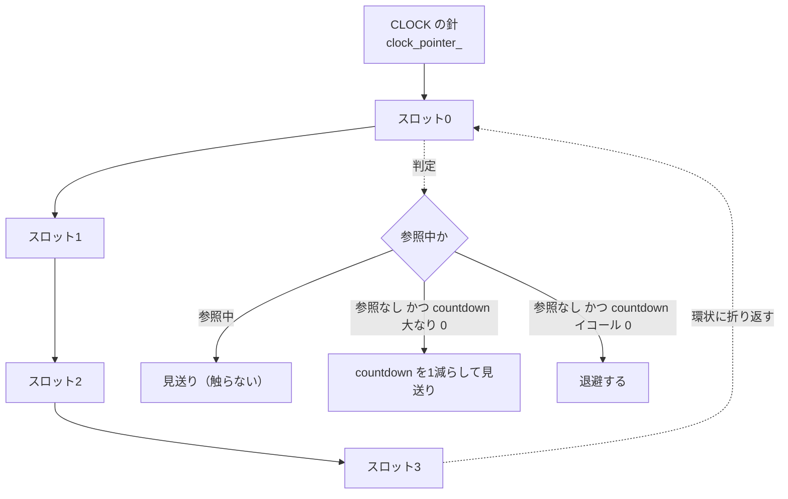
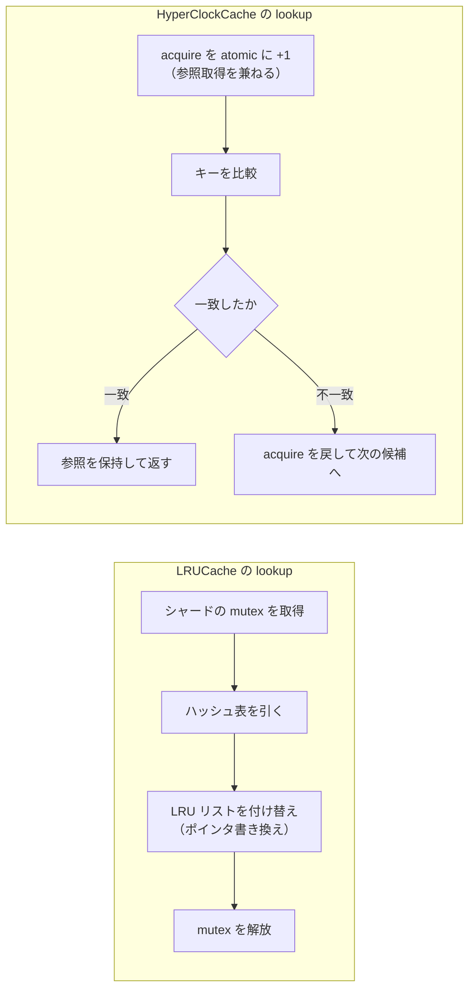

# 第40章 HyperClockCache

> **本章で読むソース**
>
> - [`cache/clock_cache.h`](https://github.com/facebook/rocksdb/blob/v11.1.1/cache/clock_cache.h)
> - [`cache/clock_cache.cc`](https://github.com/facebook/rocksdb/blob/v11.1.1/cache/clock_cache.cc)
> - [`include/rocksdb/cache.h`](https://github.com/facebook/rocksdb/blob/v11.1.1/include/rocksdb/cache.h)

## この章の狙い

LRUCache が高並行下で抱える mutex 競合の問題と、HyperClockCache がそれをどう解消するかを理解する。
本章では、ロックを取らない lookup の機構、LRU を近似する CLOCK 退避アルゴリズム、そして固定サイズ表と可変サイズ表の違いを、実コードに沿って読む。
読み終えたとき、なぜ HyperClockCache が高並行のホットなキャッシュでスケールするのかを、メタデータの原子操作とメモリレイアウトのレベルで説明できるようになる。

## 前提

- [第38章 シャード化されたキャッシュ](./38-cache-sharded.md)
- [第39章 LRUCache](./39-lru-cache.md)

本章は LRUCache（第39章）との対比で HyperClockCache を論じる。
LRUCache の構造、特に lookup 時の LRU リスト操作とシャードの mutex については第39章を前提とする。

## なぜ LRUCache では足りないのか

LRUCache は、最も古く使われたエントリから順に退避するために、エントリを使用頻度順の双方向連結リストでつないでいる。
このリストは、lookup でヒットしたエントリをリストの先頭（最近使われた側）へ付け替えることで順序を保つ。
ここに問題がある。
リストの付け替えはポインタを複数本書き換える操作であり、複数スレッドから同時に行えば壊れる。
そのため LRUCache は、lookup でヒットしただけでもシャードの mutex を取得する。

読み主体のワークロードでは、この mutex がボトルネックになる。
ブロックキャッシュは読み取りのたびに引かれるため、ヒット率が高いほど lookup の回数も多い。
同じシャードを多数のスレッドが叩くと、リスト付け替えのためだけに mutex の奪い合いが起き、CPU がロック待ちで埋まる。
キャッシュにデータがあるのに、その取り出しが直列化されるという状態になる。

HyperClockCache（HCC とも呼ばれる）は、この直列化を取り除くために設計された。
クラスの冒頭コメントは設計目標を次のように述べている。

[`cache/clock_cache.h` L34-L45](https://github.com/facebook/rocksdb/blob/v11.1.1/cache/clock_cache.h#L34-L45)

```cpp
// HyperClockCache is an alternative to LRUCache specifically tailored for
// use as BlockBasedTableOptions::block_cache
//
// Benefits
// --------
// * Lock/wait free (no waits or spins) for efficiency under high concurrency
//   * Fixed version (estimated_entry_charge > 0) is fully lock/wait free
//   * Automatic version (estimated_entry_charge = 0) has rare waits among
//     certain insertion or erase operations that involve the same very small
//     set of entries.
// * Optimized for hot path reads. For concurrency control, most Lookup() and
// essentially all Release() are a single atomic add operation.
```

ここで宣言されている二つの性質が本章の主題である。
ひとつは、ホットパスの読み取り（lookup と release）が原則として単一の atomic 加算で済むこと。
もうひとつは、退避が CLOCK の変種で行われ、リストの付け替えを必要としないことである。
公開ヘッダ側のコメントは、HCC を LRUCache より一般的に推奨するとまで述べている（[`include/rocksdb/cache.h` L371-L378](https://github.com/facebook/rocksdb/blob/v11.1.1/include/rocksdb/cache.h#L371-L378)）。

```cpp
// HyperClockCache (also known as HCC) - A lock-free Cache alternative for
// RocksDB block cache that offers much improved CPU efficiency vs. LRUCache
// under high parallel load or high contention. Additionally, HCC only uses
// sharding for a modest performance boost, so can use much larger cache shards
// than LRUCache, dramatically reducing the risk of thrashing in configurations
// or work loads with some large blocks.
//
// HYPERCLOCKCACHE IS NOW GENERALLY RECOMMENDED OVER LRUCACHE
```

なお HCC はブロックキャッシュ専用である。
キーが厳密に16バイトであることを前提とし（[`cache/clock_cache.h` L62-L63](https://github.com/facebook/rocksdb/blob/v11.1.1/cache/clock_cache.h#L62-L63)）、これは RocksDB がブロックキャッシュに用いるキー形式に合わせた制約である。
行キャッシュやテーブルキャッシュには使えない。

## CLOCK 退避アルゴリズム

LRU の付け替えを避けるには、退避の判断材料をエントリの移動なしで持つ必要がある。
CLOCK アルゴリズムはこれを満たす。
各エントリに「最近使われたか」を表す小さなカウンタ（countdown と呼ぶ）を持たせ、退避はエントリを時計の針のように環状に走査して行う。
針が指したエントリのカウンタが残っていれば、それを一つ減らして見送る。
カウンタがゼロなら退避する。
リストの順序を保つ必要がないので、lookup でヒットしてもカウンタを上げるだけでよく、エントリを動かさずに済む。

HCC のカウンタは初期値を優先度で決め、lookup のたびに最大3まで加算される（[`cache/clock_cache.h` L95-L102](https://github.com/facebook/rocksdb/blob/v11.1.1/cache/clock_cache.h#L95-L102)）。

```cpp
// A score (or "countdown") is maintained for each entry, initially determined
// by priority. The score is incremented on each Lookup, up to a max of 3,
// though is easily returned to previous state if useful=false with Release.
// During CLOCK-style eviction iteration, entries with score > 0 are
// decremented if currently unreferenced and entries with score == 0 are
// evicted if currently unreferenced. Note that scoring might not be perfect
// because entries can be referenced transiently within the cache even when
// there are no outside references to the entry.
```

最後の二文が退避の判定そのものである。
参照されていない（外部からの参照がゼロの）エントリのうち、カウンタが正なら減算して見送り、ゼロなら退避する。
よく使われるエントリほど lookup でカウンタが補充されるため、針がもう一周してくるまでに退避を免れやすい。
これが LRU の近似になる。

この判定を実装するのが `ClockUpdate` である（[`cache/clock_cache.cc` L97-L156](https://github.com/facebook/rocksdb/blob/v11.1.1/cache/clock_cache.cc#L97-L156)）。
針が指したエントリ一つに対して呼ばれ、見送りなら `false`、退避を確定したなら `true` を返す。

```cpp
inline bool ClockUpdate(ClockHandle& h, BaseClockTable::EvictionData* data,
                        bool* purgeable = nullptr) {
  // ... (中略：meta の読み出し) ...
  uint32_t acquire_count = meta.GetAcquireCounter();
  uint32_t release_count = meta.GetReleaseCounter();
  if (acquire_count != release_count) {
    // Only clock update entries with no outstanding refs
    data->seen_pinned_count++;
    return false;
  }
  if (meta.IsVisible() && acquire_count > 0) {
    // Decrement clock
    uint32_t new_count =
        std::min(acquire_count - 1, uint32_t{ClockHandle::kMaxCountdown} - 1);
    // Compare-exchange in the decremented clock info, but
    // not aggressively
    SlotMeta new_meta = meta;
    new_meta.SetReleaseCounter(new_count);
    new_meta.SetAcquireCounter(new_count);
    h.meta.CasStrongRelaxed(meta, new_meta);
    return false;
  }
  // Otherwise, remove entry (either unreferenced invisible or
  // unreferenced and expired visible).
  SlotMeta construction_meta;
  construction_meta.SetUnderConstruction();
  construction_meta.SetHit(meta.GetHit());
  if (h.meta.CasStrong(meta, construction_meta)) {
    // Took ownership.
    data->freed_charge += h.GetTotalCharge();
    data->freed_count += 1;
    return true;
  }
  // ... (中略) ...
}
```

処理は三段に分かれる。
まず参照中（`acquire_count != release_count`）のエントリは触らずに見送る。
退避中に外から使われているエントリを消すわけにはいかないからである。
次に、参照がなくカウンタが正なら、カウンタを一つ減らして見送る。
最後に、参照がなくカウンタがゼロのエントリだけを退避対象とし、状態を「構築中」に切り替えて所有権を取る。

カウンタの加算と減算が、ここでは acquire 側と release 側の二つのカウンタを同じ値にそろえる形で表現されている点に注意したい。
その理由は次節の参照カウントの符号化で明らかになる。



## ロックを取らない lookup

ここが HCC の最適化の核である。
LRUCache がリスト付け替えのために取っていた mutex を、HCC は完全になくす。
そのための鍵が、参照カウントと CLOCK カウンタを一つの atomic な64ビット語（`meta`）に符号化する仕掛けである。

`meta` 語のレイアウトはヘッダのコメントに図示されている（[`cache/clock_cache.h` L313-L318](https://github.com/facebook/rocksdb/blob/v11.1.1/cache/clock_cache.h#L313-L318)）。

```cpp
  // Constants for handling the atomic `meta` word, which tracks most of the
  // state of the handle. The meta word looks like this:
  // low bits                                                     high bits
  // -----------------------------------------------------------------------
  // | acquire counter      | release counter     | hit bit | state marker |
  // -----------------------------------------------------------------------
```

下位30ビットが acquire カウンタ、続く30ビットが release カウンタ、残りに hit ビットと状態マーカーが入る（[`cache/clock_cache.h` L320-L340](https://github.com/facebook/rocksdb/blob/v11.1.1/cache/clock_cache.h#L320-L340)）。
この符号化の意味を、ヘッダのコメントはこう説明する（[`cache/clock_cache.h` L120-L127](https://github.com/facebook/rocksdb/blob/v11.1.1/cache/clock_cache.h#L120-L127)）。

```cpp
// We have a clever way of encoding an entry's reference count and countdown
// clock so that Lookup and Release are each usually a single atomic addition.
// In a single metadata word we have both an "acquire" count, incremented by
// Lookup, and a "release" count, incremented by Release. If useful=false,
// Release can instead decrement the acquire count. Thus the current ref
// count is (acquires - releases), and the countdown clock is min(3, acquires).
// Note that only unreferenced entries (acquires == releases) are eligible
// for CLOCK manipulation and eviction. We tolerate use of more expensive
```

二つのカウンタの差し引きが二役を兼ねる。
現在の参照数は acquire から release を引いた値であり、CLOCK カウンタは acquire を3で頭打ちにした値である。
lookup は acquire を1増やす。
release は release を1増やす。
どちらも単一の atomic 加算で完結する。
両者が等しい（参照ゼロの）エントリだけが退避の対象になるという `ClockUpdate` の第一段の判定は、この符号化の上で自然に表現される。

lookup の本体を見ると、ヒット時の処理が確かに atomic 加算一回であることがわかる（[`cache/clock_cache.cc` L854-L880](https://github.com/facebook/rocksdb/blob/v11.1.1/cache/clock_cache.cc#L854-L880)）。

```cpp
        // (Optimistically) increment acquire counter
        h->meta.Apply(AcquireCounter::PlusTransformPromiseNoOverflow(1),
                      &old_meta);
        // Check if it's an entry visible to lookups
        if (old_meta.IsVisible()) {
          // Acquired a read reference
          if (h->hashed_key == hashed_key) {
            // Match
            // Update the hit bit
            if (eviction_callback_) {
              h->meta.ApplyRelaxed(SlotMeta::HitFlag::SetTransform());
            }
            return true;
          } else {
            // Mismatch. Pretend we never took the reference
            Unref(*h);
          }
        } else if (UNLIKELY(old_meta.IsInvisible())) {
          // Pretend we never took the reference
          Unref(*h);
        } else {
          // For other states, incrementing the acquire counter has no effect
          // so we don't need to undo it. Furthermore, we cannot safely undo
          // it because we did not acquire a read reference to lock the
          // entry in a Shareable state.
        }
        return false;
```

注目すべきは順序である。
キーの一致を確かめる前に、まず acquire カウンタを楽観的に1増やす。
この加算がそのまま「読み取り参照を取った」ことの宣言になる。
参照を取った状態でキーを比べ、一致すればその参照を保持したままヒットを返す。
不一致だったときだけ、参照を取らなかったことにして acquire を戻す（`Unref`）。
ロックは一切取らない。
ヒットの確認と参照カウントの取得が、一回の `fetch_add` で同時に成立する。

ヘッダはこの「ただ乗り」の発想を疑問形で書いている（[`cache/clock_cache.h` L115-L118](https://github.com/facebook/rocksdb/blob/v11.1.1/cache/clock_cache.h#L115-L118)）。
参照カウントは最低限どうしても必要な操作だが、それ以外のメタデータ追跡（CLOCK カウンタの補充）を「ただで」相乗りさせられないか、という問いである。
答えが、acquire カウンタが参照カウントと CLOCK カウンタを同時に担う上記の符号化であった。

なぜこれで速いのかを機構として言えば、こうである。
mutex は、保護対象を読み書きする前に必ず取得と解放という別の atomic 操作を要し、競合時にはスレッドを待たせる。
HCC は、保護したいデータ（参照カウントと使用記録）そのものを単一の atomic 語に畳み込み、その語への加算を保護操作と兼ねさせた。
取得と解放という追加の往復が消え、待ちも消える。

書き込み側（insert と erase）はこの限りではない。
ヘッダは「キャッシュ書き込みにはより高価な compare_exchange の使用を許容する」と明記している（[`cache/clock_cache.h` L127-L128](https://github.com/facebook/rocksdb/blob/v11.1.1/cache/clock_cache.h#L127-L128)）。
読み取りの速さを優先し、まれな書き込みのコストには目をつぶる設計である。



## オープンアドレス法のハッシュ表

ロックなしの lookup を支えるもう一つの土台が、オープンアドレス法のハッシュ表である。
エントリを連結リストでつなぐのではなく、配列のスロットに直接置く。
スロットが衝突したら、決められた順序で次のスロットを探る（プロービング）。
連結リストを使わないので、lookup でポインタをたどる必要がなく、退避でリストを編む必要もない。

`FindSlot` がプロービングの本体である（[`cache/clock_cache.cc` L1048-L1081](https://github.com/facebook/rocksdb/blob/v11.1.1/cache/clock_cache.cc#L1048-L1081)）。

```cpp
inline FixedHyperClockTable::HandleImpl* FixedHyperClockTable::FindSlot(
    const UniqueId64x2& hashed_key, const MatchFn& match_fn,
    const AbortFn& abort_fn, const UpdateFn& update_fn) {
  // ... (中略) ...
  size_t base = static_cast<size_t>(hashed_key[1]);
  // We use an odd increment, which is relatively prime with the power-of-two
  // table size. This implies that we cycle back to the first probe only
  // after probing every slot exactly once.
  // TODO: we could also reconsider linear probing, though locality benefits
  // are limited because each slot is a full cache line
  size_t increment = static_cast<size_t>(hashed_key[0]) | 1U;
  size_t first = ModTableSize(base);
  size_t current = first;
  bool is_last;
  do {
    HandleImpl* h = &array_[current];
    if (match_fn(h)) {
      return h;
    }
    if (abort_fn(h)) {
      return nullptr;
    }
    current = ModTableSize(current + increment);
    is_last = current == first;
    update_fn(h, is_last);
  } while (!is_last);
  // We looped back.
  return nullptr;
}
```

探索は二重ハッシュ法で行う。
i 番目の候補スロットは「`base + i * increment` を表サイズで割った余り」である。
`increment` を奇数にすることで、表サイズ（2のべき乗）と互いに素になり、全スロットをちょうど一巡してから先頭に戻る。
これにより、クラスタリング（特定領域への偏り）を抑えながら、最終的に空きスロットへ確実に到達できる。

前掲の `Lookup`（[`cache/clock_cache.cc` L827-L886](https://github.com/facebook/rocksdb/blob/v11.1.1/cache/clock_cache.cc#L827-L886)）は、`FindSlot` に三つの関数を渡して使う。
一致判定（acquire を増やしてキーを比べる先述の処理）、探索打ち切りの判定、各スロットでの更新処理である。
打ち切りの判定は `displacements`（このスロットを通り越して後ろに置かれたエントリの数）がゼロかどうかを見る（[`cache/clock_cache.cc` L882](https://github.com/facebook/rocksdb/blob/v11.1.1/cache/clock_cache.cc#L882)）。
ゼロなら、これ以降に目的のキーは存在しないと判断して探索を止められる。

このカウンタが必要なのは、オープンアドレス法でエントリを削除したときに探索が途切れないようにするためである。
ヘッダは `displacements` の役割をこう説明する（[`cache/clock_cache.h` L582-L584](https://github.com/facebook/rocksdb/blob/v11.1.1/cache/clock_cache.h#L582-L584)）。

```cpp
// Uses open addressing and double hashing. Since entries cannot be moved,
// the "displacements" count ensures probing sequences find entries even when
// entries earlier in the probing sequence have been removed.
```

## メモリレイアウトがキャッシュフレンドリである理由

HCC のスロットは、ちょうど一つの CPU キャッシュラインに収まるように作られている。
`FixedHyperClockTable::HandleImpl` は64バイト境界にアラインされる（[`cache/clock_cache.h` L589](https://github.com/facebook/rocksdb/blob/v11.1.1/cache/clock_cache.h#L589)）。
コンストラクタはサイズがちょうど64バイトであることを静的検査で保証する（[`cache/clock_cache.cc` L737-L738](https://github.com/facebook/rocksdb/blob/v11.1.1/cache/clock_cache.cc#L737-L738)）。

```cpp
  static_assert(sizeof(HandleImpl) == 64U,
                "Expecting size / alignment with common cache line size");
```

一つのスロットが一つのキャッシュラインに対応すると、何が得られるか。
lookup でスロットを触ると、そのエントリのメタデータ、ハッシュ済みキー、値へのポインタが一度のキャッシュライン読み込みでまとめて CPU に載る。
プロービングで隣のスロットへ進むときも、スロット単位がキャッシュライン単位なので、無関係なエントリの一部を巻き込んでキャッシュを汚すことがない。
逆に、一つのキャッシュラインに複数スロットが乗らないため、別々のスロットを更新する複数スレッドが同じキャッシュラインを取り合う「フォルスシェアリング」も避けられる。

同じ配慮は表全体のレイアウトにも及ぶ。
`BaseClockTable` は、lookup、release、erase、insert が触るメンバを別々のキャッシュラインに分けて配置している（[`cache/clock_cache.h` L519-L541](https://github.com/facebook/rocksdb/blob/v11.1.1/cache/clock_cache.h#L519-L541)）。

```cpp
 protected:  // data
  // We partition the following members into different cache lines
  // to avoid false sharing among Lookup, Release, Erase and Insert
  // operations in ClockCacheShard.

  // Clock algorithm sweep pointer.
  // (Relaxed: only needs to be consistent with itself.)
  RelaxedAtomic<uint64_t> clock_pointer_{};
  // ... (中略) ...
  ALIGN_AS(CACHE_LINE_SIZE)
  // Number of elements in the table.
  Atomic<size_t> occupancy_{};
```

CLOCK の針（`clock_pointer_`）と占有数（`occupancy_`）が別のキャッシュラインに置かれているのは、退避で針を進めるスレッドと挿入で占有数を更新するスレッドが、互いのキャッシュラインを無効化し合わないようにするためである。

## 退避を並列に走らせる単一の針

CLOCK の針は表全体で一本である。
本来なら一本の針を複数スレッドで共有すると競合するが、HCC は針を atomic な整数にして、各スレッドが退避を始める前に針を先回りで進める方式をとる（[`cache/clock_cache.h` L237-L243](https://github.com/facebook/rocksdb/blob/v11.1.1/cache/clock_cache.h#L237-L243)）。

```cpp
// eviction with a single CLOCK pointer. This works by each thread working on
// eviction pre-emptively incrementing the CLOCK pointer, and then CLOCK-
// updating or evicting the incremented-over slot(s). To reduce contention at
// the cost of possibly evicting too much, each thread increments the clock
// pointer by 4, so commits to updating at least 4 slots per batch. As
// described above, a CLOCK update will decrement the "countdown" of
// unreferenced entries, or evict unreferenced entries with zero countdown.
```

実装が `FixedHyperClockTable::Evict` である（[`cache/clock_cache.cc` L1104-L1147](https://github.com/facebook/rocksdb/blob/v11.1.1/cache/clock_cache.cc#L1104-L1147)）。

```cpp
inline void FixedHyperClockTable::Evict(size_t requested_charge, InsertState&,
                                        EvictionData* data) {
  // ... (中略) ...
  constexpr size_t step_size = 4;

  // First (concurrent) increment clock pointer
  uint64_t old_clock_pointer = clock_pointer_.FetchAddRelaxed(step_size);
  // ... (中略) ...
  for (;;) {
    for (size_t i = 0; i < step_size; i++) {
      HandleImpl& h = array_[ModTableSize(Lower32of64(old_clock_pointer + i))];
      bool evicting = ClockUpdate(h, data);
      if (evicting) {
        Rollback(h.hashed_key, &h);
        TrackAndReleaseEvictedEntry(&h);
      }
    }

    // Loop exit condition
    if (data->freed_charge >= requested_charge) {
      return;
    }
    // ... (中略：上限・打ち切り判定) ...
    // Advance clock pointer (concurrently)
    old_clock_pointer = clock_pointer_.FetchAddRelaxed(step_size);
  }
```

各スレッドは `clock_pointer_` を `FetchAddRelaxed` で4だけ進め、その4スロットの担当権を得る。
担当したスロットに `ClockUpdate` を適用し、退避が確定したスロットを解放する。
針を4ずつ進めるのは、針への atomic 操作の頻度を4分の1に減らして競合を抑えるためである。
退避しすぎる可能性と引き換えに、針の取り合いを軽くしている。

ただしこの並列化には注意書きがある。
針の進行に同期はなく、別スレッドが表を一周して戻ってくれば、同じスロットを二つのスレッドが同時に CLOCK 更新する事態が理論上はありうる（[`cache/clock_cache.h` L251-L259](https://github.com/facebook/rocksdb/blob/v11.1.1/cache/clock_cache.h#L251-L259)）。
そのため CLOCK 更新は、再試行ループのない楽観的な compare_exchange で行われる。
更新が競合で空振りしても、そのときは大抵そのエントリが参照されたために更新が不要になっただけなので、再試行せず見送ってよい、という割り切りである。
本章はこの並列退避の細部までは追わない。
重要なのは、退避もまた表のロックを取らずに進む点である。

## 固定サイズ表と可変サイズ表

HCC には二つの表実装がある。
どちらを使うかは `HyperClockCacheOptions::estimated_entry_charge` で決まる（[`include/rocksdb/cache.h` L393-L408](https://github.com/facebook/rocksdb/blob/v11.1.1/include/rocksdb/cache.h#L393-L408)）。

```cpp
  // OPTIONAL: The estimated average `charge` associated with cache entries.
  //
  // When not provided (== 0, recommended and default), an HCC variant with a
  // dynamically-growing table and generally good performance is used. This
  // variant depends on anonymous mmaps so might not be available on all
  // platforms.
  //
  // If the average "charge" (uncompressed block size) of block cache entries
  // is reasonably predicted and provided here, the most efficient variant of
  // HCC is used. Performance is degraded if the prediction is inaccurate.
  // ... (中略) ...
  size_t estimated_entry_charge;
```

`estimated_entry_charge` を正の値で与えると `FixedHyperClockTable` が選ばれる。
これは作成時にサイズが確定し、以後リサイズしないハッシュ表である（[`cache/clock_cache.h` L581-L585](https://github.com/facebook/rocksdb/blob/v11.1.1/cache/clock_cache.h#L581-L585)）。
スロット数を固定すれば配列が動かないので、ロックなしの効率を最大化できる。
その代償として、容量を動的に大きく変えられず、一エントリあたりの平均サイズの見積もりが要る。
見積もりが外れると性能が落ちる。

`estimated_entry_charge` を0（既定値かつ推奨）にすると `AutoHyperClockTable` が選ばれる。
これは占有率に応じて表を自動で拡張する実装で、匿名 mmap で確保した連続領域へ線形ハッシュで少しずつ伸びていく（[`cache/clock_cache.h` L745-L755](https://github.com/facebook/rocksdb/blob/v11.1.1/cache/clock_cache.h#L745-L755)）。
拡張の見込みサイズの上限だけは作成時に必要で、それを `min_avg_entry_charge`（既定450）で与える（[`include/rocksdb/cache.h` L410-L425](https://github.com/facebook/rocksdb/blob/v11.1.1/include/rocksdb/cache.h#L410-L425)）。

両者の並行制御の強さには差がある。
固定版は完全にロックフリーかつ待ちなしである。
可変版は「ほぼ待ちなし」にとどまり、表を拡張するときや連鎖からエントリを外すときに、ごく一部のエントリへ限定された待ちが生じる（[`cache/clock_cache.h` L757-L774](https://github.com/facebook/rocksdb/blob/v11.1.1/cache/clock_cache.h#L757-L774)）。
ただしこの待ちは I/O など外部要因に依存せず、関係するエントリ数も平均2未満と局所的だとヘッダは説明している。
lookup については、可変版でも待ちなしで完結する（[`cache/clock_cache.h` L762-L765](https://github.com/facebook/rocksdb/blob/v11.1.1/cache/clock_cache.h#L762-L765)）。

なお HCC のシャーディングは、LRUCache とは役割が異なる。
ヘッダは、シャードを増やしても読み取り性能はほとんど変わらず、シャーディングが効くのは主に更新（insert と erase）であると述べている（[`cache/clock_cache.h` L104-L108](https://github.com/facebook/rocksdb/blob/v11.1.1/cache/clock_cache.h#L104-L108)）。
読み取りがそもそもロックを取らないため、シャードで競合を分散させる動機が薄いからである。
このため HCC は LRUCache より少ないシャード数を既定で選び、シャードあたりの容量を大きく取れる。

## まとめ

- LRUCache は lookup でヒットするたびに LRU リストを付け替えるためシャードの mutex を取る。
  高並行のホットなブロックキャッシュではこの mutex が競合のボトルネックになる。
- HyperClockCache は CLOCK アルゴリズムで LRU を近似する。
  各エントリに countdown カウンタを持ち、退避は環状に走査して、参照がなくカウンタが正なら減算して見送り、ゼロなら退避する。
  リストの付け替えが要らない。
- 最適化の核はロックを取らない lookup である。
  参照カウントと CLOCK カウンタを単一の atomic 語に符号化し、lookup は acquire カウンタを1増やすだけで参照取得とヒット確認を同時に成立させる。
  mutex の取得と解放の往復も待ちも消える。
- ハッシュ表はオープンアドレス法と二重ハッシュで、連結リストをたどらずスロットを直接探る。
  削除があっても探索が途切れないよう `displacements` カウンタで一貫性を保つ。
- スロットはちょうど1キャッシュラインに収まり、表のメンバも操作ごとに別キャッシュラインへ分けてフォルスシェアリングを避ける。
- `estimated_entry_charge` が正なら固定サイズの `FixedHyperClockTable`（完全にロックフリー）、0なら自動拡張する `AutoHyperClockTable`（ほぼ待ちなし、既定かつ推奨）が使われる。

## 関連する章

- [第39章 LRUCache](./39-lru-cache.md)：本章が対比した mutex ベースの実装。
  リスト付け替えの詳細はこちらを参照。
- [第41章 SecondaryCache と TieredCache](./41-secondary-tiered-cache.md)：HCC の hit ビットが支える二次キャッシュ連携。
