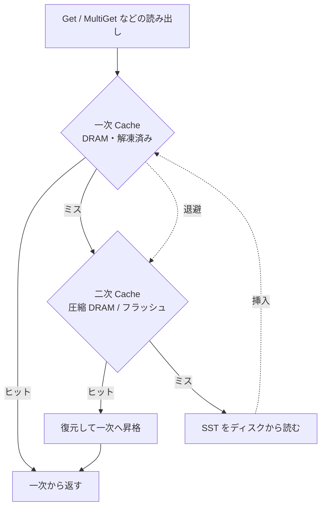

# 第41章 Secondary / Tiered Cache

> **本章で読むソース**
>
> - [`include/rocksdb/secondary_cache.h`](https://github.com/facebook/rocksdb/blob/v11.1.1/include/rocksdb/secondary_cache.h)
> - [`include/rocksdb/advanced_cache.h`](https://github.com/facebook/rocksdb/blob/v11.1.1/include/rocksdb/advanced_cache.h)
> - [`cache/compressed_secondary_cache.h`](https://github.com/facebook/rocksdb/blob/v11.1.1/cache/compressed_secondary_cache.h)
> - [`cache/compressed_secondary_cache.cc`](https://github.com/facebook/rocksdb/blob/v11.1.1/cache/compressed_secondary_cache.cc)
> - [`cache/secondary_cache_adapter.h`](https://github.com/facebook/rocksdb/blob/v11.1.1/cache/secondary_cache_adapter.h)
> - [`cache/secondary_cache_adapter.cc`](https://github.com/facebook/rocksdb/blob/v11.1.1/cache/secondary_cache_adapter.cc)
> - [`cache/tiered_secondary_cache.h`](https://github.com/facebook/rocksdb/blob/v11.1.1/cache/tiered_secondary_cache.h)
> - [`cache/tiered_secondary_cache.cc`](https://github.com/facebook/rocksdb/blob/v11.1.1/cache/tiered_secondary_cache.cc)

## この章の狙い

第39章と第40章で見た一次キャッシュ（DRAM 上の Block Cache）の下に、第二層のキャッシュを差し込む仕組みを読む。
一次から退避される値を二次へ移し、次回の lookup で二次から復元して一次へ戻すことで、SST をディスクから読み直す回数を減らす。
本章では、二次キャッシュのインターフェース、直列化と復元のコールバック、一次キャッシュとの接続、複数段の積み重ねを実コードで追う。

## 前提

- [第39章 LRUCache](39-lru-cache.md)（一次キャッシュの実装の一つ）
- [第40章 HyperClockCache](40-hyperclock-cache.md)（もう一つの一次キャッシュ実装）

一次キャッシュそのものの構造は上記2章で扱う。本章は、その下に二次層を足したときの挙動に絞る。

## 二次キャッシュの位置づけ

一次キャッシュは DRAM 上に解凍済みのブロックオブジェクトを保持する。
容量が足りなくなると、最も使われていないエントリが退避される。
退避されたエントリを次に読むときは、本来なら SST をディスクから読み直すことになる。

二次キャッシュは、この退避と再読み込みの間に第二の層を置く。
一次から落ちる値を二次へ移し、次の lookup で二次から復元して一次へ戻す。
二次層がフラッシュ上にあっても、SST 全体を読み直してブロックを切り出すより安い。
二次層が DRAM 上の圧縮キャッシュであれば、ディスクに触れずに済む。
どちらの構成でも、ディスク I/O を減らして実効ヒット率を押し上げるのが二次キャッシュの目的である。



二次キャッシュのインターフェースは `SecondaryCache` として定義される。
[`include/rocksdb/secondary_cache.h` L82-L117](https://github.com/facebook/rocksdb/blob/v11.1.1/include/rocksdb/secondary_cache.h#L82-L117) を読む。

```cpp
virtual Status Insert(const Slice& key, Cache::ObjectPtr obj,
                      const Cache::CacheItemHelper* helper,
                      bool force_insert) = 0;
// ... (中略) ...
virtual std::unique_ptr<SecondaryCacheResultHandle> Lookup(
    const Slice& key, const Cache::CacheItemHelper* helper,
    Cache::CreateContext* create_context, bool wait, bool advise_erase,
    Statistics* stats, bool& kept_in_sec_cache) = 0;
```

`Insert` は一次から落ちた値を二次へ移す入口である。
呼び出し側が `obj` の所有権を持ち続け、二次キャッシュは `helper` 経由で値を取り出して書き込む。
`Lookup` は一次がミスしたときに二次を引く出口である。
返る `SecondaryCacheResultHandle` は、結果がまだ準備できていない場合がある。
`wait` が `false` のとき、ハンドルは保留状態で返り、後で `Wait()` または `WaitAll()` を呼ぶまで値が確定しない。
この保留状態が非同期 lookup の土台になる。
[`include/rocksdb/secondary_cache.h` L21-L37](https://github.com/facebook/rocksdb/blob/v11.1.1/include/rocksdb/secondary_cache.h#L21-L37) のコメントが、ハンドルの三つの状態（保留、準備完了かつ未発見、準備完了かつ発見）を定義している。

## 直列化と復元のコールバック

一次キャッシュが持つのは解凍済みのオブジェクトであり、ポインタの先に C++ の構造が広がっている。
二次キャッシュへ移すには、これを連続したバイト列に直列化しなければならない。
逆に、二次から戻すときはバイト列からオブジェクトを再構築する。
この変換を担うのが `CacheItemHelper` に束ねられた三つの関数ポインタである。
[`include/rocksdb/advanced_cache.h` L132-L142](https://github.com/facebook/rocksdb/blob/v11.1.1/include/rocksdb/advanced_cache.h#L132-L142) を読む。

```cpp
struct CacheItemHelper {
  // Function for deleting an object on its removal from the Cache.
  DeleterFn del_cb;  // (<- Most performance critical)
  // Next three are used for persisting values as described above.
  // If any is nullptr, then all three should be nullptr and persisting the
  // entry to/from secondary cache is not supported.
  SizeCallback size_cb;
  SaveToCallback saveto_cb;
  CreateCallback create_cb;
```

三つの直列化用コールバックは、いずれかが `nullptr` ならすべて `nullptr` でなければならない。
これにより、二次キャッシュへ保存できるエントリかどうかを `size_cb != nullptr` の一点で判定できる。
判定は `IsSecondaryCacheCompatible()` に集約されている。
[`include/rocksdb/advanced_cache.h` L178-L180](https://github.com/facebook/rocksdb/blob/v11.1.1/include/rocksdb/advanced_cache.h#L178-L180) を引く。

```cpp
inline bool IsSecondaryCacheCompatible() const {
  return size_cb != nullptr;
}
```

各コールバックの役割は定義部のコメントに書かれている。
`SizeCallback` は直列化したときのバイト数を返し、二次キャッシュが領域を確保するのに使う。
[`include/rocksdb/advanced_cache.h` L90-L104](https://github.com/facebook/rocksdb/blob/v11.1.1/include/rocksdb/advanced_cache.h#L90-L104) を読む。

```cpp
using SizeCallback = size_t (*)(ObjectPtr obj);

// The SaveToCallback takes an object pointer and saves the persistable
// data into a buffer. The secondary cache may decide to not store it in a
// contiguous buffer, in which case this callback will be called multiple
// times with increasing offset
using SaveToCallback = Status (*)(ObjectPtr from_obj, size_t from_offset,
                                  size_t length, char* out_buf);
```

`SaveToCallback` はオブジェクトの中身を渡されたバッファへ書き出す。
オフセットを増やしながら複数回呼ばれることがあり、二次キャッシュ側が連続領域を用意できなくても対応できる。
復元側は `CreateCallback` が担う。
[`include/rocksdb/advanced_cache.h` L114-L127](https://github.com/facebook/rocksdb/blob/v11.1.1/include/rocksdb/advanced_cache.h#L114-L127) を読む。

```cpp
using CreateCallback = Status (*)(const Slice& data, CompressionType type,
                                  CacheTier source, CreateContext* context,
                                  MemoryAllocator* allocator,
                                  ObjectPtr* out_obj, size_t* out_charge);
```

`CreateCallback` は二次キャッシュから受け取ったバッファ `data` からオブジェクトを組み立てる。
`type` が圧縮を示していれば、コールバックの中で解凍する。
`context` には DB やカラムファミリー固有の設定（圧縮辞書など）が渡され、復元時に参照される。
これらの関数ポインタが C スタイルなのは意図的である。
キャッシュ内のオブジェクトは親の DB より長く生き残る場合があるため、復元に必要な情報はオブジェクト自身に閉じ込め、ライフサイクル管理を単純にしている。
コメント [`include/rocksdb/advanced_cache.h` L85-L88](https://github.com/facebook/rocksdb/blob/v11.1.1/include/rocksdb/advanced_cache.h#L85-L88) がこの設計意図を述べている。

`CacheItemHelper` には、二次キャッシュ対応版と非対応版を相互に指すポインタ `without_secondary_compat` も持たせてある。
二次から一次へ昇格させたエントリを、二次に残したまま再び二次へ書き戻そうとする無駄を防ぐためである。
[`include/rocksdb/advanced_cache.h` L145-L149](https://github.com/facebook/rocksdb/blob/v11.1.1/include/rocksdb/advanced_cache.h#L145-L149) のコメントがその用途を説明している。

## 一次から二次への退避

一次と二次を束ねるのが `CacheWithSecondaryAdapter` である。
これは `CacheWrapper` を継承し、一次キャッシュ（`target_`）の上に二次キャッシュ（`secondary_cache_`）を重ねる。
[`cache/secondary_cache_adapter.h` L13-L21](https://github.com/facebook/rocksdb/blob/v11.1.1/cache/secondary_cache_adapter.h#L13-L21) を読む。

```cpp
class CacheWithSecondaryAdapter : public CacheWrapper {
 public:
  explicit CacheWithSecondaryAdapter(
      std::shared_ptr<Cache> target,
      std::shared_ptr<SecondaryCache> secondary_cache,
      TieredAdmissionPolicy adm_policy = TieredAdmissionPolicy::kAdmPolicyAuto,
      bool distribute_cache_res = false);
```

退避は一次キャッシュの退避コールバックを通じて起きる。
アダプタは構築時に、一次キャッシュへ自身の `EvictionHandler` を登録する。
[`cache/secondary_cache_adapter.cc` L90-L93](https://github.com/facebook/rocksdb/blob/v11.1.1/cache/secondary_cache_adapter.cc#L90-L93) を引く。

```cpp
target_->SetEvictionCallback(
    [this](const Slice& key, Handle* handle, bool was_hit) {
      return EvictionHandler(key, handle, was_hit);
    });
```

一次キャッシュがエントリを退避させると、このハンドラが呼ばれる。
ハンドラは二次キャッシュ対応のエントリだけを二次へ移す。
[`cache/secondary_cache_adapter.cc` L136-L156](https://github.com/facebook/rocksdb/blob/v11.1.1/cache/secondary_cache_adapter.cc#L136-L156) を読む。

```cpp
bool CacheWithSecondaryAdapter::EvictionHandler(const Slice& key,
                                                Handle* handle, bool was_hit) {
  auto helper = GetCacheItemHelper(handle);
  if (helper->IsSecondaryCacheCompatible() &&
      adm_policy_ != TieredAdmissionPolicy::kAdmPolicyThreeQueue) {
    auto obj = target_->Value(handle);
    // Ignore dummy entry
    if (obj != kDummyObj) {
      bool force = false;
      // ... (中略：admission policy で force を決める) ...
      // Spill into secondary cache.
      secondary_cache_->Insert(key, obj, helper, force).PermitUncheckedError();
    }
  }
  // Never takes ownership of obj
  return false;
}
```

`IsSecondaryCacheCompatible()` が真のときだけ `secondary_cache_->Insert` を呼ぶ。
直列化できないエントリは二次へ移さず、そのまま捨てる。
`kDummyObj` を無視している点も重要で、これは後述する昇格の制御に使うマーカーである。

## 一次ミス時に二次を引く

`Lookup` がミスと昇格の流れの中心である。
まず一次を引き、ミスなら二次を引き、二次でヒットすれば一次へ昇格させる。
[`cache/secondary_cache_adapter.cc` L290-L315](https://github.com/facebook/rocksdb/blob/v11.1.1/cache/secondary_cache_adapter.cc#L290-L315) を読む。

```cpp
Cache::Handle* CacheWithSecondaryAdapter::Lookup(const Slice& key,
                                                 const CacheItemHelper* helper,
                                                 CreateContext* create_context,
                                                 Priority priority,
                                                 Statistics* stats) {
  Handle* result =
      target_->Lookup(key, helper, create_context, priority, stats);
  bool secondary_compatible = helper && helper->IsSecondaryCacheCompatible();
  bool found_dummy_entry =
      ProcessDummyResult(&result, /*erase=*/secondary_compatible);
  if (!result && secondary_compatible) {
    // Try our secondary cache
    bool kept_in_sec_cache = false;
    std::unique_ptr<SecondaryCacheResultHandle> secondary_handle =
        secondary_cache_->Lookup(key, helper, create_context, /*wait*/ true,
                                 found_dummy_entry, stats,
                                 /*out*/ kept_in_sec_cache);
    if (secondary_handle) {
      result = Promote(std::move(secondary_handle), key, helper, priority,
                       stats, found_dummy_entry, kept_in_sec_cache);
    }
  }
  return result;
}
```

一次がヒットすればそのまま返る。
ミスかつ二次対応なら `secondary_cache_->Lookup` を呼び、結果を `Promote` で一次へ昇格させる。
`ProcessDummyResult` は、一次に残ったダミーエントリ（実体のないマーカー）を処理する。
ダミーは「最近この鍵を見た」という履歴を一次側に記録するために置かれ、昇格時の判断材料になる。

昇格の本体が `Promote` である。
[`cache/secondary_cache_adapter.cc` L204-L243](https://github.com/facebook/rocksdb/blob/v11.1.1/cache/secondary_cache_adapter.cc#L204-L243) を読む。

```cpp
// Note: SecondaryCache::Size() is really charge (from the CreateCallback)
size_t charge = secondary_handle->Size();
Handle* result = nullptr;
// Insert into primary cache, possibly as a standalone+dummy entries.
if (secondary_cache_->SupportForceErase() && !found_dummy_entry) {
  // Create standalone and insert dummy
  // Allow standalone to be created even if cache is full, to avoid
  // reading the entry from storage.
  result =
      CreateStandalone(key, obj, helper, charge, /*allow_uncharged*/ true);
  // ... (中略) ...
  // Insert dummy to record recent use
  Status s = Insert(key, kDummyObj, &kNoopCacheItemHelper, /*charge=*/0,
                    /*handle=*/nullptr, priority);
  // ... (中略) ...
} else {
  // Insert regular entry into primary cache.
  // Don't allow it to spill into secondary cache again if it was kept there.
  Status s = Insert(
      key, obj, kept_in_sec_cache ? helper->without_secondary_compat : helper,
      charge, &result, priority);
  // ... (中略) ...
}
```

初回のヒット（ダミーが無い）では、一次にスタンドアロンのハンドルを作り、同時にダミーを挿入する。
二度目のヒット（ダミーが有る）で初めて正規エントリとして一次へ昇格させる。
この二段構えの昇格により、一度しか参照されない値で一次キャッシュを汚さずに済む。
正規挿入のときは、`kept_in_sec_cache` が真なら `helper->without_secondary_compat` を渡す。
二次に残したエントリを一次から再び二次へ書き戻す無駄を、ヘルパーの差し替えで断ち切っている。

### 非同期 lookup でレイテンシを隠す

二次層がフラッシュ上にあると、`Lookup` がストレージ I/O を待つ間ブロックしうる。
そこで `MultiGet` などの一括読み出しでは、二次の lookup を非同期で先に投げておき、待ちを後でまとめる。
入口が `StartAsyncLookup` で、`wait=false` で二次を引いてハンドルを保留のまま受け取る。
[`cache/secondary_cache_adapter.cc` L356-L371](https://github.com/facebook/rocksdb/blob/v11.1.1/cache/secondary_cache_adapter.cc#L356-L371) を読む。

```cpp
void CacheWithSecondaryAdapter::StartAsyncLookupOnMySecondary(
    AsyncLookupHandle& async_handle) {
  // ... (中略) ...
  std::unique_ptr<SecondaryCacheResultHandle> secondary_handle =
      secondary_cache_->Lookup(
          async_handle.key, async_handle.helper, async_handle.create_context,
          /*wait*/ false, async_handle.found_dummy_entry, async_handle.stats,
          /*out*/ async_handle.kept_in_sec_cache);
  if (secondary_handle) {
    async_handle.pending_handle = secondary_handle.release();
    async_handle.pending_cache = secondary_cache_.get();
  }
}
```

保留中のハンドルを溜めておき、後で `WaitAll` がまとめて待つ。
[`cache/secondary_cache_adapter.cc` L446-L465](https://github.com/facebook/rocksdb/blob/v11.1.1/cache/secondary_cache_adapter.cc#L446-L465) を読む。

```cpp
// Wait on all lookups on my secondary cache
{
  std::vector<SecondaryCacheResultHandle*> my_secondary_handles;
  for (AsyncLookupHandle* cur : my_pending) {
    my_secondary_handles.push_back(cur->pending_handle);
  }
  secondary_cache_->WaitAll(std::move(my_secondary_handles));
}

// Process results
for (AsyncLookupHandle* cur : my_pending) {
  std::unique_ptr<SecondaryCacheResultHandle> secondary_handle(
      cur->pending_handle);
  cur->pending_handle = nullptr;
  cur->result_handle = Promote(
      std::move(secondary_handle), cur->key, cur->helper, cur->priority,
      cur->stats, cur->found_dummy_entry, cur->kept_in_sec_cache);
  assert(cur->pending_cache == nullptr);
}
```

複数の鍵の二次 lookup を並行して走らせ、I/O 完了を一度に待つ。
鍵ごとに順番に待つ場合に比べ、フラッシュの読み取り遅延が件数分積み上がらない。
これが二次キャッシュにおける主要な最適化である。
待ちが終わったら、各ハンドルを `Promote` で一次へ昇格させる。

## CompressedSecondaryCache による圧縮二次層

`CompressedSecondaryCache` は、二次層を DRAM 上に置きつつ値を圧縮して保持する `SecondaryCache` の実装である。
解凍済みより小さく持てるので、同じ DRAM 量でより多くのブロックをキャッシュできる。
退避された値を二次へ挿入する経路が `InsertInternal` で、ここで圧縮する。
[`cache/compressed_secondary_cache.cc` L199-L221](https://github.com/facebook/rocksdb/blob/v11.1.1/cache/compressed_secondary_cache.cc#L199-L221) を読む。

```cpp
Status s = (*helper->saveto_cb)(value, 0, data_size_original, data_ptr);
if (!s.ok()) {
  return s;
}

std::unique_ptr<char[]> tagged_compressed_data;
CompressionType to_type = kNoCompression;
if (compressor_ && from_type == kNoCompression &&
    !cache_options_.do_not_compress_roles.Contains(helper->role)) {
  assert(source == CacheTier::kVolatileCompressedTier);
  // ... (中略) ...
  s = compressor_->CompressBlock(Slice(data_ptr, data_size_original),
                                 tagged_compressed_data.get() + kTagSize,
                                 &data_size_compressed, &to_type,
                                 nullptr /*working_area*/);
```

まず `helper->saveto_cb` で一次のオブジェクトをバイト列へ直列化し、続いて `compressor_->CompressBlock` で圧縮する。
圧縮が割に合わなければ（`to_type == kNoCompression`）、原データのまま保持する。
[`cache/compressed_secondary_cache.cc` L224-L226](https://github.com/facebook/rocksdb/blob/v11.1.1/cache/compressed_secondary_cache.cc#L224-L226) がその分岐である。

復元は `Lookup` で行う。
圧縮されていれば解凍してから `create_cb` を呼び、一次が受け取れるオブジェクトに戻す。
[`cache/compressed_secondary_cache.cc` L101-L136](https://github.com/facebook/rocksdb/blob/v11.1.1/cache/compressed_secondary_cache.cc#L101-L136) を読む。

```cpp
if (source == CacheTier::kVolatileCompressedTier) {
  if (type != kNoCompression) {
    Decompressor::Args args;
    args.compressed_data = saved;
    args.compression_type = type;
    Status s = decompressor_->ExtractUncompressedSize(args);
    // ... (中略) ...
    s = decompressor_->DecompressBlock(args, uncompressed.get());
    // ... (中略) ...
    saved = Slice(uncompressed.get(), args.uncompressed_size);
    type = kNoCompression;
    // ... (中略) ...
  }
  // Reduced as if it came from primary cache
  source = CacheTier::kVolatileTier;
}

Cache::ObjectPtr result_value = nullptr;
size_t result_charge = 0;
Status s = helper->create_cb(saved, type, source, create_context,
                             cache_options_.memory_allocator.get(),
                             &result_value, &result_charge);
```

### ダミーによる二度目の参照での昇格

圧縮二次層も、初回の退避ではダミーだけを置く。
[`cache/compressed_secondary_cache.cc` L160-L174](https://github.com/facebook/rocksdb/blob/v11.1.1/cache/compressed_secondary_cache.cc#L160-L174) を読む。

```cpp
bool CompressedSecondaryCache::MaybeInsertDummy(const Slice& key) {
  auto internal_helper = GetHelper(cache_options_.enable_custom_split_merge);
  Cache::Handle* lru_handle = cache_->Lookup(key);
  if (lru_handle == nullptr) {
    PERF_COUNTER_ADD(compressed_sec_cache_insert_dummy_count, 1);
    // Insert a dummy handle if the handle is evicted for the first time.
    cache_->Insert(key, /*obj=*/nullptr, internal_helper, /*charge=*/0)
        .PermitUncheckedError();
    return true;
  } else {
    cache_->Release(lru_handle, /*erase_if_last_ref=*/false);
  }
  return false;
}
```

`Insert` は `force_insert` でなければまず `MaybeInsertDummy` を試す。
[`cache/compressed_secondary_cache.cc` L285-L299](https://github.com/facebook/rocksdb/blob/v11.1.1/cache/compressed_secondary_cache.cc#L285-L299) を引く。

```cpp
if (!force_insert && MaybeInsertDummy(key)) {
  return Status::OK();
}

return InsertInternal(key, value, helper, kNoCompression,
                      CacheTier::kVolatileCompressedTier);
```

初めて退避された鍵にはサイズ 0 のダミーを置くだけで、実データの圧縮も保存もしない。
同じ鍵が二度目に退避されて初めて実体を保存する。
一度退避されただけの値に圧縮コストと容量を割かない作りである。

## TieredSecondaryCache による多段構成

`TieredSecondaryCache` は、圧縮 DRAM 二次層とフラッシュ二次層を縦に積む。
これ自体が `SecondaryCache` を実装するため、`CacheWithSecondaryAdapter` から見れば単一の二次層に見える。
[`cache/tiered_secondary_cache.h` L26-L37](https://github.com/facebook/rocksdb/blob/v11.1.1/cache/tiered_secondary_cache.h#L26-L37) を読む。

```cpp
class TieredSecondaryCache : public SecondaryCacheWrapper {
 public:
  TieredSecondaryCache(std::shared_ptr<SecondaryCache> comp_sec_cache,
                       std::shared_ptr<SecondaryCache> nvm_sec_cache,
                       TieredAdmissionPolicy adm_policy)
      : SecondaryCacheWrapper(comp_sec_cache), nvm_sec_cache_(nvm_sec_cache) {
```

`Lookup` はまず圧縮二次層（`target()`）を引き、ミスならフラッシュ二次層（`nvm_sec_cache_`）へ降りる。
[`cache/tiered_secondary_cache.cc` L48-L78](https://github.com/facebook/rocksdb/blob/v11.1.1/cache/tiered_secondary_cache.cc#L48-L78) を読む。

```cpp
std::unique_ptr<SecondaryCacheResultHandle> TieredSecondaryCache::Lookup(
    const Slice& key, const Cache::CacheItemHelper* helper,
    Cache::CreateContext* create_context, bool wait, bool advise_erase,
    Statistics* stats, bool& kept_in_sec_cache) {
  bool dummy = false;
  std::unique_ptr<SecondaryCacheResultHandle> result =
      target()->Lookup(key, helper, create_context, wait, advise_erase, stats,
                       /*kept_in_sec_cache=*/dummy);
  // We never want the item to spill back into the secondary cache
  kept_in_sec_cache = true;
  if (result) {
    assert(result->IsReady());
    return result;
  }

  // ... (中略) ...
  if (wait) {
    TieredSecondaryCache::CreateContext ctx;
    // ... (中略：ctx を組み立てる) ...
    ctx.comp_sec_cache = target();
    ctx.stats = stats;

    return nvm_sec_cache_->Lookup(key, outer_helper, &ctx, wait, advise_erase,
                                  stats, kept_in_sec_cache);
  }
```

フラッシュ層を引くとき、上位の `create_cb` を `MaybeInsertAndCreate` でくるんで渡す。
フラッシュ層でヒットした圧縮ブロックを、復元のついでに圧縮 DRAM 層へ昇格させるためである。
[`cache/tiered_secondary_cache.cc` L22-L42](https://github.com/facebook/rocksdb/blob/v11.1.1/cache/tiered_secondary_cache.cc#L22-L42) を読む。

```cpp
Status TieredSecondaryCache::MaybeInsertAndCreate(
    const Slice& data, CompressionType type, CacheTier source,
    Cache::CreateContext* ctx, MemoryAllocator* allocator,
    Cache::ObjectPtr* out_obj, size_t* out_charge) {
  TieredSecondaryCache::CreateContext* context =
      static_cast<TieredSecondaryCache::CreateContext*>(ctx);
  assert(source == CacheTier::kVolatileTier);
  if (!context->advise_erase && type != kNoCompression) {
    // Attempt to insert into compressed secondary cache
    context->comp_sec_cache->InsertSaved(*context->key, data, type, source)
        .PermitUncheckedError();
    RecordTick(context->stats, COMPRESSED_SECONDARY_CACHE_PROMOTIONS);
  } else {
    RecordTick(context->stats, COMPRESSED_SECONDARY_CACHE_PROMOTION_SKIPS);
  }
  // Primary cache will accept the object, so call its helper to create
  // the object
  return context->helper->create_cb(data, type, source, context->inner_ctx,
                                    allocator, out_obj, out_charge);
}
```

`InsertSaved` は圧縮済みのバイト列を再圧縮せずにそのまま受け取る。
フラッシュ層から取り出した圧縮ブロックを、DRAM 層へ移すときに展開と再圧縮を繰り返さずに済ませる経路である。
復元処理（`create_cb`）に昇格処理（`InsertSaved`）を相乗りさせることで、フラッシュ I/O 一回ぶんの読み取りデータを二つの用途に使い回している。
非同期 lookup のときは、フラッシュ層のハンドルを `ResultHandle` でくるみ、`WaitAll` でまとめて待つ。
[`cache/tiered_secondary_cache.cc` L103-L123](https://github.com/facebook/rocksdb/blob/v11.1.1/cache/tiered_secondary_cache.cc#L103-L123) がその処理である。

## 実効ヒット率とコストのトレードオフ

二次キャッシュは追加の計算とメモリを要求する。
圧縮二次層は退避時の圧縮と lookup 時の解凍に CPU を使う。
フラッシュ二次層は lookup でストレージ I/O を待つ。
それでも採用するのは、SST をディスクから読み直すコストの方が高いからである。
二度目の参照でしか昇格しないダミーの仕組みは、この追加コストを「実際に再利用される値」だけに絞り込む。

容量配分も調整できる。
`NewTieredCache` は、全体の容量を一次と圧縮二次へ `compressed_secondary_ratio` で配分し、フラッシュ層があれば三段に積む。
[`cache/secondary_cache_adapter.cc` L709-L726](https://github.com/facebook/rocksdb/blob/v11.1.1/cache/secondary_cache_adapter.cc#L709-L726) を読む。

```cpp
std::shared_ptr<SecondaryCache> sec_cache;
opts.comp_cache_opts.capacity = static_cast<size_t>(
    opts.total_capacity * opts.compressed_secondary_ratio);
sec_cache = NewCompressedSecondaryCache(opts.comp_cache_opts);

if (opts.nvm_sec_cache) {
  if (opts.adm_policy == TieredAdmissionPolicy::kAdmPolicyThreeQueue) {
    sec_cache = std::make_shared<TieredSecondaryCache>(
        sec_cache, opts.nvm_sec_cache,
        TieredAdmissionPolicy::kAdmPolicyThreeQueue);
  } else {
    return nullptr;
  }
}

return std::make_shared<CacheWithSecondaryAdapter>(
    cache, sec_cache, opts.adm_policy, /*distribute_cache_res=*/true);
```

圧縮二次層の比率を上げれば、より多くのブロックを DRAM に保持できる代わりに、解凍済みで持てる一次の容量が減る。
ワークロードの再利用パターンに応じて、この比率と段数を選ぶことになる。

Block Cache を読み出し経路でどう引くかは[第16章 BlockBasedTableReader](../part03-sst/16-block-based-table-reader.md)で扱う。

## まとめ

- 二次キャッシュは一次（DRAM の Block Cache）の下に置く第二層で、退避された値を受け取り、次の lookup で復元して一次へ昇格させ、ディスク I/O を減らす。
- 一次のオブジェクトと二次のバイト列の変換は、`CacheItemHelper` の `size_cb` / `saveto_cb` / `create_cb` の三つで行う。三つが揃っているかどうかが二次保存可否の判定（`IsSecondaryCacheCompatible()`）になる。
- `CacheWithSecondaryAdapter` が一次の退避コールバックで二次へ移し、一次ミス時に二次を引いて `Promote` で昇格させる。初回の参照ではダミーを置き、二度目で正規昇格する。
- 非同期 lookup（`StartAsyncLookup` と `WaitAll`）で複数鍵のフラッシュ読み取りを並行させ、待ちをまとめてレイテンシを隠す。
- `CompressedSecondaryCache` は二次層で値を圧縮して保持し、同じ DRAM でより多くのブロックを抱える。
- `TieredSecondaryCache` は圧縮 DRAM 層とフラッシュ層を縦に積み、フラッシュからの復元時に圧縮 DRAM 層へ相乗りで昇格させる。

## 関連する章

- [第39章 LRUCache](39-lru-cache.md)
- [第40章 HyperClockCache](40-hyperclock-cache.md)
- [第16章 BlockBasedTableReader](../part03-sst/16-block-based-table-reader.md)
- [第42章 メモリ管理とアリーナ](42-memory-arena.md)
