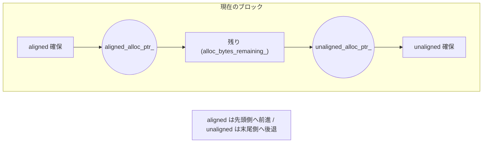
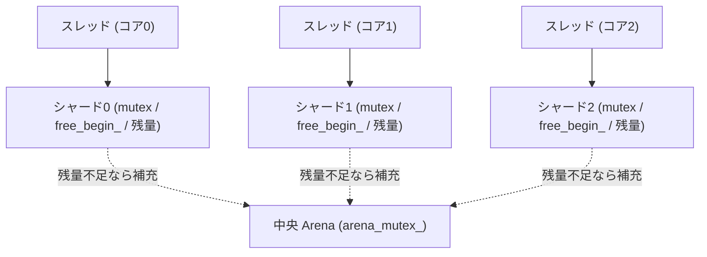

# 第42章 メモリ割り当てとアリーナ

> **本章で読むソース**
>
> - [`memory/allocator.h`](https://github.com/facebook/rocksdb/blob/v11.1.1/memory/allocator.h)
> - [`memory/arena.h`](https://github.com/facebook/rocksdb/blob/v11.1.1/memory/arena.h)
> - [`memory/arena.cc`](https://github.com/facebook/rocksdb/blob/v11.1.1/memory/arena.cc)
> - [`memory/concurrent_arena.h`](https://github.com/facebook/rocksdb/blob/v11.1.1/memory/concurrent_arena.h)
> - [`memory/concurrent_arena.cc`](https://github.com/facebook/rocksdb/blob/v11.1.1/memory/concurrent_arena.cc)
> - [`include/rocksdb/memory_allocator.h`](https://github.com/facebook/rocksdb/blob/v11.1.1/include/rocksdb/memory_allocator.h)

## この章の狙い

MemTable は、書き込みのたびにノードや内部キーといった小さなメモリ片を大量に確保する。
本章では、その確保を一手に引き受ける `Arena` が、個別の `malloc`/`free` を避けてポインタを進めるだけで領域を切り出すバンプアロケータであること、寿命の尽きた領域を破棄時に一括解放することを読む。
さらに、並行書き込みで複数スレッドが同時に確保するときに中央ロックの競合を避ける `ConcurrentArena` の仕組みと、Block Cache の確保点に外部のアロケータを差し込む `MemoryAllocator` の役割を確認する。

## 前提

本章で扱う `Arena` の主な利用者は MemTable である。
MemTable がキーを格納する `InlineSkipList` のノードを `Arena` から切り出す経路は、[第11章 MemTable と InlineSkipList](../part02-write-path/11-memtable-skiplist.md)で説明した。
複数の書き手が同じ MemTable へ並行に挿入する経路は[第9章 WriteThread](../part02-write-path/09-write-thread.md)に由来する。
本章の後半でこの経路と結ぶ。
読み取り時にイテレータが一時領域を `Arena` から確保する話は[第26章 イテレータ](../part04-read-path/26-iterators.md)で扱った。

## Allocator という契約

メモリの確保方法を抽象化する契約が `Allocator` である。
`memory/allocator.h` の冒頭コメントは、この抽象が「ブロック単位でメモリを確保し、アロケータ自身が破棄されるときにまとめて解放する」ものだと述べている。

[`memory/allocator.h` L10-L11](https://github.com/facebook/rocksdb/blob/v11.1.1/memory/allocator.h#L10-L11)

```cpp
// Abstract interface for allocating memory in blocks. This memory is freed
// when the allocator object is destroyed. See the Arena class for more info.
```

契約そのものは三つの純粋仮想関数だけからなる。
任意サイズを確保する `Allocate`、アラインメントを揃えて確保する `AllocateAligned`、そしてブロックの大きさを返す `BlockSize` である。

[`memory/allocator.h` L23-L32](https://github.com/facebook/rocksdb/blob/v11.1.1/memory/allocator.h#L23-L32)

```cpp
class Allocator {
 public:
  virtual ~Allocator() {}

  virtual char* Allocate(size_t bytes) = 0;
  virtual char* AllocateAligned(size_t bytes, size_t huge_page_size = 0,
                                Logger* logger = nullptr) = 0;

  virtual size_t BlockSize() const = 0;
};
```

個別の解放関数が契約に存在しない点が、この抽象の性格を決めている。
確保した領域は呼び出し側が一つずつ返すのではなく、アロケータの寿命が尽きたときに全体がまとめて解放される。
本章の主役である `Arena` と `ConcurrentArena` はどちらもこの `Allocator` を実装する。

## Arena はブロックを切り出すバンプアロケータ

`Arena` は、あらかじめ確保した大きなブロックの中をポインタを進めるだけで切り出すアロケータである。
`memory/arena.h` の冒頭コメントが、小さな要求には定義済みのブロックサイズで一塊を確保し、大きな要求には `malloc` で要求どおりの大きさを直接取ると述べている。

[`memory/arena.h` L10-L12](https://github.com/facebook/rocksdb/blob/v11.1.1/memory/arena.h#L10-L12)

```cpp
// Arena is an implementation of Allocator class. For a request of small size,
// it allocates a block with pre-defined block size. For a request of big
// size, it uses malloc to directly get the requested size.
```

`Arena` が現在のブロックについて保持する状態は、ポインタ二つと残量一つに尽きる。
アラインメント済みの確保が進む `aligned_alloc_ptr_`、アラインメントを問わない確保が進む `unaligned_alloc_ptr_`、そして今のブロックに残っているバイト数 `alloc_bytes_remaining_` である。

[`memory/arena.h` L100-L108](https://github.com/facebook/rocksdb/blob/v11.1.1/memory/arena.h#L100-L108)

```cpp
  // Stats for current active block.
  // For each block, we allocate aligned memory chucks from one end and
  // allocate unaligned memory chucks from the other end. Otherwise the
  // memory waste for alignment will be higher if we allocate both types of
  // memory from one direction.
  char* unaligned_alloc_ptr_ = nullptr;
  char* aligned_alloc_ptr_ = nullptr;
  // How many bytes left in currently active block?
  size_t alloc_bytes_remaining_ = 0;
```

一つのブロックの両端から確保する設計には理由がある。
アラインメントの要求がある確保はブロックの先頭側から、要求がない確保は末尾側から進める。
両者を同じ向きから取ると、アラインメントのためにブロックの途中へ詰め物（パディング）を入れる回数が増え、その分の無駄が積み上がる。
端を分けることで、パディングは先頭側でだけ発生し、末尾側の確保はパディングを生まない。

確保の本体は `Allocate` のインライン実装にある。
要求が残量に収まる限り、末尾側のポインタを要求分だけ手前へ動かし、残量を減らし、動かしたあとのポインタをそのまま返す。

[`memory/arena.h` L122-L133](https://github.com/facebook/rocksdb/blob/v11.1.1/memory/arena.h#L122-L133)

```cpp
inline char* Arena::Allocate(size_t bytes) {
  // The semantics of what to return are a bit messy if we allow
  // 0-byte allocations, so we disallow them here (we don't need
  // them for our internal use).
  assert(bytes > 0);
  if (bytes <= alloc_bytes_remaining_) {
    unaligned_alloc_ptr_ -= bytes;
    alloc_bytes_remaining_ -= bytes;
    return unaligned_alloc_ptr_;
  }
  return AllocateFallback(bytes, false /* unaligned */);
}
```

確保がポインタの加減算と残量の引き算だけで済む点が、`Arena` が速い第一の理由である。
`malloc` は要求のたびに空き領域の探索やメタデータの更新を行い、`free` はそれを巻き戻す。
`Arena` はこの管理を一切持たず、確保はポインタを進める一手、解放はブロックをまとめて返す一手で完結する。
一つずつ解放できない代わりに、確保あたりの命令数と解放の回数を極小に抑えている。



### アラインメント確保と端数の埋め合わせ

`AllocateAligned` は、返すアドレスを `kAlignUnit` の倍数に揃える。
`kAlignUnit` は `std::max_align_t` のアラインメント、すなわちその環境であらゆる型を安全に置ける境界である。

[`memory/arena.h` L35-L37](https://github.com/facebook/rocksdb/blob/v11.1.1/memory/arena.h#L35-L37)

```cpp
  static constexpr unsigned kAlignUnit = alignof(std::max_align_t);
  static_assert((kAlignUnit & (kAlignUnit - 1)) == 0,
                "Pointer size should be power of 2");
```

揃え方は、現在の先頭ポインタが境界からどれだけずれているか（`current_mod`）を求め、その分を埋める端数（`slop`）を要求に上乗せするだけである。
端数込みの必要量が残量に収まれば、先頭ポインタを端数分だけ進めた位置を返し、ポインタと残量を必要量分だけ更新する。
収まらなければ後述の `AllocateFallback` に回し、そこからは常に境界の揃ったアドレスが返る。

[`memory/arena.cc` L128-L142](https://github.com/facebook/rocksdb/blob/v11.1.1/memory/arena.cc#L128-L142)

```cpp
  size_t current_mod =
      reinterpret_cast<uintptr_t>(aligned_alloc_ptr_) & (kAlignUnit - 1);
  size_t slop = (current_mod == 0 ? 0 : kAlignUnit - current_mod);
  size_t needed = bytes + slop;
  char* result;
  if (needed <= alloc_bytes_remaining_) {
    result = aligned_alloc_ptr_ + slop;
    aligned_alloc_ptr_ += needed;
    alloc_bytes_remaining_ -= needed;
  } else {
    // AllocateFallback always returns aligned memory
    result = AllocateFallback(bytes, true /* aligned */);
  }
  assert((reinterpret_cast<uintptr_t>(result) & (kAlignUnit - 1)) == 0);
  return result;
```

## ブロックの補充と大きな要求の扱い

残量で足りなくなったときに走るのが `AllocateFallback` である。
ここには、ブロックの端数をどう扱うかという判断が二つ入っている。

[`memory/arena.cc` L63-L93](https://github.com/facebook/rocksdb/blob/v11.1.1/memory/arena.cc#L63-L93)

```cpp
char* Arena::AllocateFallback(size_t bytes, bool aligned) {
  if (bytes > kBlockSize / 4) {
    ++irregular_block_num;
    // Object is more than a quarter of our block size.  Allocate it separately
    // to avoid wasting too much space in leftover bytes.
    return AllocateNewBlock(bytes);
  }

  // We waste the remaining space in the current block.
  size_t size = 0;
  char* block_head = nullptr;
  if (MemMapping::kHugePageSupported && hugetlb_size_ > 0) {
    size = hugetlb_size_;
    block_head = AllocateFromHugePage(size);
  }
  if (!block_head) {
    size = kBlockSize;
    block_head = AllocateNewBlock(size);
  }
  alloc_bytes_remaining_ = size - bytes;
  // ... (中略) ...
}
```

第一の判断は、要求がブロックサイズの四分の一を超えるかどうかである。
超える要求は、その要求と同じ大きさの専用ブロックを `AllocateNewBlock` で確保して返す（コメントの言う irregular block）。
標準ブロックに無理に押し込むと、押し込んだあとに残る端数が大きくなり、その端数が二度と使われずに無駄になる。
専用ブロックに逃がすことで、標準ブロックの端数の浪費を避けている。

第二の判断は、四分の一以下の要求に対するブロックの補充である。
新しい標準ブロックを一つ確保し、現在のブロックに残っていた端数はそのまま捨てる（コメントの `We waste the remaining space`）。
端数を追いかけて再利用するより、ブロック一つ分の補充で割り切るほうが、確保あたりの手数を一定に保てる。

ブロックの大きさ `kBlockSize` は、利用側が渡した値を `OptimizeBlockSize` で整えた結果である。
`[kMinBlockSize, kMaxBlockSize]`（4 KiB 以上、2 GiB 以下）の範囲に収め、さらに `kAlignUnit` の倍数へ切り上げる。

[`memory/arena.cc` L23-L34](https://github.com/facebook/rocksdb/blob/v11.1.1/memory/arena.cc#L23-L34)

```cpp
size_t Arena::OptimizeBlockSize(size_t block_size) {
  // Make sure block_size is in optimal range
  block_size = std::max(Arena::kMinBlockSize, block_size);
  block_size = std::min(Arena::kMaxBlockSize, block_size);

  // make sure block_size is the multiple of kAlignUnit
  if (block_size % kAlignUnit != 0) {
    block_size = (1 + block_size / kAlignUnit) * kAlignUnit;
  }

  return block_size;
}
```

実際にブロックを確保するのは `AllocateNewBlock` である。
`new char[]` で生のバイト列を取り、その所有権を `blocks_` という `std::deque` に `unique_ptr` として積む。

[`memory/arena.cc` L145-L149](https://github.com/facebook/rocksdb/blob/v11.1.1/memory/arena.cc#L145-L149)

```cpp
char* Arena::AllocateNewBlock(size_t block_bytes) {
  // NOTE: std::make_unique zero-initializes the block so is not appropriate
  // here
  char* block = new char[block_bytes];
  blocks_.push_back(std::unique_ptr<char[]>(block));
```

`std::make_unique` をあえて使わない理由が、直前のコメントに記されている。
`std::make_unique` は領域をゼロ初期化するが、`Arena` の返す領域はこのあと利用側が上書きするため、ゼロ初期化はそのまま無駄になる。
生の `new char[]` で初期化を省く分だけ、ブロック確保が軽い。

確保したブロックを `blocks_` が `unique_ptr` で所有するという形が、一括解放の核である。
`Arena` のメンバ宣言を見ると、標準ブロックの列 `blocks_` と huge page のブロック列 `huge_blocks_` が並ぶ。

[`memory/arena.h` L94-L97](https://github.com/facebook/rocksdb/blob/v11.1.1/memory/arena.h#L94-L97)

```cpp
  // Allocated memory blocks
  std::deque<std::unique_ptr<char[]>> blocks_;
  // Huge page allocations
  std::deque<MemMapping> huge_blocks_;
```

`Arena` が破棄されると、この二つのコンテナのデストラクタが走り、保持していたブロックがすべて解放される。
個々の確保を `free` で返す処理はどこにも要らない。
これが `Arena` の速さの第二の側面である。
解放のコストが、確保した小片の数ではなく、確保したブロックの数だけで決まる。

### huge page の利用

`hugetlb_size_` が設定され、環境が huge page を支えるなら、ブロックの確保はまず huge page TLB から試みる（前掲 `AllocateFallback` の `AllocateFromHugePage`）。
huge page は一枚あたりの仮想ページが大きいため、TLB のエントリ一つでより広い範囲を覆える。
MemTable のように一塊を広く使う用途では、ページウォークと TLB ミスが減る。
huge page の確保は失敗しうるので、その場合は通常の `new char[]` によるブロックへ落ちる。

[`memory/arena.cc` L95-L106](https://github.com/facebook/rocksdb/blob/v11.1.1/memory/arena.cc#L95-L106)

```cpp
char* Arena::AllocateFromHugePage(size_t bytes) {
  MemMapping mm = MemMapping::AllocateHuge(bytes);
  auto addr = static_cast<char*>(mm.Get());
  if (addr) {
    huge_blocks_.push_back(std::move(mm));
    blocks_memory_ += bytes;
    if (tracker_ != nullptr) {
      tracker_->Allocate(bytes);
    }
  }
  return addr;
}
```

## ConcurrentArena はシャードで競合を避ける

`Arena` 自体はスレッド安全ではない。
バンプポインタと残量を複数スレッドが同時に書き換えれば壊れる。
並行書き込みで複数の書き手が同じ MemTable へ挿入する局面では、確保もまた並行になる。
ここを受け持つのが `ConcurrentArena` である。

設計の意図はクラスのコメントに書かれている。
`Arena` を高速なスピンロックでスレッド安全に包み、加えて小さな確保のためにコアローカルの確保キャッシュ（シャード）を持つ。
シャードは小さく保ち、並行利用を実際に観測したときだけ遅延生成し、補充は中央 `Arena` のブロックに対して断片化が出ないよう大きさを合わせる。

[`memory/concurrent_arena.h` L35-L41](https://github.com/facebook/rocksdb/blob/v11.1.1/memory/concurrent_arena.h#L35-L41)

```cpp
// ConcurrentArena wraps an Arena.  It makes it thread safe using a fast
// inlined spinlock, and adds small per-core allocation caches to avoid
// contention for small allocations.  To avoid any memory waste from the
// per-core shards, they are kept small, they are lazily instantiated
// only if ConcurrentArena actually notices concurrent use, and they
// adjust their size so that there is no fragmentation waste when the
// shard blocks are allocated from the underlying main arena.
```

シャードは `Shard` 構造体で、自前のスピンロック `mutex`、切り出しの先頭ポインタ `free_begin_`、未使用残量 `allocated_and_unused_` を持つ。
冒頭の `padding[40]` は、隣り合うシャードが同じキャッシュラインに載って互いの更新を打ち消し合うフォルスシェアリングを避けるための詰め物である。

[`memory/concurrent_arena.h` L92-L99](https://github.com/facebook/rocksdb/blob/v11.1.1/memory/concurrent_arena.h#L92-L99)

```cpp
  struct Shard {
    char padding[40] ROCKSDB_FIELD_UNUSED;
    mutable SpinMutex mutex;
    char* free_begin_;
    std::atomic<size_t> allocated_and_unused_;

    Shard() : free_begin_(nullptr), allocated_and_unused_(0) {}
  };
```

確保の本体 `AllocateImpl` は、まず中央 `Arena` へ直行できる場合を選り分ける。
要求がシャードブロックの四分の一を超えるとき、huge page を要求して `force_arena` が立つとき、あるいはまだ一度もシャードを引き直しておらず（`tls_cpuid == 0`）コア 0 のシャードが空で中央ロックが待たずに取れるとき、この三つのいずれかなら中央 `Arena` から確保する。
このふるい分けによって、並行が実際に役立つ場面以外では並行化による断片化の代償がゼロに保たれる。

[`memory/concurrent_arena.h` L128-L148](https://github.com/facebook/rocksdb/blob/v11.1.1/memory/concurrent_arena.h#L128-L148)

```cpp
  template <typename Func>
  char* AllocateImpl(size_t bytes, bool force_arena, const Func& func) {
    size_t cpu;

    // Go directly to the arena if the allocation is too large, or if
    // we've never needed to Repick() and the arena mutex is available
    // with no waiting.  This keeps the fragmentation penalty of
    // concurrency zero unless it might actually confer an advantage.
    std::unique_lock<SpinMutex> arena_lock(arena_mutex_, std::defer_lock);
    if (bytes > shard_block_size_ / 4 || force_arena ||
        ((cpu = tls_cpuid) == 0 &&
         !shards_.AccessAtCore(0)->allocated_and_unused_.load(
             std::memory_order_relaxed) &&
         arena_lock.try_lock())) {
      if (!arena_lock.owns_lock()) {
        arena_lock.lock();
      }
      auto rv = func();
      Fixup();
      return rv;
    }
```

直行の条件に外れたときが、シャードからの確保である。
スレッドの `tls_cpuid` からシャードを一つ選び、そのロックを試みる。
取れなければ別のシャードを引き直す（`Repick`）。
他スレッドが同じシャードを掴んでいたら別のシャードへ移ることで、複数スレッドが同一のロックで待ち合う事態を避ける。

[`memory/concurrent_arena.h` L150-L156](https://github.com/facebook/rocksdb/blob/v11.1.1/memory/concurrent_arena.h#L150-L156)

```cpp
    // pick a shard from which to allocate
    Shard* s = shards_.AccessAtCore(cpu & (shards_.Size() - 1));
    if (!s->mutex.try_lock()) {
      s = Repick();
      s->mutex.lock();
    }
    std::unique_lock<SpinMutex> lock(s->mutex, std::adopt_lock);
```

ここに `ConcurrentArena` の競合回避の核がある。
中央 `Arena` を直接叩けば、確保のたびに全スレッドが一つのロックを奪い合う。
シャードへ確保を分散させると、別々のコアで走るスレッドは別々のシャードロックを取るため、ロックの奪い合いがコア数の分だけ薄まる。
中央ロックを握るのはシャードを補充するときだけになり、頻度が確保ごとから補充ごとへ下がる。



シャードの残量が要求に足りないときだけ、中央 `Arena` から補充する。
補充は要求した一片分ではなく、シャードブロックひとまとめで取り、以後の確保はそのブロックの中から切り出す。
補充量は中央 `Arena` の現在ブロックの残量に合わせて調整する。
残量がシャードブロックの半分以上で二倍未満なら、その残量ちょうどを取って中央ブロックを使い切り、断片化を避ける。
それ以外はシャードブロックの大きさを取る。

[`memory/concurrent_arena.h` L159-L187](https://github.com/facebook/rocksdb/blob/v11.1.1/memory/concurrent_arena.h#L159-L187)

```cpp
    if (avail < bytes) {
      // reload
      std::lock_guard<SpinMutex> reload_lock(arena_mutex_);

      // If the arena's current block is within a factor of 2 of the right
      // size, we adjust our request to avoid arena waste.
      auto exact = arena_allocated_and_unused_.load(std::memory_order_relaxed);
      assert(exact == arena_.AllocatedAndUnused());

      if (exact >= bytes && arena_.IsInInlineBlock()) {
        // If we haven't exhausted arena's inline block yet, allocate from arena
        // ... (中略) ...
        auto rv = func();
        Fixup();
        return rv;
      }

      avail = exact >= shard_block_size_ / 2 && exact < shard_block_size_ * 2
                  ? exact
                  : shard_block_size_;
      s->free_begin_ = arena_.AllocateAligned(avail);
      Fixup();
    }
```

補充のときも、中央 `Arena` がまだインラインブロック（`Arena` がブロックを一つも確保していない初期状態の固定領域）を使い切っていなければ、シャードに大きく取らせず中央から直接確保する。
コメントが述べるとおり、空に近い MemTable のために数 MB のブロックを丸ごと割り当てるのを防ぐ意図である。
空の MemTable が数千個ある状況で、それぞれがシャードブロックを抱え込めば、見合わない量のメモリを食う。

シャードブロックの大きさは、中央ブロックの八分の一を `kMaxShardBlockSize`（128 KiB）で頭打ちにした値である。

[`memory/concurrent_arena.cc` L21-L35](https://github.com/facebook/rocksdb/blob/v11.1.1/memory/concurrent_arena.cc#L21-L35)

```cpp
namespace {
// If the shard block size is too large, in the worst case, every core
// allocates a block without populate it. If the shared block size is
// 1MB, 64 cores will quickly allocate 64MB, and may quickly trigger a
// flush. Cap the size instead.
const size_t kMaxShardBlockSize = size_t{128 * 1024};
}  // namespace

ConcurrentArena::ConcurrentArena(size_t block_size, AllocTracker* tracker,
                                 size_t huge_page_size)
    : shard_block_size_(std::min(kMaxShardBlockSize, block_size / 8)),
      shards_(),
      arena_(block_size, tracker, huge_page_size) {
  Fixup();
}
```

上限を置く理由はコメントどおりである。
シャードブロックが大きすぎると、最悪のとき全コアがブロックを取って使い切らないまま抱える。
1 MB のシャードブロックでは 64 コアが瞬時に 64 MB を確保し、フラッシュを早く誘発しかねない。

MemTable はこの `ConcurrentArena` をそのままメンバに持つ（[第11章 MemTable と InlineSkipList](../part02-write-path/11-memtable-skiplist.md)で見た `ConcurrentArena arena_`）。
並行書き込みの書き手が増えるほど、確保はシャードに分散して中央ロックの奪い合いが薄まる。
この経路の上流は[第9章 WriteThread](../part02-write-path/09-write-thread.md)で扱う書き込みグループである。

## カスタムアロケータの差し込み点

`Arena` が MemTable の内部割り当てを担うのに対し、Block Cache が保持するブロックの確保には別の差し込み口がある。
それが `MemoryAllocator` である。
クライアントが確保と解放の方法を自分で実装して供給できる契約で、すべてのメソッドはスレッド安全であることを求められる。

[`include/rocksdb/memory_allocator.h` L15-L30](https://github.com/facebook/rocksdb/blob/v11.1.1/include/rocksdb/memory_allocator.h#L15-L30)

```cpp
// MemoryAllocator is an interface that a client can implement to supply custom
// memory allocation and deallocation methods. See rocksdb/cache.h for more
// information.
// All methods should be thread-safe.
class MemoryAllocator : public Customizable {
 public:
  static const char* Type() { return "MemoryAllocator"; }
  static Status CreateFromString(const ConfigOptions& options,
                                 const std::string& value,
                                 std::shared_ptr<MemoryAllocator>* result);

  // Allocate a block of at least size. Has to be thread-safe.
  virtual void* Allocate(size_t size) = 0;

  // Deallocate previously allocated block. Has to be thread-safe.
  virtual void Deallocate(void* p) = 0;
```

`Arena` と違い、`MemoryAllocator` は `Allocate` と対になる `Deallocate` を持つ。
Block Cache のブロックは一つずつ寿命が異なり、退避のたびに個別に返す必要があるためである。
`Arena` のように寿命をまとめて切れない確保には、個別解放のある契約が要る。

RocksDB が標準で提供する実装が `JemallocNodumpAllocator` である。
jemalloc 専用のアリーナを一つ作り、その確保をすべて同じアリーナに通す。
さらに `madvise()` に `MADV_DONTDUMP` を渡し、Block Cache の領域をコアダンプから除外する。

[`include/rocksdb/memory_allocator.h` L70-L82](https://github.com/facebook/rocksdb/blob/v11.1.1/include/rocksdb/memory_allocator.h#L70-L82)

```cpp
// Implementation details:
// The JemallocNodumpAllocator creates a dedicated jemalloc arena, and all
// allocations of the JemallocNodumpAllocator are through the same arena.
// The memory allocator hooks memory allocation of the arena, and calls
// madvise() with MADV_DONTDUMP flag to exclude the piece of memory from
// core dump. Side benefit of using single arena would be reduction of jemalloc
// metadata for some workloads.
//
// To mitigate mutex contention for using one single arena (see also
// `JemallocAllocatorOptions::num_arenas` above), jemalloc tcache
// (thread-local cache) is enabled to cache unused allocations for future use.
// The tcache normally incurs 0.5M extra memory usage per-thread. The usage
// can be reduced by limiting allocation sizes to cache.
```

単一アリーナに集約すると、jemalloc のメタデータが減る一方、そのアリーナのミューテックスに競合が集まる。
ここでも競合の緩和は `ConcurrentArena` と同じ発想で行う。
jemalloc のスレッドローカルキャッシュ（tcache）を有効にし、未使用の確保をスレッドごとに手元へ貯めて再利用させる。
tcache はスレッドあたり 0.5 MB ほどの追加メモリを使うため、キャッシュするサイズの範囲を `limit_tcache_size` などで絞れる。

[`include/rocksdb/memory_allocator.h` L42-L63](https://github.com/facebook/rocksdb/blob/v11.1.1/include/rocksdb/memory_allocator.h#L42-L63)

```cpp
struct JemallocAllocatorOptions {
  static const char* kName() { return "JemallocAllocatorOptions"; }
  // ... (中略) ...
  bool limit_tcache_size = false;

  // Lower bound of allocation size to use tcache, if limit_tcache_size=true.
  // ... (中略) ...
  size_t tcache_size_lower_bound = 1024;

  // Upper bound of allocation size to use tcache, if limit_tcache_size=true.
  // ... (中略) ...
  size_t tcache_size_upper_bound = 16 * 1024;

  // Number of arenas across which we spread allocation requests. Increasing
  // this setting can mitigate arena mutex contention. The value must be
  // positive.
  size_t num_arenas = 1;
};
```

## まとめ

- `Arena` は、大きなブロックの中をポインタの加減算だけで切り出すバンプアロケータである。
  確保は一手で済み、`malloc` のような空き探索とメタデータ更新を持たない。
- 個別の `free` を行わず、`Arena` の破棄時に `blocks_` と `huge_blocks_` の `unique_ptr` が一括解放する。
  解放のコストは小片の数ではなくブロックの数で決まる。
- ブロックは両端から確保し、アラインメント要求のある確保とない確保を分けてパディングの無駄を抑える。
  ブロックの四分の一を超える要求は専用ブロックに逃がし、端数の浪費を避ける。
- `ConcurrentArena` はコアローカルのシャードへ確保を分散させ、別々のコアが別々のシャードロックを取ることで中央ロックの奪い合いを薄める。
  中央 `Arena` を握るのはシャードの補充時だけである。
- シャードブロックの大きさは中央ブロックの八分の一を 128 KiB で頭打ちにし、多コアでのブロック抱え込みによる過剰確保とフラッシュの早期誘発を防ぐ。
- Block Cache のブロックには、`Allocate` と `Deallocate` を対で持つ `MemoryAllocator` を差し込める。
  `JemallocNodumpAllocator` は専用アリーナでメタデータを減らしつつ、tcache で単一アリーナのロック競合を緩める。

## 関連する章

- [第11章 MemTable と InlineSkipList](../part02-write-path/11-memtable-skiplist.md)：`Arena` から切り出すノードの利用者。
- [第9章 WriteThread](../part02-write-path/09-write-thread.md)：`ConcurrentArena` への並行確保を生む書き込みグループ。
- [第26章 イテレータ](../part04-read-path/26-iterators.md)：読み取り側で `Arena` を使う場面。
- [第38章 Cache の分割設計](38-cache-sharded.md)：`MemoryAllocator` を差し込む Block Cache の構造。
