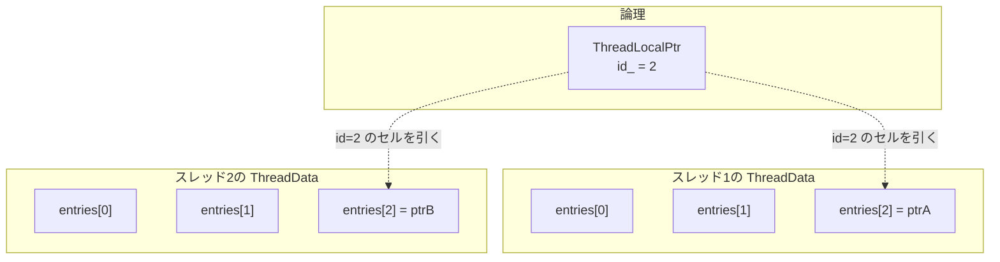
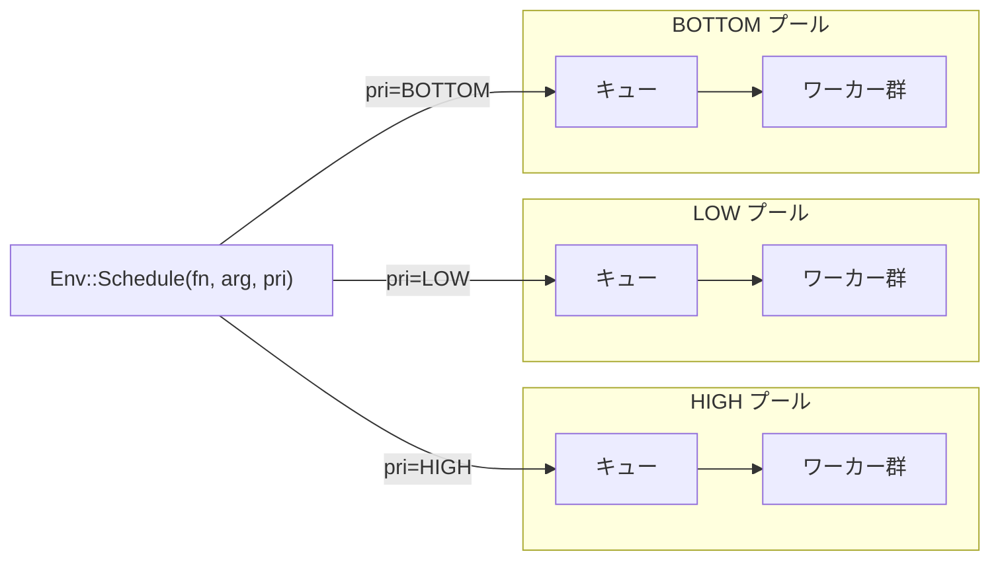

# 第43章 ThreadLocal とスレッドプール

> **本章で読むソース**
>
> - [`util/thread_local.h`](https://github.com/facebook/rocksdb/blob/v11.1.1/util/thread_local.h)
> - [`util/thread_local.cc`](https://github.com/facebook/rocksdb/blob/v11.1.1/util/thread_local.cc)
> - [`util/threadpool_imp.h`](https://github.com/facebook/rocksdb/blob/v11.1.1/util/threadpool_imp.h)
> - [`util/threadpool_imp.cc`](https://github.com/facebook/rocksdb/blob/v11.1.1/util/threadpool_imp.cc)
> - [`include/rocksdb/env.h`](https://github.com/facebook/rocksdb/blob/v11.1.1/include/rocksdb/env.h)
> - [`util/repeatable_thread.h`](https://github.com/facebook/rocksdb/blob/v11.1.1/util/repeatable_thread.h)

## この章の狙い

RocksDB の並行処理を支える二つの土台を読む。
一つは `ThreadLocalPtr` で、スレッドごとに別の値を持たせてロックを避ける仕組みである。
もう一つは `ThreadPoolImpl` で、フラッシュとコンパクションを実行するバックグラウンドスレッド群を供給する。
この章を読むと、読み出しホットパスから mutex を外す機構と、ジョブをワーカーに配るスレッド再利用の機構を、実コードのレベルで説明できるようになる。

## 前提

- [第24章 Version と SuperVersion](../part04-read-path/24-version-superversion.md)：本章の `ThreadLocalPtr` は SuperVersion のスレッドローカルキャッシュで使われる。
- [第2章 アーキテクチャ概観](../part00-introduction/02-architecture-overview.md)：`MaybeScheduleFlushOrCompaction` がジョブをスレッドプールへ積む流れに触れる。

## ThreadLocalPtr：1つの論理変数をスレッドごとの実体に分ける

通常の `thread_local` 変数は、同じ宣言を共有するすべてのインスタンスで一つの実体に集約される。
ヘッダのコメントはこの限界を説明している。
`DBImpl` に `thread_local` 変数 `A` を宣言すると、二つの `DBImpl` オブジェクトが同じ `A` を共有してしまう。

[`util/thread_local.h` L36-L44](https://github.com/facebook/rocksdb/blob/v11.1.1/util/thread_local.h#L36-L44)

```cpp
// ThreadLocalPtr stores only values of pointer type.  Different from
// the usual thread-local-storage, ThreadLocalPtr has the ability to
// distinguish data coming from different threads and different
// ThreadLocalPtr instances.  For example, if a regular thread_local
// variable A is declared in DBImpl, two DBImpl objects would share
// the same A.  However, a ThreadLocalPtr that is defined under the
// scope of DBImpl can avoid such confliction.  As a result, its memory
// usage would be O(# of threads * # of ThreadLocalPtr instances).
class ThreadLocalPtr {
```

`ThreadLocalPtr` は値をポインタ型に限定したうえで、スレッドとインスタンスの両方で値を区別する。
そのため、あるオブジェクトのインスタンス固有のスレッドローカル変数を持てる。
代償はメモリ使用量で、スレッド数とインスタンス数の積に比例する。

この区別を実現するのが、インスタンスごとに割り振られる id である。
各インスタンスはコンストラクタで一意の id を受け取り、メンバ `id_` に保持する。

[`util/thread_local.h` L94-L98](https://github.com/facebook/rocksdb/blob/v11.1.1/util/thread_local.h#L94-L98)

```cpp
 private:
  static StaticMeta* Instance();

  const uint32_t id_;
};
```

`ThreadLocalPtr` のインスタンス自身はこの id しか持たない。
値の実体を保持するのは、スレッドごとに一つだけ確保される `ThreadData` である。

### StaticMeta による id 管理とスレッドごとストレージ

スレッドごとの値は、`thread_local` として宣言された `ThreadData` に格納される。
`ThreadData` は `Entry` のベクタを一つ持ち、このベクタを id で添字付けする。
実装ファイルの図がレイアウトを示している。

[`util/thread_local.cc` L27-L49](https://github.com/facebook/rocksdb/blob/v11.1.1/util/thread_local.cc#L27-L49)

```cpp
// This is the structure that is declared as "thread_local" storage.
// The vector keep list of atomic pointer for all instances for "current"
// thread. The vector is indexed by an Id that is unique in process and
// associated with one ThreadLocalPtr instance. The Id is assigned by a
// global StaticMeta singleton. So if we instantiated 3 ThreadLocalPtr
// instances, each thread will have a ThreadData with a vector of size 3:
//     ---------------------------------------------------
//     |          | instance 1 | instance 2 | instance 3 |
//     ---------------------------------------------------
//     | thread 1 |    void*   |    void*   |    void*   | <- ThreadData
//     ---------------------------------------------------
// ... (中略) ...
struct ThreadData {
  explicit ThreadData(ThreadLocalPtr::StaticMeta* _inst)
      : entries(), next(nullptr), prev(nullptr), inst(_inst) {}
  std::vector<Entry> entries;
  ThreadData* next;
  ThreadData* prev;
  ThreadLocalPtr::StaticMeta* inst;
};
```

`Entry` の中身は `std::atomic<void*> ptr` である（[`util/thread_local.cc` L19-L23](https://github.com/facebook/rocksdb/blob/v11.1.1/util/thread_local.cc#L19-L23)）。
1つの論理変数が「行＝スレッド」「列＝インスタンス」の表の1セルに対応する。

横軸の id を発番するのが、プロセスに一つだけ存在する `StaticMeta` シングルトンである。
`GetId` は使い終わった id を再利用する仕組みを持ち、ベクタの肥大化を防ぐ。

[`util/thread_local.cc` L458-L467](https://github.com/facebook/rocksdb/blob/v11.1.1/util/thread_local.cc#L458-L467)

```cpp
uint32_t ThreadLocalPtr::StaticMeta::GetId() {
  MutexLock l(Mutex());
  if (free_instance_ids_.empty()) {
    return next_instance_id_++;
  }

  uint32_t id = free_instance_ids_.back();
  free_instance_ids_.pop_back();
  return id;
}
```

`ThreadLocalPtr` を破棄すると、デストラクタが `ReclaimId` を呼ぶ。
`ReclaimId` は全スレッドの該当セルを `nullptr` に差し替え、登録済みの後始末ハンドラ `UnrefHandler` を呼んでから、id を再利用プールへ戻す（[`util/thread_local.cc` L477-L492](https://github.com/facebook/rocksdb/blob/v11.1.1/util/thread_local.cc#L477-L492)）。
全スレッドのセルを走査できるのは、`StaticMeta` がすべての `ThreadData` を双方向リンクリスト `head_` でつないでいるからである（前掲の `ThreadData` の `next`/`prev`）。

### スレッド終了時のクリーンアップ

スレッドが終了するとき、そのスレッドが残したポインタを誰かが解放しなければならない。
RocksDB は `pthread_key_create` の破棄コールバックに `OnThreadExit` を登録し、スレッド終了時に呼ばせる。

[`util/thread_local.cc` L270-L297](https://github.com/facebook/rocksdb/blob/v11.1.1/util/thread_local.cc#L270-L297)

```cpp
void ThreadLocalPtr::StaticMeta::OnThreadExit(void* ptr) {
  auto* tls = static_cast<ThreadData*>(ptr);
  assert(tls != nullptr);

  // ... (中略) ...
  auto* inst = tls->inst;
  pthread_setspecific(inst->pthread_key_, nullptr);

  MutexLock l(inst->MemberMutex());
  inst->RemoveThreadData(tls);
  // Unref stored pointers of current thread from all instances
  uint32_t id = 0;
  for (auto& e : tls->entries) {
    void* raw = e.ptr.load();
    if (raw != nullptr) {
      auto unref = inst->GetHandler(id);
      if (unref != nullptr) {
        unref(raw);
      }
    }
    ++id;
  }
  // Delete thread local structure no matter if it is Mac platform
  delete tls;
}
```

`OnThreadExit` は終了するスレッドの `ThreadData` をリンクリストから外し、保持していた全エントリについて、id ごとに登録されたハンドラを呼んで後始末する。
最後に `ThreadData` 自体を解放する。
id を切り口にした破棄（`ReclaimId`）とスレッドを切り口にした破棄（`OnThreadExit`）の二つで、表の縦と横の両方向を回収できる。

### なぜロック回避になるか（最適化その1）

読み出しの `Get` は、自スレッドの `ThreadData` のベクタを引くだけで完結する。

[`util/thread_local.cc` L376-L382](https://github.com/facebook/rocksdb/blob/v11.1.1/util/thread_local.cc#L376-L382)

```cpp
void* ThreadLocalPtr::StaticMeta::Get(uint32_t id) const {
  auto* tls = GetThreadLocal();
  if (UNLIKELY(id >= tls->entries.size())) {
    return nullptr;
  }
  return tls->entries[id].ptr.load(std::memory_order_acquire);
}
```

`tls` はそのスレッド専用の `thread_local` ポインタなので、他スレッドと共有しない。
読むのは `entries[id]` という自スレッド固有のセルだけであり、`std::atomic<void*>` の acquire ロードで済む。
ここに mutex は登場しない。
一つの共有変数に全スレッドが集中アクセスする構図を、スレッドごとに分かれたセルへの分散アクセスに変えたことが、ロック回避の機構である。

書き込み側にも同じ性質がある。
別スレッドが破棄や走査でセルへ触れる可能性に備えて、セルの読み書きはアトミック操作で行う。
`Swap` は exchange、`CompareAndSwap` は compare_exchange_strong で、いずれも自スレッドのセルに対する単一のアトミック命令である（[`util/thread_local.cc` L394-L414](https://github.com/facebook/rocksdb/blob/v11.1.1/util/thread_local.cc#L394-L414)）。
mutex を取るのは、ベクタを id まで伸ばす必要がある初回の `resize` のときだけである。

第24章で見た SuperVersion のスレッドローカルキャッシュは、この性質をそのまま使う。
スレッドは自分のキャッシュした SuperVersion を `Swap` で取り出し、使用中を表す番兵 `kSVInUse` を置く。
読み出しを終えると `CompareAndSwap` でキャッシュへ戻す。
番兵が残っていれば、SuperVersion が更新されたと判断して取得し直す。
読み出しのたびにカラムファミリーの mutex を取る必要がなくなり、これが Get の高速化につながる（[`db/column_family.cc` L1366-L1400](https://github.com/facebook/rocksdb/blob/v11.1.1/db/column_family.cc#L1366-L1400)）。



## ThreadPoolImpl：バックグラウンドスレッドの供給源

フラッシュ（第13章）とコンパクション（第31章）は、前景のスレッドではなく専用のバックグラウンドスレッドで実行する。
そのスレッドを供給するのが `ThreadPoolImpl` である。
公開メソッドはジョブの投入（`SubmitJob`/`Schedule`）とスレッド数の調整（`SetBackgroundThreads`）に分かれる（[`util/threadpool_imp.h` L33-L78](https://github.com/facebook/rocksdb/blob/v11.1.1/util/threadpool_imp.h#L33-L78)）。

実装は pimpl で隠した `Impl` にある。
`Impl` はジョブキュー、ワーカースレッドの配列、それらを保護する mutex と条件変数を一組だけ持つ。

[`util/threadpool_imp.cc` L146-L158](https://github.com/facebook/rocksdb/blob/v11.1.1/util/threadpool_imp.cc#L146-L158)

```cpp
  // Entry per Schedule()/Submit() call
  struct BGItem {
    void* tag = nullptr;
    std::function<void()> function;
    std::function<void()> unschedFunction;
  };

  using BGQueue = std::deque<BGItem>;
  BGQueue queue_;

  std::mutex mu_;
  std::condition_variable bgsignal_;
  std::vector<port::Thread> bgthreads_;
```

`queue_` がジョブの待ち行列、`bgthreads_` がワーカーである。
`tag` はジョブの取り消し（`UnSchedule`）で使う識別子で、`unschedFunction` は取り消し時に呼ぶ後始末である。

### ジョブの投入とワーカーの待ち合わせ

`Submit` はジョブをキューの末尾に積み、必要なら待機中のワーカーを起こす。

[`util/threadpool_imp.cc` L401-L431](https://github.com/facebook/rocksdb/blob/v11.1.1/util/threadpool_imp.cc#L401-L431)

```cpp
void ThreadPoolImpl::Impl::Submit(std::function<void()>&& schedule,
                                  std::function<void()>&& unschedule,
                                  void* tag) {
  std::lock_guard<std::mutex> lock(mu_);

  if (exit_all_threads_) {
    return;
  }

  StartBGThreads();

  // Add to priority queue
  queue_.push_back(BGItem());
  // ... (中略) ...
  queue_len_.store(static_cast<unsigned int>(queue_.size()),
                   std::memory_order_relaxed);

  if (!HasExcessiveThread()) {
    // Wake up at least one waiting thread.
    bgsignal_.notify_one();
  } else {
    // Need to wake up all threads to make sure the one woken
    // up is not the one to terminate.
    WakeUpAllThreads();
  }
}
```

ワーカー側の本体は `BGThread` で、ループの先頭で条件変数を待つ。

[`util/threadpool_imp.cc` L219-L266](https://github.com/facebook/rocksdb/blob/v11.1.1/util/threadpool_imp.cc#L219-L266)

```cpp
  while (true) {
    // Wait until there is an item that is ready to run
    std::unique_lock<std::mutex> lock(mu_);
    // Stop waiting if the thread needs to do work or needs to terminate.
    // Increase num_waiting_threads_ once this task has started waiting
    num_waiting_threads_++;

    // ... (中略) ...
    while (!exit_all_threads_ && !IsLastExcessiveThread(thread_id) &&
           (queue_.empty() || IsExcessiveThread(thread_id) ||
            num_waiting_threads_ <= reserved_threads_)) {
      bgsignal_.wait(lock);
    }
    // Decrease num_waiting_threads_ once the thread is not waiting
    num_waiting_threads_--;

    // ... (中略) ...

    auto func = std::move(queue_.front().function);
    queue_.pop_front();
```

待機を抜ける条件は三つある。
終了指示が出たとき、自分が削減対象の余剰スレッドのとき、そしてキューにジョブがあって予約による抑制もかかっていないときである。
待機を抜けたワーカーはキュー先頭のジョブを取り出し、mutex を放してから実行する（`func()`、[`util/threadpool_imp.cc` L311](https://github.com/facebook/rocksdb/blob/v11.1.1/util/threadpool_imp.cc#L311)）。
ジョブの実行中はロックを保持しないので、他のワーカーは並行して次のジョブを取り出せる。

### スレッド再利用（最適化その2）

`BGThread` がループであることが、このプールの高速化の核心である。
ワーカーは一つのジョブを実行し終えても終了せず、ループの先頭に戻って次のジョブを待つ。
ジョブごとにスレッドを作って壊すと、生成と破棄のシステムコールが都度かかる。
プールは固定数のスレッドを使い回し、その費用をプールの寿命全体で一度に薄める。
フラッシュやコンパクションのように短いジョブが頻繁に発生する用途では、この再利用が効く。

スレッド数は固定ではなく、`SetBackgroundThreads` から動的に調整できる。

[`util/threadpool_imp.cc` L359-L371](https://github.com/facebook/rocksdb/blob/v11.1.1/util/threadpool_imp.cc#L359-L371)

```cpp
void ThreadPoolImpl::Impl::SetBackgroundThreadsInternal(int num,
                                                        bool allow_reduce) {
  std::lock_guard<std::mutex> lock(mu_);
  if (exit_all_threads_) {
    return;
  }
  if (num > total_threads_limit_ ||
      (num < total_threads_limit_ && allow_reduce)) {
    total_threads_limit_ = std::max(0, num);
    WakeUpAllThreads();
    StartBGThreads();
  }
}
```

上限を増やしたときは `StartBGThreads` が不足分のスレッドを生成する。
上限を減らしたときは、余剰スレッドが `BGThread` の中で自分を `detach` して抜ける（前掲 [`util/threadpool_imp.cc` L246-L263](https://github.com/facebook/rocksdb/blob/v11.1.1/util/threadpool_imp.cc#L246-L263)）。
削減は生成順の逆で進め、最後に作られたスレッドから止める。

## Env::Schedule から優先度別プールへ

ジョブを積む入口は `Env::Schedule` である。
既定の優先度は `LOW` で、ジョブは指定された優先度のプールに入る。

[`include/rocksdb/env.h` L598-L610](https://github.com/facebook/rocksdb/blob/v11.1.1/include/rocksdb/env.h#L598-L610)

```cpp
  // Arrange to run "(*function)(arg)" once in a background thread, in
  // the thread pool specified by pri. By default, jobs go to the 'LOW'
  // priority thread pool.

  // "function" may run in an unspecified thread.  Multiple functions
  // added to the same Env may run concurrently in different threads.
  // ... (中略) ...
  virtual void Schedule(void (*function)(void* arg), void* arg,
                        Priority pri = LOW, void* tag = nullptr,
                        void (*unschedFunction)(void* arg) = nullptr) = 0;
```

優先度は次の列挙で表す。

[`include/rocksdb/env.h` L432-L433](https://github.com/facebook/rocksdb/blob/v11.1.1/include/rocksdb/env.h#L432-L433)

```cpp
  // Priority for scheduling job in thread pool
  enum Priority { BOTTOM, LOW, HIGH, USER, TOTAL };
```

既定の Env（POSIX 実装）は、優先度ごとに別の `ThreadPoolImpl` を一つずつ持つ。
コンストラクタは `Priority::TOTAL` 個のプールを確保し、それぞれにその優先度を設定する。

[`env/env_posix.cc` L421-L435](https://github.com/facebook/rocksdb/blob/v11.1.1/env/env_posix.cc#L421-L435)

```cpp
PosixEnv::PosixEnv()
    : CompositeEnv(FileSystem::Default(), SystemClock::Default()),
      thread_pools_storage_(Priority::TOTAL),
      // ... (中略) ...
  for (int pool_id = 0; pool_id < Env::Priority::TOTAL; ++pool_id) {
    thread_pools_[pool_id].SetThreadPriority(
        static_cast<Env::Priority>(pool_id));
    // This allows later initializing the thread-local-env of each thread.
    thread_pools_[pool_id].SetHostEnv(this);
  }
```

`Schedule` は優先度を添字にして、対応するプールへジョブを委譲する。

[`env/env_posix.cc` L439-L443](https://github.com/facebook/rocksdb/blob/v11.1.1/env/env_posix.cc#L439-L443)

```cpp
void PosixEnv::Schedule(void (*function)(void* arg1), void* arg, Priority pri,
                        void* tag, void (*unschedFunction)(void* arg)) {
  assert(pri >= Priority::BOTTOM && pri <= Priority::HIGH);
  thread_pools_[pri].Schedule(function, arg, tag, unschedFunction);
}
```

優先度を分けるのは、フラッシュとコンパクションが互いのスレッドを奪い合わないようにするためである。
プールが共通だと、長いコンパクションがワーカーを占有し、短く済むべきフラッシュが待たされる。
`SetBackgroundThreads(num, pri)` は優先度を指定してプールごとに本数を決める（[`include/rocksdb/env.h` L704](https://github.com/facebook/rocksdb/blob/v11.1.1/include/rocksdb/env.h#L704)）。



### DBImpl からのジョブ投入

ジョブを積む実際の呼び出し元は、`DBImpl::MaybeScheduleFlushOrCompaction`（第2章）である。
フラッシュは HIGH プールへ積む。

[`db/db_impl/db_impl_compaction_flush.cc` L3054-L3059](https://github.com/facebook/rocksdb/blob/v11.1.1/db/db_impl/db_impl_compaction_flush.cc#L3054-L3059)

```cpp
    bg_flush_scheduled_++;
    FlushThreadArg* fta = new FlushThreadArg;
    fta->db_ = this;
    fta->thread_pri_ = Env::Priority::HIGH;
    env_->Schedule(&DBImpl::BGWorkFlush, fta, Env::Priority::HIGH, this,
                   &DBImpl::UnscheduleFlushCallback);
```

コンパクションは LOW プール、最下層へ出力するコンパクションは BOTTOM プールへ積む。

[`db/db_impl/db_impl_compaction_flush.cc` L3108-L3113](https://github.com/facebook/rocksdb/blob/v11.1.1/db/db_impl/db_impl_compaction_flush.cc#L3108-L3113)

```cpp
    ca->compaction_pri_ = Env::Priority::LOW;
    ca->prepicked_compaction = nullptr;
    bg_compaction_scheduled_++;
    unscheduled_compactions_--;
    env_->Schedule(&DBImpl::BGWorkCompaction, ca, Env::Priority::LOW, this,
                   &DBImpl::UnscheduleCompactionCallback);
```

HIGH プールにスレッドが一つも割り当てられていないときは、フラッシュを LOW プールへ回す経路もある（[`db/db_impl/db_impl_compaction_flush.cc` L3068-L3078](https://github.com/facebook/rocksdb/blob/v11.1.1/db/db_impl/db_impl_compaction_flush.cc#L3068-L3078)）。
積まれたジョブを取り出して実行するのが、前節で読んだ `BGThread` のワーカーである。
こうして「DBImpl がプールへ積む、ワーカーが取り出して実行する」という分業が成立する。

## RepeatableThread：周期実行の小さなラッパー

バックグラウンド処理のすべてがプールのジョブとは限らない。
一定間隔で同じ処理を繰り返すだけの軽い用途には、`RepeatableThread` を使う。
これは `port::Thread` を一本だけ抱え、指定した秒数ごとにコールバックを呼ぶラッパーである。

[`util/repeatable_thread.h` L18-L21](https://github.com/facebook/rocksdb/blob/v11.1.1/util/repeatable_thread.h#L18-L21)

```cpp
// Simple wrapper around port::Thread that supports calling a callback every
// X seconds. If you pass in 0, then it will call your callback repeatedly
// without delay.
class RepeatableThread {
```

本体ループ `thread()` は、待機と関数呼び出しを交互に繰り返す。

[`util/repeatable_thread.h` L113-L126](https://github.com/facebook/rocksdb/blob/v11.1.1/util/repeatable_thread.h#L113-L126)

```cpp
    assert(delay_us_ > 0);
    if (!wait(initial_delay_us_)) {
      return;
    }
    do {
      function_();
      // ... (中略) ...
    } while (wait(delay_us_));
```

`wait` は条件変数のタイムアウト待ちで、`cancel` が `running_` を倒して起こすまで周期を刻む。
プールのジョブキューとは独立した、単発の周期スレッドであり、定期的なフラッシュ判定のような用途に向く。

## まとめ

- `ThreadLocalPtr` は「スレッド×インスタンス」の表でポインタを管理し、`StaticMeta` が発番する id を列の添字に使う。
- 読み書きは自スレッドのセルへのアトミック操作で完結し、mutex はベクタ拡張時しか取らない。
  これが SuperVersion キャッシュ（第24章）のロック回避を支える。
- スレッド終了時は `OnThreadExit` が、インスタンス破棄時は `ReclaimId` が、それぞれ表の行と列を回収する。
- `ThreadPoolImpl` はジョブキューとワーカーのループからなり、ワーカーを使い回すことでスレッド生成、破棄の費用を薄める。
- 既定 Env は優先度ごとに別プールを持ち、フラッシュは HIGH、コンパクションは LOW、最下層コンパクションは BOTTOM に分かれて待ち合わせを避ける。
- 周期実行だけが必要な軽い用途には、プールではなく `RepeatableThread` を使う。

## 関連する章

- [第24章 Version と SuperVersion](../part04-read-path/24-version-superversion.md)：`ThreadLocalPtr` を使った SuperVersion キャッシュの全体像。
- [第13章 フラッシュ](../part02-write-path/13-flush.md)：HIGH プールに積まれるフラッシュジョブの中身。
- [第31章 コンパクションジョブ](../part05-compaction/31-compaction-job.md)：LOW/BOTTOM プールで実行されるコンパクションの中身。
- [第44章 レートリミッタ](44-rate-limiter.md)：バックグラウンド I/O を抑える別の機構。
