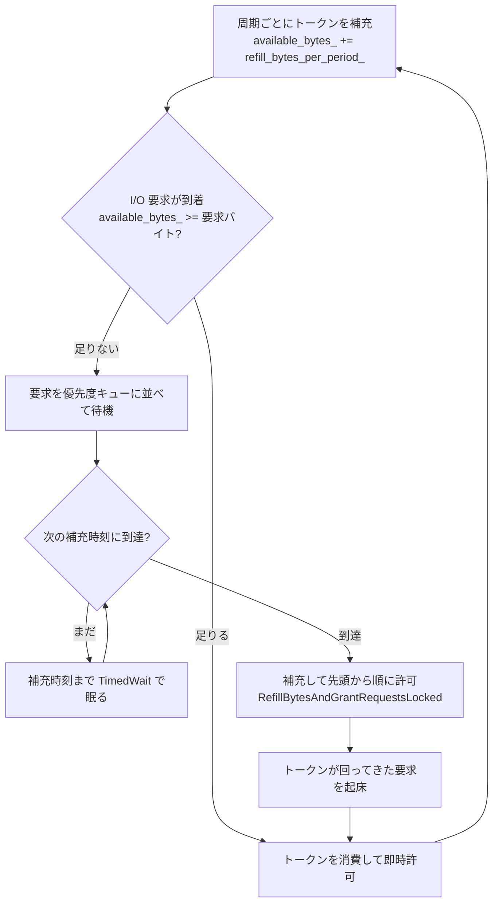

# 第44章 RateLimiter

> **本章で読むソース**
> - [`include/rocksdb/rate_limiter.h`](https://github.com/facebook/rocksdb/blob/v11.1.1/include/rocksdb/rate_limiter.h)
> - [`util/rate_limiter_impl.h`](https://github.com/facebook/rocksdb/blob/v11.1.1/util/rate_limiter_impl.h)
> - [`util/rate_limiter.cc`](https://github.com/facebook/rocksdb/blob/v11.1.1/util/rate_limiter.cc)

## この章の狙い

フラッシュやコンパクションは、前面のユーザー要求とは別に、バックグラウンドで大量のデータをストレージへ書き出す。
この書き込みが帯域を奪うと、前面の読み書きのレイテンシが跳ね上がる。
RocksDB はこれを防ぐため、バックグラウンド I/O の速度に上限をかけて時間軸でならす `RateLimiter` を持つ。
本章では、その既定実装 `GenericRateLimiter` がトークンバケットでどう平準化し、複数の優先度のあいだでトークンをどう公平に配り、不足した要求をどう待たせて起こすかを、実コードから読み解く。

## 前提

- [第12章 WriteBufferManager](../part02-write-path/12-write-buffer-manager.md)：メモリ側の抑制である Write Stall を扱う。本章の I/O 側の抑制と対になる。
- [第13章 フラッシュ](../part02-write-path/13-flush.md)：高優先度のトークンを要求する側。
- [第31章 CompactionJob](../part05-compaction/31-compaction-job.md)：低優先度のトークンを要求する側。

`RateLimiter` は I/O 経路から呼ばれる調整役である。
誰がどのファイルにどれだけ書くかには関与しない。
バイト数の要求を受け取り、許可できるまで呼び出し元を眠らせるという、速度の門番に徹する。

## なぜ I/O に上限をかけるのか

フラッシュとコンパクションは、放っておけばストレージの書き込み帯域を使い切ろうとする。
コンパクションは LSM ツリーの下層へ向かって SST を書き直し続け、フラッシュは MemTable を SST に落とす。
どちらもユーザーの応答性とは無関係に走り、しかも一度に大きなバイト列を吐き出す。
前面の `Get` や `Put` がストレージに触れるとき、この背景書き込みと帯域を奪い合えば、応答時間は背景の都合で乱高下する。

`RateLimiter` は、バックグラウンド I/O が一定速度を超えないように門で絞る。
速度を時間軸でならせば、瞬間的なバーストでストレージが飽和する場面が減り、前面の I/O に回る帯域が安定する。
メモリ側で書き込みを止める Write Stall（第12章）が「これ以上ためられない」という容量の抑制なら、こちらは「これ以上速く書かない」という速度の抑制である。

ヘッダのコメントが、抑制の対象を明示している。

[`include/rocksdb/rate_limiter.h` L141-L146](https://github.com/facebook/rocksdb/blob/v11.1.1/include/rocksdb/rate_limiter.h#L141-L146)

```cpp
// Create a RateLimiter object, which can be shared among RocksDB instances to
// control write rate of flush and compaction.
// @rate_bytes_per_sec: this is the only parameter you want to set most of the
// time. It controls the total write rate of compaction and flush in bytes per
// second. Currently, RocksDB does not enforce rate limit for anything other
// than flush and compaction, e.g. write to WAL.
```

上限がかかるのはフラッシュとコンパクションの書き込みだけである。
WAL への追記には適用されない。
WAL を絞ると前面の書き込みがそのまま待たされてしまうため、抑制したいのはあくまで背景 I/O だという設計が読み取れる。

## 抽象インタフェースと要求の種別

`RateLimiter` は抽象クラスで、利用側は `Request` でバイト数の許可を求める。
要求には読み書きの種別と優先度が付く。
種別は `OpType`、抑制の適用範囲は `Mode` で表す。

[`include/rocksdb/rate_limiter.h` L23-L35](https://github.com/facebook/rocksdb/blob/v11.1.1/include/rocksdb/rate_limiter.h#L23-L35)

```cpp
  enum class OpType {
    kRead,
    kWrite,
  };

  enum class Mode {
    kReadsOnly = 0,
    kWritesOnly = 1,
    kAllIo = 2,
  };

  // For API compatibility, default to rate-limiting writes only.
  explicit RateLimiter(Mode mode = Mode::kWritesOnly) : mode_(mode) {}
```

既定の `Mode` は `kWritesOnly` で、書き込みだけを抑制する。
`Request` に渡された `OpType` が現在の `Mode` の対象外なら、`IsRateLimited` が偽を返し、要求は素通りする。

優先度は `Request` の引数 `Env::IOPriority` で渡す。
この `enum` は `include/rocksdb/env.h` で四段に定義される（`IO_LOW = 0`、`IO_MID = 1`、`IO_HIGH = 2`、`IO_USER = 3`、番兵の `IO_TOTAL = 4`）。
ヘッダのコメントは高優先度と低優先度の二つに絞って説明しており、RocksDB はフラッシュを高優先度、コンパクションを低優先度に割り当てる。

[`include/rocksdb/rate_limiter.h` L152-L158](https://github.com/facebook/rocksdb/blob/v11.1.1/include/rocksdb/rate_limiter.h#L152-L158)

```cpp
// @fairness: RateLimiter accepts high-pri requests and low-pri requests.
// A low-pri request is usually blocked in favor of hi-pri request. Currently,
// RocksDB assigns low-pri to request from compaction and high-pri to request
// from flush. Low-pri requests can get blocked if flush requests come in
// continuously. This fairness parameter grants low-pri requests permission by
// 1/fairness chance even though high-pri requests exist to avoid starvation.
// You should be good by leaving it at default 10.
```

低優先度の要求は高優先度に道を譲るのが基本だが、それだけでは飢餓が起きる。
フラッシュが途切れず来ると、コンパクションがいつまでもトークンを得られない。
`fairness` は、その飢餓を確率的に崩すための仕掛けである。
既定値は 10 で、高優先度が居ても 1/10 の確率で低優先度を先に処理する。

`GenericRateLimiter` は `NewGenericRateLimiter` で生成する。

[`include/rocksdb/rate_limiter.h` L166-L170](https://github.com/facebook/rocksdb/blob/v11.1.1/include/rocksdb/rate_limiter.h#L166-L170)

```cpp
RateLimiter* NewGenericRateLimiter(
    int64_t rate_bytes_per_sec, int64_t refill_period_us = 100 * 1000,
    int32_t fairness = 10,
    RateLimiter::Mode mode = RateLimiter::Mode::kWritesOnly,
    bool auto_tuned = false, int64_t single_burst_bytes = 0);
```

`rate_bytes_per_sec` が目標速度、`refill_period_us` が補充の周期である。
既定の補充周期は 100 ミリ秒で、この二つの値からトークンバケットの動作が決まる。

## トークンバケットによる平準化

`GenericRateLimiter` の核はトークンバケットである。
`refill_period_us` ごとに、その周期ぶんのバイト数をトークンとしてバケットに補充する。
I/O 要求はバケットからトークンを引き、足りなければ次の補充まで眠る。
バケットの貯まりうる量に上限があるので、長く要求が来なかったあとに大量のトークンが貯まって一気に放出されることはない。
これが速度をならす機構である。

一周期あたりの補充量は、目標速度と周期から計算する。

[`util/rate_limiter.cc` L315-L325](https://github.com/facebook/rocksdb/blob/v11.1.1/util/rate_limiter.cc#L315-L325)

```cpp
int64_t GenericRateLimiter::CalculateRefillBytesPerPeriodLocked(
    int64_t rate_bytes_per_sec) {
  if (std::numeric_limits<int64_t>::max() / rate_bytes_per_sec <
      refill_period_us_) {
    // Avoid unexpected result in the overflow case. The result now is still
    // inaccurate but is a number that is large enough.
    return std::numeric_limits<int64_t>::max() / kMicrosecondsPerSecond;
  } else {
    return rate_bytes_per_sec * refill_period_us_ / kMicrosecondsPerSecond;
  }
}
```

`rate_bytes_per_sec * refill_period_us_ / 1000000` が一周期あたりのバイト数になる。
目標 10MB/s で周期 100ms なら、100ms ごとに 1MB を補充するという、ヘッダの例どおりの値が出る。
バケットの現在量は `available_bytes_`、一周期の補充量は `refill_bytes_per_period_` というメンバで保持する。

[`util/rate_limiter_impl.h` L126-L141](https://github.com/facebook/rocksdb/blob/v11.1.1/util/rate_limiter_impl.h#L126-L141)

```cpp
  const int64_t refill_period_us_;

  std::atomic<int64_t> rate_bytes_per_sec_;
  std::atomic<int64_t> refill_bytes_per_period_;
  // This value is validated but unsanitized (may be zero).
  std::atomic<int64_t> raw_single_burst_bytes_;
  std::shared_ptr<SystemClock> clock_;

  bool stop_;
  port::CondVar exit_cv_;
  int32_t requests_to_wait_;

  int64_t total_requests_[Env::IO_TOTAL];
  int64_t total_bytes_through_[Env::IO_TOTAL];
  int64_t available_bytes_;
  int64_t next_refill_us_;
```

周期ごとの補充量を固定し、要求がそれを消費するという形に落としたことで、要求一件ごとに時刻を見て速度を計算する必要がなくなる。
時刻を参照するのは、次の補充時刻 `next_refill_us_` に達したかを確かめるときだけになる。
速度の判定が「バケットに残りがあるか」という整数比較に縮むのが、この設計が軽い理由である。

要求の流れは次のとおりである。



## 要求の即時許可とキューイング

`Request` は、まずバケットに残ったトークンで要求を満たそうとする。
ここが速い経路で、トークンが足りれば眠らずに帰る。

[`util/rate_limiter.cc` L148-L159](https://github.com/facebook/rocksdb/blob/v11.1.1/util/rate_limiter.cc#L148-L159)

```cpp
  ++total_requests_[pri];

  if (available_bytes_ > 0) {
    int64_t bytes_through = std::min(available_bytes_, bytes);
    total_bytes_through_[pri] += bytes_through;
    available_bytes_ -= bytes_through;
    bytes -= bytes_through;
  }

  if (bytes == 0) {
    return;
  }
```

バケットに残りがあれば、要求バイトと残量の小さいほうを引いて消費する。
これで要求が満たされれば `bytes` が 0 になり、その場で返る。

満たしきれなかった残りは、要求を表す `Req` に詰めてキューに並べる。
`Req` は要求バイト数と、起こすための条件変数を一つずつ持つ構造体である。

[`util/rate_limiter.cc` L38-L44](https://github.com/facebook/rocksdb/blob/v11.1.1/util/rate_limiter.cc#L38-L44)

```cpp
// Pending request
struct GenericRateLimiter::Req {
  explicit Req(int64_t _bytes, port::Mutex* _mu)
      : request_bytes(_bytes), bytes(_bytes), cv(_mu) {}
  int64_t request_bytes;
  int64_t bytes;
  port::CondVar cv;
};
```

`request_bytes` がまだ許可されていない残りで、補充のたびに減っていく。
これが 0 になれば全量が許可された合図になる。
キューは優先度ごとに一本ずつ持つ（`std::deque<Req*> queue_[Env::IO_TOTAL]`）。

[`util/rate_limiter.cc` L161-L194](https://github.com/facebook/rocksdb/blob/v11.1.1/util/rate_limiter.cc#L161-L194)

```cpp
  // Request cannot be satisfied at this moment, enqueue
  Req r(bytes, &request_mutex_);
  queue_[pri].push_back(&r);
  TEST_SYNC_POINT_CALLBACK("GenericRateLimiter::Request:PostEnqueueRequest",
                           &request_mutex_);
  // A thread representing a queued request coordinates with other such threads.
  // There are two main duties.
  //
  // (1) Waiting for the next refill time.
  // (2) Refilling the bytes and granting requests.
  do {
    int64_t time_until_refill_us = next_refill_us_ - NowMicrosMonotonicLocked();
    if (time_until_refill_us > 0) {
      if (wait_until_refill_pending_) {
        // Somebody is performing (1). Trust we'll be woken up when our request
        // is granted or we are needed for future duties.
        r.cv.Wait();
      } else {
        // Whichever thread reaches here first performs duty (1) as described
        // above.
        int64_t wait_until = clock_->NowMicros() + time_until_refill_us;
        RecordTick(stats, NUMBER_RATE_LIMITER_DRAINS);
        ++num_drains_;
        wait_until_refill_pending_ = true;
        clock_->TimedWait(&r.cv, std::chrono::microseconds(wait_until));
        TEST_SYNC_POINT_CALLBACK("GenericRateLimiter::Request:PostTimedWait",
                                 &time_until_refill_us);
        wait_until_refill_pending_ = false;
      }
    } else {
      // Whichever thread reaches here first performs duty (2) as described
      // above.
      RefillBytesAndGrantRequestsLocked();
    }
```

待機しているスレッドには二つの役目がある。
一つは次の補充時刻まで眠る役目、もう一つは補充してトークンを配る役目である。
専用のバックグラウンドスレッドを持たず、待っている要求スレッド自身がこの二役を分担する。
`wait_until_refill_pending_` が、補充時刻を待つ係がすでに居るかどうかの旗である。

補充時刻にまだ達していなければ、最初に来た一つのスレッドだけが `TimedWait` で補充時刻まで眠り、補充を待つ係を引き受ける（`wait_until_refill_pending_ = true`）。
あとから来たスレッドは旗が立っているのを見て、無条件の `Wait` で眠り、起こされるのを待つ。
補充時刻に達していれば、誰であれそこに最初に来たスレッドが `RefillBytesAndGrantRequestsLocked` を呼んで補充と配布を行う。
タイマーを待つスレッドが一つに絞られるので、要求が何百と積もってもストレージの帯域を測りに行くタイマーは一本で済む。

## 補充時のトークン配布

`RefillBytesAndGrantRequestsLocked` が、補充とキューからの配布をまとめて行う。
まず次の補充時刻を更新し、一周期ぶんのトークンをバケットへ入れる。

[`util/rate_limiter.cc` L273-L313](https://github.com/facebook/rocksdb/blob/v11.1.1/util/rate_limiter.cc#L273-L313)

```cpp
void GenericRateLimiter::RefillBytesAndGrantRequestsLocked() {
  TEST_SYNC_POINT_CALLBACK(
      "GenericRateLimiter::RefillBytesAndGrantRequestsLocked", &request_mutex_);
  next_refill_us_ = NowMicrosMonotonicLocked() + refill_period_us_;
  // Carry over the left over quota from the last period
  auto refill_bytes_per_period =
      refill_bytes_per_period_.load(std::memory_order_relaxed);
  assert(available_bytes_ == 0);
  available_bytes_ = refill_bytes_per_period;

  std::vector<Env::IOPriority> pri_iteration_order =
      GeneratePriorityIterationOrderLocked();

  for (int i = Env::IO_LOW; i < Env::IO_TOTAL; ++i) {
    assert(!pri_iteration_order.empty());
    Env::IOPriority current_pri = pri_iteration_order[i];
    auto* queue = &queue_[current_pri];
    while (!queue->empty()) {
      auto* next_req = queue->front();
      if (available_bytes_ < next_req->request_bytes) {
        // Grant partial request_bytes even if request is for more than
        // `available_bytes_`, which can happen in a few situations:
        //
        // - The available bytes were partially consumed by other request(s)
        // - The rate was dynamically reduced while requests were already
        //   enqueued
        // - The burst size was explicitly set to be larger than the refill size
        next_req->request_bytes -= available_bytes_;
        available_bytes_ = 0;
        break;
      }
      available_bytes_ -= next_req->request_bytes;
      next_req->request_bytes = 0;
      total_bytes_through_[current_pri] += next_req->bytes;
      queue->pop_front();

      // Quota granted, signal the thread to exit
      next_req->cv.Signal();
    }
  }
}
```

トークンを入れたら、`GeneratePriorityIterationOrderLocked` が決めた優先度の順にキューを巡る。
各キューでは先頭から要求を見て、バケットに足りるあいだは `request_bytes` を 0 にして列から外し、その要求の条件変数を `Signal` で起こす。
起こされた要求スレッドは `Request` の `do-while` を抜けて呼び出し元へ帰る。
途中でバケットが尽きたら、先頭要求の `request_bytes` を残量ぶんだけ削って中断する（部分許可）。
削られた要求は次の補充でまた先頭から処理され、残りが許可されるまで列に残る。

先頭から順に配るので、早く並んだ要求が先にトークンを得る。
同じ優先度の中では到着順が保たれ、特定の要求が後回しにされ続けることはない。

## 優先度間の公平性

優先度をまたぐ配分は、巡回する順序で決まる。
`GeneratePriorityIterationOrderLocked` が、補充のたびに四つの優先度を並べた巡回順を作る。

[`util/rate_limiter.cc` L234-L271](https://github.com/facebook/rocksdb/blob/v11.1.1/util/rate_limiter.cc#L234-L271)

```cpp
std::vector<Env::IOPriority>
GenericRateLimiter::GeneratePriorityIterationOrderLocked() {
  std::vector<Env::IOPriority> pri_iteration_order(Env::IO_TOTAL /* 4 */);
  // We make Env::IO_USER a superior priority by always iterating its queue
  // first
  pri_iteration_order[0] = Env::IO_USER;

  bool high_pri_iterated_after_mid_low_pri = rnd_.OneIn(fairness_);
  TEST_SYNC_POINT_CALLBACK(
      "GenericRateLimiter::GeneratePriorityIterationOrderLocked::"
      "PostRandomOneInFairnessForHighPri",
      &high_pri_iterated_after_mid_low_pri);
  bool mid_pri_itereated_after_low_pri = rnd_.OneIn(fairness_);
  TEST_SYNC_POINT_CALLBACK(
      "GenericRateLimiter::GeneratePriorityIterationOrderLocked::"
      "PostRandomOneInFairnessForMidPri",
      &mid_pri_itereated_after_low_pri);

  if (high_pri_iterated_after_mid_low_pri) {
    pri_iteration_order[3] = Env::IO_HIGH;
    pri_iteration_order[2] =
        mid_pri_itereated_after_low_pri ? Env::IO_MID : Env::IO_LOW;
    pri_iteration_order[1] =
        (pri_iteration_order[2] == Env::IO_MID) ? Env::IO_LOW : Env::IO_MID;
  } else {
    pri_iteration_order[1] = Env::IO_HIGH;
    pri_iteration_order[3] =
        mid_pri_itereated_after_low_pri ? Env::IO_MID : Env::IO_LOW;
    pri_iteration_order[2] =
        (pri_iteration_order[3] == Env::IO_MID) ? Env::IO_LOW : Env::IO_MID;
  }
```

ユーザー優先度 `IO_USER` は常に先頭で、最初にトークンを取る。
残る三つの並びは乱数で揺らす。
`rnd_.OneIn(fairness_)` は 1/`fairness` の確率で真を返す。
既定の `fairness` が 10 なら、ほとんどの周期では `high_pri_iterated_after_mid_low_pri` が偽になり、高優先度 `IO_HIGH` が早い位置（添字 1）に置かれて先に処理される。
そして 1/10 の確率で真になったときだけ、高優先度が末尾（添字 3）に回り、中優先度と低優先度が先にトークンを得る。

ここがフラッシュとコンパクションの相対優先度を決める仕掛けである。
フラッシュ（高優先度）が連続して来ても、10 回に 1 回はコンパクション（低優先度や中優先度）が先頭側に来てトークンを得る。
高優先度を常に優先しつつ、確率で順序を入れ替えることで、低優先度が永久に飢えるのを防ぐ。

## auto-tune による実効レートの調整

`auto_tuned` を有効にすると、目標速度 `rate_bytes_per_sec` を上限としつつ、実際の需要に合わせて実効レートを上下させる。
需要の指標は「補充を待たされた回数」である。
要求がバケットを使い切って `TimedWait` で眠った回数を `num_drains_` に数えており、これが多いほど需要が供給を上回っている。

調整は `TuneLocked` が行う。
`Request` の冒頭から、`kRefillsPerTune`（100）周期ごとに一度だけ呼ばれる。

[`util/rate_limiter.cc` L327-L375](https://github.com/facebook/rocksdb/blob/v11.1.1/util/rate_limiter.cc#L327-L375)

```cpp
Status GenericRateLimiter::TuneLocked() {
  const int kLowWatermarkPct = 50;
  const int kHighWatermarkPct = 90;
  const int kAdjustFactorPct = 5;
  // computed rate limit will be in
  // `[max_bytes_per_sec_ / kAllowedRangeFactor, max_bytes_per_sec_]`.
  const int kAllowedRangeFactor = 20;

  std::chrono::microseconds prev_tuned_time = tuned_time_;
  tuned_time_ = std::chrono::microseconds(NowMicrosMonotonicLocked());

  int64_t elapsed_intervals = (tuned_time_ - prev_tuned_time +
                               std::chrono::microseconds(refill_period_us_) -
                               std::chrono::microseconds(1)) /
                              std::chrono::microseconds(refill_period_us_);
  // We tune every kRefillsPerTune intervals, so the overflow and division-by-
  // zero conditions should never happen.
  assert(num_drains_ <= std::numeric_limits<int64_t>::max() / 100);
  assert(elapsed_intervals > 0);
  int64_t drained_pct = num_drains_ * 100 / elapsed_intervals;

  int64_t prev_bytes_per_sec = GetBytesPerSecond();
  int64_t new_bytes_per_sec;
  if (drained_pct == 0) {
    new_bytes_per_sec = max_bytes_per_sec_ / kAllowedRangeFactor;
  } else if (drained_pct < kLowWatermarkPct) {
    // sanitize to prevent overflow
    int64_t sanitized_prev_bytes_per_sec =
        std::min(prev_bytes_per_sec, std::numeric_limits<int64_t>::max() / 100);
    new_bytes_per_sec =
        std::max(max_bytes_per_sec_ / kAllowedRangeFactor,
                 sanitized_prev_bytes_per_sec * 100 / (100 + kAdjustFactorPct));
  } else if (drained_pct > kHighWatermarkPct) {
    // sanitize to prevent overflow
    int64_t sanitized_prev_bytes_per_sec =
        std::min(prev_bytes_per_sec, std::numeric_limits<int64_t>::max() /
                                         (100 + kAdjustFactorPct));
    new_bytes_per_sec =
        std::min(max_bytes_per_sec_,
                 sanitized_prev_bytes_per_sec * (100 + kAdjustFactorPct) / 100);
  } else {
    new_bytes_per_sec = prev_bytes_per_sec;
  }
  if (new_bytes_per_sec != prev_bytes_per_sec) {
    SetBytesPerSecondLocked(new_bytes_per_sec);
  }
  num_drains_ = 0;
  return Status::OK();
}
```

`drained_pct` は、経過した周期のうち補充待ちが起きた割合である。
この割合を二つの水位と突き合わせて、次の実効レートを決める。

- `drained_pct` が 0：背景 I/O がほぼ起きていない。レートを下限の `max_bytes_per_sec_ / 20` まで一気に下げる。
- 50% 未満：需要が小さい。レートを `100/105` 倍に少し下げる（下限は割らない）。
- 90% 超：需要が大きく頻繁に待たされている。レートを `105/100` 倍に少し上げる（上限の `max_bytes_per_sec_` は超えない）。
- 50% 以上 90% 以下：ちょうどよい。据え置く。

実効レートは `[rate_bytes_per_sec / 20, rate_bytes_per_sec]` の範囲を動く。
ヘッダの `@auto_tuned` の説明にあるとおり、これは最近の背景 I/O 需要に応じた動的調整である。
背景 I/O が静かなときに上限いっぱいのトークンを配ると、たまに走るコンパクションが帯域を独占してしまう。
auto-tune は需要の薄いときにレートを絞り、需要が高まったときだけ上限へ近づけることで、平均的なバースト量を抑える。
コンストラクタで `auto_tuned` 時の初期レートが `rate_bytes_per_sec / 2` から始まるのも、低めの値から需要に合わせて昇っていくためである。

[`util/rate_limiter.cc` L50-L55](https://github.com/facebook/rocksdb/blob/v11.1.1/util/rate_limiter.cc#L50-L55)

```cpp
    : RateLimiter(mode),
      refill_period_us_(refill_period_us),
      rate_bytes_per_sec_(auto_tuned ? rate_bytes_per_sec / 2
                                     : rate_bytes_per_sec),
      refill_bytes_per_period_(
          CalculateRefillBytesPerPeriodLocked(rate_bytes_per_sec_)),
```

## まとめ

- `RateLimiter` は、フラッシュとコンパクションのバックグラウンド書き込み I/O に速度上限をかけ、前面の読み書きへの干渉をならす。抑制の対象は背景書き込みだけで、WAL には適用されない。
- 既定実装 `GenericRateLimiter` はトークンバケットである。`refill_period_us` ごとに `rate_bytes_per_sec` 相当のトークンを補充し、要求はトークンを消費する。速度判定が整数比較に縮むので軽い。
- トークンが足りない要求は優先度別のキューに並び、補充時に先頭から順にトークンを得て条件変数で起こされる。同じ優先度では到着順が保たれる。
- 専用スレッドを持たず、待機中の要求スレッド自身が「補充時刻を待つ」「補充して配る」の二役を分担する。タイマーを待つ係は一つに絞られる。
- 優先度間の公平性は、補充ごとに巡回順を乱数で揺らして実現する。高優先度を基本としつつ 1/`fairness` の確率で順序を入れ替え、低優先度の飢餓を防ぐ。
- auto-tune は補充待ちの割合から需要を測り、実効レートを `[rate_bytes_per_sec / 20, rate_bytes_per_sec]` の範囲で上下させる。

## 関連する章

- [第12章 WriteBufferManager](../part02-write-path/12-write-buffer-manager.md)：メモリ容量側の抑制である Write Stall。本章の速度抑制と対になる。
- [第13章 フラッシュ](../part02-write-path/13-flush.md)：高優先度のトークンを要求する側の処理。
- [第31章 CompactionJob](../part05-compaction/31-compaction-job.md)：低優先度のトークンを要求する側の処理。
- [第43章 ThreadLocal とスレッドプール](43-threadlocal-threadpool.md)：背景 I/O を走らせるスレッドの管理。
