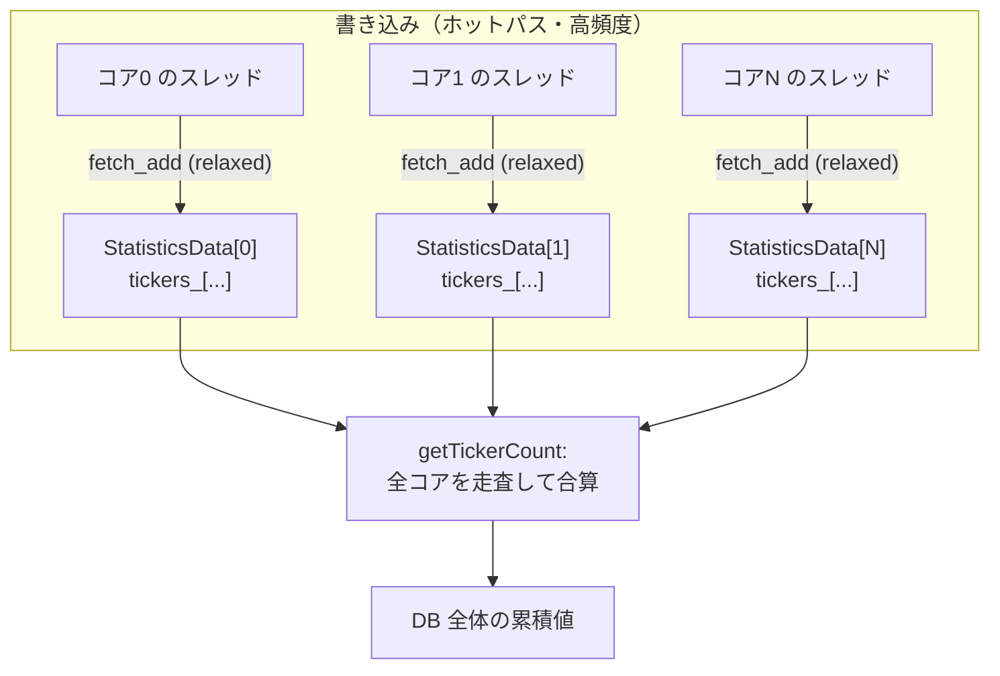
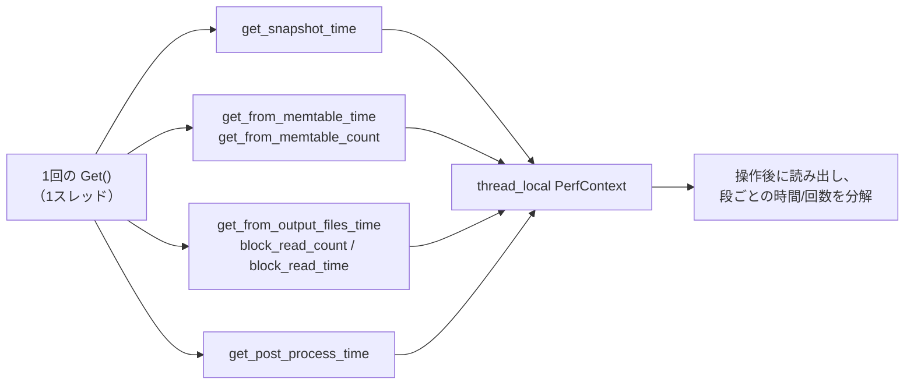

# 第45章 統計と計測

> **本章で読むソース**
>
> - [`include/rocksdb/statistics.h`](https://github.com/facebook/rocksdb/blob/v11.1.1/include/rocksdb/statistics.h)
> - [`monitoring/statistics_impl.h`](https://github.com/facebook/rocksdb/blob/v11.1.1/monitoring/statistics_impl.h)
> - [`monitoring/statistics.cc`](https://github.com/facebook/rocksdb/blob/v11.1.1/monitoring/statistics.cc)
> - [`util/core_local.h`](https://github.com/facebook/rocksdb/blob/v11.1.1/util/core_local.h)
> - [`include/rocksdb/perf_context.h`](https://github.com/facebook/rocksdb/blob/v11.1.1/include/rocksdb/perf_context.h)
> - [`include/rocksdb/perf_level.h`](https://github.com/facebook/rocksdb/blob/v11.1.1/include/rocksdb/perf_level.h)
> - [`monitoring/perf_step_timer.h`](https://github.com/facebook/rocksdb/blob/v11.1.1/monitoring/perf_step_timer.h)
> - [`monitoring/perf_context_imp.h`](https://github.com/facebook/rocksdb/blob/v11.1.1/monitoring/perf_context_imp.h)
> - [`include/rocksdb/iostats_context.h`](https://github.com/facebook/rocksdb/blob/v11.1.1/include/rocksdb/iostats_context.h)

## この章の狙い

RocksDB は自身の動作を二つの異なる粒度で計測する。
一つは DB 全体で積算する `Statistics`、もう一つは今このスレッドが実行している1操作を分解する `PerfContext` と `IOStatsContext` である。
本章では、両者のデータ構造と読み書きパスへの埋め込み方を読み、計測そのものがホットパスを遅くしないための二つの仕組み、分散カウンタと段階的なゲーティングを機構として理解する。

## 前提

- [第38章 シャーディングされたキャッシュ](../part07-cache/38-cache-sharded.md)（共有状態をコア単位に分割して競合を避ける発想は本章のカウンタにも現れる）
- [第43章 ThreadLocal とスレッドプール](../part08-concurrency/43-threadlocal-threadpool.md)（スレッドローカル記憶域の扱い）

## 二系統の計測

RocksDB の計測は、集計の単位が異なる二つの系統に分かれている。

**`Statistics`** は DB 全体にわたる累積値を持つ。
ブロックキャッシュのヒット数や WAL に書いたバイト数のように、起動から現在までの総量を後から問い合わせるための系統である。
値は `Options::statistics` に登録した1個のオブジェクトに集約され、全スレッドの活動が合算される。

**`PerfContext`** はスレッドごとに、今まさに実行中の1操作の内訳を持つ。
1回の `Get()` がブロックキャッシュのルックアップに何ナノ秒、SST からの読み出しに何ナノ秒を使ったかといった分解を、その操作を呼んだスレッド自身が記録する。
`IOStatsContext` は同じくスレッドローカルで、ファイル I/O に絞った内訳（読み書きバイト数、`read()` や `fsync()` の所要時間）を持つ。

二つの系統は問いの種類が違う。
`Statistics` は「この DB はこれまで全体としてどう振る舞ったか」に答え、`PerfContext` は「いま遅かったこの操作は、どの段で時間を使ったか」に答える。

## Statistics の抽象とカウンタの種類

`Statistics` は抽象クラスであり、二種類の指標を扱う。
**Ticker**（カウンタ）は単調増加する整数で、`enum Tickers` に定義される。
**Histogram**（ヒストグラム）は値の分布で、`enum Histograms` に定義され、`HistogramData` として中央値や95/99パーセンタイルを取り出せる。

`Statistics` の中核となるインターフェースは次の通りである。

[`include/rocksdb/statistics.h` L806-L818](https://github.com/facebook/rocksdb/blob/v11.1.1/include/rocksdb/statistics.h#L806-L818)

```cpp
virtual uint64_t getTickerCount(uint32_t tickerType) const = 0;
virtual void histogramData(uint32_t type,
                           HistogramData* const data) const = 0;
virtual std::string getHistogramString(uint32_t /*type*/) const { return ""; }
virtual void recordTick(uint32_t tickerType, uint64_t count = 1) = 0;
virtual void setTickerCount(uint32_t tickerType, uint64_t count) = 0;
virtual uint64_t getAndResetTickerCount(uint32_t tickerType) = 0;
virtual void reportTimeToHistogram(uint32_t histogramType, uint64_t time) {
  if (get_stats_level() <= StatsLevel::kExceptTimers) {
    return;
  }
  recordInHistogram(histogramType, time);
}
```

書き込みは `recordTick()`（カウンタを加算）と `recordInHistogram()`（分布に1標本を追加）、読み出しは `getTickerCount()` と `histogramData()` である。
ここで注目すべきは `reportTimeToHistogram()` の先頭にある早期 return である。
時間計測を伴うヒストグラムは、計測の段階を表す `StatsLevel` が `kExceptTimers` 以下なら、何も記録せずに帰る。
この段階判定は本章後半の最適化の核に直結する。

利用側は `CreateDBStatistics()` で具象オブジェクトを得て `Options` に渡し、後から累積値を問い合わせる。

[`include/rocksdb/statistics.h` L782-L790](https://github.com/facebook/rocksdb/blob/v11.1.1/include/rocksdb/statistics.h#L782-L790)

```cpp
// Analyze the performance of a db by providing cumulative stats over time.
// Usage:
//  Options options;
//  options.statistics = ROCKSDB_NAMESPACE::CreateDBStatistics();
//  Status s = DB::Open(options, kDBPath, &db);
//  ...
//  options.statistics->getTickerCount(NUMBER_BLOCK_COMPRESSED);
//  HistogramData hist;
//  options.statistics->histogramData(FLUSH_TIME, &hist);
```

## 分散カウンタという最適化（最適化の核その1）

`Statistics` のカウンタはホットパスのほぼ全域で叩かれる。
ブロックキャッシュにアクセスするたび、キーを1個読むたびに `recordTick()` が呼ばれる。
もし全スレッドが1個の共有カウンタを `fetch_add` で更新すると、そのカウンタのキャッシュラインがコア間を往復し、コア数に比例して競合が悪化する。
これは第38章でキャッシュをシャードに割ってロック競合を避けたのと同じ問題であり、解法も同じく分散である。

具象実装 `StatisticsImpl` は、カウンタとヒストグラムをまとめた構造体をコアごとに1個ずつ持つ。

[`monitoring/statistics_impl.h` L85-L106](https://github.com/facebook/rocksdb/blob/v11.1.1/monitoring/statistics_impl.h#L85-L106)

```cpp
// The ticker/histogram data are stored in this structure, which we will store
// per-core. It is cache-aligned, so tickers/histograms belonging to different
// cores can never share the same cache line.
//
// Alignment attributes expand to nothing depending on the platform
struct ALIGN_AS(CACHE_LINE_SIZE) StatisticsData {
  std::atomic_uint_fast64_t tickers_[INTERNAL_TICKER_ENUM_MAX] = {{0}};
  HistogramImpl histograms_[INTERNAL_HISTOGRAM_ENUM_MAX];
  // ... (中略) ...
};
// ... (中略) ...
CoreLocalArray<StatisticsData> per_core_stats_;
```

`StatisticsData` は `CACHE_LINE_SIZE` でアラインされている。
これにより、別々のコアが触る `StatisticsData` が同じキャッシュラインに乗ることがなく、片方の更新が他方のキャッシュを無効化するフォルスシェアリングが起きない。
構造体の配列は `CoreLocalArray` で保持する。

書き込み時は、今走っているコアに対応する要素だけを更新する。

[`monitoring/statistics.cc` L499-L512](https://github.com/facebook/rocksdb/blob/v11.1.1/monitoring/statistics.cc#L499-L512)

```cpp
void StatisticsImpl::recordTick(uint32_t tickerType, uint64_t count) {
  if (get_stats_level() <= StatsLevel::kExceptTickers) {
    return;
  }
  if (tickerType < TICKER_ENUM_MAX) {
    per_core_stats_.Access()->tickers_[tickerType].fetch_add(
        count, std::memory_order_relaxed);
    if (stats_) {
      stats_->recordTick(tickerType, count);
    }
  } else {
    assert(false);
  }
}
```

`per_core_stats_.Access()` は現在のコアに対応する `StatisticsData` を返す。
そのコアローカルな要素に対する `fetch_add` であり、しかも `std::memory_order_relaxed` を指定するので、順序保証のためのメモリバリアも入らない。
別のコアが同じカウンタを同時に更新しても、触る要素が別物なので競合しない。

`Access()` がどのコアの要素を選ぶかは `CoreLocalArray` が決める。

[`util/core_local.h` L66-L77](https://github.com/facebook/rocksdb/blob/v11.1.1/util/core_local.h#L66-L77)

```cpp
template <typename T>
std::pair<T*, size_t> CoreLocalArray<T>::AccessElementAndIndex() const {
  int cpuid = port::PhysicalCoreID();
  size_t core_idx;
  if (UNLIKELY(cpuid < 0)) {
    // cpu id unavailable, just pick randomly
    core_idx = Random::GetTLSInstance()->Uniform(1 << size_shift_);
  } else {
    core_idx = static_cast<size_t>(BottomNBits(cpuid, size_shift_));
  }
  return {AccessAtCore(core_idx), core_idx};
}
```

物理コア ID の下位ビットを取って要素を選ぶ。
コア ID が取れない環境では乱数で1個を選び、正確さを少し犠牲にして競合の少なさを保つ。
このしくみがコアローカルであってスレッドローカルでないのは、スレッド数よりコア数のほうが少なく上限が明確で、配列を小さく固定できるからである。

読み出し時には、分散していた値を全コア分たどって合算する。

[`monitoring/statistics.cc` L430-L437](https://github.com/facebook/rocksdb/blob/v11.1.1/monitoring/statistics.cc#L430-L437)

```cpp
uint64_t StatisticsImpl::getTickerCountLocked(uint32_t tickerType) const {
  assert(tickerType < TICKER_ENUM_MAX);
  uint64_t res = 0;
  for (size_t core_idx = 0; core_idx < per_core_stats_.Size(); ++core_idx) {
    res += per_core_stats_.AccessAtCore(core_idx)->tickers_[tickerType];
  }
  return res;
}
```

ヒストグラムも同様に、コアごとの `HistogramImpl` を1個に `Merge` してから `HistogramData` を取り出す。
読み出しは更新に比べてはるかに低頻度なので、ここで全コアを舐める O(コア数) のコストは許容できる。
つまり、頻繁な書き込みを安価にする代わりに、まれな読み出しに合算コストを寄せた設計である。



各 `StatisticsData` がキャッシュライン境界に揃うので、図の各矢印は互いに干渉しない。
合算は読み出し時の一度だけである。

## PerfContext による1操作の分解

`PerfContext` はスレッドローカルな構造体で、フィールドはすべて単純な `uint64_t` のカウンタである。
ロックも `atomic` も使わない。
更新するのは常にそのスレッド自身だけなので、共有のための同期がそもそも要らない。

`PerfContextBase` の冒頭を見ると、計測対象が読み書きパスの各段に対応していることがわかる。

[`include/rocksdb/perf_context.h` L73-L96](https://github.com/facebook/rocksdb/blob/v11.1.1/include/rocksdb/perf_context.h#L73-L96)

```cpp
struct PerfContextBase {
  uint64_t user_key_comparison_count;  // total number of user key comparisons
  uint64_t block_cache_hit_count;      // total number of block cache hits
  uint64_t block_read_count;           // total number of block reads (with IO)
  uint64_t block_read_byte;            // total number of bytes from block reads
  uint64_t block_read_time;            // total nanos spent on block reads
  // total cpu time in nanos spent on block reads
  uint64_t block_read_cpu_time;
  uint64_t block_cache_index_hit_count;  // total number of index block hits
  // ... (中略) ...
  uint64_t block_cache_read_byte;
```

`Get()` の時間内訳に対応するフィールド群もある。

[`include/rocksdb/perf_context.h` L166-L171](https://github.com/facebook/rocksdb/blob/v11.1.1/include/rocksdb/perf_context.h#L166-L171)

```cpp
uint64_t get_snapshot_time;        // total nanos spent on getting snapshot
uint64_t get_from_memtable_time;   // total nanos spent on querying memtables
uint64_t get_from_memtable_count;  // number of mem tables queried
// total nanos spent after Get() finds a key
uint64_t get_post_process_time;
uint64_t get_from_output_files_time;  // total nanos reading from output files
```

これらを足し合わせると、1回の `Get()` が「スナップショット取得 → MemTable 探索 → SST 読み出し → 後処理」のどこに時間を使ったかが復元できる。
スレッドローカルなので、利用側はまず `get_perf_context()->Reset()` で値をゼロに戻し、計測したい操作を実行し、終わってからフィールドを読む。

[`include/rocksdb/perf_context.h` L332-L341](https://github.com/facebook/rocksdb/blob/v11.1.1/include/rocksdb/perf_context.h#L332-L341)

```cpp
// If RocksDB is compiled with -DNPERF_CONTEXT, then a pointer to a global,
// non-thread-local PerfContext object will be returned. Attempts to update
// this object will be ignored, and reading from it will also be no-op.
// Otherwise,
// a) if thread-local is supported on the platform, then a pointer to
//    a thread-local PerfContext object will be returned.
// b) if thread-local is NOT supported, then compilation will fail.
//
// This function never returns nullptr.
PerfContext* get_perf_context();
```

`IOStatsContext` も同じ設計で、ファイル I/O の時間とバイト数をスレッドローカルに積む（[`include/rocksdb/iostats_context.h` L79-L122](https://github.com/facebook/rocksdb/blob/v11.1.1/include/rocksdb/iostats_context.h#L79-L122)）。



## level によるゲーティング（最適化の核その2）

計測には固有のコストがある。
特に時間計測はクロックの読み出し（`NowNanos()`）を伴い、1回は安くても、ホットパスで何度も呼べば無視できない。
RocksDB はこのコストを、必要のない計測について実質ゼロにするために、計測の細かさを段階で切り替える。

`PerfContext` 側の段階が `PerfLevel` である。
段階は積み重なっており、上の段に上げるほど計測する指標が増える。

[`include/rocksdb/perf_level.h` L27-L51](https://github.com/facebook/rocksdb/blob/v11.1.1/include/rocksdb/perf_level.h#L27-L51)

```cpp
enum PerfLevel : unsigned char {
  // Unknown setting
  kUninitialized = 0,
  // Disable perf stats
  kDisable = 1,
  // Starts enabling count metrics. These metrics usually don't have time
  // related keywords, and are likely to have keywords like "count" or "byte".
  kEnableCount = 2,
  // ... (中略) ...
  // Starts enabling metrics that measure the end to end time of an operation.
  kEnableTimeExceptForMutex = 4,
  // ... (中略) ...
  // Starts enabling metrics that measure time for mutex.
  kEnableTime = 6,
  kOutOfBounds = 7  // N.B. Must always be the last value!
};
```

段階は意味のある順に並ぶ。
回数とバイト数（`kEnableCount`）が最も安く、待ち時間（`kEnableWait`）、操作全体の時間（`kEnableTimeExceptForMutex`）、CPU 時間、そしてミューテックスの時間（`kEnableTime`）と上がるほど計測の頻度とコストが増える。
ミューテックスの時間計測を最上段に置くのは、ロック区間でのクロック読み出しがスケーラビリティを直接損なうからである。

このゲーティングは `perf_context_imp.h` のマクロで実装される。
読み書きパスのコードは生のフィールド更新を書かず、これらのマクロを通す。

[`monitoring/perf_context_imp.h` L80-L99](https://github.com/facebook/rocksdb/blob/v11.1.1/monitoring/perf_context_imp.h#L80-L99)

```cpp
// Increase metric value
#define PERF_COUNTER_ADD(metric, value)        \
  if (perf_level >= PerfLevel::kEnableCount) { \
    perf_context.metric += value;              \
  }                                            \
  static_assert(true, "semicolon required")
```

`perf_level` はスレッドローカルなグローバル変数で、`SetPerfLevel()` が現在のスレッドの段階を設定する。
段階が `kEnableCount` 未満なら、フィールドへの加算そのものが実行されない。

時間計測の側は `PERF_TIMER_GUARD` で、スコープ内の経過時間を1個のフィールドに積む。

[`monitoring/perf_context_imp.h` L45-L47](https://github.com/facebook/rocksdb/blob/v11.1.1/monitoring/perf_context_imp.h#L45-L47)

```cpp
// Declare and set start time of the timer
#define PERF_TIMER_GUARD(metric)                                  \
  PerfStepTimer perf_step_timer_##metric(&(perf_context.metric)); \
  perf_step_timer_##metric.Start();
```

このマクロが作る `PerfStepTimer` が、ゲーティングの実体を持つ。

[`monitoring/perf_step_timer.h` L15-L57](https://github.com/facebook/rocksdb/blob/v11.1.1/monitoring/perf_step_timer.h#L15-L57)

```cpp
explicit PerfStepTimer(
    uint64_t* metric, SystemClock* clock = nullptr, bool use_cpu_time = false,
    PerfLevel enable_level = PerfLevel::kEnableTimeExceptForMutex,
    Statistics* statistics = nullptr, uint32_t ticker_type = 0)
    : perf_counter_enabled_(perf_level >= enable_level),
      // ... (中略) ...
{}

void Start() {
  if (perf_counter_enabled_ || statistics_ != nullptr) {
    start_ = time_now();
  }
}
// ... (中略) ...
void Stop() {
  if (start_) {
    uint64_t duration = time_now() - start_;
    if (perf_counter_enabled_) {
      *metric_ += duration;
    }
    // ... (中略) ...
    start_ = 0;
  }
}
```

肝は `perf_counter_enabled_(perf_level >= enable_level)` である。
コンストラクタの時点で、現在の `perf_level` がこのタイマの要求段階に達しているかを一度だけ判定する。
達していなければ `Start()` も `Stop()` もクロックを読まない。
`start_` が `0` のままなので `Stop()` の本体は丸ごと飛ばされ、無効な計測のコストはタイマオブジェクトの生成と数回の分岐だけになる。
クロック読み出しという最も高い処理を、段階に達したときだけ実行する点が、このゲーティングがオーバーヘッドを抑える機構である。

`Statistics` 側にも対応する段階 `StatsLevel` があり、`recordTick()` 冒頭の `get_stats_level() <= StatsLevel::kExceptTickers` の判定（前掲）でカウンタ更新ごと省ける。

[`include/rocksdb/statistics.h` L761-L780](https://github.com/facebook/rocksdb/blob/v11.1.1/include/rocksdb/statistics.h#L761-L780)

```cpp
enum StatsLevel : uint8_t {
  // Disable all metrics
  kDisableAll,
  // Disable tickers
  kExceptTickers = kDisableAll,
  // Disable timer stats, and skip histogram stats
  kExceptHistogramOrTimers,
  // Skip timer stats
  kExceptTimers,
  // Collect all stats except time inside mutex lock AND time spent on
  // compression.
  kExceptDetailedTimers,
  // Collect all stats except the counters requiring to get time inside the
  // mutex lock.
  kExceptTimeForMutex,
  // Collect all stats, including measuring duration of mutex operations.
  // If getting time is expensive on the platform to run, it can
  // reduce scalability to more threads, especially for writes.
  kAll,
};
```

既定値は `kExceptDetailedTimers` で、`stats_level_` の初期化に現れる（[`include/rocksdb/statistics.h` L860-L861](https://github.com/facebook/rocksdb/blob/v11.1.1/include/rocksdb/statistics.h#L860-L861)）。
圧縮やミューテックスの細かい時間計測を既定で外し、運用時の計測コストを抑えている。

## 読み書きパスへの埋め込み

これらのマクロは、本書の各章で読んだパスの随所に置かれている。
書き込みパスでは、WAL への書き込み区間が `PERF_TIMER_GUARD(write_wal_time)` で囲まれている。

[`db/db_impl/db_impl_write.cc` L766-L770](https://github.com/facebook/rocksdb/blob/v11.1.1/db/db_impl/db_impl_write.cc#L766-L770)

```cpp
PERF_TIMER_GUARD(write_wal_time);
io_s = WriteGroupToWAL(write_group, wal_context.writer, wal_used,
                       wal_context.need_wal_sync,
                       wal_context.need_wal_dir_sync, last_sequence + 1,
                       *wal_context.wal_file_number_size);
```

このガードのスコープを抜けるとき、`PerfStepTimer` のデストラクタが `Stop()` を呼んで `perf_context.write_wal_time` に経過時間を積む。
読み出しパスでも、SST からの読み出しが `PERF_COUNTER_BY_LEVEL_ADD` でレベル別に計上される（[`db/version_set.cc` L2785](https://github.com/facebook/rocksdb/blob/v11.1.1/db/version_set.cc#L2785)）。
これらの埋め込みが累積するからこそ、後から1操作の内訳を分解できる。
書き込みパスと読み出しパスそのものの詳細は[第8章](../part02-write-path/08-write-pipeline.md)と[第23章](../part04-read-path/23-get.md)、コンパクションでの計上は[第31章](../part05-compaction/31-compaction-job.md)を参照してほしい。

## まとめ

- 計測は二系統に分かれる。`Statistics` は DB 全体の累積値（Ticker と Histogram）、`PerfContext` と `IOStatsContext` はスレッドごとに今の1操作の内訳を持つ。
- `Statistics` のカウンタはコアごとの `StatisticsData` に分散して `relaxed` な `fetch_add` で更新し、読み出し時に全コアを合算する。共有カウンタへの atomic 競合とフォルスシェアリングを避けるための分散である。
- `PerfContext` はスレッドローカルな `uint64_t` の集まりで、同期が要らない。1操作の各段の時間と回数を積み、後から分解できる。
- 計測のコストは `PerfLevel` と `StatsLevel` の段階でゲーティングする。段階に達しないとき、`PerfStepTimer` はクロック読み出しを行わず、`PERF_COUNTER_ADD` は加算自体を飛ばす。これで不要な計測のオーバーヘッドを実質ゼロにする。
- これらの計測は `PERF_TIMER_GUARD` などのマクロを通じて読み書きパスやコンパクションに埋め込まれる。

## 関連する章

- [第38章 シャーディングされたキャッシュ](../part07-cache/38-cache-sharded.md)（共有状態を分割して競合を避ける同じ発想）
- [第8章 書き込みパイプライン](../part02-write-path/08-write-pipeline.md)、[第23章 Get](../part04-read-path/23-get.md)（計測が埋め込まれるパス）
- [第43章 ThreadLocal とスレッドプール](../part08-concurrency/43-threadlocal-threadpool.md)（スレッドローカル記憶域）
</content>

</invoke>
