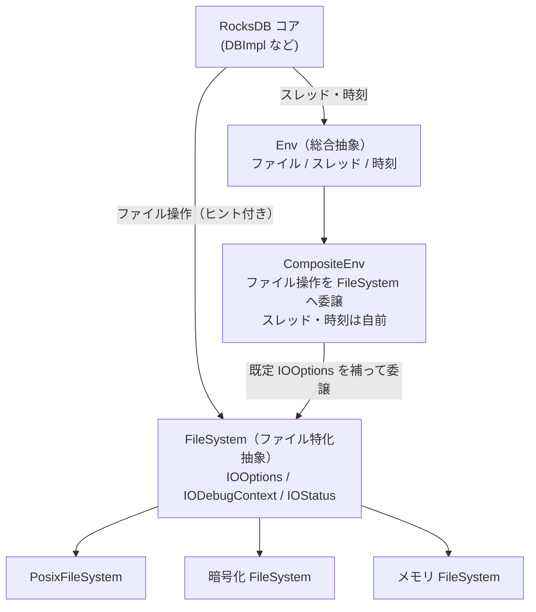

# 第46章 Env と FileSystem

> **本章で読むソース**
> - [`include/rocksdb/env.h`](https://github.com/facebook/rocksdb/blob/v11.1.1/include/rocksdb/env.h)
> - [`include/rocksdb/file_system.h`](https://github.com/facebook/rocksdb/blob/v11.1.1/include/rocksdb/file_system.h)
> - [`include/rocksdb/io_status.h`](https://github.com/facebook/rocksdb/blob/v11.1.1/include/rocksdb/io_status.h)
> - [`env/composite_env_wrapper.h`](https://github.com/facebook/rocksdb/blob/v11.1.1/env/composite_env_wrapper.h)
> - [`env/composite_env.cc`](https://github.com/facebook/rocksdb/blob/v11.1.1/env/composite_env.cc)
> - [`env/fs_posix.cc`](https://github.com/facebook/rocksdb/blob/v11.1.1/env/fs_posix.cc)

## この章の狙い

RocksDB は OS の API をコードのあちこちで直接叩かない。
ファイルの生成、読み書き、スレッドの起動、時刻の取得を、すべて `Env` と `FileSystem` という抽象インタフェース越しに行う。
本章では、この二つの抽象がなぜ二重に存在するのか、後発の `FileSystem` が `IOOptions` と `IODebugContext` で何を運ぶのか、そして旧来の `Env` 呼び出しを `CompositeEnv` がどう新しい `FileSystem` へ橋渡しするのかを、実コードから読み解く。
あわせて、I/O 専用のエラー型 `IOStatus` がなぜ通常の `Status` と別に用意されているのかを見る。

## 前提

- [第6章 DB と Options](../part01-data-model/06-db-and-options.md)：`Env` と `FileSystem` は `DBOptions::env` / `DBOptions::file_system` として DB に渡される。
- [第43章 ThreadLocal とスレッドプール](../part08-concurrency/43-threadlocal-threadpool.md)：`Env::Schedule` が背景ジョブを投入するスレッドプールの実装。

ファイル I/O の中身（バッファリング、プリフェッチ、direct I/O）は[第47章 ファイル I/O とプリフェッチ](47-file-io-prefetch.md)で扱う。
本章は、その下に敷かれた抽象の層そのものを対象にする。

## 抽象化の目的

RocksDB がストレージへ触れる経路を一点に集めれば、そこを差し替えるだけで動作環境を変えられる。
POSIX のファイルシステムの上で動かすのが既定だが、テストでは全データをメモリに置く実装に、本番では暗号化を挟む実装に、あるいは故障を意図的に起こす実装に置き換えたい。
これらをコア側のコードに手を入れずに実現するために、ファイル操作・スレッド・時刻を仮想関数の集合として括り出したものが `Env` である。

ヘッダのコメントが、`Env` の守備範囲を三つに分けて示している。

[`include/rocksdb/env.h` L146-L150](https://github.com/facebook/rocksdb/blob/v11.1.1/include/rocksdb/env.h#L146-L150)

```cpp
// An interface that abstracts RocksDB's interactions with the operating system
// environment. There are three main types of APIs:
// 1) File system operations, like creating a file, writing to a file, etc.
// 2) Thread management.
// 3) Misc functions, like getting the current time.
```

`Env` は LevelDB から受け継いだ歴史的な総合抽象である。
ファイル、スレッド、時刻という性質の異なる三つの責務を一つのクラスに同居させている。
この一体構造が、後に `FileSystem` を分離する動機になる。

利用側がどの実装を使うかは、既定の入口 `Env::Default()` で決まる。
これはプロセスに一つだけ存在する POSIX 実装への入口で、返したポインタは RocksDB の所有物として扱う。

[`include/rocksdb/env.h` L211-L216](https://github.com/facebook/rocksdb/blob/v11.1.1/include/rocksdb/env.h#L211-L216)

```cpp
  // Return a default environment suitable for the current operating
  // system.  Sophisticated users may wish to provide their own Env
  // implementation instead of relying on this default environment.
  //
  // The result of Default() belongs to rocksdb and must never be deleted.
  static Env* Default();
```

POSIX 版の `Env::Default()` は、静的記憶域に置いた一個の `PosixEnv` を返す。

[`env/env_posix.cc` L500-L520](https://github.com/facebook/rocksdb/blob/v11.1.1/env/env_posix.cc#L500-L520)

```cpp
Env* Env::Default() {
  // ... (中略：ThreadLocalPtr 等のシングルトン初期化) ...
  ThreadLocalPtr::InitSingletons();
  CompressionContextCache::InitSingleton();
  INIT_SYNC_POINT_SINGLETONS();
  // Avoid problems with accessing most members of Env::Default() during
  // static destruction.
  STATIC_AVOID_DESTRUCTION(PosixEnv, default_env);
  // This destructor must be called on exit
  static PosixEnv::JoinThreadsOnExit thread_joiner(default_env);
  return &default_env;
}
```

ここで返る `PosixEnv` が、本章の主題である二つの抽象の接続点になっている。

## ファイル操作に特化した FileSystem

`Env` の三責務のうち、ファイル操作だけを切り出して新しく定義したのが `FileSystem` である。
分離の理由は、I/O ごとに細かい制御情報を渡せるようにすることにあった。
ヘッダのコメントが、その設計意図を述べている。

[`include/rocksdb/file_system.h` L338-L353](https://github.com/facebook/rocksdb/blob/v11.1.1/include/rocksdb/file_system.h#L338-L353)

```cpp
// The FileSystem, FSSequentialFile, FSRandomAccessFile, FSWritableFile,
// FSRandomRWFileclass, and FSDIrectory classes define the interface between
// RocksDB and storage systems, such as Posix filesystems,
// remote filesystems etc.
// The interface allows for fine grained control of individual IO operations,
// such as setting a timeout, prioritization, hints on data placement,
// different handling based on type of IO etc.
// This is accomplished by passing an instance of IOOptions to every
// API call that can potentially perform IO. Additionally, each such API is
// passed a pointer to a IODebugContext structure that can be used by the
// storage system to include troubleshooting information. The return values
// of the APIs is of type IOStatus, which can indicate an error code/sub-code,
// as well as metadata about the error such as its scope and whether its
// retryable.
// NewCompositeEnv can be used to create an Env with a custom FileSystem for
```

旧来の `Env` のファイル系メソッドは、引数にファイル名と `EnvOptions` しか取らない。
タイムアウトの希望や、書こうとしているデータの種別を呼び出しごとに伝える口がない。
`FileSystem` は、その口を三点で開いた。
I/O ごとのヒントを運ぶ `IOOptions`、診断情報を受け渡す `IODebugContext`、そして I/O 専用の戻り値型 `IOStatus` である。

`FileSystem` の入口メソッドは、いずれもこの三点を引数と戻り値に並べる。
書き込みファイルを開く `NewWritableFile` を例に取る。

[`include/rocksdb/file_system.h` L455-L458](https://github.com/facebook/rocksdb/blob/v11.1.1/include/rocksdb/file_system.h#L455-L458)

```cpp
  virtual IOStatus NewWritableFile(const std::string& fname,
                                   const FileOptions& file_opts,
                                   std::unique_ptr<FSWritableFile>* result,
                                   IODebugContext* dbg) = 0;
```

戻り値が `IOStatus`、診断用に `IODebugContext*` を取る点が、旧 `Env` 版（戻り値は `Status`）との違いである。
順次読みの `NewSequentialFile` とランダム読みの `NewRandomAccessFile` も同じ形で、それぞれ `FSSequentialFile` と `FSRandomAccessFile` を生成する。

[`include/rocksdb/file_system.h` L422-L436](https://github.com/facebook/rocksdb/blob/v11.1.1/include/rocksdb/file_system.h#L422-L436)

```cpp
  virtual IOStatus NewSequentialFile(const std::string& fname,
                                     const FileOptions& file_opts,
                                     std::unique_ptr<FSSequentialFile>* result,
                                     IODebugContext* dbg) = 0;

  // ... (中略：コメント) ...
  virtual IOStatus NewRandomAccessFile(
      const std::string& fname, const FileOptions& file_opts,
      std::unique_ptr<FSRandomAccessFile>* result, IODebugContext* dbg) = 0;
```

### ファイル種別ごとの抽象

開いたファイルそのものも、用途別の抽象クラスに分かれている。
書き込み、ランダム読み、順次読み、ディレクトリで、できる操作も最適な実装も異なるからである。

書き込みは `FSWritableFile` が表す。
末尾追記の `Append` は、データに加えて `IOOptions` と `IODebugContext*` を取る。

[`include/rocksdb/file_system.h` L1098-L1122](https://github.com/facebook/rocksdb/blob/v11.1.1/include/rocksdb/file_system.h#L1098-L1122)

```cpp
class FSWritableFile {
 public:
  // ... (中略：コンストラクタ) ...
  // Append data to the end of the file
  // Note: A WritableFile object must support either Append or
  // PositionedAppend, so the users cannot mix the two.
  virtual IOStatus Append(const Slice& data, const IOOptions& options,
                          IODebugContext* dbg) = 0;
```

ランダム読みは `FSRandomAccessFile` で、オフセットを指定する `Read` を持つ。
コメントが述べるとおり複数スレッドから同時に呼んでよく、SST の読み出しのように任意位置を並行に読む用途に向く。

[`include/rocksdb/file_system.h` L936-L958](https://github.com/facebook/rocksdb/blob/v11.1.1/include/rocksdb/file_system.h#L936-L958)

```cpp
class FSRandomAccessFile {
 public:
  // ... (中略) ...
  // Safe for concurrent use by multiple threads.
  // If Direct I/O enabled, offset, n, and scratch should be aligned properly.
  virtual IOStatus Read(uint64_t offset, size_t n, const IOOptions& options,
                        Slice* result, char* scratch,
                        IODebugContext* dbg) const = 0;
```

順次読みは `FSSequentialFile` で、現在位置から前方へ読み進める `Read` を持つ。
こちらは外部同期が前提（`REQUIRES: External synchronization`）で、WAL の再生のように先頭から舐める用途に向く。

[`include/rocksdb/file_system.h` L806-L825](https://github.com/facebook/rocksdb/blob/v11.1.1/include/rocksdb/file_system.h#L806-L825)

```cpp
class FSSequentialFile {
 public:
  // ... (中略) ...
  // REQUIRES: External synchronization
  virtual IOStatus Read(size_t n, const IOOptions& options, Slice* result,
                        char* scratch, IODebugContext* dbg) = 0;
```

ディレクトリは `FSDirectory` が表す。
中心は `Fsync` で、新しく作ったファイルのディレクトリエントリを永続化するために使う。

[`include/rocksdb/file_system.h` L1437-L1444](https://github.com/facebook/rocksdb/blob/v11.1.1/include/rocksdb/file_system.h#L1437-L1444)

```cpp
class FSDirectory {
 public:
  // ... (中略：デストラクタ) ...
  // Fsync directory. Can be called concurrently from multiple threads.
  virtual IOStatus Fsync(const IOOptions& options, IODebugContext* dbg) = 0;
```

四つの抽象は、それぞれの操作に合わせて契約を最小限にしている。
順次読みは外部同期前提で実装を単純に保ち、ランダム読みは並行アクセスを許して読み出しの並列度を上げる。
契約を用途ごとに分けることで、実装側は不要な同期や状態を持たずに済む。

## IOOptions による I/O ヒントの伝達

`FileSystem` が `Env` から得た最大の能力が、`IOOptions` による呼び出しごとのヒント伝達である。
RocksDB のコア側は、これから行う I/O が何のためのものか（フラッシュか、コンパクションか、ユーザーの `Get` か）、どの種別のデータを触るか（データブロックか、WAL か、MANIFEST か）を知っている。
その文脈を `IOOptions` に詰めて下層へ渡せば、ストレージ実装は種別ごとに配置先や扱いを変えられる。

[`include/rocksdb/file_system.h` L100-L146](https://github.com/facebook/rocksdb/blob/v11.1.1/include/rocksdb/file_system.h#L100-L146)

```cpp
struct IOOptions {
  // Timeout for the operation in microseconds
  std::chrono::microseconds timeout;
  // ... (中略) ...
  // Priority used to charge rate limiter configured in file system level (if
  // any)
  // ... (中略) ...
  Env::IOPriority rate_limiter_priority;

  // Type of data being read/written
  IOType type;
  // ... (中略：property_bag, force_dir_fsync 等) ...
  // EXPERIMENTAL
  Env::IOActivity io_activity = Env::IOActivity::kUnknown;
```

`type` が運ぶデータ種別は `IOType` 列挙で、データ、フィルタ、インデックス、メタデータ、WAL、MANIFEST などを区別する。

[`include/rocksdb/file_system.h` L72-L82](https://github.com/facebook/rocksdb/blob/v11.1.1/include/rocksdb/file_system.h#L72-L82)

```cpp
enum class IOType : uint8_t {
  kData,
  kFilter,
  kIndex,
  kMetadata,
  kWAL,
  kManifest,
  kLog,
  kUnknown,
  kInvalid,
};
```

これらのフィールドはヒントであり、強制ではない。
ヘッダは `IOOptions` を「下層に渡せる要求ごとのオプション。これらはヒントであり、必ず守られるとは限らない」と説明している。

[`include/rocksdb/file_system.h` L96-L99](https://github.com/facebook/rocksdb/blob/v11.1.1/include/rocksdb/file_system.h#L96-L99)

```cpp
// Per-request options that can be passed down to the FileSystem
// implementation. These are hints and are not necessarily guaranteed to be
// honored. More hints can be added here in the future to indicate things like
// storage media (HDD/SSD) to be used, replication level etc.
```

ヒントに留める設計が、抽象の差し替え可能性と両立している。
ヒントを理解しない単純な実装は無視すればよく、理解する実装だけが種別に応じた最適化（種別ごとに別の記憶媒体へ置く、リミッタの請求先を分ける）を行える。
強制ではないため、どの `FileSystem` も同じインタフェースを実装したまま、最適化の有無だけを選べる。

ファイルを開くときは、`IOOptions` を内包した `FileOptions` を渡す。
`FileOptions` は `EnvOptions` を継承し、I/O 用のヒント（`io_options`）と、書き出すファイルの温度（`temperature`）やハンドオフ用チェックサム種別を加えた構造体である。

[`include/rocksdb/file_system.h` L182-L201](https://github.com/facebook/rocksdb/blob/v11.1.1/include/rocksdb/file_system.h#L182-L201)

```cpp
struct FileOptions : EnvOptions {
  // Embedded IOOptions to control the parameters for any IOs that need
  // to be issued for the file open/creation
  IOOptions io_options;

  // EXPERIMENTAL
  // ... (中略) ...
  // underlying file systems can put it with appropriate storage media and/or
  // coding.
  Temperature temperature = Temperature::kUnknown;

  // The checksum type that is used to calculate the checksum value for
  // handoff during file writes.
  ChecksumType handoff_checksum_type;
```

もう一方の `IODebugContext` は逆向きの情報路である。
コア側からはファイルパスやトレース用のリクエスト ID を渡し、`FileSystem` 実装側はカウンタやコスト情報を書き戻す。
I/O トレース（第52章）が、この構造体を通じて下層の挙動を観測する。

[`include/rocksdb/file_system.h` L243-L255](https://github.com/facebook/rocksdb/blob/v11.1.1/include/rocksdb/file_system.h#L243-L255)

```cpp
struct IODebugContext {
  // file_path to be filled in by RocksDB in case of an error
  std::string file_path;

  // A map of counter names to values - set by the FileSystem implementation
  std::map<std::string, uint64_t> counters;

  // To be set by the FileSystem implementation
  std::string msg;

  // To be set by the application, to allow tracing logs/metrics from user ->
  // RocksDB -> FS.
  const std::string* request_id = nullptr;
```

## CompositeEnv による橋渡し

二つの抽象が並立すると、RocksDB のコードは旧 `Env` と新 `FileSystem` のどちらを呼べばよいか迷う。
この迷いを消すのが `CompositeEnv` である。
スレッドと時刻に関わる呼び出しは下層の `Env` 実装へ、ファイル操作はすべて `FileSystem` 実装へ振り分け、外からは一個の `Env` に見せる。

`CompositeEnv` は `Env` を継承し、ファイル系のメソッドを `file_system_`（保持している `FileSystem`）へ転送する。

[`env/composite_env_wrapper.h` L28-L41](https://github.com/facebook/rocksdb/blob/v11.1.1/env/composite_env_wrapper.h#L28-L41)

```cpp
class CompositeEnv : public Env {
 public:
  // Initialize a CompositeEnvWrapper that delegates all thread/time related
  // calls to env, and all file operations to fs
  explicit CompositeEnv(const std::shared_ptr<FileSystem>& fs,
                        const std::shared_ptr<SystemClock>& clock)
      : Env(fs, clock) {}

  Status RegisterDbPaths(const std::vector<std::string>& paths) override {
    return file_system_->RegisterDbPaths(paths);
  }
```

転送の要は、旧 API には無い `IOOptions` と `IODebugContext` をここで補うことである。
旧 `Env::NewSequentialFile` は `IOOptions` を取らないので、`CompositeEnv` が既定値の `IOOptions`（`FileOptions` 経由）と空の `IODebugContext` をその場で作って `FileSystem` へ渡す。

[`env/composite_env.cc` L299-L311](https://github.com/facebook/rocksdb/blob/v11.1.1/env/composite_env.cc#L299-L311)

```cpp
Status CompositeEnv::NewSequentialFile(const std::string& f,
                                       std::unique_ptr<SequentialFile>* r,
                                       const EnvOptions& options) {
  IODebugContext dbg;
  std::unique_ptr<FSSequentialFile> file;
  Status status;
  status =
      file_system_->NewSequentialFile(f, FileOptions(options), &file, &dbg);
  if (status.ok()) {
    r->reset(new CompositeSequentialFileWrapper(file));
  }
  return status;
}
```

生成された `FSSequentialFile` は、そのままでは旧 API を期待する呼び出し元に渡せない。
`Read` の引数が新旧で違うからである。
そこで `CompositeSequentialFileWrapper` が `SequentialFile`（旧型）を装い、`Read` を `FSSequentialFile::Read`（新型）へ取り次ぐ。
ここでも `IOOptions` と `IODebugContext` を内部で補う。

[`env/composite_env.cc` L28-L32](https://github.com/facebook/rocksdb/blob/v11.1.1/env/composite_env.cc#L28-L32)

```cpp
  Status Read(size_t n, Slice* result, char* scratch) override {
    IOOptions io_opts;
    IODebugContext dbg;
    return target_->Read(n, io_opts, result, scratch, &dbg);
  }
```

橋渡しは入口（ファイルを開く）と出口（開いたファイルを読む）の両方で同じ形を取る。
旧 API で呼ばれた瞬間に既定の `IOOptions` を合成し、新 API へ落とす。
この仕組みのおかげで、ヒントを渡したいコア側は `FileSystem` を直接呼び、旧来どおり `Env` を呼ぶコードはそのまま動く。



POSIX 環境では、この図の `CompositeEnv` が `PosixEnv` として具体化する。
`PosixEnv` は `CompositeEnv` を継承し、ファイル側に `FileSystem::Default()`、時刻側に `SystemClock::Default()` を据えて構築される。

[`env/env_posix.cc` L421-L422](https://github.com/facebook/rocksdb/blob/v11.1.1/env/env_posix.cc#L421-L422)

```cpp
PosixEnv::PosixEnv()
    : CompositeEnv(FileSystem::Default(), SystemClock::Default()),
```

その `FileSystem::Default()` が返すのは、唯一の `PosixFileSystem` インスタンスである。

[`env/fs_posix.cc` L1359-L1363](https://github.com/facebook/rocksdb/blob/v11.1.1/env/fs_posix.cc#L1359-L1363)

```cpp
std::shared_ptr<FileSystem> FileSystem::Default() {
  STATIC_AVOID_DESTRUCTION(std::shared_ptr<FileSystem>, instance)
  (std::make_shared<PosixFileSystem>());
  return instance;
}
```

`PosixFileSystem` は `FileSystem` の純粋仮想メソッドを `open`・`pread`・`write` などの POSIX システムコールで埋める。
書き込みファイルの生成は、共通ルーチン `OpenWritableFile` に委ねている。

[`env/fs_posix.cc` L372-L376](https://github.com/facebook/rocksdb/blob/v11.1.1/env/fs_posix.cc#L372-L376)

```cpp
  IOStatus NewWritableFile(const std::string& fname, const FileOptions& options,
                           std::unique_ptr<FSWritableFile>* result,
                           IODebugContext* dbg) override {
    return OpenWritableFile(fname, options, false, result, dbg);
  }
```

## IOStatus による I/O エラーの分離

`FileSystem` の全メソッドが返す `IOStatus` は、通常の `Status`（第4章周辺で扱う汎用の結果型）を継承し、I/O 固有のメタ情報を足した型である。
分離の狙いは、エラーハンドリング（第52章）が I/O エラーを種類に応じて扱えるようにすることにある。

[`include/rocksdb/io_status.h` L28-L60](https://github.com/facebook/rocksdb/blob/v11.1.1/include/rocksdb/io_status.h#L28-L60)

```cpp
class IOStatus : public Status {
 public:
  using Code = Status::Code;
  using SubCode = Status::SubCode;

  enum IOErrorScope : unsigned char {
    kIOErrorScopeFileSystem,
    kIOErrorScopeFile,
    kIOErrorScopeRange,
    kIOErrorScopeMax,
  };
  // ... (中略) ...
  void SetRetryable(bool retryable) { retryable_ = retryable; }
  void SetDataLoss(bool data_loss) { data_loss_ = data_loss; }
  void SetScope(IOErrorScope scope) {
    scope_ = static_cast<unsigned char>(scope);
  }

  bool GetRetryable() const { return retryable_; }
  bool GetDataLoss() const { return data_loss_; }
  IOErrorScope GetScope() const { return static_cast<IOErrorScope>(scope_); }
```

`Status` が持つエラーコードに加えて、`IOStatus` は三つのメタ情報を持つ。
再試行してよいか（`retryable_`）、データ損失を伴うか（`data_loss_`）、そしてエラーの及ぶ範囲（`scope_`）である。
`scope_` は、障害がファイルシステム全体か、特定ファイルか、ある範囲かを区別する。
上位のエラーハンドリングは、これを見て対処を変えられる。
再試行可能な一時的エラーなら待って再実行し、データ損失を伴うなら DB を読み取り専用にする、といった判断である。

`Status` から `IOStatus` への変換が必要な場面のために、専用の関数も用意されている。
`status_to_io_status` は、`Status` を `IOStatus` のスロットへムーブして包み直す。

[`include/rocksdb/io_status.h` L237-L242](https://github.com/facebook/rocksdb/blob/v11.1.1/include/rocksdb/io_status.h#L237-L242)

```cpp
inline IOStatus status_to_io_status(Status&& status) {
  IOStatus io_s;
  Status& s = io_s;
  s = std::move(status);
  return io_s;
}
```

`IOStatus` を `Status` と別の型にした効果は、型そのものが情報を運ぶことである。
関数の戻り値が `IOStatus` なら、その失敗は I/O 由来だと型レベルで判別でき、`retryable` や `scope` といった I/O 特有の属性を呼び出し元が無条件に参照できる。
汎用の `Status` のままでは、これらの属性を別の経路で持ち回す必要があった。

## 差し替えの実例

抽象を `FileSystem` に集めた成果は、実装を丸ごと入れ替えても上位が無変更で動く点に現れる。
RocksDB 本体にも、既定の `PosixFileSystem` 以外の実装が同梱されている。

暗号化は `env_encryption` が提供する。
これは下層の `FileSystem` をラップし、`Append` で書く直前にデータを暗号化し、`Read` で読んだ直後に復号する中間層を挟む。
コア側は `FSWritableFile::Append` を呼ぶだけで、平文を扱っているか暗号文を扱っているかを意識しない。

テスト用の故障注入も同じ構図で実現する。
ラッパが `IOStatus` を本物の I/O の代わりに（あるいは本物の I/O の後に）差し込み、`NoSpace` や `IOError` を意図したタイミングで返す。
`IOStatus` の `retryable` や `data_loss` をテスト側で設定できるため、上位のエラーハンドリングが各分類を正しく処理するかを、実際のディスク障害を起こさずに検証できる。

カスタムの `FileSystem` を `DBOptions::env` に渡す経路として、`NewCompositeEnv` が公開されている。
任意の `FileSystem` を `Env::Default()` のスレッド・時刻機構と組み合わせて、一個の `Env` に仕立てる。

[`include/rocksdb/env.h` L2064-L2066](https://github.com/facebook/rocksdb/blob/v11.1.1/include/rocksdb/env.h#L2064-L2066)

```cpp
// Creates a new Env based on Env::Default() but modified to use the specified
// FileSystem.
std::unique_ptr<Env> NewCompositeEnv(const std::shared_ptr<FileSystem>& fs);
```

ファイル I/O の実装だけを差し替えたい利用者は、`FileSystem` だけを実装して `NewCompositeEnv` に渡せばよい。
スレッドや時刻の機構を再実装する必要はない。

## まとめ

- RocksDB は OS とストレージへの依存を `Env` と `FileSystem` の抽象に集約し、ここを差し替えるだけで POSIX 以外（メモリ、暗号化、故障注入）の環境へ載せ替えられる。
- `Env` は LevelDB 由来の総合抽象で、ファイル・スレッド・時刻を一体で持つ。後発の `FileSystem` はファイル操作だけを切り出し、`IOOptions`・`IODebugContext`・`IOStatus` の三点を全メソッドに通す。
- `IOOptions` は I/O ごとのヒント（種別 `IOType`、タイムアウト、リミッタ優先度など）を下層へ運ぶ。ヒントは強制ではないため、理解しない実装は無視でき、抽象の互換性が保たれる。
- `CompositeEnv` は旧 `Env` 呼び出しを `FileSystem` へ委譲し、欠けている `IOOptions`／`IODebugContext` を既定値で補う。POSIX では `PosixEnv` がこれを `FileSystem::Default()` と組み合わせて具体化する。
- ファイルは用途別に `FSWritableFile`・`FSRandomAccessFile`・`FSSequentialFile`・`FSDirectory` に分かれ、それぞれ契約を最小限にして実装を単純化している。
- `IOStatus` は `Status` を継承し、`retryable`・`data_loss`・`scope` という I/O 固有のメタ情報を型に持たせる。上位のエラーハンドリングが障害の種類に応じて対処を選べる。

## 関連する章

- [第6章 DB と Options](../part01-data-model/06-db-and-options.md)：`Env` / `FileSystem` を DB に渡す `DBOptions` の構造。
- [第43章 ThreadLocal とスレッドプール](../part08-concurrency/43-threadlocal-threadpool.md)：`Env::Schedule` が背景ジョブを投入するスレッドプールの実装。
- [第47章 ファイル I/O とプリフェッチ](47-file-io-prefetch.md)：本章の抽象の上に立つ、実際のファイル I/O とバッファリングの処理。
- [第52章 エラーハンドリングとトレース、バインディング](../part10-advanced/52-error-handling-trace-bindings.md)：`IOStatus` の `retryable` / `scope` を見て障害へ対処する仕組みと、`IODebugContext` を使う I/O トレース。
