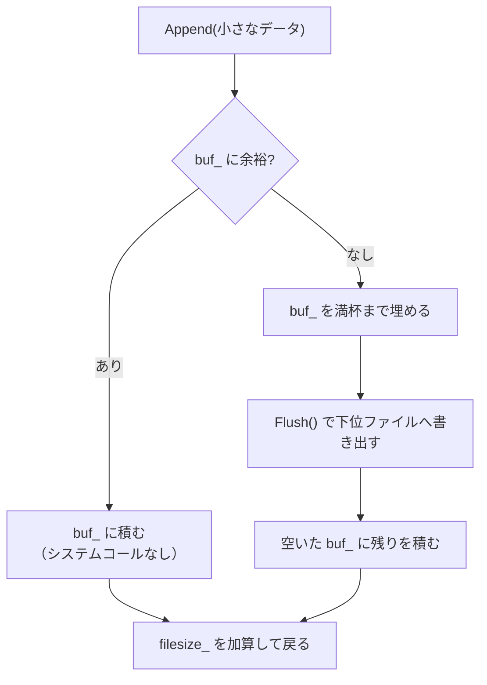
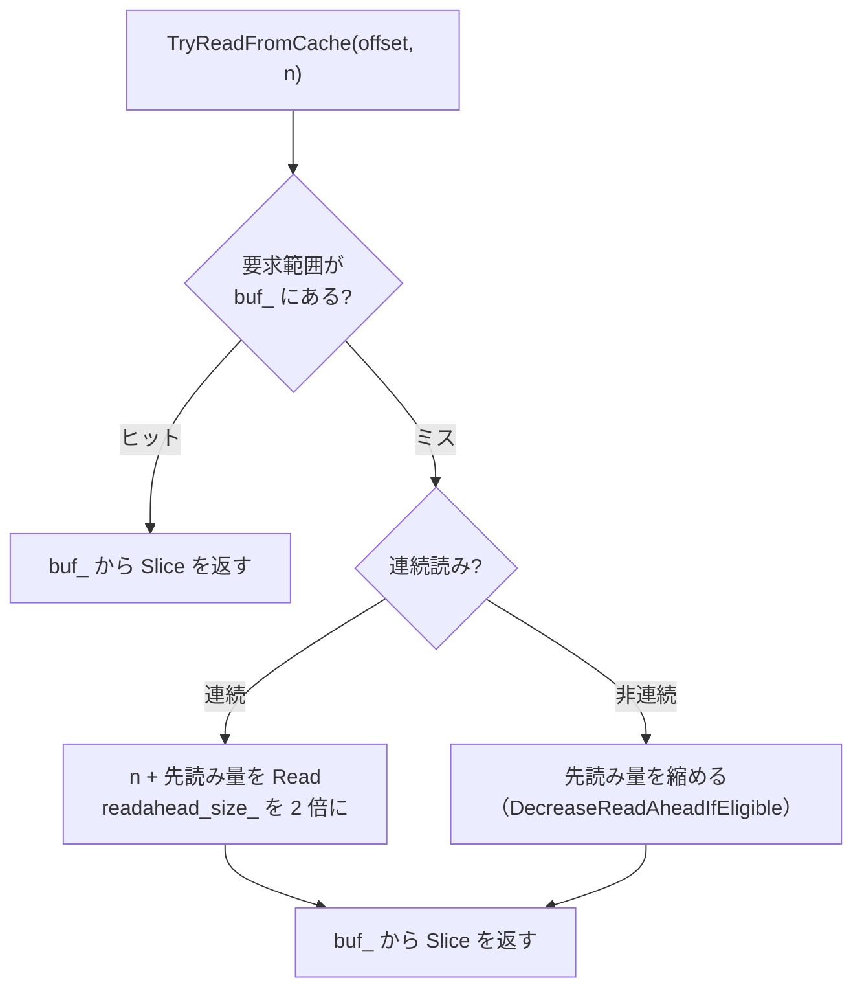

# 第47章 ファイル I/O と先読み

> **本章で読むソース**
> - [`file/writable_file_writer.h`](https://github.com/facebook/rocksdb/blob/v11.1.1/file/writable_file_writer.h)
> - [`file/writable_file_writer.cc`](https://github.com/facebook/rocksdb/blob/v11.1.1/file/writable_file_writer.cc)
> - [`file/random_access_file_reader.h`](https://github.com/facebook/rocksdb/blob/v11.1.1/file/random_access_file_reader.h)
> - [`file/random_access_file_reader.cc`](https://github.com/facebook/rocksdb/blob/v11.1.1/file/random_access_file_reader.cc)
> - [`file/file_prefetch_buffer.h`](https://github.com/facebook/rocksdb/blob/v11.1.1/file/file_prefetch_buffer.h)
> - [`file/file_prefetch_buffer.cc`](https://github.com/facebook/rocksdb/blob/v11.1.1/file/file_prefetch_buffer.cc)
> - [`file/readahead_raf.h`](https://github.com/facebook/rocksdb/blob/v11.1.1/file/readahead_raf.h)

## この章の狙い

第46章で見た `FileSystem` の抽象の上に、RocksDB は生のファイルを直接は触らない層を一段重ねている。
本章では、その上位ラッパである `WritableFileWriter` と `RandomAccessFileReader`、そして読みを先回りする `FilePrefetchBuffer` を読む。
小さな書き込みをまとめてからディスクへ送る仕組みと、スキャンやコンパクションの読みを先読みで効率化する仕組みを、実コードの行を追って理解する。

## 前提

- [第46章 Env と FileSystem](46-env-filesystem.md)
- [第21章 チェックサム](../part03-sst/21-checksum.md)（書きながら計算するチェックサムの中身）
- [第44章 レートリミッタ](../part08-concurrency/44-rate-limiter.md)（I/O をならすトークン制御）

## なぜ上位ラッパを通すのか

`FileSystem` が返す `FSWritableFile` や `FSRandomAccessFile` は、OS のファイルに一対一で対応する素朴なインターフェースである。
ここに `Append` を一回呼ぶたびにシステムコールが一回飛ぶと考えてよい。
SST のブロックや WAL のレコードは数十バイトから数キロバイトと小さく、これを一件ずつ書いていてはシステムコールの回数が増えて遅い。

そこで RocksDB は、上位の書き手と下位のファイルのあいだに `WritableFileWriter` を挟む。
このクラスの責務は、ヘッダのコメントが列挙している。

[`file/writable_file_writer.h` L33-L39](https://github.com/facebook/rocksdb/blob/v11.1.1/file/writable_file_writer.h#L33-L39)

```cpp
// WritableFileWriter is a wrapper on top of Env::WritableFile. It provides
// facilities to:
// - Handle Buffered and Direct writes.
// - Rate limit writes.
// - Flush and Sync the data to the underlying filesystem.
// - Notify any interested listeners on the completion of a write.
// - Update IO stats.
```

読み側の `RandomAccessFileReader` も対称的な責務を持つ。
バッファ I/O とダイレクト I/O の使い分け、コンパクション読みのレート制御、リスナー通知、統計の更新である。

[`file/random_access_file_reader.h` L41-L46](https://github.com/facebook/rocksdb/blob/v11.1.1/file/random_access_file_reader.h#L41-L46)

```cpp
// RandomAccessFileReader is a wrapper on top of FSRandomAccessFile. It is
// responsible for:
// - Handling Buffered and Direct reads appropriately.
// - Rate limiting compaction reads.
// - Notifying any interested listeners on the completion of a read.
// - Updating IO stats.
```

これらは下位ファイルの単純さを保ったまま、性能と運用に必要な機能を一箇所に集約する層である。
本章で掘り下げる最適化は二つある。
書き込み側の「バッファリングとアライン書き込み」と、読み側の「先読み」である。

## 書き込みをためる（WritableFileWriter）

### Append は即座には書かない

`Append` の役割は、渡されたデータを内部バッファ `buf_` に積むことである。
コンストラクタは `Options::writable_file_max_buffer_size`（既定 1MB）を上限として、初期 64KB のバッファを確保する。

[`file/writable_file_writer.h` L207-L211](https://github.com/facebook/rocksdb/blob/v11.1.1/file/writable_file_writer.h#L207-L211)

```cpp
    assert(!use_direct_io() || max_buffer_size_ > 0);
    TEST_SYNC_POINT_CALLBACK("WritableFileWriter::WritableFileWriter:0",
                             reinterpret_cast<void*>(max_buffer_size_));
    buf_.Alignment(writable_file_->GetRequiredBufferAlignment());
    buf_.AllocateNewBuffer(std::min((size_t)65536, max_buffer_size_));
```

`Append` はまずチェックサムを更新し、その後バッファに余裕があるかを見る。
余裕が足りなければ、バッファ容量を上限まで倍々で広げてフラッシュを避けようとする。

[`file/writable_file_writer.cc` L91-L105](https://github.com/facebook/rocksdb/blob/v11.1.1/file/writable_file_writer.cc#L91-L105)

```cpp
  // See whether we need to enlarge the buffer to avoid the flush
  if (buf_.Capacity() - buf_.CurrentSize() < left) {
    for (size_t cap = buf_.Capacity();
         cap < max_buffer_size_;  // There is still room to increase
         cap *= 2) {
      // See whether the next available size is large enough.
      // Buffer will never be increased to more than max_buffer_size_.
      size_t desired_capacity = std::min(cap * 2, max_buffer_size_);
      if (desired_capacity - buf_.CurrentSize() >= left ||
          (use_direct_io() && desired_capacity == max_buffer_size_)) {
        buf_.AllocateNewBuffer(desired_capacity, true);
        break;
      }
    }
  }
```

それでもバッファに収まらないとき、バッファ I/O では `Flush` を呼んで中身を吐き出してから続きを積む。

[`file/writable_file_writer.cc` L107-L125](https://github.com/facebook/rocksdb/blob/v11.1.1/file/writable_file_writer.cc#L107-L125)

```cpp
  // Flush only when buffered I/O
  if (!use_direct_io() && (buf_.Capacity() - buf_.CurrentSize()) < left) {
    if (buf_.CurrentSize() > 0) {
      if (!buffered_data_with_checksum_) {
        // If we're not calculating checksum of buffered data, fill the
        // buffer before flushing so that the writes are aligned. This will
        // benefit file system performance.
        size_t appended = buf_.Append(src, left);
        left -= appended;
        src += appended;
      }
      s = Flush(io_options);
      if (!s.ok()) {
        set_seen_error(s);
        return s;
      }
    }
    assert(buf_.CurrentSize() == 0);
  }
```

ここに最初の工夫が現れている。
フラッシュ直前にバッファを満杯まで埋めてから書く（L110-L117）のは、ファイルシステムへの書き込みがバッファ境界に揃うほど速いからである。
小さな `Append` を多数受けても、ディスクへ向かう書き込みはまとまった単位になる。



積んだデータが実際にファイルへ向かうのは `Flush` の中である。
`Flush` はバッファに中身があればダイレクト I/O かバッファ I/O かで書き出し方を分岐し、その後に下位ファイルの `Flush`（OS キャッシュへの送り出し）を呼ぶ。

[`file/writable_file_writer.cc` L368-L389](https://github.com/facebook/rocksdb/blob/v11.1.1/file/writable_file_writer.cc#L368-L389)

```cpp
  if (buf_.CurrentSize() > 0) {
    if (use_direct_io()) {
      if (pending_sync_) {
        if (perform_data_verification_ && buffered_data_with_checksum_) {
          s = WriteDirectWithChecksum(io_options);
        } else {
          s = WriteDirect(io_options);
        }
      }
    } else {
      if (perform_data_verification_ && buffered_data_with_checksum_) {
        s = WriteBufferedWithChecksum(io_options, buf_.BufferStart(),
                                      buf_.CurrentSize());
      } else {
        s = WriteBuffered(io_options, buf_.BufferStart(), buf_.CurrentSize());
      }
    }
```

### バッファ I/O での書き出しとレート制御

`WriteBuffered` は、バッファの中身を下位ファイルの `Append` へ流す。
レートリミッタが設定されていれば、一度に書ける量をトークンとして要求し、許された分だけを書くループを回す。

[`file/writable_file_writer.cc` L592-L599](https://github.com/facebook/rocksdb/blob/v11.1.1/file/writable_file_writer.cc#L592-L599)

```cpp
  while (left > 0) {
    size_t allowed = left;
    if (rate_limiter_ != nullptr &&
        rate_limiter_priority_used != Env::IO_TOTAL) {
      allowed = rate_limiter_->RequestToken(left, 0 /* alignment */,
                                            rate_limiter_priority_used, stats_,
                                            RateLimiter::OpType::kWrite);
    }
```

`RequestToken` はレートリミッタが許す範囲に書き込み量を切り詰めて返す。
これによりフラッシュやコンパクションの書き I/O が瞬間的に帯域を食い潰すのを防ぐ。
レートリミッタの仕組みは第44章に譲る。

### ダイレクト I/O のアライン書き込み

ダイレクト I/O では OS のページキャッシュを通さずにデバイスへ直接書くため、書き込みのオフセットと長さがブロック境界（アラインメント）に揃っている必要がある。
バッファに積まれたデータは任意の長さなので、そのままでは書けない。
`WriteDirect` は、バッファの中身を「ページ境界までの本体」と「端数の尾部」に分けて扱う。

[`file/writable_file_writer.cc` L794-L811](https://github.com/facebook/rocksdb/blob/v11.1.1/file/writable_file_writer.cc#L794-L811)

```cpp
  const size_t alignment = buf_.Alignment();
  assert((next_write_offset_ % alignment) == 0);

  // Calculate whole page final file advance if all writes succeed
  const size_t file_advance =
      TruncateToPageBoundary(alignment, buf_.CurrentSize());

  // Calculate the leftover tail, we write it here padded with zeros BUT we
  // will write it again in the future either on Close() OR when the current
  // whole page fills out.
  const size_t leftover_tail = buf_.CurrentSize() - file_advance;

  // Round up and pad
  buf_.PadToAlignmentWith(0);

  const char* src = buf_.BufferStart();
  uint64_t write_offset = next_write_offset_;
  size_t left = buf_.CurrentSize();
```

`file_advance` はページ境界に丸めた本体の長さ、`leftover_tail` はそれを超える端数である。
端数を含むバッファ全体をゼロでページ境界までパディングし（L807）、アライン済みの位置 `next_write_offset_` から `PositionedAppend` で書く。
書き込みが成功すると、尾部をバッファ先頭へ詰め直し、次回の書き込み開始位置を本体分だけ進める。

[`file/writable_file_writer.cc` L868-L881](https://github.com/facebook/rocksdb/blob/v11.1.1/file/writable_file_writer.cc#L868-L881)

```cpp
  if (s.ok()) {
    // Move the tail to the beginning of the buffer
    // This never happens during normal Append but rather during
    // explicit call to Flush()/Sync() or Close()
    buf_.RefitTail(file_advance, leftover_tail);
    // This is where we start writing next time which may or not be
    // the actual file size on disk. They match if the buffer size
    // is a multiple of whole pages otherwise filesize_ is leftover_tail
    // behind
    next_write_offset_ += file_advance;
  } else {
    set_seen_error(s);
  }
```

尾部は次のフラッシュか `Close` で本体に組み込まれてから改めて書かれる。
パディングで埋めたゼロは、本来のデータが尾部の続きとして書かれたときに上書きされる。
この尾部の詰め直し（`RefitTail`）が、ダイレクト I/O でアラインを保ちながら任意長のデータを書くための核である。
端数を一時的にゼロ埋めして書き、確定した本体だけを次回基準にすることで、書き込みオフセットを常にブロック境界に保てる。

### チェックサムは書きながら計算する

`Append` の冒頭で `UpdateFileChecksum` を呼んでいる（L82）。
これはバッファに積む前のデータをそのままチェックサム生成器へ渡す。

[`file/writable_file_writer.cc` L758-L762](https://github.com/facebook/rocksdb/blob/v11.1.1/file/writable_file_writer.cc#L758-L762)

```cpp
void WritableFileWriter::UpdateFileChecksum(const Slice& data) {
  if (checksum_generator_ != nullptr) {
    checksum_generator_->Update(data.data(), data.size());
  }
}
```

データはどのみち一度はメモリ上を通る。
そこを通る間にチェックサムを更新しておけば、後でファイル全体を読み直して計算する必要がない。
最終値は `Close` の中で確定する。

[`file/writable_file_writer.cc` L344-L348](https://github.com/facebook/rocksdb/blob/v11.1.1/file/writable_file_writer.cc#L344-L348)

```cpp
  if (s.ok()) {
    if (checksum_generator_ != nullptr && !checksum_finalized_) {
      checksum_generator_->Finalize();
      checksum_finalized_ = true;
    }
  } else {
```

チェックサムのアルゴリズムと検証のタイミングは第21章で扱う。

### Sync で永続化する

`Flush` は OS のキャッシュへ送り出すだけで、電源断に耐える保証はない。
ディスクへの永続化は `Sync` が担う。
`Sync` はまず `Flush` を済ませ、バッファ I/O のときだけ `SyncInternal`（`fsync` か `sync_file_range`）を呼ぶ。

[`file/writable_file_writer.cc` L468-L490](https://github.com/facebook/rocksdb/blob/v11.1.1/file/writable_file_writer.cc#L468-L490)

```cpp
IOStatus WritableFileWriter::Sync(const IOOptions& opts, bool use_fsync) {
  if (seen_error()) {
    return GetWriterHasPreviousErrorStatus();
  }

  IOOptions io_options = FinalizeIOOptions(opts);
  IOStatus s = Flush(io_options);
  if (!s.ok()) {
    set_seen_error(s);
    return s;
  }
  TEST_KILL_RANDOM("WritableFileWriter::Sync:0");
  if (!use_direct_io() && pending_sync_) {
    s = SyncInternal(io_options, use_fsync);
    if (!s.ok()) {
      set_seen_error(s);
      return s;
    }
  }
  TEST_KILL_RANDOM("WritableFileWriter::Sync:1");
  pending_sync_ = false;
  return IOStatus::OK();
}
```

`Flush` には `Options::bytes_per_sync`（既定 0 で無効）に基づく `RangeSync` の仕掛けもある。
一定量を書くたびに古い範囲だけを少しずつ同期し、書き込みのバースト時に大量のダーティページが一度に書き戻されるのを避ける。
直近 1MB は同期対象から外している。

[`file/writable_file_writer.cc` L416-L432](https://github.com/facebook/rocksdb/blob/v11.1.1/file/writable_file_writer.cc#L416-L432)

```cpp
  // We try to avoid sync to the last 1MB of data. For two reasons:
  // (1) avoid rewrite the same page that is modified later.
  // (2) for older version of OS, write can block while writing out
  //     the page.
  // Xfs does neighbor page flushing outside of the specified ranges. We
  // need to make sure sync range is far from the write offset.
  if (!use_direct_io() && bytes_per_sync_) {
    const uint64_t kBytesNotSyncRange =
        1024 * 1024;                                // recent 1MB is not synced.
    const uint64_t kBytesAlignWhenSync = 4 * 1024;  // Align 4KB.
    uint64_t cur_size = filesize_.load(std::memory_order_acquire);
    if (cur_size > kBytesNotSyncRange) {
      uint64_t offset_sync_to = cur_size - kBytesNotSyncRange;
      offset_sync_to -= offset_sync_to % kBytesAlignWhenSync;
      assert(offset_sync_to >= last_sync_size_);
```

## 読みを検証する（RandomAccessFileReader）

### 単一領域の Read

`Read` は指定オフセットから `n` バイトを読み、結果を `Slice` で返す。
冒頭で `scratch[0]` をわざと書き換えている点に注目したい。

[`file/random_access_file_reader.cc` L142-L148](https://github.com/facebook/rocksdb/blob/v11.1.1/file/random_access_file_reader.cc#L142-L148)

```cpp
  // To be paranoid: modify scratch a little bit, so in case underlying
  // FileSystem doesn't fill the buffer but return success and `scratch` returns
  // contains a previous block, returned value will not pass checksum.
  if (n > 0 && scratch != nullptr) {
    // This byte might not change anything for direct I/O case, but it's OK.
    scratch[0]++;
  }
```

下位ファイルが成功を返しながらバッファを実際には埋めなかった場合、古いブロックの中身がそのまま使われてしまう恐れがある。
あらかじめ 1 バイト汚しておけば、そうした取りこぼしは上位のチェックサム検証（第21章）で確実に弾かれる。
チェックサムの検証そのものは `RandomAccessFileReader` ではなくブロックを解釈する側で行う。
このクラスの役割は、検証が機能する前提（読んだバイトが本当に今回の読みで埋まったこと）を崩さないことにある。

ダイレクト I/O では、要求されたオフセットと長さがアラインしていないと直接読めない。
その場合はオフセットをページ境界へ切り下げ、長さを切り上げてアライン済みの読みに変換し、内部バッファへ読んでから必要部分だけを切り出す。

[`file/random_access_file_reader.cc` L168-L177](https://github.com/facebook/rocksdb/blob/v11.1.1/file/random_access_file_reader.cc#L168-L177)

```cpp
    if (use_direct_io() && is_aligned == false) {
      size_t aligned_offset =
          TruncateToPageBoundary(alignment, static_cast<size_t>(offset));
      size_t offset_advance = static_cast<size_t>(offset) - aligned_offset;
      size_t read_size =
          Roundup(static_cast<size_t>(offset + n), alignment) - aligned_offset;
      AlignedBuffer buf;
      buf.Alignment(alignment);
      buf.AllocateNewBuffer(read_size);
      while (buf.CurrentSize() < read_size) {
```

読み終えると `RecordIOStats` で読みバイト数や温度別の統計を記録する（L294）。
統計は第45章の `Statistics` へ集約される。

### MultiRead でまとめて読む

`MultiRead` は複数の読み要求を一括で処理する。
これは `MultiGet`（第27章）が複数キーの読みを束ねるときに使う経路である。
要求はオフセット昇順かつ重なりなしであることが前提で、ダイレクト I/O のときはここで効果が大きい。

[`file/random_access_file_reader.cc` L377-L397](https://github.com/facebook/rocksdb/blob/v11.1.1/file/random_access_file_reader.cc#L377-L397)

```cpp
    if (use_direct_io()) {
      // num_reqs is the max possible size,
      // this can reduce std::vecector's internal resize operations.
      aligned_reqs.reserve(num_reqs);
      // Align and merge the read requests.
      size_t alignment = file_->GetRequiredBufferAlignment();
      for (size_t i = 0; i < num_reqs; i++) {
        FSReadRequest r = Align(read_reqs[i], alignment);
        if (i == 0) {
          // head
          aligned_reqs.push_back(std::move(r));

        } else if (!TryMerge(&aligned_reqs.back(), r)) {
          // head + n
          aligned_reqs.push_back(std::move(r));

        } else {
          // unused
          r.status.PermitUncheckedError();
        }
      }
```

各要求をアラインへ広げると、隣り合う要求の範囲が重なることがある。
`TryMerge` は重なる二つの区間を一つの読みに統合する。

[`file/random_access_file_reader.cc` L325-L336](https://github.com/facebook/rocksdb/blob/v11.1.1/file/random_access_file_reader.cc#L325-L336)

```cpp
bool TryMerge(FSReadRequest* dest, const FSReadRequest& src) {
  size_t dest_offset = static_cast<size_t>(dest->offset);
  size_t src_offset = static_cast<size_t>(src.offset);
  size_t dest_end = End(*dest);
  size_t src_end = End(src);
  if (std::max(dest_offset, src_offset) > std::min(dest_end, src_end)) {
    return false;
  }
  dest->offset = static_cast<uint64_t>(std::min(dest_offset, src_offset));
  dest->len = std::max(dest_end, src_end) - dest->offset;
  return true;
}
```

統合した要求群を一つの連続バッファに割り当て、まとめて `file_->MultiRead` を一回呼ぶ（L406-L454）。
読みの数を減らすうえに、アライン拡張で生じた重複領域を二重に読まない。
読み終えたら、もとの未アライン要求それぞれに対応する部分を統合バッファから切り出して返す（L458-L482）。

## 先読みでスキャンとコンパクションを速くする（FilePrefetchBuffer）

### 何を先読みするのか

イテレータのスキャン（第26章）やコンパクション（第31章）の読みは、ファイル上をおおむね前方へ連続して進む。
次に必要になる範囲はだいたい予測できる。
`FilePrefetchBuffer` は、要求された範囲より先まで読んでバッファに溜め、次の読みをディスクではなくメモリから返す。

クラスのコメントは、複数バッファを使う実装方針を述べている。
プリフェッチ済みのデータを持つ `bufs_` と、空きバッファの `free_bufs_` を行き来させる。

[`file/file_prefetch_buffer.h` L153-L160](https://github.com/facebook/rocksdb/blob/v11.1.1/file/file_prefetch_buffer.h#L153-L160)

```cpp
// If num_buffers_ == 1, it's a sequential read flow. Read API will be called on
// that one buffer whenever the data is requested and is not in the buffer.
// When reusing the file system allocated buffer, overlap_buf_ is used if the
// main buffer only contains part of the requested data. It is returned to
// the caller after the remaining data is fetched.
// If num_buffers_ > 1, then the data is prefetched asynchronously in the
// buffers whenever the data is consumed from the buffers and that buffer is
// freed.
```

`num_buffers_ == 1` なら同期的な逐次読み、`num_buffers_ > 1` なら非同期の先読みである。

### TryReadFromCache のヒットとミス

読み手は `TryReadFromCache` を呼ぶ。
要求範囲がバッファに全部あればヒットで、その場限りでデータを `Slice` として返す。
足りなければ内部で `PrefetchInternal` を呼び、要求分に加えて先読み量を読んでからバッファ越しに返す。

[`file/file_prefetch_buffer.cc` L850-L885](https://github.com/facebook/rocksdb/blob/v11.1.1/file/file_prefetch_buffer.cc#L850-L885)

```cpp
  if (explicit_prefetch_submitted_ ||
      (buf->async_read_in_progress_ ||
       offset + n > buf->offset_ + buf->CurrentSize())) {
    // In case readahead_size is trimmed (=0), we still want to poll the data
    // submitted with explicit_prefetch_submitted_=true.
    if (readahead_size_ > 0 || explicit_prefetch_submitted_) {
      Status s;
      assert(reader != nullptr);
      assert(max_readahead_size_ >= readahead_size_);

      if (implicit_auto_readahead_) {
        if (!IsEligibleForPrefetch(offset, n)) {
          // Ignore status as Prefetch is not called.
          s.PermitUncheckedError();
          return false;
        }
      }

      // Prefetch n + readahead_size_/2 synchronously as remaining
      // readahead_size_/2 will be prefetched asynchronously if num_buffers_
      // > 1.
      s = PrefetchInternal(
          opts, reader, offset, n,
          (num_buffers_ > 1 ? readahead_size_ / 2 : readahead_size_),
          copy_to_overlap_buffer);
      explicit_prefetch_submitted_ = false;
      if (!s.ok()) {
        if (status) {
          *status = s;
        }
```

戻り値の組み立てでは、バッファ内のオフセットから要求分を切り出す。

[`file/file_prefetch_buffer.cc` L900-L909](https://github.com/facebook/rocksdb/blob/v11.1.1/file/file_prefetch_buffer.cc#L900-L909)

```cpp
  assert(buf->IsOffsetInBuffer(offset));
  uint64_t offset_in_buffer = offset - buf->offset_;
  assert(offset_in_buffer < buf->CurrentSize());
  *result = Slice(
      buf->buffer_.BufferStart() + offset_in_buffer,
      std::min(n, buf->CurrentSize() - static_cast<size_t>(offset_in_buffer)));
  if (prefetched) {
    readahead_size_ = std::min(max_readahead_size_, readahead_size_ * 2);
  }
  return true;
```

### 先読み量を動的に広げる

最後の行（L906-L908）が二つ目の工夫である。
ディスクから先読みを実行したとき、次回の先読み量 `readahead_size_` を上限 `max_readahead_size_` まで倍にする。
アクセスが連続している間は先読みの単位が指数的に増え、読みの回数あたりに進む距離が大きくなる。
イテレータの自動先読みは 8KB から始まり、連続読みが続くたびに倍化して `max_auto_readahead_size` まで広がる挙動が `Options` 側に記述されている。

逆に、アクセスが連続でなくなると先読みは無駄になる。
`DecreaseReadAheadIfEligible` は、連続読みの条件が崩れたときに先読み量を一定値（`DEFAULT_DECREMENT` は 8KB）ずつ縮める。

[`file/file_prefetch_buffer.h` L386-L394](https://github.com/facebook/rocksdb/blob/v11.1.1/file/file_prefetch_buffer.h#L386-L394)

```cpp
    if (implicit_auto_readahead_ && readahead_size_ > 0) {
      if ((offset + size > bufs_.front()->offset_ + curr_size) &&
          IsBlockSequential(offset) &&
          (num_file_reads_ + 1 > num_file_reads_for_auto_readahead_)) {
        readahead_size_ =
            std::max(initial_auto_readahead_size_,
                     (readahead_size_ >= value ? readahead_size_ - value : 0));
      }
    }
```

連続かどうかの判定は単純で、前回の読みの末尾が今回の読みの先頭に一致するかを見る。

[`file/file_prefetch_buffer.h` L453-L455](https://github.com/facebook/rocksdb/blob/v11.1.1/file/file_prefetch_buffer.h#L453-L455)

```cpp
  bool IsBlockSequential(const size_t& offset) {
    return (prev_len_ == 0 || (prev_offset_ + prev_len_ == offset));
  }
```

連続アクセスでは先読みを広げて I/O 回数を減らし、ランダムアクセスでは縮めて無駄な読みを抑える。
スキャンとコンパクションのように前方へ連続する読みでこそ先読みが効く設計になっている。



### 非同期先読みで I/O 待ちを隠す

`num_buffers_ > 1` のとき、`FilePrefetchBuffer` は手前のバッファを消費している間に、後続のバッファを非同期で埋める。
`PrefetchAsync` は要求分を最初のバッファへ非同期に投げ、残りのバッファにも先読みを仕掛けてから `TryAgain` を返す。

[`file/file_prefetch_buffer.cc` L1055-L1075](https://github.com/facebook/rocksdb/blob/v11.1.1/file/file_prefetch_buffer.cc#L1055-L1075)

```cpp
    if (read_len1 > 0) {
      s = ReadAsync(buf, opts, reader, read_len1, start_offset1);
      if (!s.ok()) {
        DestroyAndClearIOHandle(buf);
        FreeLastBuffer();
        return s;
      }
      explicit_prefetch_submitted_ = true;
      prev_len_ = 0;
    }
  }

  if (is_eligible_for_prefetching) {
    s = PrefetchRemBuffers(opts, reader, end_offset1, alignment,
                           readahead_size);
    if (!s.ok()) {
      return s;
    }
    readahead_size_ = std::min(max_readahead_size_, readahead_size_ * 2);
  }
  return (data_found ? Status::OK() : Status::TryAgain());
```

非同期読みは下位ファイルの `ReadAsync` に渡され、完了時にコールバックでバッファのサイズが更新される。

[`file/file_prefetch_buffer.cc` L155-L162](https://github.com/facebook/rocksdb/blob/v11.1.1/file/file_prefetch_buffer.cc#L155-L162)

```cpp
  Status s = reader->ReadAsync(req, opts, fp, buf, &(buf->io_handle_),
                               &(buf->del_fn_), /*aligned_buf =*/nullptr);
  req.status.PermitUncheckedError();
  if (s.ok()) {
    if (usage_ == FilePrefetchBufferUsage::kUserScanPrefetch) {
      RecordTick(stats_, PREFETCH_BYTES, read_len);
    }
    buf->async_read_in_progress_ = true;
```

非同期読みが使えない環境（`io_uring` の初期化失敗など）では、`NotSupported` を受けて同期読みへ素直に落ちる。

[`file/file_prefetch_buffer.cc` L163-L175](https://github.com/facebook/rocksdb/blob/v11.1.1/file/file_prefetch_buffer.cc#L163-L175)

```cpp
  } else if (s.IsNotSupported()) {
    // Async IO is not available (e.g., io_uring failed to initialize).
    // Fall back to synchronous read so the buffer is populated inline
    // and callers proceed transparently.
    s = reader->Read(opts, start_offset, read_len, &result,
                     buf->buffer_.BufferStart(), /*aligned_buf=*/nullptr);
    if (s.ok()) {
      buf->buffer_.Size(buf->CurrentSize() + result.size());
      if (usage_ == FilePrefetchBufferUsage::kUserScanPrefetch) {
        RecordTick(stats_, PREFETCH_BYTES, read_len);
      }
    }
  }
```

要求されたデータが手前のバッファに溜まっている間に、後続バッファの読みがバックグラウンドで進む。
読み手がそこへ到達するころにはデータが揃っているので、I/O の待ち時間が読みの処理に隠れる。

### コンパクション読み向けの常時先読みラッパ

先読みのもう一つの入口が `NewReadaheadRandomAccessFile` である。
これは読みのたびに必ず追加データを先読みするラッパで、主にコンパクションのテーブル読みで使う。

[`file/readahead_raf.h` L24-L28](https://github.com/facebook/rocksdb/blob/v11.1.1/file/readahead_raf.h#L24-L28)

```cpp
// NewReadaheadRandomAccessFile provides a wrapper over RandomAccessFile to
// always prefetch additional data with every read. This is mainly used in
// Compaction Table Readers.
std::unique_ptr<FSRandomAccessFile> NewReadaheadRandomAccessFile(
    std::unique_ptr<FSRandomAccessFile>&& file, size_t readahead_size);
```

コンパクションは入力ファイルを最初から最後まで読み切るため、常に先読みする戦略が無駄になりにくい。
非同期先読みはコンパクション読みでは使わない（`num_buffers_ == 1` 固定）。
背景で動くコンパクションはユーザ読みほどレイテンシに敏感でなく、複雑さに見合わないためである。

[`file/file_prefetch_buffer.cc` L806-L810](https://github.com/facebook/rocksdb/blob/v11.1.1/file/file_prefetch_buffer.cc#L806-L810)

```cpp
  // We disallow async IO for compaction reads since they are performed in
  // the background anyways and are less latency sensitive compared to
  // user-initiated reads
  (void)for_compaction;
  assert(!for_compaction || num_buffers_ == 1);
```

スキャンの読みは第26章、コンパクションの読みは第31章で扱う。

## まとめ

- RocksDB は生のファイルを直接は触らず、`WritableFileWriter` と `RandomAccessFileReader` という上位ラッパを通す。これらはバッファリング、ダイレクト I/O のアライン処理、レート制御、チェックサム、統計を一箇所に集約する。
- `WritableFileWriter` は小さな `Append` を内部バッファに溜め、満杯まで埋めてからまとめて書く。書き込みがバッファ境界に揃うほどファイルシステムが速いことを利用した最適化である。
- ダイレクト I/O では本体をページ境界まで書き、端数の尾部はゼロ埋めして書いてから次回バッファ先頭へ詰め直す（`RefitTail`）。これで書き込みオフセットを常にブロック境界に保つ。
- `RandomAccessFileReader` はチェックサム検証が機能する前提（`scratch[0]` を汚す）を守り、`MultiRead` ではアライン拡張した要求を `TryMerge` で統合して一括読みする。
- `FilePrefetchBuffer` は連続アクセスを検知して先読み量を倍々に広げ、非連続なら縮める。`PrefetchAsync` は後続バッファをバックグラウンドで埋め、I/O 待ちを読みの処理に隠す。
- コンパクション読みは `NewReadaheadRandomAccessFile` で常時先読みし、レイテンシ感度が低いため非同期先読みは使わない。

## 関連する章

- [第26章 イテレータ](../part04-read-path/26-iterators.md)
- [第27章 MultiGet](../part04-read-path/27-multiget.md)
- [第31章 コンパクションジョブ](../part05-compaction/31-compaction-job.md)
- [第21章 チェックサム](../part03-sst/21-checksum.md)
- [第44章 レートリミッタ](../part08-concurrency/44-rate-limiter.md)
