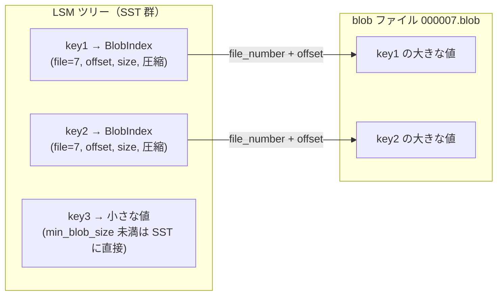
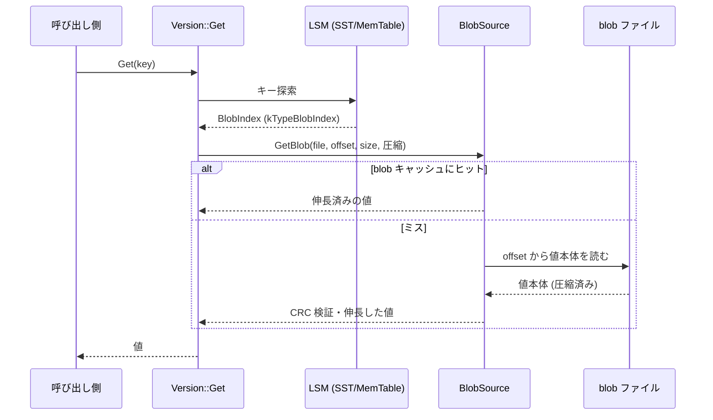

# 第48章 BlobDB（KV 分離）

> **本章で読むソース**
>
> - [`db/blob/blob_index.h`](https://github.com/facebook/rocksdb/blob/v11.1.1/db/blob/blob_index.h)
> - [`db/blob/blob_log_format.h`](https://github.com/facebook/rocksdb/blob/v11.1.1/db/blob/blob_log_format.h)
> - [`db/blob/blob_file_builder.h`](https://github.com/facebook/rocksdb/blob/v11.1.1/db/blob/blob_file_builder.h)
> - [`db/blob/blob_file_reader.h`](https://github.com/facebook/rocksdb/blob/v11.1.1/db/blob/blob_file_reader.h)
> - [`db/blob/blob_source.h`](https://github.com/facebook/rocksdb/blob/v11.1.1/db/blob/blob_source.h)
> - [`db/blob/blob_garbage_meter.h`](https://github.com/facebook/rocksdb/blob/v11.1.1/db/blob/blob_garbage_meter.h)
> - [`db/blob/blob_file_garbage.h`](https://github.com/facebook/rocksdb/blob/v11.1.1/db/blob/blob_file_garbage.h)
> - [`include/rocksdb/advanced_options.h`](https://github.com/facebook/rocksdb/blob/v11.1.1/include/rocksdb/advanced_options.h)

## この章の狙い

BlobDB は、大きな値を SST から切り離して別ファイルに置く仕組みである。
本章では、その分離がコンパクションの書き込み増幅をなぜ減らせるのかを機構として理解し、書き出し（`BlobFileBuilder`）、物理形式（blob ファイル）、読み出し（`BlobSource`）、そしてガベージコレクションまでを実コードで追う。

## 前提

- [第31章 コンパクションジョブ](../part05-compaction/31-compaction-job.md)
- [第23章 Get](../part04-read-path/23-get.md)
- [第26章 イテレータ](../part04-read-path/26-iterators.md)

## 大きな値がコンパクションで何度も書き直される問題

RocksDB は LSM ツリーを採用しており、書き込まれたデータは下位レベルへ向けて何度もコンパクションされる（第31章）。
コンパクションは入力 SST のキーと値をマージし、新しい SST に書き出す処理である。
このとき、キーに付随する値もそのまま新しい SST へ書き写される。

値が大きいと、この書き写しの代償が重くなる。
あるキーの値が一度も上書きされていなくても、そのキーが属する SST がコンパクションの入力になるたびに、値の全バイトが読まれ、再び書き出される。
LSM の段数だけこれが繰り返されるため、実際にユーザが書いた量に対して、ディスクへ書かれる総量（書き込み増幅）が膨らむ。
キーは小さく値が大きいワークロードでは、増幅のほとんどを値の再書き込みが占める。

この問題に対する最適化が**KV 分離**（key-value separation）である。
値を SST から物理的に切り離し、コンパクションが動かすのは値そのものではなく、値の所在を指す小さなポインタだけにする。

## KV 分離の構造

`enable_blob_files` を有効にすると、`min_blob_size` 以上の値は SST ではなく**blob ファイル**へ書かれ、SST 側には**BlobIndex**と呼ぶ小さなポインタだけが残る。
分離の閾値とファイルサイズは `advanced_options.h` の次のオプションで決まる。

[`include/rocksdb/advanced_options.h` L1023-L1047](https://github.com/facebook/rocksdb/blob/v11.1.1/include/rocksdb/advanced_options.h#L1023-L1047)

```cpp
  // Default: false
  //
  // Dynamically changeable through the SetOptions() API
  bool enable_blob_files = false;

  // The size of the smallest value to be stored separately in a blob file.
  // ...
  // Default: 0
  // ...
  uint64_t min_blob_size = 0;

  // The size limit for blob files. When writing blob files, a new file is
  // ...
  // Default: 256 MB
  // ...
  uint64_t blob_file_size = 1ULL << 28;
```

`min_blob_size` 既定は 0 で、この場合すべての値が blob ファイルへ回る。
`blob_file_size` 既定は 256 MB で、blob ファイルがこの大きさに達すると次のファイルが開かれる。

分離後、SST のレコードは「キー」と「BlobIndex（どの blob ファイルのどこに値があるか）」の組になる。
値の実体は blob ファイル側にあるため、SST のレコードは値の大小にかかわらず小さい。



ここに最適化の核がある。
コンパクションが SST をマージするとき、移動するのは BlobIndex という数十バイトのポインタだけで、blob ファイルの中身は触れない。
値の実体は blob ファイルに留まったままレベル間を素通りするため、第31章で見た再書き込みが大きな値については発生しなくなる。
これが KV 分離による書き込み増幅の削減である。

その代償として、値を読むときに「SST から BlobIndex を引く」「blob ファイルから実体を引く」という一段の間接参照（indirection）が増える。
ヘッダのコメントもこのトレードオフを明記している。

[`include/rocksdb/advanced_options.h` L1014-L1016](https://github.com/facebook/rocksdb/blob/v11.1.1/include/rocksdb/advanced_options.h#L1014-L1016)

```cpp
  // When set, large values (blobs) are written to separate blob files, and
  // only pointers to them are stored in SST files. This can reduce write
  // amplification for large-value use cases at the cost of introducing a level
```

## BlobIndex の符号化

BlobIndex は SST 側に置かれるポインタである。
内部キーの値型 `kTypeBlobIndex` の値として格納され、blob ファイル番号、オフセット、サイズ、圧縮種別を符号化する。
形式は三種類あり、図はヘッダ冒頭のコメントに描かれている。

[`db/blob/blob_index.h` L28-L37](https://github.com/facebook/rocksdb/blob/v11.1.1/db/blob/blob_index.h#L28-L37)

```cpp
//    kBlob:
//      +------+-------------+----------+----------+-------------+
//      | type | file number | offset   | size     | compression |
//      +------+-------------+----------+----------+-------------+
//      | char | varint64    | varint64 | varint64 | char        |
//      +------+-------------+----------+----------+-------------+
//
//    kBlobTTL:
//      +------+------------+-------------+----------+----------+-------------+
//      | type | expiration | file number | offset   | size     | compression |
```

統合 BlobDB が使うのは `kBlob` 型である。
先頭の型バイトに続いて、blob ファイル番号、オフセット、サイズの三つを可変長整数（varint64）で詰め、最後に圧縮種別を 1 バイト置く。
符号化する `EncodeBlob` の実装は次のとおりで、コメントどおりの順序でバイト列を組み立てる。

[`db/blob/blob_index.h` L162-L173](https://github.com/facebook/rocksdb/blob/v11.1.1/db/blob/blob_index.h#L162-L173)

```cpp
  static void EncodeBlob(std::string* dst, uint64_t file_number,
                         uint64_t offset, uint64_t size,
                         CompressionType compression) {
    assert(dst != nullptr);
    dst->clear();
    dst->reserve(kMaxVarint64Length * 3 + 2);
    dst->push_back(static_cast<char>(Type::kBlob));
    PutVarint64(dst, file_number);
    PutVarint64(dst, offset);
    PutVarint64(dst, size);
    dst->push_back(static_cast<char>(compression));
  }
```

可変長整数を使うのは、ファイル番号やオフセットが小さいうちは数バイトで収まり、SST に占めるポインタの大きさをさらに抑えられるからである。
復号する `DecodeFrom` は先頭バイトで型を判別し、`kBlob` 型なら三つの varint64 と末尾 1 バイトの圧縮種別を読み取る。

[`db/blob/blob_index.h` L111-L118](https://github.com/facebook/rocksdb/blob/v11.1.1/db/blob/blob_index.h#L111-L118)

```cpp
    } else {
      if (GetVarint64(&slice, &file_number_) && GetVarint64(&slice, &offset_) &&
          GetVarint64(&slice, &size_) && slice.size() == 1) {
        compression_ = static_cast<CompressionType>(*slice.data());
      } else {
        return Status::Corruption(kErrorMessage, "Corrupted blob offset");
      }
    }
```

なお `offset_` が指すのは blob ファイル内の値本体の位置であり、レコードの先頭ではない。
この点は後述する物理形式の説明で意味を持つ。

## blob ファイルの物理形式

blob ファイルは固定長ヘッダ、レコードの並び、固定長フッタで構成される追記専用のログである。
ヘッダは 30 バイトで、マジックナンバー、バージョン、カラムファミリー ID、フラグ、圧縮種別、有効期限範囲を持つ。

[`db/blob/blob_log_format.h` L27-L33](https://github.com/facebook/rocksdb/blob/v11.1.1/db/blob/blob_log_format.h#L27-L33)

```cpp
// Format of blob log file header (30 bytes):
//
//    +--------------+---------+---------+-------+-------------+-------------------+
//    | magic number | version |  cf id  | flags | compression | expiration range  |
//    +--------------+---------+---------+-------+-------------+-------------------+
//    |   Fixed32    | Fixed32 | Fixed32 | char  |    char     | Fixed64   Fixed64 |
//    +--------------+---------+---------+-------+-------------+-------------------+
```

個々の値は 32 バイトのレコードヘッダに続けてキーと値を並べる形で記録される。
ヘッダにはキー長、値長、有効期限、ヘッダ CRC、blob CRC が入る。

[`db/blob/blob_log_format.h` L96-L111](https://github.com/facebook/rocksdb/blob/v11.1.1/db/blob/blob_log_format.h#L96-L111)

```cpp
// Blob record format (32 bytes header + key + value):
//
//    +------------+--------------+------------+------------+----------+---------+-----------+
//    | key length | value length | expiration | header CRC | blob CRC |   key   |   value   |
//    +------------+--------------+------------+------------+----------+---------+-----------+
//    |   Fixed64  |   Fixed64    |  Fixed64   |  Fixed32   | Fixed32  | key len | value len |
//    +------------+--------------+------------+------------+----------+---------+-----------+
//
// ...
// Header CRC is the checksum of (key_len + val_len + expiration), while
// blob CRC is the checksum of (key + value).
```

レコードはキーと値の両方を持つが、BlobIndex の `offset` が指すのは値本体である。
レコードヘッダとキーを読みたいときは、値オフセットからヘッダ長とキー長を差し引いて先頭へ戻る。
その調整量を返すのが `CalculateAdjustmentForRecordHeader` で、ここがオフセットの基準点を物語っている。

[`db/blob/blob_log_format.h` L122-L128](https://github.com/facebook/rocksdb/blob/v11.1.1/db/blob/blob_log_format.h#L122-L128)

```cpp
  // Note that the offset field of BlobIndex actually points to the blob value
  // as opposed to the start of the blob record. The following method can
  // be used to calculate the adjustment needed to read the blob record header.
  static constexpr uint64_t CalculateAdjustmentForRecordHeader(
      uint64_t key_size) {
    return key_size + kHeaderSize;
  }
```

ファイルが正しく閉じられると 32 バイトのフッタが書かれ、blob の総数と有効期限範囲、フッタ CRC が記録される。
フッタが存在すること自体がファイルの正常完結の印になる。

## 書き出し：BlobFileBuilder

値を blob ファイルへ書き出すのは `BlobFileBuilder` である。
フラッシュやコンパクションが値を一つずつ `Add` に渡し、戻り値の `blob_index` に符号化済みの BlobIndex を受け取る。
`Add` の冒頭が分離の判断点で、値のサイズが `min_blob_size_` 未満なら何もせず戻る。

[`db/blob/blob_file_builder.cc` L109-L116](https://github.com/facebook/rocksdb/blob/v11.1.1/db/blob/blob_file_builder.cc#L109-L116)

```cpp
Status BlobFileBuilder::Add(const Slice& key, const Slice& value,
                            std::string* blob_index) {
  assert(blob_index);
  assert(blob_index->empty());

  if (value.size() < min_blob_size_) {
    return Status::OK();
  }
```

ここで `blob_index` が空のまま返ると、呼び出し側はその値を SST へ直接書く（小さい値の経路）。
閾値以上の値は、必要なら blob ファイルを開き、`blob_compression_type` に従って圧縮し、ファイルへ書き、最後に BlobIndex を符号化して返す。

[`db/blob/blob_file_builder.cc` L118-L167](https://github.com/facebook/rocksdb/blob/v11.1.1/db/blob/blob_file_builder.cc#L118-L167)

```cpp
  {
    const Status s = OpenBlobFileIfNeeded();
    // ...
  }

  Slice blob = value;
  GrowableBuffer compressed_blob;

  {
    const Status s = CompressBlobIfNeeded(&blob, &compressed_blob);
    // ...
  }
  // ... (WriteBlobToFile / CloseBlobFileIfNeeded / PutBlobIntoCacheIfNeeded) ...

  BlobIndex::EncodeBlob(blob_index, blob_file_number, blob_offset, blob.size(),
                        blob_compression_type_);

  return Status::OK();
}
```

`CompressBlobIfNeeded` は `blob_compression_type`（既定は無圧縮）に従い、`WriteBlobToFile` がレコードを追記して値本体のオフセットを返す。
`CloseBlobFileIfNeeded` は `blob_file_size_` を超えたら現在のファイルを閉じ、次の `Add` で新しいファイルが開かれる。
圧縮を blob 側で行うため、`size` フィールドには圧縮後のサイズが入る。
BlobIndex に圧縮種別を持たせているのは、読み出し時にどの伸長器を使うかをポインタだけで決められるようにするためである。

## 読み出し：BlobSource と blob キャッシュ

値を読むときは、SST から取り出した BlobIndex を頼りに blob ファイルへアクセスする。
その入口が `BlobSource` で、blob キャッシュ、セカンダリキャッシュ、ストレージのどこに値があっても透過的に取得する役を負う。

[`db/blob/blob_source.h` L29-L33](https://github.com/facebook/rocksdb/blob/v11.1.1/db/blob/blob_source.h#L29-L33)

```cpp
// BlobSource is a class that provides universal access to blobs, regardless of
// whether they are in the blob cache, secondary cache, or (remote) storage.
// Depending on user settings, it always fetch blobs from multi-tier cache and
// storage with minimal cost.
class BlobSource {
```

`GetBlob` は BlobIndex から取り出したファイル番号、オフセット、サイズ、圧縮種別を受け取り、伸長済みの値を `PinnableSlice` に返す。

[`db/blob/blob_source.h` L56-L60](https://github.com/facebook/rocksdb/blob/v11.1.1/db/blob/blob_source.h#L56-L60)

```cpp
  Status GetBlob(const ReadOptions& read_options, const Slice& user_key,
                 uint64_t file_number, uint64_t offset, uint64_t file_size,
                 uint64_t value_size, CompressionType compression_type,
                 FilePrefetchBuffer* prefetch_buffer, PinnableSlice* value,
                 uint64_t* bytes_read);
```

`BlobSource` は二段のキャッシュを抱える。
一つは伸長済みの blob 本体を保持する blob キャッシュ、もう一つは blob ファイルのリーダ（`BlobFileReader`）を保持するファイルキャッシュである。

[`db/blob/blob_source.h` L152-L156](https://github.com/facebook/rocksdb/blob/v11.1.1/db/blob/blob_source.h#L152-L156)

```cpp
  // A cache to store blob file reader.
  BlobFileCache* blob_file_cache_;

  // A cache to store uncompressed blobs.
  mutable SharedCacheInterface blob_cache_;
```

blob キャッシュに値があればファイルアクセスなしで返せる。
無ければ `BlobFileCache` 経由で `BlobFileReader` を得て、`GetBlob` がファイルの該当オフセットから値本体を読み、CRC を検証し、必要なら伸長してから blob キャッシュへ載せる。

[`db/blob/blob_file_reader.h` L46-L52](https://github.com/facebook/rocksdb/blob/v11.1.1/db/blob/blob_file_reader.h#L46-L52)

```cpp
  Status GetBlob(const ReadOptions& read_options, const Slice& user_key,
                 uint64_t offset, uint64_t value_size,
                 CompressionType compression_type,
                 FilePrefetchBuffer* prefetch_buffer,
                 MemoryAllocator* allocator,
                 std::unique_ptr<BlobContents>* result,
                 uint64_t* bytes_read) const;
```

ここでのキャッシュは間接参照の代償を抑えるための工夫である。
KV 分離は読み出しに一段のファイルアクセスを足すが、blob キャッシュが値本体を、ファイルキャッシュがファイルハンドルと管理情報を保持するため、ヒットすればその一段を省略できる。
書き出し直後の値を温めておく `prepopulate_blob_cache` を併用すると、書いたばかりの blob をフラッシュ時にキャッシュへ載せ、直後の読み出しでファイルアクセスを避けられる。

## Get で実体を取り出す流れ

通常の Get（第23章）は、まず LSM を探索して値を取り出す。
値型が `kTypeBlobIndex` なら、取り出したのは値そのものではなく BlobIndex である。
このとき `Version::Get` は BlobIndex を見つけた箇所で `GetBlob` を呼び、実体へ解決する。

[`db/version_set.cc` L2826-L2841](https://github.com/facebook/rocksdb/blob/v11.1.1/db/version_set.cc#L2826-L2841)

```cpp
        if (is_blob_index && do_merge && (value || columns)) {
          Slice blob_index =
              value ? *value
                    : WideColumnsHelper::GetDefaultColumn(columns->columns());
          // ...
          *status = GetBlob(read_options, get_context.ukey_to_get_blob_value(),
                            blob_index, prefetch_buffer, &result, bytes_read);
```

`Version::GetBlob` は BlobIndex を復号し、ファイル番号からファイルのメタデータを引いて `BlobSource::GetBlob` へ渡す。

[`db/version_set.cc` L2608-L2620](https://github.com/facebook/rocksdb/blob/v11.1.1/db/version_set.cc#L2608-L2620)

```cpp
  const uint64_t blob_file_number = blob_index.file_number();

  auto blob_file_meta = storage_info_.GetBlobFileMetaData(blob_file_number);
  if (!blob_file_meta) {
    return Status::Corruption("Invalid blob file number");
  }

  assert(blob_source_);
  value->Reset();
  const Status s = blob_source_->GetBlob(
      read_options, user_key, blob_file_number, blob_index.offset(),
      blob_file_meta->GetBlobFileSize(), blob_index.size(),
      blob_index.compression(), prefetch_buffer, value, bytes_read);
```

全体の流れは次のようになる。



イテレータ（第26章）でも同じ解決が働く。
イテレータが指す位置の値型が BlobIndex なら、値を要求された時点で BlobSource を介して実体へ解決する。

## ガベージコレクション

blob ファイルは追記専用なので、上書きや削除があっても古いレコードはその場に残る。
あるキーの値を上書きすると、新しい値は新しい blob ファイルへ書かれ、SST 側の BlobIndex も新しいファイルを指すよう更新される。
古いファイルの中のレコードは誰からも参照されない「ゴミ」になるが、ファイル自体は残り続ける。
これを回収するのが blob のガベージコレクション（GC）である。

GC はコンパクションの一部として行われる。
`enable_blob_garbage_collection` を有効にすると、古い blob ファイルを指す BlobIndex がコンパクション中に現れたとき、その値を新しい blob ファイルへ移し替える（relocate）。
どこまでを「古い」とみなすかは `blob_garbage_collection_age_cutoff` が決める。

[`include/rocksdb/advanced_options.h` L1058-L1079](https://github.com/facebook/rocksdb/blob/v11.1.1/include/rocksdb/advanced_options.h#L1058-L1079)

```cpp
  // Enables garbage collection of blobs. Blob GC is performed as part of
  // compaction. Valid blobs residing in blob files older than a cutoff get
  // relocated to new files as they are encountered during compaction, which
  // makes it possible to clean up blob files once they contain nothing but
  // obsolete/garbage blobs. See also blob_garbage_collection_age_cutoff and
  // ...
  bool enable_blob_garbage_collection = false;

  // The cutoff in terms of blob file age for garbage collection. Blobs in
  // the oldest N blob files will be relocated when encountered during
  // compaction, where N = garbage_collection_cutoff * number_of_blob_files.
  // ...
  // Default: 0.25
  // ...
  double blob_garbage_collection_age_cutoff = 0.25;
```

カットオフは比率で、既定は 0.25 である。
blob ファイルはファイル番号順に並んでおり、`age_cutoff * ファイル数` 番目のファイルの番号が境界になる。
これ未満の番号を持つファイル群が relocate の対象である。

[`db/compaction/compaction_iterator.cc` L1410-L1411](https://github.com/facebook/rocksdb/blob/v11.1.1/db/compaction/compaction_iterator.cc#L1410-L1411)

```cpp
  const size_t cutoff_index = static_cast<size_t>(
      compaction->blob_garbage_collection_age_cutoff() * blob_files.size());
```

コンパクションイテレータは BlobIndex を復号し、そのファイル番号が境界以上なら何もしない。
境界未満なら値を読み出し（fetch）、その実体を現在のコンパクション出力へ流す。

[`db/compaction/compaction_iterator.cc` L1196-L1212](https://github.com/facebook/rocksdb/blob/v11.1.1/db/compaction/compaction_iterator.cc#L1196-L1212)

```cpp
    if (blob_index.file_number() >=
        blob_garbage_collection_cutoff_file_number_) {
      return;
    }

    FilePrefetchBuffer* prefetch_buffer =
        prefetch_buffers_ ? prefetch_buffers_->GetOrCreatePrefetchBuffer(
                                blob_index.file_number())
                          : nullptr;

    uint64_t bytes_read = 0;

    {
      assert(blob_fetcher_);

      const Status s = blob_fetcher_->FetchBlob(
          user_key(), blob_index, prefetch_buffer, &blob_value_, &bytes_read);
```

読み出した値は `value_` に差し替えられ、値型は `kTypeValue` に戻される。
その後の出力経路で、値が再び `min_blob_size` 以上であれば新しい blob ファイルへ書き直され、新しい BlobIndex が付く。
古いファイルを指していた生きた値だけが新しいファイルへ移るので、古いファイルが参照されなくなれば回収できる。
relocate の対象を古いファイルに限るのは、古いファイルほどゴミの割合が高いと期待でき、回収あたりに動かす生きた値が少なくて済むからである。

### BlobGarbageMeter によるゴミ量の計測

ファイルを回収してよいか判断するには、各 blob ファイルにどれだけゴミが溜まったかを知る必要がある。
これを計るのが `BlobGarbageMeter` で、コンパクションの入力と出力に現れる blob 参照を blob ファイル単位で集計する。

[`db/blob/blob_garbage_meter.h` L20-L25](https://github.com/facebook/rocksdb/blob/v11.1.1/db/blob/blob_garbage_meter.h#L20-L25)

```cpp
// A class that can be used to compute the amount of additional garbage
// generated by a compaction. It parses the keys and blob references in the
// input and output of a compaction, and aggregates the "inflow" and "outflow"
// on a per-blob file basis. The amount of additional garbage for any given blob
// file can then be computed by subtracting the outflow from the inflow.
class BlobGarbageMeter {
```

考え方は流入（inflow）と流出（outflow）の差である。
コンパクション入力に現れた blob 参照を流入、出力に残った参照を流出として数え、流入から流出を引いた分が、このコンパクションで新たに生じたゴミになる。
入力にあった参照が出力に残らないのは、その値が上書きや削除で消えたか、relocate で別ファイルへ移ったことを意味する。

集計の単位は `BlobInOutFlow` で、流入が流出を下回らないことを不変条件として保ち、差からゴミの件数とバイト数を返す。

[`db/blob/blob_garbage_meter.h` L64-L81](https://github.com/facebook/rocksdb/blob/v11.1.1/db/blob/blob_garbage_meter.h#L64-L81)

```cpp
    bool IsValid() const {
      return in_flow_.GetCount() >= out_flow_.GetCount() &&
             in_flow_.GetBytes() >= out_flow_.GetBytes();
    }
    bool HasGarbage() const {
      assert(IsValid());
      return in_flow_.GetCount() > out_flow_.GetCount();
    }
    // ...
    uint64_t GetGarbageBytes() const {
      assert(IsValid());
      assert(HasGarbage());
      return in_flow_.GetBytes() - out_flow_.GetBytes();
    }
```

流入と流出を数えるとき、各参照のバイト数は値サイズだけでなくレコードヘッダとキー長も含める。
ゴミとして回収できるのはレコード全体だからである。
`Parse` が内部キーを解析し、`kTypeBlobIndex` のときだけ BlobIndex を復号して、ファイル番号とレコード全体のバイト数を取り出す。

[`db/blob/blob_garbage_meter.cc` L92-L95](https://github.com/facebook/rocksdb/blob/v11.1.1/db/blob/blob_garbage_meter.cc#L92-L95)

```cpp
  *blob_file_number = blob_index.file_number();
  *bytes =
      blob_index.size() +
      BlobLogRecord::CalculateAdjustmentForRecordHeader(ikey.user_key.size());
```

流出の集計には注意点がある。
新規に書かれたファイルは流入を持たないため、追加ゴミの計測では既存ファイル（流入があったファイル）の流出だけを追えばよい。
`ProcessOutFlow` は流入を記録済みのファイル番号でなければ流出を加算しない。

[`db/blob/blob_garbage_meter.cc` L45-L53](https://github.com/facebook/rocksdb/blob/v11.1.1/db/blob/blob_garbage_meter.cc#L45-L53)

```cpp
  // Note: in order to measure the amount of additional garbage, we only need to
  // track the outflow for preexisting files, i.e. those that also had inflow.
  // (Newly written files would only have outflow.)
  auto it = flows_.find(blob_file_number);
  if (it == flows_.end()) {
    return Status::OK();
  }

  it->second.AddOutFlow(bytes);
```

計測されたゴミ量は `BlobFileGarbage` として記録され、各 blob ファイルの番号、ゴミ件数、ゴミバイト数を保持する。

[`db/blob/blob_file_garbage.h` L21-L29](https://github.com/facebook/rocksdb/blob/v11.1.1/db/blob/blob_file_garbage.h#L21-L29)

```cpp
class BlobFileGarbage {
 public:
  BlobFileGarbage() = default;

  BlobFileGarbage(uint64_t blob_file_number, uint64_t garbage_blob_count,
                  uint64_t garbage_blob_bytes)
      : blob_file_number_(blob_file_number),
        garbage_blob_count_(garbage_blob_count),
        garbage_blob_bytes_(garbage_blob_bytes) {}
```

この記録は MANIFEST に書かれ、ファイルごとの累積ゴミ量を更新する。
あるファイルが「生きた値ゼロ」になれば、blob ファイルそのものを削除できる。
`blob_garbage_collection_force_threshold`（既定 1.0）は、対象ファイル群のゴミ比率がこの閾値を超えたとき、回収を目的とするコンパクションを強制的に仕掛けるためのオプションである。

## 統合 BlobDB と旧 BlobDB

ここまで見たのは、コアに統合された BlobDB（integrated BlobDB）である。
`enable_blob_files` をはじめとする `advanced_options.h` のオプションで制御し、フラッシュとコンパクションが直接 blob ファイルを書き、BlobIndex を `kTypeBlobIndex` として LSM に格納する。

これとは別に `utilities/blob_db` に旧来の BlobDB（stacked BlobDB と呼ばれる）が残っている。
旧 BlobDB は RocksDB の上に積み重ねる形のラッパーで、コンパクションフィルタを使って blob を扱う。
本章のコンパクションイテレータにも、旧 BlobDB 用の分岐が別経路として残っている。

[`db/compaction/compaction_iterator.cc` L1240-L1243](https://github.com/facebook/rocksdb/blob/v11.1.1/db/compaction/compaction_iterator.cc#L1240-L1243)

```cpp
  // GC for stacked BlobDB
  if (compaction_filter_ &&
      compaction_filter_->IsStackedBlobDbInternalCompactionFilter()) {
    const auto blob_decision = compaction_filter_->PrepareBlobOutput(
```

新規の利用では、コアに統合され GC まで一体で動く統合 BlobDB を使う。

## まとめ

- BlobDB は `min_blob_size` 以上の値を別の blob ファイルへ書き、SST には所在を指す小さな `BlobIndex` だけを置く（KV 分離）。
- コンパクションが動かすのは BlobIndex だけで、大きな値の実体は blob ファイルに留まる。
  これが書き込み増幅を減らす機構である。
- BlobIndex は `kBlob` 型で、ファイル番号、オフセット、サイズを varint64 で、圧縮種別を 1 バイトで符号化する。
  オフセットは値本体を指す。
- blob ファイルはヘッダ、レコード列、フッタからなる追記専用ログで、レコードは 32 バイトヘッダにキーと値を続ける。
- 読み出しは `BlobSource` が担い、blob キャッシュ（値本体）とファイルキャッシュ（リーダ）で間接参照の代償を抑える。
- GC はコンパクションの一部で、`blob_garbage_collection_age_cutoff` 未満の古いファイルの生きた値を新ファイルへ relocate し、`BlobGarbageMeter` が流入と流出の差でゴミ量を計る。

## 関連する章

- [第31章 コンパクションジョブ](../part05-compaction/31-compaction-job.md)
- [第23章 Get](../part04-read-path/23-get.md)
- [第26章 イテレータ](../part04-read-path/26-iterators.md)
- [第20章 圧縮](../part03-sst/20-compression.md)
