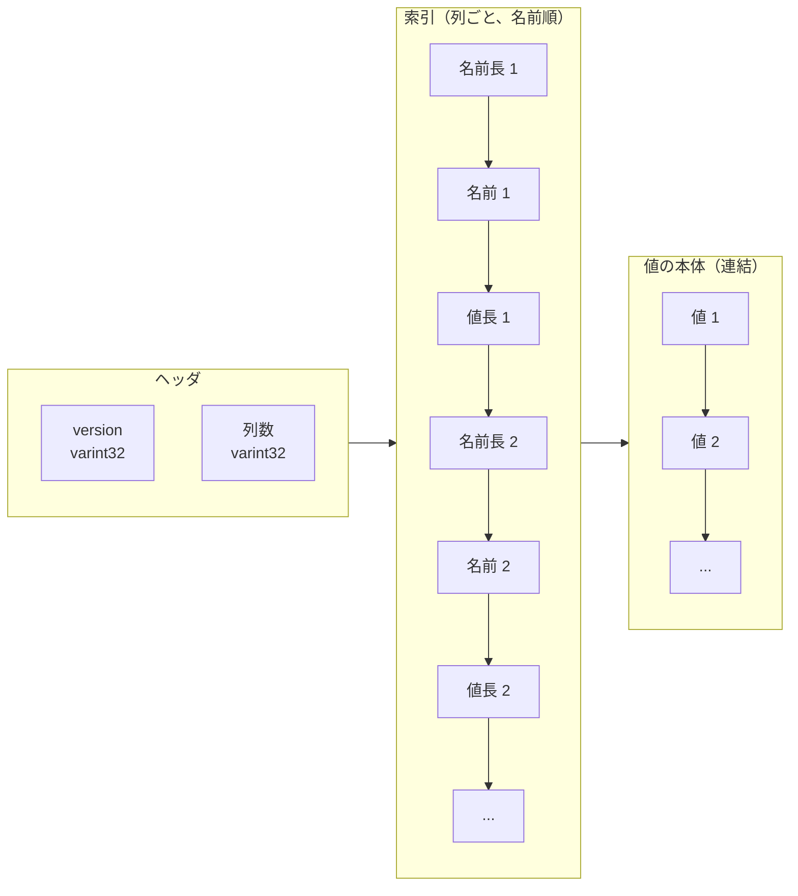

# 第49章 ワイドカラム

> **本章で読むソース**
>
> - [`include/rocksdb/wide_columns.h`](https://github.com/facebook/rocksdb/blob/v11.1.1/include/rocksdb/wide_columns.h)
> - [`db/wide/wide_column_serialization.h`](https://github.com/facebook/rocksdb/blob/v11.1.1/db/wide/wide_column_serialization.h)
> - [`db/wide/wide_column_serialization.cc`](https://github.com/facebook/rocksdb/blob/v11.1.1/db/wide/wide_column_serialization.cc)
> - [`db/wide/wide_columns_helper.h`](https://github.com/facebook/rocksdb/blob/v11.1.1/db/wide/wide_columns_helper.h)
> - [`db/wide/wide_columns.cc`](https://github.com/facebook/rocksdb/blob/v11.1.1/db/wide/wide_columns.cc)
> - [`include/rocksdb/db.h`](https://github.com/facebook/rocksdb/blob/v11.1.1/include/rocksdb/db.h)
> - [`db/dbformat.h`](https://github.com/facebook/rocksdb/blob/v11.1.1/db/dbformat.h)

## この章の狙い

RocksDB のワイドカラムは、1つのキーに対し値を「（列名, 列値）の集合」として持たせる仕組みである。
本章では、この集合を書く `PutEntity` と読む `GetEntity`、空名の既定列が従来の単一値 API との互換をどう成り立たせているか、列を1つのバイト列へ詰める直列化形式を読む。
直列化形式が列名でソートされていること、その並びが特定列の探索と既定列の取り出しをどう速くするかを、機構のレベルで理解できるようにする。

## 前提

- [第5章 内部キー形式 InternalKey](../part01-data-model/05-internal-key.md)（`ValueType` とトレーラの構造を扱う章であり、ワイドカラムは `kTypeWideColumnEntity` という値型で内部キーに乗る）
- [第23章 Get](../part04-read-path/23-get.md)（読み出し経路を扱う章であり、`GetEntity` は同じ経路を通る）

## ワイドカラムという値の形

通常のキーバリューでは、1つのキーに1つの不透明なバイト列が対応する。
ワイドカラムは、その値を「名前を持った複数の列」へ広げる。
1つの列は列名と列値の対であり、`WideColumn` クラスがこの対を表す。

[`include/rocksdb/wide_columns.h` L21-L65](https://github.com/facebook/rocksdb/blob/v11.1.1/include/rocksdb/wide_columns.h#L21-L65)

```cpp
// Class representing a wide column, which is defined as a pair of column name
// and column value.
class WideColumn {
 public:
  WideColumn() = default;
  // ... (中略：name と value を Slice へ転送するコンストラクタ群) ...
  const Slice& name() const { return name_; }
  const Slice& value() const { return value_; }

  Slice& name() { return name_; }
  Slice& value() { return value_; }

 private:
  Slice name_;
  Slice value_;
};
```

列名と列値はいずれも `Slice` であり、`WideColumn` 自身はバイト列を所有しない。
列の集まりは `WideColumns` という別名で、`WideColumn` の `std::vector` にすぎない。

[`include/rocksdb/wide_columns.h` L95-L96](https://github.com/facebook/rocksdb/blob/v11.1.1/include/rocksdb/wide_columns.h#L95-L96)

```cpp
// A collection of wide columns.
using WideColumns = std::vector<WideColumn>;
```

1つのキーが `WideColumns` を持つとき、その構造は次のようになる。
列の中には名前が空のものが1つだけ含まれることがあり、これが既定列である。

```mermaid
flowchart LR
  K["キー \"user:42\""] --> WC["WideColumns（列の集合）"]
  WC --> C0["既定列<br/>name = \"\"（空）<br/>value = ..."]
  WC --> C1["列 \"age\"<br/>value = \"30\""]
  WC --> C2["列 \"city\"<br/>value = \"Tokyo\""]
  WC --> C3["列 \"name\"<br/>value = \"Alice\""]
```

書き込みは `PutEntity`、読み出しは `GetEntity` で行う。
まず `PutEntity` のシグネチャを見る。

[`include/rocksdb/db.h` L444-L455](https://github.com/facebook/rocksdb/blob/v11.1.1/include/rocksdb/db.h#L444-L455)

```cpp
  // Set the database entry for "key" in the column family specified by
  // "column_family" to the wide-column entity defined by "columns". If the key
  // already exists in the column family, it will be overwritten.
  //
  // Returns OK on success, and a non-OK status on error.
  virtual Status PutEntity(const WriteOptions& options,
                           ColumnFamilyHandle* column_family, const Slice& key,
                           const WideColumns& columns);
  // Split and store wide column entities in multiple column families (a.k.a.
  // AttributeGroups)
  virtual Status PutEntity(const WriteOptions& options, const Slice& key,
                           const AttributeGroups& attribute_groups);
```

`PutEntity` は `key` に対して `columns`（列の集合）を結び付ける。
複数のカラムファミリーへ列を振り分ける第2の多重定義は、第28章で扱うアトリビュートグループ向けである。

## 既定列が単一値 API との互換を作る

ワイドカラムを後付けの拡張として導入しても、従来の `Put` と `Get` を使うコードはそのまま動く。
これを成り立たせているのが、名前が空の列である既定列である。
既定列の名前は空の `Slice` として定義されている。

[`include/rocksdb/wide_columns.h` L98-L99](https://github.com/facebook/rocksdb/blob/v11.1.1/include/rocksdb/wide_columns.h#L98-L99)

```cpp
// The anonymous default wide column (an empty Slice).
extern const Slice kDefaultWideColumnName;
```

[`db/wide/wide_columns.cc` L12](https://github.com/facebook/rocksdb/blob/v11.1.1/db/wide/wide_columns.cc#L12)

```cpp
const Slice kDefaultWideColumnName;
```

定義はデフォルト構築の `Slice` であり、長さ0のバイト列を指す。
従来の `Put` で書いた値は、この空名の列に1つだけ値が入った状態と等しいものとして扱われる。
逆に `Get` は、ワイドカラムのうち既定列の値だけを返す。

`GetEntity` の宣言にあるコメントが、この対応を明文化している。

[`include/rocksdb/db.h` L658-L672](https://github.com/facebook/rocksdb/blob/v11.1.1/include/rocksdb/db.h#L658-L672)

```cpp
  // If the column family specified by "column_family" contains an entry for
  // "key", return it as a wide-column entity in "*columns". If the entry is a
  // wide-column entity, return it as-is; if it is a plain key-value, return it
  // as an entity with a single anonymous column (see kDefaultWideColumnName)
  // which contains the value.
  //
  // Returns OK on success. Returns NotFound and an empty wide-column entity in
  // "*columns" if there is no entry for "key". Returns some other non-OK status
  // on error.
  virtual Status GetEntity(const ReadOptions& /* options */,
                           ColumnFamilyHandle* /* column_family */,
                           const Slice& /* key */,
                           PinnableWideColumns* /* columns */) {
    return Status::NotSupported("GetEntity not supported");
  }
```

`GetEntity` は、対象がワイドカラムならそのまま全列を返し、通常のキーバリューなら空名の列1つだけを持つ実体として返す。
この対応のおかげで、書き手が `Put` を使い読み手が `GetEntity` を使っても、読み手は値を「空名の列の値」として一貫して受け取れる。
逆向きの対応は読み出し結果を保持する `PinnableWideColumns` の側に現れる。
通常値を受け取ったときは、それを既定列1つだけの集合として索引付けする。

[`include/rocksdb/wide_columns.h` L209-L211](https://github.com/facebook/rocksdb/blob/v11.1.1/include/rocksdb/wide_columns.h#L209-L211)

```cpp
inline void PinnableWideColumns::CreateIndexForPlainValue() {
  columns_ = WideColumns{{kDefaultWideColumnName, value_}};
}
```

ここで作られるのは、名前が `kDefaultWideColumnName`（空）で値が元のバイト列という、ただ1つの列を持つ集合である。
通常値とワイドカラムの両方が、読み出し側では同じ `WideColumns` という型に収束する。
既定列はその収束点であり、単一値の世界とワイドカラムの世界を橋渡しする1つの列として働く。

補助関数も既定列が先頭に来ることを前提に書かれている。
`HasDefaultColumn` は先頭列の名前が空かどうかを見るだけで判定する。

[`db/wide/wide_columns_helper.h` L25-L37](https://github.com/facebook/rocksdb/blob/v11.1.1/db/wide/wide_columns_helper.h#L25-L37)

```cpp
  static bool HasDefaultColumn(const WideColumns& columns) {
    return !columns.empty() && columns.front().name() == kDefaultWideColumnName;
  }

  static bool HasDefaultColumnOnly(const WideColumns& columns) {
    return columns.size() == 1 &&
           columns.front().name() == kDefaultWideColumnName;
  }

  static const Slice& GetDefaultColumn(const WideColumns& columns) {
    assert(HasDefaultColumn(columns));
    return columns.front().value();
  }
```

先頭列だけを見れば既定列の有無がわかるのは、列が名前でソートされ、空名が辞書順で最小だからである。
ソートの根拠は次節の直列化形式で確かめる。

## 列を1つのバイト列へ詰める

ワイドカラムを格納するとき、`WideColumns` は1つのバイト列へ直列化される。
このバイト列が値となり、`kTypeWideColumnEntity` という値型を付けて内部キーに乗る。
v11.1.1 の直列化には版が2つある。
全列の値をそのまま埋め込む版1と、一部の列値を Blob への参照に置き換えられる版2である。

ここでは、まず版1のレイアウトを読む。
ヘッダのコメントが構造を図で示している。

[`db/wide/wide_column_serialization.h` L28-L44](https://github.com/facebook/rocksdb/blob/v11.1.1/db/wide/wide_column_serialization.h#L28-L44)

```cpp
// Wide-column serialization/deserialization primitives.
//
// Version 1 Layout:
// The two main parts of the layout are 1) a sorted index containing the column
// names and column value sizes and 2) the column values themselves. Keeping the
// index and the values separate will enable selectively reading column values
// down the line. Note that currently the index has to be fully parsed in order
// to find out the offset of each column value.
//
// Legend: cn = column name, cv = column value, cns = column name size, cvs =
// column value size.
//
//      +----------+--------------+----------+-------+----------+---...
//      | version  | # of columns |  cns 1   | cn 1  |  cvs 1   |
//      +----------+--------------+------------------+--------- +---...
//      | varint32 |   varint32   | varint32 | bytes | varint32 |
//      +----------+--------------+----------+-------+----------+---...
```

レイアウトは大きく2部に分かれる。
前半は列名と列値の長さを並べたソート済みの索引で、後半は列値の本体である。
索引と本体を分けてあるのは、将来、列値を選んで読み出すための備えだと説明されている。

直列化の本体は `Serialize` にある。
版番号と列数を書き、続いて各列の名前と値の長さを書き、最後に値の本体をまとめて並べる。

[`db/wide/wide_column_serialization.cc` L51-L102](https://github.com/facebook/rocksdb/blob/v11.1.1/db/wide/wide_column_serialization.cc#L51-L102)

```cpp
Status WideColumnSerialization::Serialize(const WideColumns& columns,
                                          std::string& output) {
  const size_t num_columns = columns.size();
  // ... (中略：列数の上限チェック) ...
  PutVarint32(&output, kVersion1);

  PutVarint32(&output, static_cast<uint32_t>(num_columns));

  const Slice* prev_name = nullptr;

  for (size_t i = 0; i < columns.size(); ++i) {
    const WideColumn& column = columns[i];

    const Slice& name = column.name();
    // ... (中略：名前長の上限チェック) ...
    if (prev_name) {
      if (Status so = ValidateColumnOrder(*prev_name, name); !so.ok()) {
        return so;
      }
    }

    const Slice& value = column.value();
    // ... (中略：値長の上限チェック) ...
    PutLengthPrefixedSlice(&output, name);
    PutVarint32(&output, static_cast<uint32_t>(value.size()));

    prev_name = &name;
  }

  for (const auto& column : columns) {
    const Slice& value = column.value();

    output.append(value.data(), value.size());
  }

  return Status::OK();
}
```

最初のループが索引を作る。
`PutLengthPrefixedSlice` が名前を長さ前置きで書き、続けて値の長さだけを `PutVarint32` で書く。
このとき値の本体は書かない。
2つ目のループで、すべての列の値を順に連結する。
索引を全列ぶん書ききってから値をまとめて並べるので、版1のバイト列は次の並びになる。



直列化が前提にする列の並び順は、`ValidateColumnOrder` が強制する。
直前の名前が現在の名前以上なら破損として弾く。

[`db/wide/wide_column_serialization.h` L223-L229](https://github.com/facebook/rocksdb/blob/v11.1.1/db/wide/wide_column_serialization.h#L223-L229)

```cpp
  // Returns Corruption if prev_name >= name (columns must be strictly ordered).
  static Status ValidateColumnOrder(const Slice& prev_name, const Slice& name) {
    if (prev_name.compare(name) >= 0) {
      return Status::Corruption("Wide columns out of order");
    }
    return Status::OK();
  }
```

`prev_name.compare(name) >= 0` を破損とするので、列名は厳密な昇順でなければならない。
同名の列を2つ持てないこともここから従う。
列を昇順に整える `SortColumns` は名前のバイト比較で並べ替える。

[`db/wide/wide_columns_helper.h` L39-L44](https://github.com/facebook/rocksdb/blob/v11.1.1/db/wide/wide_columns_helper.h#L39-L44)

```cpp
  static void SortColumns(WideColumns& columns) {
    std::sort(columns.begin(), columns.end(),
              [](const WideColumn& lhs, const WideColumn& rhs) {
                return lhs.name().compare(rhs.name()) < 0;
              });
  }
```

名前をバイト比較で並べるので、空名の既定列はつねに先頭へ来る。
前節の `HasDefaultColumn` が先頭列だけを見れば済むのは、この並びがあるからである。

直列化されたバイト列に付く値型は `kTypeWideColumnEntity` である。

[`db/dbformat.h` L71](https://github.com/facebook/rocksdb/blob/v11.1.1/db/dbformat.h#L71)

```cpp
  kTypeWideColumnEntity = 0x16,
```

内部キーのトレーラに `ValueType` が詰まる仕組みは第5章で扱った。
ワイドカラムは、この値型によって通常値（`kTypeValue`）やマージ（`kTypeMerge`）と区別され、読み出し時にバイト列を `WideColumns` へ復元すべきものと判定される。

## ソート済みの並びが取り出しを速くする

列名でソートして直列化してあることは、特定列の取り出しを速くする。
`WideColumnsHelper::Find` は、復元済みの列集合がソート済みであることを前提に二分探索する。

[`db/wide/wide_columns_helper.h` L46-L63](https://github.com/facebook/rocksdb/blob/v11.1.1/db/wide/wide_columns_helper.h#L46-L63)

```cpp
  template <typename Iterator>
  static Iterator Find(Iterator begin, Iterator end, const Slice& column_name) {
    assert(std::is_sorted(begin, end,
                          [](const WideColumn& lhs, const WideColumn& rhs) {
                            return lhs.name().compare(rhs.name()) < 0;
                          }));

    auto it = std::lower_bound(begin, end, column_name,
                               [](const WideColumn& lhs, const Slice& rhs) {
                                 return lhs.name().compare(rhs) < 0;
                               });

    if (it == end || it->name() != column_name) {
      return end;
    }

    return it;
  }
```

`std::lower_bound` による二分探索なので、列数が N のとき名前比較は O(log N) で済む。
直列化の段で名前順を強制しておくことが、この二分探索の前提を保証している。
列を任意順で持てる設計なら、特定列を探すたびに全列を走査するか、別途索引を作る必要があった。

既定列の取り出しは、版2のレイアウトでさらに踏み込んだ最適化を受ける。
版2は可変長データの前にメタデータをまとめて置く設計で、ヘッダの直後に各区画のバイト長を並べた「スキップ情報」を持つ。

[`db/wide/wide_column_serialization.h` L62-L75](https://github.com/facebook/rocksdb/blob/v11.1.1/db/wide/wide_column_serialization.h#L62-L75)

```cpp
// Section 1: HEADER (2 varints)
//   +----------+--------------+
//   | version  | # of columns |
//   | varint32 |   varint32   |
//   +----------+--------------+
//
// Section 2: SKIP INFO (3 varints)
//   +-------------------+---------------------+------------------+
//   | name_sizes_bytes  | value_sizes_bytes   | names_bytes      |
//   | varint32          | varint32            | varint32         |
//   +-------------------+---------------------+------------------+
//   name_sizes_bytes  = byte size of NAME SIZES section (section 4)
//   value_sizes_bytes = byte size of VALUE SIZES section (section 5)
//   names_bytes       = byte size of NAMES section (section 6)
```

スキップ情報には、名前長を並べた区画、値長を並べた区画、名前本体を並べた区画それぞれのバイト長が入る。
これを読めば、各区画の境界を計算で飛び越えられる。
既定列の値だけを取り出す `GetValueOfDefaultColumn` は、版2でこのスキップ情報を使う速い経路を持つ。

[`db/wide/wide_column_serialization.cc` L537-L607](https://github.com/facebook/rocksdb/blob/v11.1.1/db/wide/wide_column_serialization.cc#L537-L607)

```cpp
  if (version >= kVersion2) {
    // V2 fast path: use skip info to jump directly to values without
    // scanning through variable-length sections.

    // Read SKIP INFO (3 varints, immediately after header)
    // ... (中略：name_sizes_bytes / value_sizes_bytes / names_bytes を読む) ...

    // Peek first name size from NAME SIZES section
    // ... (中略) ...
    uint32_t first_name_size = 0;
    if (!GetVarint32(&name_sizes_section, &first_name_size)) {
      return Status::Corruption("Error decoding wide column name size");
    }
    input_ref.remove_prefix(name_sizes_bytes);

    // Peek first value size from VALUE SIZES section
    // ... (中略) ...
    // Skip entire VALUE SIZES section using value_sizes_bytes
    input_ref.remove_prefix(value_sizes_bytes);

    // Check if the first column is the default column (empty name)
    if (first_name_size != 0) {
      value.clear();
      return Status::OK();
    }

    // Skip NAMES section
    // ... (中略) ...
    input_ref.remove_prefix(names_bytes);

    // Read the first value from VALUES section
    // ... (中略：先頭の値長ぶんだけ value に切り出す) ...
    value = Slice(input_ref.data(), first_value_size);
    return Status::OK();
  }
```

この経路は、先頭列の名前長と値長だけを読み、残りの可変長区画はバイト長ぶんだけ `remove_prefix` で飛ばす。
先頭列の名前長が0でなければ既定列は無いと判断して空を返し、0なら名前区画と値長区画を飛び越えて先頭の値だけを切り出す。
ヘッダのコメントは、この設計を「既定列アクセスは O(1)」と述べている。
全列を復元してから先頭を取るのではなく、先頭の長さ情報だけを見て値へ直接跳ぶので、列数や他の列の大きさに依存しない一定の手数で既定列を取り出せる。

なお版1には同じ速い経路がなく、`GetValueOfDefaultColumn` は全列をいったん復元してから先頭列を返す。

[`db/wide/wide_column_serialization.cc` L609-L624](https://github.com/facebook/rocksdb/blob/v11.1.1/db/wide/wide_column_serialization.cc#L609-L624)

```cpp
  // V1 fallback: full deserialization
  WideColumns columns;

  if (Status s = Deserialize(input, columns); !s.ok()) {
    return s;
  }

  if (!WideColumnsHelper::HasDefaultColumn(columns)) {
    value.clear();
    return Status::OK();
  }

  value = WideColumnsHelper::GetDefaultColumn(columns);

  return Status::OK();
}
```

版1では先頭列を取り出すためにも全列の索引を解析する必要がある点が、版1レイアウトのコメントにある「現状はオフセットを知るために索引を完全に解析しなければならない」という但し書きと対応する。
版2のスキップ情報は、この解析を区画単位の跳躍に置き換えることで、既定列の取り出しを列数によらず一定時間にしている。

## まとめ

- ワイドカラムは1つのキーに「（列名, 列値）の集合」を持たせる仕組みで、`PutEntity` で書き `GetEntity` で読む。
  列は `WideColumn`、集合は `WideColumns`（`std::vector<WideColumn>`）で表す。
- 名前が空の既定列（`kDefaultWideColumnName`）が単一値 API との互換を作る。
  `Put` した値は既定列1つの集合に等しく、`Get` は既定列の値を返す。
  読み出し側では通常値もワイドカラムも `WideColumns` に収束する。
- 直列化は列名でソートして1つのバイト列に詰める。
  版1は版番号と列数に続けて、各列の名前長と値長を並べた索引を置き、最後に値本体を連結する。
  `ValidateColumnOrder` が厳密な昇順を強制する。
- このバイト列は `kTypeWideColumnEntity`（0x16）という値型を付けて内部キーに乗る（第5章）。
- ソート済みなので特定列は `Find` の二分探索で O(log N) で見つかる。
  版2はヘッダ直後のスキップ情報で区画境界を跳び越え、既定列の取り出しを列数によらない一定時間にしている。

## 関連する章

- [第5章 内部キー形式 InternalKey](../part01-data-model/05-internal-key.md)（`kTypeWideColumnEntity` を含む `ValueType` とトレーラの構造）
- [第28章 MultiScan と coalescing iterator](../part04-read-path/28-multiscan.md)（複数カラムファミリーのワイドカラムを `CoalescingIterator` と `AttributeGroupIterator` で束ねる読み出し）
