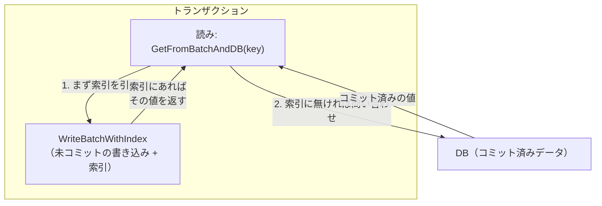
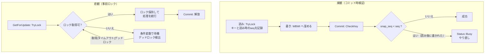

# 第50章 トランザクション（楽観/悲観/2PC）

> **本章で読むソース**
>
> - [`include/rocksdb/utilities/transaction.h`](https://github.com/facebook/rocksdb/blob/v11.1.1/include/rocksdb/utilities/transaction.h)
> - [`include/rocksdb/utilities/transaction_db.h`](https://github.com/facebook/rocksdb/blob/v11.1.1/include/rocksdb/utilities/transaction_db.h)
> - [`include/rocksdb/utilities/optimistic_transaction_db.h`](https://github.com/facebook/rocksdb/blob/v11.1.1/include/rocksdb/utilities/optimistic_transaction_db.h)
> - [`include/rocksdb/utilities/write_batch_with_index.h`](https://github.com/facebook/rocksdb/blob/v11.1.1/include/rocksdb/utilities/write_batch_with_index.h)
> - [`utilities/transactions/optimistic_transaction.h`](https://github.com/facebook/rocksdb/blob/v11.1.1/utilities/transactions/optimistic_transaction.h)
> - [`utilities/transactions/optimistic_transaction.cc`](https://github.com/facebook/rocksdb/blob/v11.1.1/utilities/transactions/optimistic_transaction.cc)
> - [`utilities/transactions/transaction_util.cc`](https://github.com/facebook/rocksdb/blob/v11.1.1/utilities/transactions/transaction_util.cc)
> - [`utilities/transactions/pessimistic_transaction.h`](https://github.com/facebook/rocksdb/blob/v11.1.1/utilities/transactions/pessimistic_transaction.h)
> - [`utilities/transactions/pessimistic_transaction.cc`](https://github.com/facebook/rocksdb/blob/v11.1.1/utilities/transactions/pessimistic_transaction.cc)
> - [`utilities/transactions/lock/point/point_lock_manager.h`](https://github.com/facebook/rocksdb/blob/v11.1.1/utilities/transactions/lock/point/point_lock_manager.h)
> - [`utilities/transactions/lock/point/point_lock_manager.cc`](https://github.com/facebook/rocksdb/blob/v11.1.1/utilities/transactions/lock/point/point_lock_manager.cc)
> - [`utilities/transactions/write_prepared_txn.h`](https://github.com/facebook/rocksdb/blob/v11.1.1/utilities/transactions/write_prepared_txn.h)
> - [`utilities/transactions/write_unprepared_txn.h`](https://github.com/facebook/rocksdb/blob/v11.1.1/utilities/transactions/write_unprepared_txn.h)

## この章の狙い

RocksDB は `TransactionDB` または `OptimisticTransactionDB` で `DB` を包むことで、複数の読み書きを原子的かつ分離して扱うトランザクションを提供する。
本章では、ロックを取らずにコミット時へ検証を遅らせる楽観的方式と、キーにロックを取って衝突を未然に防ぐ悲観的方式の二つを、衝突をどう判定するかという機構の差として読み解く。
さらに 2PC のために `Prepare` と `Commit` を分け、書き込みのタイミングを変える WriteCommitted / WritePrepared / WriteUnprepared の三つの書き込みポリシーが、メモリと遅延に対してどのトレードオフを取るかを理解できるようにする。

## 前提

- [第7章 WriteBatch](../part01-data-model/07-write-batch.md)（トランザクションの書き込みは内部で `WriteBatch` に積まれる）
- [第36章 スナップショットと MVCC](../part06-version/36-snapshot-mvcc.md)（シーケンス番号とスナップショット。衝突判定の基準になる）

## トランザクションの位置づけ

トランザクションは `DB` を直接は使わない。
`TransactionDB`（悲観）と `OptimisticTransactionDB`（楽観）はどちらも `StackableDB` を継承し、既存の `DB` を一段包む形で実装される。

[`include/rocksdb/utilities/transaction_db.h` L497-L498](https://github.com/facebook/rocksdb/blob/v11.1.1/include/rocksdb/utilities/transaction_db.h#L497-L498)

```cpp
class TransactionDB : public StackableDB {
 public:
```

包んだ上で、トランザクションの開始口を `BeginTransaction` として開く。
返ってくる `Transaction` が一連の読み書きの単位であり、最後に `Commit` か `Rollback` で閉じる。

[`include/rocksdb/utilities/transaction_db.h` L570-L573](https://github.com/facebook/rocksdb/blob/v11.1.1/include/rocksdb/utilities/transaction_db.h#L570-L573)

```cpp
  virtual Transaction* BeginTransaction(
      const WriteOptions& write_options,
      const TransactionOptions& txn_options = TransactionOptions(),
      Transaction* old_txn = nullptr) = 0;
```

第3引数の `old_txn` は、直前に使い終えた `Transaction` を再利用してメモリ確保を省くための入口である。
トランザクションを繰り返し生成する場面で確保コストを抑える最適化と考えられる。

`Transaction` の公開 API は `transaction.h` にある。
`SetSnapshot` で分離の基準時刻を固定し、`GetForUpdate` で読みながら衝突防止の意思を示し、`Prepare` で 2PC の第一段階を、`Commit` / `Rollback` で確定または破棄を行う。

[`include/rocksdb/utilities/transaction.h` L216-L237](https://github.com/facebook/rocksdb/blob/v11.1.1/include/rocksdb/utilities/transaction.h#L216-L237)

```cpp
  // Prepare the current transaction for 2PC
  virtual Status Prepare() = 0;

  // Write all batched keys to the db atomically.
  // ... (中略) ...
  // If this transaction was created by an OptimisticTransactionDB(),
  // Status::Busy() may be returned if the transaction could not guarantee
  // that there are no write conflicts.  Status::TryAgain() may be returned
  // ... (中略) ...
  virtual Status Commit() = 0;
```

このコメントが、楽観と悲観で `Commit` の失敗の出方が違うことを先取りしている。
楽観では衝突が `Commit` 時に `Status::Busy()` として表面化し、悲観ではロック取得の時点で `Status::Busy()` や `Status::TimedOut()` が返る。

### 未コミットの書き込みを読む WriteBatchWithIndex

トランザクション内の書き込みは、その場では `DB` に入らない。
`WriteBatchWithIndex`（以下 WBWI）に索引付きで溜め込まれ、`Commit` まで保留される。

[`include/rocksdb/utilities/write_batch_with_index.h` L106-L107](https://github.com/facebook/rocksdb/blob/v11.1.1/include/rocksdb/utilities/write_batch_with_index.h#L106-L107)

```cpp
class WriteBatchWithIndex : public WriteBatchBase {
 public:
```

WBWI は通常の `WriteBatch` に対し、挿入したキーの二分探索可能な索引を併せ持つ。
この索引があるおかげで、トランザクション内の読みは自分が書いた未コミットの値を反映できる。
read-your-own-writes を成り立たせるのが `GetFromBatchAndDB` である。

[`include/rocksdb/utilities/write_batch_with_index.h` L270-L281](https://github.com/facebook/rocksdb/blob/v11.1.1/include/rocksdb/utilities/write_batch_with_index.h#L270-L281)

```cpp
  // Similar to DB::Get() but will also read writes from this batch.
  //
  // This function will query both this batch and the DB and then merge
  // the results using the DB's merge operator (if the batch contains any
  // merge requests).
  //
  // Setting read_options.snapshot will affect what is read from the DB
  // but will NOT change which keys are read from the batch (the keys in
  // this batch do not yet belong to any snapshot and will be fetched
  // regardless).
  Status GetFromBatchAndDB(DB* db, const ReadOptions& read_options,
                           const Slice& key, std::string* value);
```

読みはまず WBWI の索引を引き、見つかればその値を返す。
索引に無いキーだけを `DB` へ問い合わせ、必要なら両者をマージする。
コメントが述べるとおり、WBWI から読むキーはまだどのスナップショットにも属さないので、`read_options.snapshot` の影響を受けず常に読まれる。
この重ね合わせの構造を図にする。



WBWI のコンストラクタには `overwrite_key` という引数がある。

[`include/rocksdb/utilities/write_batch_with_index.h` L119-L122](https://github.com/facebook/rocksdb/blob/v11.1.1/include/rocksdb/utilities/write_batch_with_index.h#L119-L122)

```cpp
  explicit WriteBatchWithIndex(
      const Comparator* backup_index_comparator = BytewiseComparator(),
      size_t reserved_bytes = 0, bool overwrite_key = false,
      size_t max_bytes = 0, size_t protection_bytes_per_key = 0);
```

`overwrite_key` を真にすると、同じキーへの更新は索引上で上書きされ、1キーにつき1エントリだけが残る。
トランザクションは同じキーを何度も上書きしながら最後の値だけを読めればよいので、この上書き索引が read-your-own-writes を効率よく支える。

## 楽観的並行制御

楽観的方式は、衝突がまれだという前提に賭ける。
書き込みの間はロックを取らず、`Commit` の時点で初めて「自分が読んだキーが、その後で他から書き換えられていないか」を確かめる。
`OptimisticTransactionDB::BeginTransaction` が返す `OptimisticTransaction` がこの方式の実装である。

要点は `TryLock` という名前のメソッドが、実際にはロックを取らないところにある。

[`utilities/transactions/optimistic_transaction.cc` L158-L184](https://github.com/facebook/rocksdb/blob/v11.1.1/utilities/transactions/optimistic_transaction.cc#L158-L184)

```cpp
Status OptimisticTransaction::TryLock(ColumnFamilyHandle* column_family,
                                      const Slice& key, bool read_only,
                                      bool exclusive, const bool do_validate,
                                      const bool assume_tracked) {
  // ... (中略) ...
  SequenceNumber seq;
  if (snapshot_) {
    seq = snapshot_->GetSequenceNumber();
  } else {
    seq = db_->GetLatestSequenceNumber();
  }

  std::string key_str = key.ToString();

  TrackKey(cfh_id, key_str, seq, read_only, exclusive);

  // Always return OK. Confilct checking will happen at commit time.
  return Status::OK();
}
```

`TryLock` がするのは、キーと「そのキーを読んだ時点のシーケンス番号」を `TrackKey` で記録することだけである。
スナップショットがあればその番号を、なければ現時点の最新シーケンス番号を基準に取る。
そして最後のコメントどおり、常に `Status::OK()` を返して衝突判定をコミット時へ先送りする。

衝突判定は `Commit` から始まる。
`Commit` は検証ポリシーに応じて直列検証と並列検証へ分岐する。

[`utilities/transactions/optimistic_transaction.cc` L60-L72](https://github.com/facebook/rocksdb/blob/v11.1.1/utilities/transactions/optimistic_transaction.cc#L60-L72)

```cpp
Status OptimisticTransaction::Commit() {
  auto txn_db_impl = static_cast_with_check<OptimisticTransactionDBImpl,
                                            OptimisticTransactionDB>(txn_db_);
  assert(txn_db_impl);
  switch (txn_db_impl->GetValidatePolicy()) {
    case OccValidationPolicy::kValidateParallel:
      return CommitWithParallelValidate();
    case OccValidationPolicy::kValidateSerial:
      return CommitWithSerialValidate();
    default:
      assert(0);
  }
```

直列検証では、書き込みグループに入った後で検証を行う `WriteCallback` を用意し、`WriteWithCallback` 経由で書き込む。

[`utilities/transactions/optimistic_transaction.cc` L76-L89](https://github.com/facebook/rocksdb/blob/v11.1.1/utilities/transactions/optimistic_transaction.cc#L76-L89)

```cpp
Status OptimisticTransaction::CommitWithSerialValidate() {
  // Set up callback which will call CheckTransactionForConflicts() to
  // check whether this transaction is safe to be committed.
  OptimisticTransactionCallback callback(this);

  DBImpl* db_impl = static_cast_with_check<DBImpl>(db_->GetRootDB());

  Status s = db_impl->WriteWithCallback(
      write_options_, GetWriteBatch()->GetWriteBatch(), &callback);
  // ... (中略) ...
}
```

コールバックは `CheckTransactionForConflicts` を呼ぶ。
ここが楽観的検証の核である。

[`utilities/transactions/optimistic_transaction.cc` L192-L201](https://github.com/facebook/rocksdb/blob/v11.1.1/utilities/transactions/optimistic_transaction.cc#L192-L201)

```cpp
Status OptimisticTransaction::CheckTransactionForConflicts(DB* db) {
  auto db_impl = static_cast_with_check<DBImpl>(db);

  // Since we are on the write thread and do not want to block other writers,
  // we will do a cache-only conflict check.  This can result in TryAgain
  // getting returned if there is not sufficient memtable history to check
  // for conflicts.
  return TransactionUtil::CheckKeysForConflicts(db_impl, *tracked_locks_,
                                                true /* cache_only */);
}
```

検証は書き込みスレッド上で他の書き手を止めないために、メモリ上のキャッシュだけで行う `cache_only` 検証である。
MemTable の履歴に十分な情報が残っていなければ確実な判定ができず、`Status::TryAgain()` が返る。
このとき履歴の長さを決めるのが `max_write_buffer_size_to_maintain` であり、楽観的トランザクションを安定させるには履歴を十分に保つ必要がある。

### シーケンス番号による衝突判定

`CheckKeysForConflicts` は記録した各キーについて `CheckKey` を呼び、衝突の有無を一点で判定する。

[`utilities/transactions/transaction_util.cc` L123-L148](https://github.com/facebook/rocksdb/blob/v11.1.1/utilities/transactions/transaction_util.cc#L123-L148)

```cpp
    Status s = db_impl->GetLatestSequenceForKey(
        sv, key, !need_to_read_sst, lower_bound_seq, &seq,
        !read_ts ? nullptr : &timestamp, &found_record_for_key,
        /*is_blob_index=*/nullptr);

    if (!(s.ok() || s.IsNotFound() || s.IsMergeInProgress())) {
      result = s;
    } else if (found_record_for_key) {
      bool write_conflict = snap_checker == nullptr
                                ? snap_seq < seq
                                : !snap_checker->IsVisible(seq);
      // ... (中略：タイムスタンプによる検証) ...
      if (write_conflict) {
        result = Status::Busy();
      }
    }
```

判定の中身は1行に集約される。
`GetLatestSequenceForKey` でそのキーの DB 上の最新シーケンス番号 `seq` を取り、トランザクションがそのキーを読んだ時点の番号 `snap_seq` と比べる。
`snap_seq < seq` であれば、読んだ後に誰かが書いたという意味になり、衝突として `Status::Busy()` を返す。
書いた相手のトランザクションを追跡する必要はなく、シーケンス番号の大小だけで衝突を言える。
シーケンス番号が全書き込みに単調増加で振られていることが、この単純な比較を正当化している。

楽観的方式の損得はここに出る。
書き込み中にロックを取らないので、衝突しない限りトランザクション同士が互いを待たない。
その代わり、衝突したトランザクションは `Commit` まで進んでから `Status::Busy()` で弾かれ、やり直しになる。
競合がまれな読み主体のワークロードでは前者の利点が勝ち、競合が多いと後者のやり直しコストが効いてくる。

## 悲観的並行制御

悲観的方式は逆に、衝突が起きうるなら先に押さえる。
`TransactionDB::BeginTransaction` が返す `PessimisticTransaction` は、`GetForUpdate` などでキーにロックを取り、衝突を未然に防ぐ。

[`include/rocksdb/utilities/transaction.h` L394-L398](https://github.com/facebook/rocksdb/blob/v11.1.1/include/rocksdb/utilities/transaction.h#L394-L398)

```cpp
  virtual Status GetForUpdate(const ReadOptions& options,
                              ColumnFamilyHandle* column_family,
                              const Slice& key, std::string* value,
                              bool exclusive = true,
                              const bool do_validate = true) = 0;
```

`GetForUpdate` は値を読むと同時に、そのキーが「読んだ後に外から書かれない」ことを保証する。
楽観的方式と違い、保証はロック取得で果たされる。
悲観的トランザクションの `TryLock` は、実際にロックマネージャへロック要求を出す。

[`utilities/transactions/pessimistic_transaction.cc` L1138-L1167](https://github.com/facebook/rocksdb/blob/v11.1.1/utilities/transactions/pessimistic_transaction.cc#L1138-L1167)

```cpp
Status PessimisticTransaction::TryLock(ColumnFamilyHandle* column_family,
                                       const Slice& key, bool read_only,
                                       bool exclusive, const bool do_validate,
                                       const bool assume_tracked) {
  // ... (中略：既にロック済みか、アップグレードが要るかを判定) ...
  // Lock this key if this transactions hasn't already locked it or we require
  // an upgrade.
  if (!previously_locked || lock_upgrade) {
    s = txn_db_impl_->TryLock(this, cfh_id, key_str, exclusive);
  }
```

同じキーを既に押さえていれば取り直さず、共有ロックを排他ロックへ上げる場合だけ要求し直す。
未取得なら `txn_db_impl_->TryLock` を通じてロックマネージャへ要求が渡る。

### PointLockManager とロックのストライプ化

キー単位のロックを管理するのが `PointLockManager` である。
ロックは1つの巨大なテーブルではなく、カラムファミリーごとに複数の「ストライプ」へ分割される。
1つのストライプは独立した mutex と条件変数、そしてロック中のキーの表を持つ。

[`utilities/transactions/lock/point/point_lock_manager.cc` L195-L300](https://github.com/facebook/rocksdb/blob/v11.1.1/utilities/transactions/lock/point/point_lock_manager.cc#L195-L300)

```cpp
struct LockMapStripe {
  // ... (中略：mutex と condvar の確保) ...
  // Mutex must be held before modifying keys map
  std::shared_ptr<TransactionDBMutex> stripe_mutex;

  // Condition Variable per stripe for waiting on a lock
  std::shared_ptr<TransactionDBCondVar> stripe_cv;

  // Locked keys mapped to the info about the transactions that locked them.
  // TODO(agiardullo): Explore performance of other data structures.
  UnorderedMap<std::string, LockInfo> keys;
```

カラムファミリーのロックテーブル `LockMap` は、このストライプを `num_stripes_` 個だけ並べて持つ。

[`utilities/transactions/lock/point/point_lock_manager.cc` L346-L357](https://github.com/facebook/rocksdb/blob/v11.1.1/utilities/transactions/lock/point/point_lock_manager.cc#L346-L357)

```cpp
  // Number of sepearate LockMapStripes to create, each with their own Mutex
  const size_t num_stripes_;
  ThreadLocalPtr& key_lock_waiter_;

  // ... (中略) ...

  std::vector<LockMapStripe*> lock_map_stripes_;

  size_t GetStripe(const std::string& key) const;
};
```

キーがどのストライプに入るかは、キーのハッシュ値で決まる。

[`utilities/transactions/lock/point/point_lock_manager.cc` L441-L444](https://github.com/facebook/rocksdb/blob/v11.1.1/utilities/transactions/lock/point/point_lock_manager.cc#L441-L444)

```cpp
size_t LockMap::GetStripe(const std::string& key) const {
  assert(num_stripes_ > 0);
  return FastRange64(GetSliceNPHash64(key), num_stripes_);
}
```

ロック取得は、まずキーが落ちるストライプを `GetStripe` で決め、そのストライプの mutex だけを握って行う。

[`utilities/transactions/lock/point/point_lock_manager.cc` L565-L576](https://github.com/facebook/rocksdb/blob/v11.1.1/utilities/transactions/lock/point/point_lock_manager.cc#L565-L576)

```cpp
  // Need to lock the mutex for the stripe that this key hashes to
  size_t stripe_num = lock_map->GetStripe(key);
  assert(lock_map->lock_map_stripes_.size() > stripe_num);
  LockMapStripe* stripe = lock_map->lock_map_stripes_.at(stripe_num);

  LockInfo lock_info(txn->GetID(), txn->GetExpirationTime(), exclusive);
  int64_t timeout = txn->GetLockTimeout();
  int64_t deadlock_timeout_us = txn->GetDeadlockTimeout();

  return AcquireWithTimeout(txn, lock_map, stripe, column_family_id, key, env,
                            timeout, deadlock_timeout_us, lock_info);
```

ストライプ化が効くのはこの一点である。
別々のキーが別々のストライプへハッシュされれば、それらのロック操作は別々の mutex で進み、互いを待たない。
ロックテーブル全体を1つの mutex で守ると、無関係なキーへのロックまで直列化されてしまう。
ストライプの数は `TransactionDBOptions::num_stripes` で決まり、既定は16である。

[`include/rocksdb/utilities/transaction_db.h` L168-L171](https://github.com/facebook/rocksdb/blob/v11.1.1/include/rocksdb/utilities/transaction_db.h#L168-L171)

```cpp
  // Increasing this value will increase the concurrency by dividing the lock
  // table (per column family) into more sub-tables, each with their own
  // separate mutex.
  size_t num_stripes = 16;
```

この値を増やせば mutex の数が増え、競合する確率が下がる代わりにメモリを多く使う。

### ロック待ちとデッドロック検出

要求したキーが他のトランザクションに押さえられていれば、`AcquireWithTimeout` はストライプの条件変数で待つ。
待つ前に、有効なら `IncrementWaiters` でデッドロック検出を行う。

[`utilities/transactions/lock/point/point_lock_manager.cc` L628-L640](https://github.com/facebook/rocksdb/blob/v11.1.1/utilities/transactions/lock/point/point_lock_manager.cc#L628-L640)

```cpp
      // We are dependent on a transaction to finish, so perform deadlock
      // detection.
      if (wait_ids.size() != 0) {
        if (txn->IsDeadlockDetect()) {
          if (IncrementWaiters(txn, wait_ids, key, column_family_id,
                               lock_info.exclusive, env)) {
            result = Status::Busy(Status::SubCode::kDeadlock);
            stripe->stripe_mutex->UnLock();
            return result;
          }
        }
        txn->SetWaitingTxn(wait_ids, column_family_id, &key);
      }
```

`IncrementWaiters` は「誰が誰を待っているか」のグラフをたどり、待ち合わせが自分自身に戻る閉路があればデッドロックと判定する。

[`utilities/transactions/lock/point/point_lock_manager.cc` L887-L918](https://github.com/facebook/rocksdb/blob/v11.1.1/utilities/transactions/lock/point/point_lock_manager.cc#L887-L918)

```cpp
    auto next = queue_values[head];
    if (next == id) {
      // ... (中略：閉路上の待ち情報を path に積む) ...
      std::reverse(path.begin(), path.end());
      dlock_buffer_.AddNewPath(DeadlockPath(path, deadlock_time));
      deadlock_time = 0;
      DecrementWaitersImpl(txn, wait_ids);
      return true;
    } else if (!wait_txn_map_.Contains(next)) {
      next_ids = nullptr;
      continue;
    } else {
      parent = head;
      next_ids = &(wait_txn_map_.Get(next).m_neighbors);
    }
```

たどる先が自分の ID `id` に一致すれば閉路が閉じており、デッドロックである。
このとき検出経路を記録して `true` を返し、`AcquireWithTimeout` 側が `Status::Busy(kDeadlock)` でそのトランザクションを弾く。
探索の深さは `TransactionOptions::deadlock_detect_depth`（既定50）で打ち切られ、グラフが深すぎる場合も安全側に倒してデッドロック扱いにする。
デッドロック検出はトランザクションごとに `deadlock_detect` を真にしたときだけ働く。

楽観と悲観の流れを対比する。



## 2PC と WritePrepared / WriteUnprepared

分散トランザクションでは、コミットを「準備が整ったか」と「実際に確定するか」の二段階に分ける必要がある。
RocksDB は `Prepare` と `Commit` でこの 2PC に対応する。
このとき問題になるのが、準備したデータをいつ MemTable へ書くかである。
`TxnDBWritePolicy` がその選択肢を三つ与える。

[`include/rocksdb/utilities/transaction_db.h` L26-L37](https://github.com/facebook/rocksdb/blob/v11.1.1/include/rocksdb/utilities/transaction_db.h#L26-L37)

```cpp
enum TxnDBWritePolicy {
  // Write data at transaction commit time
  WRITE_COMMITTED = 0,

  // EXPERIMENTAL: The remaining write policies are not as mature, well
  // validated, nor as compatible with other features as WRITE_COMMITTED.

  // Write data after the prepare phase of 2pc
  WRITE_PREPARED,
  // Write data before the prepare phase of 2pc
  WRITE_UNPREPARED
};
```

三つは「データを MemTable へ書くタイミング」で分かれる。
既定の `WRITE_COMMITTED` は最も枯れており、残り二つは実験的と明記されている。

### WriteCommitted（既定）

既定のポリシーでは、トランザクションの書き込みはコミットまで WBWI に溜まったままで、MemTable には入らない。
`Commit` の時点で初めて、溜めた全体を一括して MemTable へ流す。

これは隔離を単純にする一方で、コミットまで全書き込みをメモリ上の WBWI に抱える。
書き込みの多い大きなトランザクションでは WBWI が膨らみ、メモリを圧迫する場面がある。
基底クラスの `PessimisticTransaction` が `Prepare` / `Commit` の枠と、各ポリシーが埋める内部メソッドを定義する。

[`utilities/transactions/pessimistic_transaction.h` L50-L52](https://github.com/facebook/rocksdb/blob/v11.1.1/utilities/transactions/pessimistic_transaction.h#L50-L52)

```cpp
  Status Prepare() override;

  Status Commit() override;
```

[`utilities/transactions/pessimistic_transaction.h` L137-L146](https://github.com/facebook/rocksdb/blob/v11.1.1/utilities/transactions/pessimistic_transaction.h#L137-L146)

```cpp
  virtual Status PrepareInternal() = 0;

  virtual Status CommitWithoutPrepareInternal() = 0;

  // ... (中略) ...

  virtual Status CommitInternal() = 0;
```

`PrepareInternal` と `CommitInternal` は純粋仮想であり、ポリシーごとの派生クラスがどのタイミングで何を書くかを実装する。

### WritePrepared

`WRITE_PREPARED` は、データを `Prepare` の時点で MemTable へ書いてしまう。
`Commit` は確定の印として、コミットシーケンス番号をコミットキャッシュ（CommitCache）に記録するだけにする。
`write_prepared_txn.h` の冒頭コメントがこの設計を説明する。

[`utilities/transactions/write_prepared_txn.h` L35-L60](https://github.com/facebook/rocksdb/blob/v11.1.1/utilities/transactions/write_prepared_txn.h#L35-L60)

```cpp
// This impl could write to DB also uncommitted data and then later tell apart
// committed data from uncommitted data. Uncommitted data could be after the
// Prepare phase in 2PC (WritePreparedTxn) or before that
// (WriteUnpreparedTxnImpl).
// ... (中略) ...
// !DISABLE_MEMTABLE is false — memtable is enabled. This is the defining
// characteristic of "WritePrepared": the actual data (Put("key1", "value1"))
// is written to the memtable at Prepare time.
```

`CommitInternal` のコメントが、コミットが何をするかを端的に述べる。

[`utilities/transactions/write_prepared_txn.h` L196-L202](https://github.com/facebook/rocksdb/blob/v11.1.1/utilities/transactions/write_prepared_txn.h#L196-L202)

```cpp
  // Since the data is already written to memtables at the Prepare phase, the
  // commit entails writing only a commit marker in the WAL. The sequence number
  // of the commit marker is then the commit timestamp of the transaction. To
  // make WAL commit markers visible, the snapshot will be based on the last seq
  // in the WAL that is also published, LastPublishedSequence, as opposed to the
  // last seq in the memtable.
  Status CommitInternal() override;
```

メモリの面で WritePrepared が効くのは、データを `Prepare` で MemTable へ移す点にある。
WriteCommitted がコミットまで全書き込みを WBWI に抱えるのに対し、WritePrepared は準備した時点で MemTable へ逃がすので、トランザクション側のメモリが膨らみにくい。
代わりに、MemTable に未コミットのデータが混ざるため、読み手はコミット済みかどうかをコミットキャッシュで判定しなければならない。
データの可視性はシーケンス番号そのものではなく、公開済みシーケンス番号（LastPublishedSequence）を基準に決まる。
読みの判定が一段複雑になるのが、メモリ削減と引き換えのコストと考えられる。

### WriteUnprepared

`WRITE_UNPREPARED` はさらに踏み込み、`Prepare` よりも前に書く。
非常に大きなトランザクションを、`Prepare` を待たずに区切って MemTable へ流す。
これは WBWI が抱えるメモリをさらに抑えるためである。

[`utilities/transactions/write_unprepared_txn.h` L219-L223](https://github.com/facebook/rocksdb/blob/v11.1.1/utilities/transactions/write_unprepared_txn.h#L219-L223)

```cpp
  // For write unprepared, we check on every writebatch append to see if
  // write_batch_flush_threshold_ has been exceeded, and then call
  // FlushWriteBatchToDB if so. This logic is encapsulated in
  // MaybeFlushWriteBatchToDB.
  int64_t write_batch_flush_threshold_;
```

書き込みを WBWI に追加するたびに `write_batch_flush_threshold_` を超えたか調べ、超えていれば `FlushWriteBatchToDB` で途中まで書き出す。
閾値は `TransactionOptions::write_batch_flush_threshold` で与える。
これにより、コミット前であってもトランザクションが抱えるメモリは閾値の範囲に収まる。

ただし、自分の未コミットの書き込みの一部が既に DB へ出てしまうので、read-your-own-writes の判定は難しくなる。
WBWI を見ただけでは可視性を決められず、DB 側に出た未コミットのキーまで確かめる必要がある。

[`utilities/transactions/write_unprepared_txn.h` L18-L28](https://github.com/facebook/rocksdb/blob/v11.1.1/utilities/transactions/write_unprepared_txn.h#L18-L28)

```cpp
// WriteUnprepared transactions needs to be able to read their own uncommitted
// writes, and supporting this requires some careful consideration. Because
// writes in the current transaction may be flushed to DB already, we cannot
// rely on the contents of WriteBatchWithIndex to determine whether a key should
// be visible or not, so we have to remember to check the DB for any uncommitted
// keys that should be visible to us. First, we will need to change the seek to
// snapshot logic, to seek to max_visible_seq = max(snap_seq, max_unprep_seq).
// Any key greater than max_visible_seq should not be visible because they
// cannot be unprepared by the current transaction and they are not in its
// snapshot.
```

三つのポリシーは、メモリと読み出しの複雑さの間でトレードオフを取る。
WriteCommitted はコミットまで書き込みを抱えるのでメモリを食うが、読み出しは単純である。
WritePrepared は準備時に MemTable へ逃がしてメモリを減らすが、読み手にコミットキャッシュの参照を強いる。
WriteUnprepared は準備前から区切って書き出すのでさらにメモリを抑えるが、自分の未コミットを DB 側まで追う必要があり、読み出しが最も複雑になる。
WAL に積まれる `Prepare` / `Commit` マーカーの扱いと 2PC のログ表現は[第10章 WAL](../part02-write-path/10-wal.md)で扱う。

## まとめ

- `TransactionDB`（悲観）と `OptimisticTransactionDB`（楽観）はどちらも `StackableDB` で `DB` を包み、`BeginTransaction` でトランザクションを開く。書き込みは `WriteBatchWithIndex` に索引付きで溜まり、`GetFromBatchAndDB` が未コミットの値を読みに重ねて read-your-own-writes を成り立たせる。
- 楽観的方式はロックを取らず、`Commit` 時に `CheckKey` で「読んだ時のシーケンス番号 `snap_seq` より大きい書き込みがあるか」を `snap_seq < seq` の一点で判定し、衝突なら `Status::Busy()` を返す。競合がまれな読み主体のワークロードで有利になる。
- 悲観的方式は `GetForUpdate` でキーにロックを取り衝突を未然に防ぐ。`PointLockManager` がキーをハッシュで複数のストライプへ振り分け、ストライプごとに独立した mutex を持たせることで、無関係なキーのロック操作が互いを待たないようにする（既定 `num_stripes=16`）。
- ロック待ちでは待ち合わせグラフをたどり、閉路が自分に戻ればデッドロックとして `Status::Busy(kDeadlock)` で弾く。検出は `deadlock_detect` が真のときだけ働き、探索の深さは `deadlock_detect_depth`（既定50）で打ち切る。
- 2PC のために `Prepare` / `Commit` を分け、`TxnDBWritePolicy` が MemTable へ書くタイミングを選ぶ。WriteCommitted（既定）はコミットまで書き込みを抱える。WritePrepared は `Prepare` 時に MemTable へ書きコミットシーケンスを別管理してメモリと遅延を改善する。WriteUnprepared は閾値超過で途中書き出しを行い大きなトランザクションのメモリをさらに抑える。

## 関連する章

- [第7章 WriteBatch](../part01-data-model/07-write-batch.md)（トランザクションの書き込みが積まれる土台）
- [第10章 WAL](../part02-write-path/10-wal.md)（2PC の `Prepare` / `Commit` マーカーの WAL 表現）
- [第36章 スナップショットと MVCC](../part06-version/36-snapshot-mvcc.md)（衝突判定の基準になるシーケンス番号とスナップショット）
