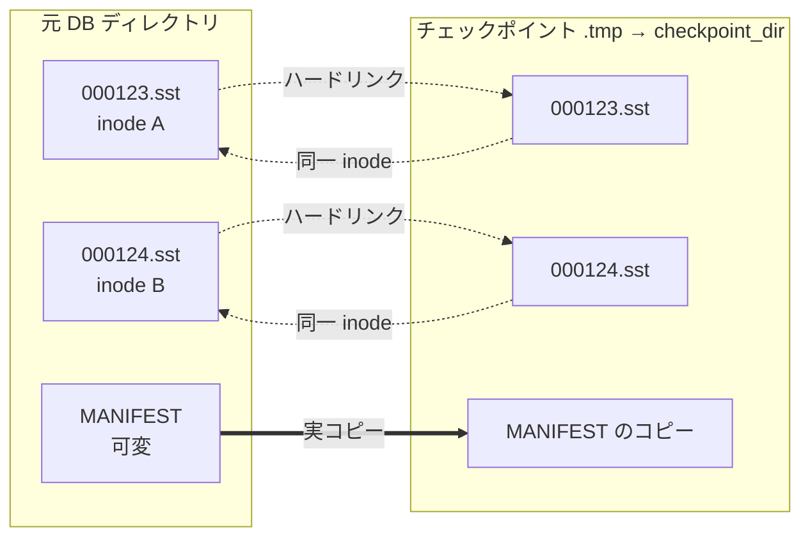
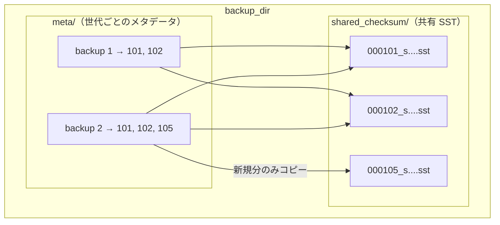
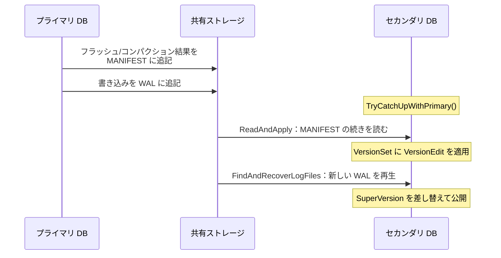

# 第51章 バックアップ・チェックポイント・セカンダリ

> **本章で読むソース**
>
> - [`include/rocksdb/utilities/checkpoint.h`](https://github.com/facebook/rocksdb/blob/v11.1.1/include/rocksdb/utilities/checkpoint.h)
> - [`utilities/checkpoint/checkpoint_impl.cc`](https://github.com/facebook/rocksdb/blob/v11.1.1/utilities/checkpoint/checkpoint_impl.cc)
> - [`include/rocksdb/utilities/backup_engine.h`](https://github.com/facebook/rocksdb/blob/v11.1.1/include/rocksdb/utilities/backup_engine.h)
> - [`utilities/backup/backup_engine.cc`](https://github.com/facebook/rocksdb/blob/v11.1.1/utilities/backup/backup_engine.cc)
> - [`include/rocksdb/sst_file_writer.h`](https://github.com/facebook/rocksdb/blob/v11.1.1/include/rocksdb/sst_file_writer.h)
> - [`db/external_sst_file_ingestion_job.h`](https://github.com/facebook/rocksdb/blob/v11.1.1/db/external_sst_file_ingestion_job.h)
> - [`db/external_sst_file_ingestion_job.cc`](https://github.com/facebook/rocksdb/blob/v11.1.1/db/external_sst_file_ingestion_job.cc)
> - [`db/db_impl/db_impl_secondary.h`](https://github.com/facebook/rocksdb/blob/v11.1.1/db/db_impl/db_impl_secondary.h)
> - [`db/db_impl/db_impl_secondary.cc`](https://github.com/facebook/rocksdb/blob/v11.1.1/db/db_impl/db_impl_secondary.cc)
> - [`db/db_impl/db_impl_follower.h`](https://github.com/facebook/rocksdb/blob/v11.1.1/db/db_impl/db_impl_follower.h)

## この章の狙い

本章では、稼働中の DB を複製したり、別プロセスから読んだりするための四つの機構を扱う。
チェックポイント、バックアップエンジン、外部 SST 取り込み、セカンダリ/フォロワーインスタンスである。
四つに共通する設計の核は、SST が一度書かれたら変更されない不変ファイルだという性質である。
不変性があるからこそ、ハードリンクによる複製、チェックサムによる増分バックアップ、書き込みパスを通さない一括ロード、別プロセスからの安全な追従が成立する。
この対応関係を機構レベルで理解できるようになることを狙う。

## 前提

- SST の不変性とファイル形式は [第14章 テーブル形式](../part03-sst/14-table-format.md)。
- MANIFEST と VersionEdit は [第34章 MANIFEST と VersionEdit](../part06-version/34-manifest-versionedit.md)。
- 参照カウントによる生存ファイル管理は [第37章 ファイル管理](../part06-version/37-file-management.md)。
- ファイルチェックサムは [第21章 チェックサム](../part03-sst/21-checksum.md)。

## チェックポイント：ハードリンクによる瞬時の複製

チェックポイントは、ある時点の DB を別ディレクトリに開ける形で複製する機能である。
複製先が同一ファイルシステム上にあれば、SST と blob ファイルをハードリンクで張るだけで済ませる。
ハードリンクは新しいディレクトリエントリを既存の inode に向けるだけなので、ファイル本体をコピーしない。
このため複製はほぼ瞬時に終わり、追加で消費するディスク容量もほぼゼロになる。
ヘッダのコメントがこの方針を明記している。

[`include/rocksdb/utilities/checkpoint.h` L27-L33](https://github.com/facebook/rocksdb/blob/v11.1.1/include/rocksdb/utilities/checkpoint.h#L27-L33)

```cpp
  // Builds an openable snapshot of RocksDB. checkpoint_dir should contain an
  // absolute path. The specified directory should not exist, since it will be
  // created by the API.
  // When a checkpoint is created,
  // (1) SST and blob files are hard linked if the output directory is on the
  // same filesystem as the database, and copied otherwise.
  // (2) other required files (like MANIFEST) are always copied.
```

ここでファイルの扱いが二種類に分かれている点に注意する。
SST と blob はハードリンクできるが、MANIFEST のような可変ファイルは常にコピーする。
理由は不変性の有無にある。
SST は書き終えたら二度と書き換えられないので、複数のディレクトリが同じ inode を共有しても、一方の更新が他方に漏れる心配がない。
MANIFEST は追記され続ける可変ファイルなので、リンクで共有すると元 DB の追記が複製側に波及してしまう。
不変ファイルだけをリンク対象にすることで、共有の安全性が保たれている。

### 三つのコールバックと same_fs フラグ

実装の本体は `CheckpointImpl::CreateCheckpoint` である。
この関数は一時ディレクトリ（末尾 `.tmp`）を作り、そこへファイルを並べてから本来の名前へ `RenameFile` する。
途中でクラッシュしても中途半端なチェックポイントが見えないよう、最後のリネームで原子的に完成させる構成である。
ファイルの配置そのものは `CreateCustomCheckpoint` に三つのコールバックを渡して任せる。

[`utilities/checkpoint/checkpoint_impl.cc` L144-L171](https://github.com/facebook/rocksdb/blob/v11.1.1/utilities/checkpoint/checkpoint_impl.cc#L144-L171)

```cpp
    if (s.ok() || s.IsNotSupported()) {
      s = CreateCustomCheckpoint(
          [&](const std::string& src_dirname, const std::string& fname,
              FileType) {
            ROCKS_LOG_INFO(db_options.info_log, "Hard Linking %s",
                           fname.c_str());
            return db_->GetFileSystem()->LinkFile(
                src_dirname + "/" + fname, full_private_path + "/" + fname,
                IOOptions(), nullptr);
          } /* link_file_cb */,
          [&](const std::string& src_dirname, const std::string& fname,
              uint64_t size_limit_bytes, FileType,
              const std::string& /* checksum_func_name */,
              const std::string& /* checksum_val */,
              const Temperature temperature) {
            ROCKS_LOG_INFO(db_options.info_log, "Copying %s", fname.c_str());
            return CopyFile(db_->GetFileSystem(), src_dirname + "/" + fname,
                            temperature, full_private_path + "/" + fname,
                            temperature, size_limit_bytes, db_options.use_fsync,
                            nullptr);
          } /* copy_file_cb */,
          [&](const std::string& fname, const std::string& contents, FileType) {
            ROCKS_LOG_INFO(db_options.info_log, "Creating %s", fname.c_str());
            return CreateFile(db_->GetFileSystem(),
                              full_private_path + "/" + fname, contents,
                              db_options.use_fsync);
          } /* create_file_cb */,
          &sequence_number, log_size_for_flush);
```

`link_file_cb` はハードリンク、`copy_file_cb` は実コピー、`create_file_cb` は内容を直接書き出すためのコールバックである。
`CreateCustomCheckpoint` は、まず `GetLiveFilesStorageInfo` で生存ファイルの一覧を取得し、ファイルごとにどのコールバックを呼ぶかを決める。
複製の処理が始まる前に `DisableFileDeletions` でファイル削除を止めている点が重要である（[`utilities/checkpoint/checkpoint_impl.cc` L141](https://github.com/facebook/rocksdb/blob/v11.1.1/utilities/checkpoint/checkpoint_impl.cc#L141)）。
リンクやコピーの最中に元 DB のコンパクションが対象 SST を消すと参照先が失われるため、複製が終わるまで削除を抑止する。

ハードリンクが可能かどうかは、最初のリンク試行の結果から動的に判断する。

[`utilities/checkpoint/checkpoint_impl.cc` L276-L301](https://github.com/facebook/rocksdb/blob/v11.1.1/utilities/checkpoint/checkpoint_impl.cc#L276-L301)

```cpp
    } else {
      if (same_fs && !info.trim_to_size) {
        s = link_file_cb(info.directory, info.relative_filename,
                         info.file_type);
        if (s.IsNotSupported()) {
          same_fs = false;
          s = Status::OK();
        }
        s.MustCheck();
      }
      if (!same_fs || info.trim_to_size) {
        assert(info.file_checksum_func_name.empty() ==
               !opts.include_checksum_info);
        // no assertion on file_checksum because empty is used for both "not
        // set" and "unknown"
        if (opts.include_checksum_info) {
          s = copy_file_cb(info.directory, info.relative_filename, info.size,
                           info.file_type, info.file_checksum_func_name,
                           info.file_checksum, info.temperature);
        } else {
          s = copy_file_cb(info.directory, info.relative_filename, info.size,
                           info.file_type, kUnknownFileChecksumFuncName,
                           kUnknownFileChecksum, info.temperature);
        }
      }
    }
```

`same_fs` の初期値は真である。
`link_file_cb` が `NotSupported` を返すのは、複製先が別ファイルシステムにあってリンクを張れない場合である。
そのとき `same_fs` を偽に落とし、以後はすべてコピーに切り替える。
この一回の試行と切り替えにより、同一ファイルシステムなら全 SST をリンクで処理し、別ファイルシステムなら自動的にコピーへ退避する。
`trim_to_size` が立つファイル（末尾を切り詰めて複製する必要があるファイル）も、リンクでは表現できないのでコピー扱いになる。



### 高速化の核：コピーを inode 共有に置き換える

チェックポイントの速さは、データ量に比例する I/O を、ファイル数に比例するメタデータ操作へ置き換えたことから来る。
SST 本体をコピーすれば全バイトを読み書きするが、ハードリンクは inode への参照を一つ増やすだけで、本体には触れない。
数百 GB の DB であっても、リンクするのはディレクトリエントリの追加だけなので、複製はミリ秒の単位で終わる。
追加容量がほぼゼロになるのも同じ理由による。
複製直後は両ディレクトリが同じデータブロックを共有し、その後 DB 側でコンパクションが進んで古い SST が論理的に削除されても、チェックポイント側のリンクが残る限り inode は解放されない。
チェックポイントは、削除を止めたうえで生存 SST のリンクを張り終えた瞬間の、ポイントインタイムの像を保持する。

## バックアップエンジン：チェックサムによる増分バックアップ

バックアップエンジンは、複数世代のバックアップをひとつのディレクトリに蓄える。
鍵となるのは、世代をまたいで同一の SST を共有し、新しく増えた SST だけをコピーする増分バックアップである。
この共有を有効にするオプションが `share_table_files` と `share_files_with_checksum` で、いずれも既定で真である。

[`include/rocksdb/utilities/backup_engine.h` L46-L55](https://github.com/facebook/rocksdb/blob/v11.1.1/include/rocksdb/utilities/backup_engine.h#L46-L55)

```cpp
  // share_table_files supports table and blob files.
  //
  // If share_table_files == true, the backup directory will share table and
  // blob files among backups, to save space among backups of the same DB and to
  // enable incremental backups by only copying new files.
  // If share_table_files == false, each backup will be on its own and will not
  // share any data with other backups.
  //
  // default: true
  bool share_table_files;
```

### バックアップはチェックポイントを内部で再利用する

新しいバックアップを作る `CreateNewBackupWithMetadata` は、チェックポイントの仕組みをそのまま流用している。
`CheckpointImpl` を生成し、`CreateCustomCheckpoint` に三つのコールバックを渡す。
ただし `link_file_cb` には常に `NotSupported` を返させ、ファイルをすべて `copy_file_cb` 経由で処理させる。

[`utilities/backup/backup_engine.cc` L1526-L1532](https://github.com/facebook/rocksdb/blob/v11.1.1/utilities/backup/backup_engine.cc#L1526-L1532)

```cpp
    io_s = status_to_io_status(checkpoint.CreateCustomCheckpoint(
        [&](const std::string& /*src_dirname*/, const std::string& /*fname*/,
            FileType) {
          // custom checkpoint will switch to calling copy_file_cb after it sees
          // NotSupported returned from link_file_cb.
          return IOStatus::NotSupported();
        } /* link_file_cb */,
```

チェックポイントが生存ファイルの列挙と削除抑止を担い、その各ファイルに対してバックアップ側のコールバックが「すでにバックアップ済みかどうか」を判定する。
列挙の仕組みを共有し、ファイル単位の振り分けだけを差し替える設計である。

### コピーするかしないかの判定

増分バックアップの本体は `AddBackupFileWorkItem` にある。
共有対象のファイルについて、バックアップ先に同名ファイルが存在するかを調べ、存在すればコピーを省く。

[`utilities/backup/backup_engine.cc` L2627-L2653](https://github.com/facebook/rocksdb/blob/v11.1.1/utilities/backup/backup_engine.cc#L2627-L2653)

```cpp
  // Step 2: Determine whether to copy or not
  // if it's shared, we also need to check if it exists -- if it does, no need
  // to copy it again.
  bool need_to_copy = true;
  // true if final_dest_path is the same path as another live file
  const bool same_path =
      live_dst_paths.find(final_dest_path) != live_dst_paths.end();

  bool file_exists = false;
  if (shared && !same_path) {
    // Should be in shared directory but not a live path, check existence in
    // shared directory
    IOStatus exist =
        backup_fs_->FileExists(final_dest_path, io_options_, nullptr);
    if (exist.ok()) {
      file_exists = true;
    } else if (exist.IsNotFound()) {
      file_exists = false;
    } else {
      return exist;
    }
  }

  if (!contents.empty()) {
    need_to_copy = false;
  } else if (shared && (same_path || file_exists)) {
    need_to_copy = false;
```

`final_dest_path` は共有ディレクトリ内でのファイル名で、`shared_checksum` 命名では `<file_number>_s<db_session_id>.sst` のように決まる（[`utilities/backup/backup_engine.cc` L546-L557](https://github.com/facebook/rocksdb/blob/v11.1.1/utilities/backup/backup_engine.cc#L546-L557)）。
DB セッション ID は SST を生成した DB の起動ごとに一意なので、ファイル番号と組み合わせれば、内容の異なる別ファイルが偶然同名になる事故をほぼ防げる。
バックアップ先にこの名前のファイルがすでにあれば、それは過去の世代でコピー済みの同一 SST だとみなし、`need_to_copy` を偽にしてコピーを丸ごと省く。

ここで効くのが SST の不変性である。
ファイル番号とセッション ID が一致する SST は、内容も完全に一致する。
書き換えられないファイルだからこそ、名前の一致だけで内容の一致を結論でき、中身を読み直さずに共有を決められる。
新しい世代のバックアップは、前回から増えた SST だけをコピーすることになる。

### チェックサムも読み直さず引き継ぐ

すでにバックアップ済みと判定したファイルについては、チェックサムの再計算すら省く。

[`utilities/backup/backup_engine.cc` L2676-L2681](https://github.com/facebook/rocksdb/blob/v11.1.1/utilities/backup/backup_engine.cc#L2676-L2681)

```cpp
        if (!same_path && !find_result->second->checksum_hex.empty()) {
          assert(find_result != backuped_file_infos_.end());
          // Note: to save I/O on incremental backups, we copy prior known
          // checksum of the file instead of reading entire file contents
          // to recompute it.
          checksum_hex = find_result->second->checksum_hex;
```

`backuped_file_infos_` は、バックアップ済みファイルのメタデータ（チェックサムとサイズを含む）を保持するテーブルである。
共有ファイルがそこに登録済みなら、保存しておいたチェックサムをそのまま採用する。
コメントが明言するとおり、増分バックアップの I/O を抑えるために、ファイル全体を読み直してチェックサムを再計算する代わりに、既知の値を引き継ぐ。
SST が不変である以上、過去に計算したチェックサムは今も正しい。
ここでのチェックサムは、DB が `FileChecksumGenCrc32cFactory` を設定していれば DB 側のファイルチェックサム（[第21章 チェックサム](../part03-sst/21-checksum.md)）と照合でき、バックアップ全体の整合性検証は `VerifyBackup` が担う。

### 復元と新規バックアップの API

バックアップの作成は `CreateNewBackup`、復元は `RestoreDBFromBackup` である。
作成側は追記専用の基底クラスに定義され、内部で `CreateNewBackupWithMetadata` に委譲する。

[`include/rocksdb/utilities/backup_engine.h` L597-L606](https://github.com/facebook/rocksdb/blob/v11.1.1/include/rocksdb/utilities/backup_engine.h#L597-L606)

```cpp
  // Captures the state of the database by creating a new (latest) backup.
  // On success (OK status), the BackupID of the new backup is saved to
  // *new_backup_id when not nullptr.
  // NOTE: db_paths and cf_paths are not supported for creating backups,
  // and NotSupported will be returned when the DB (without WALs) uses more
  // than one directory.
  virtual IOStatus CreateNewBackup(const CreateBackupOptions& options, DB* db,
                                   BackupID* new_backup_id = nullptr) {
    return CreateNewBackupWithMetadata(options, db, "", new_backup_id);
  }
```

復元は読み取り専用の基底クラスに定義され、指定した `backup_id` の世代を `db_dir` と `wal_dir` へ書き出す。

[`include/rocksdb/utilities/backup_engine.h` L528-L532](https://github.com/facebook/rocksdb/blob/v11.1.1/include/rocksdb/utilities/backup_engine.h#L528-L532)

```cpp
  // Restore to specified db_dir and wal_dir from backup_id.
  virtual IOStatus RestoreDBFromBackup(const RestoreOptions& options,
                                       BackupID backup_id,
                                       const std::string& db_dir,
                                       const std::string& wal_dir) const = 0;
```

各世代のバックアップは、自分が参照する共有 SST の一覧をメタデータとして持つ。
復元時は、そのメタデータをもとに共有ディレクトリから必要な SST を集めて `db_dir` へ展開する。
共有 SST は複数世代から参照されるため、世代を消すときも、まだ他の世代が参照しているファイルは残す。
これは [第37章 ファイル管理](../part06-version/37-file-management.md) で見た参照カウントによる生存管理と同じ考え方である。



backup 2 を作るとき、`000101` と `000102` はすでに共有ディレクトリに存在するのでコピーを省き、新規の `000105` だけをコピーする。
これが増分バックアップの実体である。

## 外部 SST 取り込み：書き込みパスを迂回する一括ロード

大量データを一気に投入したいとき、`Put` を繰り返すと MemTable と WAL を経由して書き込みパス全体を通ることになる。
外部 SST 取り込みは、この経路を迂回する。
あらかじめソート済みのデータから SST ファイルを直接組み立て、それを LSM ツリーへファイル単位で差し込む。

### SstFileWriter で SST を直接作る

`SstFileWriter` は、DB を介さずに単体の SST を生成するためのクラスである。
キーをソート順に渡す制約があり、生成された SST 内の全キーはシーケンス番号 0 を持つ。

[`include/rocksdb/sst_file_writer.h` L72-L76](https://github.com/facebook/rocksdb/blob/v11.1.1/include/rocksdb/sst_file_writer.h#L72-L76)

```cpp
// SstFileWriter is used to create sst files that can be added to database later
// All keys in files generated by SstFileWriter will have sequence number = 0.
//
// This class is NOT thread-safe.
class SstFileWriter {
```

`Open` でファイルを開き、`Put` や `Merge`、`Delete` でソート順にキーを足し、`Finish` で閉じる（[`include/rocksdb/sst_file_writer.h` L102-L175](https://github.com/facebook/rocksdb/blob/v11.1.1/include/rocksdb/sst_file_writer.h#L102-L175)）。
できあがるのは、ブロックベーステーブル形式（[第14章 テーブル形式](../part03-sst/14-table-format.md)）に準拠した通常の SST である。
全キーのシーケンス番号が 0 なのは、このファイルがまだどの DB にも属していないからで、取り込み時に DB 側がグローバルなシーケンス番号を割り当てる。

### IngestExternalFile で LSM に差し込む

生成した SST を取り込むのが `DB::IngestExternalFile` で、内部では `ExternalSstFileIngestionJob` が処理を進める。
ジョブはまず `Prepare` で外部ファイルを DB ディレクトリへ運び込む。
`move_files` か `link_files` が指定されていればハードリンクを試み、別ファイルシステムなどでリンクできなければコピーへ退避する。

[`db/external_sst_file_ingestion_job.cc` L160-L201](https://github.com/facebook/rocksdb/blob/v11.1.1/db/external_sst_file_ingestion_job.cc#L160-L201)

```cpp
    if (ingestion_options_.move_files || ingestion_options_.link_files) {
      status =
          fs_->LinkFile(path_outside_db, path_inside_db, IOOptions(), nullptr);
      if (status.ok()) {
        // ... (中略：リンク後に再オープンして sync する) ...
      } else if (status.IsNotSupported() &&
                 ingestion_options_.failed_move_fall_back_to_copy) {
        // Original file is on a different FS, use copy instead of hard linking.
        f.copy_file = true;
```

チェックポイントと同じく、ここでもリンクできるならリンクで済ませてコピーを避ける。
取り込み元の SST を消してよいなら（`move_files`）、リンクは実質的にファイルの移動になり、I/O はメタデータ操作だけで終わる。

### 取り込み先レベルの決定と重なり扱い

取り込みの肝は、ファイルをどのレベルに置くかの決定である。
`AssignLevelAndSeqnoForIngestedFile` は、上のレベルから順に既存データとの重なりを調べ、重なりが見つかった時点で探索を打ち切る。
重なりがなければ、ファイルが収まる可能な限り下のレベルを選ぶ。
重なりがあれば、L0 または重なったレベルより上のレベルに置き、global seqno を割り当てて既存キーを上書きできるようにする。

[`db/external_sst_file_ingestion_job.cc` L1306-L1349](https://github.com/facebook/rocksdb/blob/v11.1.1/db/external_sst_file_ingestion_job.cc#L1306-L1349)

```cpp
  for (int lvl = 0; lvl < overlap_checking_exclusive_end; lvl++) {
    if (lvl > 0 && lvl < vstorage->base_level()) {
      continue;
    }
    // ... (中略：atomic_replace_range_ が立つ場合の分岐) ...
    if (cfd_->RangeOverlapWithCompaction(file_to_ingest->start_ukey,
                                         file_to_ingest->limit_ukey, lvl)) {
      // We must use L0 or any level higher than `lvl` to be able to overwrite
      // the compaction output keys that we overlap with in this level, We also
      // need to assign this file a seqno to overwrite the compaction output
      // keys in level `lvl`
      overlap_with_db = true;
      break;
    } else if (vstorage->NumLevelFiles(lvl) > 0) {
      bool overlap_with_level = false;
      status = sv->current->OverlapWithLevelIterator(
          ro, env_options_, file_to_ingest->start_ukey,
          file_to_ingest->limit_ukey, lvl, &overlap_with_level);
      // ... (中略：status を確認) ...
      if (overlap_with_level) {
        // We must use L0 or any level higher than `lvl` to be able to overwrite
        // the keys that we overlap with in this level, We also need to assign
        // this file a seqno to overwrite the existing keys in level `lvl`
        overlap_with_db = true;
        break;
      }
    }

    // We don't overlap with any keys in this level, but we still need to check
    // if our file can fit in it
    if (lvl < assigned_level_exclusive_end &&
        IngestedFileFitInLevel(file_to_ingest, lvl)) {
      target_level = lvl;
    }
  }
```

ループは、あるレベルの既存ファイルやコンパクション出力とキー範囲が重なった時点で止まる。
重なるレベルへ静かに置くと、どちらのキーが新しいのか区別できなくなるからである。
重なりが見つかると `overlap_with_db` を立てて探索を打ち切り、ループを抜けた先で `picked_level` を確定し、上書きに必要な global seqno を割り当てる。
重なったレベルへそのまま並べることはできないので、置き先は L0 か、重なったレベルより上のレベルに限られる。
そこへ既存より新しい seqno を持つファイルを置くことで、コメントが述べるとおり重なった既存キーやコンパクション出力を上書きできる。
重なりがなければ、ファイルが収まる可能な限り下のレベルを `target_level` に選び、そのレベルへ直接ファイルを足す。
取り込んだファイルが既存データと重ならない範囲を占めるなら、より下のレベルに置くことで上位レベルを通らずに済み、後続のコンパクション負荷も増やさない。

レベルが決まると `Run` がそのレベルへの追加を VersionEdit に記録する（[`db/external_sst_file_ingestion_job.cc` L722](https://github.com/facebook/rocksdb/blob/v11.1.1/db/external_sst_file_ingestion_job.cc#L722)）。
取り込みが MemTable のキー範囲と重なるかどうかは `NeedsFlush` が判定し、重なる場合だけ MemTable をフラッシュしてから取り込む（[`db/external_sst_file_ingestion_job.h` L255-L263](https://github.com/facebook/rocksdb/blob/v11.1.1/db/external_sst_file_ingestion_job.h#L255-L263)）。

### 高速化の核：書き込みパスを通さない

通常の書き込みは、WriteBatch を WAL に書き、MemTable に挿入し、やがてフラッシュで SST になる。
取り込みは、その出口にあたる SST をあらかじめ作っておき、VersionEdit でレベルに足すだけで完了させる。
WAL への追記も、MemTable への挿入も、フラッシュのための書き込みも発生しない。
大量データのロードでは、この迂回によって I/O と CPU の大半を削れる。
ファイルをリンクで運べる場合は、データの移動すら起きない。

## セカンダリ/フォロワーインスタンス：別プロセスからの追従

セカンダリインスタンスは、書き込み側（プライマリ）の DB ファイルを別プロセスから読み取り専用で開き、最新に近い状態へ追従する。
プライマリと協調する必要はなく、プライマリが書く MANIFEST と WAL をセカンダリが自力で読んで再生する。
ヘッダのコメントがこの関係を説明している。

[`db/db_impl/db_impl_secondary.h` L68-L75](https://github.com/facebook/rocksdb/blob/v11.1.1/db/db_impl/db_impl_secondary.h#L68-L75)

```cpp
// The secondary instance shares access to the storage as the primary.
// The secondary is able to read and replay changes described in both the
// MANIFEST and the WAL files without coordination with the primary.
// The secondary instance can be opened using `DB::OpenAsSecondary`. After
// that, it can call `DBImplSecondary::TryCatchUpWithPrimary` to make best
// effort attempts to catch up with the primary.
// TODO: Share common structure with CompactedDBImpl and DBImplReadOnly
class DBImplSecondary : public DBImpl {
```

セカンダリはすべての書き込み系 API を `NotSupported` で拒否する。
`Put`、`Merge`、`Delete`、`Write`、`Flush`、`CompactRange` のいずれも、読み取り専用であることを返すだけである（[`db/db_impl/db_impl_secondary.h` L127-L209](https://github.com/facebook/rocksdb/blob/v11.1.1/db/db_impl/db_impl_secondary.h#L127-L209)）。

### TryCatchUpWithPrimary の二段構え

追従の入口が `TryCatchUpWithPrimary` である。
処理は二段構えで、まず MANIFEST を読んで新しい VersionEdit を取り込み、次に WAL を読んで未反映の書き込みを再生する。

[`db/db_impl/db_impl_secondary.cc` L646-L687](https://github.com/facebook/rocksdb/blob/v11.1.1/db/db_impl/db_impl_secondary.cc#L646-L687)

```cpp
    InstrumentedMutexLock lock_guard(&mutex_);
    assert(manifest_reader_.get() != nullptr);
    s = static_cast_with_check<ReactiveVersionSet>(versions_.get())
            ->ReadAndApply(&mutex_, &manifest_reader_,
                           manifest_reader_status_.get(), &cfds_changed,
                           /*files_to_delete=*/nullptr);
    // ... (中略：変更されたカラムファミリーのログ出力) ...
    // list wal_dir to discover new WALs and apply new changes to the secondary
    // instance
    if (s.ok()) {
      s = FindAndRecoverLogFiles(&cfds_changed, &job_context);
      if (s.IsPathNotFound()) {
        ROCKS_LOG_INFO(
            immutable_db_options_.info_log,
            "Secondary tries to read WAL, but WAL file(s) have already "
            "been purged by primary.");
        s = Status::OK();
      }
    }
    if (s.ok()) {
      for (auto cfd : cfds_changed) {
        cfd->imm()->RemoveOldMemTables(cfd->GetLogNumber(),
                                       &job_context.memtables_to_free);
        auto& sv_context = job_context.superversion_contexts.back();
        cfd->InstallSuperVersion(&sv_context, &mutex_);
        sv_context.NewSuperVersion();
      }
    }
```

第一段の `ReadAndApply` は、プライマリが追記し続ける MANIFEST を `manifest_reader_` で続きから読み、新しい VersionEdit をセカンダリの `VersionSet` に適用する。
これにより、プライマリのフラッシュやコンパクションで増減した SST の集合が、セカンダリ側の LSM ツリーへ反映される。
MANIFEST は追記専用なので、セカンダリは前回読んだ位置から続きを読むだけで差分を取り込める。

第二段の `FindAndRecoverLogFiles` は、WAL ディレクトリを走査して新しい WAL を見つけ、まだ SST 化されていない最新の書き込みを再生する。
プライマリがまだフラッシュしていない直近の更新は MANIFEST には現れないので、WAL から拾う必要がある。
WAL がすでにプライマリに削除されていた場合は、`PathNotFound` を握りつぶして処理を続ける。
両段が済むと、変更のあったカラムファミリーごとに古い MemTable を片付け、新しい SuperVersion を据えて、追従後の状態を読み取りに公開する。

`PathNotFound` を成功扱いにするのは、セカンダリがプライマリのファイル削除と競合しうるためである。
セカンダリは DB ファイルを所有しないと宣言しており（[`db/db_impl/db_impl_secondary.h` L268-L274](https://github.com/facebook/rocksdb/blob/v11.1.1/db/db_impl/db_impl_secondary.h#L268-L274)）、プライマリが消したファイルを掴んでしまうと読み取りが `IOError` になりうる。
読み取りを失敗させたくないなら、プライマリとセカンダリでファイル削除を協調させるか、`max_open_files=-1` でファイルを開きっぱなしにして、削除後もディスクリプタ経由で読めるようにする運用が示されている（[`db/db_impl/db_impl_secondary.h` L90-L98](https://github.com/facebook/rocksdb/blob/v11.1.1/db/db_impl/db_impl_secondary.h#L90-L98)）。



### フォロワーインスタンス

フォロワーインスタンスは `DBImplSecondary` を継承し、追従を自動化したものである。

[`db/db_impl/db_impl_follower.h` L18-L24](https://github.com/facebook/rocksdb/blob/v11.1.1/db/db_impl/db_impl_follower.h#L18-L24)

```cpp
class DBImplFollower : public DBImplSecondary {
 public:
  DBImplFollower(const DBOptions& db_options, std::unique_ptr<Env>&& env,
                 const std::string& dbname, std::string src_path);
  ~DBImplFollower();

  Status Close() override;
```

フォロワーは専用のスレッド `catch_up_thread_` を持ち、`PeriodicRefresh` で定期的に `TryCatchUpWithLeader` を呼ぶ（[`db/db_impl/db_impl_follower.h` L43-L52](https://github.com/facebook/rocksdb/blob/v11.1.1/db/db_impl/db_impl_follower.h#L43-L52)）。
セカンダリでは利用側が明示的に `TryCatchUpWithPrimary` を呼ぶのに対し、フォロワーは背後のスレッドが追従を回し続ける。
セカンダリとフォロワーの違いは、`OwnTablesAndLogs` の戻り値にも現れる。
セカンダリは偽を返してファイルを所有しないが、フォロワーは真を返す（[`db/db_impl/db_impl_follower.h` L27-L31](https://github.com/facebook/rocksdb/blob/v11.1.1/db/db_impl/db_impl_follower.h#L27-L31)）。
これは読み取りスケーリングの用途でファイル削除を自前で扱うための布石で、ヘッダの TODO コメントが今後の実装予定として記している。

いずれも、書き込みを受け付けるプライマリと、その変更を追って読み取りを担う複数のインスタンスという、リードレプリカ的な構成を一台のストレージ上で実現する。

## まとめ

- チェックポイントは、SST と blob を同一ファイルシステム上でハードリンクして、ほぼ瞬時かつ追加容量ほぼゼロでポイントインタイムの複製を作る。
  SST が不変だからリンク共有が安全に成立する。
  MANIFEST のような可変ファイルは常にコピーする。
- バックアップエンジンの増分は、共有ディレクトリに同名 SST が存在するかで「コピー済みか」を判定し、新規分だけコピーする。
  ファイル番号と DB セッション ID の一致が内容の一致を意味するのは、SST が書き換えられないからである。
  チェックサムも読み直さず既知の値を引き継ぐ。
- バックアップは内部でチェックポイントの `CreateCustomCheckpoint` を再利用し、ファイルの振り分けだけを差し替える。
- 外部 SST 取り込みは、`SstFileWriter` でソート済みデータから SST を直接作り、`IngestExternalFile` で WAL と MemTable を通さずに LSM へ差し込む。
  取り込み先は、既存データと重ならなければ可能な限り下のレベルを選ぶ。
  重なる場合は L0 または重なったレベルより上に置き、global seqno を割り当てて既存キーを上書きできるようにする。
- セカンダリは、プライマリが追記する MANIFEST と WAL を協調なしに追従し、`TryCatchUpWithPrimary` で読み取り専用の最新に近い状態を保つ。
  フォロワーは専用スレッドでこの追従を自動化する。

## 関連する章

- [第14章 テーブル形式](../part03-sst/14-table-format.md)：SST の不変性とブロックベーステーブル形式。
  本章の各機構の土台。
- [第21章 チェックサム](../part03-sst/21-checksum.md)：ファイルチェックサムの生成と検証。
  バックアップの整合性検証と関わる。
- [第34章 MANIFEST と VersionEdit](../part06-version/34-manifest-versionedit.md)：セカンダリが追従する MANIFEST の構造。
- [第37章 ファイル管理](../part06-version/37-file-management.md)：参照カウントによる生存ファイル管理。
  共有 SST の削除判断と同じ仕組み。
- [第50章 トランザクション](./50-transactions.md)：取り込みと書き込みの整合性に関わる隣接機構。
