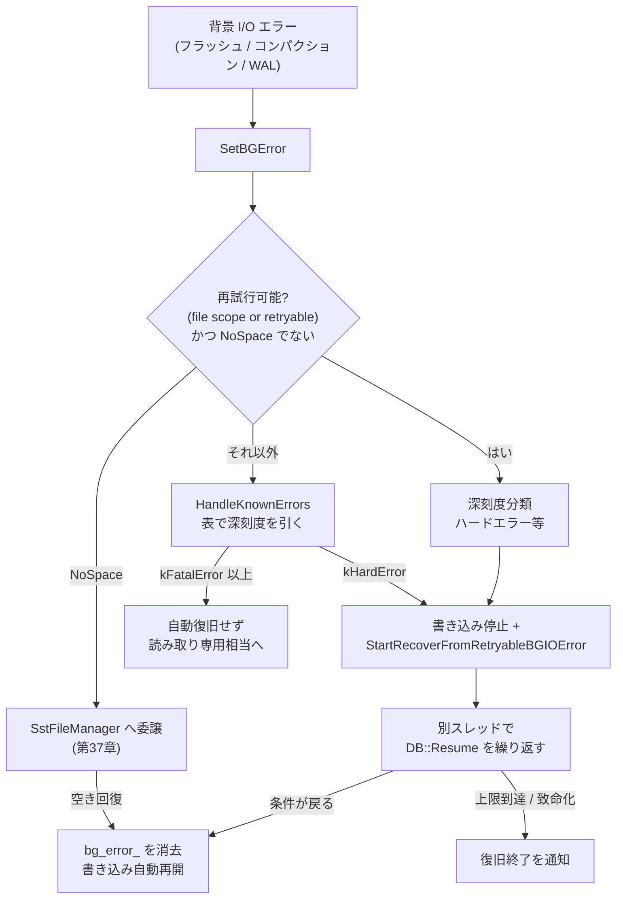
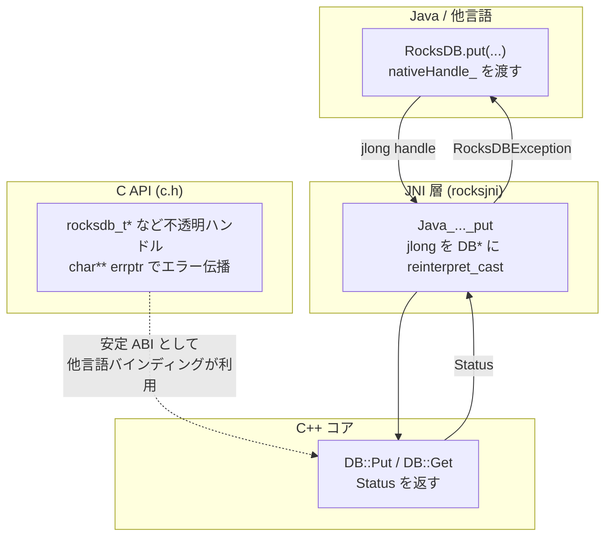

# 第52章 エラーハンドリング、トレース、言語バインディング

> **本章で読むソース**
>
> - [`include/rocksdb/status.h`](https://github.com/facebook/rocksdb/blob/v11.1.1/include/rocksdb/status.h)
> - [`include/rocksdb/io_status.h`](https://github.com/facebook/rocksdb/blob/v11.1.1/include/rocksdb/io_status.h)
> - [`db/error_handler.h`](https://github.com/facebook/rocksdb/blob/v11.1.1/db/error_handler.h)
> - [`db/error_handler.cc`](https://github.com/facebook/rocksdb/blob/v11.1.1/db/error_handler.cc)
> - [`trace_replay/trace_replay.h`](https://github.com/facebook/rocksdb/blob/v11.1.1/trace_replay/trace_replay.h)
> - [`include/rocksdb/c.h`](https://github.com/facebook/rocksdb/blob/v11.1.1/include/rocksdb/c.h)
> - [`java/rocksjni/rocksjni.cc`](https://github.com/facebook/rocksdb/blob/v11.1.1/java/rocksjni/rocksjni.cc)
> - [`java/src/main/java/org/rocksdb/RocksDB.java`](https://github.com/facebook/rocksdb/blob/v11.1.1/java/src/main/java/org/rocksdb/RocksDB.java)
> - [`tools/db_bench_tool.cc`](https://github.com/facebook/rocksdb/blob/v11.1.1/tools/db_bench_tool.cc)
> - [`include/rocksdb/utilities/ldb_cmd.h`](https://github.com/facebook/rocksdb/blob/v11.1.1/include/rocksdb/utilities/ldb_cmd.h)

## この章の狙い

本章では、RocksDB が失敗をどう表し、運用中の障害からどう自力で立ち直り、C++ 以外の言語からどう使われるかを読む。
戻り値型 `Status` が失敗時にだけメッセージを確保する軽量な設計であること、`ErrorHandler` が背景 I/O エラーを深刻度で分類して回復可能なら自動で書き込みを再開させること、そして C API がハンドルベースで全機能を公開し Java の JNI バインディングの土台になることを、機構のレベルで理解できるようにする。
本書の締めくくりとして、ここまで読んできた各層がエラーと外部接続の面でどうつながるかも示す。

## 前提

- [第46章 Env と FileSystem](../part09-env/46-env-filesystem.md)（`IOStatus` を返す I/O 抽象）
  本章の `IOStatus` はここで生まれる。
- [第8章 書き込みパイプライン](../part02-write-path/08-write-pipeline.md)（フラッシュや WAL 書き込みが失敗したとき `SetBGError` が呼ばれる経路）
- [第37章 ファイル管理](../part06-version/37-file-management.md)（`SstFileManager` による容量逼迫の検知）
  NoSpace エラーの自動復旧はここへ委譲される。

## Status と IOStatus

RocksDB のほとんどの API は、結果を `Status` という値型で返す。
`Status` は成功か失敗かを表し、失敗のときはエラーの種類と付随メッセージを持つ。
例外を投げず、戻り値で失敗を運ぶ設計である。

`Status` の状態は、列挙の `Code` と `SubCode`、深刻度の `Severity`、いくつかのフラグ、そして文字列メッセージへのポインタで構成される。

[`include/rocksdb/status.h` L517-L526](https://github.com/facebook/rocksdb/blob/v11.1.1/include/rocksdb/status.h#L517-L526)

```cpp
 protected:
  Code code_;
  SubCode subcode_;
  Severity sev_;
  bool retryable_;
  bool data_loss_;
  unsigned char scope_;
  // A nullptr state_ (which is at least the case for OK) means the extra
  // message is empty.
  std::unique_ptr<const char[]> state_;
```

`Code` はエラーの大分類である。
成功を表す `kOk` から、`kNotFound`、`kCorruption`、`kIOError`、`kBusy` まで、16種類が定義されている。

[`include/rocksdb/status.h` L75-L93](https://github.com/facebook/rocksdb/blob/v11.1.1/include/rocksdb/status.h#L75-L93)

```cpp
  enum Code : unsigned char {
    kOk = 0,
    kNotFound = 1,
    kCorruption = 2,
    kNotSupported = 3,
    kInvalidArgument = 4,
    kIOError = 5,
    // ... (中略) ...
    kColumnFamilyDropped = 15,
    kMaxCode
  };
```

`SubCode` は同じ `Code` のなかでの細分である。
たとえば `kIOError` のなかには、ディスク満杯を表す `kNoSpace` や、容量上限超過の `kSpaceLimit` がある。
`IsNoSpace()` は、`code() == kIOError` かつ `subcode() == kNoSpace` のときに真を返す述語である。

この二段の分類が、本章後半のエラー自動復旧で深刻度を引くキーになる。

### 失敗時にだけメッセージを確保する

成功を表す `Status` の生成を見ると、文字列の確保が起きないことがわかる。
既定コンストラクタは `code_` を `kOk` に、`state_` を `nullptr` に初期化するだけである。

[`include/rocksdb/status.h` L38-L45](https://github.com/facebook/rocksdb/blob/v11.1.1/include/rocksdb/status.h#L38-L45)

```cpp
  Status()
      : code_(kOk),
        subcode_(kNone),
        sev_(kNoError),
        retryable_(false),
        data_loss_(false),
        scope_(0),
        state_(nullptr) {}
```

`state_` は `std::unique_ptr<const char[]>` であり、ヘッダのコメントが述べるとおり `nullptr` は付随メッセージが空であることを意味する。
成功は値型のメンバを埋めるだけで完結し、ヒープ確保もポインタ追跡も発生しない。
`Status::OK()` は単にこの既定コンストラクタを呼び出す。

文字列を確保するのは、メッセージ付きの失敗を作るときだけである。
`Slice` を2つ受け取るコンストラクタは、両者を連結したバイト列を `new char[]` で確保し、`state_` に持たせる。
この経路は失敗時にしか通らない。

成功を表す `Status` を1つコピーするコストは、数バイトのスカラと `nullptr` のコピーで済む。
読み書きの正常系では、関数が成功 `Status` を返して呼び出し側がそれを `ok()` で確かめる。
この経路で `Status` がヒープに触れないことが、戻り値で失敗を運ぶ設計を軽量に保っている。

ムーブも軽い。
ムーブ代入はメンバを移し、移動元の `code_` を `kOk` に、`state_` を空に戻す。

[`include/rocksdb/status.h` L602-L621](https://github.com/facebook/rocksdb/blob/v11.1.1/include/rocksdb/status.h#L602-L621)

```cpp
inline Status& Status::operator=(Status&& s) noexcept {
  if (this != &s) {
    s.MarkChecked();
    MustCheck();
    code_ = std::move(s.code_);
    s.code_ = kOk;
    // ... (中略：subcode_, sev_, retryable_, data_loss_, scope_ を同様に移す) ...
    state_ = std::move(s.state_);
  }
  return *this;
}
```

`ROCKSDB_ASSERT_STATUS_CHECKED` を定義してビルドすると、`checked_` フラグが加わり、確認されないまま破棄された `Status` で `std::abort()` する。
これは失敗の握り潰しをデバッグ時に検出するための仕掛けで、通常ビルドではフラグそのものがコンパイルされない。

### I/O 起因を区別する IOStatus

`IOStatus` は `Status` を継承し、I/O 起因の失敗を区別する型である（第46章）。
`Env` と `FileSystem` の I/O メソッドはこの型を返す。

[`include/rocksdb/io_status.h` L28-L38](https://github.com/facebook/rocksdb/blob/v11.1.1/include/rocksdb/io_status.h#L28-L38)

```cpp
class IOStatus : public Status {
 public:
  using Code = Status::Code;
  using SubCode = Status::SubCode;

  enum IOErrorScope : unsigned char {
    kIOErrorScopeFileSystem,
    kIOErrorScopeFile,
    kIOErrorScopeRange,
    kIOErrorScopeMax,
  };
```

`IOStatus` は基底のフラグ群に独自の意味を与える。
`SetRetryable` は再試行で成功しうる一時的な失敗かどうかを、`SetDataLoss` はデータ損失を伴うかを、`SetScope` はエラーがファイルシステム全体か単一ファイルかといった影響範囲を立てる。
これらは `ErrorHandler` が深刻度を判定するときの入力になる。

`Status` から `IOStatus` への変換は `status_to_io_status` が担う。
これは基底部分をムーブで移すだけの薄い関数で、`ErrorHandler` が背景エラーを受け取る入口で使われる。

## ErrorHandler と自動復旧

フラッシュやコンパクションは背景スレッドで動く（第8章）。
そこで I/O エラーが起きても、呼び出し側のスレッドには即座に返せない。
`ErrorHandler` は、こうした背景エラーを受け取り、深刻度を分類し、書き込みを止めるか自動で復旧するかを決める。

入口は `SetBGError` である。
受け取った `Status` を `IOStatus` に変換し、影響範囲と再試行可否で経路を分ける。

[`db/error_handler.cc` L413-L423](https://github.com/facebook/rocksdb/blob/v11.1.1/db/error_handler.cc#L413-L423)

```cpp
void ErrorHandler::SetBGError(const Status& bg_status,
                              BackgroundErrorReason reason, bool wal_related) {
  db_mutex_->AssertHeld();
  Status tmp_status = bg_status;
  IOStatus bg_io_err = status_to_io_status(std::move(tmp_status));

  if (bg_io_err.ok()) {
    return;
  }
  ROCKS_LOG_WARN(db_options_.info_log, "Background IO error %s, reason %d",
                 bg_io_err.ToString().c_str(), static_cast<int>(reason));
```

第2引数の `BackgroundErrorReason` は、エラーがどの作業中に起きたかを表す（コンパクション、フラッシュ、書き込み、MANIFEST 書き込みなど）。
同じ `Code` でも、作業の種類によって深刻度の扱いが変わる。

### 深刻度を表で引く

深刻度の分類は、ハードコードした分岐ではなく3枚の `std::map` で表現されている。
キーが具体的なものから順に並び、見つからなければ次の表へ落ちる構造である。

[`db/error_handler.cc` L16-L24](https://github.com/facebook/rocksdb/blob/v11.1.1/db/error_handler.cc#L16-L24)

```cpp
// Maps to help decide the severity of an error based on the
// BackgroundErrorReason, Code, SubCode and whether db_options.paranoid_checks
// is set or not. There are 3 maps, going from most specific to least specific
// (i.e from all 4 fields in a tuple to only the BackgroundErrorReason and
// paranoid_checks). The less specific map serves as a catch all in case we miss
// a specific error code or subcode.
std::map<std::tuple<BackgroundErrorReason, Status::Code, Status::SubCode, bool>,
         Status::Severity>
    ErrorSeverityMap = {
```

最も具体的な `ErrorSeverityMap` は、作業の種類、`Code`、`SubCode`、`paranoid_checks` の4要素で深刻度を引く。
たとえばコンパクション中の `kIOError` かつ `kNoSpace` でパラノイドチェックが有効なら `kSoftError`、`kSpaceLimit` なら `kHardError`、`kIOFenced` なら `kFatalError` という対応が並ぶ。

[`db/error_handler.cc` L25-L41](https://github.com/facebook/rocksdb/blob/v11.1.1/db/error_handler.cc#L25-L41)

```cpp
        // Errors during BG compaction
        {std::make_tuple(BackgroundErrorReason::kCompaction,
                         Status::Code::kIOError, Status::SubCode::kNoSpace,
                         true),
         Status::Severity::kSoftError},
        // ... (中略) ...
        {std::make_tuple(BackgroundErrorReason::kCompaction,
                         Status::Code::kIOError, Status::SubCode::kIOFenced,
                         true),
         Status::Severity::kFatalError},
```

引き当てを行うのが `HandleKnownErrors` である。
3枚の表を具体的なものから順に引き、最初に一致した深刻度を採る。

[`db/error_handler.cc` L308-L331](https://github.com/facebook/rocksdb/blob/v11.1.1/db/error_handler.cc#L308-L331)

```cpp
  {
    auto entry = ErrorSeverityMap.find(
        std::make_tuple(reason, bg_err.code(), bg_err.subcode(), paranoid));
    if (entry != ErrorSeverityMap.end()) {
      sev = entry->second;
      found = true;
    }
  }

  if (!found) {
    auto entry = DefaultErrorSeverityMap.find(
        std::make_tuple(reason, bg_err.code(), paranoid));
    // ... (中略：見つかれば sev を採る) ...
  }

  if (!found) {
    auto entry = DefaultReasonMap.find(std::make_tuple(reason, paranoid));
    // ... (中略：最後の網として reason と paranoid だけで引く) ...
  }
```

深刻度には5段階がある。

[`include/rocksdb/status.h` L129-L136](https://github.com/facebook/rocksdb/blob/v11.1.1/include/rocksdb/status.h#L129-L136)

```cpp
  enum Severity : unsigned char {
    kNoError = 0,
    kSoftError = 1,
    kHardError = 2,
    kFatalError = 3,
    kUnrecoverableError = 4,
    kMaxSeverity
  };
```

採った深刻度が、その後の挙動を決める。
`kHardError` 以上なら書き込みを止める。
`kFatalError` 以上なら自動復旧を諦める（後述の `auto_recovery` を `false` に落とす）。

### 書き込みを止める条件

書き込みを止めるかどうかは `IsBGWorkStopped` が判定する。
背景エラーが立っていて、その深刻度が `kHardError` 以上であるか、自動復旧が無効であるか、ソフトエラーで背景作業を止める設定になっているとき、真を返す。

[`db/error_handler.h` L77-L83](https://github.com/facebook/rocksdb/blob/v11.1.1/db/error_handler.h#L77-L83)

```cpp
  bool IsBGWorkStopped() {
    assert(db_mutex_);
    db_mutex_->AssertHeld();
    return !bg_error_.ok() &&
           (bg_error_.severity() >= Status::Severity::kHardError ||
            !auto_recovery_ || soft_error_no_bg_work_);
  }
```

`IsDBStopped` が真のあいだ、書き込みは新しいエラーを受け取って弾かれる。
深刻度が高いほど、DB はより強く書き込みを拒む状態に倒れる。
致命的なエラーでは DB が読み取り専用に近い状態へ落ち、利用者が原因を取り除いて明示的に復旧させるまで書き込みは通らない。

### 回復可能なエラーから自動で立ち直る

再試行で成功しうる I/O エラーは、別扱いになる。
影響範囲がファイル単位であるか再試行可能フラグが立っていて、かつ `kNoSpace` でないとき、`SetBGError` はこれを回復可能な背景 I/O エラーとして扱う。

[`db/error_handler.cc` L470-L480](https://github.com/facebook/rocksdb/blob/v11.1.1/db/error_handler.cc#L470-L480)

```cpp
  if (bg_io_err.subcode() != IOStatus::SubCode::kNoSpace &&
      (bg_io_err.GetScope() == IOStatus::IOErrorScope::kIOErrorScopeFile ||
       bg_io_err.GetRetryable())) {
    // Second, check if the error is a retryable IO error (file scope IO error
    // is also treated as retryable IO error in RocksDB write path). if it is
    // retryable error and its severity is higher than bg_error_, overwrite the
    // bg_error_ with new error. In current stage, for retryable IO error of
    // compaction, treat it as soft error. In other cases, treat the retryable
    // IO error as hard error. Note that, all the NoSpace error should be
    // handled by the SstFileManager::StartErrorRecovery(). Therefore, no matter
    // it is retryable or file scope, this logic will be bypassed.
```

コメントが述べるとおり、コンパクション中の再試行可能エラーはソフトエラーに落とす（コンパクションは自分で再スケジュールできる）。
それ以外ではハードエラーとして書き込みを止め、自動復旧を起動する。
起動するのが `StartRecoverFromRetryableBGIOError` である。

[`db/error_handler.cc` L521-L528](https://github.com/facebook/rocksdb/blob/v11.1.1/db/error_handler.cc#L521-L528)

```cpp
    Status bg_err(new_bg_io_err, severity);
    CheckAndSetRecoveryAndBGError(bg_err);
    recover_context_ = context;
    bool auto_recovery = db_options_.max_bgerror_resume_count > 0;
    EventHelpers::NotifyOnBackgroundError(db_options_.listeners, reason,
                                          &new_bg_io_err, db_mutex_,
                                          &auto_recovery);
    StartRecoverFromRetryableBGIOError(bg_io_err);
```

`StartRecoverFromRetryableBGIOError` は、自動復旧が有効か（`max_bgerror_resume_count > 0`）、すでに復旧中でないかを確かめてから、専用スレッドを立てて復旧本体を回す。

[`db/error_handler.cc` L694-L697](https://github.com/facebook/rocksdb/blob/v11.1.1/db/error_handler.cc#L694-L697)

```cpp
  if (db_options_.max_bgerror_resume_count <= 0 || recovery_in_prog_) {
    // Auto resume BG error is not enabled
    return;
  }
```

[`db/error_handler.cc` L730-L731](https://github.com/facebook/rocksdb/blob/v11.1.1/db/error_handler.cc#L730-L731)

```cpp
  recovery_thread_.reset(
      new port::Thread(&ErrorHandler::RecoverFromRetryableBGIOError, this));
```

復旧本体 `RecoverFromRetryableBGIOError` は、`DB::ResumeImpl` を呼んで DB の再開を試みる。
再開に失敗し、その失敗が再試行可能でハードエラー以下なら、一定間隔だけ待って再試行する。

[`db/error_handler.cc` L765-L791](https://github.com/facebook/rocksdb/blob/v11.1.1/db/error_handler.cc#L765-L791)

```cpp
    recovery_error_ = IOStatus::OK();
    retry_count++;
    Status s = db_->ResumeImpl(context);
    // ... (中略) ...
    if (!recovery_error_.ok() &&
        recovery_error_.severity() <= Status::Severity::kHardError &&
        recovery_error_.GetRetryable()) {
      // If new BG IO error happens during auto recovery and it is retryable
      // and its severity is Hard Error or lower, the auto resmue sleep for
      // a period of time and redo auto resume if it is allowed.
      // ... (中略) ...
      int64_t wait_until = db_options_.clock->NowMicros() + wait_interval;
      cv_.TimedWait(wait_until);
    } else {
```

再開が成功し、ほかの背景エラーもなければ、`bg_error_` を消して利用者に通知し、書き込みを再開できる状態へ戻す。

[`db/error_handler.cc` L795-L802](https://github.com/facebook/rocksdb/blob/v11.1.1/db/error_handler.cc#L795-L802)

```cpp
      if (recovery_error_.ok() && s.ok()) {
        // recover from the retryable IO error and no other BG errors. Clean
        // the bg_error and notify user.
        TEST_SYNC_POINT("RecoverFromRetryableBGIOError:RecoverSuccess");
        RecordStats({ERROR_HANDLER_AUTORESUME_SUCCESS_COUNT},
                    {{ERROR_HANDLER_AUTORESUME_RETRY_COUNT, retry_count}});
        return;
      } else {
```

再試行の上限は `max_bgerror_resume_count`（既定は `INT_MAX`）、待ち間隔は `bgerror_resume_retry_interval`（既定は 1000000 マイクロ秒、すなわち1秒）で制御する。

[`include/rocksdb/options.h` L1610-L1625](https://github.com/facebook/rocksdb/blob/v11.1.1/include/rocksdb/options.h#L1610-L1625)

```cpp
  // It defines how many times DB::Resume() is called by a separate thread when
  // ... (中略) ...
  // Default: INT_MAX
  int max_bgerror_resume_count = INT_MAX;

  // If max_bgerror_resume_count is >= 2, db resume is called multiple times.
  // ... (中略) ...
  // Default: 1000000 (microseconds).
  uint64_t bgerror_resume_retry_interval = 1000000;
```

### NoSpace は SstFileManager へ委譲する

ディスク満杯（`kNoSpace`）は、上の再試行経路には入らない。
コメントが述べるとおり、NoSpace は `SstFileManager` の復旧経路へ委譲される（第37章）。
`SstFileManager` は SST ファイルの総容量を追っており、空き容量が戻ったかを判断できる立場にある。
`HandleKnownErrors` のなかで NoSpace 系の `SubCode` を見つけると、`OverrideNoSpaceError` を通してこの委譲経路に乗せる。

[`db/error_handler.cc` L346-L350](https://github.com/facebook/rocksdb/blob/v11.1.1/db/error_handler.cc#L346-L350)

```cpp
  // Allow some error specific overrides
  if (new_bg_err.subcode() == IOStatus::SubCode::kNoSpace ||
      new_bg_err.subcode() == IOStatus::SubCode::kSpaceLimit) {
    new_bg_err = OverrideNoSpaceError(new_bg_err, &auto_recovery);
  }
```

ディスクが一時的に満杯になったケースでは、書き込みを止めて待ち、`SstFileManager` が空きの回復を検知すれば自動で再開する。
利用者の介入なしに一時的な逼迫を乗り切る経路である。

設計の核は2つある。
1つは、失敗時にだけメッセージを確保する軽量な `Status` が、正常系の戻り値伝播をヒープに触れさせないこと。
もう1つは、背景 I/O エラーを `(作業の種類, Code, SubCode, paranoid)` の表で深刻度に写し、回復可能なものは別スレッドで `DB::Resume` を繰り返して自動で書き込みを取り戻すことである。



## トレースとリプレイ

`Tracer` は RocksDB への操作を記録する仕組みである。
記録したトレースを後で `Replayer` が再生することで、本番のアクセスパターンを別環境で再現できる。
性能分析や問題再現に使う。

[`trace_replay/trace_replay.h` L117-L124](https://github.com/facebook/rocksdb/blob/v11.1.1/trace_replay/trace_replay.h#L117-L124)

```cpp
// Tracer captures all RocksDB operations using a user-provided TraceWriter.
// Every RocksDB operation is written as a single trace. Each trace will have a
// timestamp and type, followed by the trace payload.
class Tracer {
 public:
  Tracer(SystemClock* clock, const TraceOptions& trace_options,
         std::unique_ptr<TraceWriter>&& trace_writer);
  ~Tracer();
```

コメントが述べるとおり、各操作は1件のトレースとして書き出され、タイムスタンプと種別に続けてペイロードが並ぶ。
`Tracer` は操作の種類ごとに記録メソッドを持つ。
書き込みは `WriteBatch` をまとめて捕える `Write`、点読み出しは `Get`、イテレータは `IteratorSeek` といった具合である。

[`trace_replay/trace_replay.h` L126-L134](https://github.com/facebook/rocksdb/blob/v11.1.1/trace_replay/trace_replay.h#L126-L134)

```cpp
  // Trace all write operations -- Put, Merge, Delete, SingleDelete, Write
  Status Write(WriteBatch* write_batch);

  // Trace Get operations.
  Status Get(ColumnFamilyHandle* cfname, const Slice& key);

  // Trace Iterators.
  Status IteratorSeek(const uint32_t& cf_id, const Slice& key,
                      const Slice& lower_bound, const Slice upper_bound);
```

1件のトレースは `Trace` 構造体で表す。
タイムスタンプ `ts`、種別 `type`、どのペイロードメンバが入っているかを表すビットマップ `payload_map`、そして直列化された `payload` を持つ。

[`trace_replay/trace_replay.h` L50-L61](https://github.com/facebook/rocksdb/blob/v11.1.1/trace_replay/trace_replay.h#L50-L61)

```cpp
// The data structure that defines a single trace.
struct Trace {
  uint64_t ts;  // timestamp
  TraceType type;
  // Each bit in payload_map stores which corresponding struct member added in
  // ... (中略) ...
  uint64_t payload_map = 0;
  // Each trace type has its own payload_struct, which will be serialized in the
  // payload.
  std::string payload;
```

トレースファイルの各レコードは固定長のメタデータで始まる。
8バイトのタイムスタンプ、1バイトの種別、4バイトのペイロード長で、合わせて13バイトの `kTraceMetadataSize` になる。

[`trace_replay/trace_replay.h` L41-L45](https://github.com/facebook/rocksdb/blob/v11.1.1/trace_replay/trace_replay.h#L41-L45)

```cpp
const unsigned int kTraceTimestampSize = 8;
const unsigned int kTraceTypeSize = 1;
const unsigned int kTracePayloadLengthSize = 4;
const unsigned int kTraceMetadataSize =
    kTraceTimestampSize + kTraceTypeSize + kTracePayloadLengthSize;
```

`Replayer` 本体（再生メソッドを持つクラス）は、このヘッダが `#include` する公開ヘッダ `rocksdb/utilities/replayer.h` 側に定義される。
`trace_replay.h` に置かれているのは、記録側の `Tracer` と、トレースの符号化、復号を担う `TracerHelper` である。
`TracerHelper::DecodeTraceRecord` が、復号した `Trace` を型付きの `TraceRecord` に変換し、再生側がこれを実際の DB 操作へ戻す。

## 言語バインディング

RocksDB 本体は C++ で書かれている。
他言語から使うときは、まず C API（`c.h`）を経由する。
`c.h` はハンドルベースで全機能を公開し、これが Java や他言語のバインディングの土台になる。

### ハンドルベースの C API

`c.h` の冒頭が、この API の設計方針を述べている。

[`include/rocksdb/c.h` L10-L40](https://github.com/facebook/rocksdb/blob/v11.1.1/include/rocksdb/c.h#L10-L40)

```c
  C bindings for rocksdb.  May be useful as a stable ABI that can be
  used by programs that keep rocksdb in a shared library, or for
  a JNI api.
  // ... (中略) ...
  (1) We expose just opaque struct pointers and functions to clients.
  This allows us to change internal representations without having to
  recompile clients.

  (2) For simplicity, there is no equivalent to the Slice type.  Instead,
  the caller has to pass the pointer and length as separate
  arguments.

  (3) Errors are represented by a null-terminated c string.  NULL
  means no error.  All operations that can raise an error are passed
  a "char** errptr" as the last argument.  One of the following must
  // ... (中略) ...
  (4) Bools have the type unsigned char (0 == false; rest == true)
```

方針が4点ある。
不透明なポインタだけを公開して内部表現の変更が利用側の再コンパイルを要らないようにすること（規約1）、`Slice` の代わりにポインタと長さを別々に渡すこと（規約2）、エラーを末尾の `char** errptr` 引数で運ぶこと（規約3）、`bool` を `unsigned char` で表すこと（規約4）である。
冒頭のコメント自身が「JNI api のために有用」と述べているとおり、安定した C ABI として設計されている。

公開される型はすべて中身を持たない不透明な構造体である。

[`include/rocksdb/c.h` L69-L72](https://github.com/facebook/rocksdb/blob/v11.1.1/include/rocksdb/c.h#L69-L72)

```c
/* Exported types */

typedef struct rocksdb_t rocksdb_t;
typedef struct rocksdb_status_ptr_t rocksdb_status_ptr_t;
```

`rocksdb_t` の本体は C 側からは見えない。
利用者はこのポインタをハンドルとして持ち回るだけで、内部レイアウトに依存しない。
DB を開く `rocksdb_open` は、この `rocksdb_t*` を返す。

[`include/rocksdb/c.h` L202-L203](https://github.com/facebook/rocksdb/blob/v11.1.1/include/rocksdb/c.h#L202-L203)

```c
extern ROCKSDB_LIBRARY_API rocksdb_t* rocksdb_open(
    const rocksdb_options_t* options, const char* name, char** errptr);
```

読み出しの `rocksdb_get` は、規約2と3を体現している。
キーをポインタと長さで渡し、値は `malloc` された `char*` で返し、その長さを出力引数 `vallen` に書く。
見つからなければ `NULL` を返す。

[`include/rocksdb/c.h` L556-L560](https://github.com/facebook/rocksdb/blob/v11.1.1/include/rocksdb/c.h#L556-L560)

```c
/* Returns NULL if not found.  A malloc()ed array otherwise.
   Stores the length of the array in *vallen. */
extern ROCKSDB_LIBRARY_API char* rocksdb_get(
    rocksdb_t* db, const rocksdb_readoptions_t* options, const char* key,
    size_t keylen, size_t* vallen, char** errptr);
```

返ってきたバッファは利用者の所有になる。
解放には `rocksdb_free` を使う。
このメモリ所有の約束（誰が確保し誰が解放するか）が、C 境界をまたぐすべてのバインディングの基礎になる。

全宣言は `extern "C"` で囲まれている（L62 から L3826）。
名前修飾を抑え、C からも C++ からも同じ記号名で参照できるようにするためである。

### Java は JNI で C++ オブジェクトを包む

Java バインディングは、この C++ コアを JNI で包む。
`RocksDB` クラスは、C++ オブジェクトへのポインタを `long` 値 `nativeHandle_` として保持する `RocksObject` を継承する。

[`java/src/main/java/org/rocksdb/RocksObject.java` L19-L30](https://github.com/facebook/rocksdb/blob/v11.1.1/java/src/main/java/org/rocksdb/RocksObject.java#L19-L30)

```java
public abstract class RocksObject extends AbstractImmutableNativeReference {

  /**
   * An immutable reference to the value of the C++ pointer pointing to some
   * underlying native RocksDB C++ object.
   */
  protected final long nativeHandle_;

  protected RocksObject(final long nativeHandle) {
    super(true);
    this.nativeHandle_ = nativeHandle;
  }
```

公開メソッドは、薄いラッパーとして対応する `native` メソッドへ委譲する。
`put` は、継承した `nativeHandle_` を第1引数に渡して `native` の `put` を呼ぶだけである。

[`java/src/main/java/org/rocksdb/RocksDB.java` L899-L902](https://github.com/facebook/rocksdb/blob/v11.1.1/java/src/main/java/org/rocksdb/RocksDB.java#L899-L902)

```java
  public void put(final byte[] key, final byte[] value)
      throws RocksDBException {
    put(nativeHandle_, key, 0, key.length, value, 0, value.length);
  }
```

[`java/src/main/java/org/rocksdb/RocksDB.java` L4892-L4894](https://github.com/facebook/rocksdb/blob/v11.1.1/java/src/main/java/org/rocksdb/RocksDB.java#L4892-L4894)

```java
  private static native void put(final long handle, final byte[] key, final int keyOffset,
      final int keyLength, final byte[] value, final int valueOffset, int valueLength)
      throws RocksDBException;
```

C++ 側の JNI 関数は、この `long` ハンドルを `rocksdb::DB*` に戻して本体のメソッドを呼ぶ。

[`java/rocksjni/rocksjni.cc` L616-L628](https://github.com/facebook/rocksdb/blob/v11.1.1/java/rocksjni/rocksjni.cc#L616-L628)

```cpp
void Java_org_rocksdb_RocksDB_put__J_3BII_3BII(JNIEnv* env, jclass,
                                               jlong jdb_handle,
                                               jbyteArray jkey, jint jkey_off,
                                               jint jkey_len, jbyteArray jval,
                                               jint jval_off, jint jval_len) {
  auto* db = reinterpret_cast<ROCKSDB_NAMESPACE::DB*>(jdb_handle);
  // ... (中略：key と value を JByteArraySlice で包む) ...
    ROCKSDB_NAMESPACE::KVException::ThrowOnError(
        env, db->Put(default_write_options, key.slice(), value.slice()));
```

ハンドルの往復は対称である。
DB を開く JNI 関数は、C++ の `DB*` を `jlong` に詰めて返す。

[`java/rocksjni/rocksjni.cc` L49-L60](https://github.com/facebook/rocksdb/blob/v11.1.1/java/rocksjni/rocksjni.cc#L49-L60)

```cpp
  auto* opt = reinterpret_cast<ROCKSDB_NAMESPACE::Options*>(jopt_handle);
  std::unique_ptr<ROCKSDB_NAMESPACE::DB> db;
  ROCKSDB_NAMESPACE::Status s = open_fn(*opt, db_path, &db);
  // ... (中略) ...
  if (s.ok()) {
    return GET_CPLUSPLUS_POINTER(db.release());
  } else {
    ROCKSDB_NAMESPACE::RocksDBExceptionJni::ThrowNew(env, s);
    return 0;
  }
```

`GET_CPLUSPLUS_POINTER` は、ポインタを `size_t` 経由で `jlong` に変換するマクロである（[`java/rocksjni/cplusplus_to_java_convert.h` L36-L37](https://github.com/facebook/rocksdb/blob/v11.1.1/java/rocksjni/cplusplus_to_java_convert.h#L36-L37)）。
`open` が `DB*` を `jlong` に詰め、それ以後の各メソッドが `jlong` を `DB*` に戻す。
Java が持つ `nativeHandle_` は、文字どおり C++ のポインタ値そのものである。
ネイティブライブラリは `open` の先頭で `RocksDB.loadLibrary()` を呼んで読み込まれる。
C++ 側で失敗した `Status` は、JNI 関数のなかで `RocksDBException` に変換されて Java へ投げられる。



C API は他言語バインディングの安定 ABI であり、Java の JNI 層は速度のため C API を経由せず C++ を直接呼ぶ場合もある。
どちらの経路でも、C++ コアが `Status` で返す失敗を、各言語の例外やエラー値へ翻訳する点は共通である。

## 運用ツール

RocksDB には、コードを書かずに DB を測り検査するツールが付属する。

`db_bench` はベンチマークツールである。
`db_bench_tool` がエントリ関数で、`--benchmarks` フラグで実行するワークロードを選ぶ。

[`tools/db_bench_tool.cc` L9204](https://github.com/facebook/rocksdb/blob/v11.1.1/tools/db_bench_tool.cc#L9204)

```cpp
int db_bench_tool(int argc, char** argv, ToolHooks& hooks) {
```

`--benchmarks` の既定値は、`fillseq`（順次書き込み）、`fillrandom`（ランダム書き込み）、`overwrite`（上書き）、`readrandom`（ランダム読み出し）、`readseq`（順次走査）といった名前のカンマ区切りリストである（[`tools/db_bench_tool.cc` L111-L127](https://github.com/facebook/rocksdb/blob/v11.1.1/tools/db_bench_tool.cc#L111-L127)）。
書き込みパス、読み出しパス、コンパクションを個別に測れる。

`ldb` は DB の検査ツールである。
各サブコマンドは `LDBCommand` を基底とするクラスとして実装される。

[`include/rocksdb/utilities/ldb_cmd.h` L31](https://github.com/facebook/rocksdb/blob/v11.1.1/include/rocksdb/utilities/ldb_cmd.h#L31)

```cpp
class LDBCommand {
```

`ldb` では `get` や `scan`、`dump`、`compact` といったサブコマンドで DB の中身を読み書き検査できる。
SST ファイル単体を調べる `sst_dump` と合わせ、稼働中や停止中の DB の状態を外から確かめる手段になる。

## まとめ

- `Status` は成功か失敗かを `Code` と `SubCode` で表す軽量な戻り値型である。
  成功は `state_` が `nullptr` でヒープに触れず、文字列メッセージは失敗時にだけ `new char[]` で確保する。
  これが正常系の戻り値伝播を軽く保つ。
- `IOStatus` は `Status` を継承し、再試行可否（`retryable_`）とデータ損失（`data_loss_`）と影響範囲（`scope_`）で I/O 起因の失敗を区別する（第46章）。
- `ErrorHandler::SetBGError` は背景 I/O エラーを受け取り、`(作業の種類, Code, SubCode, paranoid)` の3枚の表で5段階の深刻度に分類する。
  `kHardError` 以上で書き込みを止め、`kFatalError` 以上で自動復旧を諦める。
- 回復可能な再試行可能エラーは `StartRecoverFromRetryableBGIOError` が別スレッドで `DB::Resume` を繰り返し、条件が戻れば `bg_error_` を消して書き込みを自動再開する。
  ディスク満杯（`kNoSpace`）は `SstFileManager` の復旧経路へ委譲される（第37章、第8章）。
- `Tracer` が Get/Put/Iterator などの操作を13バイトのメタデータ付きトレースとして記録し、`Replayer` が後で再生する。
  性能分析と問題再現に使う。
- C API（`c.h`）は不透明ハンドルと `char** errptr` で全機能を公開する安定 ABI で、これが他言語バインディングの土台になる。
  Java は C++ ポインタを `jlong` の `nativeHandle_` に詰め、JNI 関数が `reinterpret_cast` で戻して本体を呼ぶ。
- `db_bench`、`ldb`、`sst_dump` がコードなしで DB を測り検査する運用ツールを提供する。

## 本書を振り返って

本書は全11部にわたり、RocksDB を下から上へ読んできた。
データモデル（`Slice`、内部キー、`WriteBatch`）から始め、書き込みパイプラインと WAL と MemTable、SST のフォーマットとフィルタ、読み出しパスと `SuperVersion`、コンパクションとマージ、`VersionSet` と MANIFEST とスナップショット、各種キャッシュとアリーナ、並行制御とレートリミッタ、`Env` と FileSystem の I/O 抽象、そしてブロブやワイドカラムやトランザクションやバックアップといった応用機能を順に追った。
最後の本章で扱った `Status` とエラー復旧と言語バインディングは、これらの層を横断する縁の部分である。
失敗をどう表し、障害からどう立ち直り、C++ の外へどう機能を渡すか。
ここまで読んだ層がどう一つの永続キーバリューストアとして組み上がっているかを、コードの事実に即して見届けたことになる。

## 関連する章

- [第46章 Env と FileSystem](../part09-env/46-env-filesystem.md)（`IOStatus` を返す I/O 抽象）
  本章のエラー分類の入力になる。
- [第8章 書き込みパイプライン](../part02-write-path/08-write-pipeline.md)（フラッシュや WAL 書き込みの失敗が `SetBGError` を呼ぶ経路）
- [第37章 ファイル管理](../part06-version/37-file-management.md)（`SstFileManager` による容量逼迫の検知と NoSpace の自動復旧）
