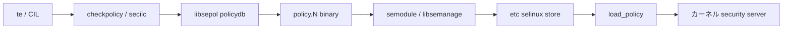

# 第1章 SELinux userspace の全体像

> 本章で読むソース
>
> - [`README.md`](https://github.com/SELinuxProject/selinux/blob/3.10/README.md)
> - [`VERSION`](https://github.com/SELinuxProject/selinux/blob/3.10/VERSION)
> - [`Makefile`](https://github.com/SELinuxProject/selinux/blob/3.10/Makefile)
> - [`checkpolicy/checkpolicy.c`](https://github.com/SELinuxProject/selinux/blob/3.10/checkpolicy/checkpolicy.c)

## この章の狙い

SELinux userspace リポジトリがカーネル MAC とどう接続するかを、コンパイルからランタイム、管理まで一気通貫で示す。
以降の各部が読むライブラリとコマンドの対応表と、データが流れる経路の地図として本章を使う。

## 前提

読者は SELinux が Linux カーネル上の強制アクセス制御（MAC）であること、主体と客体にセキュリティコンテキストが付くことを理解していること。

## userspace の役割

カーネルは許可判定（security server）と AVC を内蔵する。
userspace はポリシーをテキストや CIL からバイナリへ変換し、モジュールストアへ配置し、ファイルラベルや enforcing モードを操作する。

[`README.md` L10-L16](https://github.com/SELinuxProject/selinux/blob/3.10/README.md#L10-L16)

```text
SELinux is a flexible Mandatory Access Control (MAC) system built into the
Linux Kernel. SELinux provides administrators with a comprehensive access
control mechanism that enables greater access granularity over the existing
Linux Discretionary Access Controls (DAC) and is present in many major Linux
distributions. This repository contains the sources for the SELinux utilities
and system libraries which allow for the configuration and management of an
SELinux-based system.
```

本書の対象バージョンは userspace 3.10 である。

[`VERSION` L1](https://github.com/SELinuxProject/selinux/blob/3.10/VERSION#L1)

```text
3.10
```

## ビルド単位の依存関係

ルート `Makefile` の `SUBDIRS` は libsepol を先頭に置き、selinux ツールチェーンの依存方向を固定する。

[`Makefile` L1-L5](https://github.com/SELinuxProject/selinux/blob/3.10/Makefile#L1-L5)

```makefile
PREFIX ?= /usr
OPT_SUBDIRS ?= dbus gui mcstrans python restorecond sandbox semodule-utils
SUBDIRS=libsepol libselinux libsemanage checkpolicy secilc policycoreutils $(OPT_SUBDIRS)
PYSUBDIRS=libselinux libsemanage
DISTCLEANSUBDIRS=libselinux libsemanage
```

| ディレクトリ | ライブラリ/コマンド | 主な責務 |
|---|---|---|
| `libsepol/` | libsepol | policydb、avtab、link、expand、optimize |
| `checkpolicy/` `secilc/` | checkpolicy、secilc | ソースポリシーからバイナリ policy 生成 |
| `libselinux/` | libselinux | selinuxfs API、AVC、matchpathcon |
| `libsemanage/` | libsemanage | モジュールストア、commit、reload 調整 |
| `policycoreutils/` | semodule、restorecon 等 | 管理者向け CLI |
| `python/` | audit2allow、semanage バインディング | ログ解析とスクリプト運用 |

## ポリシーがカーネルへ届くまで

開発者が `.te` や CIL を編集したあと、本リポジトリ内では次の段階を経る。



`checkpolicy` のテキスト入力経路では、パース後に link、expand、optimize が順に呼ばれる。

[`checkpolicy/checkpolicy.c` L628-L652](https://github.com/SELinuxProject/selinux/blob/3.10/checkpolicy/checkpolicy.c#L628-L652)

```c
		if (read_source_policy(policydbp, file, "checkpolicy") < 0)
			exit(1);

		if (hashtab_map(policydbp->p_levels.table, check_level, NULL))
			exit(1);

		/* Linking takes care of optional avrule blocks */
		if (link_modules(NULL, policydbp, NULL, 0, 0)) {
			fprintf(stderr, "Error while resolving optionals\n");
			exit(1);
		}

		if (!cil) {
			if (policydb_init(&policydb)) {
				fprintf(stderr, "%s:  policydb_init failed\n", argv[0]);
				exit(1);
			}
			if (expand_module(NULL, policydbp, &policydb, /*verbose=*/0, !disable_neverallow)) {
				fprintf(stderr, "Error while expanding policy\n");
				exit(1);
			}
			policydb.policyvers = policyvers ? policyvers : POLICYDB_VERSION_MAX;
			policydb_destroy(policydbp);
			policydbp = &policydb;
		}
```

バイナリ出力直前では `policydb_load_isids` で初期 SID を解決し、オプションで `policydb_optimize` が走る。

[`checkpolicy/checkpolicy.c` L655-L664](https://github.com/SELinuxProject/selinux/blob/3.10/checkpolicy/checkpolicy.c#L655-L664)

```c
	if (policydb_load_isids(&policydb, &sidtab))
		exit(1);

	if (optimize && policydbp->policy_type == POLICY_KERN) {
		ret = policydb_optimize(policydbp);
		if (ret) {
			fprintf(stderr, "%s:  error optimizing policy\n", argv[0]);
			exit(1);
		}
	}
```

## ランタイム層

アプリケーションは libselinux 経由で selinuxfs にアクセスする。
`security_compute_av` はカーネルへ問い合わせ、libselinux 内の AVC が応答をキャッシュする（第13章）。
ファイル作成時のラベルは `matchpathcon` と `file_contexts` バックエンドが担当する（第14章）。

## 管理層

ディストリビューション運用では `semodule` が libsemanage を呼び、モジュールをストアへ install し `commit` でサンドボックスから active へ切り替える（第17章）。
`semanage.conf` の `load_policy` コマンドが最終的にカーネルへ policy をロードする。

## 本書の読み方と範囲

第0部から第3部で libsepol とコンパイラを読み、第4部で libselinux、第5部で libsemanage、第6部以降で policycoreutils と周辺ツールへ進む。
カーネル `security/selinux/` と refpolicy のポリシー本文そのものは範囲外とする。

## 高速化・最適化の工夫

コンパイルパイプラインに `policydb_optimize` を組み込めるため、ランタイムの avtab サイズを userspace 側で削減できる。
libselinux の AVC はカーネル往復をプロセス内で吸収し、高頻度の `security_compute_av` 呼び出しコストを下げる。

`-O` 指定時は expand の直後に `policydb_optimize` が呼ばれる。

[`checkpolicy/checkpolicy.c` L659-L663](https://github.com/SELinuxProject/selinux/blob/3.10/checkpolicy/checkpolicy.c#L659-L663)

```c
		ret = policydb_optimize(policydbp);
		if (ret) {
			fprintf(stderr, "%s:  error optimizing policy\n", argv[0]);
			exit(1);
		}
```

## まとめ

userspace は「ポリシー表現の変換」「永続ストアの管理」「プロセスからの selinuxfs 操作」の3層に分かれる。
以降の章は各層のソースをこの地図に沿って読み進める。

## 関連する章

- [第2章 ビルド構成](02-build-components.md)
- [第3章 policydb](../part01-libsepol/03-policydb-overview.md)
- [第9章 checkpolicy](../part03-checkpolicy/09-checkpolicy-main.md)
