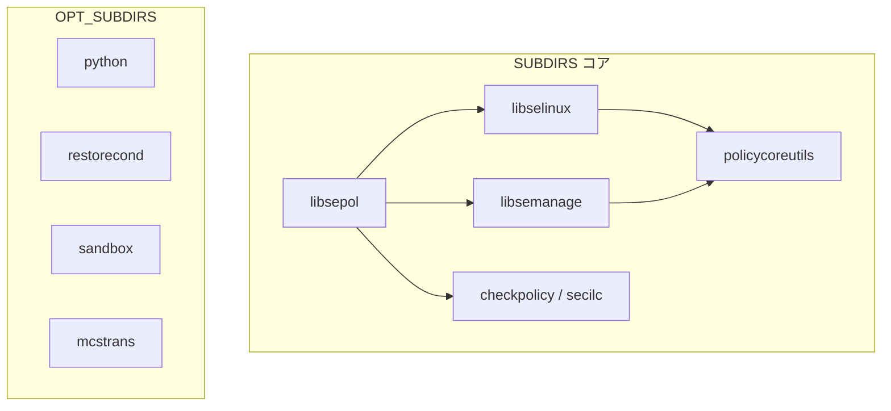

# 第2章 ビルド構成とコンポーネント

> 本章で読むソース
>
> - [`Makefile`](https://github.com/SELinuxProject/selinux/blob/3.10/Makefile)
> - [`libsepol/Makefile`](https://github.com/SELinuxProject/selinux/blob/3.10/libsepol/Makefile)
> - [`libselinux/Makefile`](https://github.com/SELinuxProject/selinux/blob/3.10/libselinux/Makefile)

## この章の狙い

トップレベルと各サブディレクトリの Makefile がどう連鎖し、静的ライブラリとコマンドが生成されるかを追う。
`SUBDIRS` の順序がリンク依存をどう反映しているかを、ビルドフラグと合わせて理解する。

## 前提

GNU make と autotools なしの素朴なサブディレクトリ再帰ビルドに慣れていること。

## トップレベルの再帰

ルート `Makefile` は `all` ターゲットで `SUBDIRS` を順に `$(MAKE) -C` する。
`install` も同じ順序で走るため、libsepol が常に最初にビルドされる。

[`Makefile` L1-L5](https://github.com/SELinuxProject/selinux/blob/3.10/Makefile#L1-L5)

```makefile
PREFIX ?= /usr
OPT_SUBDIRS ?= dbus gui mcstrans python restorecond sandbox semodule-utils
SUBDIRS=libsepol libselinux libsemanage checkpolicy secilc policycoreutils $(OPT_SUBDIRS)
PYSUBDIRS=libselinux libsemanage
DISTCLEANSUBDIRS=libselinux libsemanage
```

[`Makefile` L39-L42](https://github.com/SELinuxProject/selinux/blob/3.10/Makefile#L39-L42)

```makefile
all install relabel clean test:
	@for subdir in $(SUBDIRS); do \
		(cd $$subdir && $(MAKE) $@) || exit 1; \
	done
```

## コンパイラフラグ

`DEBUG=1` のときは最適化を切りデバッグ情報を最大化する。
通常ビルドは `-O2` と多数の `-Werror` 系警告で品質を担保する。

[`Makefile` L7-L26](https://github.com/SELinuxProject/selinux/blob/3.10/Makefile#L7-L26)

```makefile
ifeq ($(DEBUG),1)
	export CFLAGS = -g3 -O0 -gdwarf-2 -fno-strict-aliasing -Wall -Wshadow -Werror
	export LDFLAGS = -g
else
	export CFLAGS ?= -O2 -Werror -Wall -Wextra \
		-Wfloat-equal \
		-Wformat=2 \
		-Winit-self \
		-Wmissing-format-attribute \
		-Wmissing-noreturn \
		-Wmissing-prototypes \
		-Wnull-dereference \
		-Wpointer-arith \
		-Wshadow \
		-Wstrict-prototypes \
		-Wundef \
		-Wunused \
		-Wwrite-strings \
		-fno-common
endif
```

## libsepol の成果物

libsepol は静的/共有ライブラリ `libsepol` を生成し、checkpolicy と libsemanage のリンク先になる。
ヘッダは `include/sepol/` 以下に公開 API として配置される。

[`libsepol/Makefile` L5-L7](https://github.com/SELinuxProject/selinux/blob/3.10/libsepol/Makefile#L5-L7)

```makefile
all: 
	$(MAKE) -C src 
	$(MAKE) -C utils
```

## libselinux の Python 連携

libselinux は本体に加え `PYSUBDIRS` 経由で Python 拡張を別途ビルドする。
ルート `Makefile` の `pywrap` ターゲットが `PYSUBDIRS` だけを走査する。

[`Makefile` L44-L47](https://github.com/SELinuxProject/selinux/blob/3.10/Makefile#L44-L47)

```makefile
install-pywrap install-rubywrap swigify:
	@for subdir in $(PYSUBDIRS); do \
		(cd $$subdir && $(MAKE) $@) || exit 1; \
	done
```

[`libselinux/Makefile` L1-L4](https://github.com/SELinuxProject/selinux/blob/3.10/libselinux/Makefile#L1-L4)

```makefile
SUBDIRS = include src utils man

PKG_CONFIG ?= pkg-config
DISABLE_SETRANS ?= n
```

## OPT_SUBDIRS の位置づけ

`mcstrans`、`restorecond`、`sandbox`、`python` はコア MAC 動作には必須ではない。
ディストリビューションのパッケージ分割に合わせ、ビルド対象から外しても libsepol から policycoreutils までの中核は成立する。



## 高速化・最適化の工夫

全体を `-O2` でコンパイルし、ポリシー処理のホットループ（avtab ハッシュ、正規表現照合）にコンパイラ最適化を効かせる。
`-Werror` により未初期化や型不一致をビルド時に排除し、ランタイム分岐コストより先に静的欠陥を潰す。
`DESTDIR` 指定時は include と lib の探索パスを先に注入し、ステージングビルドでもリンク順序を保つ。
ルート `distclean` は `DISTCLEANSUBDIRS` だけを走査し、Python ラッパの生成物をまとめて掃除する。

## まとめ

ビルド順は libsepol を根に libselinux と libsemanage が枝分かれし、コンパイラと policycoreutils が葉になる。
Python ラッパと周辺デーモンは OPT_SUBDIRS で後段にまとめられる。

## 関連する章

- [第1章 全体像](01-selinux-userspace-overview.md)
- [第3章 policydb](../part01-libsepol/03-policydb-overview.md)
