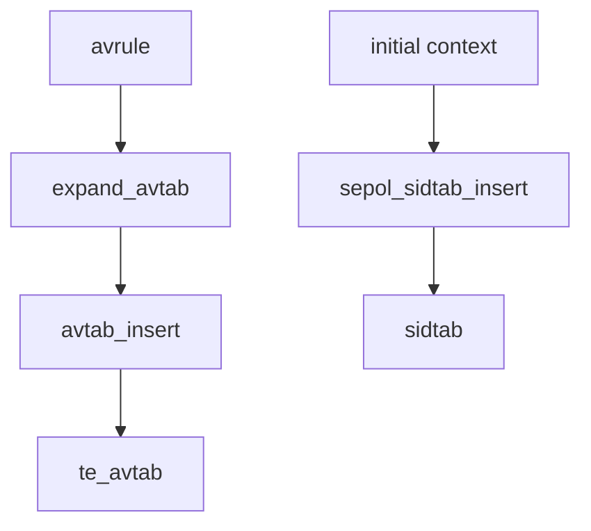

# 第4章 avtab と sidtab

> 本章で読むソース
>
> - [`libsepol/src/avtab.c`](https://github.com/SELinuxProject/selinux/blob/3.10/libsepol/src/avtab.c)
> - [`libsepol/src/sidtab.c`](https://github.com/SELinuxProject/selinux/blob/3.10/libsepol/src/sidtab.c)
> - [`libsepol/include/sepol/policydb/avtab.h`](https://github.com/SELinuxProject/selinux/blob/3.10/libsepol/include/sepol/policydb/avtab.h)

## この章の狙い

カーネルが参照する許可ベクタ表 avtab と、SID とコンテキストの対応表 sidtab のデータ構造と主要操作を読む。
expand が TE ルールを `te_avtab` へ挿入するとき、どの API が使われるかを追えるようにする。

## 前提

第3章で `policydb_t.te_avtab` の位置づけを理解していること。

## avtab キーとハッシュ

avtab エントリは主体型、客体型、クラス、specified マスクでキー付けされる。
`avtab_insert` はハッシュバケット内をキー順に走査し、重複を検出する。

[`libsepol/src/avtab.c` L136-L174](https://github.com/SELinuxProject/selinux/blob/3.10/libsepol/src/avtab.c#L136-L174)

```c
int avtab_insert(avtab_t * h, avtab_key_t * key, avtab_datum_t * datum)
{
	int hvalue;
	avtab_ptr_t prev, cur, newnode;
	uint16_t specified =
	    key->specified & ~(AVTAB_ENABLED | AVTAB_ENABLED_OLD);

	if (!h || !h->htable)
		return SEPOL_ENOMEM;

	hvalue = avtab_hash(key, h->mask);
	for (prev = NULL, cur = h->htable[hvalue];
	     cur; prev = cur, cur = cur->next) {
		if (key->source_type == cur->key.source_type &&
		    key->target_type == cur->key.target_type &&
		    key->target_class == cur->key.target_class &&
		    (specified & cur->key.specified)) {
			/* Extended permissions are not necessarily unique */
			if (specified & AVTAB_XPERMS)
				break;
			return SEPOL_EEXIST;
		}
		// ... (中略: ソート順比較) ...
	}

	newnode = avtab_insert_node(h, hvalue, prev, key, datum);
	if (!newnode)
		return SEPOL_ENOMEM;

	return 0;
}
```

条件付き avtab 向けには同一キーの複数挿入を許す `avtab_insert_nonunique` が別途ある（コメント L176 付近）。

## ハッシュテーブルサイズ決定

`avtab_alloc` はルール数からバケット数を2の冪で決め、上限 `MAX_AVTAB_HASH_BUCKETS` で打ち切る。

[`libsepol/src/avtab.c` L363-L391](https://github.com/SELinuxProject/selinux/blob/3.10/libsepol/src/avtab.c#L363-L391)

```c
int avtab_alloc(avtab_t *h, uint32_t nrules)
{
	uint32_t mask = 0;
	uint32_t shift = 0;
	uint32_t work = nrules;
	uint32_t nslot = 0;

	if (nrules == 0)
		goto out;

	while (work) {
		work  = work >> 1;
		shift++;
	}
	if (shift > 2)
		shift = shift - 2;
	nslot = UINT32_C(1) << shift;
	if (nslot > MAX_AVTAB_HASH_BUCKETS)
		nslot = MAX_AVTAB_HASH_BUCKETS;
	mask = nslot - 1;

	h->htable = calloc(nslot, sizeof(avtab_ptr_t));
	if (!h->htable)
		return -1;
out:
	h->nel = 0;
	h->nslot = nslot;
	h->mask = mask;
	return 0;
}
```

`avtab_hash_eval` はチェーン長統計を取り、ポリシー開発時の衝突診断に使える。

[`libsepol/src/avtab.c` L394-L399](https://github.com/SELinuxProject/selinux/blob/3.10/libsepol/src/avtab.c#L394-L399)

```c
void avtab_hash_eval(avtab_t * h, char *tag)
{
	unsigned int i, chain_len, slots_used, max_chain_len;
	avtab_ptr_t cur;

	slots_used = 0;
```

## sidtab の初期化と挿入

sidtab は固定サイズ `SIDTAB_SIZE` のハッシュ配列で、SID 昇順にソート連結リストを維持する。

[`libsepol/src/sidtab.c` L27-L37](https://github.com/SELinuxProject/selinux/blob/3.10/libsepol/src/sidtab.c#L27-L37)

```c
int sepol_sidtab_init(sidtab_t * s)
{
	s->htable = calloc(SIDTAB_SIZE, sizeof(sidtab_ptr_t));
	if (!s->htable)
		return -ENOMEM;
	s->nel = 0;
	s->next_sid = 1;
	s->shutdown = 0;
	INIT_SIDTAB_LOCK(s);
	return 0;
}
```

`sepol_sidtab_insert` は同一 SID の二重挿入を `EEXIST` で拒否する。

[`libsepol/src/sidtab.c` L39-L68](https://github.com/SELinuxProject/selinux/blob/3.10/libsepol/src/sidtab.c#L39-L68)

```c
int sepol_sidtab_insert(sidtab_t * s, sepol_security_id_t sid,
			context_struct_t * context)
{
	int hvalue;
	sidtab_node_t *prev, *cur, *newnode;

	if (!s || !s->htable)
		return -ENOMEM;

	hvalue = SIDTAB_HASH(sid);
	prev = NULL;
	cur = s->htable[hvalue];
	while (cur != NULL && sid > cur->sid) {
		prev = cur;
		cur = cur->next;
	}

	if (cur && sid == cur->sid) {
		errno = EEXIST;
		return -EEXIST;
	}

	newnode = (sidtab_node_t *) malloc(sizeof(sidtab_node_t));
	if (newnode == NULL)
		return -ENOMEM;
	newnode->sid = sid;
	if (context_cpy(&newnode->context, context)) {
		free(newnode);
		return -ENOMEM;
	}
```

## expand との接続

`expand_avtab`（第8章）は高レベル avrule から `avtab_key_t` を組み立て、`avtab_insert` 系で `te_avtab` を埋める。
`policydb_load_isids` は初期 SID 文字列を sidtab へ載せ、カーネル起動直後のラベル解決を可能にする。



## 高速化・最適化の工夫

avtab バケット数はルール数に比例して決まり、過剰な衝突を避ける（Yuichi Nakamura による調整がコメントに残る）。
キー順ソート連結により挿入時の探索が早期打ち切りしやすく、読み出しも局所性が保たれる。

`avtab_insert` はキーの `specified` フラグを正規化してからハッシュチェーンへ挿入する。

[`libsepol/src/avtab.c` L136-L144](https://github.com/SELinuxProject/selinux/blob/3.10/libsepol/src/avtab.c#L136-L144)

```c
int avtab_insert(avtab_t * h, avtab_key_t * key, avtab_datum_t * datum)
{
	int hvalue;
	avtab_ptr_t prev, cur, newnode;
	uint16_t specified =
	    key->specified & ~(AVTAB_ENABLED | AVTAB_ENABLED_OLD);

	if (!h || !h->htable)
		return SEPOL_ENOMEM;
```

## まとめ

avtab が許可判定の本体、sidtab が ID とコンテキストの対応を担う。
どちらも policydb 読み書きでバイナリ化され、カーネルへ渡る。

## 関連する章

- [第3章 policydb](03-policydb-overview.md)
- [第8章 expand](../part02-policy/08-expand-optimize.md)
