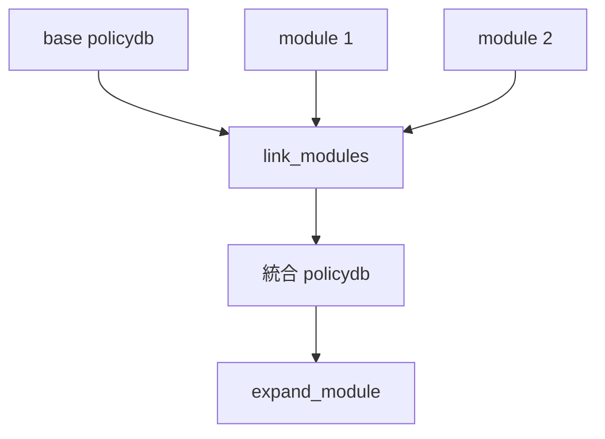

# 第7章 link_modules によるモジュール統合

> 本章で読むソース
>
> - [`libsepol/src/link.c`](https://github.com/SELinuxProject/selinux/blob/3.10/libsepol/src/link.c)
> - [`libsepol/src/module.c`](https://github.com/SELinuxProject/selinux/blob/3.10/libsepol/src/module.c)

## この章の狙い

複数ポリシーモジュールをベースポリシーへ統合する `link_modules` の前提条件と、シンボルマッピングの入口を読む。
expand の前段として optional 宣言がどこで解決されるかを把握する。

## 前提

第3章の `POLICY_BASE` と `POLICY_MOD`、第6章のバイナリ読み込みを理解していること。

## link の位置づけ

コメントは link をコンパイラの順序依存ステップに例えている。
ベースと各モジュールは事前にインデックス済みでなければならない。

[`libsepol/src/link.c` L2375-L2395](https://github.com/SELinuxProject/selinux/blob/3.10/libsepol/src/link.c#L2375-L2395)

```c
 * similar to an actual compiler: it requires a set of order dependent
 * steps.  The base and every module must have been indexed prior to
 * calling this function.
 */
int link_modules(sepol_handle_t * handle,
		 policydb_t * b, policydb_t ** mods, int len, int verbose)
{
	int i, ret, retval = -1;
	policy_module_t **modules = NULL;
	link_state_t state;
	uint32_t num_mod_decls = 0;

	memset(&state, 0, sizeof(state));
	state.base = b;
	state.verbose = verbose;
	state.handle = handle;

	if (b->policy_type != POLICY_BASE) {
		ERR(state.handle, "Target of link was not a base policy.");
		return -1;
	}
```

単一ベースだけの checkpolicy でも `link_modules(NULL, policydbp, NULL, 0, 0)` が optional 解決のために呼ばれる。

[`checkpolicy/checkpolicy.c` L634-L638](https://github.com/SELinuxProject/selinux/blob/3.10/checkpolicy/checkpolicy.c#L634-L638)

```c
		/* Linking takes care of optional avrule blocks */
		if (link_modules(NULL, policydbp, NULL, 0, 0)) {
			fprintf(stderr, "Error while resolving optionals\n");
			exit(1);
		}
```

## link_state とモジュール配列

link は `policy_module_t` 配列を確保し、各モジュールの宣言をベースへマージする準備を行う。
`num_mod_decls` は宣言数の集計に使われる。

[`libsepol/src/link.c` L2397-L2404](https://github.com/SELinuxProject/selinux/blob/3.10/libsepol/src/link.c#L2397-L2404)

```c
	/* first allocate some space to hold the maps from module
	 * symbol's value to the destination symbol value; then do
	 * other preparation work */
	if ((modules =
	     (policy_module_t **) calloc(len, sizeof(*modules))) == NULL) {
		ERR(state.handle, "Out of memory!");
		return -1;
	}
```

## expand との順序

expand のコメントは link を常に先に実行することを要求する。
optional は link 時に処理され、expand は tunable 状態を確定させて avtab へ落とす。

[`libsepol/src/expand.c` L3110-L3114](https://github.com/SELinuxProject/selinux/blob/3.10/libsepol/src/expand.c#L3110-L3114)

```c
/* Linking should always be done before calling expand, even if
 * there is only a base since all optionals are dealt with at link time
 * the base passed in should be indexed and avrule blocks should be 
 * enabled.
 */
```



## libsemanage での利用

`semanage_direct_commit` の再ビルドパイプラインはアクティブモジュール一覧を取り、CIL コンパイル後に link と expand を内部で呼ぶ（第17章）。
ストア上の `.pp` モジュールが `mods[]` に相当する。

## MLS 整合性チェック

link は各モジュールが `POLICY_MOD` かつベースと MLS 設定が一致することを検証する。
不一致は即エラーで expand へ進まない。

[`libsepol/src/link.c` L2405-L2420](https://github.com/SELinuxProject/selinux/blob/3.10/libsepol/src/link.c#L2405-L2420)

```c
	for (i = 0; i < len; i++) {
		if (mods[i]->policy_type != POLICY_MOD) {
			ERR(state.handle,
			    "Tried to link in a policy that was not a module.");
			goto cleanup;
		}

		if (mods[i]->mls != b->mls) {
			if (b->mls)
				ERR(state.handle,
				    "Tried to link in a non-MLS module with an MLS base.");
			else
				ERR(state.handle,
				    "Tried to link in an MLS module with a non-MLS base.");
			goto cleanup;
		}
```

## ポリシーバージョンの引き上げ

モジュールの `policyvers` がベースより新しい場合、WARN を出してベース側を引き上げる。
カーネルが要求するバージョンへ揃えるための段階である。

[`libsepol/src/link.c` L2422-L2424](https://github.com/SELinuxProject/selinux/blob/3.10/libsepol/src/link.c#L2422-L2424)

```c
		if (mods[i]->policyvers > b->policyvers) {
			WARN(state.handle,
			     "Upgrading policy version from %u to %u", b->policyvers, mods[i]->policyvers);
```

## 失敗時のクリーンアップ

`modules` 配列は `calloc` で確保され、エラー経路では `cleanup` ラベルで解放される。
link 失敗時にベース policydb を中途半端な状態で残さない。

## 高速化・最適化の工夫

シンボルマップを一括確保し、モジュールごとの宣言マージを単一ベースへ集約する。
expand 以降は1つの policydb だけを扱えばよく、以降の optimize と write のコストを抑える。

## まとめ

link_modules がモジュール方式の核心であり、optional とシンボル衝突解決を expand の前に完了させる。

## 関連する章

- [第8章 expand](08-expand-optimize.md)
- [第17章 commit](../part05-libsemanage/17-policy-reload.md)
