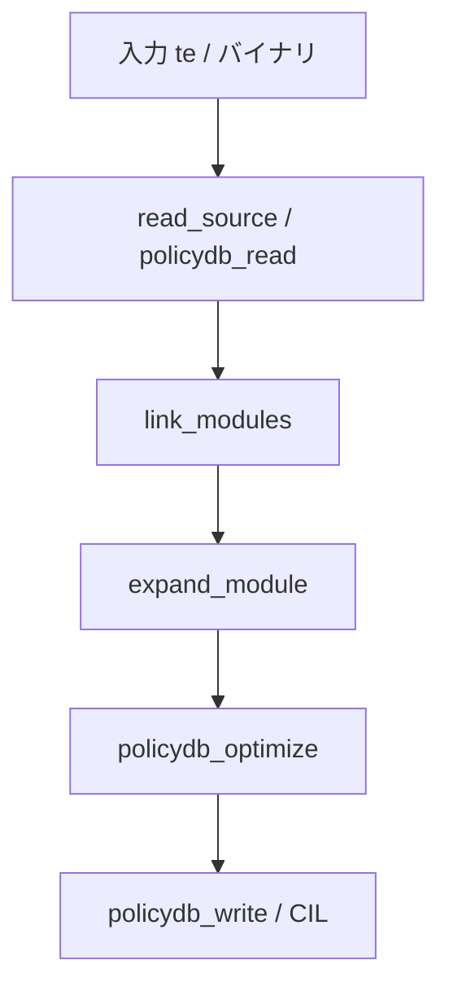

# 第9章 checkpolicy のコンパイル入口

> 本章で読むソース
>
> - [`checkpolicy/checkpolicy.c`](https://github.com/SELinuxProject/selinux/blob/3.10/checkpolicy/checkpolicy.c)

## この章の狙い

テキストまたはバイナリポリシーを読み込み、検証と展開を経てバイナリまたは CIL を出力する `checkpolicy` の `main` フローを追う。
libsepol の link、expand、optimize、write が1コマンドにどう束ねられるかを把握する。

## 前提

第6章から第8章までを読んでいること。

## ツールの目的

ファイル先頭コメントはテキスト設定の読み込みとバイナリ変換の役割を説明する。

[`checkpolicy/checkpolicy.c` L36-L49](https://github.com/SELinuxProject/selinux/blob/3.10/checkpolicy/checkpolicy.c#L36-L49)

```c
/*
 * checkpolicy
 *
 * Load and check a policy configuration.
 *
 * A policy configuration is created in a text format,
 * and then compiled into a binary format for use by
 * the security server.  By default, checkpolicy reads
 * the text format.   If '-b' is specified, then checkpolicy
 * reads the binary format instead.
 * 
 * If '-o output_file' is specified, then checkpolicy 
 * writes the binary format version of the configuration
 * to the specified output file.  
```

## main のフラグと状態

`main` はバイナリ入出力、CIL、最適化、ターゲット、MLS など多数のフラグを束ねる。

[`checkpolicy/checkpolicy.c` L378-L396](https://github.com/SELinuxProject/selinux/blob/3.10/checkpolicy/checkpolicy.c#L378-L396)

```c
int main(int argc, char **argv)
{
	policydb_t parse_policy;
	sepol_security_class_t tclass;
	sepol_security_id_t ssid, tsid, *sids, oldsid, newsid, tasksid;
	sepol_security_context_t scontext;
	struct sepol_av_decision avd;
	class_datum_t *cladatum;
	const char *file = txtfile;
	char ans[80 + 1], *path, *fstype;
	const char *outfile = NULL;
	size_t scontext_len, pathlen;
	unsigned int i;
	unsigned int protocol, port;
	unsigned int binary = 0, debug = 0, sort = 0, cil = 0, conf = 0, optimize = 0, disable_neverallow = 0;
	unsigned int line_marker_for_allow = 0;
	struct val_to_name v;
	int ret, ch, fd, target = SEPOL_TARGET_SELINUX;
	unsigned int policyvers = 0;
```

## テキスト入力経路

テキスト読み込み後、link と expand が順に実行される（第7章、第8章）。

[`checkpolicy/checkpolicy.c` L615-L651](https://github.com/SELinuxProject/selinux/blob/3.10/checkpolicy/checkpolicy.c#L615-L651)

```c
		if (policydb_init(&parse_policy))
			exit(1);
		/* We build this as a base policy first since that is all the parser understands */
		parse_policy.policy_type = POLICY_BASE;
		policydb_set_target_platform(&parse_policy, target);

		parse_policy.mls = mlspol;
		parse_policy.handle_unknown = handle_unknown;
		parse_policy.policyvers = policyvers ? policyvers : POLICYDB_VERSION_MAX;

		policydbp = &parse_policy;

		if (read_source_policy(policydbp, file, "checkpolicy") < 0)
			exit(1);

		if (link_modules(NULL, policydbp, NULL, 0, 0)) {
			fprintf(stderr, "Error while resolving optionals\n");
			exit(1);
		}

		if (!cil) {
			if (policydb_init(&policydb)) {
				fprintf(stderr, "%s:  policydb_init failed\n", argv[0]);
				exit(1);
			}
			if (expand_module(NULL, policydbp, &policydb, /*verbose=*/0, !disable_neverallow)) {
				fprintf(stderr, "Error while expanding policy\n");
				exit(1);
			}
			policydb_destroy(policydbp);
			policydbp = &policydb;
		}
```

## 出力段階

バイナリ出力では `policydb_write`、CIL 出力では `sepol_kernel_policydb_to_cil` 等が使われる。

[`checkpolicy/checkpolicy.c` L678-L710](https://github.com/SELinuxProject/selinux/blob/3.10/checkpolicy/checkpolicy.c#L678-L710)

```c
				ret = policydb_write(&policydb, &pf);
			} else {
				ret = sepol_kernel_policydb_to_conf(outfp, policydbp);
			}
			if (ret) {
				fprintf(stderr, "%s:  error writing %s\n",
						argv[0], outfile);
				exit(1);
			}
		} else {
			if (line_marker_for_allow) {
				policydbp->line_marker_avrules |= AVRULE_ALLOWED | AVRULE_XPERMS_ALLOWED;
			}
			if (binary) {
				ret = sepol_kernel_policydb_to_cil(outfp, policydbp);
			} else {
				ret = sepol_module_policydb_to_cil(outfp, policydbp, 1);
			}
```

## 対話的検証モード

出力ファイルを指定しない場合、checkpolicy は SID とクラスを入力としてアクセスベクタを対話表示する開発者向けモードにもなる。
本番ビルドでは `-o policy.N` でバイナリ出力するのが典型である。



checkpolicy は `expand_module` で neverallow 検査を有効にし、展開後 policydb を差し替える。

[`checkpolicy/checkpolicy.c` L645-L651](https://github.com/SELinuxProject/selinux/blob/3.10/checkpolicy/checkpolicy.c#L645-L651)

```c
			if (expand_module(NULL, policydbp, &policydb, /*verbose=*/0, !disable_neverallow)) {
				fprintf(stderr, "Error while expanding policy\n");
				exit(1);
			}
			policydb.policyvers = policyvers ? policyvers : POLICYDB_VERSION_MAX;
			policydb_destroy(policydbp);
			policydbp = &policydb;
```

## 高速化・最適化の工夫

`-O` で `policydb_optimize` を有効にし、コンパイル時に avtab を圧縮してカーネル負荷を先送り削減する。
バイナリ入力経路ではパースを省略し、バージョン調整と optimize だけを行う高速再コンパイルが可能である。

`-O` で optimize を有効にした場合、expand 直後に `policydb_optimize` が走る（上記 expand_module 引用の直後経路）。

[`checkpolicy/checkpolicy.c` L659-L663](https://github.com/SELinuxProject/selinux/blob/3.10/checkpolicy/checkpolicy.c#L659-L663)

```c
		ret = policydb_optimize(policydbp);
		if (ret) {
			fprintf(stderr, "%s:  error optimizing policy\n", argv[0]);
			exit(1);
		}
```

## まとめ

checkpolicy は libsepol パイプラインの CLI 統合点であり、開発者向け検証と本番バイナリ生成の両方を担う。

## 関連する章

- [第8章 expand](../part02-policy/08-expand-optimize.md)
- [第10章 checkmodule](10-checkmodule-pipeline.md)
