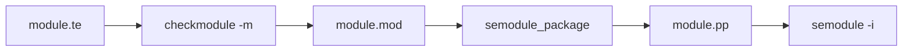

# 第10章 checkmodule とモジュール生成

> 本章で読むソース
>
> - [`checkpolicy/checkmodule.c`](https://github.com/SELinuxProject/selinux/blob/3.10/checkpolicy/checkmodule.c)

## この章の狙い

単一モジュールを `.mod` バイナリへコンパイルする `checkmodule` のオプション解析と出力経路を読む。
ベースポリシー全体の checkpolicy との違いを、policy_type フラグから把握する。

## 前提

第9章の checkpolicy フローを理解していること。

## main と policy_type

既定は `POLICY_BASE` だが、`-m` で `POLICY_MOD` に切り替えてモジュールを生成する。

[`checkpolicy/checkmodule.c` L146-L168](https://github.com/SELinuxProject/selinux/blob/3.10/checkpolicy/checkmodule.c#L146-L168)

```c
int main(int argc, char **argv)
{
	const char *file = txtfile, *outfile = NULL;
	unsigned int binary = 0, cil = 0, disable_neverallow = 0;
	unsigned int line_marker_for_allow = 0;
	unsigned int policy_type = POLICY_BASE;
	unsigned int policyvers = MOD_POLICYDB_VERSION_MAX;
	int ch;
	int show_version = 0;
	policydb_t modpolicydb;
	const struct option long_options[] = {
		{"help", no_argument, NULL, 'h'},
		{"output", required_argument, NULL, 'o'},
		{"binary", no_argument, NULL, 'b'},
		{"version", no_argument, NULL, 'V'},
		{"handle-unknown", required_argument, NULL, 'U'},
		{"mls", no_argument, NULL, 'M'},
		{"disable-neverallow", no_argument, NULL, 'N'},
		{"line-marker-for-allow", no_argument, NULL, 'L'},
		{"cil", no_argument, NULL, 'C'},
		{"werror", no_argument, NULL, 'E'},
		{NULL, 0, NULL, 0}
	};
```

`-m` オプションでモジュール種別へ切り替える。

[`checkpolicy/checkmodule.c` L202-L204](https://github.com/SELinuxProject/selinux/blob/3.10/checkpolicy/checkmodule.c#L202-L204)

```c
		case 'm':
			policy_type = POLICY_MOD;
			break;
```

## ポリシーバージョン範囲

モジュール向けバージョンは `MOD_POLICYDB_VERSION_MIN` から `MOD_POLICYDB_VERSION_MAX` の範囲で検証される。

[`checkpolicy/checkmodule.c` L225-L231](https://github.com/SELinuxProject/selinux/blob/3.10/checkpolicy/checkmodule.c#L225-L231)

```c
			if (n < MOD_POLICYDB_VERSION_MIN
			    || n > MOD_POLICYDB_VERSION_MAX) {
				fprintf(stderr,
					"policyvers value %ld not in range %d-%d\n",
					n, MOD_POLICYDB_VERSION_MIN,
					MOD_POLICYDB_VERSION_MAX);
				usage(argv[0]);
			}
```

## パイプライン上の位置

開発フローは次の順序が典型である。



`checkmodule` はベースへ link する前の単体モジュールを生成する。
link と expand は semanage の再ビルド時にストア内の全モジュールへ対して走る（第17章）。

## CIL 出力

`-C` で CIL 形式出力に切り替え、現行 refpolicy ビルドチェーンと接続する。
`-b` はバイナリ入出力の読み書きを指定する。

[`checkpolicy/checkmodule.c` L211-L213](https://github.com/SELinuxProject/selinux/blob/3.10/checkpolicy/checkmodule.c#L211-L213)

```c
		case 'C':
			cil = 1;
			break;
```

## neverallow と werror

`-N` は neverallow 検査を無効化し、`-E` は警告をエラー扱いにする。
本番モジュールでは werror 相当の厳格ビルドが推奨される。

## policydb への直接バインド

checkmodule は libsepol のサービス関数が参照する `policydb` と `sidtab` を自前構造体へ差し替える。
パース結果を中間コピーなしで `policydb_write` へ渡せる。

[`checkpolicy/checkmodule.c` L272-L291](https://github.com/SELinuxProject/selinux/blob/3.10/checkpolicy/checkmodule.c#L272-L291)

```c
	/* Set policydb and sidtab used by libsepol service functions
	   to my structures, so that I can directly populate and
	   manipulate them. */
	sepol_set_policydb(&modpolicydb);
	sepol_set_sidtab(&sidtab);

	if (binary) {
		if (read_binary_policy(&modpolicydb, file, argv[0]) == -1) {
			exit(1);
		}
	} else {
		if (policydb_init(&modpolicydb)) {
			fprintf(stderr, "%s: out of memory!\n", argv[0]);
			exit(1);
		}

		modpolicydb.policy_type = policy_type;
		modpolicydb.mls = mlspol;
```

## オプション整合性

`-b` と `-m` は同時指定できない。
`-L` は CIL 出力時のみ有効で、allow 行マーカー付与に使う。

[`checkpolicy/checkmodule.c` L256-L263](https://github.com/SELinuxProject/selinux/blob/3.10/checkpolicy/checkmodule.c#L256-L263)

```c
	if (binary && (policy_type != POLICY_BASE)) {
		fprintf(stderr, "%s:  -b and -m are incompatible with each other.\n", argv[0]);
		exit(1);
	}

	if (line_marker_for_allow && !cil) {
		fprintf(stderr, "%s:  -L must be used along with -C.\n", argv[0]);
		exit(1);
	}
```

## 高速化・最適化の工夫

モジュール単位コンパイルにより、変更のあった `.te` だけを再生成できる。
ベース全体の checkpolicy 再実行を避け、大規模ポリシー開発の反復時間を短縮する。

## まとめ

checkmodule は POLICY_MOD 向けコンパイラであり、ストア投入前の `.mod` を生成する。

## 関連する章

- [第9章 checkpolicy](09-checkpolicy-main.md)
- [第16章 モジュールストア](../part05-libsemanage/16-module-store.md)
