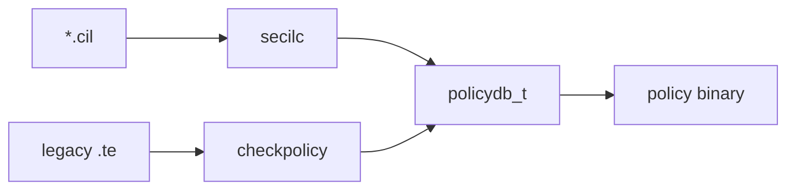

# 第11章 CIL と secilc

> 本章で読むソース
>
> - [`secilc/secilc.c`](https://github.com/SELinuxProject/selinux/blob/3.10/secilc/secilc.c)
> - [`libsepol/cil`](https://github.com/SELinuxProject/selinux/blob/3.10/libsepol/cil)

## この章の狙い

Common Intermediate Language（CIL）ソースをバイナリポリシーへ変換する `secilc` のオプションとコンパイルフローを読む。
現行ディストリビューションで CIL が主経路になった理由を、checkpolicy との役割分担から理解する。

## 前提

第9章の CIL 出力オプションを把握していること。

## secilc main の状態

`secilc` は CIL データベース `cil_db` と `sepol_policydb_t` を組み合わせてバイナリを生成する。

[`secilc/secilc.c` L80-L104](https://github.com/SELinuxProject/selinux/blob/3.10/secilc/secilc.c#L80-L104)

```c
int main(int argc, char *argv[])
{
	int rc = SEPOL_ERR;
	sepol_policydb_t *pdb = NULL;
	struct sepol_policy_file *pf = NULL;
	FILE *binary = NULL;
	FILE *file_contexts;
	FILE *file = NULL;
	char *buffer = NULL;
	struct stat filedata;
	uint32_t file_size;
	char *output = NULL;
	char *filecontexts = NULL;
	struct cil_db *db = NULL;
	int target = SEPOL_TARGET_SELINUX;
	int mls = -1;
	int disable_dontaudit = 0;
	int multiple_decls = 0;
	int disable_neverallow = 0;
	int preserve_tunables = 0;
	int qualified_names = 0;
	int handle_unknown = -1;
	int policyvers = POLICYDB_VERSION_MAX;
	int attrs_expand_generated = 0;
	int attrs_expand_size = -1;
	int optimize = 0;
```

## 長いオプション一覧

`getopt_long` でターゲット、MLS、neverallow、optimize、file_contexts 出力などを制御する。

[`secilc/secilc.c` L111-L128](https://github.com/SELinuxProject/selinux/blob/3.10/secilc/secilc.c#L111-L128)

```c
	static struct option long_opts[] = {
		{"help", no_argument, 0, 'h'},
		{"verbose", no_argument, 0, 'v'},
		{"target", required_argument, 0, 't'},
		{"mls", required_argument, 0, 'M'},
		{"policyversion", required_argument, 0, 'c'},
		{"handle-unknown", required_argument, 0, 'U'},
		{"disable-dontaudit", no_argument, 0, 'D'},
		{"multiple-decls", no_argument, 0, 'm'},
		{"disable-neverallow", no_argument, 0, 'N'},
		{"preserve-tunables", no_argument, 0, 'P'},
		{"qualified-names", no_argument, 0, 'Q'},
		{"output", required_argument, 0, 'o'},
		{"filecontexts", required_argument, 0, 'f'},
		{"expand-generated", no_argument, 0, 'G'},
		{"expand-size", required_argument, 0, 'X'},
		{"optimize", no_argument, 0, 'O'},
		{0, 0, 0, 0}
	};
```

ターゲットは `selinux` と `xen` を選択できる。

[`secilc/secilc.c` L141-L148](https://github.com/SELinuxProject/selinux/blob/3.10/secilc/secilc.c#L141-L148)

```c
			case 't':
				if (!strcmp(optarg, "selinux")) {
					target = SEPOL_TARGET_SELINUX;
				} else if (!strcmp(optarg, "xen")) {
					target = SEPOL_TARGET_XEN;
				} else {
					fprintf(stderr, "Unknown target: %s\n", optarg);
					usage(argv[0]);
				}
```

## checkpolicy との関係

checkpolicy も `-C` で CIL 入出力に対応するが、ビルドシステムでは `secilc` が CIL ファイル群のコンパイルを担うことが多い。
どちらも最終的に libsepol の policydb と `policydb_write` へ収束する。



## libsepol/cil

CIL パーサと AST 処理は `libsepol/cil/` 以下にあり、secilc と semanage の HLL コンパイルの両方から利用される。
第17章の `semanage_compile_hll_modules` もこの経路に接続する。

## CIL コンパイルからバイナリ出力

入力 CIL を `cil_add_file` で蓄積し、`cil_compile` で AST を確定させる。
`cil_build_policydb` が libsepol の policydb へ変換し、`sepol_policydb_write` でバイナリを書き出す。

[`secilc/secilc.c` L314-L324](https://github.com/SELinuxProject/selinux/blob/3.10/secilc/secilc.c#L314-L324)

```c
	rc = cil_compile(db);
	if (rc != SEPOL_OK) {
		fprintf(stderr, "Failed to compile cildb: %d\n", rc);
		goto exit;
	}

	rc = cil_build_policydb(db, &pdb);
	if (rc != SEPOL_OK) {
		fprintf(stderr, "Failed to build policydb\n");
		goto exit;
	}
```

`-O` 指定時は `sepol_policydb_optimize` が checkpolicy の `-O` と同型の圧縮を行う。

[`secilc/secilc.c` L326-L331](https://github.com/SELinuxProject/selinux/blob/3.10/secilc/secilc.c#L326-L331)

```c
	if (optimize) {
		rc = sepol_policydb_optimize(pdb);
		if (rc != SEPOL_OK) {
			fprintf(stderr, "Failed to optimize policydb\n");
			goto exit;
		}
	}
```

## file_contexts 同時生成

コンパイル成功後、`cil_filecons_to_string` で file_contexts 文字列を取り出せる。
ポリシーバイナリとラベル定義を1パスで生成できる。

[`secilc/secilc.c` L364-L373](https://github.com/SELinuxProject/selinux/blob/3.10/secilc/secilc.c#L364-L373)

```c
	rc = sepol_policydb_write(pdb, pf);
	if (rc != 0) {
		fprintf(stderr, "Failed to write binary policy: %d\n", rc);
		goto exit;
	}

	fclose(binary);
	binary = NULL;

	rc = cil_filecons_to_string(db, &fc_buf, &fc_size);
```

## 高速化・最適化の工夫

`-O` で `policydb_optimize` と同等の最適化を CIL パイプラインへ組み込める。
宣言的 CIL はモジュール合成を単純化し、大規模ポリシーの増分ビルドを安定させる。

## まとめ

secilc は CIL からバイナリへの専用コンパイラであり、現行 SELinux ポリシービルドの要である。

## 関連する章

- [第9章 checkpolicy](09-checkpolicy-main.md)
- [第17章 commit](../part05-libsemanage/17-policy-reload.md)
