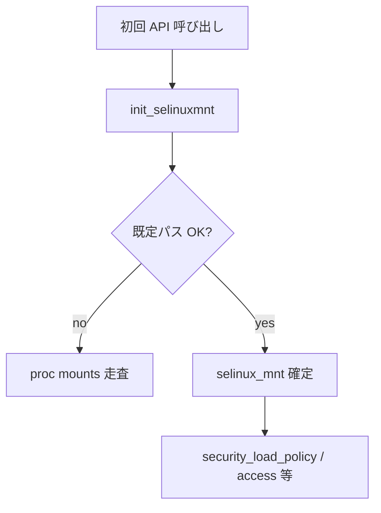

# 第12章 libselinux 初期化と selinuxfs

> 本章で読むソース
>
> - [`libselinux/src/init.c`](https://github.com/SELinuxProject/selinux/blob/3.10/libselinux/src/init.c)
> - [`libselinux/src/load_policy.c`](https://github.com/SELinuxProject/selinux/blob/3.10/libselinux/src/load_policy.c)

## この章の狙い

グローバル `selinux_mnt` の決定、`selinuxfs` の存在確認、ポリシーロード API までの初期化経路を読む。
以降の `security_compute_av` や `security_setenforce` が前提とするマウントポイントの解決を理解する。

## 前提

Linux の pseudo filesystem と `/sys/fs/selinux` の存在を知っていること。

## selinuxfs の存在確認

`selinuxfs_exists` は `/proc/filesystems` を走査し、`selinuxfs` が登録されているか調べる。

[`libselinux/src/init.c` L55-L75](https://github.com/SELinuxProject/selinux/blob/3.10/libselinux/src/init.c#L55-L75)

```c
int selinuxfs_exists(void)
{
	int exists = 0;
	FILE *fp = NULL;
	char *buf = NULL;
	size_t len;
	ssize_t num;

	fp = fopen("/proc/filesystems", "re");
	if (!fp)
		return 1; /* Fail as if it exists */
	__fsetlocking(fp, FSETLOCKING_BYCALLER);

	num = getline(&buf, &len, fp);
	while (num != -1) {
		if (strstr(buf, SELINUXFS)) {
			exists = 1;
			break;
		}
		num = getline(&buf, &len, fp);
	}
```

## verify_selinuxmnt

候補パスが `SELINUX_MAGIC` かつ読み書き可能なら `set_selinuxmnt` で採用する。

[`libselinux/src/init.c` L31-L46](https://github.com/SELinuxProject/selinux/blob/3.10/libselinux/src/init.c#L31-L46)

```c
static int verify_selinuxmnt(const char *mnt)
{
	struct statfs sfbuf;
	int rc;

	do {
		rc = statfs(mnt, &sfbuf);
	} while (rc < 0 && errno == EINTR);
	if (rc == 0) {
		if ((uint32_t)sfbuf.f_type == (uint32_t)SELINUX_MAGIC) {
			struct statvfs vfsbuf;
			rc = statvfs(mnt, &vfsbuf);
			if (rc == 0) {
				if (!(vfsbuf.f_flag & ST_RDONLY)) {
					set_selinuxmnt(mnt);
				}
				return 0;
			}
		}
	}

	return -1;
}
```

## init_selinuxmnt のフォールバック

既定パス `SELINUXMNT` と `OLDSELINUXMNT` を試したあと、`/proc/mounts` を解析する。

[`libselinux/src/init.c` L82-L98](https://github.com/SELinuxProject/selinux/blob/3.10/libselinux/src/init.c#L82-L98)

```c
static void init_selinuxmnt(void)
{
	char *buf = NULL, *p;
	FILE *fp = NULL;
	size_t len;
	ssize_t num;

	if (selinux_mnt)
		return;

	if (verify_selinuxmnt(SELINUXMNT) == 0) return;

	if (verify_selinuxmnt(OLDSELINUXMNT) == 0) return;

	/* Drop back to detecting it the long way. */
	if (!selinuxfs_exists())
		goto out;
```

## security_load_policy

ポリシーバイナリは `selinux_mnt/load` へ write するだけの薄い API である。

[`libselinux/src/load_policy.c` L27-L46](https://github.com/SELinuxProject/selinux/blob/3.10/libselinux/src/load_policy.c#L27-L46)

```c
int security_load_policy(const void *data, size_t len)
{
	char path[PATH_MAX];
	int fd, ret;

	if (!selinux_mnt) {
		errno = ENOENT;
		return -1;
	}

	snprintf(path, sizeof path, "%s/load", selinux_mnt);
	fd = open(path, O_RDWR | O_CLOEXEC);
	if (fd < 0)
		return -1;

	ret = write(fd, data, len);
	close(fd);
	if (ret < 0)
		return -1;
	return 0;
}
```

`selinux_mkload_policy` はファイルシステム上の `policy.N` を mmap してロードする高レベルヘルパである（同一ファイル内）。



## 高速化・最適化の工夫

`selinux_mnt` をプロセス内で一度だけ解決し、以降の API はパス文字列の再探索を避ける。
`/sys/fs/selinux` 等の既定位置を先に試すことで、一般的な環境では `/proc/mounts` 全文走査を省略できる。

`init_selinuxmnt` は既に `selinux_mnt` が設定済みなら即 return し、二重探索を避ける。

[`libselinux/src/init.c` L82-L90](https://github.com/SELinuxProject/selinux/blob/3.10/libselinux/src/init.c#L82-L90)

```c
static void init_selinuxmnt(void)
{
	char *buf = NULL, *p;
	FILE *fp = NULL;
	size_t len;
	ssize_t num;

	if (selinux_mnt)
		return;
```

`security_load_policy` は selinuxfs の `load` ノードへポリシーバイナリを write する。

[`libselinux/src/load_policy.c` L27-L37](https://github.com/SELinuxProject/selinux/blob/3.10/libselinux/src/load_policy.c#L27-L37)

```c
int security_load_policy(const void *data, size_t len)
{
	char path[PATH_MAX];
	int fd, ret;

	if (!selinux_mnt) {
		errno = ENOENT;
		return -1;
	}

	snprintf(path, sizeof path, "%s/load", selinux_mnt);
```

## まとめ

libselinux の全ランタイム API は selinuxfs マウント検出に依存し、ポリシーロードは `load` ノードへの write で完結する。

## 関連する章

- [第13章 AVC](13-avc-compute-av.md)
- [第19章 setenforce](../part06-utils/19-setenforce-getenforce.md)
