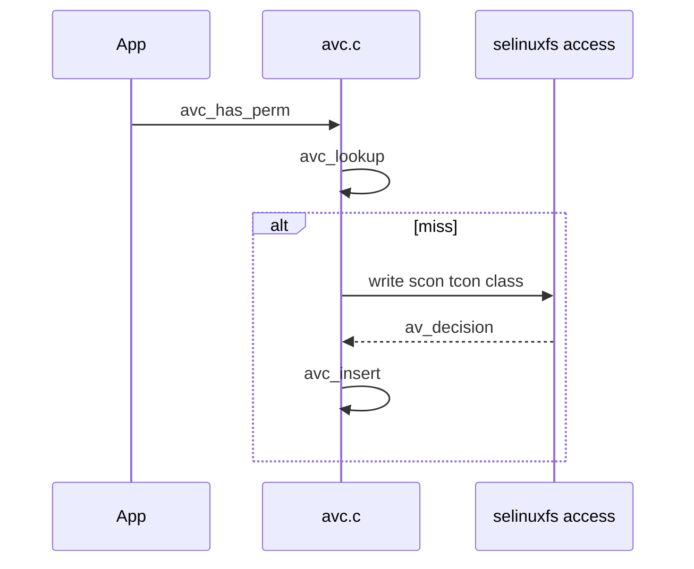

# 第13章 AVC と compute_av

> 本章で読むソース
>
> - [`libselinux/src/avc.c`](https://github.com/SELinuxProject/selinux/blob/3.10/libselinux/src/avc.c)
> - [`libselinux/src/compute_av.c`](https://github.com/SELinuxProject/selinux/blob/3.10/libselinux/src/compute_av.c)

## この章の狙い

userspace アクセスベクタキャッシュ（AVC）のルックアップと挿入、カーネル問い合わせ `security_compute_av_flags_raw` との連携を読む。
`avc_has_perm_noaudit` がキャッシュミス時にどうカーネルへ落ちるかを追う。

## 前提

第12章の `selinux_mnt` 初期化を理解していること。

## キャッシュ構造

固定スロット数と LRU ヒントを持つハッシュキャッシュである。

[`libselinux/src/avc.c` L16-L37](https://github.com/SELinuxProject/selinux/blob/3.10/libselinux/src/avc.c#L16-L37)

```c
#define AVC_CACHE_SLOTS		512
#define AVC_CACHE_MAXNODES	410

struct avc_entry {
	security_id_t ssid;
	security_id_t tsid;
	security_class_t tclass;
	struct av_decision avd;
	security_id_t	create_sid;
	int used;		/* used recently */
};

struct avc_cache {
	struct avc_node *slots[AVC_CACHE_SLOTS];
	uint32_t lru_hint;
	uint32_t active_nodes;
	uint32_t latest_notif;
};
```

## avc_lookup

キャッシュヒット条件は `requested` ビットが `avd.decided` に含まれることである。

[`libselinux/src/avc.c` L427-L447](https://github.com/SELinuxProject/selinux/blob/3.10/libselinux/src/avc.c#L427-L447)

```c
static int avc_lookup(security_id_t ssid, security_id_t tsid,
		      security_class_t tclass,
		      access_vector_t requested, struct avc_entry_ref *aeref)
{
	struct avc_node *node;
	int probes, rc = 0;

	avc_cache_stats_incr(cav_lookups);
	node = avc_search_node(ssid, tsid, tclass, &probes);

	if (node && ((node->ae.avd.decided & requested) == requested)) {
		avc_cache_stats_incr(cav_hits);
		avc_cache_stats_add(cav_probes, probes);
		aeref->ae = &node->ae;
		goto out;
	}

	avc_cache_stats_incr(cav_misses);
	rc = -1;
      out:
	return rc;
}
```

## security_compute_av_flags_raw

キャッシュミス時は `selinux_mnt/access` へコンテキストとクラスを書き込み、カーネル応答を読む。

[`libselinux/src/compute_av.c` L13-L33](https://github.com/SELinuxProject/selinux/blob/3.10/libselinux/src/compute_av.c#L13-L33)

```c
int security_compute_av_flags_raw(const char * scon,
				  const char * tcon,
				  security_class_t tclass,
				  access_vector_t requested,
				  struct av_decision *avd)
{
	char path[PATH_MAX];
	char *buf;
	size_t len;
	int fd, ret;
	security_class_t kclass;

	if (!selinux_mnt) {
		errno = ENOENT;
		return -1;
	}

	snprintf(path, sizeof path, "%s/access", selinux_mnt);
	fd = open(path, O_RDWR | O_CLOEXEC);
	if (fd < 0)
		return -1;
```

## avc_has_perm_noaudit の統合

エントリ参照の再利用、lookup、compute、insert を1関数にまとめる。

[`libselinux/src/avc.c` L746-L799](https://github.com/SELinuxProject/selinux/blob/3.10/libselinux/src/avc.c#L746-L799)

```c
int avc_has_perm_noaudit(security_id_t ssid,
			 security_id_t tsid,
			 security_class_t tclass,
			 access_vector_t requested,
			 struct avc_entry_ref *aeref, struct av_decision *avd)
{
	struct avc_entry *ae;
	int rc = 0;
	struct avc_entry entry;
	access_vector_t denied;
	struct avc_entry_ref ref;

	if (avd)
		avd_init(avd);

	if (!avc_using_threads && !avc_app_main_loop) {
		(void) selinux_status_updated();
	}

	avc_get_lock(avc_lock);
	avc_cache_stats_incr(entry_lookups);
	ae = aeref->ae;
	if (ae) {
		if (ae->ssid == ssid &&
		    ae->tsid == tsid &&
		    ae->tclass == tclass &&
		    ((ae->avd.decided & requested) == requested)) {
			avc_cache_stats_incr(entry_hits);
			ae->used = 1;
		} else {
			avc_cache_stats_incr(entry_discards);
			ae = 0;
		}
	}

	if (!ae) {
		avc_cache_stats_incr(entry_misses);
		rc = avc_lookup(ssid, tsid, tclass, requested, aeref);
		if (rc) {
			rc = security_compute_av_flags_raw(ssid->ctx, tsid->ctx,
							   tclass, requested,
							   &entry.avd);
			if (rc && errno == EINVAL && !avc_enforcing) {
				rc = errno = 0;
				goto out;
			}
			if (rc)
				goto out;
			rc = avc_insert(ssid, tsid, tclass, &entry, aeref);
```

## 失効通知

`avc_insert` は `latest_notif` より古い seqno を拒否し、ポリシー再ロード後の stale エントリ混入を防ぐ。

[`libselinux/src/avc.c` L476-L479](https://github.com/SELinuxProject/selinux/blob/3.10/libselinux/src/avc.c#L476-L479)

```c
	if (ae->avd.seqno < avc_cache.latest_notif) {
		avc_log(SELINUX_WARNING,
			"%s:  seqno %u < latest_notif %u\n", avc_prefix,
			ae->avd.seqno, avc_cache.latest_notif);
```



## 高速化・最適化の工夫

512 スロットのハッシュキャッシュとエントリ参照再利用がカーネル往復を削減する。
`selinux_status_updated` 連携でポリシー変更時のみキャッシュを失効させ、平常時はヒット率を維持する。

`security_compute_av` は `security_compute_av_flags` のラッパで、許可ビットマスクを返す。

[`libselinux/src/compute_av.c` L141-L150](https://github.com/SELinuxProject/selinux/blob/3.10/libselinux/src/compute_av.c#L141-L150)

```c
int security_compute_av(const char * scon,
			const char * tcon,
			security_class_t tclass,
			access_vector_t requested, struct av_decision *avd)
{
	struct av_decision lavd;
	int ret;

	ret = security_compute_av_flags(scon, tcon, tclass,
					requested, &lavd);
```

## まとめ

libselinux AVC はカーネル security server の前段キャッシュであり、compute_av がミス時の権威ある問い合わせ経路である。

## 関連する章

- [第12章 初期化](12-libselinux-init.md)
- [第14章 ラベリング](14-context-labeling.md)
