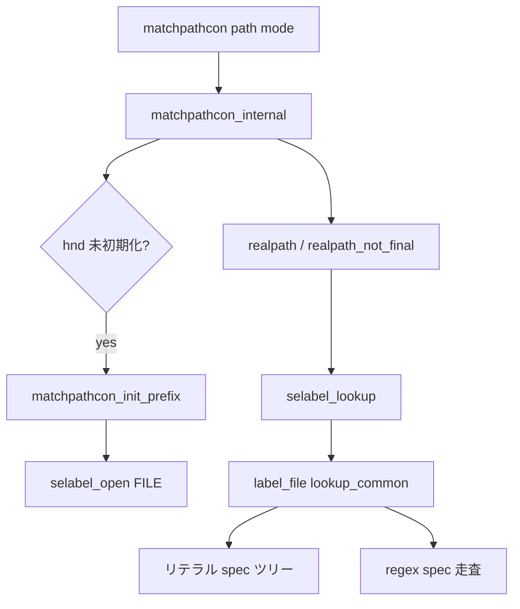

# 第14章 コンテキストとラベリング

> 本章で読むソース
>
> - [`libselinux/src/matchpathcon.c`](https://github.com/SELinuxProject/selinux/blob/3.10/libselinux/src/matchpathcon.c)
> - [`libselinux/src/label_file.c`](https://github.com/SELinuxProject/selinux/blob/3.10/libselinux/src/label_file.c)

## この章の狙い

パスから期待 SELinux コンテキストを解決する `matchpathcon` ファミリと、その背後にある `file_contexts` バックエンド（`label_file.c`）の照合アルゴリズムを追う。
`restorecon` や `setfiles` が共有する selabel ハンドル初期化から、リテラル一致と正規表現一致の優先順位までを本章で扱う。

## 前提

- 第12章で `selinux_mnt` 初期化を読んでいること
- `file_contexts` がパスパターンとコンテキスト文字列の対応表であることを知っていること

## 全体の流れ



## ハンドル初期化

`matchpathcon_init_prefix` は `selabel_open(SELABEL_CTX_FILE, ...)` でファイルコンテキストバックエンドを開く。
パスと subset をオプションとして渡し、スレッド破棄用の pthread キーも一度だけ用意する。

[`libselinux/src/matchpathcon.c` L380-L394](https://github.com/SELinuxProject/selinux/blob/3.10/libselinux/src/matchpathcon.c#L380-L394)

```c
int matchpathcon_init_prefix(const char *path, const char *subset)
{
	if (!mycanoncon)
		mycanoncon = default_canoncon;

	__selinux_once(once, matchpathcon_init_once);
	__selinux_setspecific(destructor_key, /* some valid address to please GCC */ &selinux_page_size);

	options[SELABEL_OPT_SUBSET].type = SELABEL_OPT_SUBSET;
	options[SELABEL_OPT_SUBSET].value = subset;
	options[SELABEL_OPT_PATH].type = SELABEL_OPT_PATH;
	options[SELABEL_OPT_PATH].value = path;

	hnd = selabel_open(SELABEL_CTX_FILE, options, SELABEL_NOPT);
	return hnd ? 0 : -1;
}
```

`matchpathcon` 初回呼び出し時は `hnd` が NULL のため、上記初期化が遅延実行される。

## パス正規化

`matchpathcon_internal` はシンボリックリンクの最終成分を残すよう `realpath_not_final` を使い分ける。
通常ファイルは `realpath` で絶対パスへ揃えてから selabel へ渡す。

[`libselinux/src/matchpathcon.c` L468-L487](https://github.com/SELinuxProject/selinux/blob/3.10/libselinux/src/matchpathcon.c#L468-L487)

```c
static int matchpathcon_internal(const char *path, mode_t mode, char ** con)
{
	char stackpath[PATH_MAX + 1];
	char *p = NULL;
	if (!hnd && (matchpathcon_init_prefix(NULL, NULL) < 0))
			return -1;

	if (S_ISLNK(mode)) {
		if (!realpath_not_final(path, stackpath))
			path = stackpath;
	} else {
		p = realpath(path, stackpath);
		if (p)
			path = p;
	}

	return notrans ?
		selabel_lookup_raw(hnd, con, path, mode) :
		selabel_lookup(hnd, con, path, mode);
}
```

`realpath_not_final` は最後の `/` 以降を切り離し、親ディレクトリだけを `realpath` する。
シンボリックリンク先のコンテキストではなく、リンク自体のラベル付けに必要な挙動である。

[`libselinux/src/matchpathcon.c` L414-L437](https://github.com/SELinuxProject/selinux/blob/3.10/libselinux/src/matchpathcon.c#L414-L437)

```c
int realpath_not_final(const char *name, char *resolved_path)
{
	char *last_component;
	char *tmp_path, *p;
	size_t len = 0;
	int rc = 0;

	tmp_path = strdup(name);
	if (!tmp_path) {
		myprintf("symlink_realpath(%s) strdup() failed: %m\n",
			name);
		rc = -1;
		goto out;
	}

	last_component = strrchr(tmp_path, '/');

	if (last_component == tmp_path) {
		last_component++;
		p = strcpy(resolved_path, "");
	} else if (last_component) {
		*last_component = '\0';
		last_component++;
		p = realpath(tmp_path, resolved_path);
	} else {
		last_component = tmp_path;
		p = realpath("./", resolved_path);
	}
```

## file_contexts のパースと spec ツリー

`label_file.c` は `file_contexts` 各行を `process_line` で読み込み、リテラル用の木構造と正規表現 spec の配列へ格納する。
`free_spec_node` が示すように、ノードは `literal_specs` と `regex_specs` の2系統を持つ。

[`libselinux/src/label_file.c` L37-L52](https://github.com/SELinuxProject/selinux/blob/3.10/libselinux/src/label_file.c#L37-L52)

```c
void free_spec_node(struct spec_node *node)
{
	for (uint32_t i = 0; i < node->literal_specs_num; i++) {
		struct literal_spec *lspec = &node->literal_specs[i];

		free(lspec->lr.ctx_raw);
		free(lspec->lr.ctx_trans);
		__pthread_mutex_destroy(&lspec->lr.lock);

		if (lspec->from_mmap)
			continue;

		free(lspec->literal_match);
		free(lspec->regex_str);
	}
	free(node->literal_specs);
```

## 照合と正規表現

`lookup` は `lookup_common` を呼び、リテラル一致を先に試す。
正規表現 spec は `compile_regex` で遅延コンパイルし、`regex_match` で部分一致も扱う。

[`libselinux/src/label_file.c` L2042-L2051](https://github.com/SELinuxProject/selinux/blob/3.10/libselinux/src/label_file.c#L2042-L2051)

```c
static struct selabel_lookup_rec *lookup(struct selabel_handle *rec,
					 const char *key, int type)
{
	struct lookup_result buf, *result;

	result = lookup_common(rec, key, type, false, &buf);
	if (!result)
		return NULL;

	return result->lr;
}
```

[`libselinux/src/label_file.c` L1693-L1703](https://github.com/SELinuxProject/selinux/blob/3.10/libselinux/src/label_file.c#L1693-L1703)

```c
			if (file_kind != LABEL_FILE_KIND_ALL && rspec->file_kind != LABEL_FILE_KIND_ALL && file_kind != rspec->file_kind)
				continue;

			if (compile_regex(rspec, errbuf, sizeof(errbuf)) < 0) {
				COMPAT_LOG(SELINUX_ERROR, "Failed to compile regular expression '%s':  %s\n",
					   rspec->regex_str, errbuf);
				goto fail;
			}

			rc = regex_match(rspec->regex, key, partial);
			if (rc == REGEX_MATCH || (partial && rc == REGEX_MATCH_PARTIAL)) {
```

`lookup_best_match` はエイリアス配列を渡されたとき、複数候補のうち最長プレフィックス一致を選ぶ。

## 検証 API

`selinux_file_context_verify` は実ファイルのラベルと `matchpathcon` 結果を比較する。
`selinux_file_context_cmp` は user 部分を除いた残りのコンテキスト文字列を `strcmp` する。

[`libselinux/src/matchpathcon.c` L510-L528](https://github.com/SELinuxProject/selinux/blob/3.10/libselinux/src/matchpathcon.c#L510-L528)

```c
int selinux_file_context_cmp(const char * a,
			     const char * b)
{
	const char *rest_a, *rest_b;	/* Rest of the context after the user */
	if (!a && !b)
		return 0;
	if (!a)
		return -1;
	if (!b)
		return 1;
	rest_a = strchr(a, ':');
	rest_b = strchr(b, ':');
	if (!rest_a && !rest_b)
		return 0;
	if (!rest_a)
		return -1;
	if (!rest_b)
		return 1;
	return strcmp(rest_a, rest_b);
}
```

## 高速化・最適化の工夫

`file_contexts` の mmap とリテラル spec ツリーにより、完全一致パスはハッシュ木を辿るだけで解決できる。
正規表現は初回マッチ時にだけコンパイルし、以降はキャッシュされた `regex` オブジェクトを再利用する。
`matchpathcon` 側のグローバル `hnd` はプロセス内で共有され、`file_contexts` の再パースを避ける。

## まとめ

パスベースのラベル付けは `matchpathcon` が入口となり、実体は `label_file.c` の spec 木と正規表現照合が担う。
restorecon 系ツールも同じ selabel バックエンドを共有する。

## 関連する章

- [第18章 restorecon](../part06-utils/18-restorecon-setfiles.md)
- [第13章 AVC](13-avc-compute-av.md)
