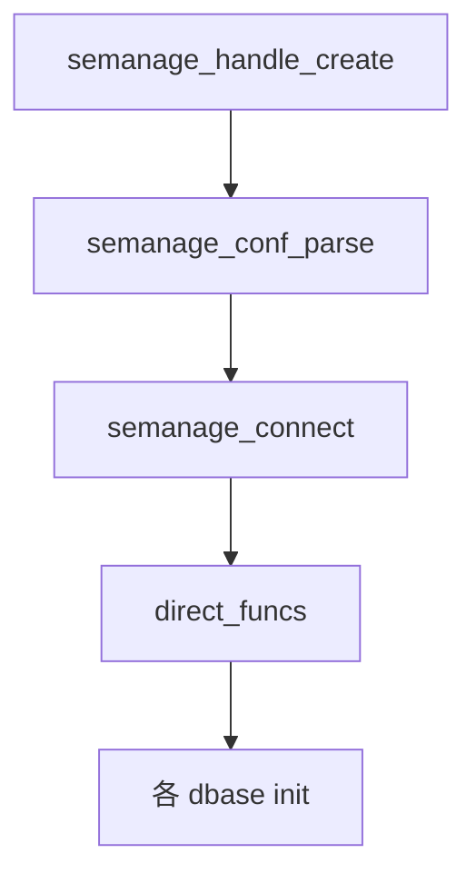

# 第15章 semanage_handle と接続

> 本章で読むソース
>
> - [`libsemanage/src/handle.c`](https://github.com/SELinuxProject/selinux/blob/3.10/libsemanage/src/handle.c)
> - [`libsemanage/src/direct_api.c`](https://github.com/SELinuxProject/selinux/blob/3.10/libsemanage/src/direct_api.c)

## この章の狙い

`semanage_handle_t` の生成、設定読み込み、`semanage_connect` による direct 接続と関数テーブル設定を読む。
v3.10 で実装されている direct API のみに焦点を当て、トランザクション API の前提を理解する。

## 前提

`/etc/selinux/semanage.conf` とモジュールストアのディレクトリ構造を知っていること。

## ハンドル生成

`semanage_handle_create` は `semanage_conf_path` で設定ファイルを見つけ、`semanage_handle_create_with_path` へ委譲する。

[`libsemanage/src/handle.c` L111-L124](https://github.com/SELinuxProject/selinux/blob/3.10/libsemanage/src/handle.c#L111-L124)

```c
semanage_handle_t *semanage_handle_create(void)
{
	semanage_handle_t *sh = NULL;
	char *conf_name = NULL;

	if ((conf_name = semanage_conf_path()) == NULL)
		goto err;

	if ((sh = semanage_handle_create_with_path(conf_name)) == NULL)
		goto err;

	free(conf_name);

	return sh;
```

## 既定フラグ

新規ハンドルは `do_rebuild=0`、`do_reload` は SELinux 有効時に真、各種 dbase は未接続状態である。

[`libsemanage/src/handle.c` L82-L92](https://github.com/SELinuxProject/selinux/blob/3.10/libsemanage/src/handle.c#L82-L92)

```c
	/* By default do not rebuild the policy on commit
	 * If any changes are made, this flag is ignored */
	sh->do_rebuild = 0;

	sh->commit_err = 0;

	/* By default always reload policy after commit if SELinux is enabled. */
	sh->do_reload = (is_selinux_enabled() > 0);

	/* By default always check the file contexts file. */
	sh->do_check_contexts = 1;
```

## direct 接続

`semanage_direct_connect` はストア存在確認のあと `sh->funcs = &direct_funcs` を設定し、各 dbase を初期化する。

[`libsemanage/src/direct_api.c` L144-L169](https://github.com/SELinuxProject/selinux/blob/3.10/libsemanage/src/direct_api.c#L144-L169)

```c
int semanage_direct_connect(semanage_handle_t * sh)
{
	const char *path;
	struct stat sb;

	if (semanage_check_init(sh, sh->conf->store_root_path))
		goto err;

	if (sh->create_store)
		if (semanage_create_store(sh, 1))
			goto err;

	sh->u.direct.translock_file_fd = -1;
	sh->u.direct.activelock_file_fd = -1;

	/* set up function pointers */
	sh->funcs = &direct_funcs;

	/* Object databases: local modifications */
	if (user_base_file_dbase_init(sh,
				      semanage_path(SEMANAGE_ACTIVE,
						    SEMANAGE_USERS_BASE_LOCAL),
				      semanage_path(SEMANAGE_TMP,
						    SEMANAGE_USERS_BASE_LOCAL),
				      semanage_user_base_dbase_local(sh)) < 0)
		goto err;
```

## トランザクション開始

`semanage_begin_transaction` は `begin_trans` でサンドボックスを用意する（第17章）。

[`libsemanage/src/handle.c` L387-L403](https://github.com/SELinuxProject/selinux/blob/3.10/libsemanage/src/handle.c#L387-L403)

```c
int semanage_begin_transaction(semanage_handle_t * sh)
{
	assert(sh != NULL && sh->funcs != NULL
	       && sh->funcs->begin_trans != NULL);
	if (!sh->is_connected) {
		ERR(sh, "Not connected.");
		return -1;
	}
	if (sh->is_in_transaction) {
		return 0;
	}

	if (sh->funcs->begin_trans(sh) < 0) {
		return -1;
	}
	sh->is_in_transaction = 1;
	return 0;
}
```



## semanage_connect

v3.10 では `SEMANAGE_CON_DIRECT` のみ実装され、`semanage_direct_connect` へ委譲する。
リモート接続タイプはエラーで拒否される。

[`libsemanage/src/handle.c` L326-L340](https://github.com/SELinuxProject/selinux/blob/3.10/libsemanage/src/handle.c#L326-L340)

```c
int semanage_connect(semanage_handle_t * sh)
{
	assert(sh != NULL);
	switch (sh->conf->store_type) {
	case SEMANAGE_CON_DIRECT:{
			if (semanage_direct_connect(sh) < 0) {
				return -1;
			}
			break;
		}
	default:{
			ERR(sh,
			    "The connection type specified within your semanage.conf file has not been implemented yet.");
			return -1;
		}
	}
```

## ストア選択

`semanage_select_store` は接続前にストア名と接続種別を設定するだけで、実在確認は connect 時に行う。

[`libsemanage/src/handle.c` L272-L283](https://github.com/SELinuxProject/selinux/blob/3.10/libsemanage/src/handle.c#L272-L283)

```c
			   enum semanage_connect_type storetype)
{

	assert(sh != NULL);

	/* This just sets the storename to what the user requests, no
	   verification of existence will be done until connect */
	free(sh->conf->store_path);
	sh->conf->store_path = strdup(storename);
	assert(sh->conf->store_path); /* no way to return failure */
	sh->conf->store_type = storetype;
}
```

## 高速化・最適化の工夫

関数テーブルにより API 層を接続方式から切り離し、direct 実装のホットパスを薄く保つ。
`do_reload` 既定で commit 後のカーネル反映を自動化し、呼び出し側の二重ロードを避ける。

## まとめ

semanage_handle は設定、接続、トランザクション状態の容器であり、v3.10 では direct_funcs が実体である。

## 関連する章

- [第16章 モジュールストア](16-module-store.md)
- [第17章 commit](17-policy-reload.md)
